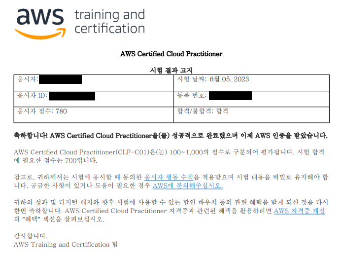

# AWS Cloud Practitioner 자격증 후기

AWS Cloud Practitioner 자격증은 AWS 자격증 중 가장 하위에 있는 기본 자격증입니다. 원래 그 위에 단계인 AWS SAA를 준비하다가 회사의 개인 목표 달성을 위해 가장 기본 자격증부터 땄습니다. 일단 결과는 합격으로 점수는 마지막에 나오겠지만 기본 자격증이라 만만하게 생각했는데 생각보다 난이도가 있는 자격증이라고 생각됩니다. 그럼 준비 방법과 합격 후기에 대해 말씀드리겠습니다.

## 공부 방법

### Udemy 강의

https://www.udemy.com/course/best-aws-certified-cloud/

저는 SAA를 먼저 준비했기 때문에 기본적인 내용은 알고 있어서 강의는 따로 듣지 않았습니다. 하지만 AWS에 대해 잘 알지 못하고 클라우드를 처음 접하는 사람이라면 강의를 듣는 것을 추천드립니다. AWS의 많은 기술들에 대한 간략한 내용들과 기초 지식을 공부할 수 있기 때문에 틀을 잡는데 많은 도움이 될 것으로 예상됩니다. 위 강의는 많은 사람들이 추천하고 평점도 좋은 udemy의 강의입니다.

### 덤프 문제 풀이

https://www.examtopics.com/exams/amazon/aws-certified-cloud-practitioner/

강의를 들었다면 기본적인 내용들을 공부했으니 모든 자격증에서 제일 중요한 덤프 문제 풀이입니다. 사실 위에서 나오는 문제들보다 실제 시험에서 풀었던 문제들이 좀 더 난의도가 높은 느낌이긴 합니다. 하지만 그래도 합격은 할 수 있는 정도의 문제들이 나오기 때문에 해당 문제를 풀면서 틀리고 모르는 개념들을 잡아가면 충분히 합격할 수 있을 것으로 예상됩니다.

https://net-gate.tistory.com/83?category=981312

한글로 해석해서 정리해놓은 블로그 글입니다.

### 그외 참고 사항

https://tbvjrornfl.tistory.com/188

https://mk-jung.tistory.com/190

- 가장 정리가 잘 된 블로그입니다. 해당 내용들을 보면서 정리하면 좋을 것 같습니다.

## 합격 후기

우선 저는 커트라인이 700점인데 780점으로 합격했습니다. 저는 풀면서 헷갈리는 문제가 많아 떨어진 줄 알았는데 아슬아슬하게 합격했습니다. 준비가 부족해서 그런 것으로 예상되고 위에 공부방법에는 안썼지만 aws 백서나 aws support 플랜, 서비스들의 과금 방식 등을 좀 더 공부했으면 더 높은 점수로 합격하지 않았을까 생각됩니다. 이러나 저러나 자격증은 합격만 하면 됩니다. 위에 계속 생각보다 어렵다고는 했지만 **그래도 2주만 기본적인 내용들 공부하고 덤프만 열심히 풀면 충분히 합격할 수 있는 시험**입니다. 모두 합격하시길 바라겠습니다.

