# A Cloud Guru 실습

> https://learn.acloud.guru 사이트 실습

## 목차

- [Introduction to AWS Identity and Access Management(IAM)](#introduction-to-aws-identity-and-access-managementiam)
- [Launching an EC2 instance in a Custom Virtual Private Cloud(VPC)](#launching-an-ec2-instance-in-a-custom-virtual-private-cloudvpc)
- [Creating and Working with an EC2 Instance in AWS](#creating-and-working-with-an-ec2-instance-in-aws)
- [Creating an Auto Scaling Group and Application Load Balancer in AWS](#creating-an-auto-scaling-group-and-application-load-balancer-in-aws)
- [Working with Docker Containers](#working-with-docker-containers)
- [Auto Scaling Group and Application Load Balancer(NGINX)](#auto-scaling-group-and-application-load-balancernginx)
- [Using EC2 Roles and Instance Profiles in AWS](#using-ec2-roles-and-instance-profiles-in-aws)
- [Creating an EC2 Instance with Lambda in AWS](#creating-an-ec2-instance-with-lambda-in-aws)
- [Creating a Basic Lambda Function to Shut Down an EC2 Instance](#creating-a-basic-lambda-function-to-shut-down-an-ec2-instance)
- [Creating and Subscribing to AWS SNS Topics](#creating-and-subscribing-to-aws-sns-topics)
- [Rolling Updates to a Highly Distributed Web Application with AWS CodeDeploy](#rolling-updates-to-a-highly-distributed-web-application-with-aws-codedeploy)
- [Working with a DevOps CI/CD Pipeline in aws](#working-with-a-devops-cicd-pipeline-in-aws)
- [AWS DynamoDB in the Console - Creating Tables, Items, and Indexes](#aws-dynamodb-in-the-console---creating-tables-items-and-indexes)


---

## Introduction to AWS Identity and Access Management(IAM)

- IAM을 이용하여 사용자 및 그룹 관리와 IAM 정책을 이용한 액세스 할당 방법 실습

  

### Environment Walkthrough

- **Explore the Users**

  - IAM 선택

    

  - User -> user-1 선택

    

  - ARN(Amazon Resource Name)과 경로, 생성시간 확인 가능

  - 권한과 그룹 메뉴 확인

    - user-1에는 할당된 권한은 없고 소속된 그룹 없음

      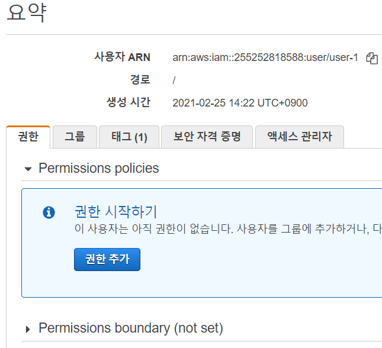 

  - 보안 자격 증명 메뉴에서 access key와 SSH public key, AWS CodeCommit을 위한 HTTPS Git credentials 확인 가능

  - 액세스 관리자에서는 사용자가 언제 어떤 서비스에 접근했는지 확인 가능

- **Explore the Groups**

  - 본 실습에서는 3가지 그룹 확인

    - EC2-Admin : EC2 인스턴스를 보고 시작하고 중지할 수 있는 권한을 제공
    - EC2-Support : EC2 인스턴스에 대한 읽기 권한만을 제공
    - S3-Support : S3에 대한 읽기 권한만을 제공

  - 그룹 메뉴 선택

    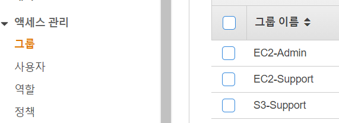

    - 여기서 아무 그룹을 선택해 연결된 정책 확인
    - 관리형 정책
      - AWS 또는 AWS 계정 내 관리자가 사전 구축한 사용자 및 그룹간에 공유되는 정책
    - 인라인 정책
      - 일회성 상황에서 일반적으로 사용되는 하나의 사용자 또는 그룹에만 할당된 정책

  - EC2-Admin의 권한확인

    - ec2-admin 정책 확인

    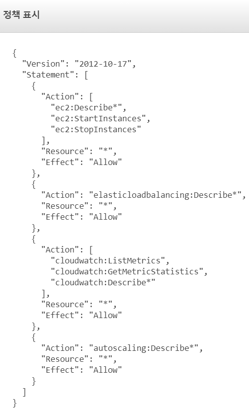

    - 이 정책을 통해 EC2 인스턴스를 보고, 시작하고 중지하고 탄력적 로드밸런서를 확인하고 지표를 나열하고 통계를 가져올 수 있는 권한을 가짐. Auto Scaling 서비스에도 동일한 권한 적용

  - EC2-Support 권한 및 정책 확인

    

    - 이 그룹은 EC2 인스턴스, 탄력적 로드밸런서, Cloud Watch 지표및 Auto Scaling 구성을 확인만 가능

### Add Users to Groups

- S3-Support 선택

  - 사용자 - 그룹에 사용자 추가

  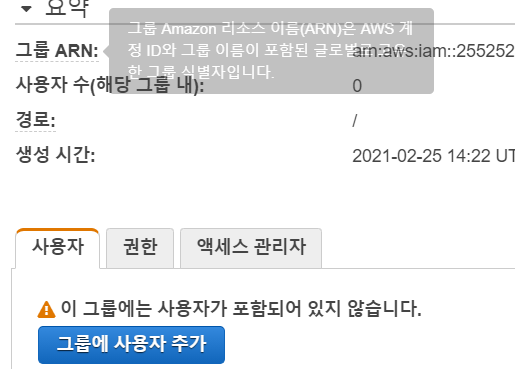

- user-1 선택후 사용자 추가

  

### Use the IAM Sign-In Link to Sign In As a User

#### Log In as user-1

- 대시보드의 IAM 사용자를 위한 로그인 URL 복사

  

- 새로운 창에서 url 오픈

  - user-1로 로그인

  - S3 이동

    

  - S3에서 버킷만들기 선택

    

  - 이름 입력 후 버킷 만들면 생성 실패

    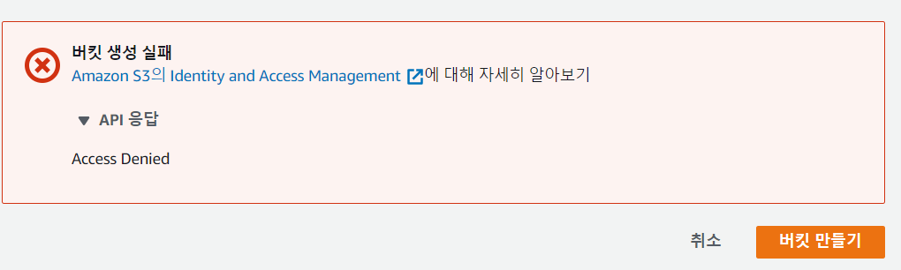

  - EC2 - Running Instance 확인

  

  - 실행 중 인스턴스 없음

- user-2와 user-3에서도 ec2와 s3확인


---

## Launching an EC2 instance in a Custom Virtual Private Cloud(VPC)

- AWS에서 EC2 인스턴스를 이용한 간단한 정적 웹사이트 실습
- VPC, zone, route, internet gateway, security group을 추가


### Create a VPC

- VPC이동 후 VPC 생성 클릭

  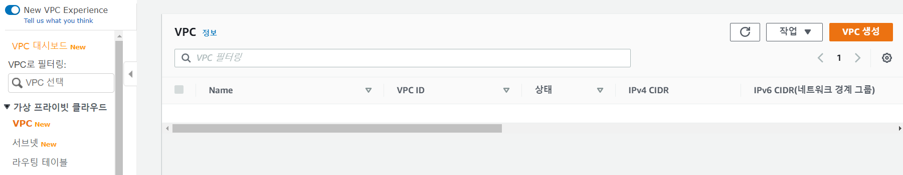

- 아래와 같이 설정 후 생성

  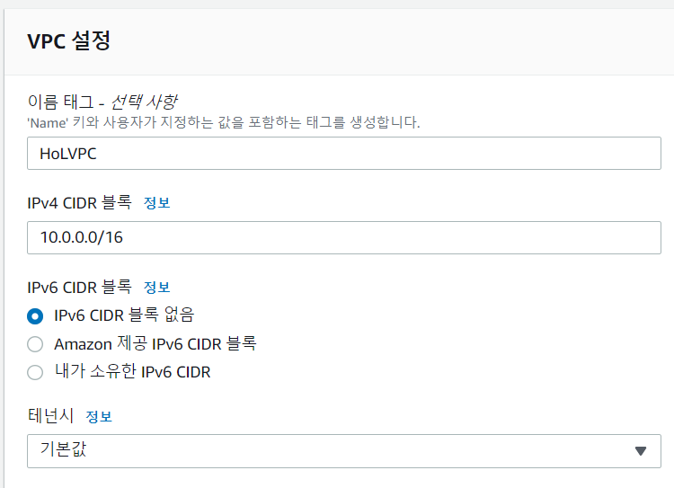

### Create Subnets

- 두 개의 서브넷을 만들고 하나는 public으로 하나는 private로 설정
- 유효한 CIDR 블록을 할당했는지 확인

#### Create Public Subnet

- 서브넷 메뉴에서 서브넷 생성 버튼 클릭

  

- VPC는 생성한 HoLVPC를 선택하고 이름과 가용 Zone과 IPv4 CIDR 블록 설정 후 생성

  

#### Create Private Subnet

- public subnet과 같이 이름, VPC, 가용 Zone, IPv4 CIDR 블록 설정 후 생성

  

### Create Routes and Internet Gateway

#### Auto-assign public IPv4 address

- 생성한 public subnet에서 시작한 인스턴스에 대한 퍼블릭 IPv4 주소를 자동으로 요청

- sn-public-a 선택 후 작업 - 자동 할당 IP 설정 수정 선택

  

- 퍼블릭 IPv4 주소 자동 할당 활성화 선택 후 저장

  

#### Configure Internet Gateway

- 인터넷과 통신하기 위한 Internet Gateway 생성

- 인터넷 게이트웨이 메뉴에서 생성

  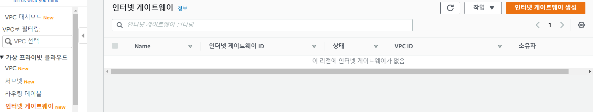

- 이름 설정 후 생성

  

- 생성한 인터넷 게이트웨이와 VPC 연결

  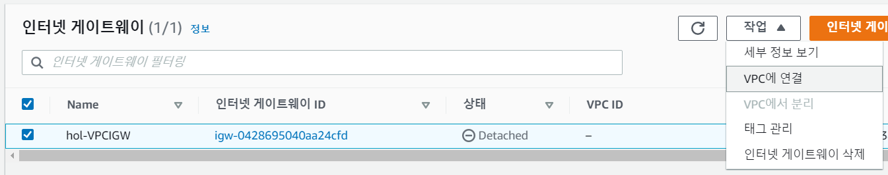

- 생성한 VPC 선택 후 연결

  

#### Configure Routing

- VPC에 새 라우팅 테이블을 생성해 퍼블릭 서브넷 용도로 생성한 sn-public-a를 외부의 인터넷과 연결되도록 설정

  - 기본 네트워크와 연결된 기본 라우팅 테이블이 이미 생성되어 있지만 이는 트래픽이 10.0.0.0/16 내의 다른 노드로 전달되도록 하는 테이블

    

  - 인터넷 외부로 트래픽이 전달되기 위한 새 테이블 생성

- 라우팅 테이블 메뉴에서 새로운 라우팅 테이블 생성

  

- 이름과 VPC를 설정하고 생성

  

- 새로 생성한 라우팅 테이블을 선택해 라우팅 편집 클릭

  

- 라우팅 추가를 누르고 모든 트래픽을 인터넷 게이트웨이로 향하게 설정

  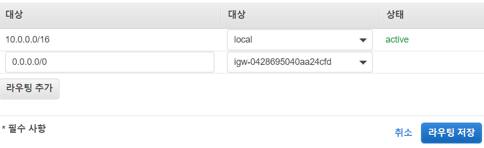

#### Associate with Subnets

- 서브넷 연결 편집 선택

  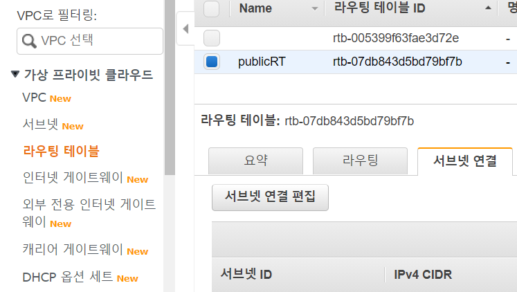

- sn-public-a 서브넷 연결

  

### Launch EC2 Instance in Public Subnet

- EC2 - 인스턴스 - 인스턴스 시작 선택

  

- Amazon Linux 2 AMI 선택

  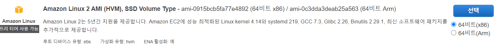

- t2.micro 선택

  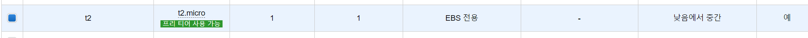

- 서브넷은 sn-public-a로 설정하고 서브넷 사용 설정(활성화)

  

- 새 보안 그룹의 이름과 설명을 주고 검토및시작

  

- 새 키 페어 생성 선택하고 이름 설정 후 키페어 다운로드

  

- 생성완료

#### Launch EC2 Instance in Private Subnet

- 퍼블릭 인스턴스와 유사하게 진행

- 네트워크 설정에서 sn-private-b로 설정하고 자동 할당 활성화

  

- 보안 그룹 설정

  

- 키페어 생성

  

- 인스턴스 생성 완료

### Access Instances

- SSH를 이용해 인스턴스 접속

#### SSH to Public Instance

- Public Subnet에 생성한 인스턴스 IP 복사

  

- 복사한 IP 입력하고 ec2-user 입력 그리고 다운로드한 키페어 설정

  

- 접속완료

  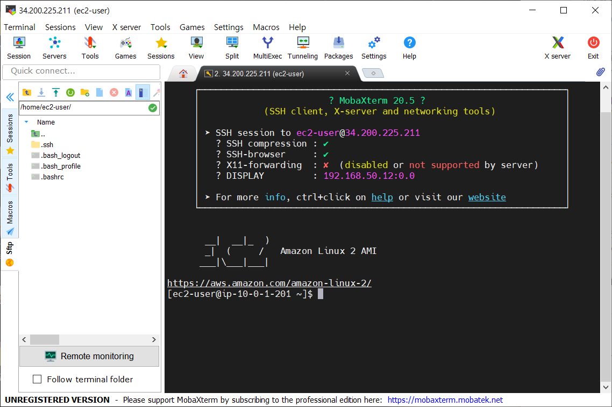

#### SSH to private instance

- 위와 같이 IP 복사 후 똑같이 접속

  

- 따로 인터넷게이트웨이와 연결이 안되있어 접속불가

  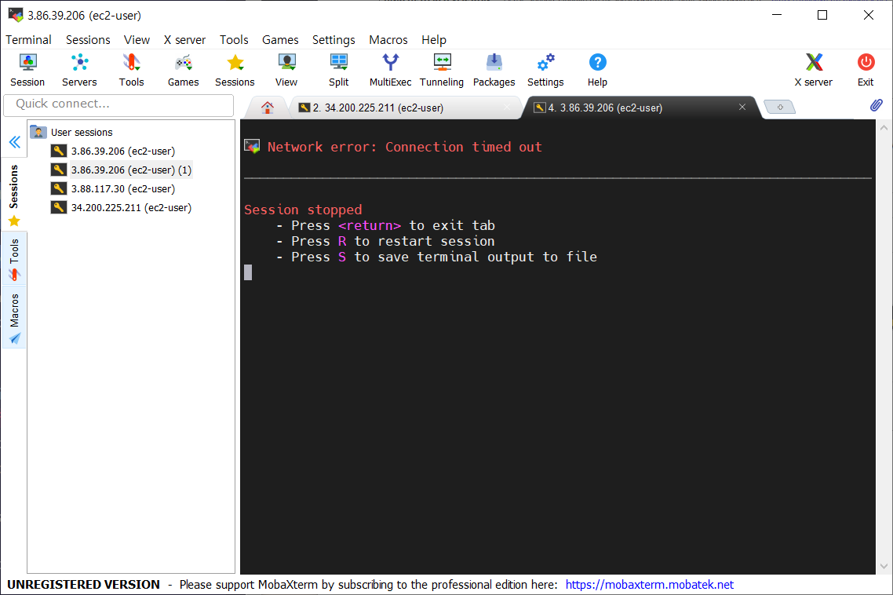


---

## Creating and Working with an EC2 Instance in AWS

- httpd를 포함한 EC2 인스턴스를 생성해 접근하는 실습


### Create a Default VPC

- 기본 VPC 생성

  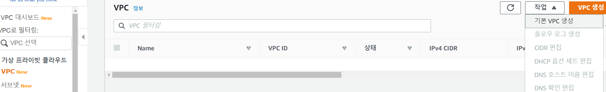

### Create an EC2 Instance

- EC2 인스턴스 생성

- Amazon Linux 2 AMI - t2.micro 선택

- 네트워크 설정

  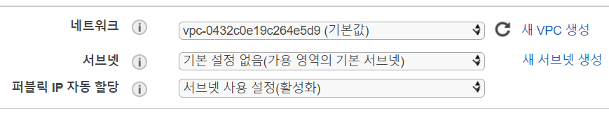

- 아래의 사용자 데이터 박스에 httpd를 위한 명령어 입력

  

- ```bash
  #!/bin/bash
  yum update -y
  yum install -y httpd
  yum install -y wget
  chkconfig httpd on
  cd /var/www/html
  service httpd start
  ```

- 태그추가

  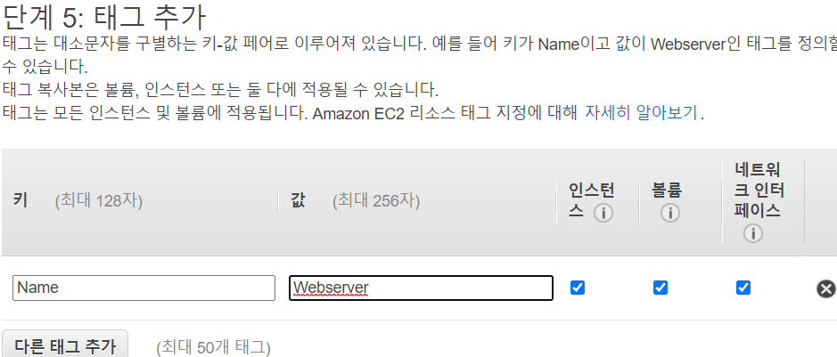

- 보안 그룹에 규칙 추가

  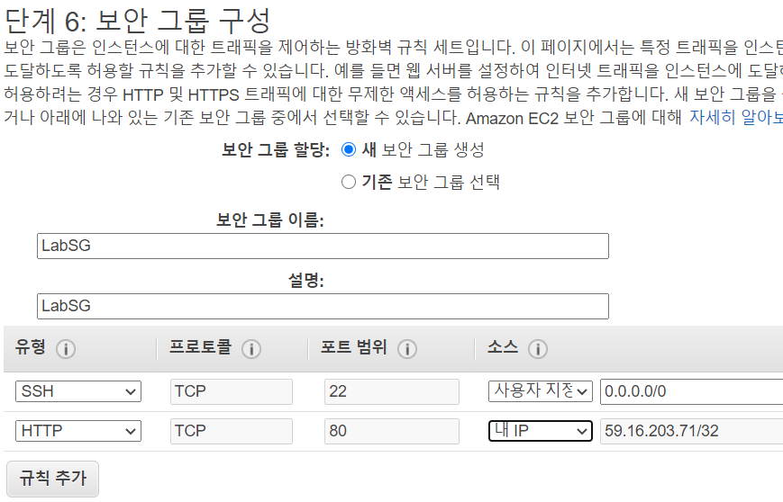

- 키페어다운로드

  

- 인스턴스 생성 완료

### Manage the EC2 Instance

- 생성한 인스턴스의 public DNS(IPv4) 복사

  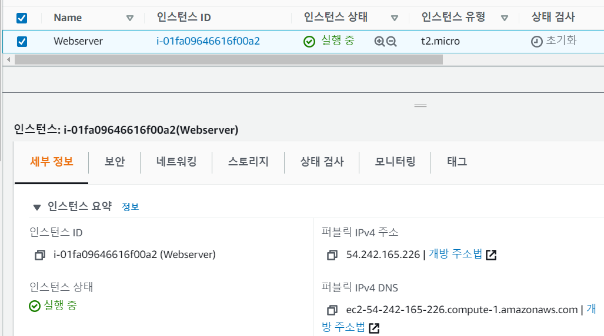

- 인터넷 브라우저를 통해 접속

  

- 인스턴스 상태 변경하며 실습

  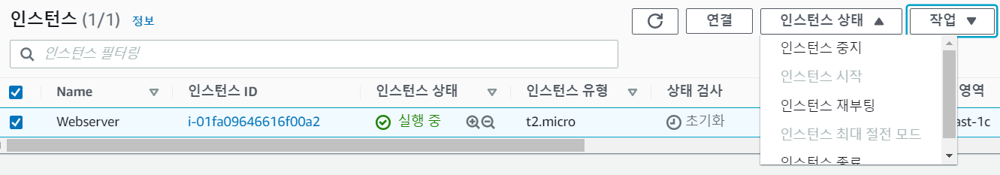


---

## Creating an Auto Scaling Group and Application Load Balancer in AWS

- Elastic Load Balancer와 Auto Scaling 그룹을 이용한 웹 서비스 설계

- 스트레스 테스트를 이용해 Auto Scaling 작동 테스트

  

### Create an Application Load Balancer

- EC2 콘솔 - Load Balancer - 로드밸런서 생성

  

- Application Load Balancer 선택

  

- 다음과 같이 구성

  

- 새 보안 그룹 구성하고 다음

- 

- 라우팅 구성과 고급상태설정하고 생성

  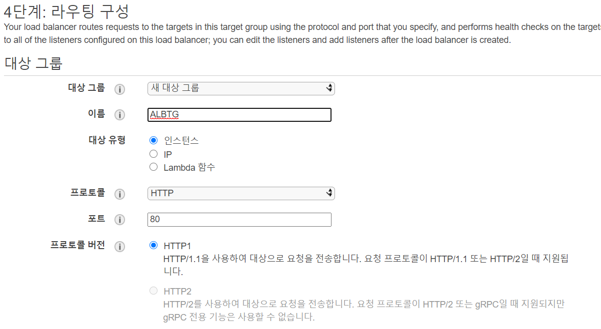

  

- 로드밸런서 생성 완료

  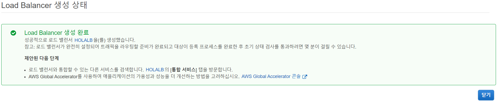

### Create a Launch Template

#### Create SSH Key Pair

- 키페어 생성

  

- pem으로 설정하고 생성

  

- 키 저장

#### Create Security Group for EC2 Instances

- 보안 그룹 생성

  

- 보안 그룹 이름과 인바운드 규칙 설정

  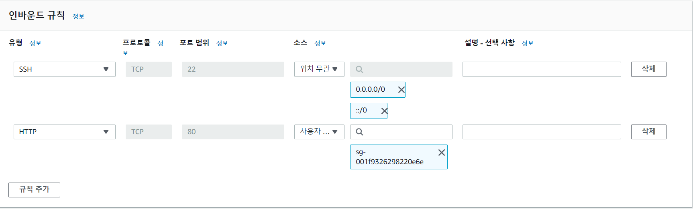

- 생성 완료

#### Create EC2 Instance Launch Template

- 시작 템플릿 생성

  

- 아래와 같이 설정

  

  

  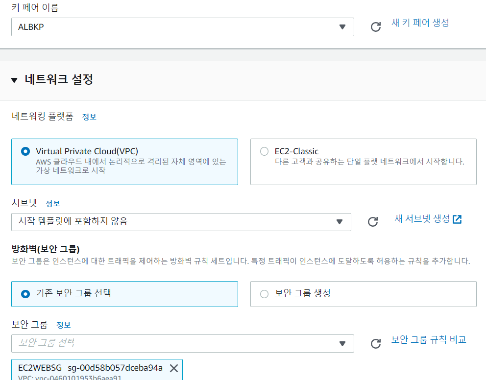

- 마지막 맨밑에 Advanced details section - user data box

  ```bash
  #!/bin/bash
  yum update -y
  yum install -y httpd
  yum install -y wget
  cd /var/www/html
  wget https://raw.githubusercontent.com/ACloudGuru-Resources/Course-Certified-Solutions-Architect-Associate/master/labs/creating-an-auto-scaling-group-and-app-load-balancer-aws/index.html
  wget https://raw.githubusercontent.com/ACloudGuru-Resources/Course-Certified-Solutions-Architect-Associate/master/labs/creating-an-auto-scaling-group-and-app-load-balancer-aws/acg.jpg
  service httpd start
  ```

  - 다음 내용 추가

- 생성완료

### Create an Auto Scaling Group

- 생성한 로드밸런서 active 상태인지 확인

  

- Auto Scaling 그룹 생성

  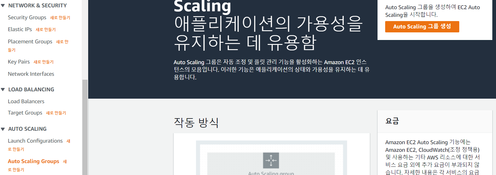

- 이름과 시작 템플릿 설정

  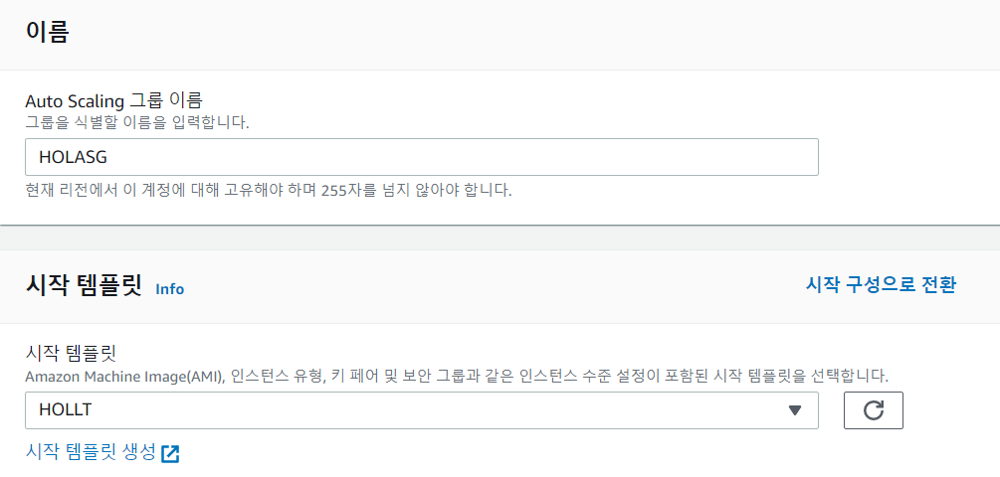

- 시작 템플릿 준수 선택 및 2개 서브넷 모두 선택

  

- 생성한 로드밸런서와 연결

  

  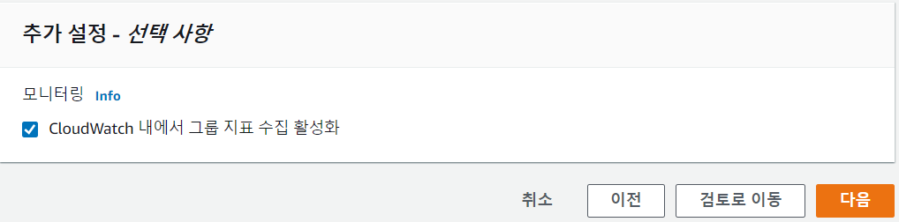

- 그룹 크기와 조정 사항 선택

  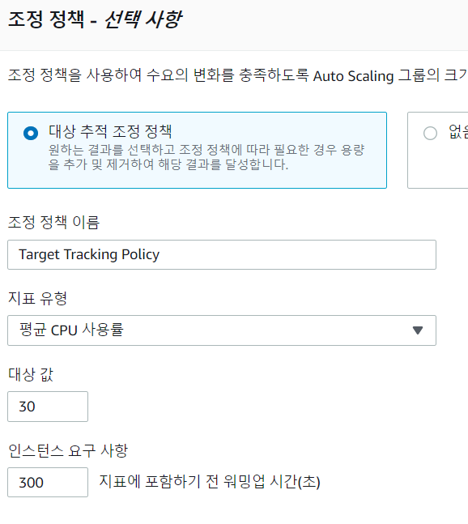

- 로드밸런서 DNS 주소 복사

  

- 접속 확인

  

### Test Horizontal Scaling

- 생성된 인스턴스 중 하나 접속

  

- 테스트를 위한 스트레스 어플리케이션 설치

  ```shell
  $ sudo amazon-linux-extras install epel -y
  $ sudo yum install -y stress
  ```

- 스트레스 테스트

  ```shell
  $ stress --cpu 2 --timeout 300
  ```

  

- CPU 사용률 높이기 전 인스턴스 2개

  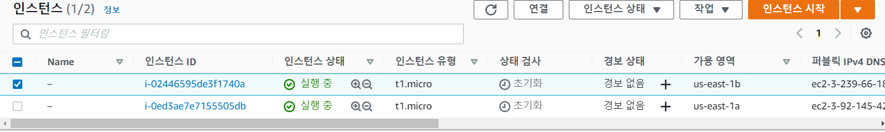

- 오토 스케일링을 통해 인스턴스 증가

  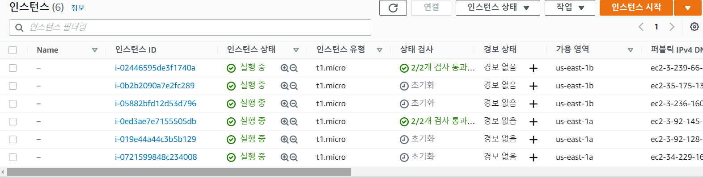


---

## Working with Docker Containers

- nginx 도커 이미지를 이용해 웹 서비스

### Create an Nginx Container

- ssh 로그인

  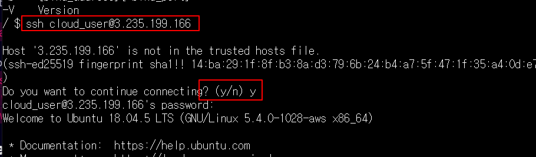

- run docker

  `$ docker run --name web -dt nginx`

- 실행되는 컨테이너와 이미지 확인

  `$ docker images`

  `$ docker ps`

  

- webfiles 밑에 default.conf 확인

  `$ cat webfiles/default.conf`

  

### Configure Nginx

- web 컨테이너에 /var/www/ 폴더 생성

  `$ docker exec web mkdir /var/www`

- default.conf 파일 복사

  `$ docker cp webfiles/default.conf web:/etc/nginx/conf.d/default.conf`

- webfiles/html 폴더 컨테이너의 /var/www/ 밑에 복사

  `$ docker cp webfiles /html web:/var/www/`

- 복사 확인

  `$ docker exec web ls /var/www/html`

  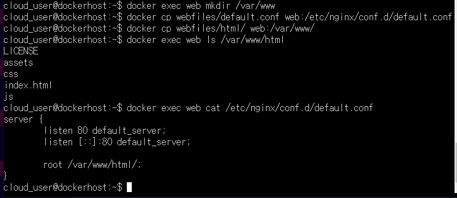

- /var/www/html 폴더 권한 변경

  `$ docker exec web chown -R nginx:nginx /var/www/html`

- reload docker

  `$ docker exec web nginx -s reload`

  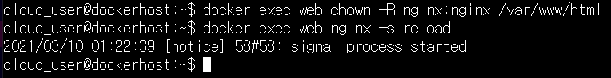

### Test and Publish the Website to Port 80

- 컨테이너 IP 확인

  `$ docker inspect web | grep IPAddress`

  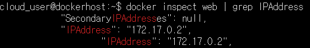

- curl을 통해 접속

  `$ curl 172.17.0.2`

  

- 변경한 컨테이너 새로운 이미지 생성

  `$ docker commit web web-image`

- 생성한 이미지 run

  `$ docker run -dt --name web01 -p 80:80 web-image`

- curl을 통해 확인

  `$ curl localhost`

  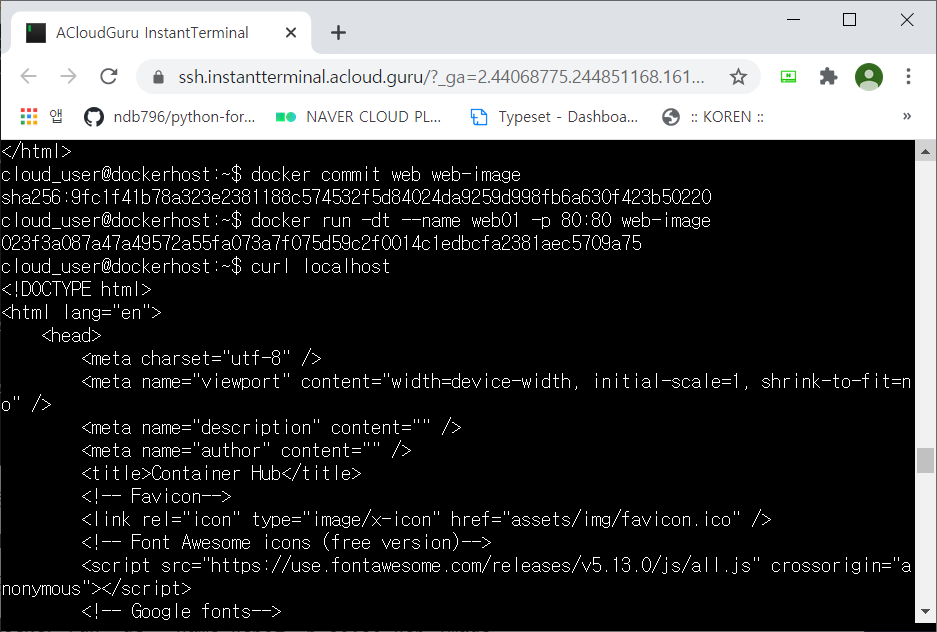

- ssh 로그인 IP로 웹에 접속

  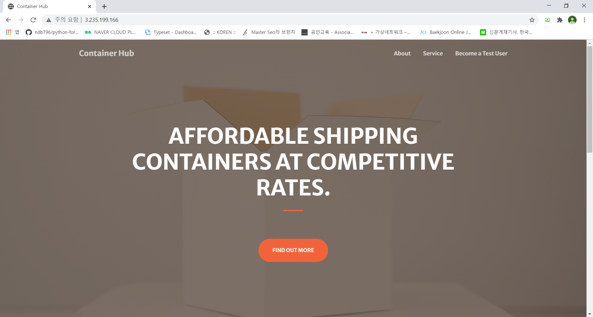

- 모든 응답이 80포트로 설정한 web01에서 응답

- web 컨테이너 필요없으므로 정지 및 삭제

  `$ docker stop web`

  `$ docker rm web`


---

## Auto Scaling Group and Application Load Balancer(NGINX)

- EC2에 NGINX를 이용한 웹을 구성하고 로드 밸런서와 오토 스케일링으로 처리

### EC2에 NGINX 설치 및 웹 구성

- 인스턴스 구성

  - ubuntu server 20.04 선택

  - 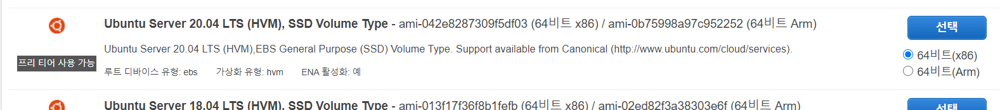

  - 인스턴스 구성

    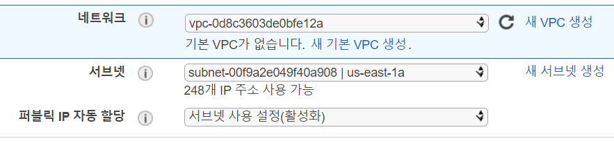

  - 보안 그룹에 HTTP 추가

    

  - 키페어 설정하고 인스턴스 생성

    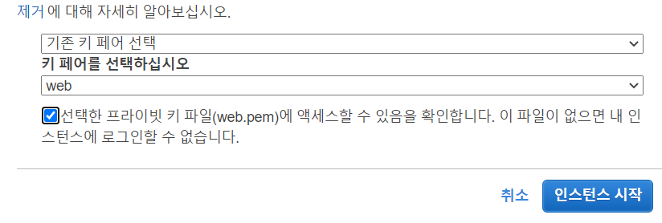

- nginx 설치 및 웹 구성

  - ip를 이용해 ssh 접속

    

  - web 폴더 생성

    `mkdir web`

  - react에서 생성한 build 폴더 옮기기

    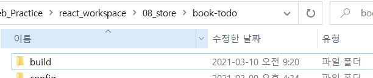

    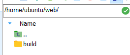

  - nginx 설치

    `sudo apt-get update`

    `sudo apt-get install nginx`

  - 옮긴 build에 있는 파일들 /var/www/html/ 밑으로 복사

    `sudo cp -r ./ /var/www/html/`

    

  - nginx 실행

    `sudo service nginx start`

  - ip 접속 확인

    

### 생성한 인스턴스를 이용해 AMI 이미지 생성 및 시작 템플릿 설치

- 이미지 생성

  - 이미지 생성 클릭

  

  - 이미지 이름 설정하고 생성

  

  - 생성한 이미지 상태 available 확인

  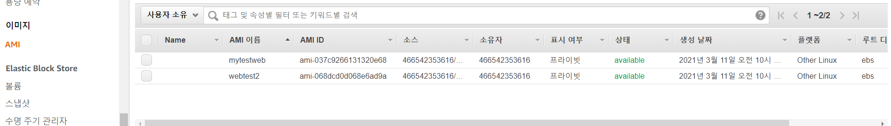

- 시작 템플릿 생성

  - 메뉴의 시작 템플릿 - 생성

    

  - 템플릿 설정

    

  - AMI는 만들어놓은 이미지 선택

    

  - 키페어, 보안그룹 모두 인스턴스와 동일하게

    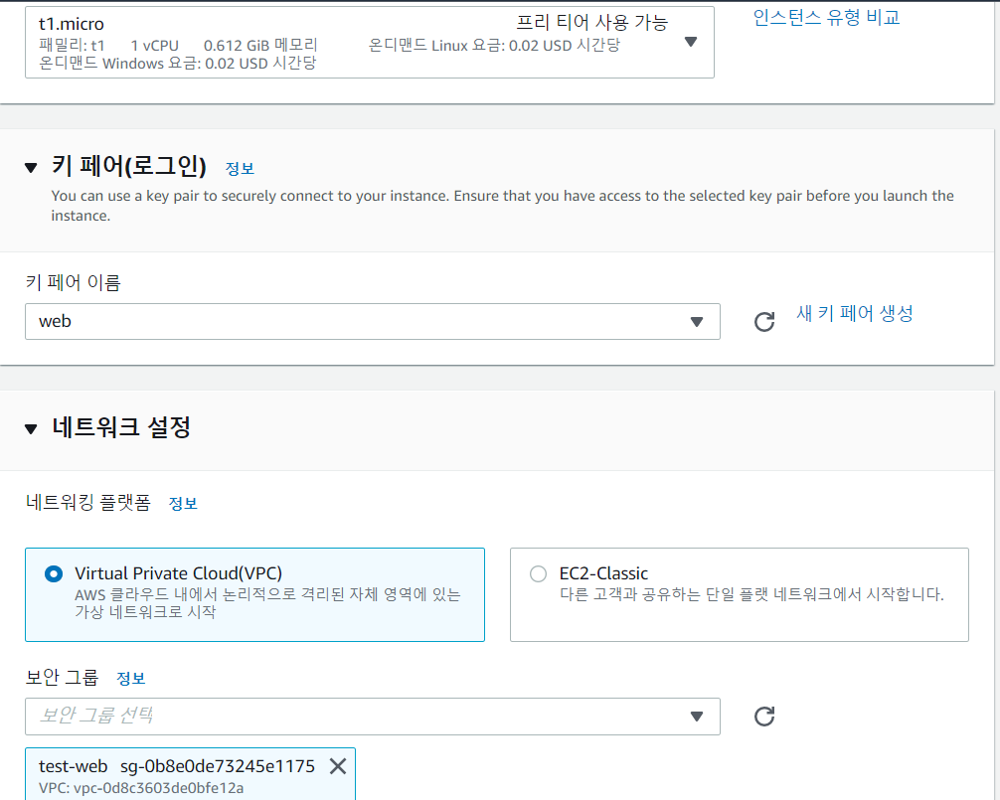

  - 템플릿 생성 완료

    

### 로드밸런서 생성

- 로드밸런서 생성 클릭

  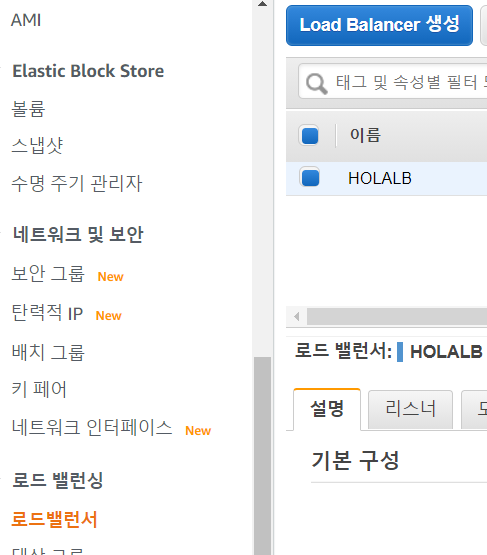

- Application Load Balancer 선택

  

- 기본 구성

  

  

- 보안 그룹 설정

  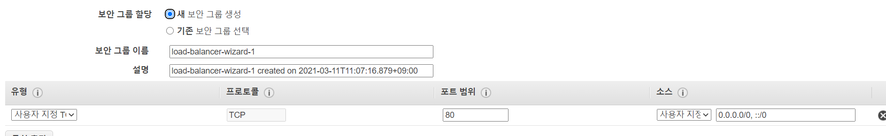

- 라우팅 구성

  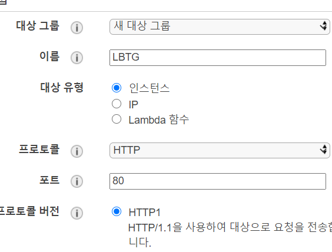

  

- 로드밸런서 생성 완료

  

- active 상태 확인

  

### 오토 스케일링 그룹 생성

- 그룹 생성 클릭

  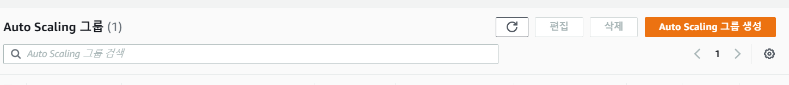

- 이름과 시작 템플릿 선택

  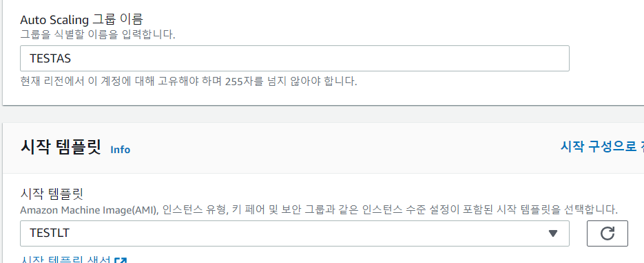

- 시작 템플릿 준수 선택, 네트워크 설정

  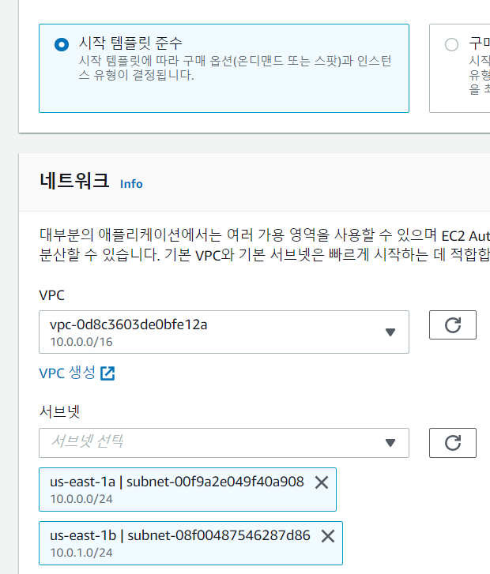

- 생성한 로드밸런서 선택

  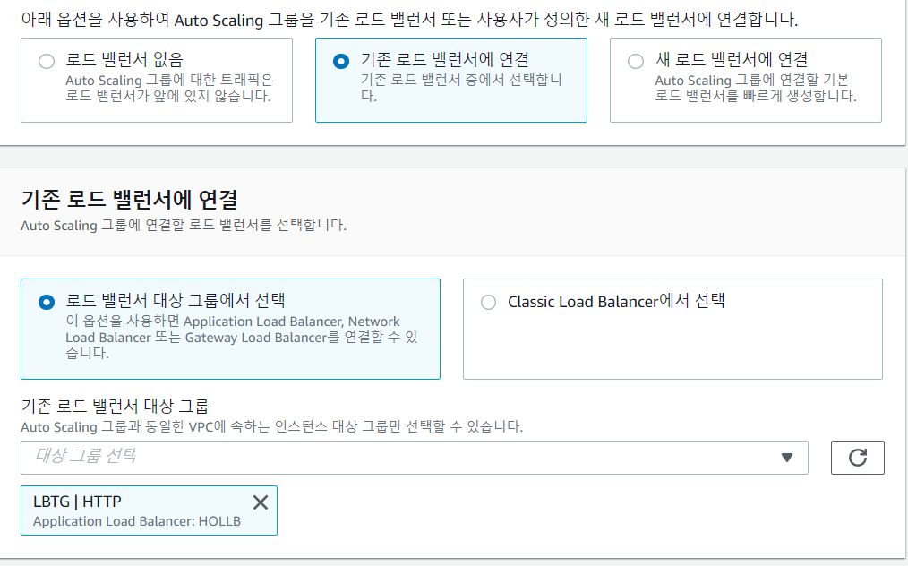

- 모니터링 활성화 선택하고 다음

  

- 그룹 크기 선택

  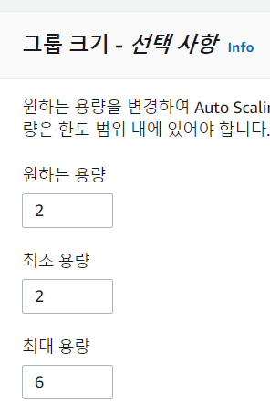

- 정책 설정

  

- Auto Scaling 그룹 생성 완료

  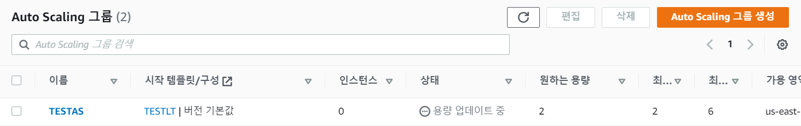

### 테스트

- 오토 스케일링 인스턴스 생성 완료 확인

  

  

- 로드밸런서 DNS 주소 확인

  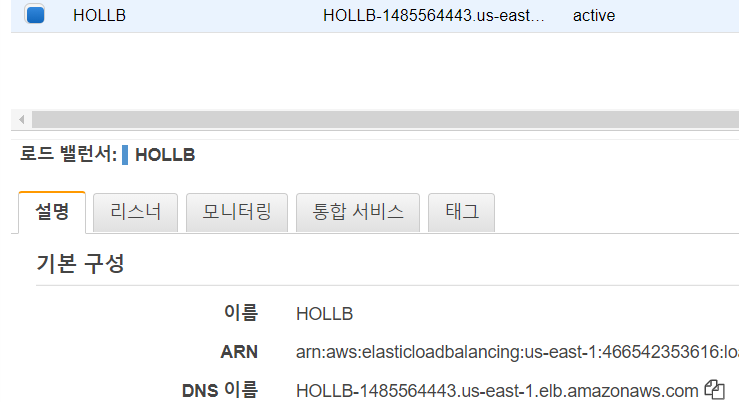

- DNS 주소로 접속, 웹 화면 구동 확인

  


---

## Using EC2 Roles and Instance Profiles in AWS

- 보안 자격증명을 관리할 필요없는 IAM을 이용하여 수동 관리없이 인스턴스 tempory credential을 자동으로 부여

  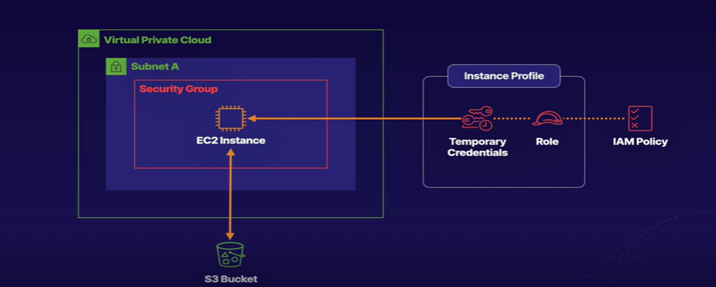


### Create a Trust Policy and Role Using the AWS CLI

#### Obtain the labreferences.txt File

- S3 콘솔에서 버킷 리스트 중 이름 중간에 *s3bucketlookupfiles* 들어간 버킷 선택

  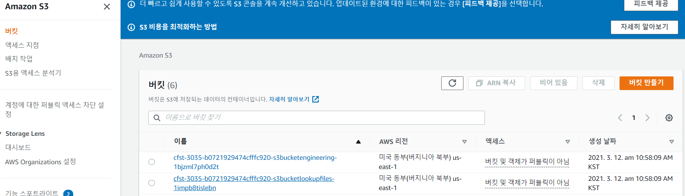

- labreferences.txt 선택

  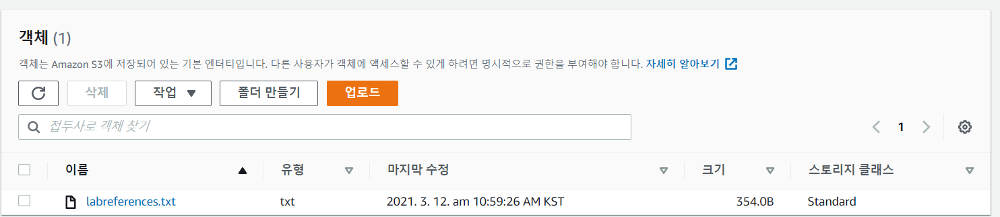

- 다운로드

  

#### Log in to Bastion Host and Set the AWS CLI Region and Output Type

- EC2 콘솔 - 인스턴스 - Bastion Host 인스턴스 IP 확인

  

- ssh로 접속

  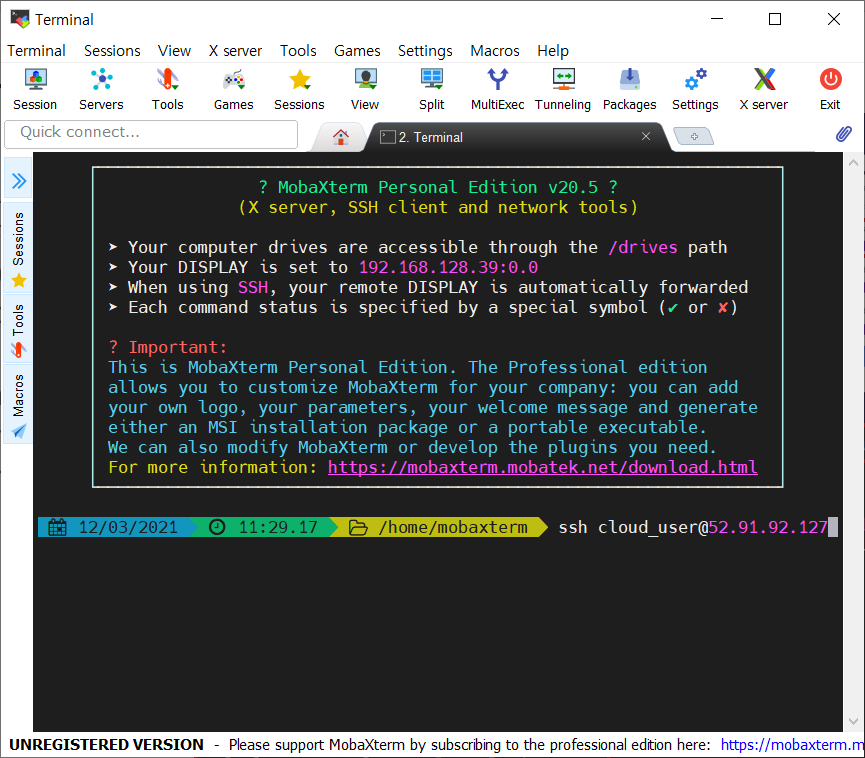

- 비밀번호는 lab 페이지에 있는 번호

  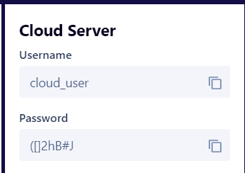

- 접속 완료

  

- AWS 설정 변경

  `$ aws configure`

  

#### Create IAM Trust Policy for an EC2 Role

- trust_policy_ec2.json 파일 생성(EC2 인스턴스에 대한 신뢰 정책)

  `$ vim trust_policy_ec2.json`

  ```json
  {
    "Version": "2012-10-17",
    "Statement": [
      {
        "Effect": "Allow",
        "Principal": {"Service": "ec2.amazonaws.com"},
        "Action": "sts:AssumeRole"
      }
    ]
  }
  ```

  

#### Create the DEV IAM Role

- DEV IAM 생성

  `$ aws iam create-role --role-name DEV_ROLE --assume-role-policy-document file://trust_policy_ec2.json`

  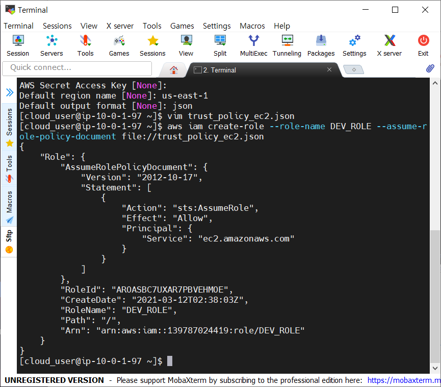

#### Create an IAM Policy Defining Read-Only Access Permissions to an S3 Bucket

- S3 Bucket에 대한 읽기 권한을 가진 IAM 정책 생성

- dev_s3_read_access.json 파일 생성

  - <DEV_S3_BUCKET_NAME>은 labreferences.txt파일에 있는 내용으로 변경

  `$ vim dev_s3_read_access.json`

  ```json
  {
      "Version": "2012-10-17",
      "Statement": [
          {
            "Sid": "AllowUserToSeeBucketListInTheConsole",
            "Action": ["s3:ListAllMyBuckets", "s3:GetBucketLocation"],
            "Effect": "Allow",
            "Resource": ["arn:aws:s3:::*"]
          },
          {
              "Effect": "Allow",
              "Action": [
                  "s3:Get*",
                  "s3:List*"
              ],
              "Resource": [
                  "arn:aws:s3:::<DEV_S3_BUCKET_NAME>/*",
                  "arn:aws:s3:::<DEV_S3_BUCKET_NAME>"
              ]
          }
      ]
  }
  ```

- DevS3ReadAccess 정책 생성

  `$ aws iam create-policy --policy-name DevS3ReadAccess --policy-document file://dev_s3_read_access.json`

  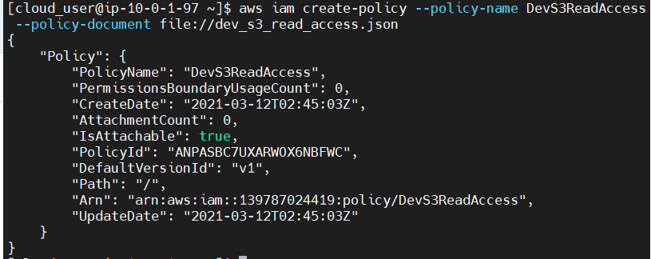

- ARN 복사해서 labreferencess.txt에 붙여넣기


### Create Instance Profile and Attach Role to an EC2 Instance

#### Attach Managed Policy to Role

- 관리 정책과 Role 연결

  - <DevS3ReadAccess_POLICY_ARN>은 마지막에 복사한 ARN 넣기

  `$ aws iam attach-role-policy --role-name DEV_ROLE --policy-arn "<DevS3ReadAccess_POLICY_ARN>"`

- 정책 연결 확인

  `$ aws iam list-attached-role-policies --role-name DEV_ROLE`

  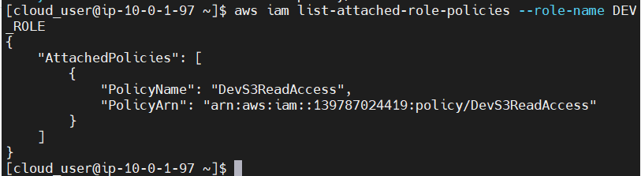

#### Create the Instance Profile and Add the `DEV_ROLE` via the AWS CLI

- 인스턴스 프로파일 DEV_PROFILE 생성 

  `$ aws iam create-instance-profile --instance-profile-name DEV_PROFILE`

  

- role 추가

  `$ aws iam add-role-to-instance-profile --instance-profile-name DEV_PROFILE --role-name DEV_ROLE`

- 설정 수정

  `$ aws iam get-instance-profile --instance-profile-name DEV_PROFILE`

  

#### Attach the DEV_PROFILE Role to an Instance

- EC2 - 인스턴스에서 Web Server 인스턴스 ID 복사

- 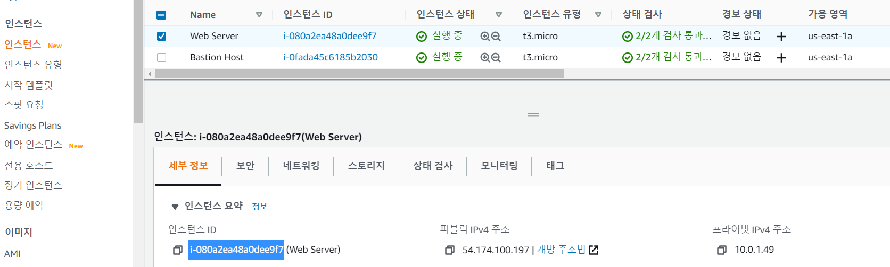

- 인스턴스와 DEV_PROFILE 연결

  - <LAB_WEB_SERVER_INSTANCE_ID>에는 복사한 인스턴스 ID 넣기

  `$ aws ec2 associate-iam-instance-profile --instance-id <LAB_WEB_SERVER_INSTANCE_ID> --iam-instance-profile Name="DEV_PROFILE"`

  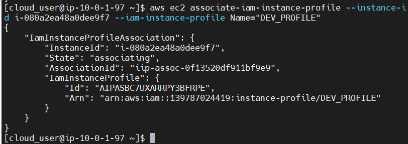

- 설정 확인

  `$ aws ec2 describe-instances --instance-ids <LAB_WEB_SERVER_INSTANCE_ID>`

- 출력에서 IamInstanceProfile 섹션을 찾고 Arn이 DEV_PROFILE로 끝나는지 확인

  

#### Test S3 Permissions via the AWS CLI

- Web Server 인스턴스 IP 복사

  

- ssh 접속

  - 비밀번호는 lab 페이지

  
  

- 인스턴스가 DEV-ROLE 역할을 하고있는지 확인

  `$ aws sts get-caller-identity`

  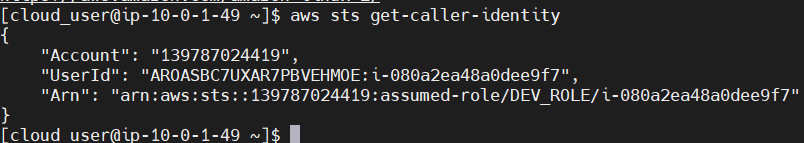

- buckets 리스트 확인

  `$ aws s3 ls`

  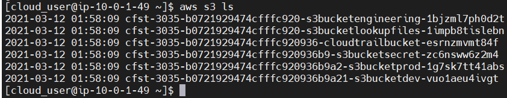

- 파일 리스트 중 s3bucketdev-가 들어간 버킷의 이름 복사해서 <s3bucketdev-123>에 넣기

  `$ aws s3 ls s3://<s3bucketdev-123>`

- 버킷 접속

  


### Create an IAM Policy and Role Using the AWS Management Console

#### Create Policy

- IAM - 정책 - 정책 생성

  

- JSON 탭 선택해서 밑에 내용 복사 붙여넣기

  - 이때 PROD_S3_BUCKET_NAME에는 labreferences.txt파일 내용  넣기

  ```json
  {
      "Version": "2012-10-17",
      "Statement": [
          {
            "Sid": "AllowUserToSeeBucketListInTheConsole",
            "Action": ["s3:ListAllMyBuckets", "s3:GetBucketLocation"],
            "Effect": "Allow",
            "Resource": ["arn:aws:s3:::*"]
          },
          {
              "Effect": "Allow",
              "Action": [
                  "s3:Get*",
                  "s3:List*"
              ],
              "Resource": [
                  "arn:aws:s3:::<PROD_S3_BUCKET_NAME>/*",
                  "arn:aws:s3:::<PROD_S3_BUCKET_NAME>"
              ]
          }
      ]
  }
  ```

  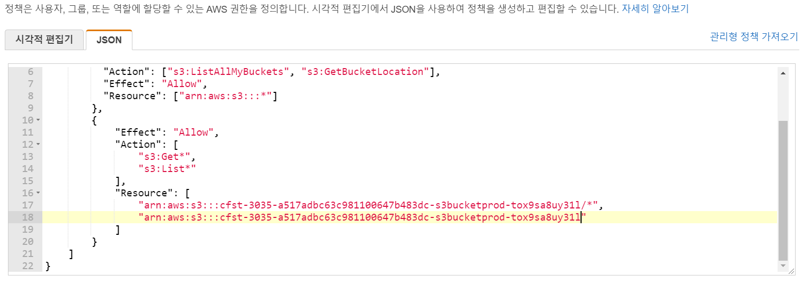

- 정책 이름 설정하고 정책 생성

  

#### Create Role

- 역할 - 역할 만들기 선택

  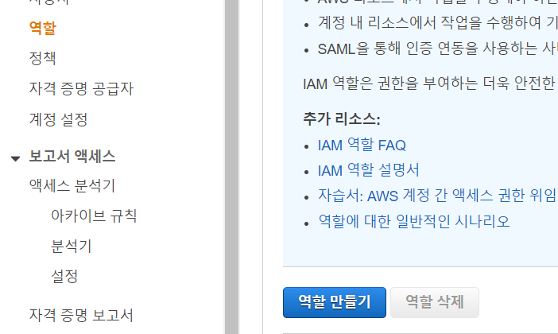

- EC2 선택하고 다음

  

- ProdS3ReadAccess 선택하고 다음

  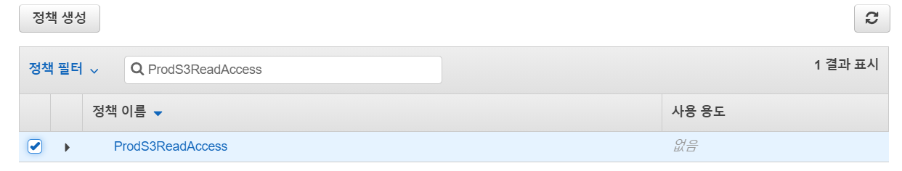

- 역할 이름 설정하고 생성 

  


### Attach IAM Role to an EC2 Inastance Using the AWS Management Console

- EC2 - 인스턴스에서 Web Server 인스턴스 선택

  

- 작업 - 보안 - IAM 역할 수정 선택

  

- PROD_ROLE 선택하고 저장

  

#### Test the Configuration

- Web Server 인스턴스 ssh 접속

  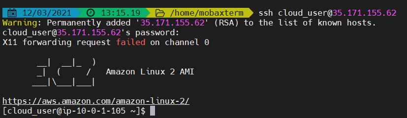

- 현재 사용중인 id와 Arn에 PROD_ROLE이 있는지 확인

  `$ aws sts get-caller-identity`

  

- 버킷 리스트 확인

  `$ aws s3 ls`

  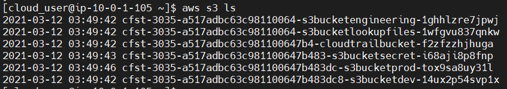

- 버킷 리스트 중에 s3bucketprod-이 들어간 버킷 확인

  - 접속 가능

  `$ aws s3 ls s3://<s3bucketprod-123>`

  

- 버킷 리스트 중 s3bucketsecret의 이름 확인해서 접속

  - 권한이 없어 접속 불가

  `$ aws s3 ls s3://<s3bucketsecret-123>`

  


---

## Creating an EC2 Instance with Lambda in AWS

- Lambda : 함수만으로 서비스를 구축할 수 있는 일종의 Serverless Architecture

- EC2 인스턴스를 생성하는 람다 함수를 파이썬으로 작성

- IAM 역할에 대한 사용자 지정 람다 실행 정책 생성 

  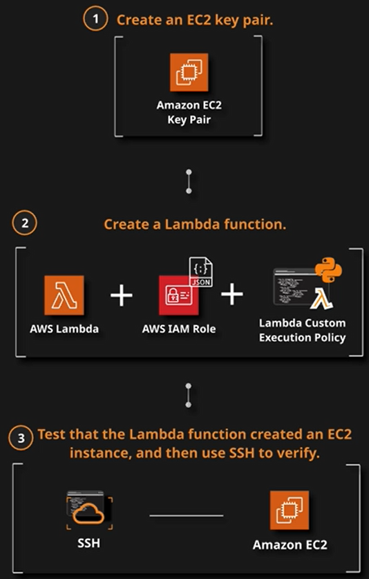


### Create EC2 Key Pair

- EC2 - 키 페어 - 키페어 생성 클릭

  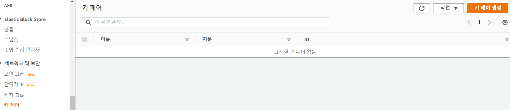

- 아래와 같이 설정하고 생성

  


### Create a Lambda Function

- Lambda - 함수 - 함수 생성

  

- 아래와 같이 설정하고 함수 생성

  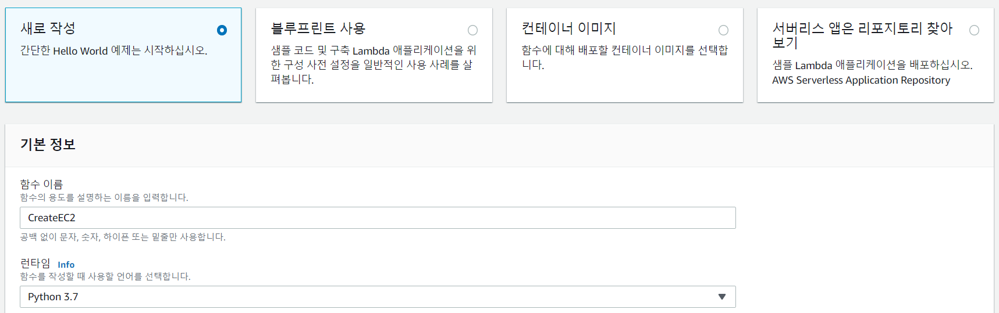

  

- 함수 생성 완료

  

- 새 탭을 열어서 IAM - 역할에서 생성한 역할 이름을 검색해 역할 선택

  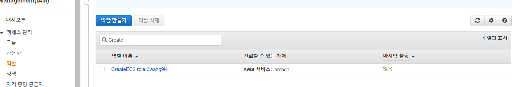

- 권한에 연결된 정책 선택

  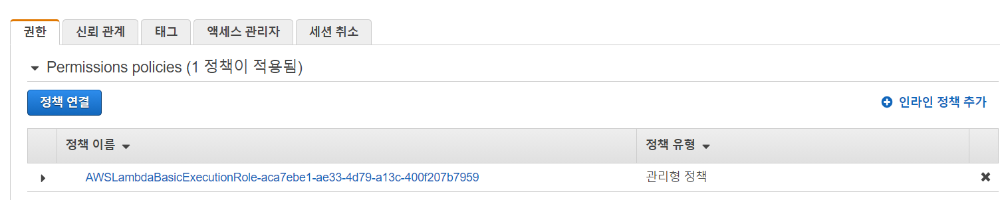

- `{} JSON` 선택하고 정책 편집 선택

  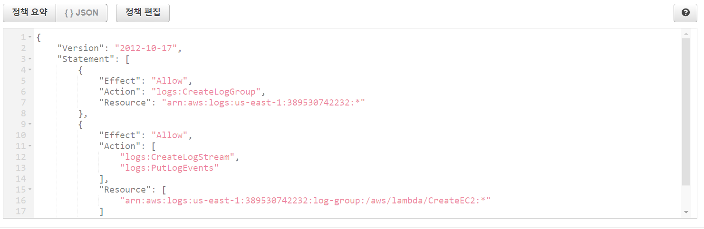

- JSON 선택하고 밑에 내용 복붙

  ```json
  {
    "Version": "2012-10-17",
    "Statement": [{
        "Effect": "Allow",
        "Action": [
          "logs:CreateLogGroup",
          "logs:CreateLogStream",
          "logs:PutLogEvents"
        ],
        "Resource": "arn:aws:logs:*:*:*"
      },
      {
        "Action": [
          "ec2:RunInstances"
        ],
        "Effect": "Allow",
        "Resource": "*"
      }
    ]
  }
  ```

  

- 정책 저장 완료

  

- 다시 Lambda 콘솔 페이지로 와서 새로고침

- CreateEC2 function 페이지에서 스크롤을 내려 아래 코드로 수정하고 Deploy

  ```python
  import os
  import boto3
  
  AMI = os.environ['AMI']
  INSTANCE_TYPE = os.environ['INSTANCE_TYPE']
  KEY_NAME = os.environ['KEY_NAME']
  SUBNET_ID = os.environ['SUBNET_ID']
  
  ec2 = boto3.resource('ec2')
  
  
  def lambda_handler(event, context):
  
      instance = ec2.create_instances(
          ImageId=AMI,
          InstanceType=INSTANCE_TYPE,
          KeyName=KEY_NAME,
          SubnetId=SUBNET_ID,
          MaxCount=1,
          MinCount=1
      )
  
      print("New instance created:", instance[0].id)
  ```

  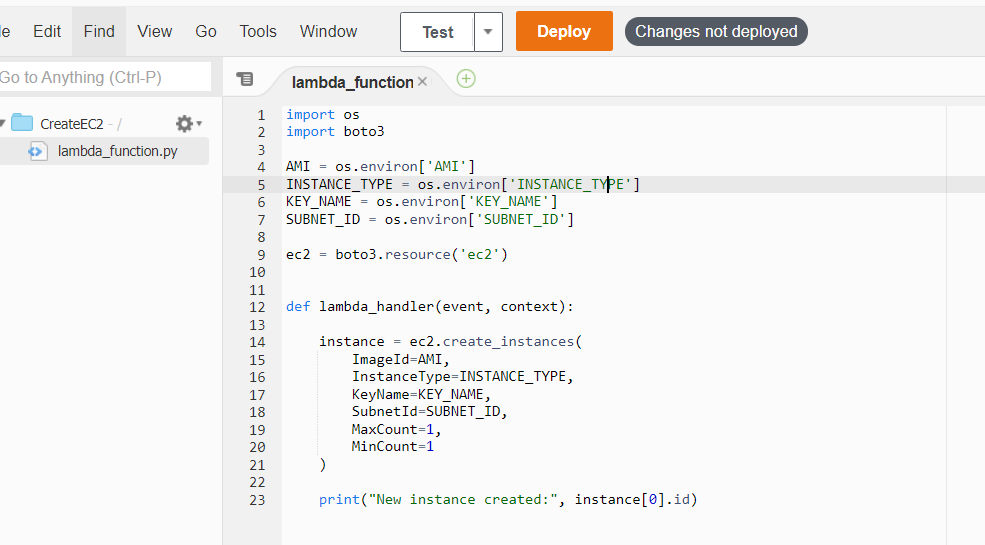

- 다음으로 구성 - 환경변수 - 편집 선택

  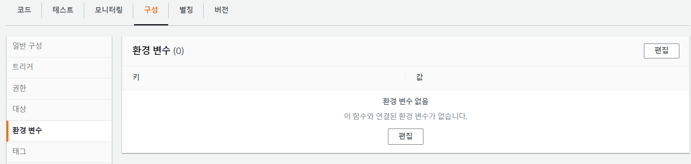

- 입력하기 전에 새 탭을 열어 EC2 - 인스턴스 시작 - Amazon Linux2의 ami 값 복사

  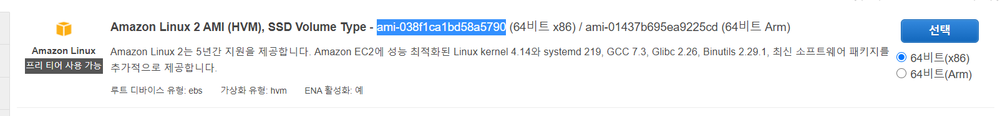

- 다음으로 VPC - 서브넷에서 서브넷 ID 복사

  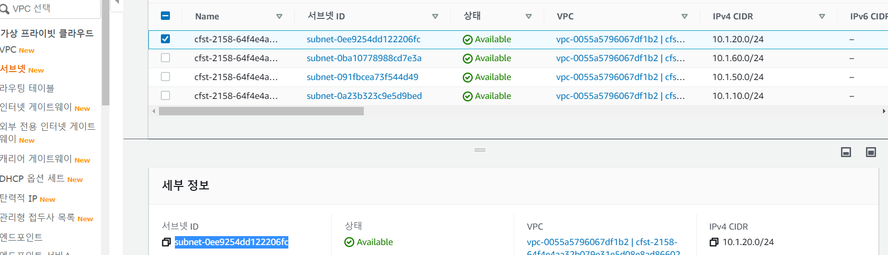

- 복사한 값드를 채워 환경변수 추가

  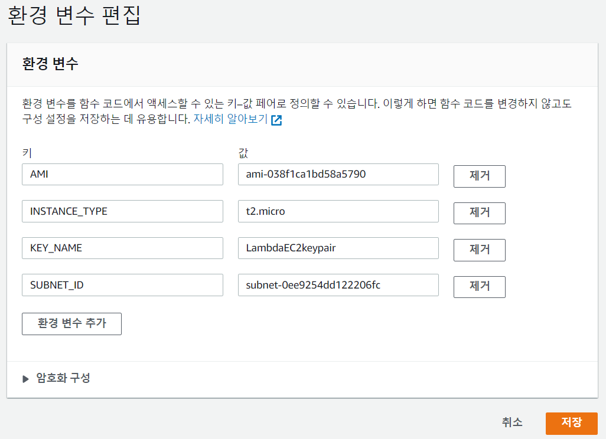


### Test Lambda Function

- Test 선택

  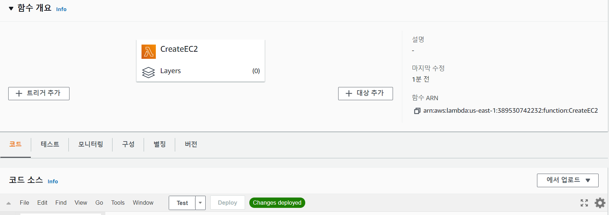

- 다음과 같이 입력하고 생성 

  

- 테스트클릭

  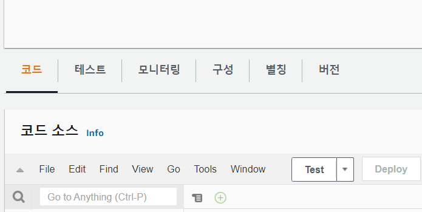

- 테스트 결과

  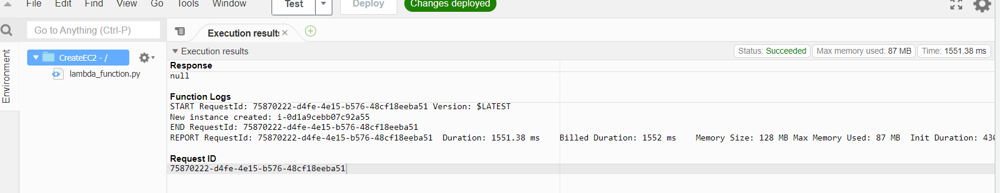

- EC2 - 인스턴스 생성 확인

  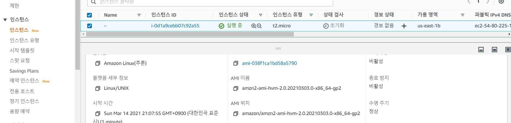


### Connect to the Instance via SSH 

- 생성된 인스턴스 IP로 SSH 접속

  

- 처음 생성한 키로 접속

  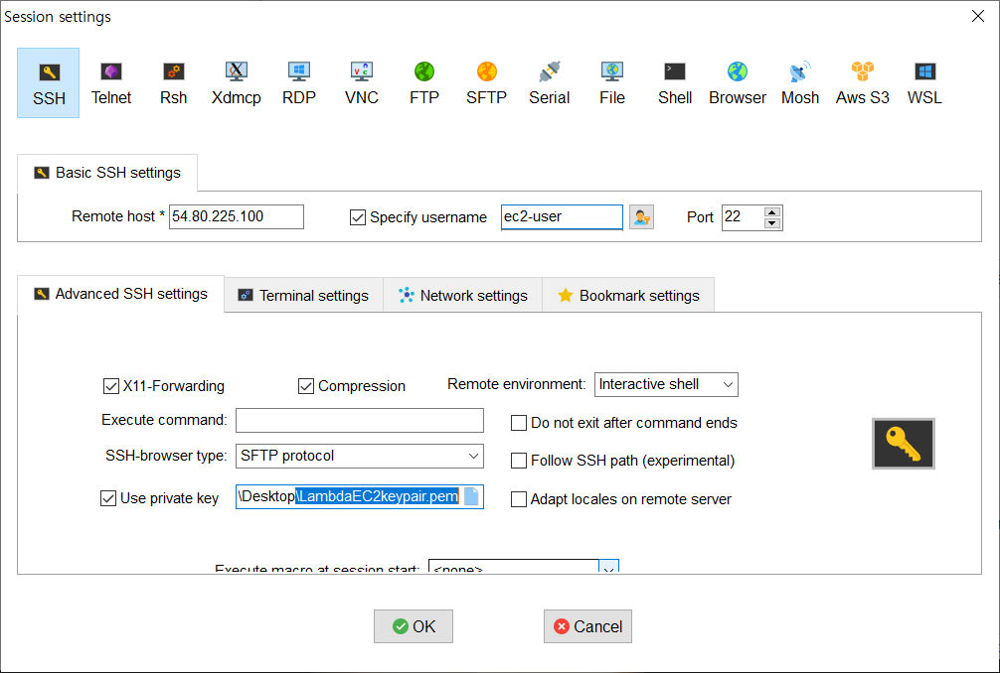

- 접속 확인

  


## Creating a Basic Lambda Function to Shut Down an EC2 Instance

- lambda function을 이용해 실행 중인 EC2 인스턴스 중지
  


### Create a Basic Lambda Function and a Custom IAM Policy for an IAM Role

- EC2 - 인스턴스 - 실행중인 인스턴스 확인

  

- 실행중인 인스턴스 ID 주소 복사

  

- Lambda - 함수 - 함수 생성 클릭

  

- 함수 설정전에 새 탭열어서 IAM 콘솔에서 역할 생성 

   

- AWS 서비스 - Lambda 선택

  

- 태그에 아래와 같이 설정

  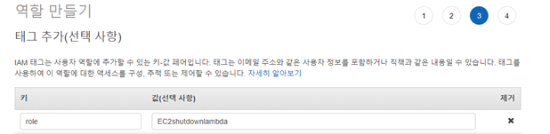

- 역할 이름 설정하고 생성 

  

- 생성한 역할 선택

  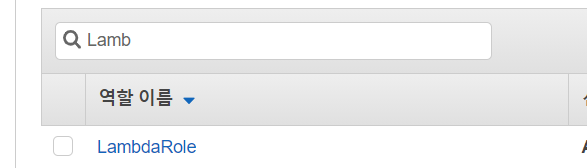

- 권한 - 정책연결

  

- 정책 생성 선택

  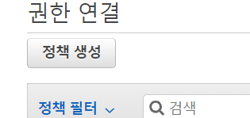

- JSON 선택하고 아래 스크립트 넣기

  ```json
  {
    "Version": "2012-10-17",
    "Statement": [
      {
        "Effect": "Allow",
        "Action": [
          "logs:CreateLogGroup",
          "logs:CreateLogStream",
          "logs:PutLogEvents"
        ],
        "Resource": "arn:aws:logs:*:*:*"
      },
      {
        "Effect": "Allow",
        "Action": [
          "ec2:Stop*"
        ],
        "Resource": "*"
      }
    ]
  }
  ```

  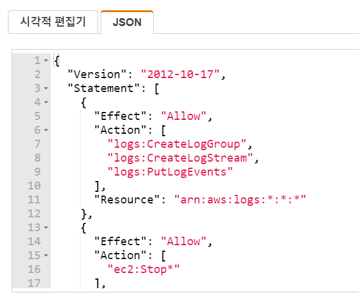

- 정책 이름 설정하고 생성 

  

- 생성한 정책 연결 

  

- 생성중이던 Lambda 함수로 돌아와서 아래와 같이 기존 역할 사용 

  

  

- 함수 생성 완료

  


### Create a Test in the Lambda Console

- 테스트 선택

  

- 이벤트 이름 설정하고 생성

  

- 함수 소스 코드 변경

  - `instanes = ['<instance id>']` <instance id>에 복사한 id 넣기

  ```python
  import boto3
  #This simple lambda function is available from AWS with instructions on starting and stopping an instance at regular intervals using Lambda and CloudWatch: https://aws.amazon.com/premiumsupport/knowledge-center/start-stop-lambda-cloudwatch/
  # Enter the region your instances are in. Include only the region without specifying Availability Zone; e.g., 'us-east-1'
  region = 'us-east-1'
  # Enter your instances here: ex. ['X-XXXXXXXX'] you can comma separate the instance IDs for more than one instance: i.e. ['X-XXXXXXXXX', 'X-XXXXXXXXX"]
  instances = ['<instance id>']
  
  def lambda_handler(event, context):
      ec2 = boto3.client('ec2', region_name=region)
      ec2.stop_instances(InstanceIds=instances)
  ```

- 변경하고 Deploy

  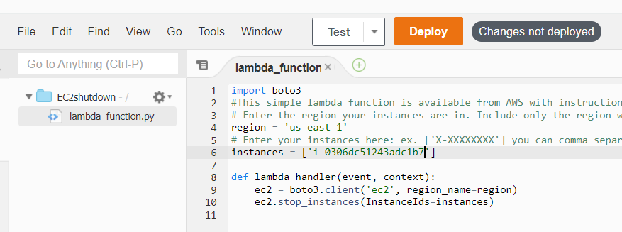

- 인스턴스 실행 중 확인 

  

- 다시 Test

  

- 테스트 성공

  

- 인스턴스 확인

  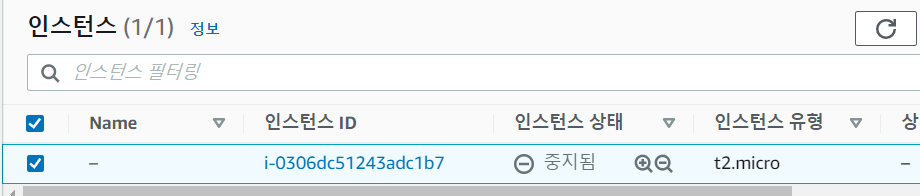


## Creating and Subscribing to AWS SNS Topics

- AWS Simple Notification Service 사용
- Lambda Function을 이용해 구독하고 메일을 받음


### Create an SNS Topic

- SNS 서비스에서 주제 이름 설정하고 다음 단계 선택

  

- 수정없이 바로 주제 생성 클릭

  

- 주제 생성하고 구독 생성 클릭

  

- 프로토콜 이메일, 엔드포인트 메일 주소 입력하고 구독 생성

  

- 주제에서 생성한 토픽 선택

  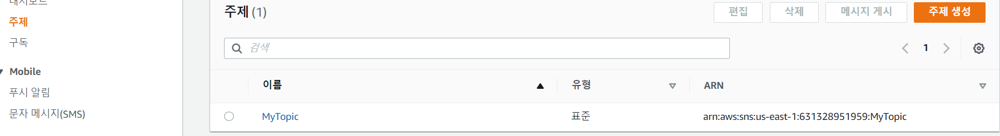

- 확인 대기 중

  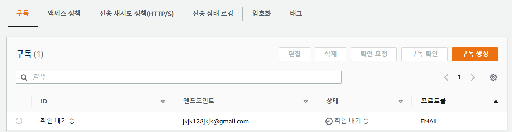

- 이메일에서 구독 수락

- 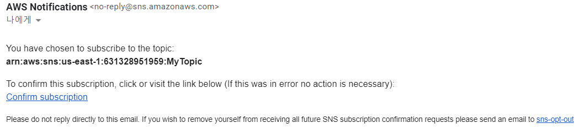

  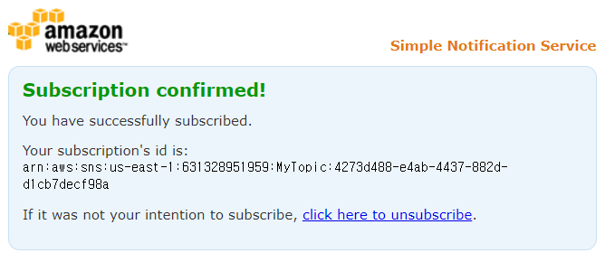


### Create a Lambda Function

- Lambda 콘솔에서 함수 생성

  

- 아래와 같이 설정하고 함수 생성

  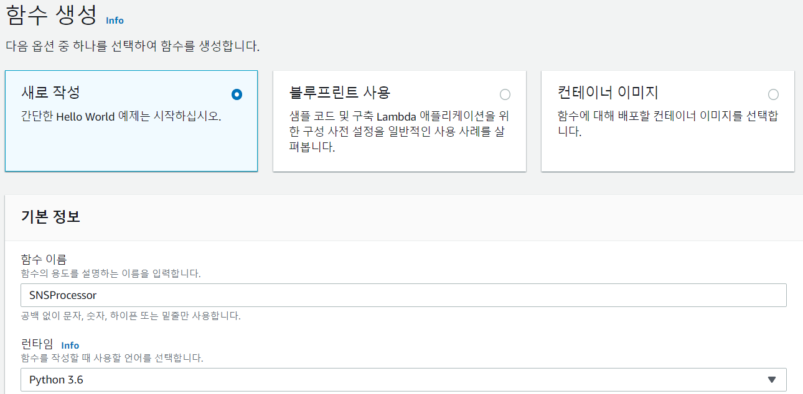

  

- 새 창열어서 SNS 서비스에서 구독 새로 생성

  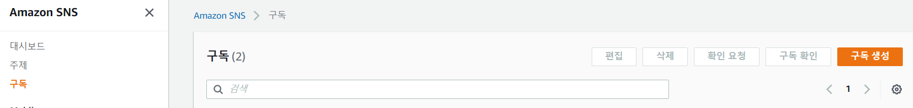

- 아래로 설정하고 구독 생성

  

- 다시 Lambda 탭으로 이동해서 아래 코드 입력하고 Deploy

  ```python
  def lambda_handler(event, context):
      message = event['Records'][0]['Sns']['Message']
      print("From SNS: " + message)
      return message
  ```

  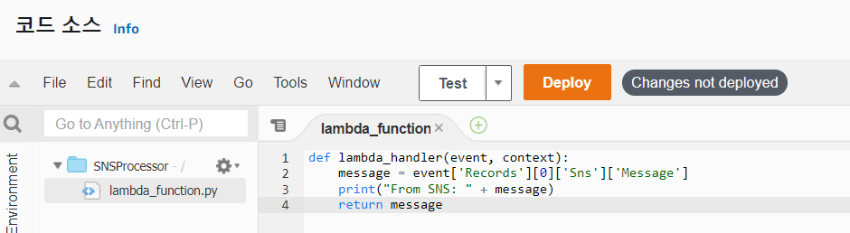


### Send Your SNS Topic to Multiple Endpoints

- SNS - 주제에서 생성한 주제 선택하고 메시지 게시 선택

  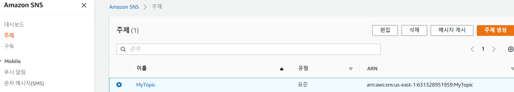

- 제목과 내용 입력하고 메시지 게시

  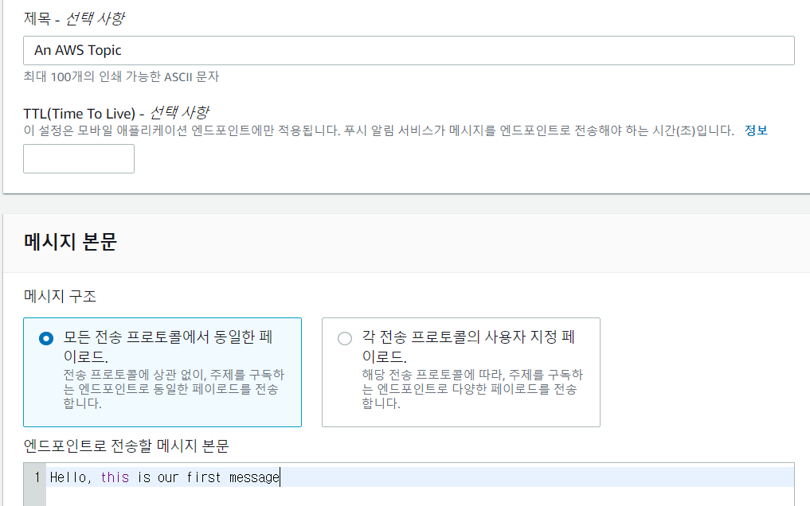

- 메일이 온 것을 확인

  

- Lambda 탭에서 모니터링에서 CloudWatch에서 로그 보기 선택

  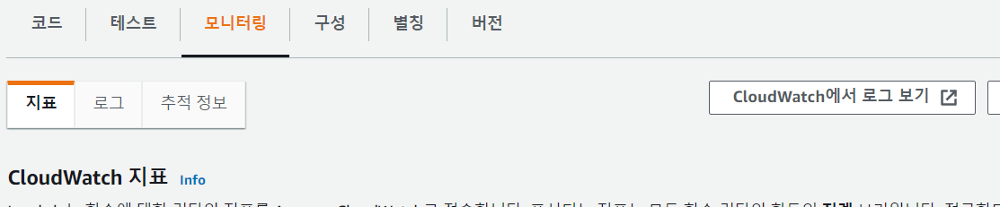

- 로그 스트림에 로그 확인

  

  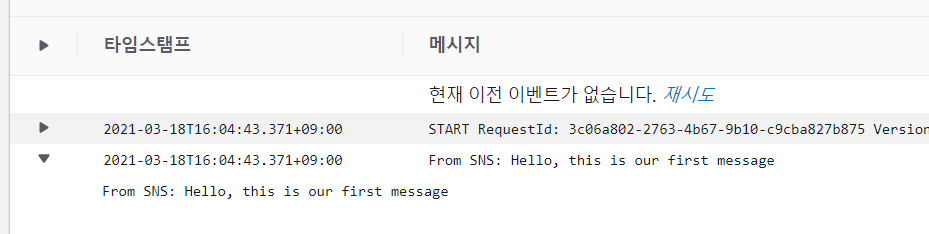


---

## Rolling Updates to a Highly Distributed Web Application with AWS CodeDeploy

- AWS CodeDeploy를 사용해 Auto Scaling 그룹에서 실행되고 Elastic Load Balancer 뒤에 표시되는 일련의 EC2 인스턴스에 대한 코드 배포 및 업데이트 관리


### Create an S3 Bucket to Store Application Code

- Code를 저장할 S3 저장소 생성

- S3 서비스에서 버킷만들기 클릭

  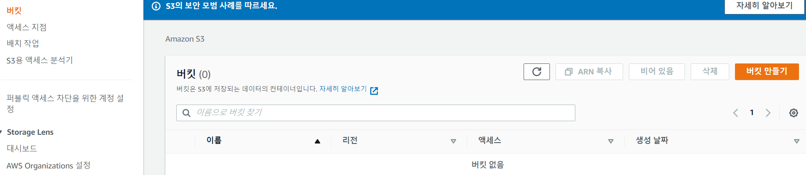

- 이름과 region을 선택하고 생성

  

- [github](https://github.com/linuxacademy/content-aws-developertools/tree/master/Rolling-updates-to-a-highly-distributed-web-application-with-AWS-CodeDeploy)에서 `zip`파일 다운로드

- 생성한 s3 버킷에 zip파일 업로드

  

- 업로드 완료

  


### Create a CodeDeploy In-Place Deployment

#### Create a CodeDeploy Application

- CodeDeploy로 이동해서 어플리케이션 생성

  

- 이름과 플랫폼 선택하고 생성

  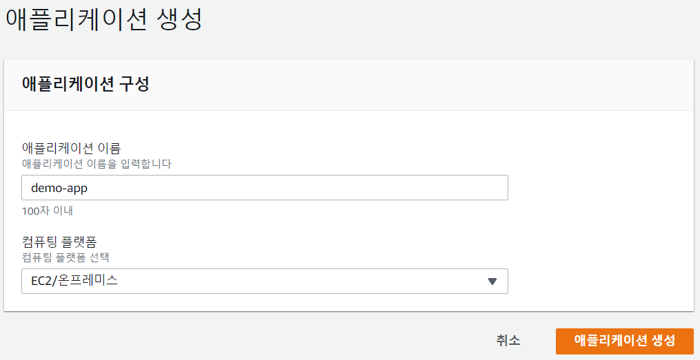

#### Create a CodeDeploy Deployment Group

- 애플리케이션 세부 화면에서 배포그룹생성 클릭

  

- 각 설정사항

  - 배포그룹이름 : demo-group
  - 서비스 역할 : 생성된 서비스 역할 선택
  - 배포유형 : 현재위치
  - 환경구성 : Amazon EC2 Auto Scaling 그룹 - 생성되있는 오토스케일링 그룹 선택
  - 로드밸런서 : Classic Load Balancer - 생성되있는 로드밸런서 선택

- Deployment Group 생성 완료

  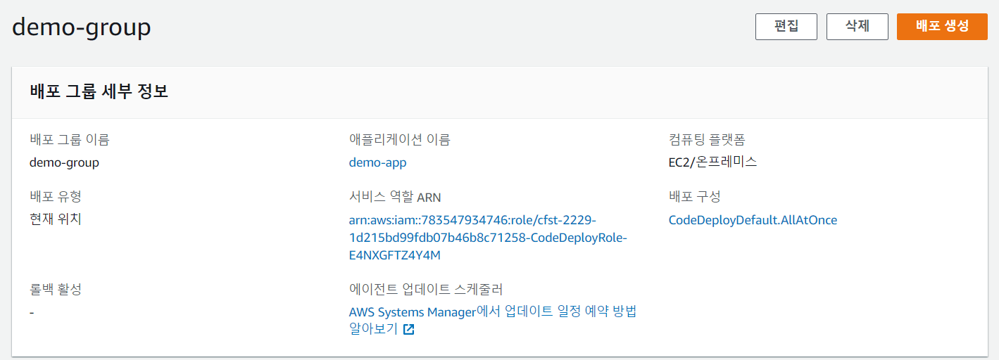

#### Create a CodeDeploy Deployment

- deployment group 상세화면에서 배포생성 클릭

  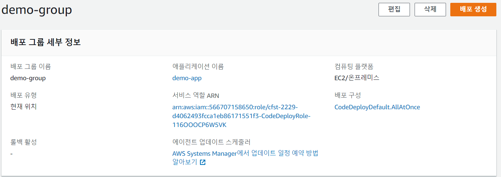

- 저장된 S3 버킷 주소 입력

  - 아래 추가 배포 동작 설정에서 콘텐츠 덮어쓰기 선택

  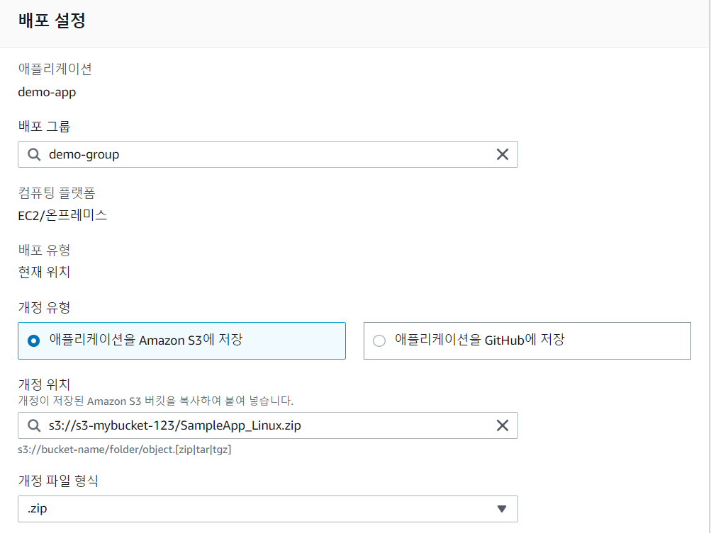

- deployment 생성

  


### Test the Deployed Application

- EC2 - 로드밸런서 - DNS주소 복사

  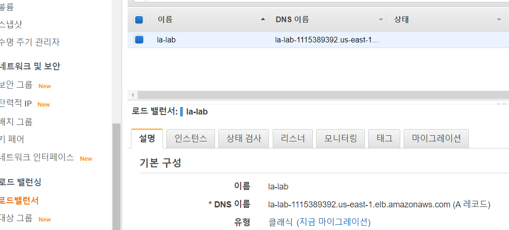

- 새로운 창에서 DNS 주소 입력

  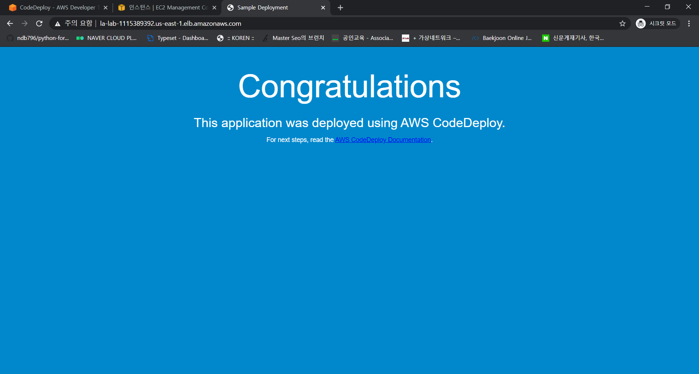


### Create a CodeDeploy Blue-Green Deployment

#### Create a CodeDeploy Deployment Group

- 생성한 demo-app에서 새로운 Deployment Group 생성

  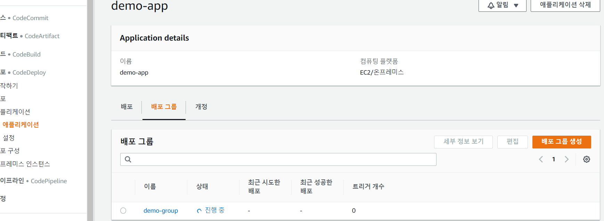

- 배포 그룹 설정

  - 그룹 이름 : demo-blue-green
  - 서비스 역할 : 생성된 서비스 역할 선택
  - Deployment type : Blue/Green
  - 환경구성 : Automatically copy Amazon EC2 Auto Scaling group
  - 로드 밸런서 : Classic Load Balancer
  - 배포 설정
    - 즉시 트래픽 다시 라우팅
    - 배포 그룹의 원본 인스턴스 종료
    - 일, 시간, 분 모두 0

#### Create a CodeDeploy Deployment

- 배포생성 클릭

  

- 배포 설정

  - 아래 컨텐츠 덮어쓰기 선택

  

- 배포완료

  

  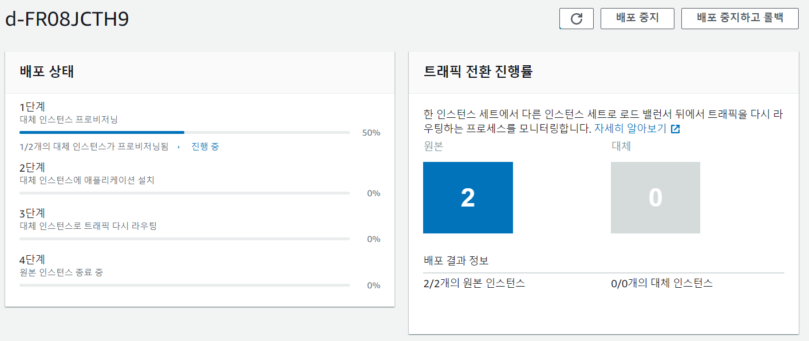


### Test the Updated Application

- 이전 테스트와 동일

  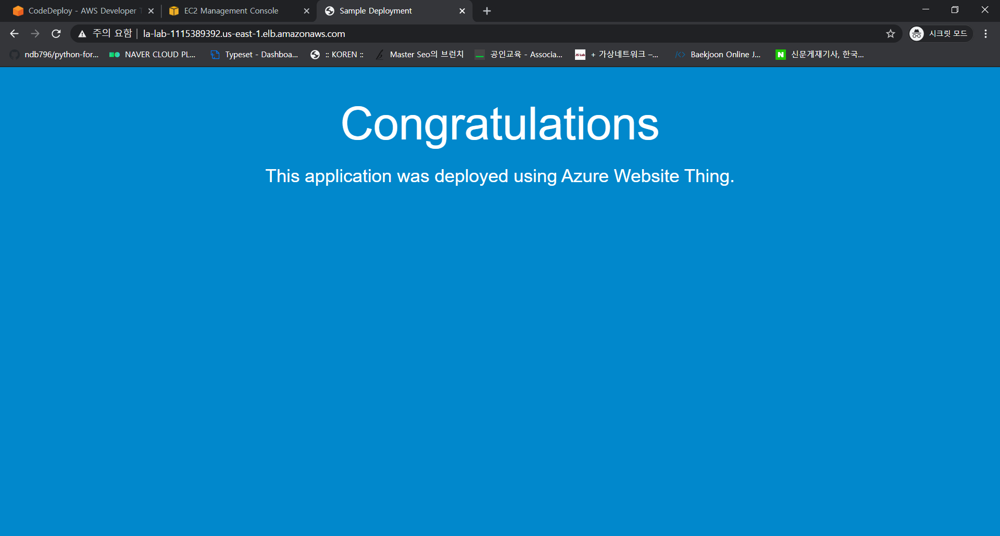


### Perform a Manual Rollback

- 수동 롤백을 수행하는 것은 code-blue에서 현재 위치 배포를 수행하는 것과 동일
- 배포 그룹에서 여러 배포가 수행된 경우 코드를 롤백하는 경우 다른 옵션 존재

#### Create a CodeDeploy Deployment Group

- CodeDeploy - Application - demo-app에서 배포 그룹 생성

  

- 배포 그룹 구성

  - 이름 : quick-fix
  - 서비스 역할 선택
  - 배포 타입 : 현재위치
  - 환경 구성 : Amazon EC2 Auto Scaling groups
  - 로드 밸런서 : Classic Load Balancer

#### Create a CodeDeploy Deployment

- 배포그룹 상세 화면에서 배포 생성

  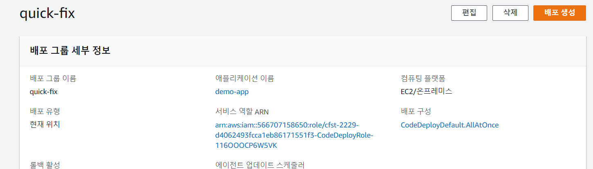

- 배포 설정

  - 아래 컨텐츠 덮어쓰기 선택

  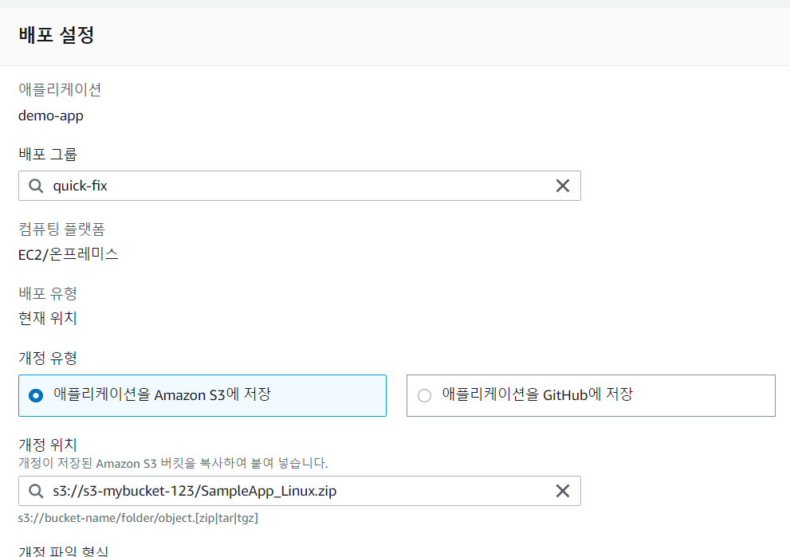

- 배포생성

  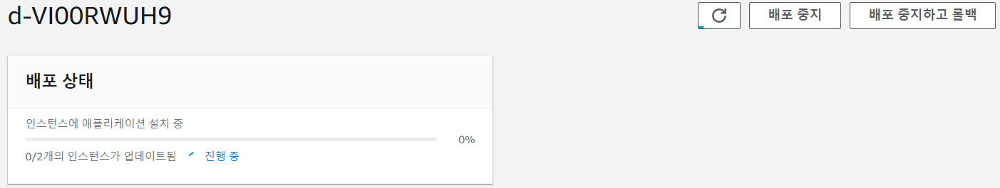

- 배포완료되고 다시 접속하면 원래 화면이 나오는 것을 확인 가능

  


### 같은 배포 그룹에 다시 배포하고 롤백

- Create a CodeDeploy In-Place Deployment 단계까지 수행하여 배포 생성

- s3에 새로 수정한 파일 업로드

  

- 배포 완료된 애플리케이션에 배포

  

- 배포설정

  

- 배포완료

  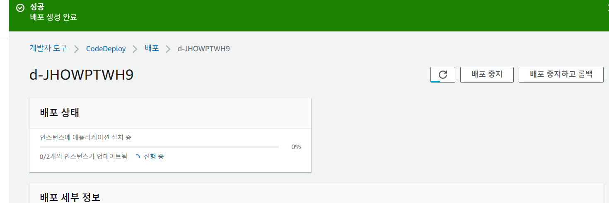

- 웹 사이트 확인

  

- 애플리케이션에서 배포 그룹 내역을 확인해 이전 배포 선택하고 배포재시도 클릭

- 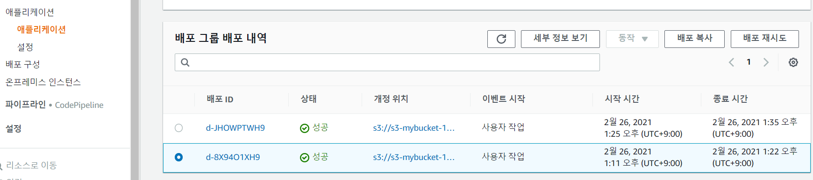

- 다시 배포를 수행하여 이전 상태로 덮어씀

- 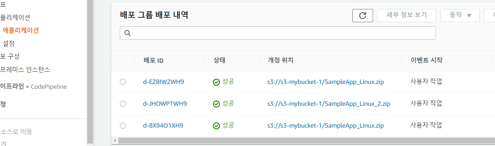

  

- 다른 방법이 있을 줄 알아서 했지만 없고 이전 상태로 되돌리기 위해서는 이전 상태의 코드를 다시 배포하는 방법밖에 없음


---

## Working with a DevOps CI/CD Pipeline in AWS

- AWS를 사용하여 CI(Continuous Integration)/CD(Continuous Delivery) 파이프라인을 생성하여 생성한 파이프라인을 이용해 웹 사이트의 새 버전을 자동으로 배포
- AWS CodeCommit, AWS CodeBuild, AWS CodeDeploy 및 AWS CodePipeline을 자동으로 구성하는 프런트앤드 도구인 AWS CodeStar를 이용해 구현


### Create a CI/CD Pipeline

- CodeStar에서 프로젝트 만들기 클릭

  

- 프로젝트 생성 전 서비스 역할 생성

  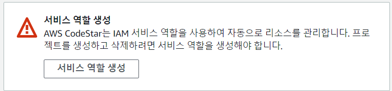

- 생성한 다음 템플릿에서 HTML 5 추가하고 밑에 HTML 선택

  

- 새로운 브라우저를 열어 EC2 - 키페어 접속 - 키페어 생성

  

- 아래와 같이 설정하고 생성

  

- 다시 CodeStar 브라우저 탭으로 와서 Next 클릭

  

- 아래와 같이 프로젝트와 EC2 설정하고 Next

  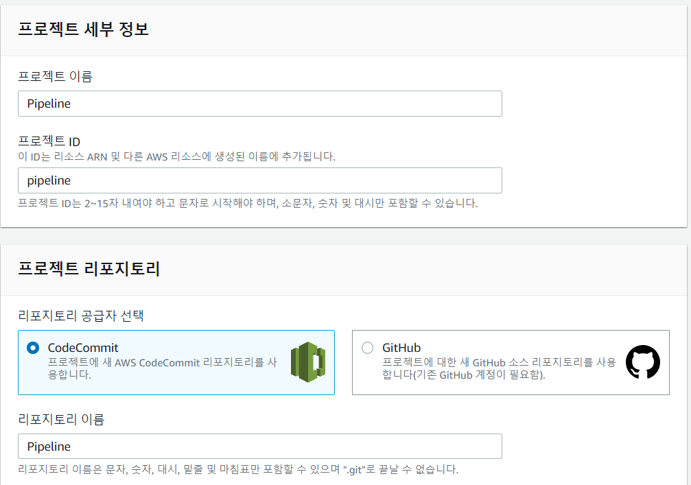

  

- 설정 확인 후 프로젝트 생성

  


### Deploy a New Version of a Website using a CI/CD Pipeline

- 애플리케이션 보기 선택해서 웹 어플리케이션 확인

  - 하지만 버튼 활성화 안되어 있음

  

- IDE에서 AWS CodeCommit에서 편집 선택

  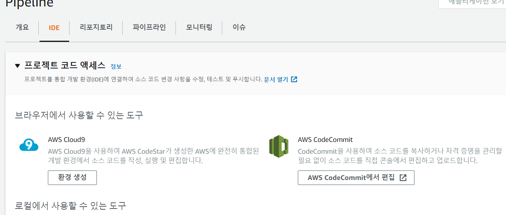

- webpage 폴더 선택

  

- index.html 선택

  

- 편집 선택

  

- 코드변경

  - line 61 `<h1>Hello Cloud Gurus!<h1>`으로 변경
  - line 62 `<h2>You just deployed using your own CI/CD pipeline!</h2>` 변경

  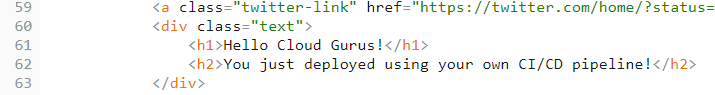

- 변경사항커밋

- 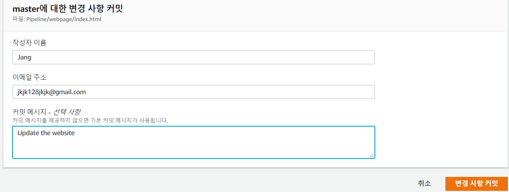

- CodeStar - 파이프라인 탭에서 배포되었는지 확인

  

- 애플리케이션 보기 클릭하여 변경사항 확인

  

  


## AWS DynamoDB in the Console - Creating Tables, Items, and Indexes

- 파티션 및 정렬 키와 같은 데이터 베이스 개념, 항목 추가, 삭제 및 업데이트 방법은 물론 DynamoDB 테이블 내부의 속성에 대한 정보를 제공
- 로컬 및 글로벌 보조 인덱스를 추가하고 로컬 보조 인덱스를 사용하여 테이블의 항목을 쿼리


### Create a DynamoDB Table

- DynamoDB 콘솔 - 대시보드에 테이블 만들기 클릭

  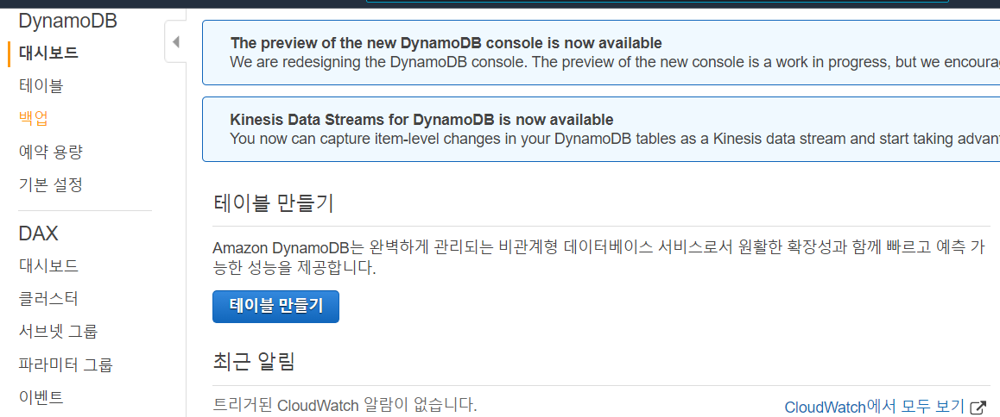

- 테이블 설정

  

- +인덱스 추가 선택

  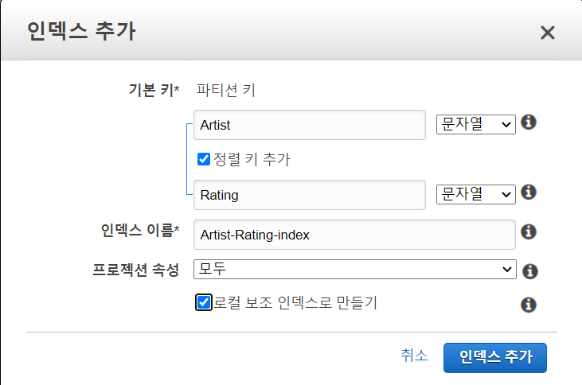

- 아래와 같이 설정하고 생성

  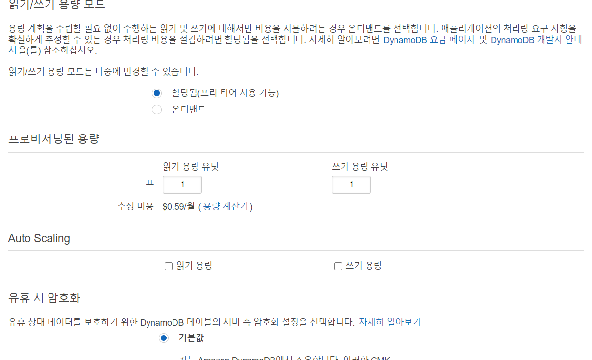

- 생성완료

  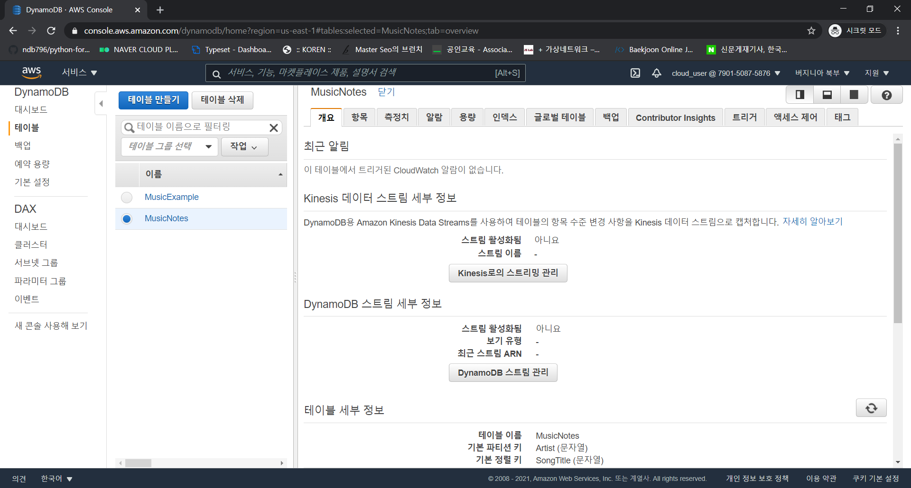


### Creating Items

- 아이템(항목) - 아이템 생성

  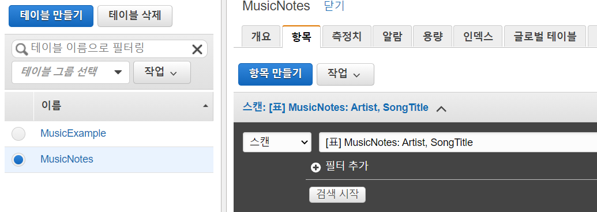

- 내용 입력하고 저장

  

- 아이템 선택 후 편집

  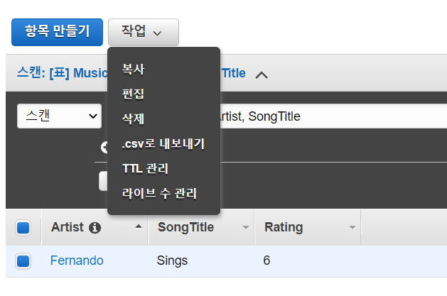

- SongTitle +버튼 클릭 후 Append-String

  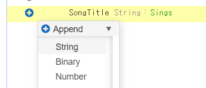

- 추가하고 저장

  

- 검색을 테스트하기 위한 아이템 여러개 추가


### Creating a Global Secondary Index

- 인덱스 탭에서 인덱스 생성

  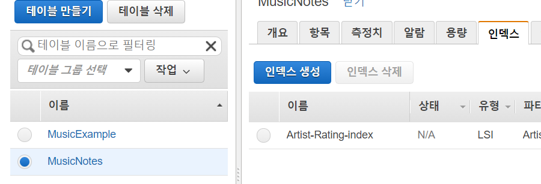

- 인덱스 설정

  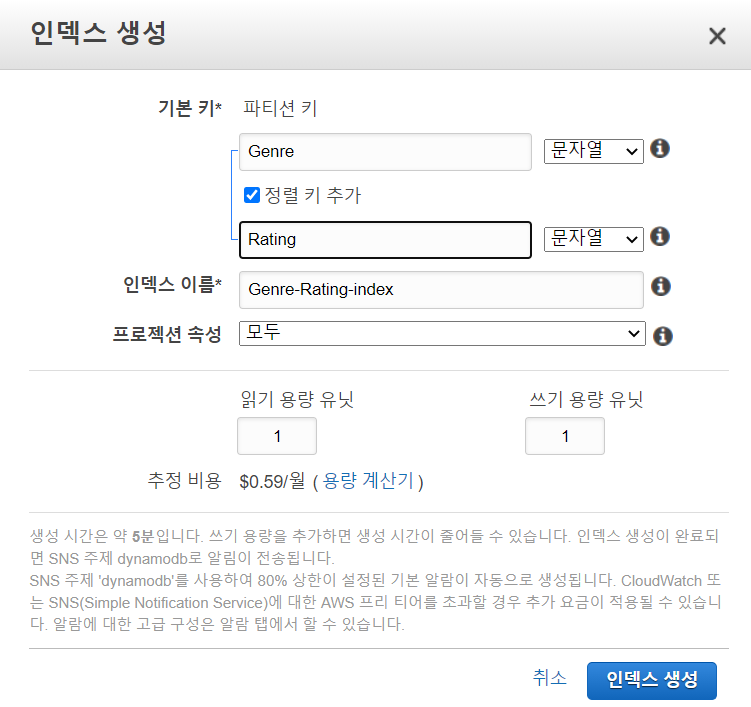

- 생성완료

  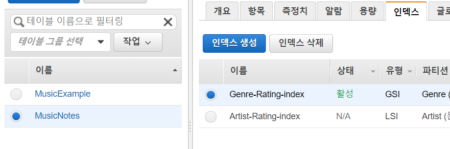


### Query a DynamoDB Table

- 아이템(항목)탭에서 스캔에서 쿼리로 변경

  

- 아래와 같이 입력하고 검색

  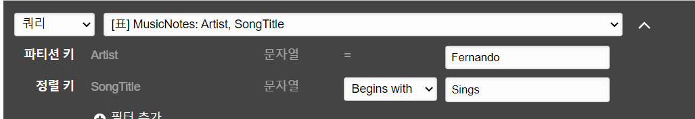

- 아티스트 Fernando의 노래에서 Sings로 시작하는 노래 제목만 결과 목록에 표시

  

- 아래와 같이 변경하고 다시 검색

  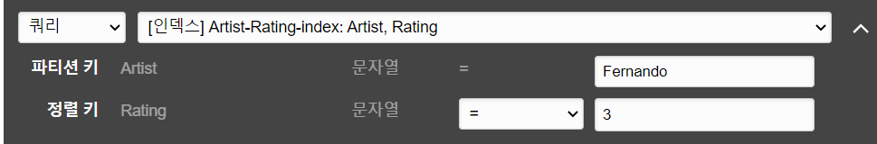

- 등급이 3인 Fernando의 노래만 검색됨

- 아래로 변경하고 다시 검색

  

- IU의 노래 중 등급이 1보다 작거나 같은 노래 검색

  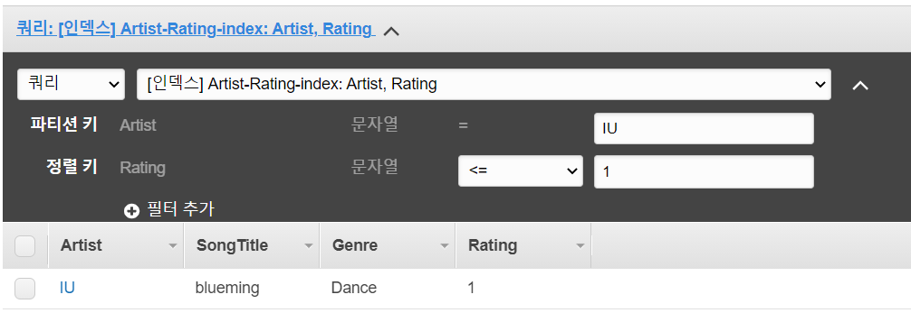

