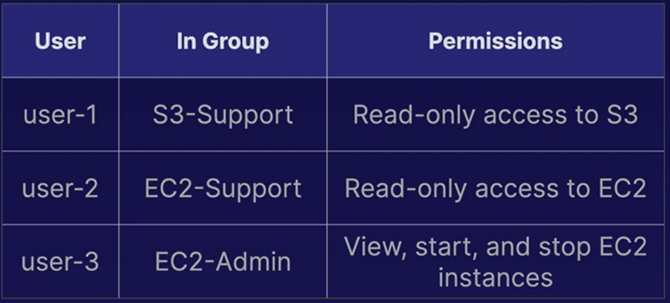
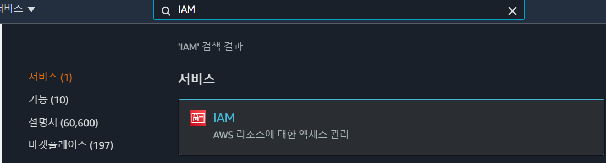
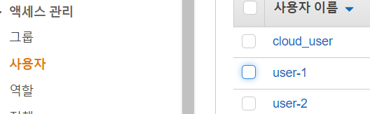
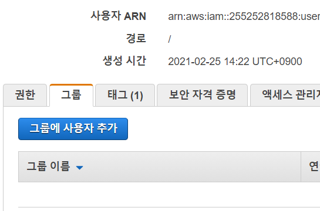
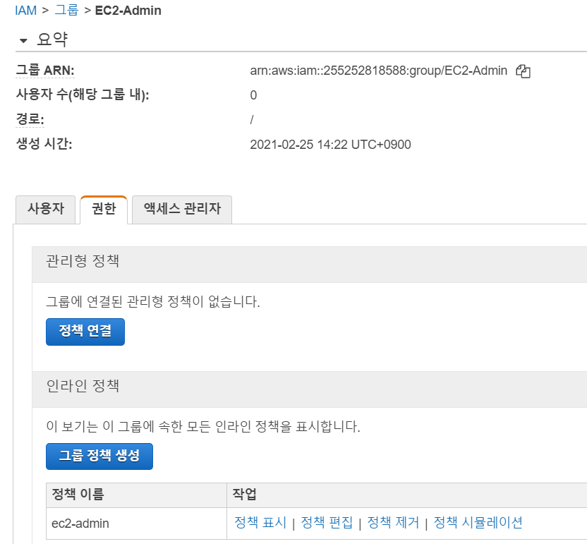
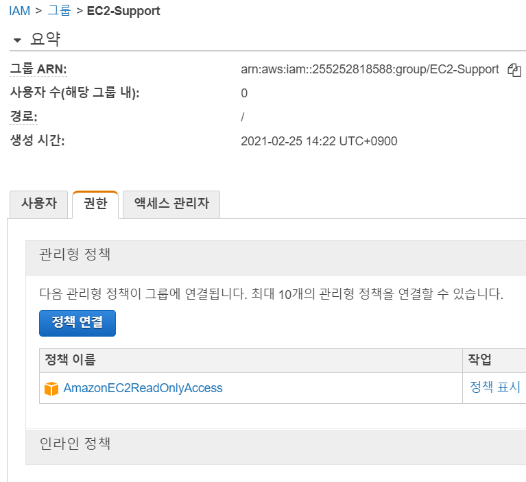
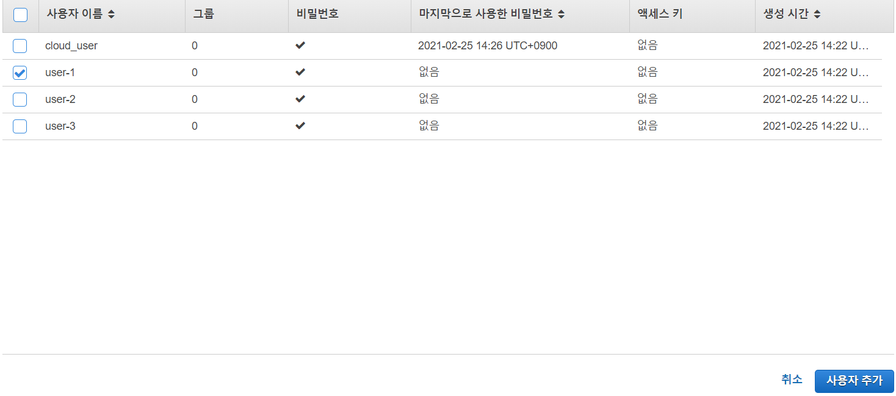
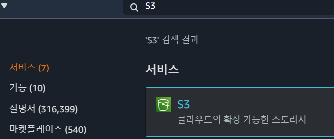
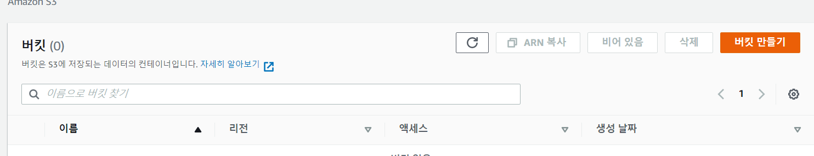
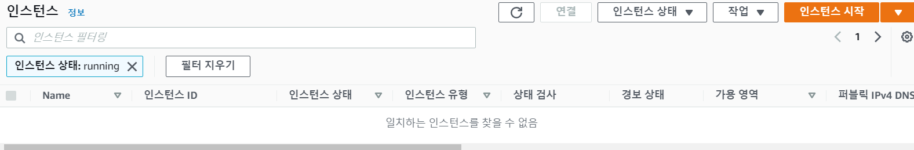

# 01. Introduction to AWS Identity and Access Management(IAM)

- IAM을 이용하여 사용자 및 그룹 관리와 IAM 정책을 이용한 액세스 할당 방법 실습

  

## Environment Walkthrough

- **Explore the Users**

  - IAM 선택

    

  - User -> user-1 선택

    
    
  - ARN(Amazon Resource Name)과 경로, 생성시간 확인 가능
  
  - 권한과 그룹 메뉴 확인
  
    - user-1에는 할당된 권한은 없고 소속된 그룹 없음
  
       
  
  - 보안 자격 증명 메뉴에서 access key와 SSH public key, AWS CodeCommit을 위한 HTTPS Git credentials 확인 가능
  
  - 액세스 관리자에서는 사용자가 언제 어떤 서비스에 접근했는지 확인 가능
  
- **Explore the Groups**

  - 본 실습에서는 3가지 그룹 확인

    - EC2-Admin : EC2 인스턴스를 보고 시작하고 중지할 수 있는 권한을 제공
    - EC2-Support : EC2 인스턴스에 대한 읽기 권한만을 제공
    - S3-Support : S3에 대한 읽기 권한만을 제공

  - 그룹 메뉴 선택

    

    - 여기서 아무 그룹을 선택해 연결된 정책 확인
    - 관리형 정책
      - AWS 또는 AWS 계정 내 관리자가 사전 구축한 사용자 및 그룹간에 공유되는 정책
    - 인라인 정책
      - 일회성 상황에서 일반적으로 사용되는 하나의 사용자 또는 그룹에만 할당된 정책

  - EC2-Admin의 권한확인

    - ec2-admin 정책 확인

    

    - 이 정책을 통해 EC2 인스턴스를 보고, 시작하고 중지하고 탄력적 로드밸런서를 확인하고 지표를 나열하고 통계를 가져올 수 있는 권한을 가짐. Auto Scaling 서비스에도 동일한 권한 적용

  - EC2-Support 권한 및 정책 확인

    

    - 이 그룹은 EC2 인스턴스, 탄력적 로드밸런서, Cloud Watch 지표및 Auto Scaling 구성을 확인만 가능

## Add Users to Groups

- S3-Support 선택

  - 사용자 - 그룹에 사용자 추가

  

- user-1 선택후 사용자 추가

  

## Use the IAM Sign-In Link to Sign In As a User

### Log In as user-1

- 대시보드의 IAM 사용자를 위한 로그인 URL 복사

  

- 새로운 창에서 url 오픈

  - user-1로 로그인

  - S3 이동

    

  - S3에서 버킷만들기 선택

    

  - 이름 입력 후 버킷 만들면 생성 실패

    

  - EC2 - Running Instance 확인

  

  - 실행 중 인스턴스 없음

- user-2와 user-3에서도 ec2와 s3확인