# Launching an EC2 instance in a Custom Virtual Private Cloud(VPC)

- AWS에서 EC2 인스턴스를 이용한 간단한 정적 웹사이트 실습
- VPC, zone, route, internet gateway, security group을 추가

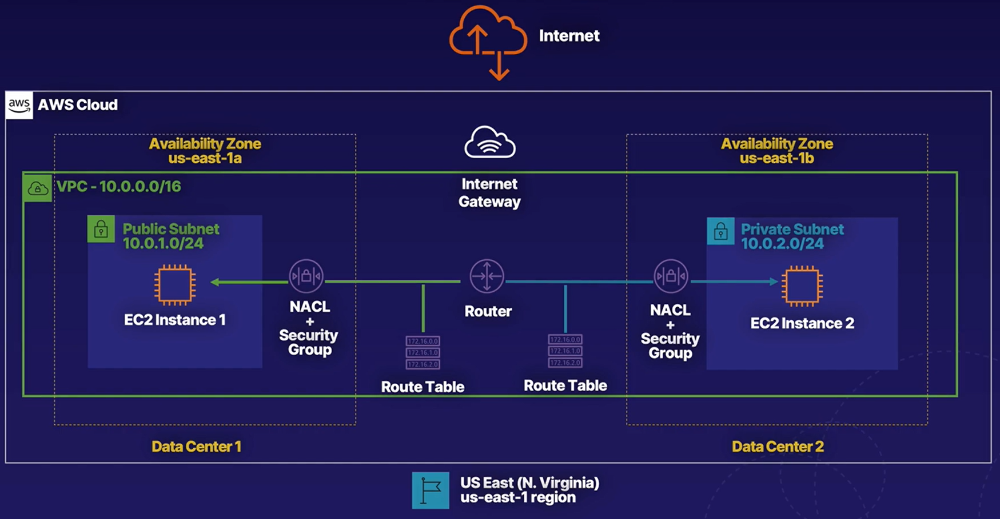

### Create a VPC

- VPC이동 후 VPC 생성 클릭

  

- 아래와 같이 설정 후 생성

  

### Create Subnets

- 두 개의 서브넷을 만들고 하나는 public으로 하나는 private로 설정
- 유효한 CIDR 블록을 할당했는지 확인

#### Create Public Subnet

- 서브넷 메뉴에서 서브넷 생성 버튼 클릭

  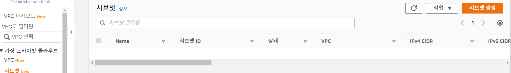

- VPC는 생성한 HoLVPC를 선택하고 이름과 가용 Zone과 IPv4 CIDR 블록 설정 후 생성

  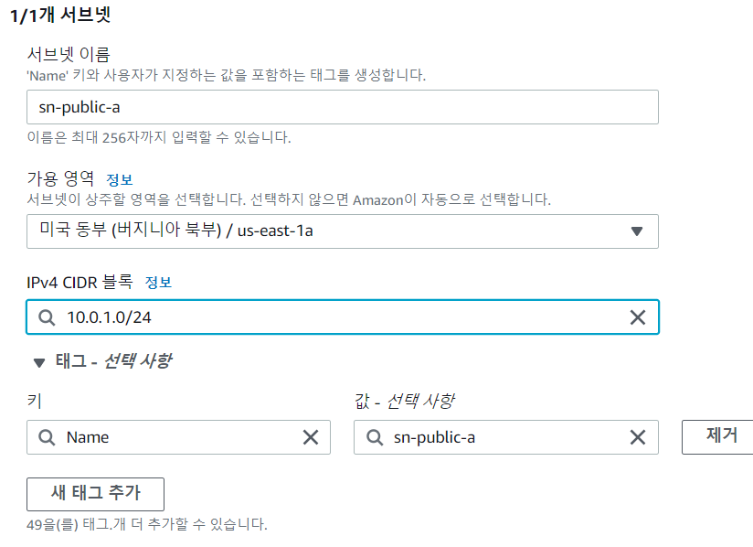

#### Create Private Subnet

- public subnet과 같이 이름, VPC, 가용 Zone, IPv4 CIDR 블록 설정 후 생성

  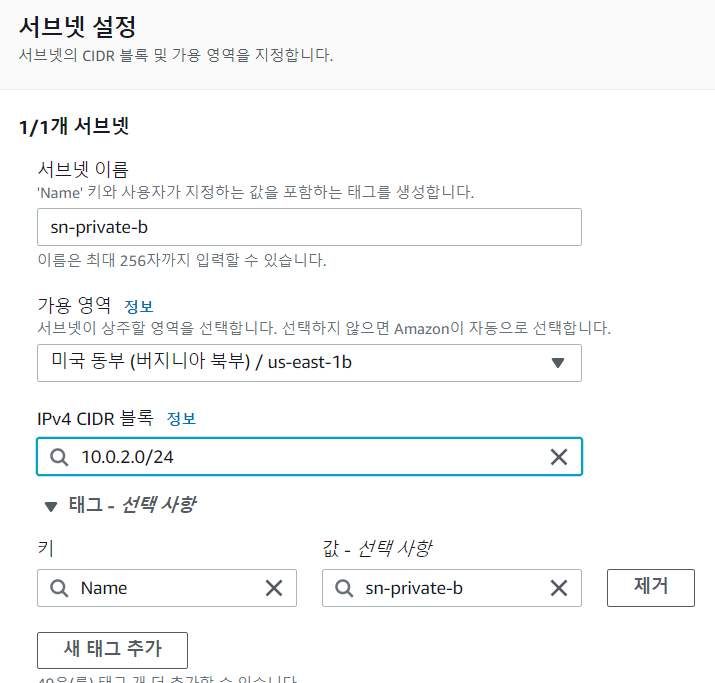

### Create Routes and Internet Gateway

#### Auto-assign public IPv4 address

- 생성한 public subnet에서 시작한 인스턴스에 대한 퍼블릭 IPv4 주소를 자동으로 요청

- sn-public-a 선택 후 작업 - 자동 할당 IP 설정 수정 선택

  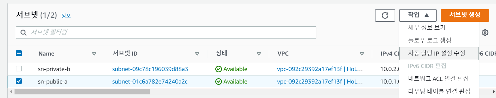

- 퍼블릭 IPv4 주소 자동 할당 활성화 선택 후 저장

  

#### Configure Internet Gateway

- 인터넷과 통신하기 위한 Internet Gateway 생성

- 인터넷 게이트웨이 메뉴에서 생성

  

- 이름 설정 후 생성

  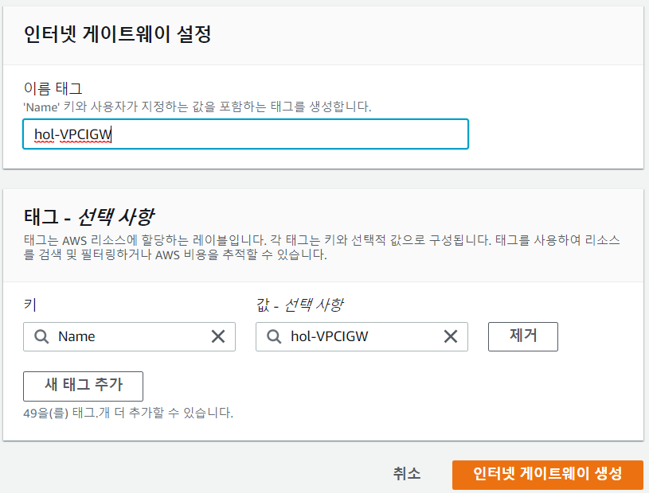

- 생성한 인터넷 게이트웨이와 VPC 연결

  

- 생성한 VPC 선택 후 연결

  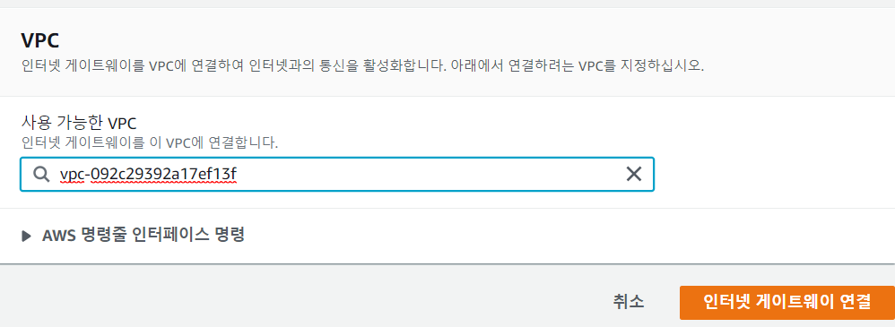

#### Configure Routing

- VPC에 새 라우팅 테이블을 생성해 퍼블릭 서브넷 용도로 생성한 sn-public-a를 외부의 인터넷과 연결되도록 설정

  - 기본 네트워크와 연결된 기본 라우팅 테이블이 이미 생성되어 있지만 이는 트래픽이 10.0.0.0/16 내의 다른 노드로 전달되도록 하는 테이블

    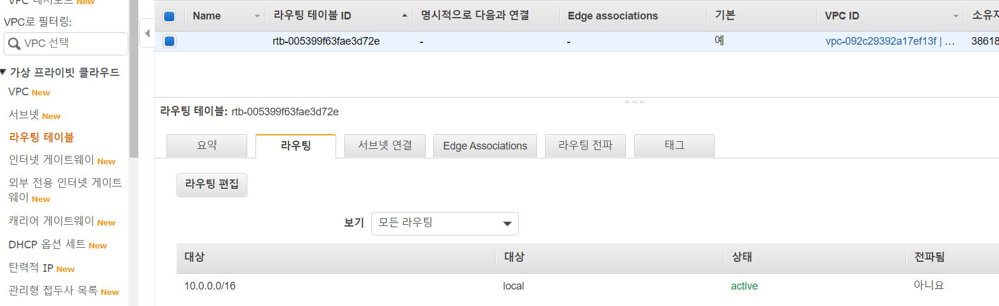

  - 인터넷 외부로 트래픽이 전달되기 위한 새 테이블 생성

- 라우팅 테이블 메뉴에서 새로운 라우팅 테이블 생성

  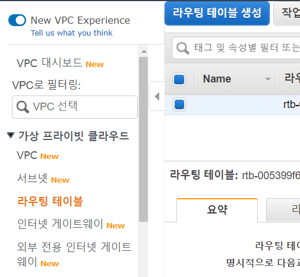

- 이름과 VPC를 설정하고 생성

  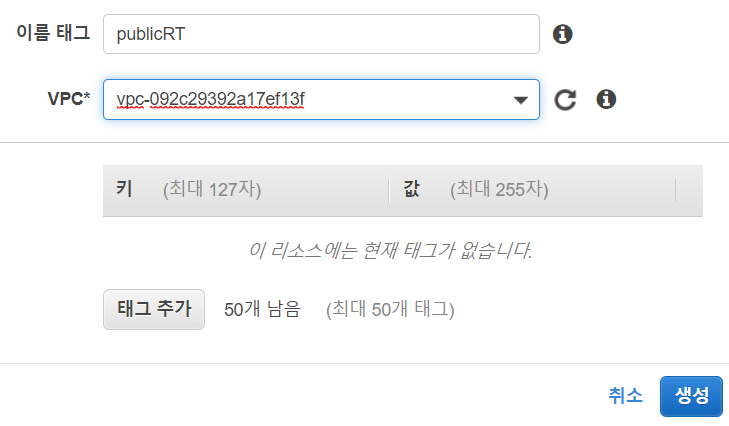

- 새로 생성한 라우팅 테이블을 선택해 라우팅 편집 클릭

  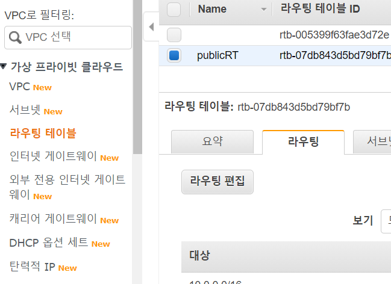

- 라우팅 추가를 누르고 모든 트래픽을 인터넷 게이트웨이로 향하게 설정

  

#### Associate with Subnets

- 서브넷 연결 편집 선택

  

- sn-public-a 서브넷 연결

  

### Launch EC2 Instance in Public Subnet

- EC2 - 인스턴스 - 인스턴스 시작 선택

  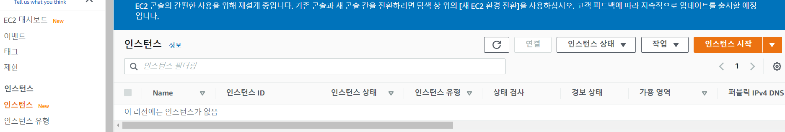

- Amazon Linux 2 AMI 선택

  

- t2.micro 선택

  

- 서브넷은 sn-public-a로 설정하고 서브넷 사용 설정(활성화)

  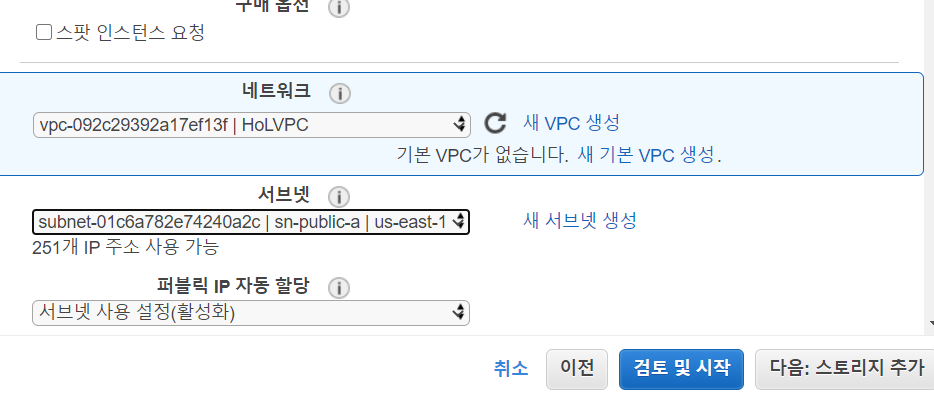

- 새 보안 그룹의 이름과 설명을 주고 검토및시작

  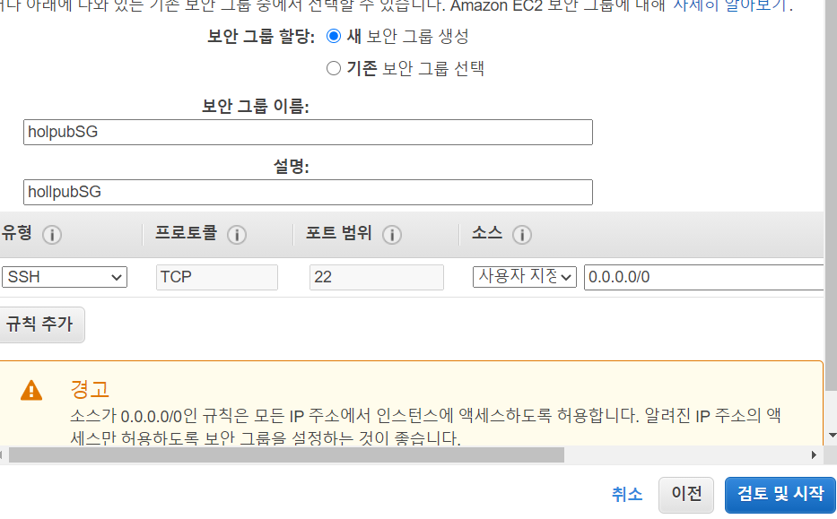

- 새 키 페어 생성 선택하고 이름 설정 후 키페어 다운로드

  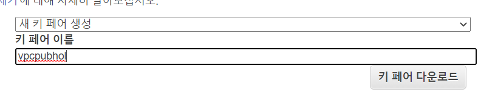

- 생성완료

#### Launch EC2 Instance in Private Subnet

- 퍼블릭 인스턴스와 유사하게 진행

- 네트워크 설정에서 sn-private-b로 설정하고 자동 할당 활성화

  

- 보안 그룹 설정

  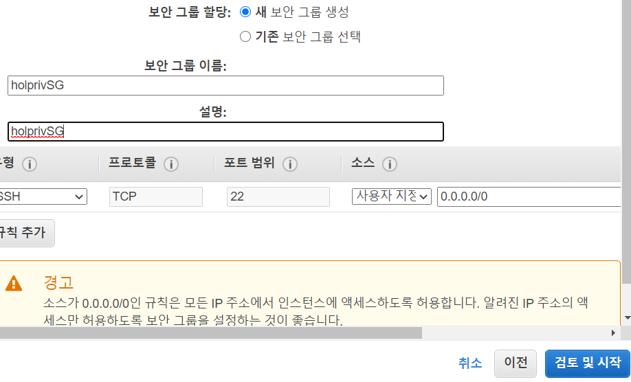

- 키페어 생성

  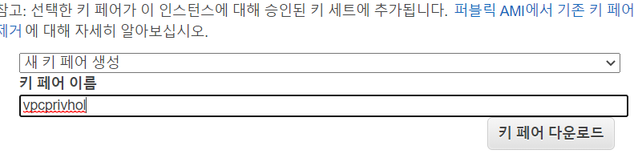

- 인스턴스 생성 완료

### Access Instances

- SSH를 이용해 인스턴스 접속

#### SSH to Public Instance

- Public Subnet에 생성한 인스턴스 IP 복사

  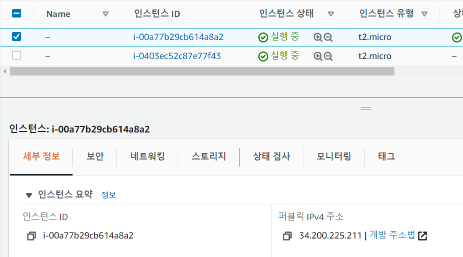

- 복사한 IP 입력하고 ec2-user 입력 그리고 다운로드한 키페어 설정

  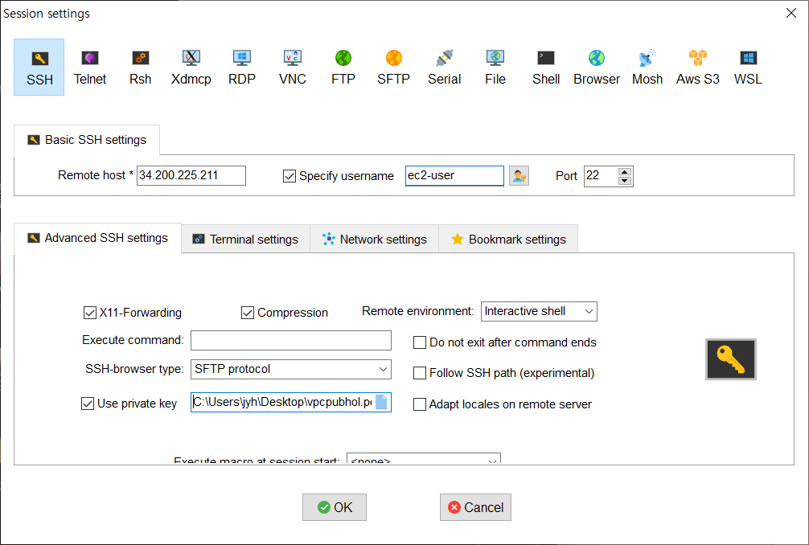

- 접속완료

  

#### SSH to private instance

- 위와 같이 IP 복사 후 똑같이 접속

  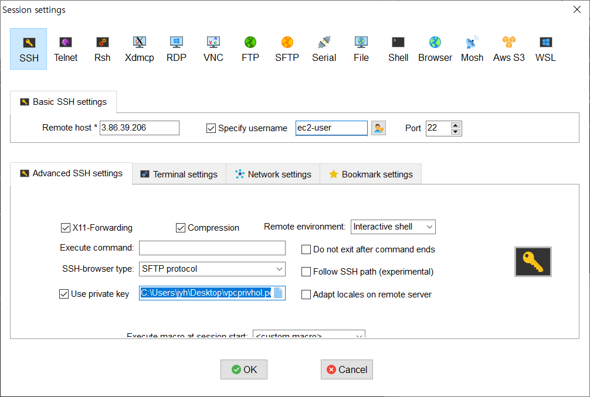

- 따로 인터넷게이트웨이와 연결이 안되있어 접속불가

  