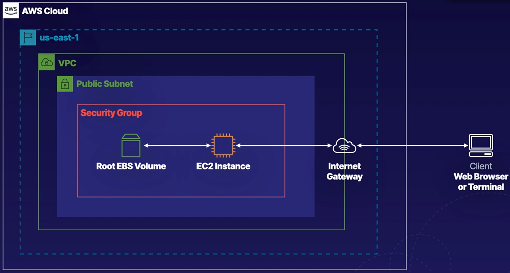
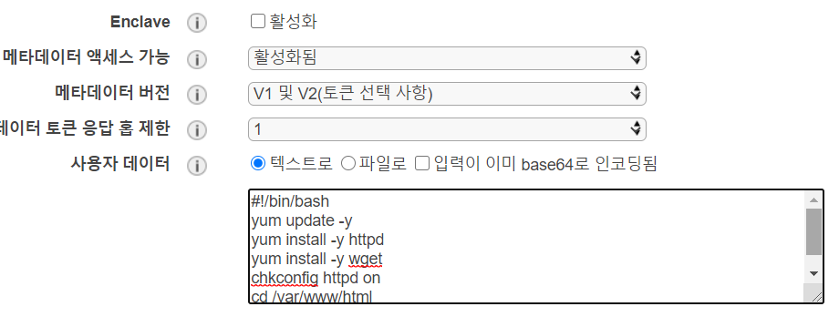
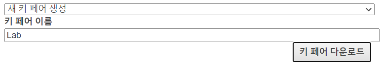
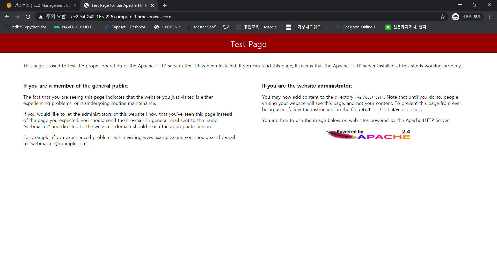

# Creating and Working with an EC2 Instance in AWS

- httpd를 포함한 EC2 인스턴스를 생성해 접근하는 실습




### Create a Default VPC

- 기본 VPC 생성

  


### Create an EC2 Instance

- EC2 인스턴스 생성

- Amazon Linux 2 AMI - t2.micro 선택

- 네트워크 설정

  

- 아래의 사용자 데이터 박스에 httpd를 위한 명령어 입력

  

- ```
  #!/bin/bash
  yum update -y
  yum install -y httpd
  yum install -y wget
  chkconfig httpd on
  cd /var/www/html
  service httpd start
  ```

- 태그추가

  

- 보안 그룹에 규칙 추가

  

- 키페어다운로드

  

- 인스턴스 생성 완료


### Manage the EC2 Instance

- 생성한 인스턴스의 public DNS(IPv4) 복사

  

- 인터넷 브라우저를 통해 접속

  

- 인스턴스 상태 변경하며 실습

  