# 04. Creating an Auto Scaling Group and Application Load Balancer in AWS

- Elastic Load Balancer와 Auto Scaling 그룹을 이용한 웹 서비스 설계

- 스트레스 테스트를 이용해 Auto Scaling 작동 테스트

  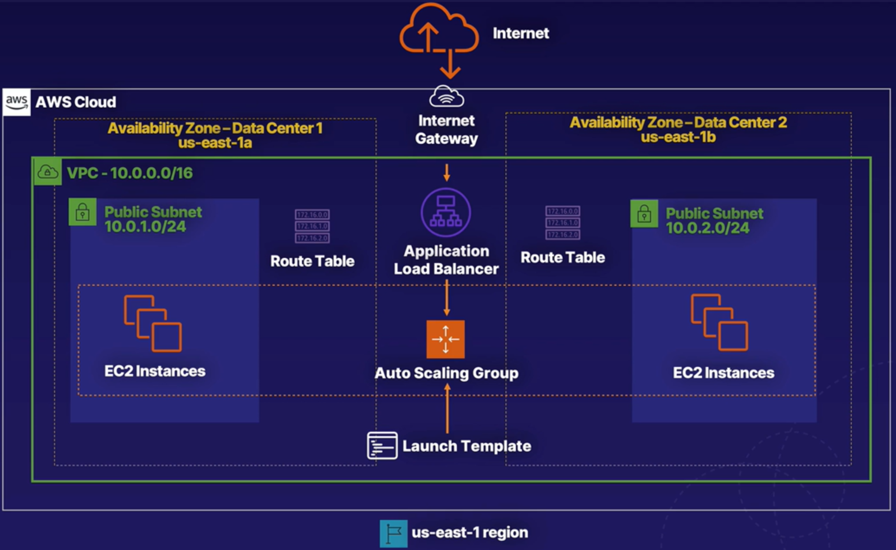


### Create an Application Load Balancer

- EC2 콘솔 - Load Balancer - 로드밸런서 생성

  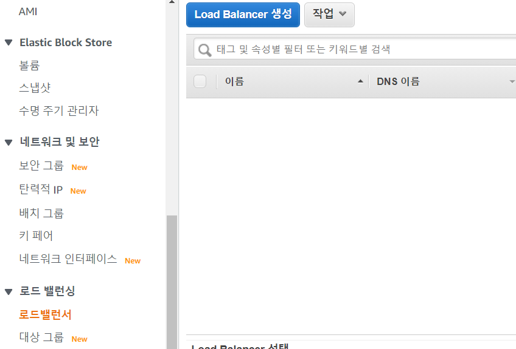

- Application Load Balancer 선택

  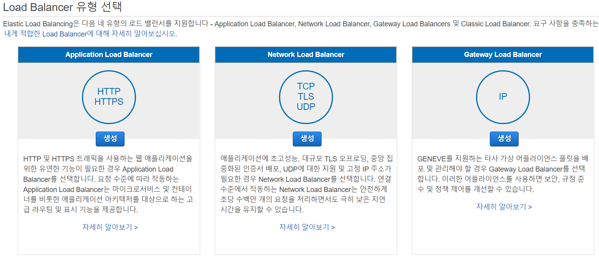

- 다음과 같이 구성

  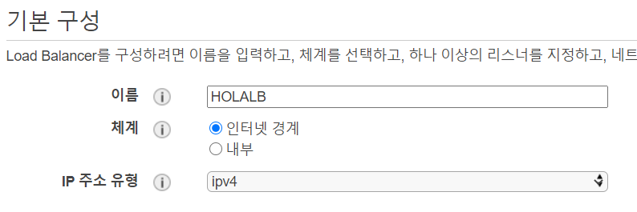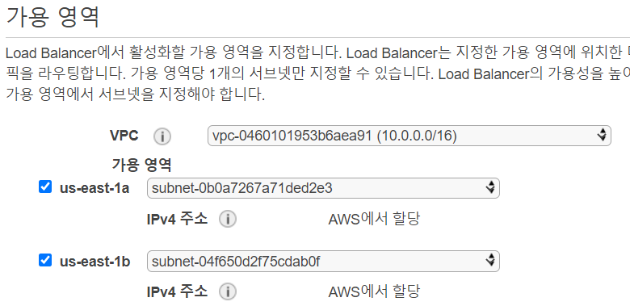

- 새 보안 그룹 구성하고 다음
- 

- 라우팅 구성과 고급상태설정하고 생성

  

  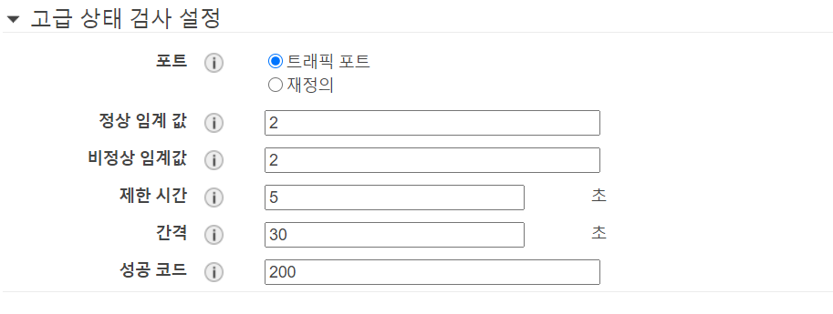

- 로드밸런서 생성 완료

  


### Create a Launch Template

#### Create SSH Key Pair

- 키페어 생성

  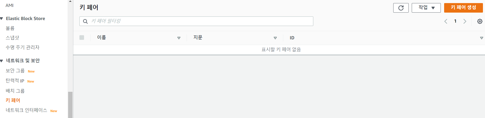

- pem으로 설정하고 생성

  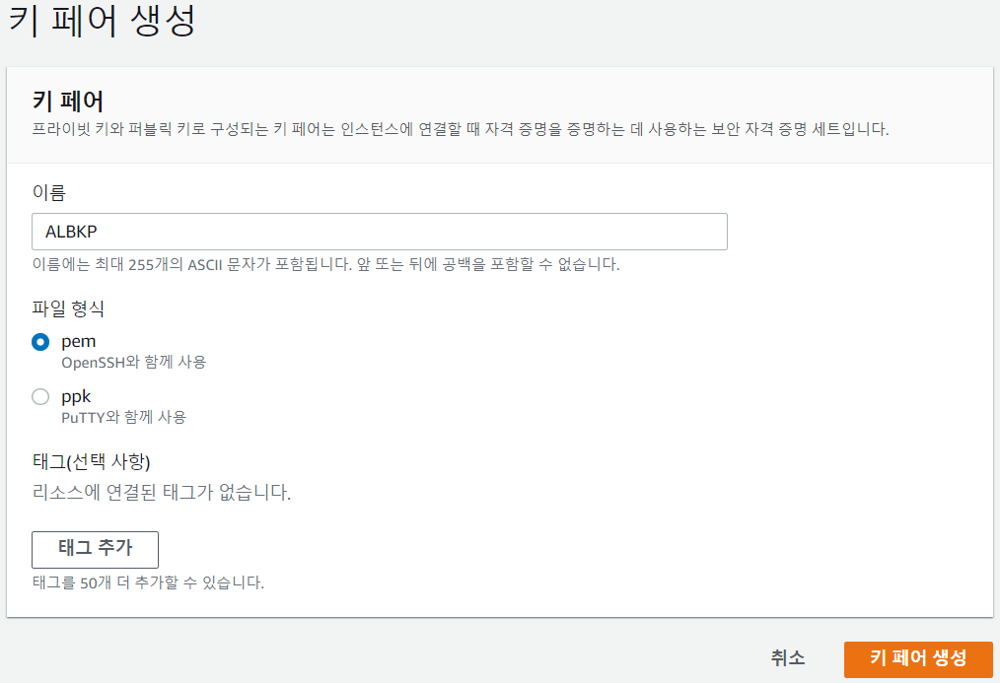

- 키 저장

#### Create Security Group for EC2 Instances

- 보안 그룹 생성

  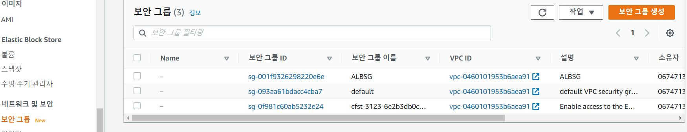

- 보안 그룹 이름과 인바운드 규칙 설정

  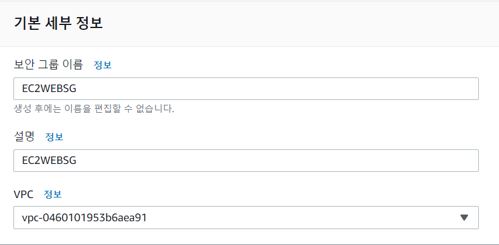

- 생성 완료

#### Create EC2 Instance Launch Template

- 시작 템플릿 생성

  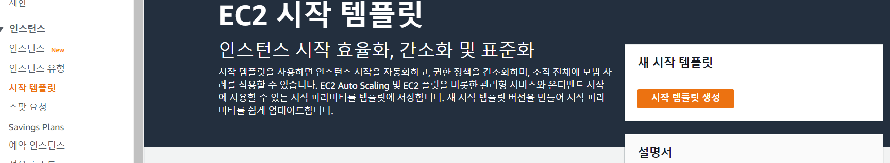

- 아래와 같이 설정

  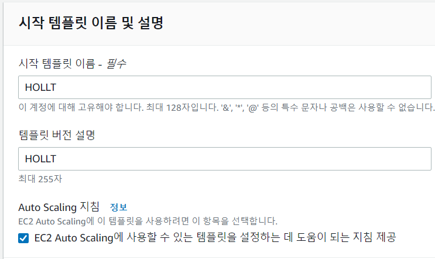

  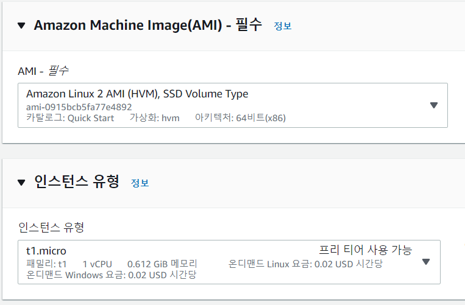

  

- 마지막 맨밑에 Advanced details section - user data box

  ```
  #!/bin/bash
  yum update -y
  yum install -y httpd
  yum install -y wget
  cd /var/www/html
  wget https://raw.githubusercontent.com/ACloudGuru-Resources/Course-Certified-Solutions-Architect-Associate/master/labs/creating-an-auto-scaling-group-and-app-load-balancer-aws/index.html
  wget https://raw.githubusercontent.com/ACloudGuru-Resources/Course-Certified-Solutions-Architect-Associate/master/labs/creating-an-auto-scaling-group-and-app-load-balancer-aws/acg.jpg
  service httpd start
  ```

  - 다음 내용 추가

- 생성완료


### Create an Auto Scaling Group

- 생성한 로드밸런서 active 상태인지 확인

  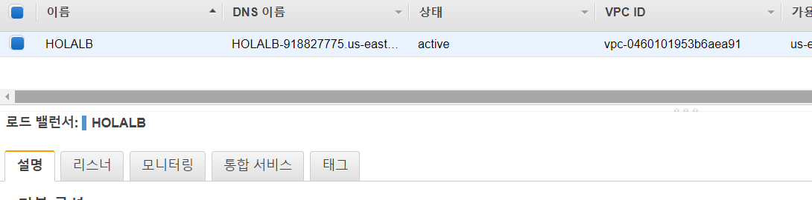

- Auto Scaling 그룹 생성

  

- 이름과 시작 템플릿 설정

  

- 시작 템플릿 준수 선택 및 2개 서브넷 모두 선택

  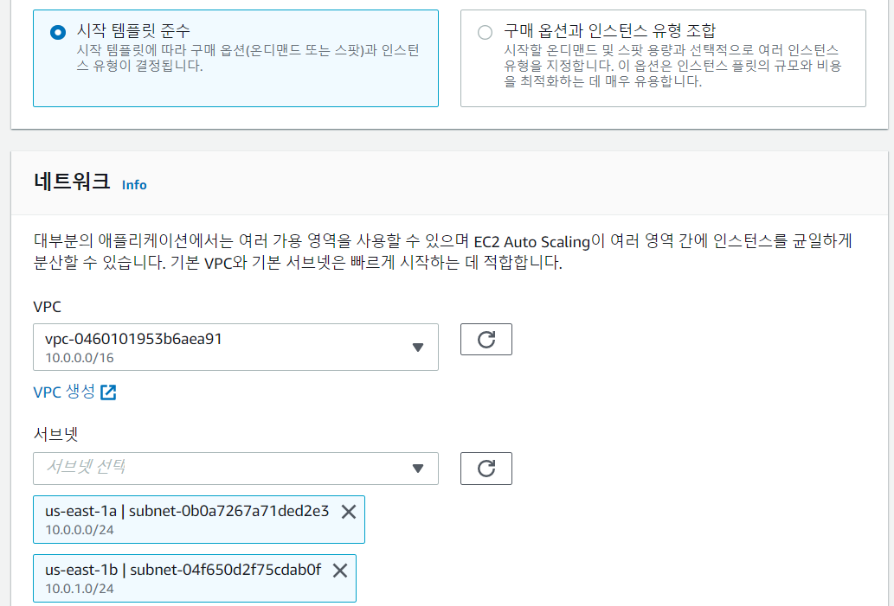

- 생성한 로드밸런서와 연결

  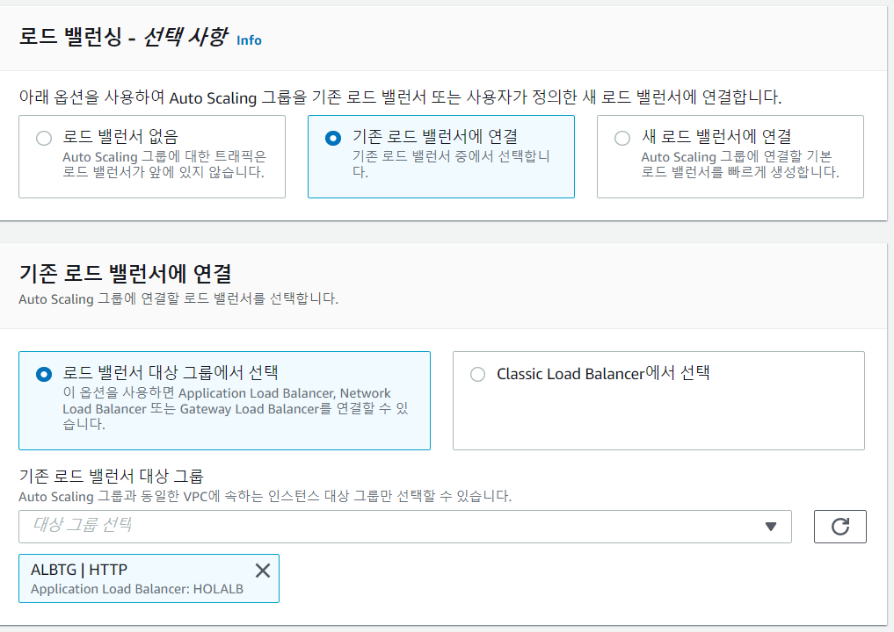

  

- 그룹 크기와 조정 사항 선택

  

- 로드밸런서 DNS 주소 복사

  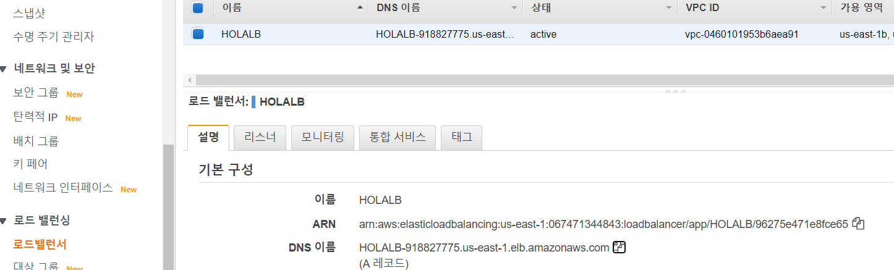

- 접속 확인

  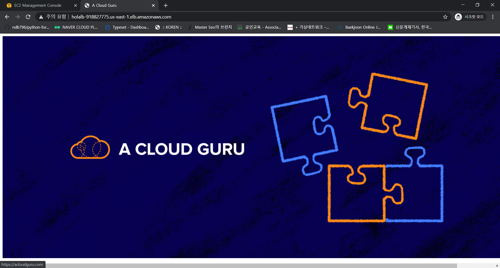


### Test Horizontal Scaling

- 생성된 인스턴스 중 하나 접속

  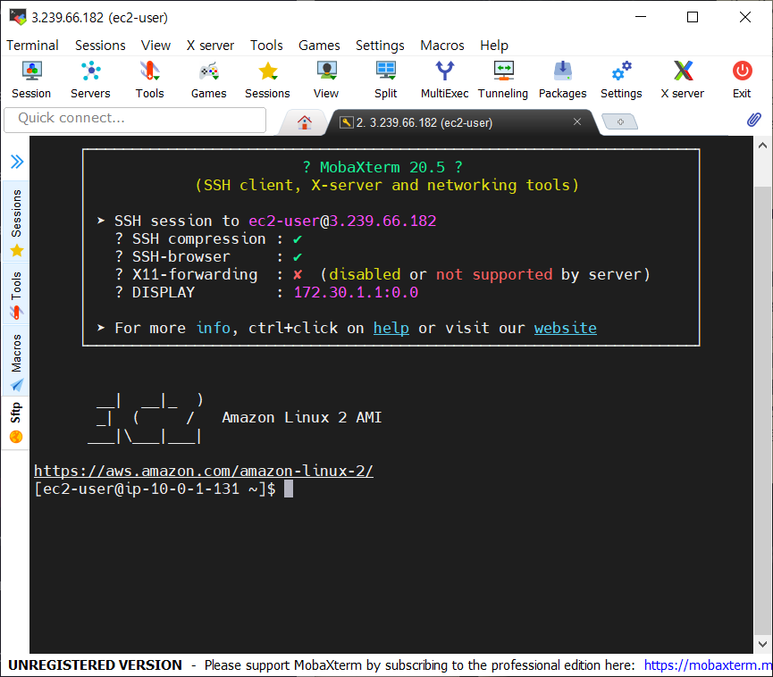

- 테스트를 위한 스트레스 어플리케이션 설치

  ```
  $ sudo amazon-linux-extras install epel -y
  $ sudo yum install -y stress
  ```

- 스트레스 테스트

  ```
  $ stress --cpu 2 --timeout 300
  ```

  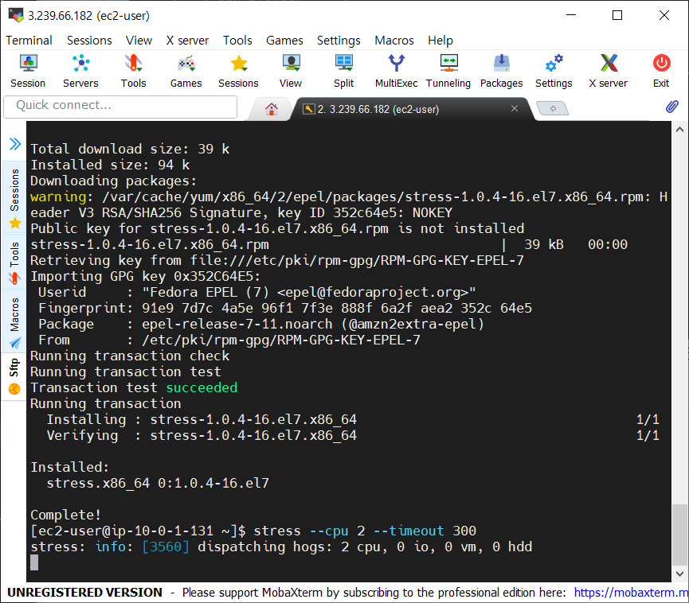

- CPU 사용률 높이기 전 인스턴스 2개

  

- 오토 스케일링을 통해 인스턴스 증가

  