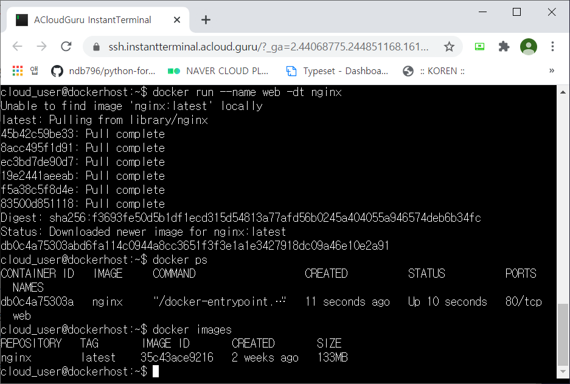
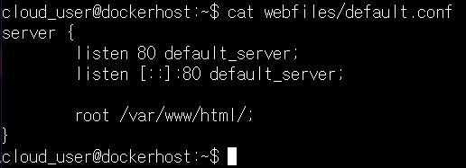
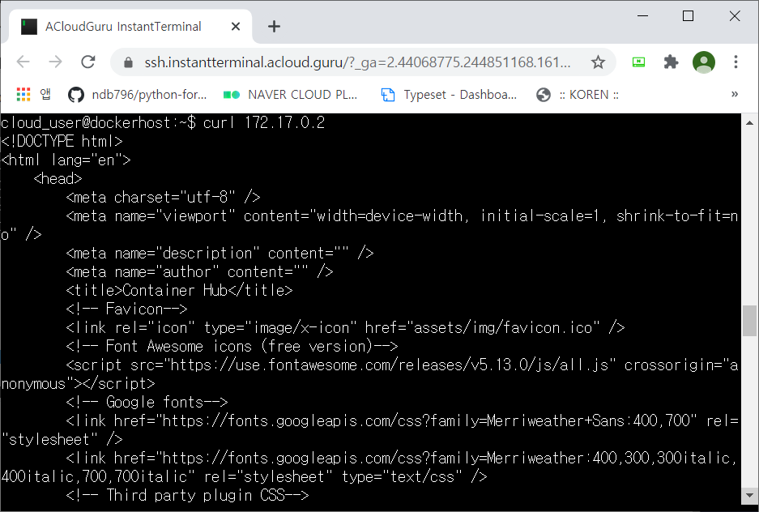

# 05. Working with Docker Containers

- nginx 도커 이미지를 이용해 웹 서비스

### Create an Nginx Container

- ssh 로그인

  

- run docker

  `$ docker run --name web -dt nginx`

- 실행되는 컨테이너와 이미지 확인

  `$ docker images`

  `$ docker ps`

  

- webfiles 밑에 default.conf 확인

  `$ cat webfiles/default.conf`

  

### Configure Nginx

- web 컨테이너에 /var/www/ 폴더 생성

  `$ docker exec web mkdir /var/www`

- default.conf 파일 복사

  `$ docker cp webfiles/default.conf web:/etc/nginx/conf.d/default.conf`

- webfiles/html 폴더 컨테이너의 /var/www/ 밑에 복사

  `$ docker cp webfiles /html web:/var/www/`

- 복사 확인

  `$ docker exec web ls /var/www/html`

  

- /var/www/html 폴더 권한 변경

  `$ docker exec web chown -R nginx:nginx /var/www/html`

- reload docker

  `$ docker exec web nginx -s reload`

  

### Test and Publish the Website to Port 80

- 컨테이너 IP 확인

  `$ docker inspect web | grep IPAddress`

  

- curl을 통해 접속

  `$ curl 172.17.0.2`

  

- 변경한 컨테이너 새로운 이미지 생성

  `$ docker commit web web-image`

- 생성한 이미지 run

  `$ docker run -dt --name web01 -p 80:80 web-image`

- curl을 통해 확인

  `$ curl localhost`

  

- ssh 로그인 IP로 웹에 접속

  

- 모든 응답이 80포트로 설정한 web01에서 응답

- web 컨테이너 필요없으므로 정지 및 삭제

  `$ docker stop web`

  `$ docker rm web`

