# Auto Scaling Group and Application Load Balancer(NGINX)

- EC2에 NGINX를 이용한 웹을 구성하고 로드 밸런서와 오토 스케일링으로 처리

### EC2에 NGINX 설치 및 웹 구성

- 인스턴스 구성

  - ubuntu server 20.04 선택
  - 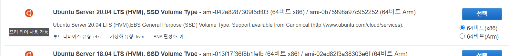

  - 인스턴스 구성

    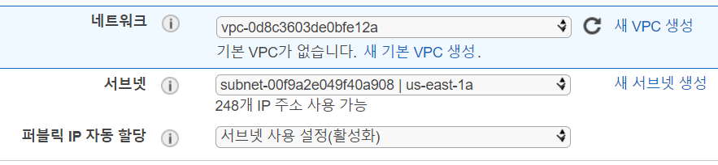

  - 보안 그룹에 HTTP 추가

    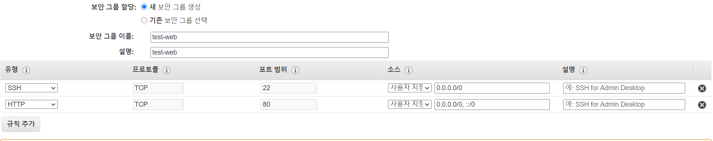

  - 키페어 설정하고 인스턴스 생성

    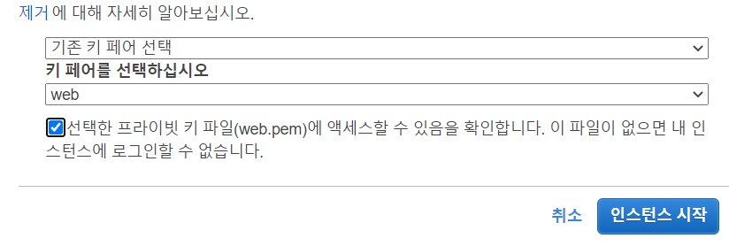

- nginx 설치 및 웹 구성

  - ip를 이용해 ssh 접속

    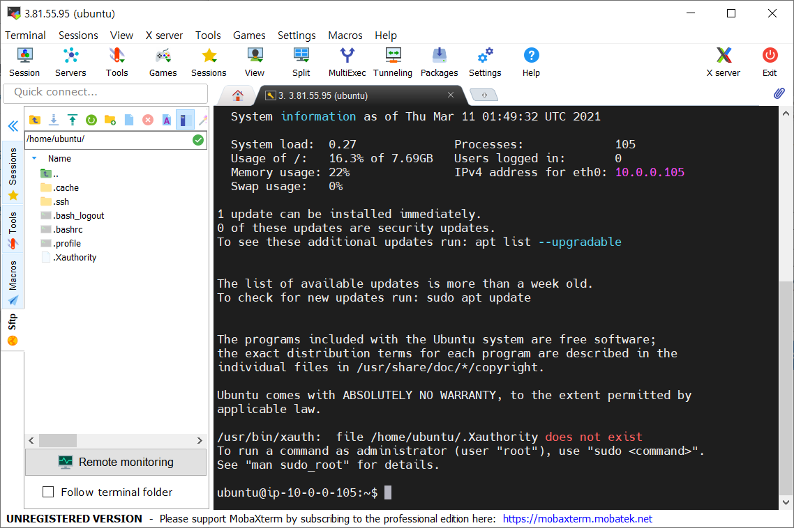

  - web 폴더 생성

    `mkdir web`

  - react에서 생성한 build 폴더 옮기기

    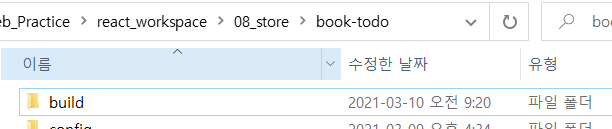

    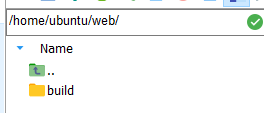

  - nginx 설치

    `sudo apt-get update`

    `sudo apt-get install nginx`

  - 옮긴 build에 있는 파일들 /var/www/html/ 밑으로 복사

    `sudo cp -r ./ /var/www/html/`

    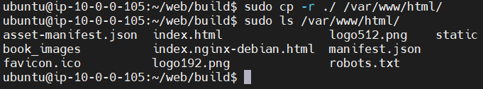

  - nginx 실행

    `sudo service nginx start`

  - ip 접속 확인

    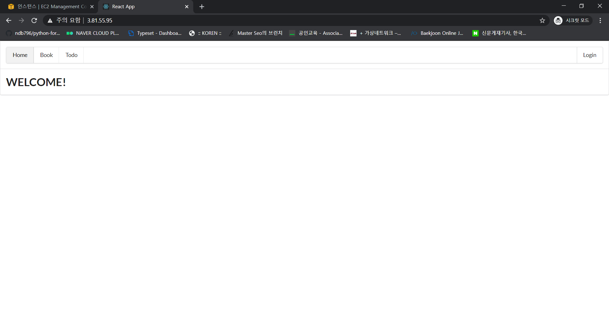

### 생성한 인스턴스를 이용해 AMI 이미지 생성 및 시작 템플릿 설치

- 이미지 생성

  - 이미지 생성 클릭

  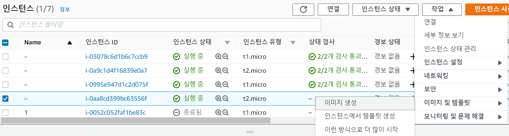
  - 이미지 이름 설정하고 생성

  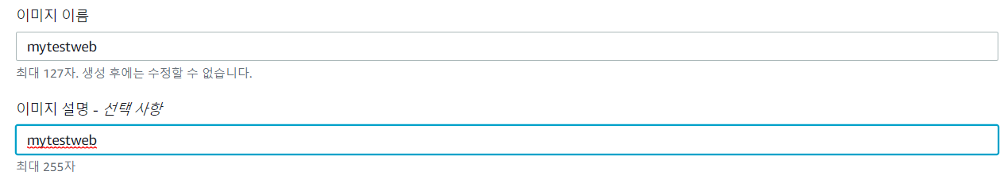
  - 생성한 이미지 상태 available 확인

  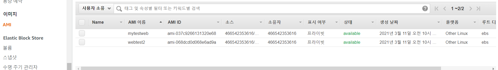

- 시작 템플릿 생성

  - 메뉴의 시작 템플릿 - 생성

    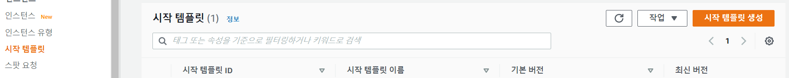

  - 템플릿 설정

    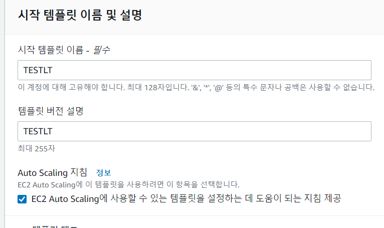

  - AMI는 만들어놓은 이미지 선택

    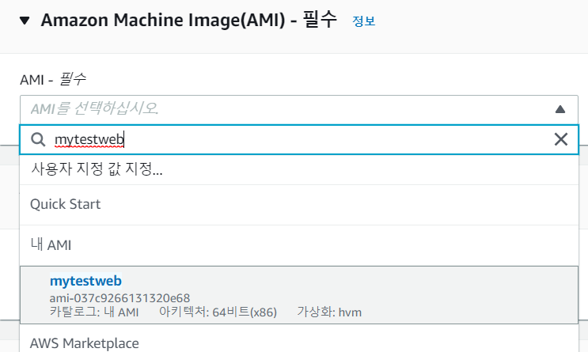

  - 키페어, 보안그룹 모두 인스턴스와 동일하게

    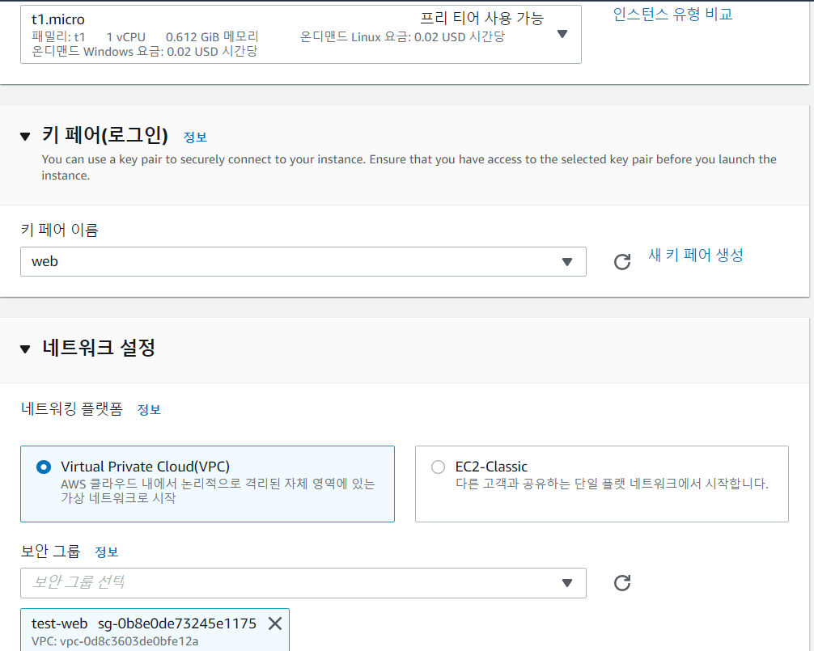

  - 템플릿 생성 완료

    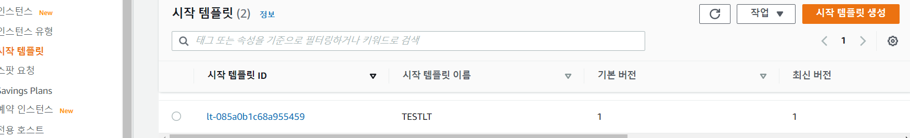

### 로드밸런서 생성

- 로드밸런서 생성 클릭

  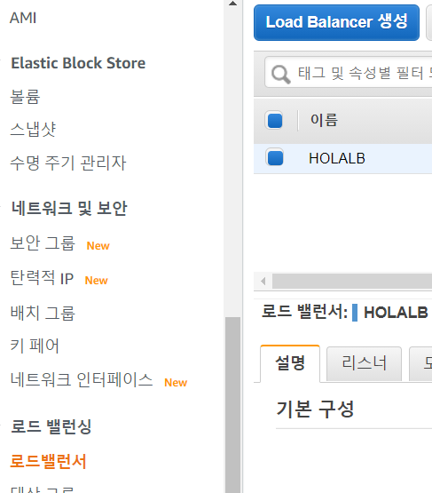

- Application Load Balancer 선택

  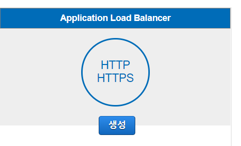

- 기본 구성

  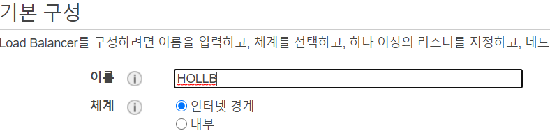

  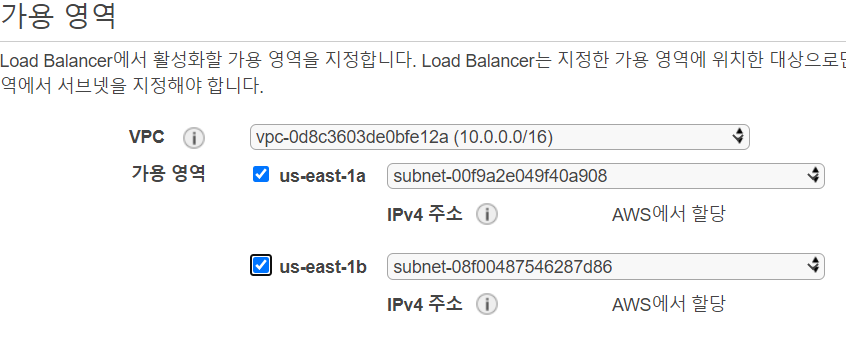

- 보안 그룹 설정

  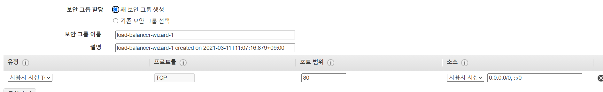

- 라우팅 구성

  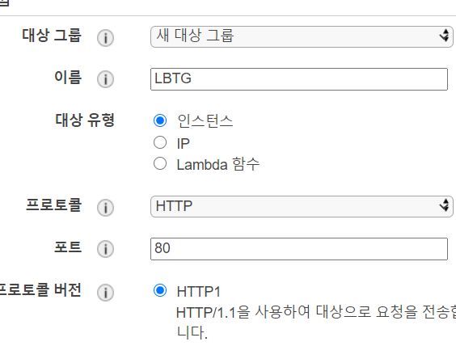

  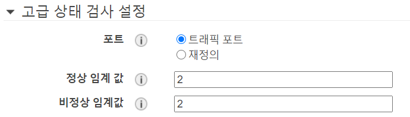

- 로드밸런서 생성 완료

  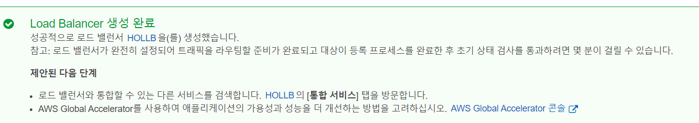

- active 상태 확인

  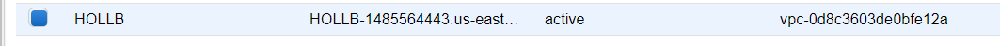

### 오토 스케일링 그룹 생성

- 그룹 생성 클릭

  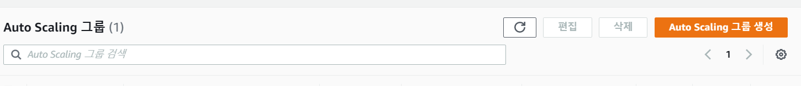

- 이름과 시작 템플릿 선택

  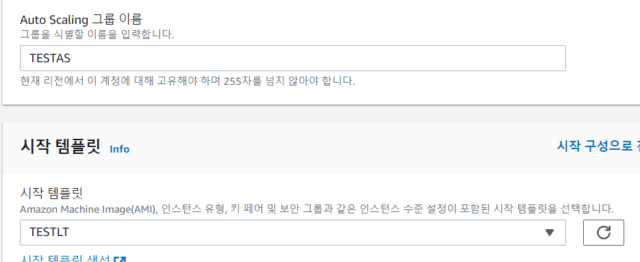

- 시작 템플릿 준수 선택, 네트워크 설정

  

- 생성한 로드밸런서 선택

  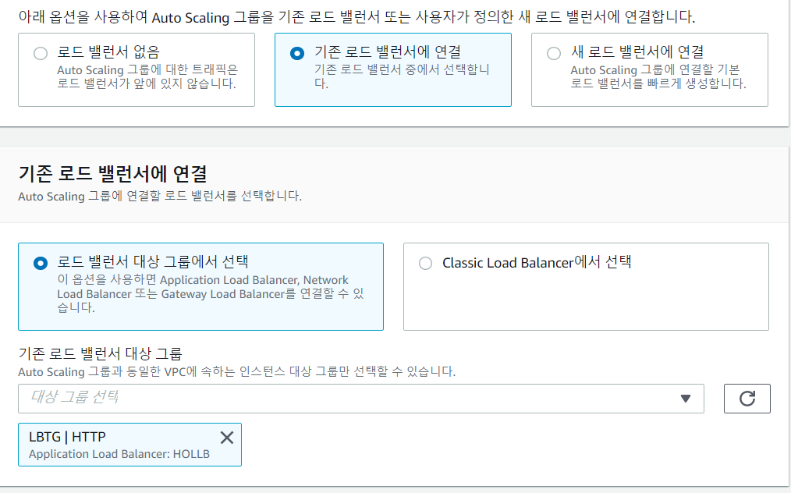

- 모니터링 활성화 선택하고 다음

  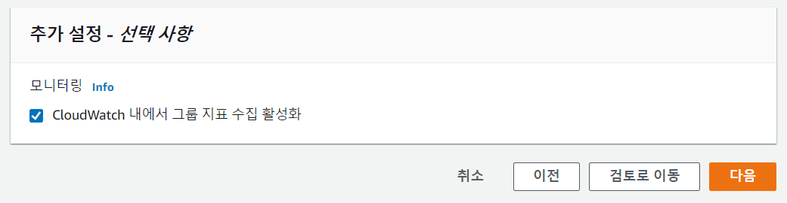

- 그룹 크기 선택

  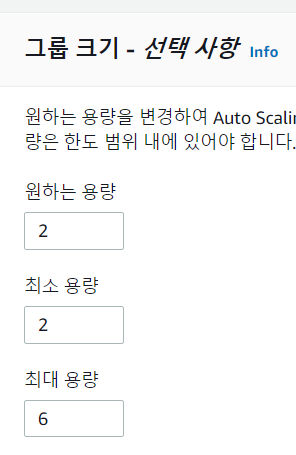

- 정책 설정

  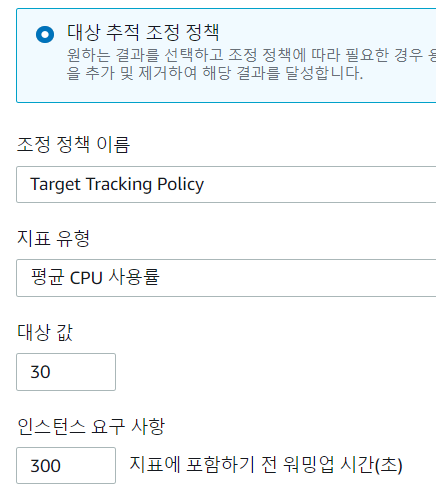

- Auto Scaling 그룹 생성 완료

  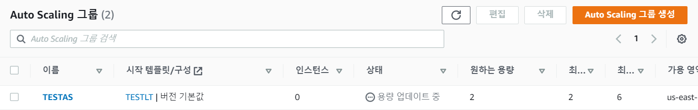

### 테스트

- 오토 스케일링 인스턴스 생성 완료 확인

  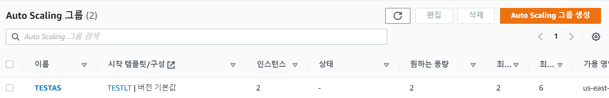

  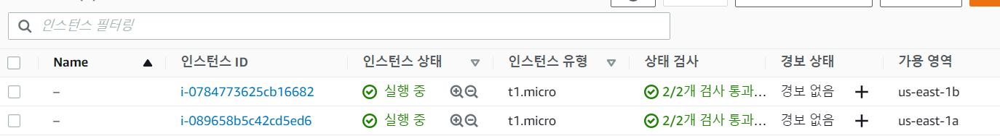

- 로드밸런서 DNS 주소 확인

  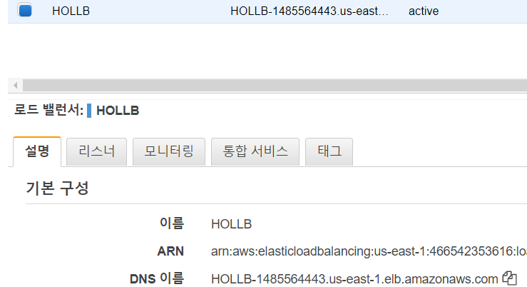

- DNS 주소로 접속, 웹 화면 구동 확인

  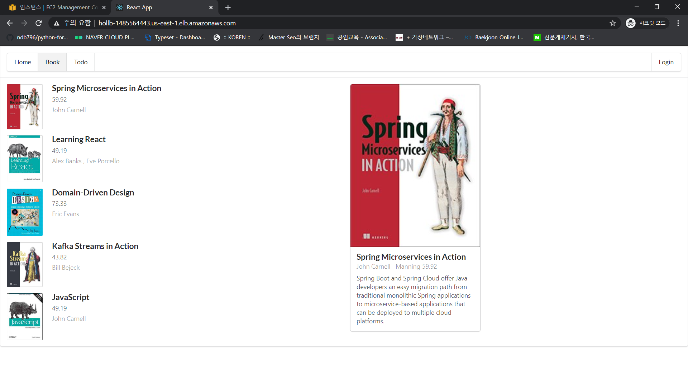