# 7. Using EC2 Roles and Instance Profiles in AWS

- 보안 자격증명을 관리할 필요없는 IAM을 이용하여 수동 관리없이 인스턴스 tempory credential을 자동으로 부여

  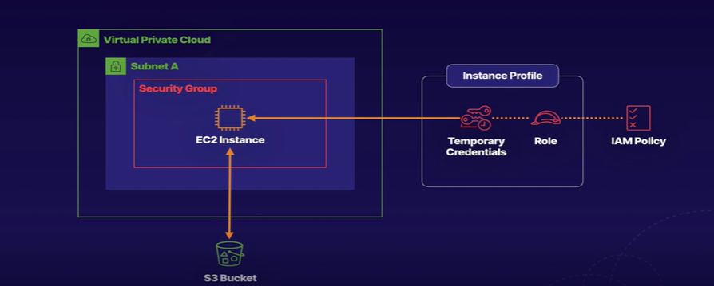


## Create a Trust Policy and Role Using the AWS CLI

### Obtain the labreferences.txt File

- S3 콘솔에서 버킷 리스트 중 이름 중간에 *s3bucketlookupfiles* 들어간 버킷 선택

  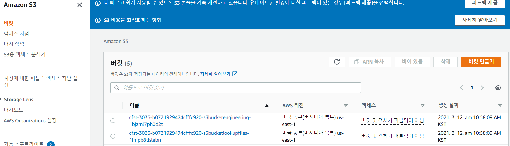

- labreferences.txt 선택

  

- 다운로드

  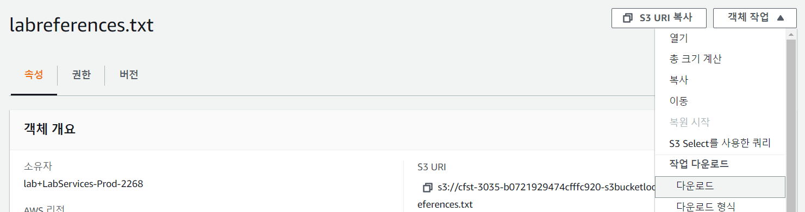

### Log in to Bastion Host and Set the AWS CLI Region and Output Type

- EC2 콘솔 - 인스턴스 - Bastion Host 인스턴스 IP 확인

  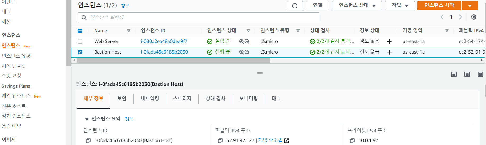

- ssh로 접속

  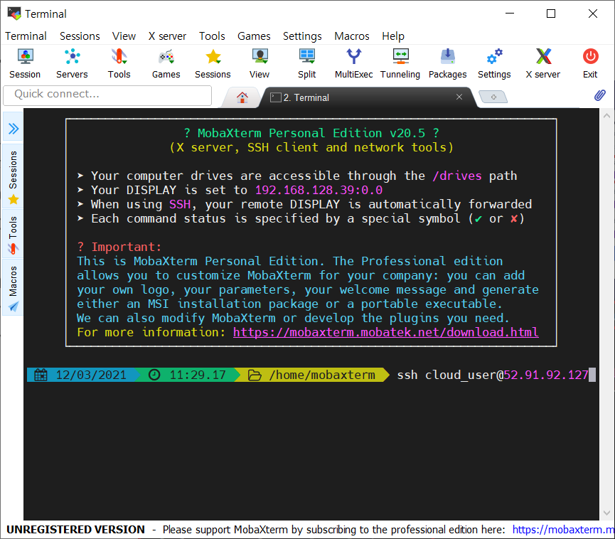

- 비밀번호는 lab 페이지에 있는 번호

  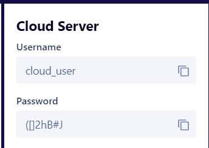

- 접속 완료

  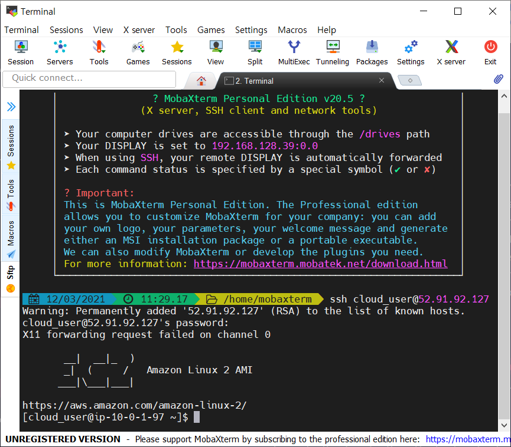

- AWS 설정 변경

  `$ aws configure`

  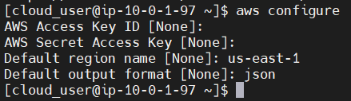

### Create IAM Trust Policy for an EC2 Role

- trust_policy_ec2.json 파일 생성(EC2 인스턴스에 대한 신뢰 정책)

  `$ vim trust_policy_ec2.json`

  ```
  {
    "Version": "2012-10-17",
    "Statement": [
      {
        "Effect": "Allow",
        "Principal": {"Service": "ec2.amazonaws.com"},
        "Action": "sts:AssumeRole"
      }
    ]
  }
  ```

  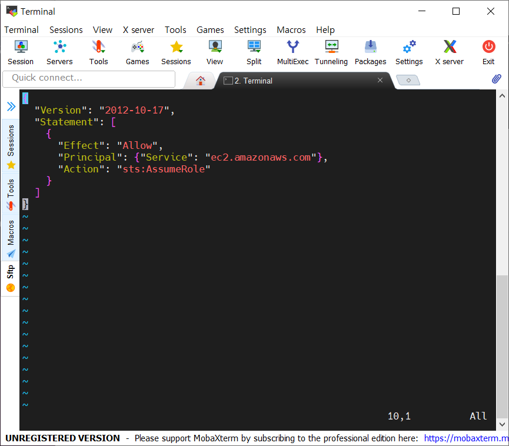

### Create the DEV IAM Role

- DEV IAM 생성

  `$ aws iam create-role --role-name DEV_ROLE --assume-role-policy-document file://trust_policy_ec2.json`

  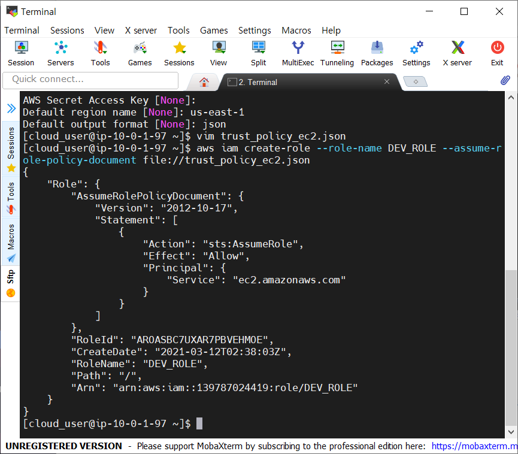

### Create an IAM Policy Defining Read-Only Access Permissions to an S3 Bucket

- S3 Bucket에 대한 읽기 권한을 가진 IAM 정책 생성

- dev_s3_read_access.json 파일 생성

  - <DEV_S3_BUCKET_NAME>은 labreferences.txt파일에 있는 내용으로 변경

  `$ vim dev_s3_read_access.json`

  ```
  {
      "Version": "2012-10-17",
      "Statement": [
          {
            "Sid": "AllowUserToSeeBucketListInTheConsole",
            "Action": ["s3:ListAllMyBuckets", "s3:GetBucketLocation"],
            "Effect": "Allow",
            "Resource": ["arn:aws:s3:::*"]
          },
          {
              "Effect": "Allow",
              "Action": [
                  "s3:Get*",
                  "s3:List*"
              ],
              "Resource": [
                  "arn:aws:s3:::<DEV_S3_BUCKET_NAME>/*",
                  "arn:aws:s3:::<DEV_S3_BUCKET_NAME>"
              ]
          }
      ]
  }
  ```

- DevS3ReadAccess 정책 생성

  `$ aws iam create-policy --policy-name DevS3ReadAccess --policy-document file://dev_s3_read_access.json`

  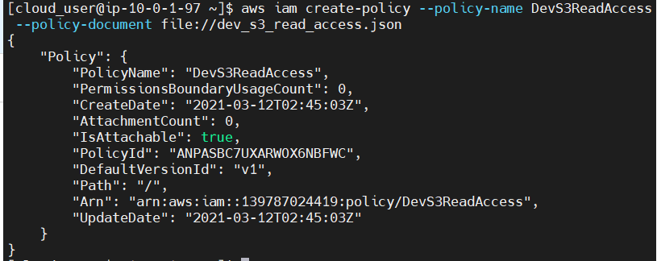

- ARN 복사해서 labreferencess.txt에 붙여넣기


## Create Instance Profile and Attach Role to an EC2 Instance

### Attach Managed Policy to Role

- 관리 정책과 Role 연결

  - <DevS3ReadAccess_POLICY_ARN>은 마지막에 복사한 ARN 넣기

  `$ aws iam attach-role-policy --role-name DEV_ROLE --policy-arn "<DevS3ReadAccess_POLICY_ARN>"`

- 정책 연결 확인

  `$ aws iam list-attached-role-policies --role-name DEV_ROLE`

  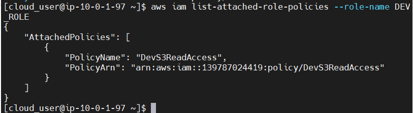

### Create the Instance Profile and Add the `DEV_ROLE` via the AWS CLI

- 인스턴스 프로파일 DEV_PROFILE 생성 

  `$ aws iam create-instance-profile --instance-profile-name DEV_PROFILE`

  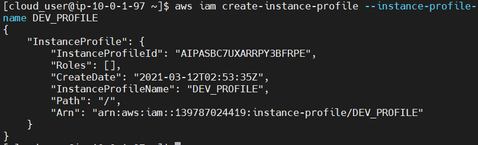

- role 추가

  `$ aws iam add-role-to-instance-profile --instance-profile-name DEV_PROFILE --role-name DEV_ROLE`

- 설정 수정

  `$ aws iam get-instance-profile --instance-profile-name DEV_PROFILE`

  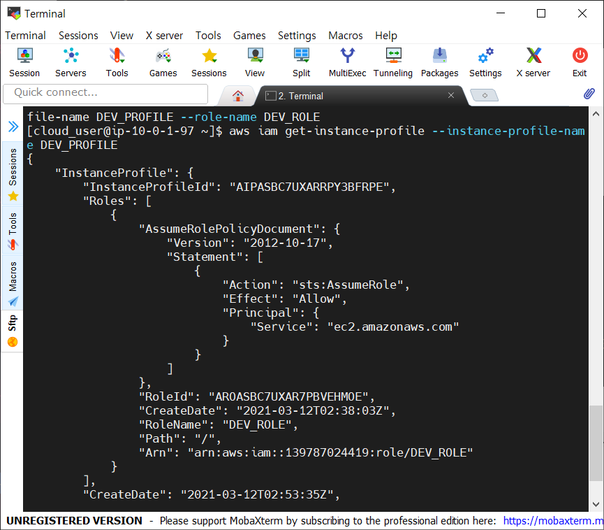

### Attach the DEV_PROFILE Role to an Instance

- EC2 - 인스턴스에서 Web Server 인스턴스 ID 복사
- 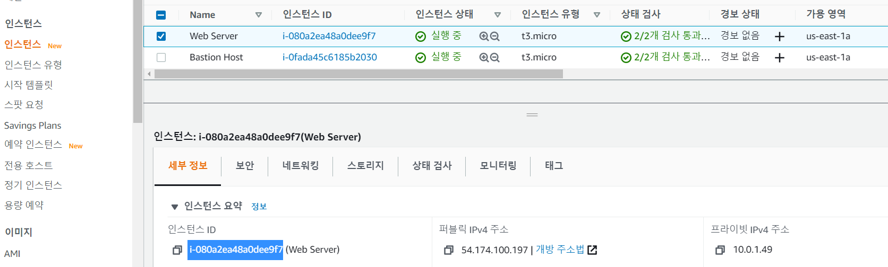

- 인스턴스와 DEV_PROFILE 연결

  - <LAB_WEB_SERVER_INSTANCE_ID>에는 복사한 인스턴스 ID 넣기

  `$ aws ec2 associate-iam-instance-profile --instance-id <LAB_WEB_SERVER_INSTANCE_ID> --iam-instance-profile Name="DEV_PROFILE"`

  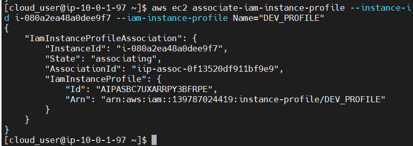

- 설정 확인

  `$ aws ec2 describe-instances --instance-ids <LAB_WEB_SERVER_INSTANCE_ID>`

- 출력에서 IamInstanceProfile 섹션을 찾고 Arn이 DEV_PROFILE로 끝나는지 확인

  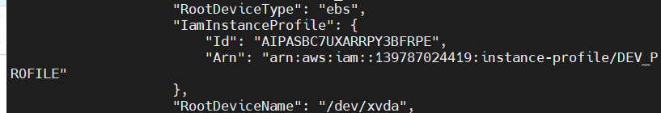


## Test S3 Permissions via the AWS CLI

- Web Server 인스턴스 IP 복사

  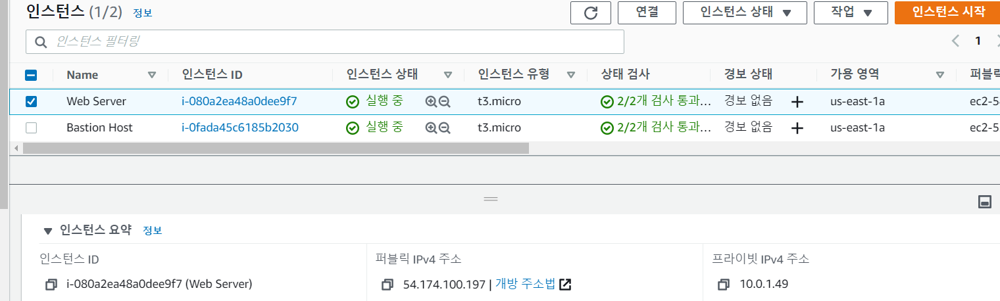

- ssh 접속

  - 비밀번호는 lab 페이지

  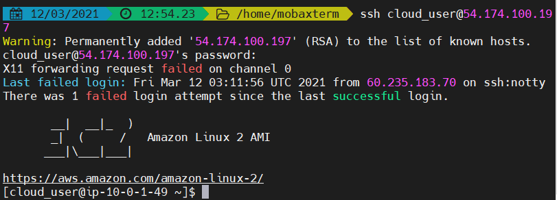
  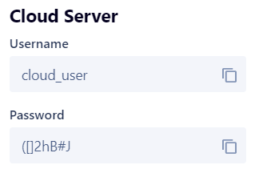

- 인스턴스가 DEV-ROLE 역할을 하고있는지 확인

  `$ aws sts get-caller-identity`

  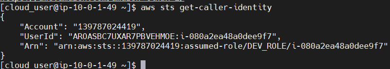

- buckets 리스트 확인

  `$ aws s3 ls`

  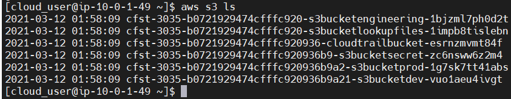

- 파일 리스트 중 s3bucketdev-가 들어간 버킷의 이름 복사해서 <s3bucketdev-123>에 넣기

  `$ aws s3 ls s3://<s3bucketdev-123>`

- 버킷 접속

  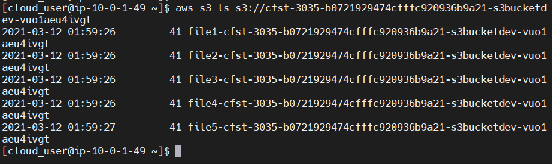


## Create an IAM Policy and Role Using the AWS Management Console

### Create Policy

- IAM - 정책 - 정책 생성

  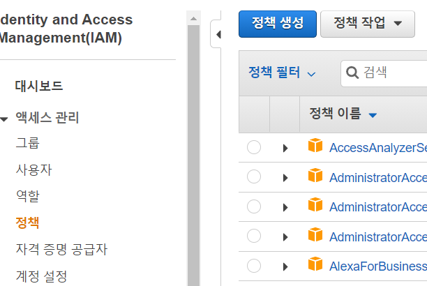

- JSON 탭 선택해서 밑에 내용 복사 붙여넣기

  - 이때 PROD_S3_BUCKET_NAME에는 labreferences.txt파일 내용  넣기

  ```
  {
      "Version": "2012-10-17",
      "Statement": [
          {
            "Sid": "AllowUserToSeeBucketListInTheConsole",
            "Action": ["s3:ListAllMyBuckets", "s3:GetBucketLocation"],
            "Effect": "Allow",
            "Resource": ["arn:aws:s3:::*"]
          },
          {
              "Effect": "Allow",
              "Action": [
                  "s3:Get*",
                  "s3:List*"
              ],
              "Resource": [
                  "arn:aws:s3:::<PROD_S3_BUCKET_NAME>/*",
                  "arn:aws:s3:::<PROD_S3_BUCKET_NAME>"
              ]
          }
      ]
  }
  ```

  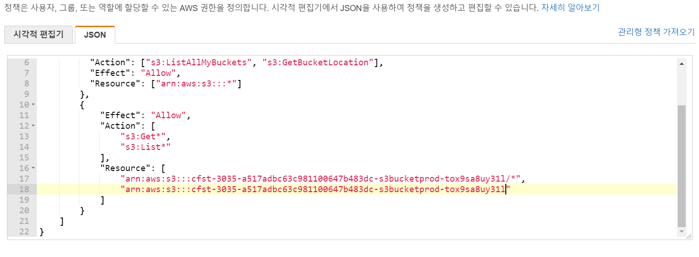

- 정책 이름 설정하고 정책 생성

  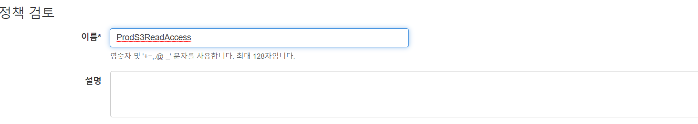

### Create Role

- 역할 - 역할 만들기 선택

  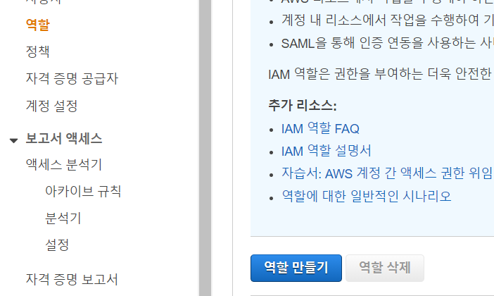

- EC2 선택하고 다음

  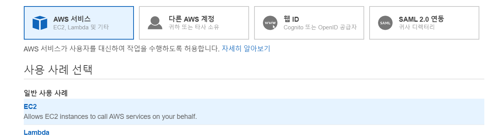

- ProdS3ReadAccess 선택하고 다음

  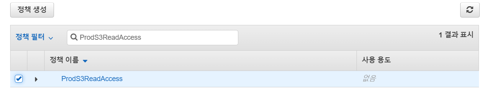

- 역할 이름 설정하고 생성 

  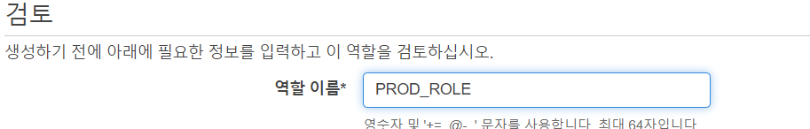


## Attach IAM Role to an EC2 Inastance Using the AWS Management Console

- EC2 - 인스턴스에서 Web Server 인스턴스 선택

  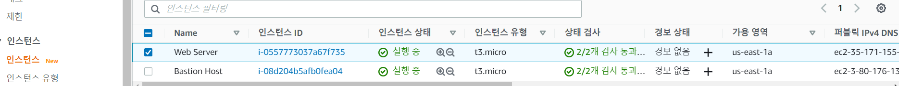

- 작업 - 보안 - IAM 역할 수정 선택

  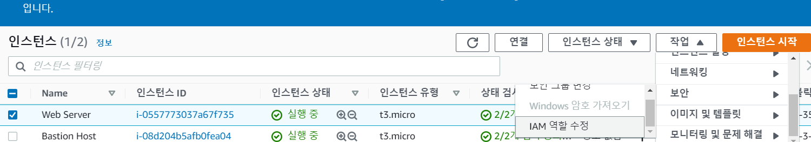

- PROD_ROLE 선택하고 저장

  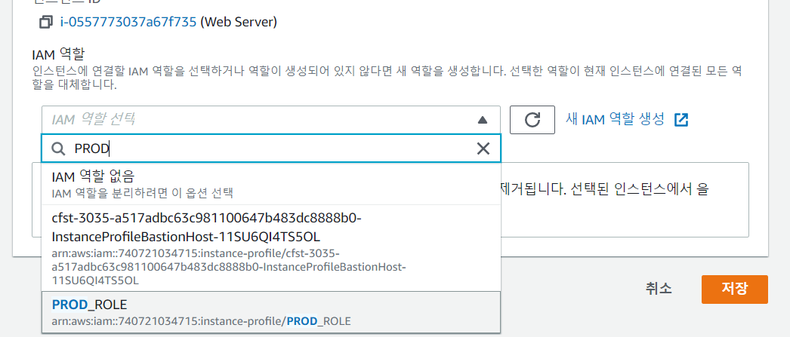


### Test the Configuration

- Web Server 인스턴스 ssh 접속

  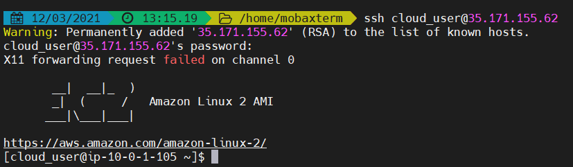

- 현재 사용중인 id와 Arn에 PROD_ROLE이 있는지 확인

  `$ aws sts get-caller-identity`

  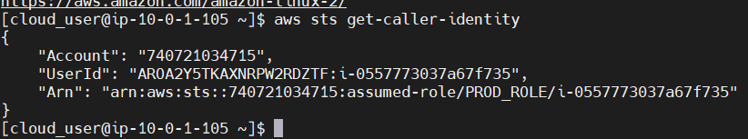

- 버킷 리스트 확인

  `$ aws s3 ls`

  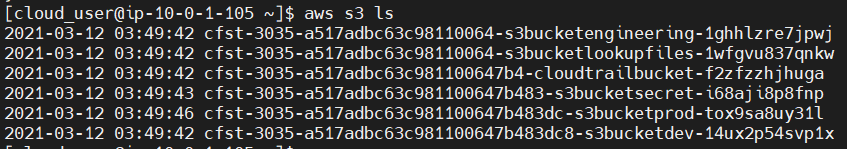

- 버킷 리스트 중에 s3bucketprod-이 들어간 버킷 확인

  - 접속 가능

  `$ aws s3 ls s3://<s3bucketprod-123>`

  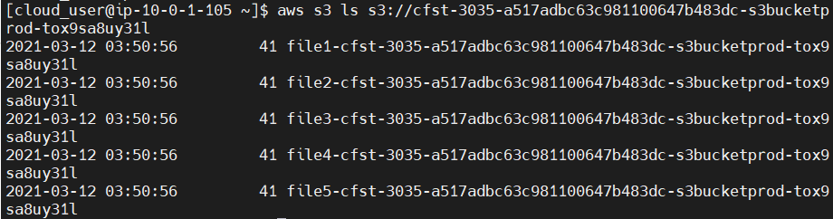

- 버킷 리스트 중 s3bucketsecret의 이름 확인해서 접속

  - 권한이 없어 접속 불가

  `$ aws s3 ls s3://<s3bucketsecret-123>`

  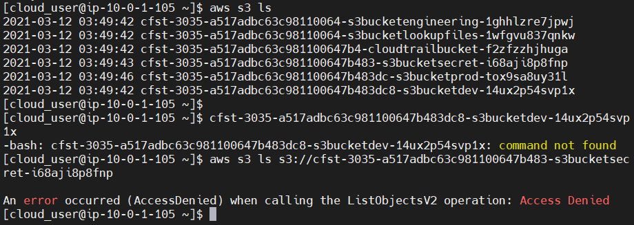