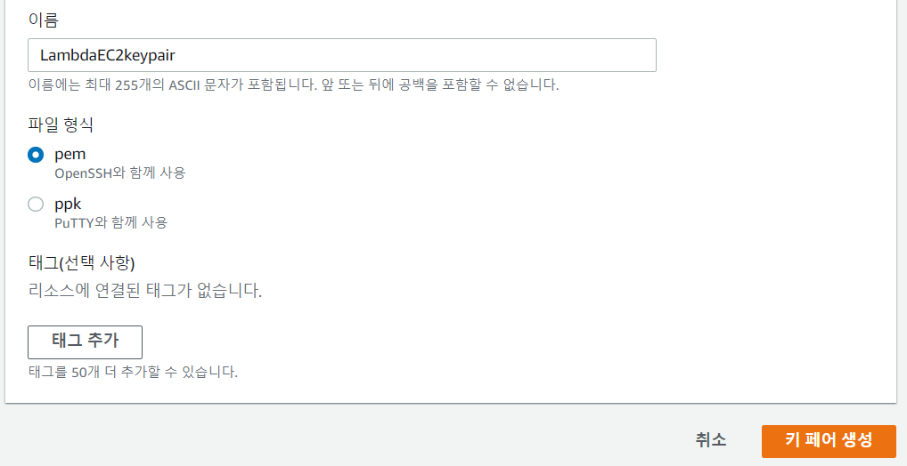
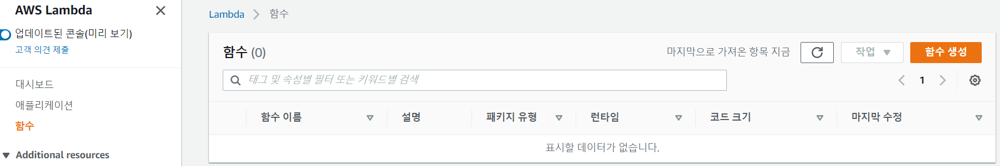
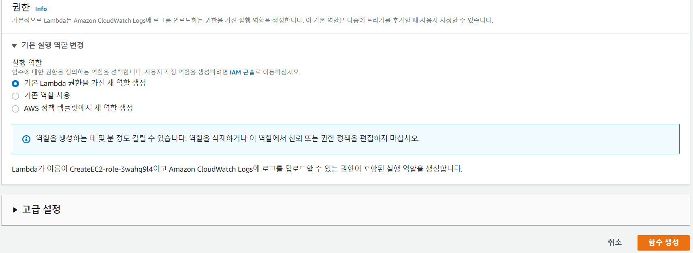
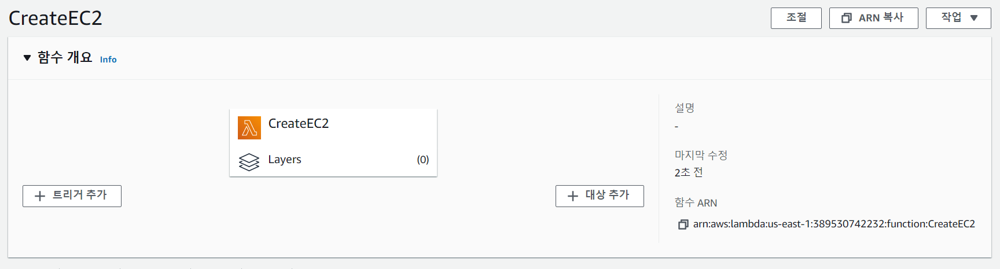
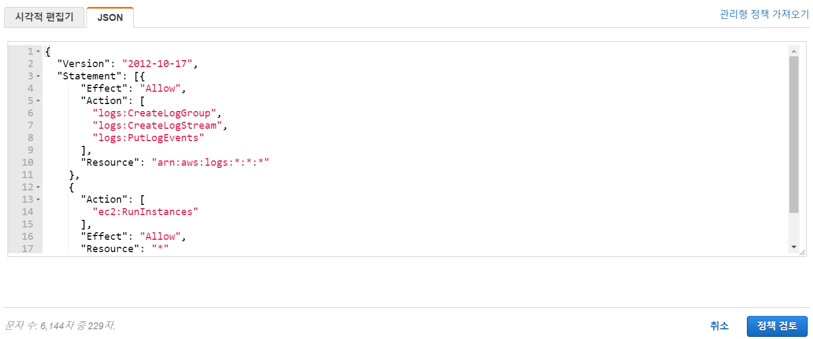
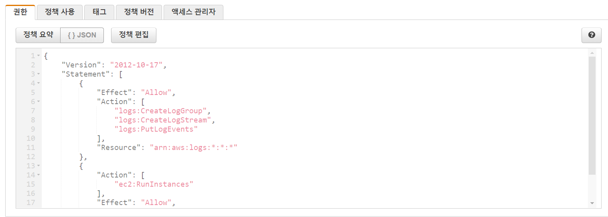
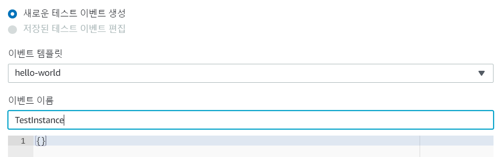
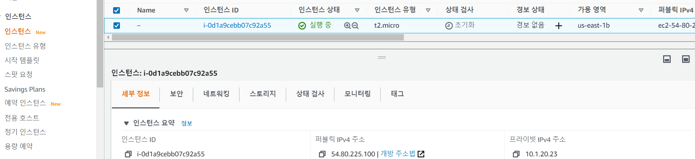
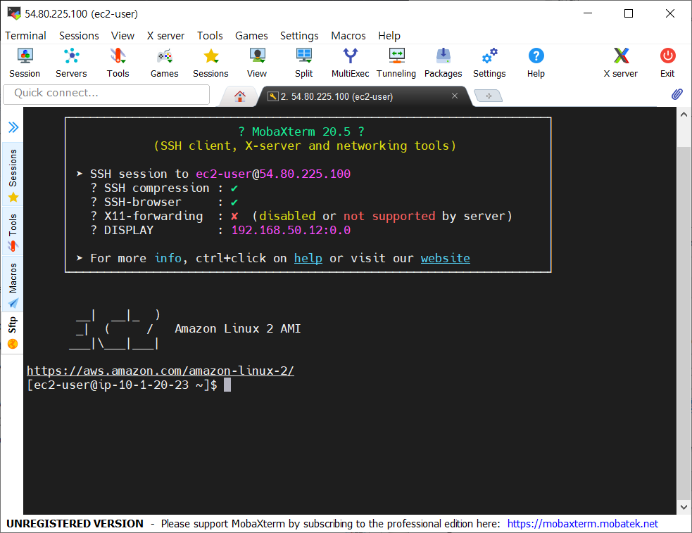

# 8. Creating an EC2 Instance with Lambda in AWS

- Lambda : 함수만으로 서비스를 구축할 수 있는 일종의 Serverless Architecture

- EC2 인스턴스를 생성하는 람다 함수를 파이썬으로 작성

- IAM 역할에 대한 사용자 지정 람다 실행 정책 생성 

  


## Create EC2 Key Pair

- EC2 - 키 페어 - 키페어 생성 클릭

  

- 아래와 같이 설정하고 생성

  


## Create a Lambda Function

- Lambda - 함수 - 함수 생성

  

- 아래와 같이 설정하고 함수 생성

  

  

- 함수 생성 완료

  

- 새 탭을 열어서 IAM - 역할에서 생성한 역할 이름을 검색해 역할 선택

  

- 권한에 연결된 정책 선택

  

- `{} JSON` 선택하고 정책 편집 선택

  

- JSON 선택하고 밑에 내용 복붙

  ```
  {
    "Version": "2012-10-17",
    "Statement": [{
        "Effect": "Allow",
        "Action": [
          "logs:CreateLogGroup",
          "logs:CreateLogStream",
          "logs:PutLogEvents"
        ],
        "Resource": "arn:aws:logs:*:*:*"
      },
      {
        "Action": [
          "ec2:RunInstances"
        ],
        "Effect": "Allow",
        "Resource": "*"
      }
    ]
  }
  ```

  

- 정책 저장 완료

  

- 다시 Lambda 콘솔 페이지로 와서 새로고침

- CreateEC2 function 페이지에서 스크롤을 내려 아래 코드로 수정하고 Deploy

  ```python
  import os
  import boto3
  
  AMI = os.environ['AMI']
  INSTANCE_TYPE = os.environ['INSTANCE_TYPE']
  KEY_NAME = os.environ['KEY_NAME']
  SUBNET_ID = os.environ['SUBNET_ID']
  
  ec2 = boto3.resource('ec2')
  
  
  def lambda_handler(event, context):
  
      instance = ec2.create_instances(
          ImageId=AMI,
          InstanceType=INSTANCE_TYPE,
          KeyName=KEY_NAME,
          SubnetId=SUBNET_ID,
          MaxCount=1,
          MinCount=1
      )
  
      print("New instance created:", instance[0].id)
  ```

  

- 다음으로 구성 - 환경변수 - 편집 선택

  

- 입력하기 전에 새 탭을 열어 EC2 - 인스턴스 시작 - Amazon Linux2의 ami 값 복사

  

- 다음으로 VPC - 서브넷에서 서브넷 ID 복사

  

- 복사한 값드를 채워 환경변수 추가

  


## Test Lambda Function

- Test 선택

  

- 다음과 같이 입력하고 생성 

  

- 테스트클릭

  

- 테스트 결과

  

- EC2 - 인스턴스 생성 확인

  


## Connect to the Instance via SSH 

- 생성된 인스턴스 IP로 SSH 접속

  

- 처음 생성한 키로 접속

  

- 접속 확인

  

