# 9. Creating a Basic Lambda Function to Shut Down an EC2 Instance

- lambda function을 이용해 실행 중인 EC2 인스턴스 중지
  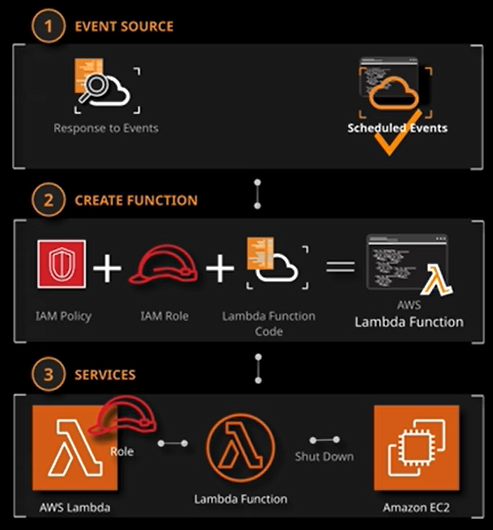


## Create a Basic Lambda Function and a Custom IAM Policy for an IAM Role

- EC2 - 인스턴스 - 실행중인 인스턴스 확인

  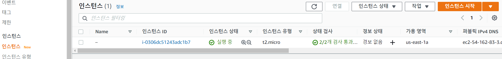

- 실행중인 인스턴스 ID 주소 복사

  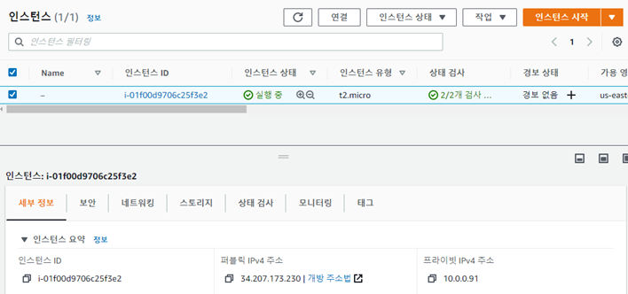

- Lambda - 함수 - 함수 생성 클릭

  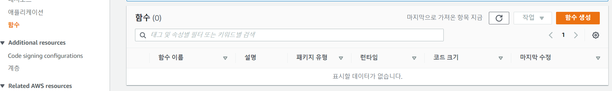

- 함수 설정전에 새 탭열어서 IAM 콘솔에서 역할 생성 

  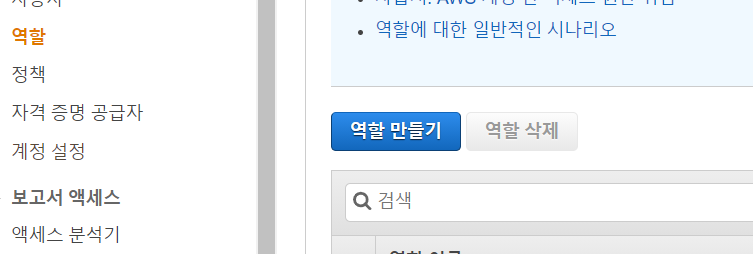 

- AWS 서비스 - Lambda 선택

  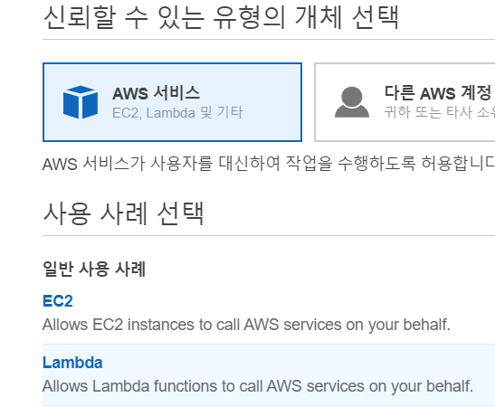

- 태그에 아래와 같이 설정

  

- 역할 이름 설정하고 생성 

  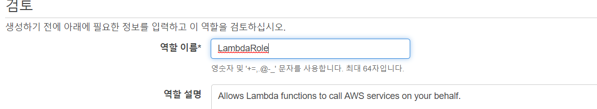

- 생성한 역할 선택

  

- 권한 - 정책연결

  

- 정책 생성 선택

  

- JSON 선택하고 아래 스크립트 넣기

  ```
  {
    "Version": "2012-10-17",
    "Statement": [
      {
        "Effect": "Allow",
        "Action": [
          "logs:CreateLogGroup",
          "logs:CreateLogStream",
          "logs:PutLogEvents"
        ],
        "Resource": "arn:aws:logs:*:*:*"
      },
      {
        "Effect": "Allow",
        "Action": [
          "ec2:Stop*"
        ],
        "Resource": "*"
      }
    ]
  }
  ```

  

- 정책 이름 설정하고 생성 

  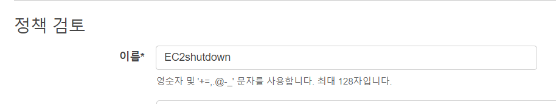

- 생성한 정책 연결 

  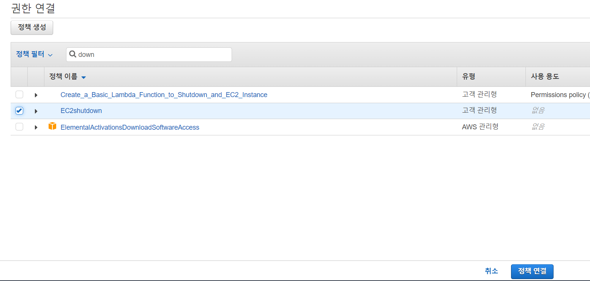

- 생성중이던 Lambda 함수로 돌아와서 아래와 같이 기존 역할 사용 

  

  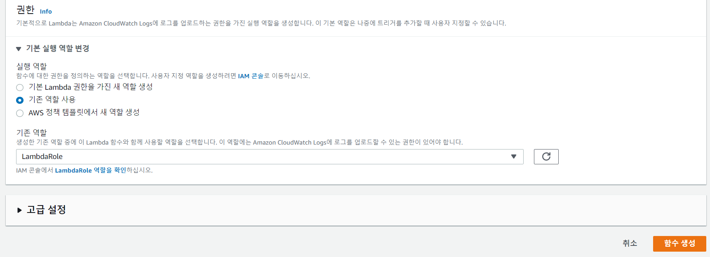

- 함수 생성 완료

  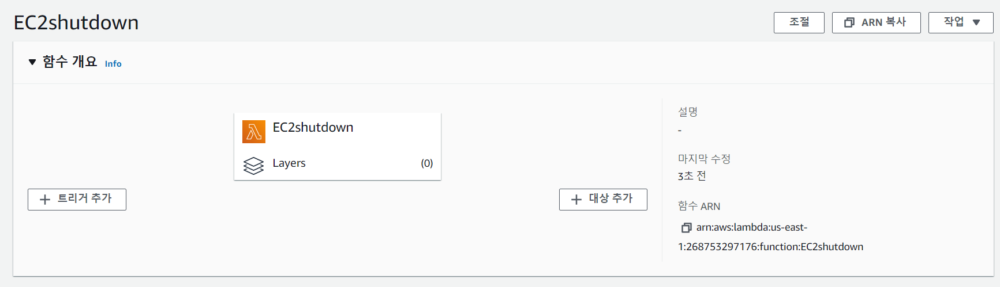


## Create a Test in the Lambda Console

- 테스트 선택

  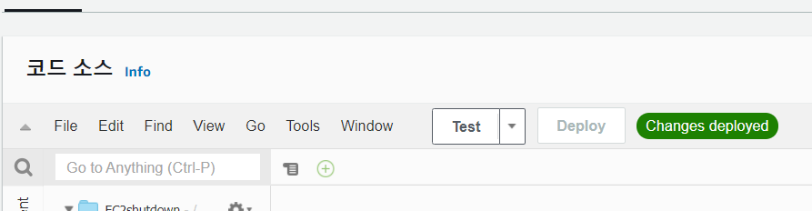

- 이벤트 이름 설정하고 생성

  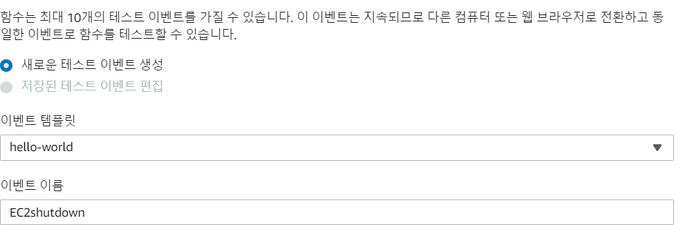

- 함수 소스 코드 변경

  - `instanes = ['<instance id>']` <instance id>에 복사한 id 넣기

  ```python
  import boto3
  #This simple lambda function is available from AWS with instructions on starting and stopping an instance at regular intervals using Lambda and CloudWatch: https://aws.amazon.com/premiumsupport/knowledge-center/start-stop-lambda-cloudwatch/
  # Enter the region your instances are in. Include only the region without specifying Availability Zone; e.g., 'us-east-1'
  region = 'us-east-1'
  # Enter your instances here: ex. ['X-XXXXXXXX'] you can comma separate the instance IDs for more than one instance: i.e. ['X-XXXXXXXXX', 'X-XXXXXXXXX"]
  instances = ['<instance id>']
  
  def lambda_handler(event, context):
      ec2 = boto3.client('ec2', region_name=region)
      ec2.stop_instances(InstanceIds=instances)
  ```

- 변경하고 Deploy

  

- 인스턴스 실행 중 확인 

  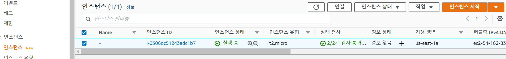

- 다시 Test

  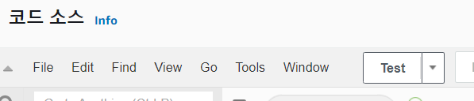

- 테스트 성공

  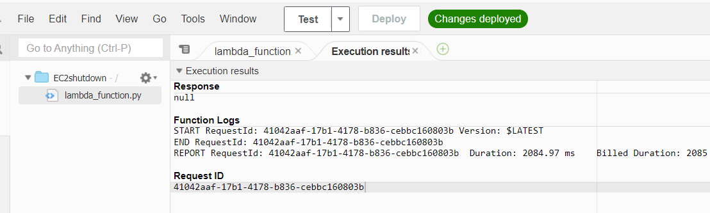

- 인스턴스 확인

  