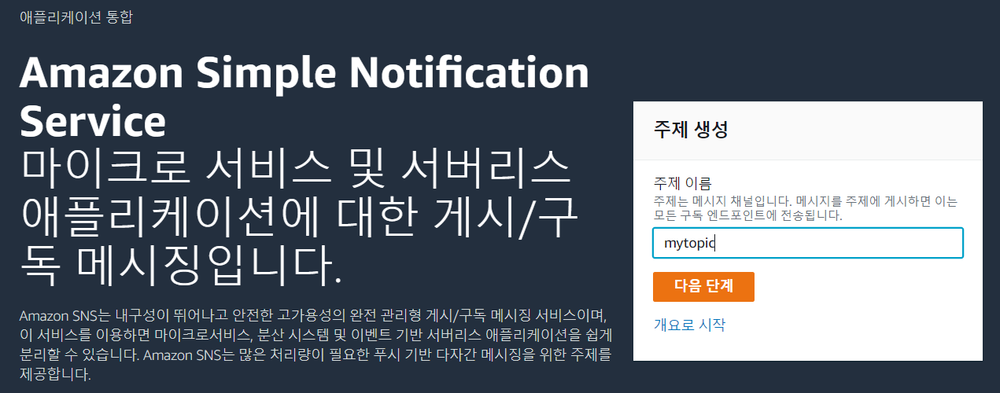
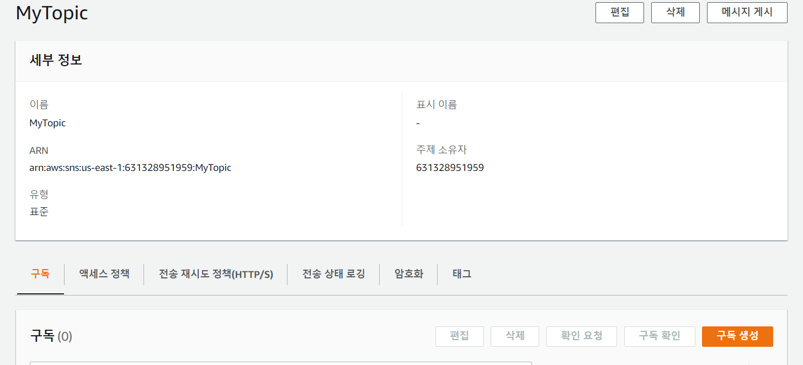
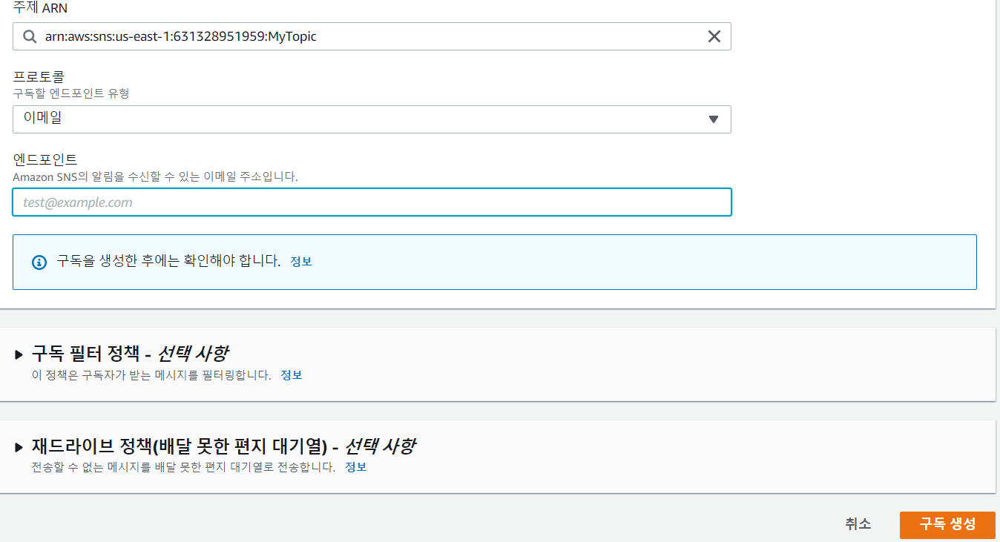
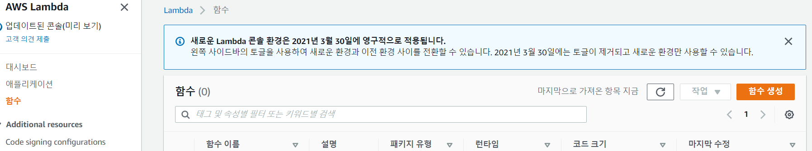
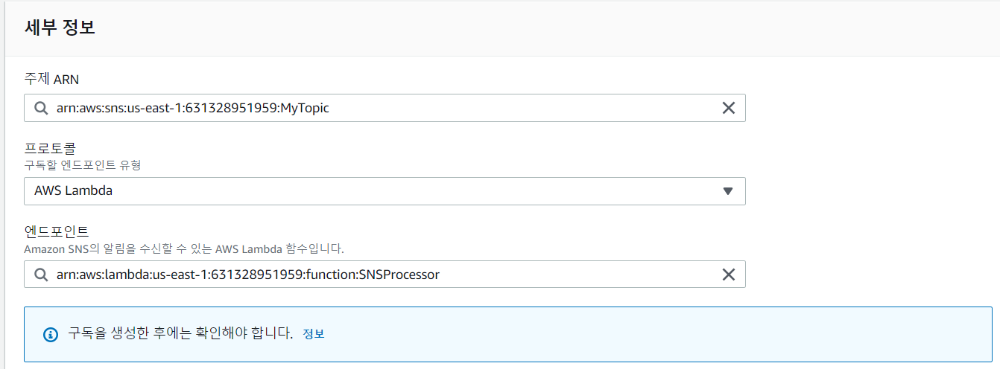
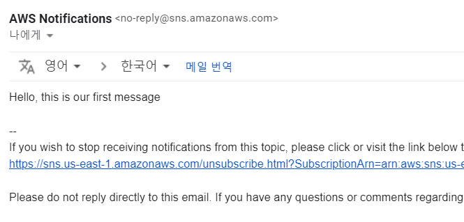
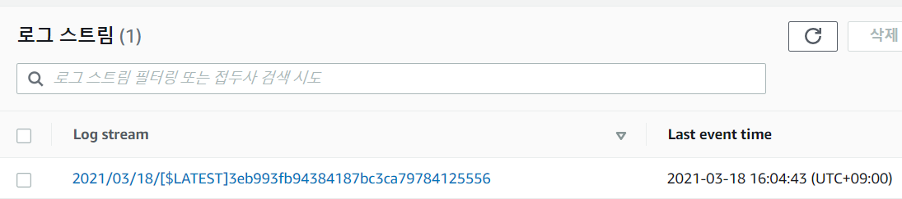

# 10. Creating and Subscribing to AWS SNS Topics

- AWS Simple Notification Service 사용
- Lambda Function을 이용해 구독하고 메일을 받음


## Create an SNS Topic

- SNS 서비스에서 주제 이름 설정하고 다음 단계 선택

  

- 수정없이 바로 주제 생성 클릭

  

- 주제 생성하고 구독 생성 클릭

  

- 프로토콜 이메일, 엔드포인트 메일 주소 입력하고 구독 생성

  

- 주제에서 생성한 토픽 선택

  

- 확인 대기 중

  

- 이메일에서 구독 수락

- 

  


## Create a Lambda Function

- Lambda 콘솔에서 함수 생성

  

- 아래와 같이 설정하고 함수 생성

  

  

- 새 창열어서 SNS 서비스에서 구독 새로 생성

  

- 아래로 설정하고 구독 생성

  

- 다시 Lambda 탭으로 이동해서 아래 코드 입력하고 Deploy

  ```python
  def lambda_handler(event, context):
      message = event['Records'][0]['Sns']['Message']
      print("From SNS: " + message)
      return message
  ```

  


## Send Your SNS Topic to Multiple Endpoints

- SNS - 주제에서 생성한 주제 선택하고 메시지 게시 선택

  

- 제목과 내용 입력하고 메시지 게시

  

- 메일이 온 것을 확인

  

- Lambda 탭에서 모니터링에서 CloudWatch에서 로그 보기 선택

  

- 로그 스트림에 로그 확인

  

  