# Rolling Updates to a Highly Distributed Web Application with AWS CodeDeploy

- AWS CodeDeploy를 사용해 Auto Scaling 그룹에서 실행되고 Elastic Load Balancer 뒤에 표시되는 일련의 EC2 인스턴스에 대한 코드 배포 및 업데이트 관리

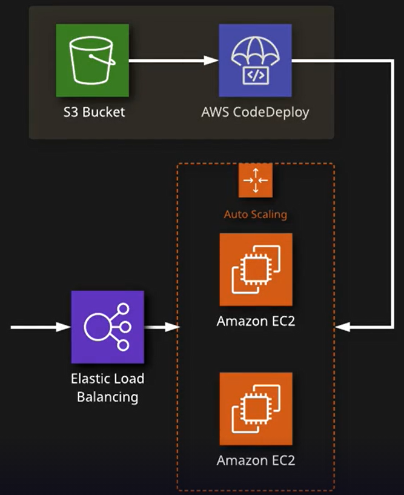

### Create an S3 Bucket to Store Application Code

- Code를 저장할 S3 저장소 생성

- S3 서비스에서 버킷만들기 클릭

  

- 이름과 region을 선택하고 생성

  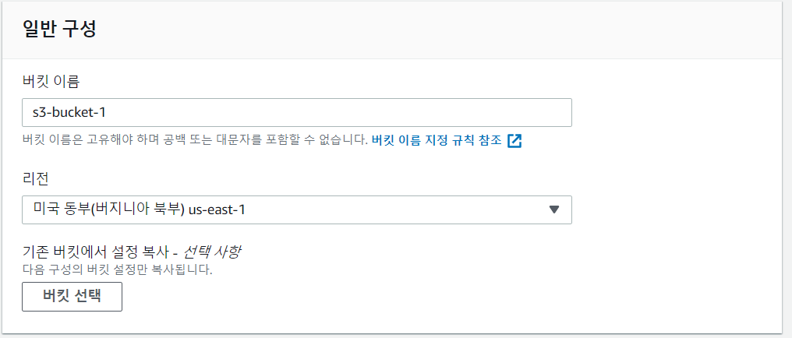

- [github](https://github.com/linuxacademy/content-aws-developertools/tree/master/Rolling-updates-to-a-highly-distributed-web-application-with-AWS-CodeDeploy)에서 `zip`파일 다운로드

- 생성한 s3 버킷에 zip파일 업로드

  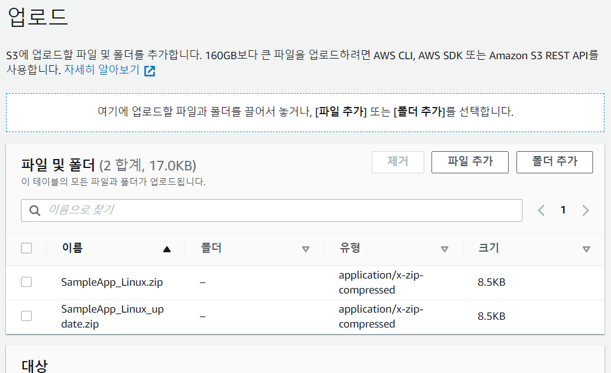

- 업로드 완료

  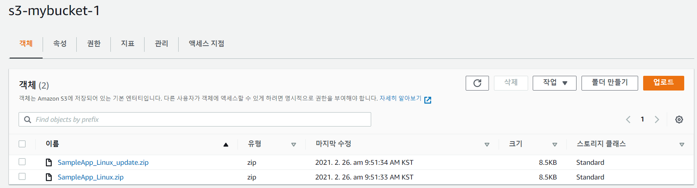

### Create a CodeDeploy In-Place Deployment

#### Create a CodeDeploy Application

- CodeDeploy로 이동해서 어플리케이션 생성

  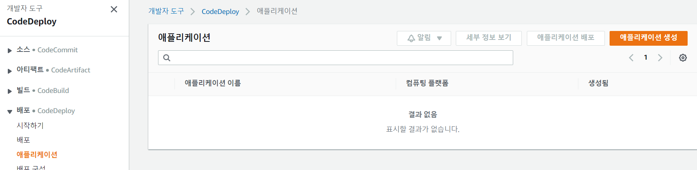

- 이름과 플랫폼 선택하고 생성

  

#### Create a CodeDeploy Deployment Group

- 애플리케이션 세부 화면에서 배포그룹생성 클릭

  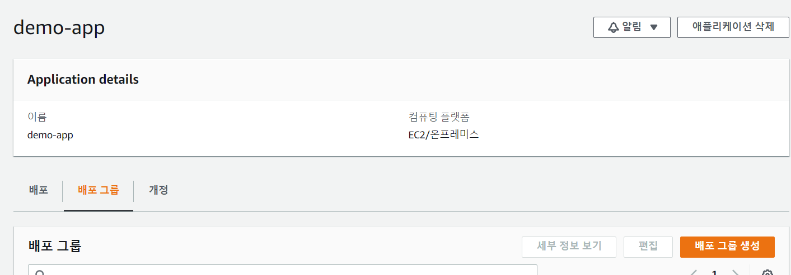

- 각 설정사항

  - 배포그룹이름 : demo-group
  - 서비스 역할 : 생성된 서비스 역할 선택
  - 배포유형 : 현재위치
  - 환경구성 : Amazon EC2 Auto Scaling 그룹 - 생성되있는 오토스케일링 그룹 선택
  - 로드밸런서 : Classic Load Balancer - 생성되있는 로드밸런서 선택

- Deployment Group 생성 완료

  

#### Create a CodeDeploy Deployment

- deployment group 상세화면에서 배포생성 클릭

  

- 저장된 S3 버킷 주소 입력

  - 아래 추가 배포 동작 설정에서 콘텐츠 덮어쓰기 선택

  

- deployment 생성

  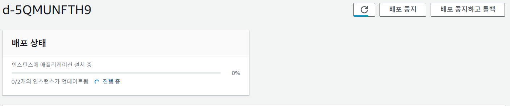

### Test the Deployed Application

- EC2 - 로드밸런서 - DNS주소 복사

  

- 새로운 창에서 DNS 주소 입력

  

### Create a CodeDeploy Blue-Green Deployment

#### Create a CodeDeploy Deployment Group

- 생성한 demo-app에서 새로운 Deployment Group 생성

  

- 배포 그룹 설정
  - 그룹 이름 : demo-blue-green
  - 서비스 역할 : 생성된 서비스 역할 선택
  - Deployment type : Blue/Green
  - 환경구성 : Automatically copy Amazon EC2 Auto Scaling group
  - 로드 밸런서 : Classic Load Balancer
  - 배포 설정
    - 즉시 트래픽 다시 라우팅
    - 배포 그룹의 원본 인스턴스 종료
    - 일, 시간, 분 모두 0

#### Create a CodeDeploy Deployment

- 배포생성 클릭

  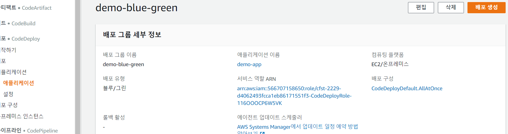

- 배포 설정

  - 아래 컨텐츠 덮어쓰기 선택

  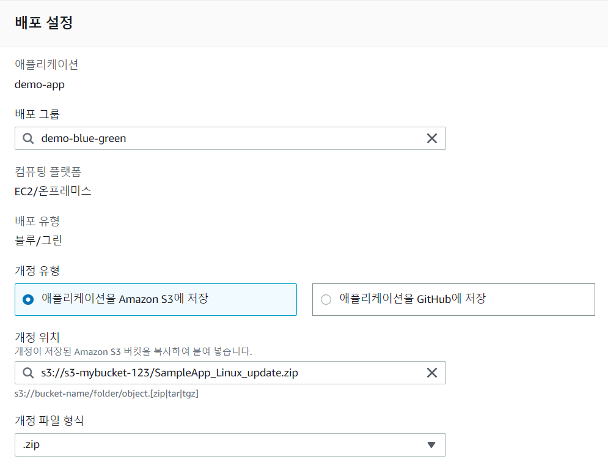

- 배포완료

  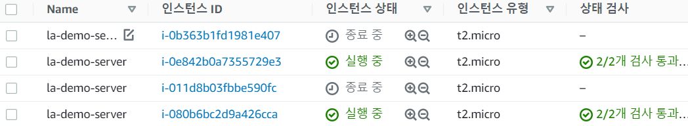

  

### Test the Updated Application

- 이전 테스트와 동일

  

### Perform a Manual Rollback

- 수동 롤백을 수행하는 것은 code-blue에서 현재 위치 배포를 수행하는 것과 동일
- 배포 그룹에서 여러 배포가 수행된 경우 코드를 롤백하는 경우 다른 옵션 존재

#### Create a CodeDeploy Deployment Group

- CodeDeploy - Application - demo-app에서 배포 그룹 생성

  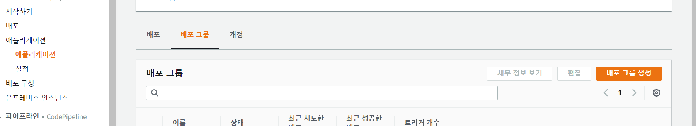

- 배포 그룹 구성
  - 이름 : quick-fix
  - 서비스 역할 선택
  - 배포 타입 : 현재위치
  - 환경 구성 : Amazon EC2 Auto Scaling groups
  - 로드 밸런서 : Classic Load Balancer

#### Create a CodeDeploy Deployment

- 배포그룹 상세 화면에서 배포 생성

  

- 배포 설정

  - 아래 컨텐츠 덮어쓰기 선택

  

- 배포생성

  

- 배포완료되고 다시 접속하면 원래 화면이 나오는 것을 확인 가능

  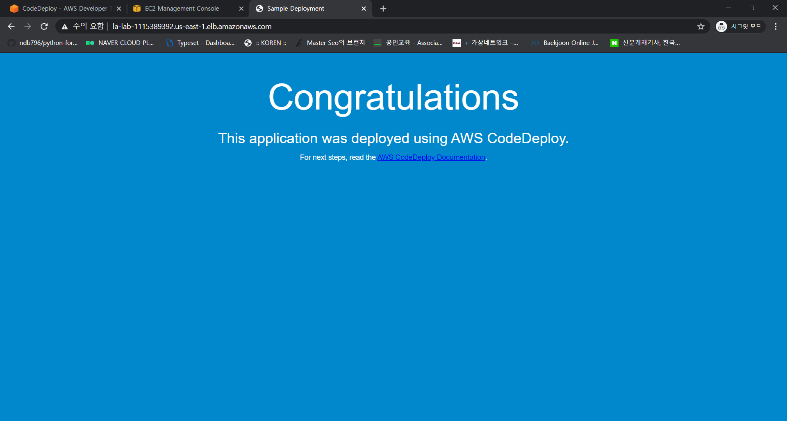

### 같은 배포 그룹에 다시 배포하고 롤백

- Create a CodeDeploy In-Place Deployment 단계까지 수행하여 배포 생성

- s3에 새로 수정한 파일 업로드

  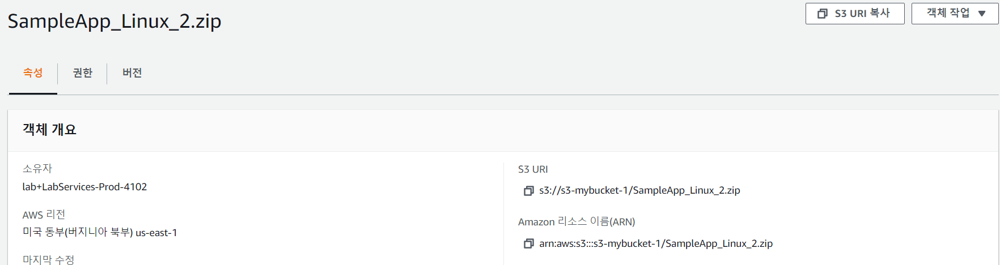

- 배포 완료된 애플리케이션에 배포

  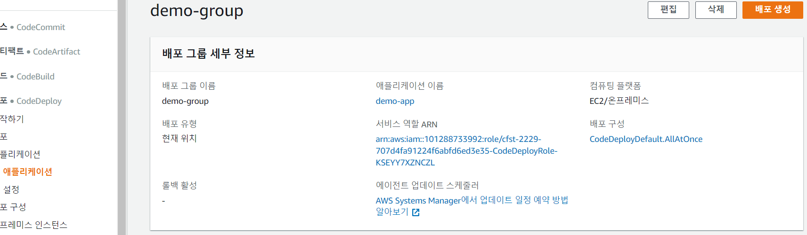

- 배포설정

  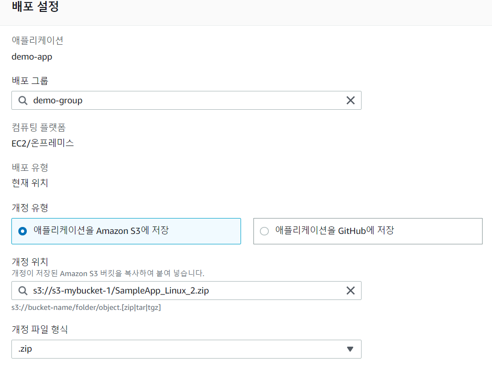

- 배포완료

  

- 웹 사이트 확인

  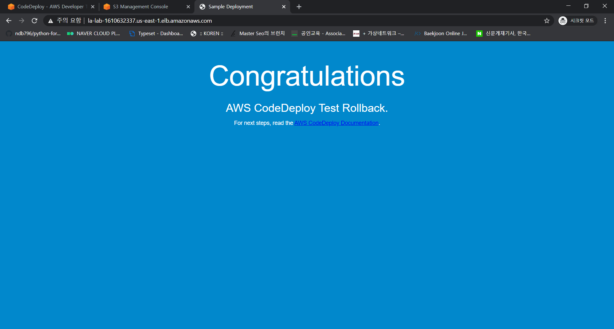

- 애플리케이션에서 배포 그룹 내역을 확인해 이전 배포 선택하고 배포재시도 클릭
- 

- 다시 배포를 수행하여 이전 상태로 덮어씀

- 

  

- 다른 방법이 있을 줄 알아서 했지만 없고 이전 상태로 되돌리기 위해서는 이전 상태의 코드를 다시 배포하는 방법밖에 없음