# Working with a DevOps CI/CD Pipeline in AWS

- AWS를 사용하여 CI(Continuous Integration)/CD(Continuous Delivery) 파이프라인을 생성하여 생성한 파이프라인을 이용해 웹 사이트의 새 버전을 자동으로 배포
- AWS CodeCommit, AWS CodeBuild, AWS CodeDeploy 및 AWS CodePipeline을 자동으로 구성하는 프런트앤드 도구인 AWS CodeStar를 이용해 구현

### Create a CI/CD Pipeline

- CodeStar에서 프로젝트 만들기 클릭

  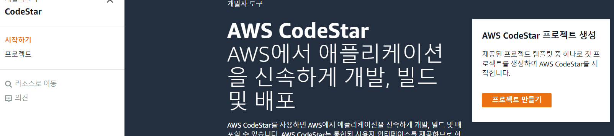

- 프로젝트 생성 전 서비스 역할 생성

  

- 생성한 다음 템플릿에서 HTML 5 추가하고 밑에 HTML 선택

  

- 새로운 브라우저를 열어 EC2 - 키페어 접속 - 키페어 생성

  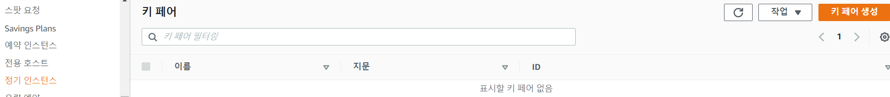

- 아래와 같이 설정하고 생성

  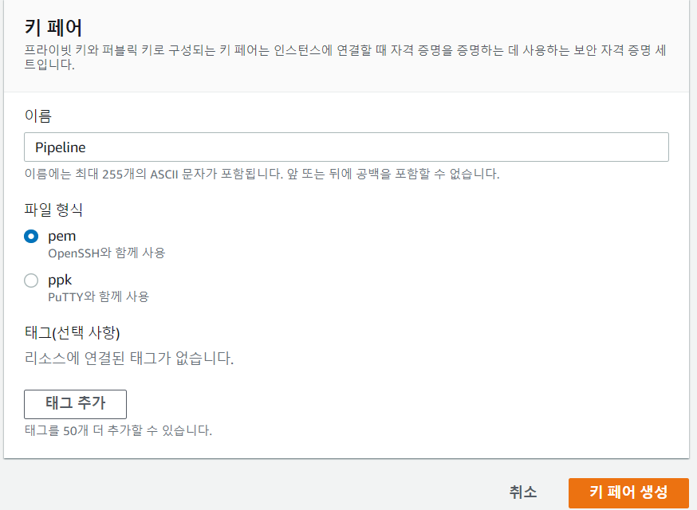

- 다시 CodeStar 브라우저 탭으로 와서 Next 클릭

  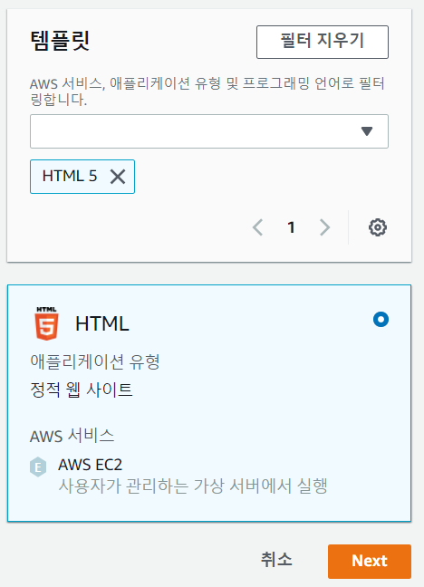

- 아래와 같이 프로젝트와 EC2 설정하고 Next

  

  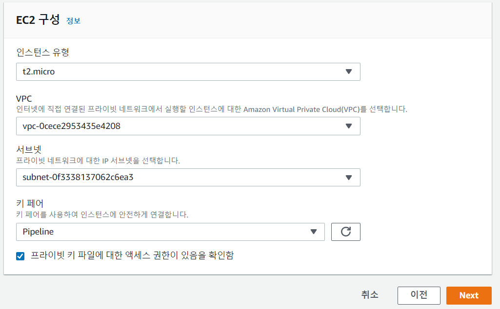

- 설정 확인 후 프로젝트 생성

  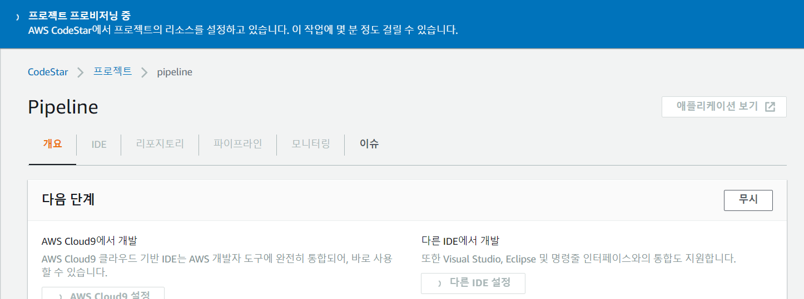

### Deploy a New Version of a Website using a CI/CD Pipeline

- 애플리케이션 보기 선택해서 웹 어플리케이션 확인

  - 하지만 버튼 활성화 안되어 있음

  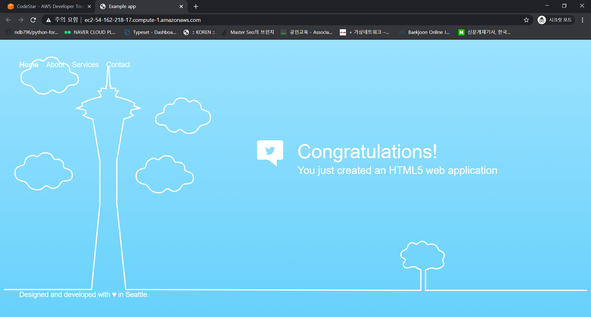

- IDE에서 AWS CodeCommit에서 편집 선택

  

- webpage 폴더 선택

  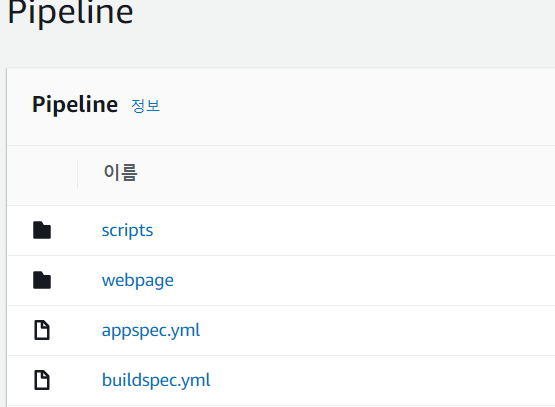

- index.html 선택

  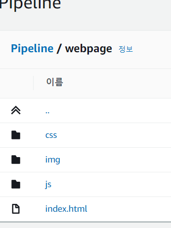

- 편집 선택

  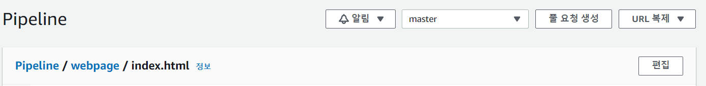

- 코드변경

  - line 61 `<h1>Hello Cloud Gurus!<h1>`으로 변경
  - line 62 `<h2>You just deployed using your own CI/CD pipeline!</h2>` 변경

  

- 변경사항커밋

- 

- CodeStar - 파이프라인 탭에서 배포되었는지 확인

  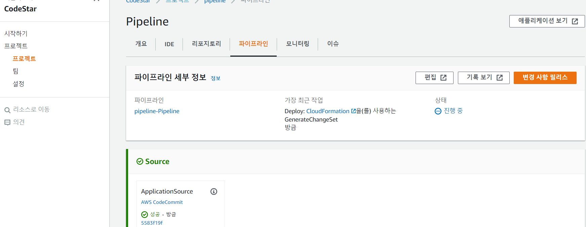

- 애플리케이션 보기 클릭하여 변경사항 확인

  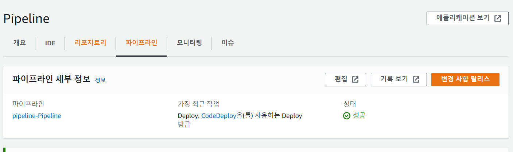

  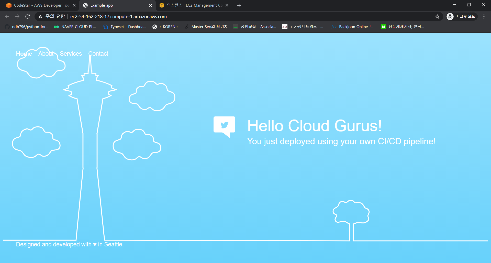