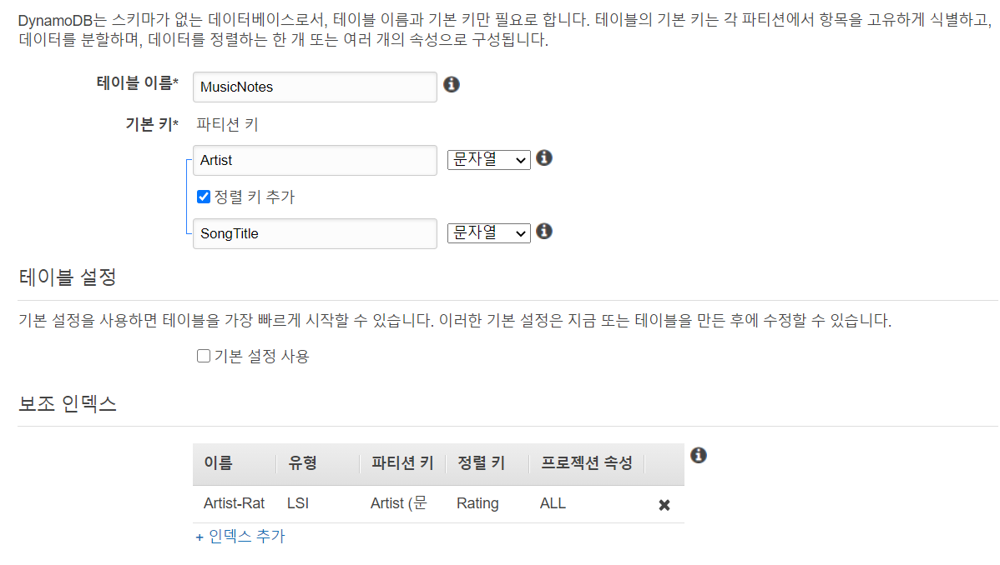
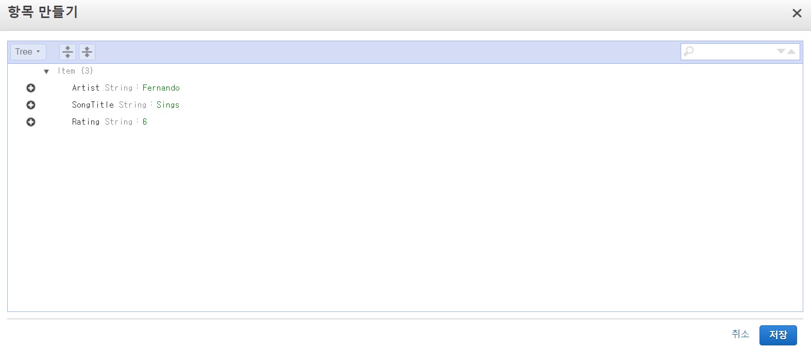
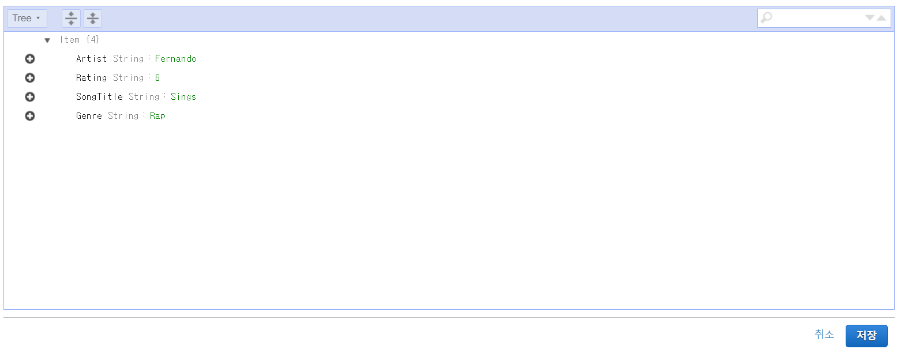
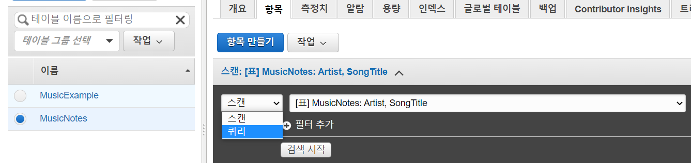
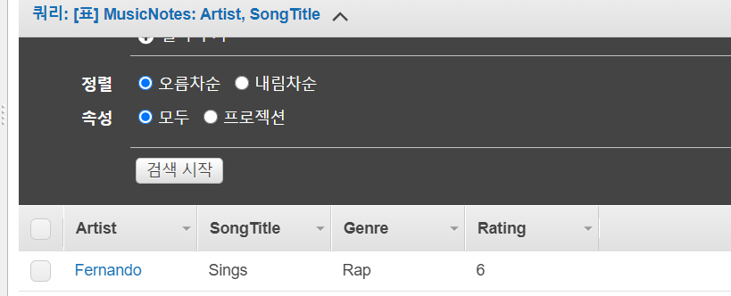
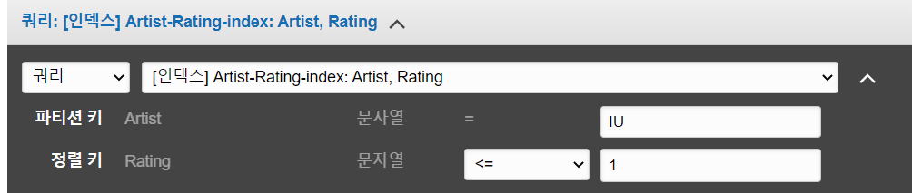

# AWS DynamoDB in the Console - Creating Tables, Items, and Indexes

- 파티션 및 정렬 키와 같은 데이터 베이스 개념, 항목 추가, 삭제 및 업데이트 방법은 물론 DynamoDB 테이블 내부의 속성에 대한 정보를 제공
- 로컬 및 글로벌 보조 인덱스를 추가하고 로컬 보조 인덱스를 사용하여 테이블의 항목을 쿼리

### Create a DynamoDB Table

- DynamoDB 콘솔 - 대시보드에 테이블 만들기 클릭

  

- 테이블 설정

  

- +인덱스 추가 선택

  

- 아래와 같이 설정하고 생성

  

- 생성완료

  

### Creating Items

- 아이템(항목) - 아이템 생성

  

- 내용 입력하고 저장

  

- 아이템 선택 후 편집

  

- SongTitle +버튼 클릭 후 Append-String

  

- 추가하고 저장

  

- 검색을 테스트하기 위한 아이템 여러개 추가

### Creating a Global Secondary Index

- 인덱스 탭에서 인덱스 생성

  

- 인덱스 설정

  

- 생성완료

  

### Query a DynamoDB Table

- 아이템(항목)탭에서 스캔에서 쿼리로 변경

  

- 아래와 같이 입력하고 검색

  

- 아티스트 Fernando의 노래에서 Sings로 시작하는 노래 제목만 결과 목록에 표시

  

- 아래와 같이 변경하고 다시 검색

  

- 등급이 3인 Fernando의 노래만 검색됨

- 아래로 변경하고 다시 검색

  

- IU의 노래 중 등급이 1보다 작거나 같은 노래 검색

  

