## Flutter App CI/CD - codemagic

Flutter에서 개발한 android와 ios 앱을 자동으로 빌드하고 배포할 수 있는 CI/CD 툴인 codemagic의 설정 방법에 대해 설명드립니다.

이번 프로젝트에서 android와 ios 두 플랫폼을 같이 개발하기 위해 Flutter를 사용하였습니다. 기존 Web과 Backend는 Jenkins를 이용하여 CI/CD를 구축하여 Flutter도 똑같이 구현하려 했습니다. 하지만 Flutter는 Jenkins에 대한 내용이 별로 없고 참조할 블로그가 많지 않아 Jenkins가 아닌 많이 사용하는 codemagic을 이용하였습니다.

codemagic은 인터넷에서 가상의 VM을 이용하여 동작하기 때문에 따로 설치가 필요하지 않고 바로 실행이 가능합니다. 또한 설정이 어렵지 않고 간단하여 사용하기 편리하다는 장점이 있습니다. 그럼 codemagic을 이용해 Flutter App을 빌드하고 빌드한 파일을 mail과 slack에 배포한 과정에 대해 간략하게 소개드리겠습니다.

### Codemaigc 계정 생성

- 먼저 codemagic을 이용하기 위해 아래 사이트에서 계정을 생성합니다.
  - https://codemagic.io/start/
  - 그럼 bitbucket, github, gitlab이 뜨는데 현재 사용 중인 버전관리 시스템을 선택합니다.
- 그럼 계정이 생성되고 아래와 같이 자동으로 레포지토리가 등록됩니다.

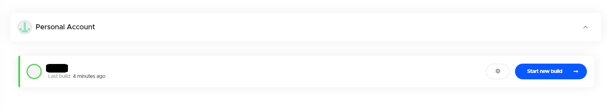

### 레포지토리 추가 설정

- 저는 자동으로 추가된 레포지토리에서 설정을 들어가면 아래와 같은 남들처럼 workflow edit이 아닌 다른 yaml 파일을 수정하는 화면만 나왔습니다.

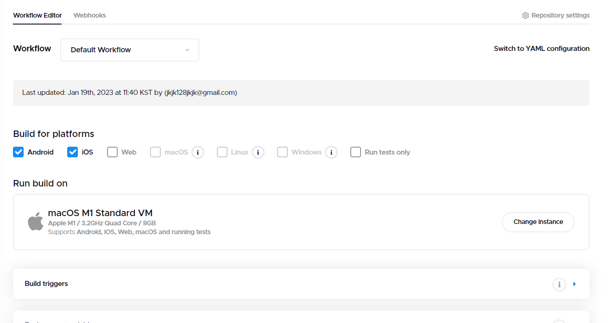

- 만약 저와 같이 위의 화면이 아닌 다른 화면이 나오시는 분들은 codemagic에서 해당 레포를 삭제하고 다시 등록하시면 됩니다.
- 해당 레포지토리 삭제

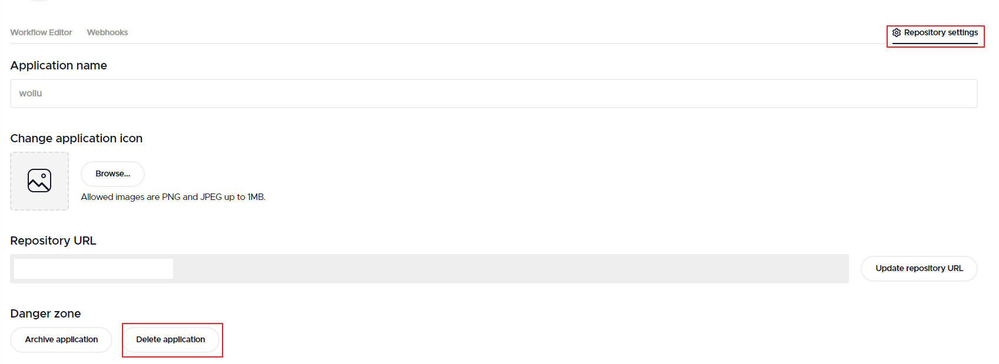

- 레포지토리 flutter workflow edit으로 다시 등록

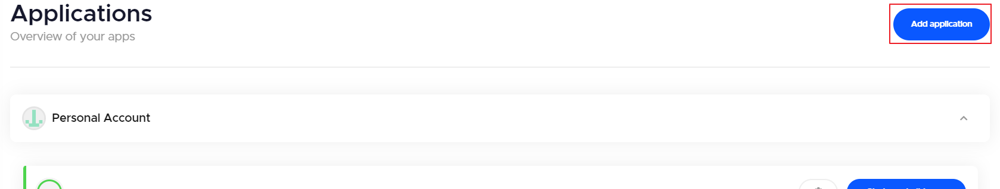

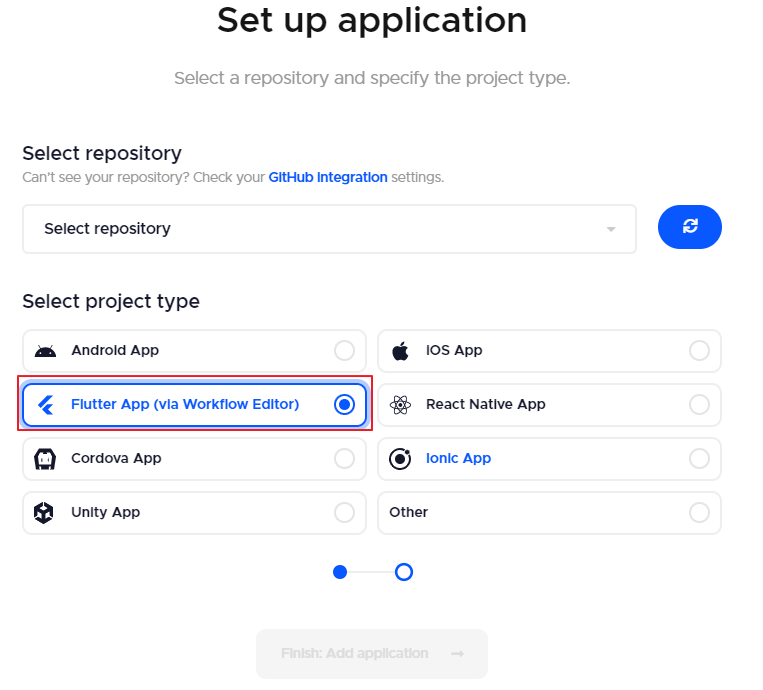

### 워크플로우 기본 설정

- 등록한 레포지토리에서 톱니 아이콘을 선택합니다.

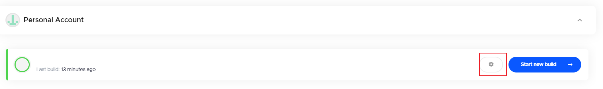

- 빌드 플랫폼을 선택합니다. 저는 Android와 ios를 사용하여 두 개를 선택했습니다.
  - VM은 IOS 빌드를 위해 macOS이고 무료버전을 사용합니다.

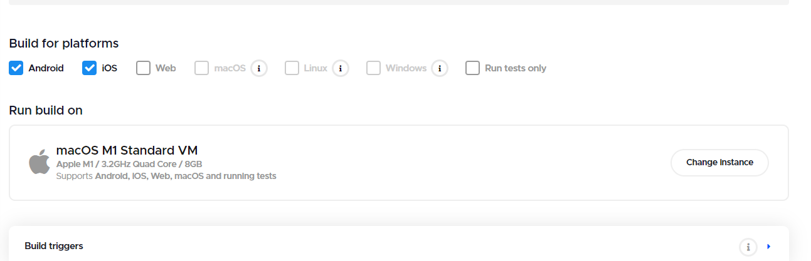

- 빌드 탭에서 Flutter, xcode, cocoaPods 버전을 선택합니다. 그리고 Android 배포 파일을 선택하고 추가로 빌드 시 필요한 argument가 있다면 입력합니다.
  - 저는 윈도우에서 Android만 빌드했기 때문에 Flutter 버전만 맞추고 나머지 xcode와 cocoaPods는 모두 기본 값으로 하였습니다.

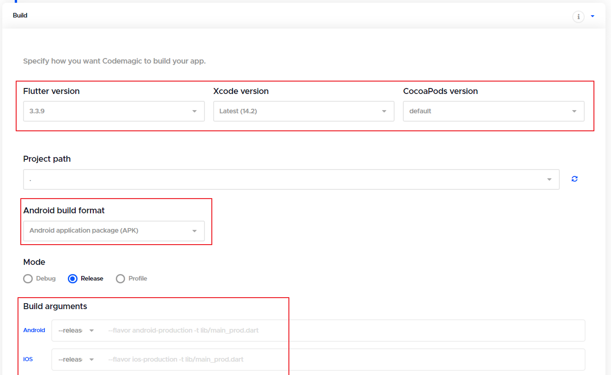

- 마지막으로 빌드된 파일을 email과 slack을 통해 배포를 설정합니다.
  - email은 아마 가입한 계정의 email이 자동으로 설정되어 있고 추가로 필요한 email은 추가하면 됩니다.
  - slack은 workspace를 연동하고 보낼 채널을 선택하면 됩니다. workspace 연동은 따로 찍어둔게 없어서 방법은 따로 기억이 안나지만 쉽게 설정할 수 있는 것으로 기억합니다.

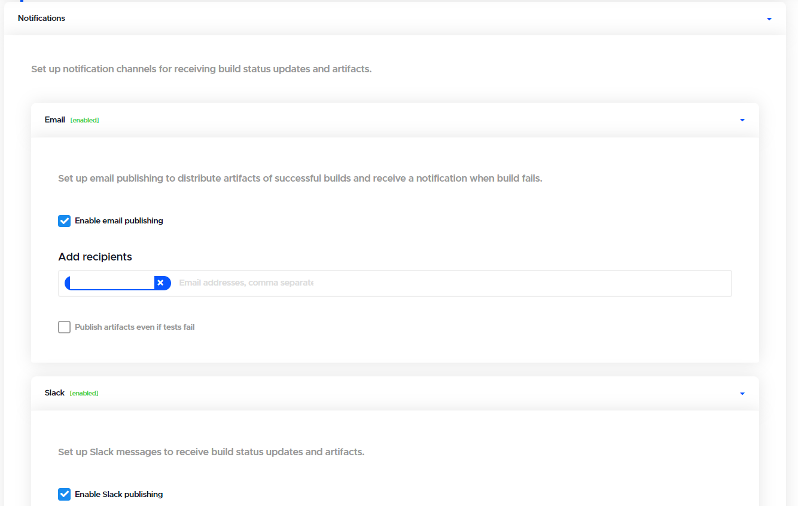

- 이렇게 설정하고 위에 start new build를 하면 빌드가 시작됩니다.
  - 빌드가 성공하면 apk, runner.app 이렇게 두 개의 파일이 생성되는데 apk는 Android 폰에 설치하면 바로 작동하지만 IOS는 추가 설정이 필요합니다.

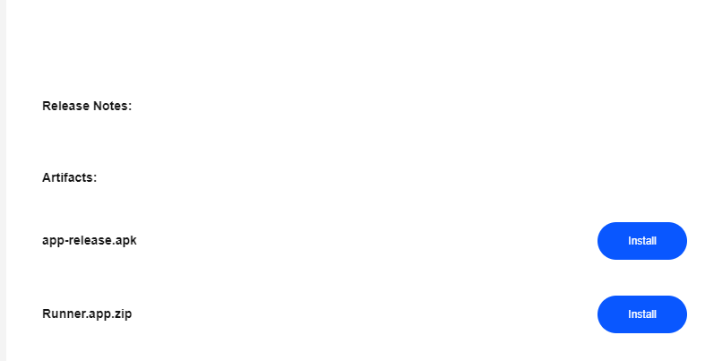

### IOS 빌드 추가 설정

#### IOS connect api key 발급

- 우선 IOS 인증을 위한 code signing이 필요합니다.

- 우선 apple developer program에 등록하여 key를 발급받아야 합니다.

  - apple developer program에 등록하기 위해서는 13만원의 금액이 필요합니다.
  - key 발급 방법은 아래 글을 참조하여 주시기 바랍니다.

  - https://velog.io/@heyksw/iOS-App-Store-Connect-API-%ED%82%A4-%EC%83%9D%EC%84%B1

- 발급받은 키를 아래의 필드에 맞게 입력하시면 됩니다.

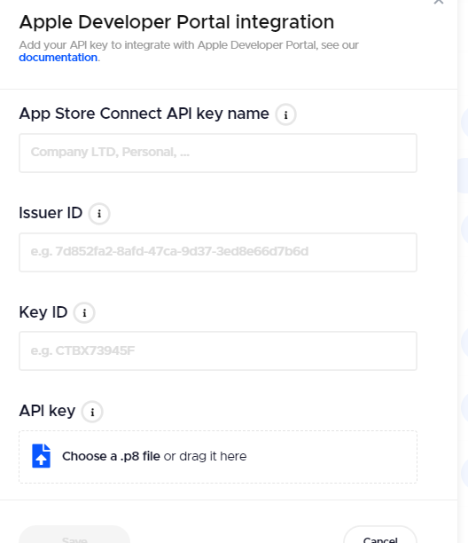

- app store에서 bundle identifier도 등록해야합니다.
  - https://ios-development.tistory.com/248

- 그러면 빌드 설정에서 Distribution - iOS code signing에서 api key를 설정하고 다시 build 합니다.

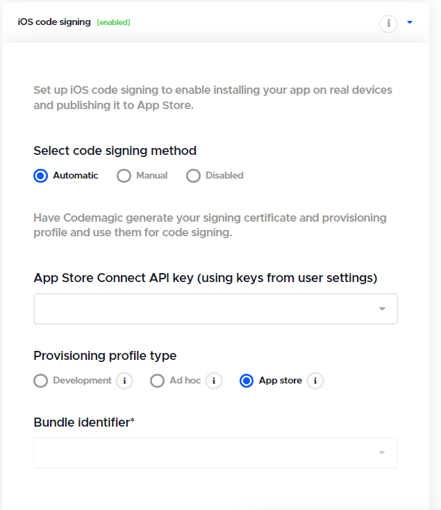

- iqa 파일을 받을 수 있는데 아이폰에 옮겨서 설치하고 실행하면 무결성을 ~하면서 실행이 안됩니다.

#### 테스트 디바이스 등록

- app store에서 테스트할 디바이스의 uuid를 등록하여야 합니다. 
  - https://devureak.tistory.com/9
  - https://docs.codemagic.io/testing/ios-provisioning/

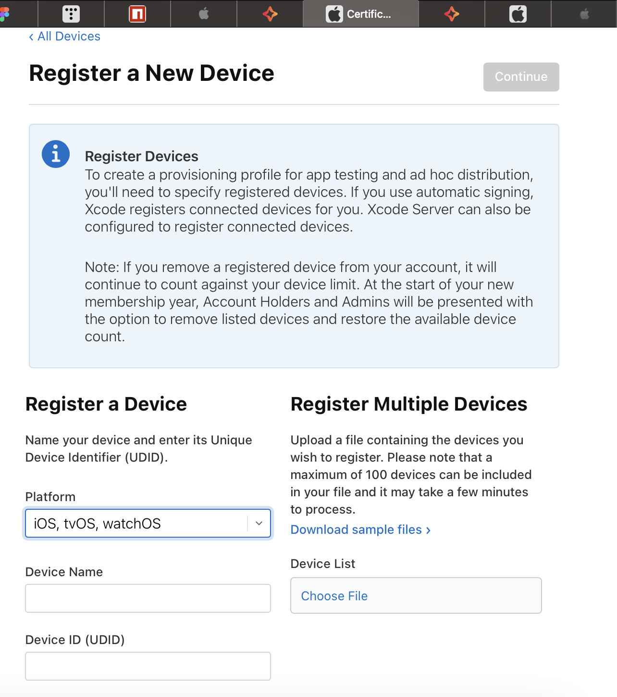

### 빌드 트리거 설정

- 빌드를 수동으로 동작하는게 아닌 자동으로 빌드하게 하였습니다.
  - git에 새로운 내용이 push되거나 pull request가 감지되면 자동으로 빌드를 시작합니다.
  - 빌드된 결과는 설정된 email과 slack을 통해 배포됩니다.
  - 저는 app branch에서 어플개발을 하기 때문에 branch 중에 app만 감지하도록 설정하였습니다.

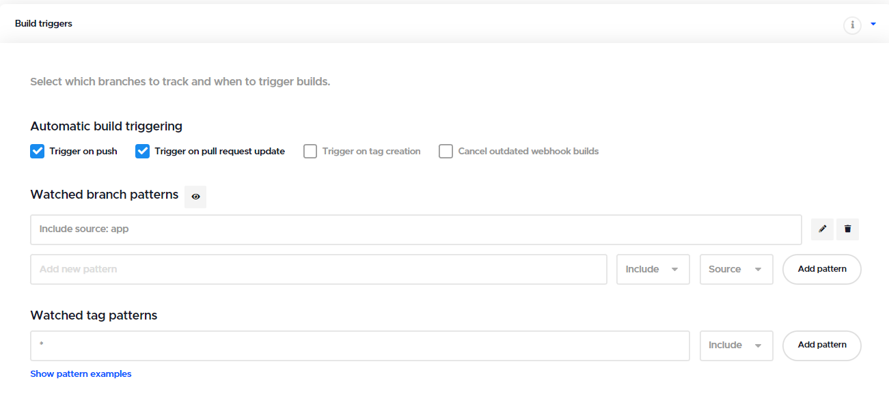

### 마무리

이렇게 해서 Flutter로 개발한 App을 Android와 IOS로 빌드하고 email과 slack으로 배포하는 방법에 대해 소개드렸습니다. codemagic을 이용하여 CI/CD를 구축하였는데 Android는 정말 간단하게 막힘없이 바로 배포까지 완료했지만 IOS는 보안이 까다로워 추가로 설정해야 했습니다. 테스트 디바이스까지 등록하고 아직 테스트는 못해봤지만 만약 안된다면 어플 등록까지 완료를 해야 CI/CD가 가능할 것으로 예상됩니다.