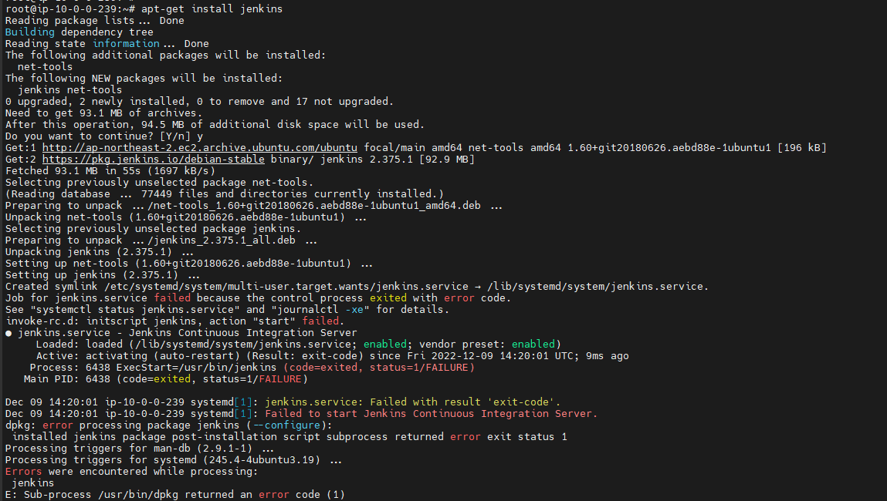
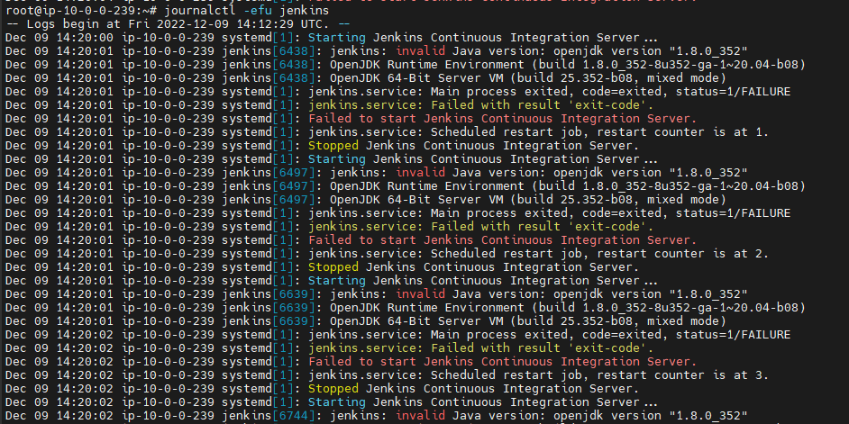
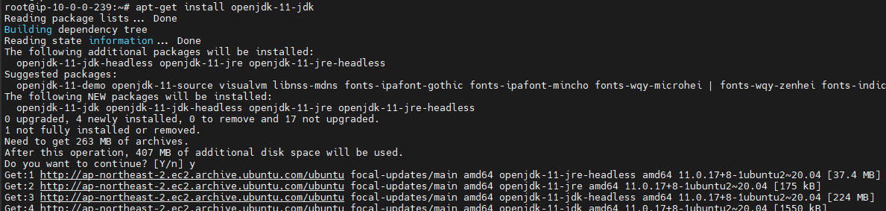

## Jenkins 설치 오류

설치 환경 : Ubuntu 20.04

설치에 필요한 모든 설정을 완료하고 `apt-get install jenkins` 명령어를 입력하면 설치 중에 jenkins를 실행하는데 오류가 발생했다.

**Job for jenkins.ervice failed because the control process exited with error code.**

위와 같은 오류가 발생했는데 다른 곳을 봐도 key값이나 모든 설정은 틀린 것 없이 잘했는데 발생하여 애먹다가 해결 방법을 찾아 공유한다.

### 해결 방법

- error가 발생한 원인을  찾기 위해 journal 로그 확인
  - `journalctl -efu jenkins`

- 맨 위에 보면 `jenkins: invalid Java version: openjdk version "1.8.0_352"` 라고 나와있다.
  - 해당 jenkins 버전이 java 1.8을 지원안하여 발생
- 1.8이 아닌 1.11버전 설치
  - `apt-get install openjdk-11-jdk`

- jenkins 재설치
  - `sudo apt-get install jenkins`

