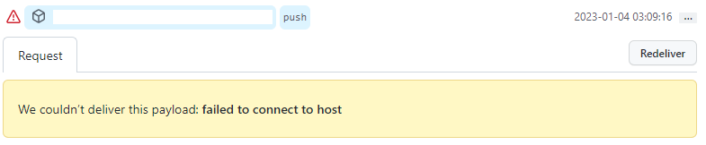
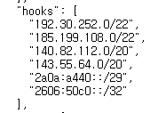
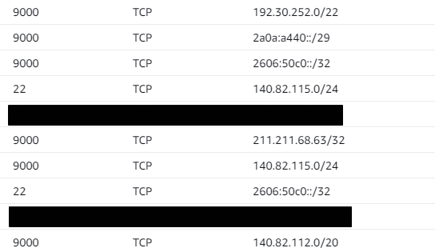
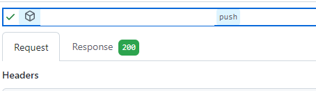

## Github webhook 연결 오류

프로젝트에서 Jenkins를 이용하여 CI/CD를 구축해 Github에서 webhook을 이용하여 트리거를 발생시키려 하였습니다. 그런데 Jenkins와 Github의 연결이 제대로 되지 않고 아래와 같이 연결에 실패하는 오류가 발생했습니다.

- We couldn't deliver this payload: failed to connect to host

### 발생 원인

- AWS Ec2에 Jenkins를 구축하고 사용하였습니다. 해당 에러가 발생하여 Jenkins와 github를 연결할 때 필요한 Jenkins 서버 포트와 ssh 연결 포트를 보안그룹에서 모든 ip에 대해 허용을 하니 제대로 동작하였습니다.
- 그리하여 보안 그룹의 ip 설정 오류라고 생각하여 github에서 webhooks에서 사용하는 ip에 대해 찾아 추가하였습니다.

### 해결 방법

- github에서 webhooks를 보내는 ip는 하나가 아닌 여러개로 아래 사이트에서 확인이 가능합니다.
  - https://api.github.com/meta

- 사이트의 hooks 부분의 ip들을 보안그룹에서 허용하면 해결됩니다.

- 저는 jenkins는 9000 포트를 사용하기 때문에 9000번 포트와 22번 포트에 대해 해당 ip를 허용하도록 구성하였습니다.

- 허용하고 다시 보내면 아래와 같이 성공한 모습을 볼 수 있습니다.

