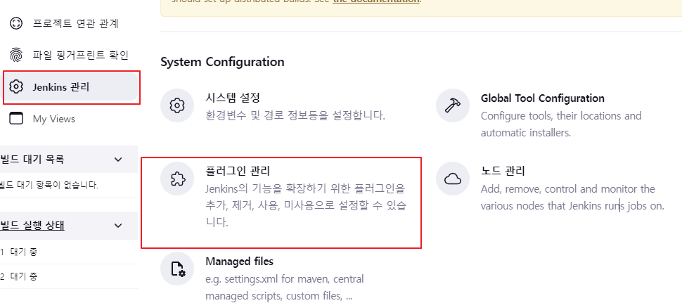
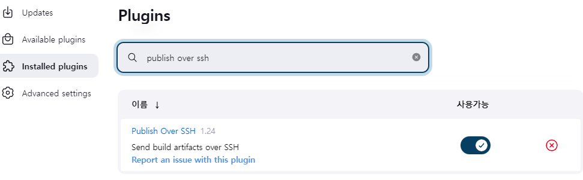
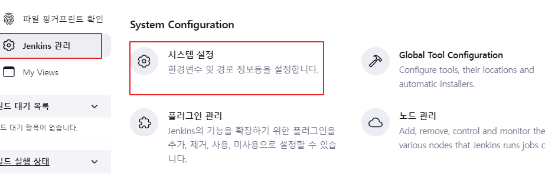
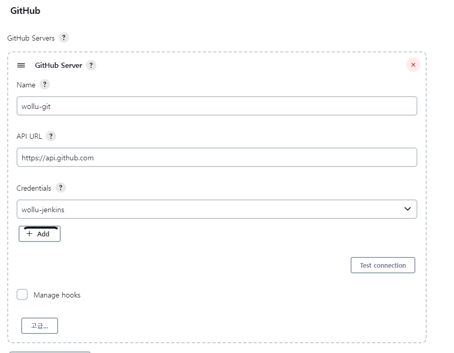
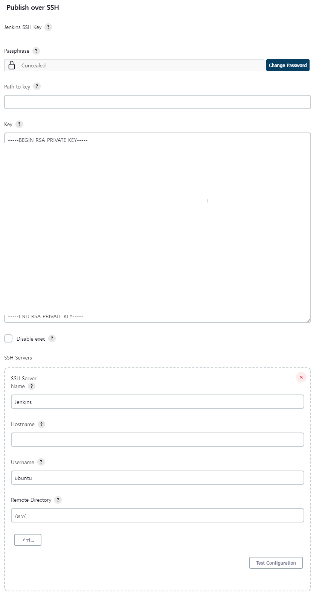
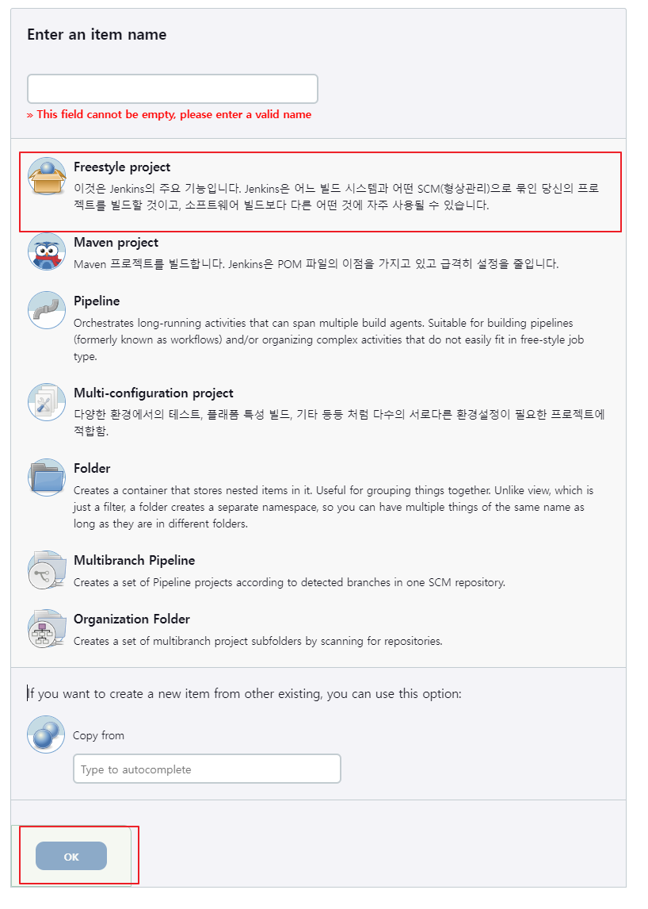
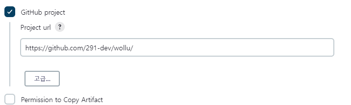
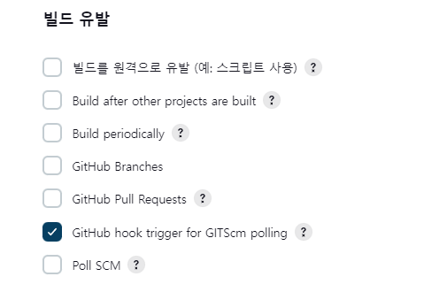
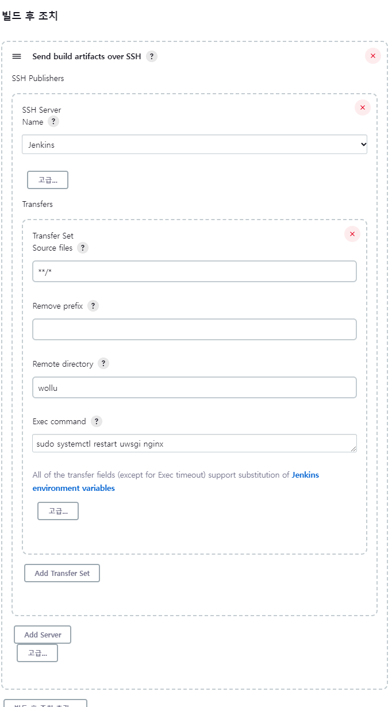
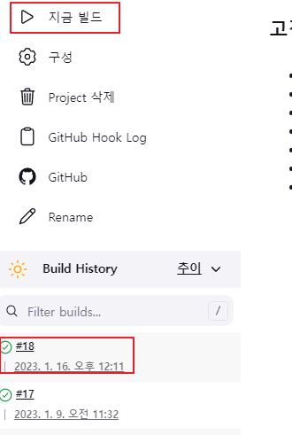

## Jenkins Django 빌드 및 배포

jenkins를 이용하여 Django app을 빌드하고 ec2 서버에 자동으로 배포하는 방법에 대해 소개드립니다.

먼저 사전에 jenkins 설치와 ec2 서버에 Django app을 구동하고 있다고 가정하겠습니다.

> jenkins 설치 : https://hyunmin1906.tistory.com/272
>
> ec2에 react app 배포 : https://nerogarret.tistory.com/45

### 목차

- [사전 plug in 설치](#사전-plug-in-설치)
- [git 및 ec2 ssh 설정](#git-및-ec2-ssh-설정)
- [Jenkins Item 생성](#jenkins-item-생성)
- [Item build 설정](#item-build-설정)
- [빌드 테스트](#빌드-테스트)

### 사전 plug in 설치

- jenkins 관리 - 플러그인 관리



- ec2서버에 ssh 접속을 위한 publish over ssh 설치



### git 및 ec2 ssh 설정

- Jenkins 관리 - 시스템설정



#### Github

- 밑에 GitHub 설정
  - 해당 부분은 https://narup.tistory.com/203 에서 설정



#### SSH

- 시스템 설정에서 Publish over SSH에 아래와 같이 ec2 서버 접속에 필요한 정보를 입력한다.



- Key에는 접속할 키의 private key를 입력
- Name은 아무 값이나 입력
- Hostname에는 ec2서버의 ip 입력
- Username에는 ec2 서버의 hostname 입력
- remote directory는 django 프로젝트 디렉토리 경로
- 상세한 내용
  - https://goddaehee.tistory.com/259
  - https://oingdaddy.tistory.com/336

### Jenkins Item 생성

- 왼쪽에 새로운 Item을 선택
- 사용할 이름을 입력하고 Freestyle project 선택하고 생성



### Item build 설정

- github project에 react가 있는 project url 입력



- 소스 코드 관리에서 Git 선택하고 repositories 설정
  - 해당 부분은 아래 블로그 확인
    - https://narup.tistory.com/224
    - https://narup.tistory.com/225
- 빌드 유발은 push를 감지할 것이기 때문에
  - Github hook triggger for GITScm polling 선택



- 빌드 환경
  - Add timestamps to the Console Output 선택
    - 사실 선택안해도 상관은 없은 build 시 시간을 찍어줌
  - Provide Node & npm bin/ folder to PATH
    - 반드시 선택 react를 빌드할 때 rpm 필수
    - 설정한 이름의 nodejs 선택
- 빌드 스텝
  - Execute shell 선택

```shell
. /home/ubuntu/myvenv/bin/activate		# 가상환경 active
cp /srv/wollu/secrets.json .			# 빌드에 필요한 암호 파일 복사
echo '====================================test start===================================='
python manage.py test					# django app test
echo '====================================test end===================================='
```

- 빌드 후 조치
  - Send build artifacts over SSH 선택
  - Name은 이전에 만든 ssh 선택
  - source files는 빌드한 django 모든 파일
  - Remote directory는 /srv/ 안의 django app 디렉토리 경로
    - 해당 글에서는 app 이름이 wollu
  - Exec command는 파일 복사 완료 후 uwsgi와 nginx 재시작



### 빌드 테스트

- 지금 빌드를 선택하여 테스트한다.



- git에서 push 후에 자동으로 빌드 시작는지 확인
- ec2서버의 django ip:port로 접속하여 반영되었는지 확인