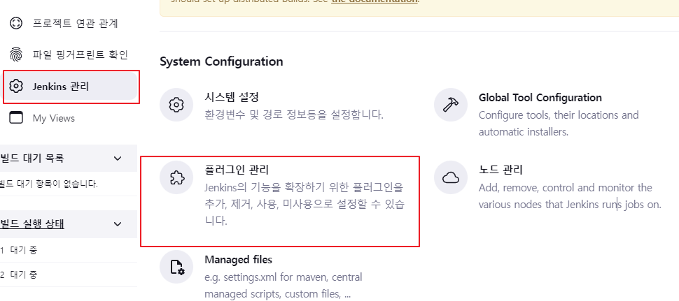
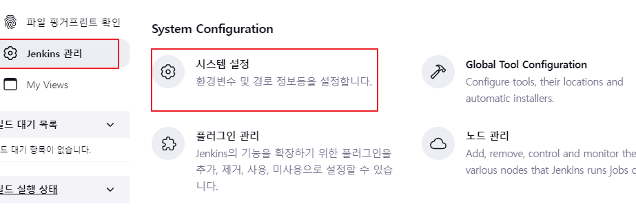
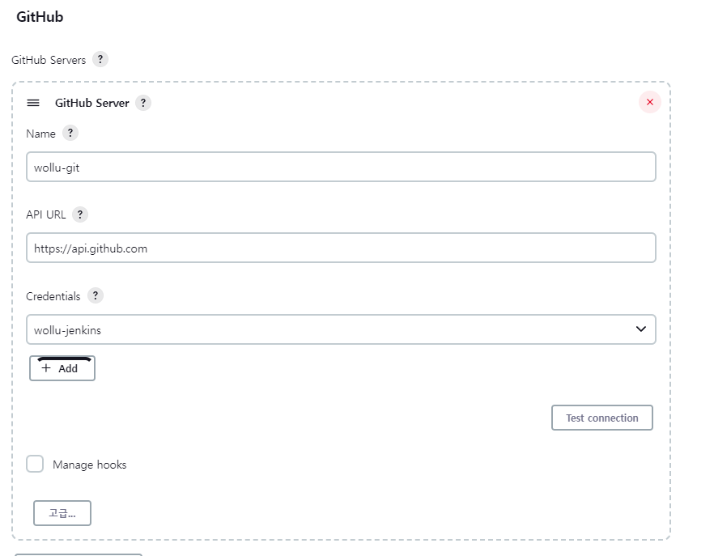
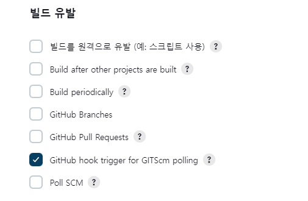
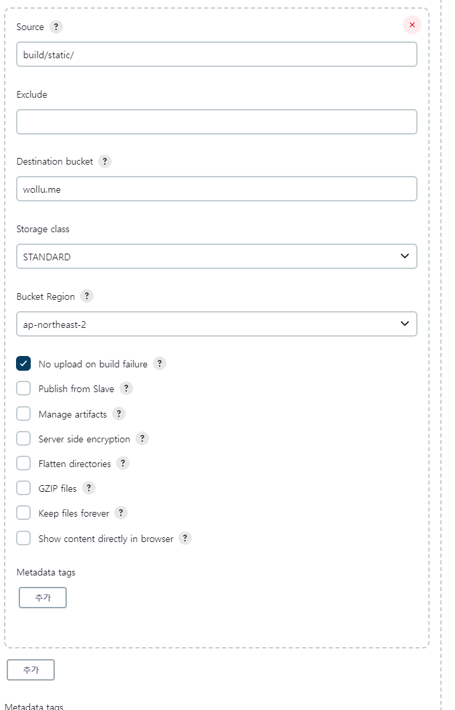

## jenkins + react + s3

jenkins를 이용하여 react로 작성한 web을 git에 push를 하면 자동으로 s3에 배포하도록 하는 방법에 대해 알려드리려 합니다.

먼저 사전에 jenkins 설치와 s3에 statci web용 bucket은 생성을 했다고 가정하겠습니다.

> 해당 부분은 구글에 잘 정리가 되어 있기 때문에 확인하시면 됩니다.
>
> jenkins 설치(ubuntu 20.04) : https://hyunmin1906.tistory.com/272
>
> static web용 s3 생성 : https://longtermsad.tistory.com/44

#### 목차

- [사전 plug in 설치](#사전-plug-in-설치)
- [git, aws, nodejs 설정](#git,-aws,-nodejs-설정)
- [Jenkins Item 생성](#jenkins-item-생성)
- [Item build 설정](#item-build-설정)
- [빌드 테스트](#빌드-테스트)

### 사전 plug in 설치

-  jenkins 관리 - 플러그인 관리



- Available plugins에서 nodejs, s3 publisher 검색


- 아래와 같이 nodejs와 s3 publisher가 설치되어야 합니다.


### git, aws, nodejs 설정

- Jenkins 관리 - 시스템설정



#### Github

- 밑에 GitHub 설정
  - 해당 부분은 https://narup.tistory.com/203 에서 설정



#### aws profile

- amazon aws s3 profiles 설정
  - s3를 사용하기 위한 계정을 생성했다고 가정
  - aws s3 계정 생성 : https://minddong.tistory.com/64
  - profile name, Access key, Secret key를 입력하고 Test Connection으로 테스트


#### Node.js

- nodejs는 시스템 설정이 아닌 Global Tool Configuration에서 진행


- 사용할 version을 선택하고 name은 편한 것으로 하면 됩니다.


### Jenkins Item 생성

- 왼쪽에 새로운 Item을 선택
- 사용할 이름을 입력하고 Freestyle project 선택하고 생성


### Item build 설정 

- github project에 react가 있는 project url 입력


- 소스 코드 관리에서 Git 선택하고 repositories 설정
  - 해당 부분은 아래 블로그 확인
    - https://narup.tistory.com/224
    - https://narup.tistory.com/225
- 빌드 유발은 push를 감지할 것이기 때문에
  - Github hook triggger for GITScm polling 선택



- 빌드 환경
  - Add timestamps to the Console Output 선택
    - 사실 선택안해도 상관은 없은 build 시 시간을 찍어줌
  - Provide Node & npm bin/ folder to PATH
    - 반드시 선택 react를 빌드할 때 rpm 필수
    - 설정한 이름의 nodejs 선택


- Build Steps
  - Execute shell을 선택하고 아래와 같이 입력
  - 사실 별로 내용은 없다. npm 설치 후에 npm을 이용해 react를 빌드

```sh
echo '====================================build start===================================='
npm install
CI=false npm run build
echo '====================================build end===================================='
```

- 빌드 후 조치
  - react build 폴더를 s3에 배포하는 설정을 한다.
  - Publish artifacts to S3 Bucket 선택
  - 생성한 S3 profile을 선택하고 올릴 대상을 Source에 지정
    - 나는 build 폴더 아래 모든 파일을 s3에 업로드
  - Destination bucket에 업로드할 bucket name 입력


- 추가로 static 폴더 업로드 추가
  - 위에만 추가하면 static은 폴더여서 업로드가 되지 않음
  - 밑에 추가를 눌러 아래와 같이 입력하여 저장




- 저장

### 빌드 테스트 

- 지금 빌드를 하여 빌드가 잘되는지 확인한다.


- git에서 push 후에 자동으로 build되는지 확인
  - 만약 빌드가 안되면 s3 보안 그룹이나 ssh 접속 문제일 확률이 높다
  - 나는 해당 문제에 대해 아래 블로그에서 해결했다.
  - https://narup.tistory.com/225

