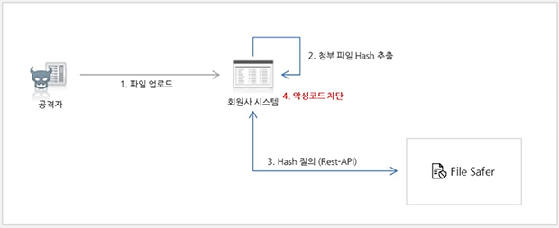
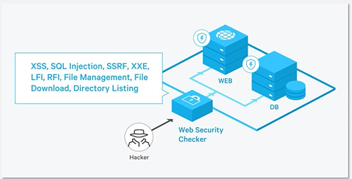

# 11. Security Service

- NCP의 보안 상품은 크게 세이퍼 시리즈와 체커 시리즈로 나뉨
  - 세이퍼 시리지
    - 외부 침해 및 위협으로부터 사용자들의 서비스를 방어하고 막아주는 역할
  - 체커 시리즈
    - 서비스와 시스템이 보안적으로 문제가 없는지 확인해 주는 역할

## Site Safer, App Safer

- Site Safer
  - 고객의 웹페이지에 악성 코드가 있는지 주기적으로 검사
  - NCP 외부 IP 대역도 점검 가능
  - 행위 기반 탐지
- App Safer
  - 고객의 APP 실행 모바일 환경에 대한 보안 위협 여부를 실시간으로 탐지
  - 치팅 프로그램, 핵 등으로 APP 무결성 검사
    - 모바일 게임에서 상대방보다 더 빨리 움직이거나, 상대방의 위치를 알 수 있는 치트 프로그램이 있으면 않좋은 영향을 끼치기 때문에 치트 프로그램을 감지하고 모바일 서비스가 영향을 받았는지 모니터링해줌
    - 영향을 받았다면 해당 내용을 리포팅해서 제공
  - SDK 형태로 제공

## File Safer

- 업로드 / 다운로드 되는 파일의 악성코드 여부를 탐지

  - 고객의 웹페이지에 업/다운로드 되는 파일에 대한 체크
  - 악성코드 여부를 신속하고 정확하게 탐지

  

## Web Security Checker

- 고객의 웹사이트 보안 취약점 진단
  - 고객의 웹페이지에 취약점이 없는지 체크
  - 현재 18가지 주요 웹 취약점에 대해 점검(원하는 항목만 선택가능)
    - 해킹 기법들에 대해 모의 해킹을 통해 점검
  - 취약점에 대한 진단 뿐만 아니라 대응방안도 함께 제공
  - 모의 해킹이기 때문에 시스템에 많은 부하가 발생
    - NCP안에 있는 내 서버에 대해서만 보안 취약점 진단 가능
    - 로그인이 된 상태와 안된 상태 모두 진단
  
  

## System Security Checker

- 고객의 시스템 보안 취약점 진단
  - 고객의 OS, WAS (Apache, Tomcat, Ngnix) 설정에 대한 취약점 점검
  - 점검 필요 서버에 Agent 설치 후 간편하게 사용 가능
    - Agent 방식으로 파일을 설치하고 파일을 모니터링하는 방식이 아닌 시스템 하나가 사용자의 웹 서버 혹은 시스템에서 보안과 관련된 설정 파일들을 수집하고 파일을 분석하여 시스템 혹은 웹 서비스가 보안에 취약한지를 판단하고 분석하여 보완할 수 있는 리포트 제공
  - KISA의 보안 설정 가이드와 NAVER의 보안 설정 정책에 근거하여 취약점 점검 및 수정 가이드 제공

## App Security Checker

- 고객의 모바일 App 보안 취약점 진단
  - 고객의 모바일 App을 분석하여 자동으로 보안 취약점을 점검할 수 있는 서비스로 진단 리포트 제공
  - 모바일 App 출시 (마켓 오픈) 전 사용하여 App 취약점 체크할 수 있는 상품

## Certificate Manager

- 최근 많은 서비스들이 일반 평문 통신이 아닌 HTTPS 혹은 SSL 통신을 요구
  - 인증서를 이용해 CDN, Load Balancer, 서버에 인증서를 설정하고 사용
- SSL 인증서 등록 및 관리의 통합
  - 네이버 클라우드 플랫폼의 연계 상품 (Load Balancer, CDN+, Image Optimizer)에서 사용할 인증서를 등록할 수 있으며, 등록 시 인증서 유효성을 체크
    - 로드밸런서와 CDN을 사용한다면 인증서를 로드밸런서와 CDN에 올리는 작업을 따로 수행해야 함
    - 하지만 Certificate Manager에 인증서를 한 번만 등록하면 로드밸런서나 CDN, 기타 NCP에서 인증서를 요구하는 서비스에서 사용할 수 있음
  - 인증서의 만료 예정일 한달 전부터 정기적으로 알람 메일과 SMS를 발송

## Security Monitoring

- 네이버 클라우드 플랫폼의 향상된 보안 부가 상품
  - Basic과 Managed 상품으로 구분
  - Basic : IDS(Intrusion Detection System) 이벤트 탐지, Anti-Virus
    - Anti-Virus는 윈도우즈 시스템에 대해서만 제공
    - 기존의 안티 바이러스 삭제하고 원하는 안티 바이러스 설치 가능
    - IDS는 시스템에 보안 사고가 의심되게 되면 NCP에서 연락을 취하고 리포트 제공
  - Managed : IDS 이벤트 탐지, DDoS 이벤트 탐지, IPS 이벤트 탐지, 침해 사고 기술 지원, WAF, Anti-Virus
    - Managed의 IDS 이벤트 탐지는 주기적으로 주간, 월간 리포트 제공. 탐지에 대한 예외처리(사용자의 서비스에 맞게 IDS의 룰, 정책들을 반영)
    - 안티바이러스는 리눅스용 안티바이러스 제공(주간, 월간 리포트 제공)
    - 사용자가 원하는 상품만 조합하여 사용
    - IPS는 외부의 위협으로부터 사용자의 시스템을 보호
    - 웹 서비스는 웹 어플리케이션 방화벽을 통해서 웹 서비스를 보호
    - Managed 상품들은 기본적으로 사용자들이 일정 수준까지 커스텀마이징 가능
      - WAF나 IPS는 룰을 추가하거나 예외처리 추가 가능

## SSL VPN

- NCP에서는 두 가지 VPN 제공
  - 네트워크 카테고리에 있는 IPSec VPN(망 투 망)
  - 보안 카테고리에 있는 SSL VPN(포인트 투 망)
    - 클라이언트를 NCP안에 있는 서버들과 연결하기 위한 용도로 사용 가능
- SSL VPN을 통한 서버 접속
  - 10 대역의 28bit VPN IP 대역 제공
  - SSH, RDP와 같은 포트는 외부에서 접근할 수 없도록 ACG에서 차단
  - ACG에 VPN IP 대역에 대해서 접근 가능하도록 설정하여 서버를 안전하게 관리 가능
  - 권고 사항은 ACG에서 외부에서 접근 가능한 관리 포트들에 대해서는 다 막고 서비스 포트(ex. 80번 포트)는 외부에 오픈하고 서버에 관리 용도로 SSL IP 대역만 열고 SSL VPN을 통해서 서버에 접근하도록 권고
- 최대 10개 ID 생성 가능 및 전용 VPN 프로그램 설치하여 VPN 사용
  - 3개, 5개, 10개 ID 생성 가능
  - 사용자 가이드를 통해 프로그램 다운로드 가능
- 1차 인증과 2차 인증 지원
  - ID / PW로 로그인 가능한 1차 인증
  - ID / PW 뿐만 아니라 SMS / Mail의 OTP를 입력해야 하는 2차 인증

## SSL VPN 실습

- Security 카테고리에 SSL VPN
- SSL VPN 생성
  - 상품 선택과 인증 방식 선택
  - 28bit의 IP 대역 발급
  - 사용자 생성
    - ID와 Password를 개별적으로 발급
- 서버 하나 선택
  - 내부 아이피(공인 아이피) 핑 전송
    - 핑 전송 실패
    - 내부 아이피는 NCP안에서만 유효
  - ACG에 SSL VPN의 아이피 대역을 추가
    - 서버에 ACG의 규칙 보기 클릭
    - ICMP가 열려 있음
    - SSL VPN 와 관리 포트(22) 열어줌
    - ICMP도 SSL VPN의 아이피로 열어줌
  - SSL VPN을 통해 서버 접근 가능

