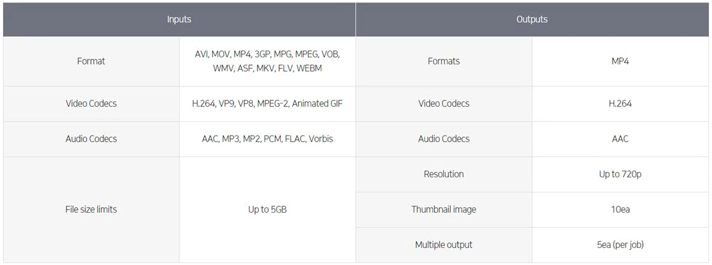

# 12. Media Service

- 미디어 상품은 동영상, 이미지와 관련된 서비스
  - 동영상과 이미지와 관련된 플랫폼을 직접 만들어서 사용하기는 어려움
  - NCP에서 제공하는 미디어 상품들을 이용

## Live Station

- 스노우와 잼라이브와 같이 동영상을 빠르게 실시간으로 송출하는 서비스
  - 유튜브나 페이스북과 같은 경우 영상을 찍는 것도 해당 앱에서 해야 됨
  - 해당 영상을 받아주는 플랫폼으로 인코딩하고 방송해주는 서비스도 해당 앱을 사용
  - 시청하는 플레이어도 해당 앱이여야 함
  - 최근 서드파티앱들이 나오고는 있음
  - 유튜브나 페이스북에서 유통되는 동영상을 직접 구성할 수 있는 플랫폼이 라이브 스테이션
- 라이브 스테이션은 개인 방송에 쓸 수도 있지만 동영상 강의, 실시간 퀴즈에서 사용 가능
- 실시간 방송을 위한 플랫폼
  - 트랜스코딩을 통해 여러 화질로 변환 후, 송출
  - 사용자가 찍은 영상을 받아주는 서비스
    - 프리즘스튜디오를 이용해 영상을 찍음. 상대주소를 이용해 라이브 스테이션을 지정하면 라이브 스테이션이 영상을 받음
    - 받아서 인코딩한 다음에 다시 불특정 다수 플레이어들에게 송출하는 서비스
  - 스트림 상태를 볼 수 있는 모니터링 기능 제공
  - Thumbnail Image 추출
  - 타임머신(Time Shift) 기능으로 놓치지 않는 라이브 방송 서비스 구현 가능
  - CDN 연동을 통해 안정적인 송출 가능

## VOD Transcoder

- 고품질 저비용의 클라우드 미디어 파일 변환 서비스

  - VOD Transcoder는 미디어 원본 파일을 모바일, PC 등 다양한 디바이스에서 다양한 화질로 시청할 수 있도록 변환해 주는 클라우드 기반의 미디어 서비스
  - 시중에서 사용되는 거의 모든 입력 포맷 및 코덱을 지원하여 높은 인코딩 성공율을 보장
  - 인터넷 라이브 생중계를 할 수 있는 Live Transcoder, 대용량의 트래픽을 처리할 수 있는 CDN과 결합하여 LIVE/VOD 통합 서비스를 구현 가능
  - 현재는 파일크기는 제한 없고 Resolution은 4K까지 지원

  

## VOD Station

- 쉽고 빠른 VOD 서비스 구축 상품
  - 영상을 재생하는 프론트앤드는 별도의 설정 필요
  - Object Storage내의 영상 파일을 CDN을 통해 스트리밍
  - 손쉽게 VOD 송출 시스템 구축 가능
  - DASH, HLS 및 Segment Duration 지원
    - DRN까지 지원 예정
  - CDN 재생 경로
    - https://hifxkpdtswih3737908.cdn.ntruss.com/[protocol]/[path]/[video filename]/[manifest]
  - 라이브 스테이션과 VOD 스테이션 연계
    - 라이브 스테이션은 실시간 방송을 1시간까지 녹화 가능 
    - 녹화된 파일은 Object Storage에 저장
    - VOD Transcoder를 통해서 다양한 포맷으로 만들고 VOD Station을 통해서 Object Storage에 만들어진 다양한 영상들을 VOD 서비스로 구성

## Image Optimizer

- 썸내일 생성 서비스
  - 블로그 혹은 카페라고 하면 PC에서 썸내일을 만들어주는 포토샵이나 이미지 툴을 이용함
  - 하지만 웹서비스 혹은 어플리케이션 서비스와 같이 대규모의 서비스라고 한다면 클라이언트에서 썸내일을 만들어 업로드를 해서 이미지를 서빙하는 형태가 아닌
  - 원본 이미지 하나를 가지고 페이지나 디바이스에 맞춰서 해상도에 맞게 가공할 수 있는 Image Optimizer 서비스 필요
- 이미지를 다양한 사이즈로 변환하여 CDN을 통해 제공
  - 이미지를 Object Storage에 업로드하면 미리 설정된 룰에 맞추어 이미지 변환
  - 이미지는 CDN+를 통해 제공
    - 원본은 Object Storage 아웃풋은 CDN을 통해 사용자에게 바로 제공
  - 리사이즈, 크롭시 자동회전, 얼굴인식 기능 제공
  - 룰 설정은 Query String으로 설정
    - Query String으로 하는 이유는 Query String 자체가 url 혹은 어플리케이션을 봤을 때 Query String 자체를 바로 적용할 수 있어 개발이 편리해짐

## Workplace

- 라인과 메일, 캘린더, 주소록과 같은 기능들이 네이버에는 이미 있음
  - 이러한 네이버의 기능들을 모아서 사용자의 오피스 환경에 맞게 SaaS 형태로 제공하는 것이 Workplace
- 인사, 회계, 그룹웨어 SaaS
- 워크플로우, 인사, 회계시스템에 사내 메신저, 게시판, 조직도 기반 주소록, 메일, 캘린더, 사내 공유 폴더까지 기업에서 필요로 하는 백오피스 시스템을 SaaS로 제공
- 모바일 환경에 최적화된 App 제공
  - PC와 모바일 둘 다 제공

