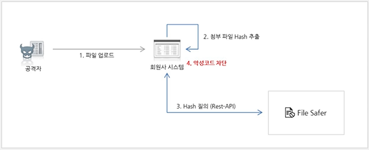

# 공인교육 - Associate 과정

> Naver Cloud Associate 자격증 준비
>
> edwith에서 제공하는 [강의](https://www.edwith.org/ncloudassociate/joinLectures/29538) 정리

## 목차

- [1강 - Overview](#1-Overview)
  - [클라우드의 역사](#클라우드의-역사)
  - [공공 클라우드](#공공-클라우드)
  - [왜 클라우드를 사용하는가?](#왜-클라우드를-사용하는가)
  - [네이버 클라우드 플랫폼 구성 요소](#네이버-클라우드-플랫폼-구성-요소)
  - [네이버 클라우드 플랫폼 전체 상품 라인업](#네이버-클라우드-플랫폼-전체-상품-라인업)
  - [네이버 클라우드 플랫폼 인프라 상품군](#네이버-클라우드-플랫폼-인프라-상품군)
  - [네이버 클라우드 플랫폼 플랫폼 상품군](#네이버-클라우드-플랫폼-플랫폼-상품군)
  - [네이버 클라우드 플랫폼 어플리케이션 상품군](#네이버-클라우드-플랫폼-어플리케이션-상품군)
  - [상품 의존성](#상품-의존성)
- [2강 - Compute Service](#2-compute-service)
  - [Compute 상품](#compute-상품)
  - [서버 타입](#서버-타입)
  - [서버 Operation 방법](#서버-operation-방법)
  - [Lab 1](#lab-1)
- [3강 - Network Service](#3-network-service)
  - [네이버 클라우드 플랫폼 Networking](#네이버-클라우드-플랫폼-networking)
  - [Load Balancer](#load-balancer)
  - [DNS](#dns)
  - [CDN](#cdn)
  - [IPSEC VPN](#ipsec-vpn)
  - [NAT Gateway](#nat-gateway)
  - [Global Route Manager](#global-route-manager)
- [4강 - Network Service Pratical](#4-network-service-pratical)
  - [Load Balancer](#load-balancer-1)
  - [DNS](#dns-1)
  - [CDN](#cdn-1)
  - [Auto Scaling](#auto-scaling)
- [5강 - Storage Service](#5-storage-service)
  - [Object Storage](#object-storage)
  - [Archive Storage](#archive-storage)
  - [NAS](#nas)
  - [Data Teleporter](#data-teleporter)
  - [Backup](#backup)
  - [Lab 4](#lab-4)
- [6강 - Cloud Database](#6-cloud-database)
  - [Cloud DB for MySQL](#cloud-db-for-mysql)
  - [Cloud DB for Redis](#cloud-db-for-redis)
  - [Cloud DB for MS-SQL](#cloud-db-for-ms-sql)
  - [실습 Cloud DB for MySQL 생성](#실습-cloud-db-for-mysql-생성)
- [7강 - AI Service](#7-ai-service)
  - [AI](#ai)
  - [챗봇](#챗봇)
  - [Clova Speech Recognition(CSR)](#clova-speech-recognitioncsr)
  - [Clova Speech Synthesis(CSS)](#clova-speech-synthesiscss)
  - [Clova Premium Voice](#clova-premium-voice)
  - [Clova OCR](#clova-ocr)
  - [Papago NMT(Neural Machine Translation)](#papago-nmtneural-machine-translation)
  - [Pose Estimation](#pose-estimation)
  - [Object Detection](#object-detection)
- [8강 - Application Service](#8-application-service)
  - [Application](#application)
  - [Geo Location](#geo-location)
  - [SENS](#sens)
  - [Outbound Mailer](#outbound-mailer)
- [9강 - Management Service](#9-management-service)
  - [Monitoring](#monitoring)
  - [Sub Account](#sub-account)
  - [Web Service Monitoring System(WMS)](#web-service-monitoring-systemwms)
  - [Cloud Activity Tracer](#cloud-activity-tracer)
  - [Resource Manager](#resource-manager)
  - [모니터링 실습](#모니터링-실습)
- [10강 - Analytics Service](#10-analytics-service)
  - [Analytics](#analytics)
  - [ELSA](#elsa)
  - [CLA](#cla)
  - [RUA](#rua)
  - [Cloud Hadoop](#cloud-hadoop)
  - [Cloud Search](#cloud-search)
  - [Elasticsearch Service](#elasticsearch-service)
  - [Global Region](#global-region)
- [11강- Security Service](#11-security-service)
  - [Site Safer, App Safer](#site-safer-app-safer)
  - [File Safer](#file-safer)
  - [Web Security Checker](#web-security-checker)
  - [System Security Checker](#system-security-checker)
  - [App Security Checker](#app-security-checker)
  - [Certificate Manager](#certificate-manager)
  - [Security Monitoring](#security-monitoring)
  - [SSL VPN](#ssl-vpn)
  - [SSL VPN 실습](#ssl-vpn-실습)
- [12강 - Media Service](#12-media-service)
  - [Live Station](#live-station)
  - [VOD Transcoder](#vod-transcoder)
  - [VOD Station](#vod-station)
  - [Image Optimizer](#image-optimizer)
  - [Workplace](#workplace)
- [13강 - Quiz](#13-quiz)

---

# 1. Overview

## 클라우드의 역사

- 1960년대 가상화라는 용어 사용
  - 서버 가상화 기술이 퍼블릭하게 발전한게 클라우드
- 다양한 하이퍼바이저의 출현
  - IBM의 Logical Partition
    - IBM의 유닉스 머신에 사용되는 하이퍼 바이저
  - VMWare, Xen, Hyper-V, KVM
  - 하이퍼바이저의 발전으로 클라우드의 기술들도 같이 발전

## 공공 클라우드

- 공공 클라우드 인증을 받은 클라우드
  - 국내에서 공공 클라우드 인증을 받은 6개의 기업 중 하나
- 국내 최초의 전문 금융 퍼블릭 클라우드
  - 금융 및 핀테크 기업들이 믿고 맡기는 클라우드

## 왜 클라우드를 사용하는가?

- 비용 절감
  - 데브옵스,  TCO, ROI 측면에서 리소스를 효율적으로 사용하여 리소스를 줄임
  - 서비스 트래픽에 맞게 탄력적으로 인프라를 운영할 수 있음
  - IaaS:오토스케일링, SaaS:쿠버네티스, PaaS:클라우드 funtion
  - 다양한 어플리케이션과 서비스를 제공하고 있음
- 빠른 Deploy
  - 서버 한대 만드는데 5분
- 글로벌 진출시 용이
  - 어플리케이션들은 국내뿐만 아니라 해외에서도 많이 사용
- 보안

## 네이버 클라우드 플랫폼 구성 요소

- 홈페이지
  - 사용하기 쉬운 UX
    - 접근하기 편하고 직관적이도록 개선
- 블로그
  - 공식 블로그를 통해 다양한 기술, 트랜드, 신상품 등을 확인 가능
- 유튜브
  - 신규 상품 소개, Webinar 내용

 

## 네이버 클라우드 플랫폼 전체 상품 라인업

- 하드웨어
  - 인프라
  - 하이브리드 클라우드, 클라우드 커넥트(Cloud Connect),  Vmware on NCP
  - 레거시 인프라와 연동할 수 있는 상품 존재
- 6개의 리전
- 서버, 스토리지, 네트워크
- 데이터베이스, 아날리티스, 미디어, 게임
- AI 서비스, DEV TOOLS, Application Service
- 전체 상품을 관리하는 MANAGEMENT
- 외부로부터 위협을 막는 SECURITY

## 네이버 클라우드 플랫폼 인프라 상품군

- Compute
  - 서버 상품
  - CPU와 메모리, 하드디스크를 제공하는 서버
  - GPU를 제공하는 GPU 서버
  - 하나의 물리 서버에 단일 VM만 생성해서 사용하는 VDS
  - 물리 서버 자체를 제공해주는 베어메탈(Bare-metal)
  - 컨테이너와 관련된 Container Registry, Kubernetes Service
  - Auto Scailing, NPC
- Storage
  - Block Storage, Object Storage, NAS
  - 데이터들을 복원해주는Backup
  - 다른 데이터들을 좀 더 오래 보관하고자 할 때 사용하는 Archive Storage
  - 레거시 데이터에서 빠르게 네이버 클라우드로 전환해주는 Data Teleporter
- Networking
  - 서비스의 트래픽을 분산시켜주는 LoadBalancer
  - 레거시 인프라와 클라우드 플랫폼을 사설 IP로 연결해주는IPsec VP
  - DNS, NAT Gateway, Global Route Manager, CDN, Global CDN
- Global
- Hybrid
  - 기존 레거시 인프라도 유지해야 되면 사용
  - Hybrid Cloud Hosting : 사용자의 서버 리소스를 네이버 클라우드의 IDC에 위치시켜 사용자의 레거시 인프라와 클라우드의 다양한 상품을 같이 사용
  - Cloud Connect : 레거시 인프라와 네이버 클라우드 플랫폼을 사설 IP로 연결
  - Vmware on NCP

## 네이버 클라우드 플랫폼 플랫폼 상품군

- Database
  - 설치형 DB : Maria DB, MySQL, MSSQL, Cubrid
    - 서버 이미지에 데이터베이스를 같이 설치
    - 사용자가 데이터 베이스를 설치할 필요없이 바로 사용
  - 관리형 DB : Cloud DB for MySQL, Cloud DB for MSSQL, Cloud DB for Redis
    - 관리 자체, 구성 자체를 네이버 클라우드에서 함
    - 사용자는 인스턴스에 접속할 수 있는 권한만 받음
    - HA, Backup, Monitoring을 지원
- Analytics
  - CLA, ELSA, RUA, Cloud Hadoop, Cloud Search
- Media
  - Live Transcoder, VOD Transcoder, Image Optimizer
- Game
  - Gamepot

## 네이버 클라우드 플랫폼 어플리케이션 상품군

- AI Service
  - 파파고와 클로바를 b2b 형식으로 제공
- DevTools
  - SourceCommit, SourceBuild, SourceDeploy
    - CICD를 구성할 수 있음
- Application Service
  - 독립적인 서비스를 제공
  - APIGateway, GeoLocation, Maps, Search Trend, 단축 URL, CAPTCHA
- Biz Application

## 상품 의존성

- 클라우드에서는 기본적으로 존과 리전이 생기면서 상품들이 구분됨
- 존 의존 상품
  - 서버, 클라우드 디비
  - KR1존과 KR2존이 존재하는데, 이 둘을 선택하는 상품들에 대해서만 존 의존 상품
- 리전 의존 상품
  - 로드밸런서, 오브젝트 스토리지
  - 존을 변경해도 설정된 내용이 동일하게 보이면 리전 의존 상품
- 리전 통합 상품
  - DNS, ACG
  - 리전을 선택하고 상품을 선택했을 때 다른 곳에서 설정한 내용이 그대로 보이면 리전 통합 상품

---

# 2. Compute Service

## Compute 상품

- 기본적인 서버를 생성하고 관리하는 상품
  - 한개의 CPU 1기가 메모리를 가진 마이크로 서버(1년간 무료로 사용, 계정당 1대만 사용 가능)
  - 2vCPU~16vCPU 콤팩트 스탠다드 서버(가장 많이 사용)
  - 메모리를 많이 필요로 하는 데이터베이스와 어플리케이션을 위한 그 이상의 256기가 메모리까지 제공할 수 있는 High Memory 서버까지 제공
  - 메모리는 1기가~32기가 램까지 준비되어 있는 스탠다드 서버가 존재
  - 다른 vm과 간섭되는 것을 원하지 않으면 VDS 상품
  - HPC : 금융회사, 증권사와 같이 대규모 연산이 빠른 시간안에 이루어져야 하는 곳에서 서비스에 대응하기 위해 나옴, CPU 쿨럭이 높고 컴퓨팅 파워가 좋은 서버로 구성

- 요금 구성
  - 서버는 기본적으로 CPU, 메모리, 하드 디스크, 네트워크로 구성
  - CPU와 메모리는 전원을 끄면 요금이 발생하지 않음
  - 네트워크는 outbound에서만 요금 발생
  - 서버 정지 시 컴퓨팅, 네트웍 요금은 발생하지 않음
  - 디스크
    - 기본적으로 네이버 클라우드 플랫폼은 서버를 만들면 50기가 또는 100기가의 하드 제공, 이 영역을 OS 영역 루트영역으로 부름, 기본 스토리지로 표시, 스토리지의 공간을 늘리거나 변경을 할 수 없음
    - 서버를 정지시키더라도 요금이 발생
  - 일반적이지 않은 서버는(High Memory 서버, VDS, GPU 서버) 정지를 시켜도 CPU, 메모리 요금이 발생
- SSD, HDD 디스크 타입 제공
  - 네이버 클라우드 플랫폼에서는 디스크 I/O에 대해서 퍼포먼스를 차별화하여 제공
  - SSD와 HDD(SAS) 타입의 디스크 타입을 제공
  - SSD를 사용하면 최대 아이옵스(IOPS)를 보장
    - 최대 아이옵스는 디스크를 만들면 디스크에 맞춰서 4,000~20,000까지 보장
    - 디스크의 용량에 따라 가변적

## 서버 타입

- Micro
- Compact
  - 일반적으로 사용
- Standard
  - 일반적으로 사용
- High Memory
- CPU Intensive
  - CPU 쿨럭이 높고 고성능 연산이 필요한 경우 사용

### 일반 서버

- 서버 스펙
  - 마이크로 서버
    -  CentOS, Ubuntu
    -  1vCPU, 1G RAM, 50G HDD 
    -  서버 스펙이 고정
  - Compact / Standard
    - CentOS, Ubuntu, Windows
    - 2~16vCPU, 4G~32G RAM
    - 자유롭게 스펙 변경 가능
    - High Memory로는 변경 불가
      - 변경하려면 서버를 이미지를 뜬다음 해당 이미지를 High Memory 스펙으로 서버를 만들어야 함
  - High Memory
    - CentOS, Ubuntu, Windows
    - 8~32vCPU, 64~256G RAM
    - 자유롭게 스펙 변경 가능
    - Compact / Standard / Micro로는 스펙 다운 불가
      - 변경하려면 이미지를 통해서 서버를 배포해야 함
  - VDS
    - CentOS, Ubuntu, Windows
    - 20~32vCPU, 80~232G RAM
    - 디스크는 로컬 디스크를 제공, 1~2TB HDD
    - 스펙 업 / 다운이 안됨
  - CPU Intensive
    - CentOS, Ubuntu, Windows
    - 2~32vCPU, 4~64G RAM
    - 이 안에서 스펙 업 / 다운이 가능

### Bare Metal Server

- 단독으로 사용할 수 있는 고성능 물리 서버를 클라우드 형태로 제공
- 일반적으로 알고 있는 VM들 혹은 클라우드에서 서버 가상화를  쓰는 것이 아니라 Bare Metal이라고 한다면 클라우드에서 서버 자체를 제공
- 물리 서버에 하이퍼바이저 없이 바로 운영 체제를 설치하여 제공
- 물리 서버 그 자체를 사용자한테 제공하는 방식
  - 때문에 물리 서버 성능 그 자체를 다 사용자가 이용할 수 있음
- 보통 데이터 베이스와 게임 등 고성능 혹은 고집적의 서버 스펙을 요구하거나 혹은 특별한 라이센스의 제약사항 때문에 Bare Metal을 사용
- RAID를 사용자가 직접 구성
  - 서버 구성 시 네이버 클라우드는 RAID1+0과 RAID5를 선택할 수 있게 제공
- CentOS, Ubuntu, Windows 외에 ORACLE Linux도 제공
  - 스펙이 2개는 게임에 최적화해서 만들었고 나머지 3개는 데이터베이스 용도로 만들어짐
  - 20core 서버의 경우 MSSQL
    - MSSQL 스탠다드에서 지원하는 최대 코어 수가 20core
    - 만약 32core에 MSSQL을 할당해 사용하면 전체를 다 사용하지 못하고 20core만 사용
  - 8core 서버인 경우 ORACLE
    - 오라클 스탠다드에 최적화
  - 4core 서버인 경우 MSSQL
    - MSSQL의 최소한의 서버 스펙
- Bare Metal은 사용자가 클라우드를 이용하지만 성능에 대해서 리소스에 대해서 가장 높이 끌어올릴 수 있는 용도로 사용
- 물리 서버의 고성능에 대한 장점과 클라우드의 편의성을 두 가지를 모두 이용 가능
- 다만 클라우드를 이용하더라도 클라우드의 다양한 장점 중 몇가지는 사용 못함
  - 내서버 이미지, 스냡샷, 추가 스토리지의 서버 오퍼레이션은 사용 못함
  - 또한 서버 장애 시 Live Migration과 Cold Migration 같은 클라우드 만의 장애 복구 기술을 이용하지 못함

### GPU 서버

- GPU 서버는 최근 머신러닝과 딥러닝에서 많은 각광을 받음
- 병렬 처리에 최적화된 GPU 서버의 고성능 컴퓨팅 파워를 제공
- 딥러닝이나 머신러닝을 위해한 GPU 서버 팜
  - NVIDA P40 장착
  - NVIDIA GRID나 아니면 기타 GPU Core를 제공하는 기술을 사용하지 않음
  - Pass Through라는 기술을 적용해 GPU를 제공
  - 서버 당 최대 2장의 GPU를 사용할 수 있음
- 특이하게 서버 스펙을 사용자가 정하는 것이 아니라 GPU 카드 갯수를 정하게 되면 서버 스펙이 자동으로 고정
  - GPU 카드 한 장당 CPU는 4vCPU, 메모리는 30GB가 할당
- 제공 OS
  - CentOS, Ubuntu

### 서버 타입별 특성

| 기능                   | Micro | Compact | Standard | High Memory     | VDS        | GPU  |
| ---------------------- | ----- | ------- | -------- | --------------- | ---------- | ---- |
| 스토리지 추가          | 불가  | 가능    | 가능     | 가능            | 가능       | 가능 |
| SSD 스토리지 이용      | 불가  | 가능    | 가능     | 가능            | SSD만 제공 | 가능 |
| AutoScaling 이용       | 불가  | 가능    | 가능     | 불가(개선 예정) | 불가       | 불가 |
| IOPS 성능              | 낮음  | 높음    | 높음     | 높음            | 높음       | 높음 |
| Network Interface 이용 | 불가  | 가능    | 가능     | 가능            | 가능       | 불가 |

- 일반적으로 가장 많은 기능을 제공하고 있는 것은 Compact, Standard
- VDS 특성상 AutoScaling 이용 불가, GPU도 마찬가지

### 국가별 지원 서버 타입

| 서비스                | KR   | SG   | JP   | USW  | DE   | HK   | 비고 |
| --------------------- | ---- | ---- | ---- | ---- | ---- | ---- | ---- |
| Server(Compact / Std) | O    | O    | O    | O    | O    | O    |      |
| Server(High-mem)      | O    | O    | O    | O    | O    | X    |      |
| SSD Server            | O    | O    | O    | O    | O    | X    |      |
| GPU                   | O    | X    | X    | X    | X    | X    |      |
| VDS                   | O    | O    | O    | O    | O    | X    |      |
| Baremetal             | O    | O    | O    | O    | O    | X    |      |

- 한국이 가장 많은 서버 타입을 제공

## 서버 Operation 방법

- 웹 콘솔을 이용한 Operation
  - 가장 손쉽게 가장 편하게 오퍼레이션을 사용하는 방법
  - Ncloud.com 콘솔을 이용하여 다양한 오퍼레이션 진행
  - 서버를 키거나 생성하거나 끄거나 스토리지를 붙이거나 이미지를 생성하는 등 다양한 오퍼레이션을 제공
  - 네이버 클라우드 플랫폼의 경우 웹 콘솔의 Operation 기능은 100%
- CLI Operation
  - 사용자의 데스크톱에서 명령어를 통해 서버의 다양한 기술들을 수행
  - 별도의 CLI 툴을 설치하여 명령 프롬프트에서 명령어를 이용하여 Operation
  - S3의 경우 AWS CLI를 이용하여 Operation
  - 네이버 클라우드 플랫폼의 경우 CLI의 Operation 기능은 60%
- API Operation
  - 파이썬이나 자바를 이용해 어플리케이션을 짜고 만들어진 어플리케이션을 이용해서 네이버 클라우드 플랫폼에 서버를 만들거나 Operation을 할 수 있음
  - 네이버 클라우드 플랫폼에서 제공하는 API를 이용하여 Operation 명령어 개발하여 사용
  - S3의 경우 AWS API를 이용하여 Operation
  - 네이버 클라우드 플랫폼의 경우 CLI의 Operation 기능은 60%

## Lab 1

- 서버 생성 Operation
  - 웹을 통한 test 서버 생성
- 먼저 Console로 들어감
- 대시보드에서 왼쪽 메뉴 중 Products & Services
  - 네이버 클라우드 플랫폼의 다양한 상품이 보임
  - 여기서 Server 선택
- 서버 생성 버튼 클릭
  - 부팅 디스크 크기는 C드라이브와 비슷
  - 이미지 타입
    - OS와 Application, DBMS 중 에서 설치할 이미지 선택
    - OS 이미지 타입은 CentOS 선택
  - 서버 타입은 Standard 선택
  - 밑에서 centos-7.3-64 서버 이미지 이름 선택
  - 서버 설정
    - Zone 선택
    - HDD를 선택하면 max iops가 개런티되지 않음
    - max iops를 보장받고 싶으면 SDD
    - 서버 타입마다 서버 스펙 선택
    - 서버 개수 1
    - 서버 이름 설정
    - Script 선택 없음(OS만 설치되어 있는 서버)
  - 인증키 설정
    - 루트 패스워드 설정
    - 인증키 생성 및 저장 선택
  - 네트워크 접근 설정
    - 네이버 클라우드를 처음 시작하면 기본적으로 default-acg 제공
  - 최종 확인
    - 설정한 스펙 확인
    - 서버 생성
- 네이버 클라우드에서 서버를 생성하면 비공인 IP가 할당
  - 외부에서 이 서버에 관리 목적으로 접근할 수 없음
  - 웹 서비스 혹은 다른 어플리케이션 서비스를 하더라도 기본적으로 외부에서 이 서버에 접근 불가능
  - 관리 목적이라면 포트 포워딩 방식을 사용
  - 공인 IP를 부여해서 서버를 외부에서 접속 가능하도록 만들어야만 서버가 서비스를 할 수 있음
    - 로드밸런서를 이용해도 외부에서 접속 가능
- 서버 생성 과정
  - 생성중 -> 부팅중 -> 설정중-> 녹색불이 켜지면서 온라인
  - 설정중으로 넘어가면 50기가의 스토리지가 생성
  - 온라인으로 넘어가면 실제 서버가 부팅이 되었고 정상적으로 서비스 준비 상태로 넘어갔다고 볼 수 있음

---

# 3. Network Service

## 네이버 클라우드 플랫폼 Networking

- 외부와의 통로, 내부와의 통로 뿐만 아니라 DNS, CDN과 같은 다양한 서비스를 제공
  - 유입되는 네트워크 트래픽을 백엔드 서버로 분기하기 위한 Load Balancer
  - 네임서버 제공하는 DNS
  - 요청 사용자에 가장 가까운 엣지 서버에서 캐싱된 파일을 제공하여 원본 부하를 낮출 수 있는 CDN 상품
  - Site-to-Site 연결을 위한 IPSEC VPN 상품
  - 비공인 IP를 가진 다수의 서버에게 단일 공인 IP를 이용한 외부 접속을 제공하는 NAT Gateway 제공
  - 글로벌 네트워크 트래픽을 백앤드 서버로 분기하기 위한 Global Route Manager

## Load balancer

- Load Balancer란
  - 로드를 분산하여 밸런싱을 맞춰주는 상품
  - 네이버 클라우드 플랫폼에서 로드 밸런서는 부하 분산을 위해 서버 앞단에서 트래픽을 분산하는 역할
  - 서버를 이중화하거나 가용성을 높일 때 서비스가 더 많은 트래픽을 받아들이고자 할 떄 사용하는 가장 기본적인 것
  - 네이버 클라우드 플랫폼에서는 소프트웨어 방식인 HAProxy를 이용하여 로드밸런싱
  - 기본적으로 로드밸런서 하나를 생성하면 실제 물리적으로는 HAProxy 서버 2개가 도메인에 바인딩되어 제공
    - 로드밸런서도 물리적인 하나의 장비
    - 장비가 문제가 생겼을 때 테이크 오버해서 페일 오버하는 시점이 필요
    - 어느 하나의 장비가 무너지더라도 다른 장비를 통해서 서비스를 연속성있게 지속시킬 수 있도록 다수의 로드밸런서 형성
  - 로드밸런서는 최대 6만 TPS(Transaction Per Second)까지 보장
- 연결 방식
  - Proxy 방식
    - 사용자는 별도의 설정없이 네이버 클라우드에서 로드밸런서를 구성할 수 있음
      - 다이렉트 방식이나 나트방식은 사용자가 직접 서버에 설정을 바꾸거나 서버의 내용을 수정해야 하는 불편함 존재
  - 따라서 서버에서는 클라이언트 IP를 확인하고자 할 때 별도의 설정이 필요
  - 클라이언트 IP를 확인하고자 할 때, SSL/TCP일 경우에는 Proxy Protocol 사용 HTTP/HTTPS일 경우 X-Forwarder 사용, 웹 서비스인 경우에는 ASP/ JSP/ PHP가 됬든 사용자의 IP를 확인할 수 있는 함수를 호출해서 실제 IP를 확인해야 함
- 로드밸런싱 알고리즘
  - 일반적으로 8가지 정도의 알고리즘이 있지만 네이버 클라우드 플랫폼에서는 가장 많이 사용하는 3가지의 알고리즘 제공
  - Roud Robin : 클라이언트에서 요청이 오면 서버에 1개씩 순차적으로 분배하는 방식
    - 밸런싱이 안 맞을 수 있지만 단순하고 부하가 줄어들게 됨
  - Least Connection : 클라이언트 연결이 제일 적은 서버에게 새로운 커넥션을 분배하는 방식
    - 로드밸런서가 서버에 커넥션이 몇개가 되있는지 알기 때문에 가정 적은 커넥션을 맺고 있는 서버에 새로운 연결을 해줌
  - Source IP Hash : 클라이언트 IP에 대한 해시테이블을 가지고 클라이언트 IP에 매핑되는 서버에 새로운 커넥션을 분배하는 방식
    - 클라이언트가 한번 접속한 서버가 지속적으로 접속하게 하는 방식
  - 나머지 방식은 주로 Weighted 방식
    - Weighted 방식은 서버에 스펙이 달라졌을 때 신규 서버에는 웨이트를 많이 주고 성능이 떨어지는 서버에 웨이트를 적게 주어 차별화해서 밸런싱을 해주는 로드를 분배시켜 주는 방식
    - 클라우드에서는 효용성이 없음
- 생성 후 설정 가능 내용
  - 생성할 때는 설정할 수 없고 로드밸런서를 만든 이후에 설정할 수 있음
  - 웹서버에서도 아래 2개가 활성화되어 있어야 함
  - HTTP Keep Alive On / Off (Default Off)
  - Connection Idle Time (Default : 60 Sec)
  - 웹 서비스에 특성에 맞게 적용해야 함

## DNS

- 도메인 등록 서비스
  - 도메인 네임 서버를 제공
    - 후이즈나 가비아에서 ncloud.com을 구입하고 실제로 네임서버에서 www는 이런 IP로 가고 지정
    - 이때 네임서버가 필요. 직접 구상하지 않고 네이버 클라우드 플랫폼에서 제공하는 네임 서버를 사용
  - 다양한 레코드 타입 지원(A, NS, PTR, AAAA, MX, CNAME, SPF, TXT)
  - 등록 도메인으로 인입되는 트래픽을 분기(Round Robin)
    - DNS를 로드밸런서처럼 이용 가능
  - 등록된 도메인에 대한 헬스 체크 불가

 

## CDN

- 네이버 홈페이지는 3MB정도의 사이즈, 이 안에 이미지도 있고 스크립트, 스타일시트 등이 있지만 90% 이상이 텍스트가 있음. 실제로 아주 작은 용량에 대해서만 네이버 웹 서버에서 사용자에게 서빙
- CDN을 사용하는 이유
  - 트래픽을 좀 더 사용자에게 빠르게 전달
  - 웹 서비스의 부하를 최대한 줄이기 위해

- 컨텐츠를 Caching하여 보다 빠르고 안정적으로 사용자에게 전송하는 서비스
  - 국내, 국외 주 서비스 지역에 따른 CDN 상품 분리 제공(CDN+ : 국내 전용, GCDN : 국외 전용)
    - CDN+은 국내 1위 지에스네오텍을 이용
    - GCDN은 글로벌 1위 사업자인 아카마인 이용
  - 원본은 NCP 오브젝트 스토리지 혹은 커스텀 오리진 서버를 둘 수 있음
  - 도메인은 랜덤 CDN 도메인(*.ntruss.com) 혹은 보유하고 있는 도메인 사용 가능
    - 도메인을 이용해서 게임, 모바일 등의 실제 어플리케이션에 이쪽 CDN 도메인에서 데이터를 가져오라고 명시를 해줘야만 실제로 CDN 이용 가능
  - 지원 프로토콜은 HTTP/S

- CDN이 언제 필요할까?
  - 게임과 같은 대규모 파일 배포나 이미지 서비스, 동영상 서비스 등 대규모로 트래픽이 발생하는 경우
  - 웹서버를 통해 배포하게 되면 웹 서버의 용량이 기하 급수적으로 커져야 함
    - 클라우드 플랫폼을 사용하면 공급자는 웹서버를 최대한 줄일 수 있어 최소한으로 줄일 수 있음
  - 이러한 대규모 트래픽에 효과적으로 대응하기 위한 서비스

## IPSEC VPN

- NCP에서 제공하는 VPN 서비스는 2가지
  - IPSEC VPN(network 카테고리)
    - 기존의 레거시 인프라 또는 IDC에서 운영하고 있는 서버들과 NCP안에 있는 고객의 서버를 안전하게 그리고 사설망 통신을 사용해서 데이터를 주고 받고자 할 때 사용
  - SSL VPN(security 카테고리)
    - NCP안에 있는 서버에 클라이언트(관리자 등)들이 접근하기 위해 사용

- 고객의 사내망과 NCP 간 사설 통신을 위한 IPSEC VPN
  - 고객의 사내망과 NCP간 사설 통신을 위한 망 to 망 연결
  - 고객의 VPN 장비와 NCP VPN 장비 간 터널링 연결 제공(통신 방식 호환이 되어야 함)
    - NCP 사용자 가이드에 프로파일링되어 있음
  - NCP 서버들은 Private Subnet 대역(192.168.x.x)으로 통신 필요
  - BW 최대 30Mbps 제공

## NAT Gateway

- 예제
  - 일반적으로 NCP에 있는 서버들이 외부의 특정 은행, 증권사, 통신사와 통신하기 위해서는 해당 통신사나 증권사, 은행에서 NCP과 통신하기 위해서 NCP 안에 있는 고객의 공인 IP로 통신을 하게끔. 그리고 그쪽의 통신사의 방화벽, 금융사의 방화벽에서 NCP안의 서버에 공인 IP를 특정 포트를 열어주게끔 운영
  - 하지만 불편함이 발생
    - NCP 서버들 각각마다 공인 IP를 할당해야 함
    - 그리고 서버들을 서브넷으로 지정하지 못함
    - 때문에 공인 IP 각각 마다 통신사, 금융사의 방화벽에 등록해야 함
    - 이 사이에 서버가 갑자기 늘어난다면 통신사나 금융사에 변경 요청을 보냄
    - 하지만 이 변경 요청이 바로 되지 않음
    - 때문에 빠르게 업데이트해야 하는 상황이 발생하면 상대방(통신사, 금융사)의 방화벽의 설정을 안바꾸고 NCP의 NAT IP만 가지고 상대방과 통신하게 하면
    - 서버가 계속해서 늘어나던 Auto Scaling을 걸어서 서버가 수십대가 되더라도 상대방과 통신하는 IP는 NAT Gateway에서 지정한 하나이기 때문에 상대방의 방화벽은 업데이트를 할 필요가 없어짐
  - 나가는 IP에 대해서 특정 IP를 달고 나가게끔하는 서비스가 NAT Gateway

- 비공인 IP를 가진 다수의 서버에게 대표 공인 IP를 이용한 외부 접속을 제공
  - NAT Gateway를 통해 외부로 접속할 때 사용되는 대표 공인 IP는 해당 NAT Gateway만 독점적으로 사용하는 IP
  - Auto Scaling과 연계된 자동 설정 제공
  - 보안상 다수의 공인 IP에 대한 ACL을 오픈할 수 없는 경우 혹은 공인 IP 생성 비용 절약 가능
- NAT Gateway는 설정할 때 일반적으로 모든 트래픽은 NCP에 NAT를 통해 나가고 지정된 상대방의 방화벽의 IP에 대해서만 NAT Gateway를 통해서 나감
  - 설정할 때 필요한 정보가 생김
    - 상대방의 IP(PIP)
    - 상대방의 방화벽에서 우리쪽의 IP를 열어주어야 되기 때문에 NAT Gateway 공인 IP가 생성
    - NAT Gateway 사설 IP 생성 : 사용자의 서버에서 상대방과 통신할 때 그 사설 IP를 바라보게끔 호스트 파일에 넣어주게끔 하기 위한 용도

## Global Route Manager

- 예제
  - 미국에 있는 사용자는 네이버를 이용하게 되면 미국에 있는 네이버 서버를 이용하고 일본에 있는 사용자는 일본에 있는 네이버 서버 그리고 유럽에 있는 사용자는 유럽의 네이버 서버를 이용
  - 그런데 네이버는 한국에 있는데 한국으로 안오고 미국 사용자가 네이버를 접속했을 때 미국에 있는 네이버 서버로 접속할 수 있을까
  - 글로벌 라우트 매니저에서 미국과 일본에 있는 DNS 서버들한테 사용자들이 www.naver.com의 IP를 알려달라고 질의를 던짐
  - 그때 한국의 네이버 서버의 IP를 리턴하지 않고 미국과 일본에 있는 서버의 IP를 리턴
  - 미국의 사용자가 미국에 있는 네이버 웹 서버에 접속할 수 있도록 하는 상품
  - 해외 각지에 서버를 만들고 어느 나라는 어떤 서버가 담당할지 매핑
  - 매핑하는 방식이 존재

- DNS 기반의 다양한 방법을 통해 네트워크 트래픽을 안정적으로 로드밸런싱하는 GSLB 상품
  - GSLB : 도메인 단위로 로드밸런싱하고 도메인 단위로 health check를 할 수 있는 기능
    - 다양한 리전에 웹 서버를 분산
    - 특정 리전에 문제가 생기면 나머지 리전으로 서비스를 하고자 할 때 GSLB를 사용
    - 로드 밸런서는 OSI 7layer 중 4에서 동작
      - 때문에 서버들이 반드시 같은 리전안에 있어야 함
  - 여러개의 리전을 만들어 놓고 동일한 웹 서비스를 한다라고 한다면 리전에 대해서 Health Check를 하고 리전에 대해서도 로드 밸런싱을 해야 함
    - 이때 사용할 수 있는게 GRM의 기능 중 하나인 GSLB
  - DNS 기반의 로드밸런싱 서비스 제공을 통해서 지역별 트래픽 기반 부하 분산, DR 구축 등에 사용할 수 있는 상품
  - 로드밸런싱 타입은 4가지 제공(Round Robin, Weighted, GeoLocation, Failover)
  - IP에 대한 Health Check만 제공

---

# 4. Network Service Pratical

- DNS, CDN, Load Balancer 구현
- 서버들을 로드밸런서로 묶고 DNS에 등록도 해보고 CDN 반영, 그리고 Auto Scaling을 통해서 사용자의 트래픽이 변화함에 따라 인프라가 유동적으로 변하는 것을 확인

## Load Balancer

- 네트워크 카테고리에 로드 밸런서 있음
- 로드 밸런서 생성
  - 로드밸런서 이름 설정
  - 네트워크
    - Private IP
      - 서버들끼리 서버들간에 통신할 때도 로드밸런서를 통해서 통신할 필요성이 있음
      - 예를 들어서 배치 서버, 어드민 서버, 왓슨 서버처럼 실제로 서버 내부에 있지만 외부에 노출될 필요는 없고 서버간 통신할 때 이중화, 노드를 분배시키기 위해서 private IP에 로드밸런서를 구성할 필요가 있음
    - Public IP
      - 일반적으로 웹 서비스와 같이 외부에 노출되는 서비스들을 로드밸런서로 구성할 때 사용
  - Zone 선택
    - KR1
    - KR2
    - 하나만 선택하면 하나에 두 개의 로드밸런서가 생성
  - 로드밸런서 설정
    - 프로토콜
      - HTTP, TPS, SSL, TCP
      - 로드밸런서는 OSI 7레이어에서 레이어 4(트랜스포트 레이어)에서 동작
      - 트랜스포트 레이어는 TCP 포트, UDP 포트만 인식, 그래서 기본적으로 로드밸런서는 헬스 체크를 포트에 대해서 수행
      - TCP를 제외한 나머지 프로토콜은 HTTP에 대해서 로드밸런싱을 하는게 아닌 HTTP, TPS, SSL은 오른쪽 항목에 L7 헬스 체크가 있는데 L7 헬스 체크 기능을 활성화 시키는 것임
      - 웹 서버는 살아있지만 실제로 서비스는 되지 않는 즉, 80포트는 살아있으나 웹 서버가 제대로 동작하지 않음. 이때 로드밸런서는 80포트가 살아있기 때문에 트래픽을 넘김. 하지만 사용자는 에러 페이지를 봄
      - 그래서 L7 헬스 체크를 통해서 포트 뿐만 아니라 웹 서비스가 서비스를 하고 있는지 체크
      - /(루트 url)로 설정되어 있는데 사실은 index.html이 생략되있음
    - Sticky Session
      - A 클라이언트가 3번 서버에 접속하면 다음에 접속할 때도 A 클라이언트는 3번 서버로만 가게 함.
      - 웹 서버만 적용.
      - 특정 클라이언트가 특정 서버로만 접속하게끔 하는 기능이 스티키 세션
      - 소스 IP 해시는 IP를 기반으로 하고 스티키 세션은 쿠키를 기반으로 동작
    - 헬스체크는 6초를 기준으로 체크
    - 연속으로 3번 Fail나면 언바인딩(더 이상 서버가 유용하지 않기 떄문에 L4에서는 그 서버를 서비스 제외시키겠다)
    - 연속으로 3 번 Ok가 나면 바인딩(서버를 L4에서 밸런싱하겠다란 용어)
  - 로드밸런싱 알고리즘
    - Round Robin
    - Least Connection
    - Source IP Hash
- 서버추가
  - 로드밸런서에 어떤 서버를 넣을지 선택하는 화면
  - 실습에서는 lab1-org2, lab1-org 서버 추가
- 로드밸런서 생성
- 로드밸런서가 만들어지면 접속 정보에는 IP가 아닌 도메인(호스트) 형태의 접속 정보를 제공
  - 떄문에 나중에 DNS에 로드밸런서를 등록하려면 A 레코드 타입이 아닌 CNAME 레코드 타입으로 지정
- 접속 정보로 접속하면 공인 IP로 접속한 IP와 로드밸런서로 접속한 IP가 다름
  - proxy방식이기 때문에 서버 입장에서 봤을 때 로드밸런서를 이용한 접속에서는 클라이언트의 IP는 로드밸런서의 IP가 찍힘
  - 실제 로드밸런서 IP
    - DNS 조회 명령어
      - nslookup <로드밸런서 접속 정보>
- 다 만들면 HTTP Keep-alive, Connection Idle Timeout설정이 있음
  - 디폴트는 Off, 60초로 설정되있고 바꿀 수 있음
  - 웹 서비스의 성격에 따라서 웹 서버의 설정에 따라 설정해야만 유효함

## DNS

- dns를 이용해 편리하게 접속
  - A 레코드와 CNAME 레코드 추가
- 네트워크 카테고리에서 DNS 선택
  - 도메인 추가 선택
  - 도메인 이름 추가
- 생성하면 기본적으로 NS 레코드와 SOA 레코드가 추가되어 있음
  - 후이즈에는 후이즈의 네임서버를 지정해야 함
  - 후이즈나 가비아에서 도메인을 구매하면
    - 네임서버
      - ns1c1.ncloud-dns.com
      - ns2c1.ncloud-dns.com
      - ns3c1.ncloud-dns.com
      - ns4c1.ncloud-dns.com
    - 이렇게 네임 서버를 지정해주어야만 NCP에서 DNS 상품을 이용할 수 있음
  - 여기서 두 가지 레코드 추가
    - 레코드 명 : server1
    - 레코드 타입 : A
      - A는 레코드 값이 IP로 매핑
    - TTL은 일반적으로 서비스 성격에 맞게 설정
      - 여기서는 15분을 줌
    - 레코드 값 : 서버의 공인 IP
    - 두 번째 레코드는 로드밸런서를 www에 주소로 줌
      - 이때 로드밸런서는 도메인 정보로 접속 정보를 제공함. 그래서 A 레코드로 주면 에러가 발생
    - 레코드 명 : www
    - 레코드 타입 : CNAME 
    - 레코드 값 : 도메인
- 도메인으로 접속해도 네임서버가 활성화되어서 접속 가능

## CDN

- CDN을 사용하려면 Network카테고리에서 국내 CDN을 사용하기 때문에 CDN+(Domestic)선택
- 실습에서는 이미지를 CDN으로 서비스
- CDN 신청 버튼 선택
- 서비스 설정
  - 서비스 이름 설정
  - 서비스 프로토콜 : HTTP
  - 서비스 도메인
    - 고객 보유 도메인을 사용하려면 서비스 도메인(ex. cdn.edu110.ncloud.com)을 입력하고 DNS에서 해당 도메인을 CNAME으로 만들어야함
    - CDN을 만들면 로드밸런서와 마찬가지로 접속 정보가 나옴. 그 정보를 이용해 리다이렉트해주는 작업을 추가적으로 해야함
  - Access Log
    - 보통 Access Log는 CDN에 누가 접속을 했는지, 잘 접속이 됬는지, hit가 났는지 miss가 났는지 통계를 뽑아보기 위한 지표로 사용할 수 있음
    - 사용하면 오브젝트 스토리지에다가 저장할 수 있음
- 원본 설정
  - 원본 위치
    - Object Storage
    - 직접 입력
      - 공인 IP 입력
      - HTTP 80포트
  - 원본 경로(선택)
    - 디렉토리를 지정할 수 있는데 예제 서버는 단일 디렉토리이기 때문에 따로 설정하지 않음
  - 나머지 옵션들은 사용자 가이드를 보고 해당 옵션이 내 서비스에 맞는지 봐야됨
    - 내 서비스가 동영상 전송이면 압축같은 옵션은 효과가 없음
- 캐싱 설정
  -  Cache expiry
     - DNS에서 TTL과 같이 한번 캐싱되있는 데이터를 얼마나 더 유지를 시킬것인가, 얼마후에 갱신할 것인가를 선택할 수 있음
  -  다양한 보안 설정을 할 수 있음
- Viewer 전송 설정
  - Referrer Domain
    - 어떠한 경로를 통해서 왔는지를 확인하고 정상적인 경로로만 와야 컨텐츠를 제공하게 설정 가능
    - Referrer가 없는 경우에는 허용하지 않음
- Security Token
  - 허가된 사용자에 대해서만 컨텐츠를 허락하게 설정할 수 있음
- 생성하면 서비스 도메인이 생성
  - 서버 페이지에서 오른쪽 클릭 후 페이지 소스 보기 선택
  - 이미지에 대한 html의 src를
    - src='cdn도메인/logo1.jpg'로 설정
    - 이미지 파일을 웹 서버에서 나가는게 아닌 CDN을 통해서 내보내게 됨
- 처음 한번은 miss가 나지만 그 다음부터는 캐싱을 하고 있다가 사용자들에게 빠르게 컨텐츠를 제공
- 트래픽 비용, 서비스 비용 절감

## Auto Scaling

- 오토 스케일링은 기본적으로 인프라단에서 수행
- 클라우드에서 사용되는 하나의 전략이 스케일 아웃 전략
  - 사용자의 트래픽에 맞춰서 인프라가 능동적으로 변형되는게 오토 스케일링
- 오토 스케일링을 적용하기 위해서는 NCP에서 Compute 카테고리에  있음
  - 총 3가지의 설정이 필요
    - Launch Configuration
      - 서버의 스펙을 결정
      - 어떤 서버로 오토 스케일링의 서버를 생성할지
      - 누르면 마치 처음 서버를 만드는 것처럼 서버에 대한 내용이 나옴
      - 내 서버 이미지를 누르면 기존의 만든 이미지를 이용해 서버를 만듬
      - 일반적으로 오토 스케일링은 사용자의 트래픽이 증가했을 때 바로 반응하여 서버를 늘리는 것이기 때문에  내 서버 이미지로 기본적인 마스터본을 만들고 서버에 추가적인 설정이 필요할 때 쓸수 있는 기능이 Init Script
      - 내 서버 이미지와 Init Script를 중복해서 적용하여 서버 생성 시간을 줄일 수 있음
      - 스마트하게 오토 스케일링을 구성하면 내 서버 이미지에서 미리 마스터본을 만들어 놓고 해당 이미지를 불러온 동시에 업데이트된 내용은 Init Script를 통해서 불러오게 해주는게 효과적
    - Auto Scaling Group
      - 런치 컨피규레이션에서 만든 서버들을 몇대씩 언제 만들지에 대한 설정
      - 최대 30대의 서버를 만들 수 있음
    - Event Group
- Launch Configuration
  - 실습에서는 기본 이미지(깡통 서버)를 이용해 만듬
  - 기본 이미지
    - 50GB, OS, All 선택
    - 서버 이미지 이름 centos-7.3-64 선택
  - 서버 설정
    - 서버의 스펙을 설정
    - SSD, Standard, vCPU 2개, 메모리 4GB, SSD 500GB
    - Init Script : lab-script-7
  - 이름 설정
    - lab-lc로 설정
  - 인증키 설정
    - 보유하고 있는 ACI 설정
  - 최종 확인
    -  launch configuration에서 중요한 것은 어떤 서버 이미지(깡통, 기존 이미지)를 이용해서 만들지 그리고 서버 스펙을 어떻게 할지 인증키는 사실 오토 스케일링된 서버에 접속할 일은 없어야 함
    -  ACG가 중요. 어떤 ACG에 포함시킬 것인가
       - 오토 스케일링에 의해서 서버가 만들어짐
       - 그 서버가 DB 서버에 접속을 할려면 DB 서버 ACL에 새로 만들어진 서버들이 접속할 수 있도록 허용해주어야 함
       - 때문에 ACG가 중요. 실제로 ACG를 통해서 오토 스케일링된 서버들도 웹 서비스를 하거나 DB 서버에 접속할 수 있게 됨
- Auto Scaling Group
  - 만들어놓은 Launch Configuration에서 선택
    - 사용자 별로 Launch Configuration과 Auto Scaling Group을 만들 수 있는 개수는 제한
  - 그룹 설정
    - 그룹 이름 설정
    - Zone 선택
    - 최소 용량, 최대 용량, 기대 용량
      - 오토 스케일링 서버는 능동적으로 수가 변함.
      - 기대 용량은 오토 스케일링으로 서버를 만들면 처음에 몇대로 시작할지 시작되는 서버의 대수를 설정하는 개수
    - 쿨다운
      - 서버가 정상적으로 올라와도 부팅 이후에 Init Script나 웹 서버가 기동하는데 시간이 필요. 그때 어느정도의 시간을 할당할지 결정
    - 헬스 체크 보류 기간
      - 로드 밸런서가 해당 설정 시간만큼 기다렸다가 헬스 체크를 시작하고 바인딩을 하게 됨
    - 헬스 체크 유형 : 로드 밸런서
    - 반납 정책
      - 기본적으로는 NCP에서 알아서 서버를 반납
      - 사용자가 서버가 반납되는 것을 막고 세션이 조금이라도 남아있으면 다 빠진 후에 서버를 반납해야 되는 필요성이 있을 때 고객이 API로 직접 지정을 선택해 사용자가 서버를 직접 반납
    - Nat Gateway 설정 가능
  - 정책/일정 설정
    - 일정 설정
      - 매주 수요일날 5시에 이벤트를 하면 미리 지정 날짜에 서버를 10대를 만들어 놓고 그 이후에 서버를 삭제
      - 이벤트 혹은 서비스에 대한 일정에 따라서 서버의 트래픽의 변동이 발생하는 경우에는 그 해당 일정에 맞춰서 서버를 유동적으로 늘렸다 줄였다할 수 있음
    - 정책 설정
      - 계획되어 있는 이벤트 기반이 아니라 계획에 없는 급격히 사용자가 몰리거나 빠지게 되면 그에 맞춰서 유동적으로 능동적으로 NCP의 오토스케일링이 알아서 서버를 늘리고 줄이게 함
      - 스케일링 설정
        - 증강변경 : 몇대씩 늘리고 줄일것인지
        - 비율변경 : 몇프로씩 늘릴고 줄일것인지
        - 고정값 : 무조건 특정 대수만큼 늘려놓거나 줄여놓을 것인지
  - 통보 설정
    - 오토스케일링이 발생할 때마다 통보를 받는 것이 좋음
- 언제 ADD 정책을 쓰고 언제 DEL 정책을 사용할지, 트래픽이 많다 적다의 기준을 안정함
- 해당 설정은 Management 카테고리 - Monitoring - Group  Event Setting에서 설정
- Group Event Setting
  - 오토 스케일링 그룹이 보임
  - 그룹 이벤트 설정 선택
    - 다양한 기준을 이용해서 설정 가능
    - 실습 예제
      - 이벤트 항목 : CPU
      - 임계치 : 50%
      - 지속시간 : 1분
      - 정책 : add
      - 임계치 : 30%
      - 지속시간 : 1분
      - 정책 : del
- 로드 밸런서에 해당 생성된 서버들이 보임
  - 기존 서버 2대와 오토 스케일링 서버 2대가 바인딩되어서 서비스

---

# 5. Storage Service

- NCP Storage 서비스에는 오브젝트 스토리지, NAS, Backup 그리고 데이터 텔레포터가 있음

## Object Storage

- 인터넷상에 원하는 데이터를 저장하고 사용할 수 있도록 구축된 오브젝트 스토리지
  - 파일을 저장하고 읽는 단위가 오브젝트. 즉, 파일 단위로 읽고 씀
  - 객체 기반의 무제한 파일 저장 스토리지
  - 콘솔, RESTful API, SDK 등의 다양한 방법으로 오브젝트들을 관리하고, 저장된 파일은 각 파일마다 고유한 접근 URL이 부여되어 인터넷상에서 여러 사용자가 쉽게 접근 가능
  - 때문에 오브젝트 스토리지를 이용해서 CDN 오리진으로 사용할 수 있고 정적 웹 사이트 호스팅 가능
  - 일반적으로 PC나 노트북에서 사용하는 스토리지는 블록 스토리지
    - 블록 스토리지라고 불리는 이유는 읽고 쓰는 단위가 블록 단위이기 때문
- Object Storage 특징
  - AWS의 S3 Compatibility API 지원
    - 기존의 어플리케이션 혹은 웹 사이트들이 AWS의 S3를 이용하고 있다면 기존의 개발 코드 크게 변경없이 AWS에 있는 S3 엔드 포인트를 NCP의 오브젝트 스토리지 엔드 포인트로 변경하여 바로 이용 가능
  - Data Lifecycle 지원
    - 오브젝트 스토리지에 저장되었다가 일정 시간이 지나면 좀 더 저렴한 아카이브 스토리지로 이동시킬 수 있는 기능
  - Sub Account 와의 연동으로 접근 제어 가능
  - CDN, Transcoder, Image Optimizer, Cloud Haddop, Cloud Log Analytics와 같은 NCP 내 다양한 상품과 통합/연계 지원

## Archive Storage

- 아카이브 스토리즈는 오브젝트 스토리지와 비교하여 좀 더 저렴하고 데이터 백업, 장기적으로 저장하는 데이터를 보관하는 용도로 만들어짐
  - 오브젝트 스토리지 보다는 사용 빈도 수가 적음
  - 데이터 처리 API가 저렴
- 데이터 아카이빙 및 장기 백업에 최적화된 스토리지 서비스
  - Infrequent Data 백업 및 Archiving Data 보관을 주 목적으로 하는 스토리지
  - Object Storage 보다 데이터 저장 비용은 저렴, 데이터 처리 API 비용은 비쌈
- Archive Storage 특징
  - 콘솔, API(swift, s3), CLI, SDK를 이용해 데이터 관리 가능
  - 데이터 최소 보관 기간없이 사용할 수 있음
  - 오브젝트 생명주기 관리
  - Sub Account 연동을 통한 권한 관리 기능 제공

## NAS

- 다수의 서버에서 공유하여 사용할 수 있는 스토리지

  - 최소 500GB에서 10TB까지 구성 가능, 추가는 100GB 단위로 추가 가능
  - NAS 가용량 안에서 생성된 스냅샷 이미지 이용해서 데이터에 대한 복구 기능 제공
    - 스냅샷은 기존의 NAS에 있는 데이터들을 일주일동안 데이터를 스냅샷을 찍어서 백업 기능으로 사용할 수 있게 하는 기능
  - 프로토콜은 NFS(리눅스 서버들끼리 공유) / CIFS(윈도우 서버들끼리 공유) 제공
    - NFS는 접근제어 : 서버에 대한 Host IP로 접근 제어
    - CIFS 접근제어 : 사용자의 ID와 Password를 이용해 접근 제어
  - 서버 사설 IP 이용한 ACL 오픈(NFS인 경우)으로 타 계정 서버에도 마운트하여 사용 가능

- Block Storage vs NAS

  |          | 추가 스토리지                                                | NAS                                                          |
  | :------: | :----------------------------------------------------------- | ------------------------------------------------------------ |
  | **장점** | - 적은 용량 추가 가능(최소 10GB 추가 가능, 최대 2TB까지 가능) | - 서버들간 공유 가능 - 동적 볼륨 사이즈 조정 가능 - 자동 스냅샷 기능 제공(default는 off) - 이벤트 알림 기능 제공 |
  | **단점** | - 공유 불가능                                                | - 최초 큰 용량 제공(초기 500GB 생성, 100GB 단위 증가)        |

## Data Teleporter

- 대용량 데이터 이전을 위한 효과적인 솔루션
  - 보통 레거시 인프라에 있는 데이터들을 네트워크를 통해서 NCP에 플랫폼에 전송하면 시간이 오래 걸림. 이 작업 시간을 효과적으로 줄일 수 있는게 Data Teleporter
  - 대용량 데이터(최대 100T) 이전을 위한 전용 어플라이언스 대여 서비스
  - 네트워크 비용 절감, 안전하고 빠른 데이터 이관이 가능한 서비스
  - 이관 데이터를 NCP Object Storage / NAS에 Import

## Backup

- 서버 내 파일 및 Preinstall DB에 대한 백업 설정
  - 백업 요청서 작성하여 신청하고 서버에 Agent를 설치하면 끝(ncloud.com > 고객지원/FAQ > 자료 > 백업요청서)
  - 백업수행주기로 8가지 옵션 제공(1회성, 1일 1회 전체백업, 1주 1회 전체 백업, 1주 1회 전백업 & 매일 중분 백업 등)
  - 최대 24주까지 백업 파일 보관 가능
  - 백업 파일은 소상을 통해서 안전하게 보관

## Lab 4

- Object Storage & Archive Storage 생성
- Lifecycle Management 생성
- NAS 생성

### Object Storage 생성

- Storage 카테고리 - Object Storage
- 오브젝트 스토리지는 단순히 웹 폴더, 데이터를 넣고 빼는 것 뿐만 아니라 API, SDK, third party를 이용해서 오브젝트 스토리지의 데이터를 읽고 쓸 수 있음
- 오브젝트 스토리지의 저장 단위는 버킷
- 버킷 생성
  - 기본 정보
    - 버킷 이름 설정
  - 권환 관리
    - 공개를 할지 말지 결정
    - Sub Account 권한에 대해서 어떻게 어떤 권한을 줄지 선택
  - 버킷 생성 완료
- 데이터를 읽고 쓰는 것은 웹 뿐만 아니라 thir party tool, API, SDK를 이용해서도 가능

### Lifecycle Management 생성

- 오브젝트 스토리지에서 일정 기간이 지난 데이터들을 좀 더 저렴하고 빈도 수가 낮으니까 안정적인 Archive Storage로 옮김
  - 다만 아카이브 스토리지는 오브젝트 스토리지에 비해서 속도가 느림
- Lifecycle Management를 이용하려면 먼저 Archive Storage에 버킷을 생성해야 함
- 인터페이스는 오브젝트 스토리지와 유사
- 아카이브 스토리지 선택하여 들어감
  - 컨테이너(버킷) 생성 버튼 클릭
    - 이름 설정
- 오브젝트 스토리지 - Lifecycle Management 클릭
  - 30일이 지나면 생성한 아카이브 스토리지로 옮기도록 설정
  - 수명주기 정책 추가 버튼 클릭
    - 대상 버킷 : 오브젝트 스토리지
    - 오브젝트 이름 규칙(접두어) : 접두어를 둬서 필터를 만들 수도 있음
  - 이동 위치 : 생성한 아카이브 스토리지
  - 이관 정책
    - 이관 후 원본 데이터 삭제를 할지 말지 선택 가능
    - 30일이라고 설정
  - 생성

### NAS 생성

- Storage 카테고리 - NAS
- NAS 볼륨 생성 클릭
  - 볼륨 생성
    - Zone 선택 : 어떤 존에 나스를 생성할지 선택
    - NAS 볼륨 이름 설정(예제에서는 labnas001)
    - 볼륨 용량 설정 
    - 프로토콜 설정
      - NFS냐 CIFS냐에 따라 접근 방식에 차이가 있음
    - 봄륨 암호화
  - NFS / CIFS 접근 제어 설정
    - NFS는 서버의 IP, 서버들로 접근 제어
    - 전체 서버 중 접근 권한을 줄 서버 선택
    - CIFS는 ID와 Password로 접근
  - 생성
- NAS 볼륨 마운트 정보가 생김
  - 이 부분을 실제 서버에서 마운트할 때 NFS 마운트 옵션(마운트에 -t 옵션)을 줘서 NFS를 줄거고 그 이후에 마운트 소스가 마운트 정보를 이용해 마운트
- 추가적으로 스냅샷 설정
  - 디폴트는 스냅샷을 생성하지 않음
  - 스냅샷 생성을 수행합니다. 선택
    - 만약 20%를 선택하면 500GB의 볼륨 중 100GB가 스냅샷 공간으로 할당
    - 스냅샷 자동 생성 주기 설정
  - Snapshot 메뉴
    - 여기서 찍혀있는 스냅샷들의 데이터 내용 확인 가능
    - 복구 가능
- 마지막으로 동적으로 데이터 공간 늘리고 줄이기
  - 볼륨 설정 클릭
    - 기존에 설정된 크기보다 더 늘어난 크기로 설정(100GB단위, 예제는 500GB->600GB로 설정)
    - 기존에 설정된 크게보다 더 줄어든 크기로 설정(예제는 600GB->500GB)
      - 데이터가 만약에 500GB가 넘게 데이터가 있으면 줄일 수 있음
      - 가용량이 설정한 용량보다 적어야 크기를 줄일 수 있음
  - 600GB 설정하면 볼륨 할당 용량 480GB, 스냅샷 할당 용량 120GB

---

# 06. Cloud Database

- NCP에서는 preinstall된 데이터베이스 이미지 형태로 제공하는 데이터베이스도 있지만 관리형 데이터베이스라고 불리우는 Cloud DB for MySQL, Cloud DB for Redis, Cloud DB for MS-SQL 상품도 존재
- Cloud DB for MySQL, Redis, MS-SQL에 대해서 자세하게 설명
- 사용자가 직접 서버에 MySQL을 설치하고 MySQL 서버의 루트 권한과 데이터베이스의 루트 권한, 데이터베이스의 모든 권한을 가지고 직접 컨트롤하는게 preinstall 데이터베이스
- Cloud DB for MySQL. Redis, MS-SQL은 사용자는 DB 인스턴스, 데이터베이스에 대한 접속 권한만 가지고 서버, DBMS에 대한 관리 권한은 NCP에서 관리를 하는 형태

## Cloud DB for MySQL

- 자동 Fail-Over 지원 및 사용자 환경에 맞는 구성 가능
  - 데이터베이스가 크러쉬(OS 또는 데이터베이스, 서버(하드웨어)에 대한 크러쉬일 수 있음)가 발생하더라도 데이터베이스는 중요성이 높기 때문에 서비스에 큰 영향을 미침. Fail-Over를 지원하기 때문에 사용자의 서비스가 연속성있게 지속적으로 서비스가 가능하게 지원
  - 최대 32vCPU에 256GB 메모리 지원, 2TB(최신버전은 6TB) 자동 디스크 확장 (Standard, High Memory)
  - 자동 Fail-Over를 지원하며 최대 5대까지 복제 Slave (Read Only) 확장 가능
    - 마스터 서버가 죽더라도 스탠바이 서버가 마스터로 올라오고 새로운 스탠바이 서버가 생성
  - Private Load Balancer를 이용해서 Read 부하 분산 가능
    - Write 쿼리는 마스터 서버
    - Read 쿼리는 스탠바이 서버
  - 자동 백업 주기를 설정할 수 있으며, 최대 30일 백업 파일 보관
- Master DB Failover
  - MySQL 데이터베이스 서버가 Failover될 때 실제로 어느정도 다운 타임이 발생하는지 시뮬레이션할 수 있도록 실제 서버를 수동으로 Failover를 함
    - 실제로 사용자의 서비스에 어느 정도의 임팩트가 있는지, 그리고 어느 정도의 시간이 걸리는지 측정 가능
    - 마스터 DB에 장애가 발생했을 때 문제가 생기면 어떻게 보완할지 시뮬레이션으로 Failover에 시간, 어떤 임팩트가 있는지 확인 가능
  - 콘솔에서 수동(Manual)으로 Failover를 실행할 수 있음
  - 서비스 오픈 전에 Master DB 장애로 Failover가 발생하는 상황을 재현하여 Application에 영향이 없는지 사전에 점검을 할 수 있음
- DB Process 모니터링
  - 네이버를 다년간 운영해온 MySQL 전문가들이 MySQL에서 필요로 하는 그리고 어떤 항목을 봤을 때 데이터베이스를 운영하는데 있어서 좋은 지표가 되는 부분들을 뽑아서 DB Process 모니터링으로 제공
  - DB Server 연결하여 수행 중인 Query를 확인할 수 있음
  - Slow Query 로그 외에도 특정 시점에 어떤 Query가 수행 중인지 확인할 수 있어 DB 상태를 점검하는데 도움을 받을 수 있음
  - 여기서 뽑은 데이터베이스 모니터링 지표들은 네이버에서 운영하면서 중요하게 여기는 지표들을 위주로 뽑은 지표
- Stand Alone 백업
  - 마스터와 스탠바이, 슬레이브가 아니라 마스터 혼자 Cloud DB for MySQL을 구성하고 싶다. 이 말은 Failover를 발생할 수 있는 상황이 오더라도 Failover를 하지 않겠다는 선언
    - 이렇게 구성하는 이유는 백업 데이터를 이용하는 케이스는 보통 통계, 데이터 추출인데 스탠바이까지 서버를 살려서 데이터를 추출할 필요가 없기 때문에 마스터만 이용하여 핸들링
  - Stand Alone 서버도 DB 백업을 사용할 수 있음
  - 데이터가 삭제되어도 백업 보관일 설정 내에서 백업으로 데이터를 복구 할 수 있음

## Cloud DB for Redis

- 데이터베이스가 있고 데이터베이스에 쿼리 속도를 빠르게 하기 위해 앞단에 캐시 디비 Redis를 둬서 사용하기도 하고 Redis 그 자체로 데이터베이스를 이용하기도 함
- 자동 복구(Fail-Over)를 통해 안정적으로 운영되는 완전 관리형 클라우드 인메모리 캐시 서비스
  -  Redis가 제공하지 않는 자동 Fail-over 기능을 독자적으로 개발하여 제공함으로써 장애발생 시에도 안정적인 서비스 제공
  -  설치 후 Redis와 OS 모니터링을 이용할 수 있으며 장애 또는 이벤트 발생 시 사용자의 메일, SMS로 장애 알람
  -  Cloud DB for Redis는 캐시 디비가 CPU에 의존적이지 않고 CPU에 디펜던시가 없기 때문에 CPU는 2vCPU로 고정. 사용자가 선택할 수 있는 사이즈는 메모리 사이즈
  -  네이버 서비스에서 오랜 시간 검증된 Redis 설정을 기본으로 지원
  -  Redis Cluster 미지원(향후 지원 예정)
     - 전통적으로 Redis는 캐시 사이즈를 늘리기 위해서 Cluster를 구성하고 Cluster에 서버를 포함시켜서 캐시 메모리를 늘리는 구성을 함

## Cloud DB for MS-SQL

- MS-SQL은 MS-SQL 스탠다드 에디션 2016을 제공
  - Cloud DB for MS-SQL에서 제공하는 기능은 마이크로소프트 사에 기본적으로 제공하는 기술인 올웨이즈 원을 이용하고 있음
- 네이버 서비스에서 검증된 최적화된 설정을 통해 안정적으로 운영되며, 장애가 발생하면 자동으로 복구
  - 안정적인 서비스 제공을 위해 장애 발생 시 자동 Fail-over 기능 제공(Principal(마스터) DB와 Mirror(스탠바이) DB 총 2대 생성)
    - MS-SQL은 MySQL과 다르게 슬레이브는 제공하지 않음
  - 설치 후 즉시 MSSQL과 OS 모니터링을 이용할 수 있으며, MSSQL의 동작 상황을 그래프를 통해 손쉽게 확인 가능
    - OS와 MSSQL, 버블차트와 같이 실제로 성능과 관련된 사용자가 어떻게 MSSQL을 사용하고 있는지 지표를 사용자에게 제공
  - 1분 단위의 쿼리 레벨 성능 분석을 지원하며 서비스 성능과 안정성을 향상

## 실습 Cloud DB for MySQL 생성

- 데이터베이스 카테고리 - Cloud DB for MySQL 선택

- DB Server 생성

  **서버 설정**

  - DB 엔진 버전 선택
    - MySQL은 4가지 버전 제공
    - NCP는 5.7.29가 가장 안정적
  - Zone 선택
  - DB Server 타입 선택
    - 서버에 대한 스펙
  - 데이터 스토리지 타입 선택
  - 데이터 스토리지 용량
    - 기본 10GB, 10GB씩 증가. 최대 6TB
  - 고가용성 지원
    - 디폴트는 체크된 상태
    - 마스터와 스탠바이 서버 2대를 만듬. 체크를 풀면 마스터 서버만 생성
  - 디비 서버 이름 설정(예제:lab-db)
  - 디비 서비스 이름(예제:lab_edu)
  - 서버가 만들어지면 서버들을 묶는 ACG가 자동으로 생성
    - 서버에서 데이터베이스에 접근할 때는 반드시 이 MySQL 데이터베이스에 ACG에서 접근할 서버들을 열어줘야 함

  **DB 설정**

  - USER_ID 설정(예제: student)
  - HOST(IP) 설정
    - `%`로 설정하면 모든 호스트에서 접근 가능
  - USER 암호 설정
  - DB 접속 포트(3306이 기본 포트)
  - 기본 DB 명(예제 : edu)
  - Backup 설정
    - 디폴트로 백업 설정
    - Backup 파일 보관 기간 설정
    - Backup 시간 : 자동으로 계속 백업
      - 트랜지션 로그를 이용해 최근 데이터로 이동

  **디비 생성**

- 서버를 만들면 Private 도메인이 나옴

  - 데이터베이스에 접근하기 위한 접속 경로
  - MySQL 어플리케이션에 접속할 때는 IP가 아니라 Private 도메인으로 접속

- Public 도메인

  - NCP의 내부에서 접속하는게 아닌 외부에서 접속하는 형태
  - DB 관리 - Public 도메인 관리 선택
    - Public 도메인 신청

- 사용자와 Slave를 추가할 수 있음

  - DB 관리 - Slave 추가
  - Read, Write 쿼리 분산을 위한 Slave 추가 가능

- DB 스텍 변경 가능

- DB User 관리

  - 사용자를 만들 수 있고 권한도 부여 가능
  - Read, CRUD, DDL 3가지의 권한 부여 가능
    - DDL이 디비의 모든 권한을 가짐

- 모니터링

  - OS 대시보드
    - 이 데이터베이스가 올라가있는 서버에 대한 지표
  - 디비 대시보드
  - Query Timeline
    - 특정 어떤 시점에 쿼리가 날라왔는지 어떤 쿼리가 수행됬는지 확인 가능

- 백업

  - 자동으로 백업
  - 백업된 데이터를 리스토어할 수 있음
  - 시점 복원을 통해 분단위로 복원 가능
  - 데이터베이스는 리스토어하면 기존 데이터베이스 오버라이트하는게 아닌 새로운 데이터베이스 서버를 만들고 새로운 데이터베이스 서버에 리스토어

---

# 7. AI Service

## AI

- 네이버클라우드플랫폼 AI
  - AI 플랫폼인 Clova, 번역 서비스인 Papago
    - Clova와 Papago를 실제 비즈니스에 활용할 수 있도록 비투비 서비스를 제공
    - 대부분의 AI와 어플리케이션 제품들은 API로 사용자에게 제공
  - 딥러닝을 위한 Tensorflow가 탑재된 서버 이미지 제공(Centos 7.3, Ubuntu 16.04)

## 챗봇

- 봇이 채팅을 해줌
- 클로바 스피커, ARS 전화상담, 고객센터 등의 비즈니스에 활용
- 고객 대응을 위한 서비스로 많이 활용
- CS나 주문시스템과 같은 고객 대응을 로봇으로 대체하는 상품
  - 학습을 통해 적절한 답변을 자동화, CSR, CSS와 연동을 통해 메신저 뿐만 아니라 음성 채팅까지 확장 가능
  - 라인, 톡톡, 페이스북 메신저와 연동
    - 네이버 대표 챗봇 서비스는 톡톡
    - 챗봇 엔진을 통해 대화 시나리오를 구성 가능
    - 액션 메소드인 폼 테스크를 통해서 어떤 작업에서 분기를 할건지 어떤 화면을 보여줄 것인지 선택 가능

## Clova Speech Recognition(CSR)

- 클로바 엔진 이용
- ARS, 고객센터와 같이 음성 데이터를 저장하고 후에 데이터를 검색하기 위해서는 일일이 내용을 타이핑해야 하지만 CSR을 이용하면 음성데이터를 텍스트로 변환해 쉽게 변환 가능
- 음성을 텍스트로 변환
  - 국내에서 가장 높은 한국어 인식률
  - Android 및 iOS SDK 제공
  - Rest API 제공
  - 한국어, 영어, 일어, 중국어(간체) 제공

## Clova Speech Synthesis(CSS)

- 텍스트를 인풋으로 .mp3 파일 아웃풋
- 텍스트를 음성으로 변환
  - 자연스러운 합성음
  - 총 9개의 음색 제공(언어별 2개 이하)
    - 여자 음색, 남자 음색
  - Rest API 제공
  - 한국어, 영어, 일어, 중국어, 스페인어 제공

## Clova Premium Voice

- CSS는 음색이 정해져 있고 발음의 속도, 톤 모든게 정해져 있음
- 사람의 음성에 가까운 고품질 합성음 제공
  - 실시간 음성 생성이 가능한 Neural Vocoder를 사용하여 실제 사람의 음성에 가까운 자연스럽고 깨끗한 합성음을 제공
  - 입력한 텍스트를 RESTful API 방식으로 전달하면 서버에서 인식해 mp3 포맷의 스트리밍 데이터나 파일로 리턴
    - 여자 음색, 남자 음색 뿐만 아니라 말의 빠르기, 음색의 스타일 등을 지정 가능
  - 엄격한 뉴스 앵커 스타일, 부드러운 친구 스타일, 담백한 일반일 스타일 등 다양한 감정과 스타일의 합성기가 제공될 예정

## Clova OCR

- OCR은 이미지 안에서 캐릭터를 추출하는 서비스

- Clova OCR과 기존의 OCR의 차이점

  - 가장 큰 차이점은 템플릿
    - 템플릿에 키, 밸류 데이터를 저장. 기존의 OCR은 문서를 주면 텍스트만 추출하여 이 데이터가 어느 필드의 어떤 데이터인지 알기 쉽지 않음. Clova OCR은 템플릿을 미리 지정할 수 있음.

- 진보된 템플릿 기능

  - 지정된 템플릿에 맞추어 데이터를 추출하고 데이터베이스화

- OCR Process

  

## Papago NMT(Neural Machine Translation)

- NCP의 파파고는 사용자가 비즈니스에 번역 서비스를 넣을 수 있도록 비투비서비스로 제공
- 통계 기반 번역
  - 번역할 언어의 종류를 자동 감지
  - 학습을 통해 높아지는 성능
  - Rest API 제공
  - 자연스러운 번역 기술 제공
  - 영어, 일어, 중국어 제공

## Pose Estimation

- 이미지내의 주요 신체 영역을 인식하고 해당 영역을 좌표로 변환
  - 특정 사진에서 얼굴, 코 팔꿈치 등이 어디 있는지 영역에 대한 좌표, 결과는 JSON으로 나옴
    - 영역마다 score, x, y가 나옴
  - 이미지를 분석하여 신체 영역 좌표를 결과값으로 제공
  - RESTful API 방식으로 제공
  - 이미지는 2MB 이하로 제한

## Object Detection

- 이미지내의 객체를 탐지하고 객체를 분석
  - 80여 가지의 객체를 탐지하고 객체가 무엇인지와 어디 있는지 좌표를 알려줌. 결과는 JSON
  - 객체를 탐지하여 객체의 이름, 바운딩 박스, 탐지 정확률을 제공
  - RESTful API 방식으로 제공
  - 이미지는 2MB 이하로 제한

---

# 8. Application Service

## Application

- 네이버클라우드플랫폼 Application
  - 네이버에서 사용하는 기술과 서비스를 API로 제공
  - Geolocation, Maps, nShotURL, SENS(Simple & Easy Notification Service), Search Trend 등 제공
  - 네이버 통합검색 서비스를 통해 수집되는 검색어 통계를 다양한 기준으로 조회하고 활용
  - 대량 메일 발송을 위한 Outbound Mailer
  - 고객 대응에 활용할 수 있는 챗봇

## Geo Location

- PC를 이용할 경우 GPS가 없기 때문에 사용자의 위치가 어디에 있는지 잡아내기 어려움
  - PC를 사용하는 사용자의 위치를 잡아내는 서비스가 Geo Location
- 사용자 IP를 통해 위치 정보를 제공하는 국내 유일의 서비스
  - 고객서버에서 질의한 IP 주소에 따른 지역정보 DB를 검색해 국가, 시/군/구, 동, 인근 지역의 좌표 정보 전달
  - 접속 IP를 기반으로 동까지 확인 가능(국내), 해외의 경우 주까지 확인 가능

## SENS

- Simple & Easy Notification Service
  - SENS는 크게 SMS와 APP Push, 비지톡(?) 크게 3가지 메뉴로 사용자들에게 메시지를 보낼 수 있음
  - SMS와 APP Push를 손쉽게 전송
  - 웹을 통해서 혹은 API를 이용하여 다수의 사용자에게 SMS, Push 발송
    - 네이버 문자 서비스는 일반 문자 서비스와 같이 시즌별 템플릿 제공
    - API를 이용하면 데이터베이스의 정보를 이용해 SMS 전송 가능
  - SMS의 경우 건당 9원
  - SMS의 경우 웹 콘솔에서도 전송 가능
    - 주소록은 csv 텍스트 파일을 만들어서 해당 주소록을 임포트시켜서 해당 주소록에 있는 사용자들한테 메시지를 대량으로 발송할 수 있음
  - SENS는 스웨거라는 사용자가 보다 편리하게 어플리케이션을 개발할 수 있도록 API 테스트를 위한 페이지(툴)을 제공
  - APP Push 서비스에서는 안드로이드, iOS에서 알림을 발송시켜 줌
  - SENS는 프로젝트 단위로 생성 가능

## Outbound Mailer

- 대량 메일 발송을 위한 메일 발송 상품
  - 광고메일 발송을 위한 템플릿 기능, 법적인 기능 (제목에 광고 문구 삽입 및 수신 거부 기능) 제공
    - 광고메일 발송 기능 제공
      - SENS도 광고 SMS 전송 가능
      - 제목에 [광고]가 붙고 본문 맨마지막에는 수신거부가 자동으로 붙음
  - 템플릿에는 네이버 메일과 동일한 입력기인 스마트 에디터를 제공하고 **치환 태그 기능**을 통해 변수 사용 가능
    - 치환 태그 기능은 메일 수신이 1000명인 경우 주소록에 1000명의 이메일 주소 뿐만 안라 이름, 회사, 나이 등의 정보들을 넣어 메일에서 쉽게 사용 가능
      - 메일주소, ${name}, ${company}

- 보통 Application이나 AI는 대부분 API로 제공하고 웹 화면도 제공
  - API를 제공하는 이유는 플랫폼의 성격이기 때문에 사용자가 NCP의 웹 콘솔에서 작업하는게 아니라 사용자의 서비스에 플랫폼을 넣어서 단순하게 콜해서 이용할 수 있게 만든게 NCP의 어플리케이션 상품들

---

# 9. Management Service

- 일반적으로 Management는 다양한 모니터링 지표들, 사용 기록,  트레이스와 같이 어떤 액션을 취했는지에 대한 다양한 정보를 보여주는 것이 Management 상품

## Monitoring

- 클라우드 리소스 상태 모니터링 수행
  - 모든 상품에 대해 모니터링 서비스 제공
    - 서버는 일반 모니터링과 상세 모니터링으로 나눠짐
    - 서버는 상세 모니터링을 통해서 서버의 CPU, 메모리, 네트워크, 디스크 뿐만 아니라 포트, ping fail과 같은 다양한 정보를 감시하고 데이터 지표들을 모니터링 지표로 제공
  - 기본 : 상품 별 모니터링 그래프 확인 가능
  - 상세 : 메트릭에 대한 임계치 설정과 이벤트 발생 시 Alert 기능(SMS / E-mail) 제공
    - 83개 세부 항목에 대한 모니터링 성능 정보를 수집하며, 그 중 약 60여개의 세부 항목에 대한 이벤트 경보 설정 가능
  - Monitoring API 제공
    - 웹에서만 모니터링 지표를 확인할 수 있는게 아닌 API를 통해 사용자가 원하는 모니터링 정보를 어디서든 받아볼 수 있음

## Sub Account

- 한 사람이 인프라와 네트워크를 관리하지 않음
  - 부서 혹은 담당자의 책임에 맞는 권한을 부여할 수 있도록 Sub Account에서 Policy를 제공
  - 예를 들어 시스템 담당자는 시스템과 관련된 상품들만 조작. Sub Account가 없다면 모든 사람이 하나의 계정을 이용해 공유. 계정으로 무엇을 했는지 추적 힘듬
- 서브 계정 별 역할 부여를 통한 리소스 관리
  - 다수의 사용자가 동일한 자원을 이용하고 관리할 수 있도록 역할을 부여한 서브 계정을 제공하는 서비스 (RBAC)
  - 2차 인증(2-Factor Authentication) 설정
    - 별도의 로그인 페이지
  - 서브 계정이 작업한 모든 내역은 Cloud Activity Tracer 상품에서 확인 가능

## Web Service Monitoring Syste(WMS)

- 고객의 웹페이지 품질 측정 도구
  - 웹 서비스 URL을 입력하여 실시간으로 테스트를 진행할 수 있고, 스케줄을 등록하여 반복적인 모니터링 수행도 가능
  - 경보 설정을 통해 모니터링 등록된 URL에서 오류가 감지되면 SMS나 EMAIL을 통해 알람 발송 가능
  - 시나리오 기반 모니터링을 제공하여, 사용자 이용 패턴에 따른 각 기능별 모니터링 수행 가능
    - 웹 사이트에서 어떤 버튼이나 기능을 수행했을 때 잘 동작하는지 체크 가능
    - 웹 페이지 자체는 문제가 없으나 동작 과정에서 문제가 발생할 수 있기 때문에 시나리오 기반으로 모니터링
  - 모니터링 주기는 디폴트로 10분으로 설정
  - 품질을 측정하는 국가는 5개의 리전에서 모니터링을 수행
    - 한국, 일본, 미국, 홍콩, 싱가폴에서 모니터링 수행
    - 해외에서도 웹서비스가 잘 작동하는지 모니터링 가능

## Cloud Activity Tracer

- 다양한 계정 활동 로그를 수집
  - Cloud Activity Tracer는 사용자가 설정할 수 있는 내용은 없음
  - 약 155 종류의 네이버 클라우드 플랫폼 액션 로그를 수집
  - Management 콘솔, API, SDK, CLI를 통한 계정 별 액션로그와 비 계정 활동에 대한 로깅 기능 제공
  - Cloud Log Analytics와의 연동(필수)으로 로그 분석 및 로그를 엑셀로 다운로드 받거나 Object Storage로 Export 가능

## Resource Manager

- 리소스(Resource)들을 통합적으로 관리 서비스
  - 클라우드 액티비트 트레이서와 마찬가지로 사용자가 설정할 수 없음
  - 네이버 클라우드 플랫폼 서비스 내 생성한 모든 리소스(상품)를 한 눈에 볼 수 있는 통합 관리 서비스
  - 목적에 따라 자원들을 그룹화하거나 태그를 지정하여 다양하게 활용
  - 리소스 별 생성 및 변경 이력을 확인 

## 모니터링 실습	

- 각 상품마다 모니터링 페이지가 존재
- 서버의 기본 모니터링
  - 서버를 클릭 후 상단에 모니터링 버튼 클릭
- 로드 밸런서에서도 모니터링 가능
- 모든 서비스에서 모니터링 가능
- 서버는 추가적으로 상세 모니터링 제공
  - 80가지의 모니터링 제공
  - 임계치를 설정하고 임계치를 넘어가면 알림 제공
  - 서버를 클릭하고 상단의 서버 관리 및 설정 변경에서 상세 모니터링 설정 변경을 클릭하여 활성화
  - 매니지먼트 카테고리의 모니터링 선택
    - 대시보드에서 서버 대시보드 선택
      - 상세 모니터링이 활성화 되어 있는 서버 모니터링 가능
    - 컨피규레이션에서는 서버의 임계치 설정
      - 설정한 임계치를 넘어가면 SMS나 메일로 알림을 받음

---

# 10. Analytics Service

- Analytics는 사용자의 데이터를 분석하는데 가장 큰 목적이 있고 분석을 하는데 있어서 데이터의 유형에 따라 분석하는 방법이 다름

## Analytics

- Analytics는 데이터를 분석하고 서버의 지표를 분석하고 서버의 서비스 지표를 확인하고 분석하는 도구
- 서비스와 관련된 다양한 로그를 수집하고 분석
  - ELSA를 통해 모바일 앱에서 발생하는 크래시를 수집하고 분석
- 시스템의 다양한 로그를 수집하고 분석
  - CLA를 통해 시스템의 로그를 수집하고 분석
- 웹 페이지에 대한 통계 분석
  - RUA를 통해 웹페이지의 방문자 통계를 확인

## ELSA

- Effective Log Search & Analytics
  - Application Crash 모니터링 서비스
  - ELSA의 SDK/API를 이용하여 어플리케이션을 쉽게 저장하고 검색, 분석할 수 있는 로그 분석 툴
  - 특정 로그 발생시 알람을 보내는 이벤트 기능과 App Crash Report도 제공 예정
    - 사용자가 어플리케이션에서 Crash를 피할 수 있는 방법을 가이드

## CLA

- 시스템 로그 수집 분석 플랫폼
  - NCP안에 있는 서버들의 다양한 로그들을 수집하고 분석해주는 서비스
  - Agent 기반으로 동작
  - Syslog, Apache Log, MySQL Log, Tomcat Log, Windows Event Log, MS-SQL error Log 수집
  - 커스텀 로그 기능을 통해 직접 로그 대상 지정 가능
    - 커스텀 로그 기능을 이용할 때는 반드시 텍스트 파일이여야 하며 해당 텍스트 파일이 쌓이게 되면 CLA에서는 CLA Agent가 CLA 서버에 전송
  - Object Storage와 연계되어 로그파일 보관 기능 제공
  - CLA는 기본적으로 100GB 제공
- CLA의 정첵
  - CLA는 사용자별로 100GB 용량을 할당
  - 사용자의 로그가 많이 쌓이면 CLA는 가장 오래된 30%의 로그를 삭제

## RUA

- 웹페이지 접속자 분석 도구
  - 웹서비스에서 웹 페이지로 누가 들어왔는지, PV는 얼마고 UV는 얼마인지 데이터를 확인할 필요가 있음.
    - 그리고 시간대 별로 유저가 어떤 브라우저를 쓰고 있는지 좀 더 자세한 클라이언트에 대한 정보를 뽑아낼 필요가 있음
    - 이때 사용하는 도구가 **RUA**
  - 구글 애널리틱스와 유사한 상품으로 웹페이지 접속자에 대한 분석, 통계
    - 구글 애널리틱스와 네이버 애널리틱스는 각각 구글과 네이버로 데이터를 전송하게 됨
    - 타 벤더로 데이터를 전송하는게 우려되면 NCP의 RUA를 사용하여 NCP에 데이터를 쌓고 사용자가 분석할 수 있게 사용자만의 페이지 제공

## Cloud Hadoop

- 빅데이터 분석 도구
  - 하둡 클러스터를 보다 쉽고 편리하게 생성 및 관리
  - Apache Ambari를 기본 제공하여 하둡 클러스터와의 관리 및 모니터링을 효율적
  - 4가지 타입의 Cloud Hadoop 제공
    - Core Hadoop
      - Hadoop의 가장 큰 기본 베이스 컴포넌트인 HDFS, YARN, HIVE, Hue
    - HBase
      - HDFS, YARN, HIVE, HBase, Zookeeper
    - Presto(페이스북)
      - Presto, HDFS, YARN, HUE, Zeppelin Notebook
    - Spark
      - HDFS, YARN, spark, spark2, HIVE, Hue, Zepplin Notebook

## Cloud Search

- 사용자의 웹사이트에 검색 기능 제공
  - 다양한 인덱싱 구성 옵션 제공
  - 다국어 및 불용어, 동의어 처리 기능 제공
  - 네이버 형태소 분석 처리기를 기반으로 한국어 처리
  - 네이버의 검색 엔진을 쓰는 것과 동일한 효과를 사이트에서 이용할 수 있음
  - NCP의 API를 통해 검색

## Elasticsearch Service

- Elasticsearch 클러스터를 손쉽게 배포, 보호, 운영 및 확장하여 로그분석, 검색, app 모니터링 등을 수행할 수 있도록 제공하는 완전 관리형 서비스
  - Elasticsearch service 클러스터는 1대의 매니저 노드와 3대 이상의 데이터 노드로 구성(데이터 노드 수는 설치 시 원하는 만큼 증설 가능)
    - 사용자가 원하는 성능에 맞춰 데이터 노드 설치 가능
  - Elasticsearch service는 데이터 분석 및 시각화 플랫폼인Kibana와 연계되어 데이터를 빠르고 정확하게 분석 가능

## Global Region

- 네이버 클라우드 플랫폼 리전간 전용선 응답시간을 실시간으로 제공
  - 전용선은 응답시간의 편차가 거의 없음
  - https://www.ncloud.com/product/globalRegion/globalLatencyStatus

---

# 11. Security Service

- NCP의 보안 상품은 크게 세이퍼 시리즈와 체커 시리즈로 나뉨
  - 세이퍼 시리지
    - 외부 침해 및 위협으로부터 사용자들의 서비스를 방어하고 막아주는 역할
  - 체커 시리즈
    - 서비스와 시스템이 보안적으로 문제가 없는지 확인해 주는 역할

## Site Safer, App Safer

- Site Safer
  - 고객의 웹페이지에 악성 코드가 있는지 주기적으로 검사
  - NCP 외부 IP 대역도 점검 가능
  - 행위 기반 탐지
- App Safer
  - 고객의 APP 실행 모바일 환경에 대한 보안 위협 여부를 실시간으로 탐지
  - 치팅 프로그램, 핵 등으로 APP 무결성 검사
    - 모바일 게임에서 상대방보다 더 빨리 움직이거나, 상대방의 위치를 알 수 있는 치트 프로그램이 있으면 않좋은 영향을 끼치기 때문에 치트 프로그램을 감지하고 모바일 서비스가 영향을 받았는지 모니터링해줌
    - 영향을 받았다면 해당 내용을 리포팅해서 제공
  - SDK 형태로 제공

## File Safer

- 업로드 / 다운로드 되는 파일의 악성코드 여부를 탐지

  - 고객의 웹페이지에 업/다운로드 되는 파일에 대한 체크
  - 악성코드 여부를 신속하고 정확하게 탐지

  

## Web Security Checker

- 고객의 웹사이트 보안 취약점 진단

  - 고객의 웹페이지에 취약점이 없는지 체크
  - 현재 18가지 주요 웹 취약점에 대해 점검(원하는 항목만 선택가능)
    - 해킹 기법들에 대해 모의 해킹을 통해 점검
  - 취약점에 대한 진단 뿐만 아니라 대응방안도 함께 제공
  - 모의 해킹이기 때문에 시스템에 많은 부하가 발생
    - NCP안에 있는 내 서버에 대해서만 보안 취약점 진단 가능
    - 로그인이 된 상태와 안된 상태 모두 진단

  

## System Security Checker

- 고객의 시스템 보안 취약점 진단
  - 고객의 OS, WAS (Apache, Tomcat, Ngnix) 설정에 대한 취약점 점검
  - 점검 필요 서버에 Agent 설치 후 간편하게 사용 가능
    - Agent 방식으로 파일을 설치하고 파일을 모니터링하는 방식이 아닌 시스템 하나가 사용자의 웹 서버 혹은 시스템에서 보안과 관련된 설정 파일들을 수집하고 파일을 분석하여 시스템 혹은 웹 서비스가 보안에 취약한지를 판단하고 분석하여 보완할 수 있는 리포트 제공
  - KISA의 보안 설정 가이드와 NAVER의 보안 설정 정책에 근거하여 취약점 점검 및 수정 가이드 제공

## App Security Checker

- 고객의 모바일 App 보안 취약점 진단
  - 고객의 모바일 App을 분석하여 자동으로 보안 취약점을 점검할 수 있는 서비스로 진단 리포트 제공
  - 모바일 App 출시 (마켓 오픈) 전 사용하여 App 취약점 체크할 수 있는 상품

## Certificate Manager

- 최근 많은 서비스들이 일반 평문 통신이 아닌 HTTPS 혹은 SSL 통신을 요구
  - 인증서를 이용해 CDN, Load Balancer, 서버에 인증서를 설정하고 사용
- SSL 인증서 등록 및 관리의 통합
  - 네이버 클라우드 플랫폼의 연계 상품 (Load Balancer, CDN+, Image Optimizer)에서 사용할 인증서를 등록할 수 있으며, 등록 시 인증서 유효성을 체크
    - 로드밸런서와 CDN을 사용한다면 인증서를 로드밸런서와 CDN에 올리는 작업을 따로 수행해야 함
    - 하지만 Certificate Manager에 인증서를 한 번만 등록하면 로드밸런서나 CDN, 기타 NCP에서 인증서를 요구하는 서비스에서 사용할 수 있음
  - 인증서의 만료 예정일 한달 전부터 정기적으로 알람 메일과 SMS를 발송

## Security Monitoring

- 네이버 클라우드 플랫폼의 향상된 보안 부가 상품
  - Basic과 Managed 상품으로 구분
  - Basic : IDS(Intrusion Detection System) 이벤트 탐지, Anti-Virus
    - Anti-Virus는 윈도우즈 시스템에 대해서만 제공
    - 기존의 안티 바이러스 삭제하고 원하는 안티 바이러스 설치 가능
    - IDS는 시스템에 보안 사고가 의심되게 되면 NCP에서 연락을 취하고 리포트 제공
  - Managed : IDS 이벤트 탐지, DDoS 이벤트 탐지, IPS 이벤트 탐지, 침해 사고 기술 지원, WAF, Anti-Virus
    - Managed의 IDS 이벤트 탐지는 주기적으로 주간, 월간 리포트 제공. 탐지에 대한 예외처리(사용자의 서비스에 맞게 IDS의 룰, 정책들을 반영)
    - 안티바이러스는 리눅스용 안티바이러스 제공(주간, 월간 리포트 제공)
    - 사용자가 원하는 상품만 조합하여 사용
    - IPS는 외부의 위협으로부터 사용자의 시스템을 보호
    - 웹 서비스는 웹 어플리케이션 방화벽을 통해서 웹 서비스를 보호
    - Managed 상품들은 기본적으로 사용자들이 일정 수준까지 커스텀마이징 가능
      - WAF나 IPS는 룰을 추가하거나 예외처리 추가 가능

## SSL VPN

- NCP에서는 두 가지 VPN 제공
  - 네트워크 카테고리에 있는 IPSec VPN(망 투 망)
  - 보안 카테고리에 있는 SSL VPN(포인트 투 망)
    - 클라이언트를 NCP안에 있는 서버들과 연결하기 위한 용도로 사용 가능
- SSL VPN을 통한 서버 접속
  - 10 대역의 28bit VPN IP 대역 제공
  - SSH, RDP와 같은 포트는 외부에서 접근할 수 없도록 ACG에서 차단
  - ACG에 VPN IP 대역에 대해서 접근 가능하도록 설정하여 서버를 안전하게 관리 가능
  - 권고 사항은 ACG에서 외부에서 접근 가능한 관리 포트들에 대해서는 다 막고 서비스 포트(ex. 80번 포트)는 외부에 오픈하고 서버에 관리 용도로 SSL IP 대역만 열고 SSL VPN을 통해서 서버에 접근하도록 권고
- 최대 10개 ID 생성 가능 및 전용 VPN 프로그램 설치하여 VPN 사용
  - 3개, 5개, 10개 ID 생성 가능
  - 사용자 가이드를 통해 프로그램 다운로드 가능
- 1차 인증과 2차 인증 지원
  - ID / PW로 로그인 가능한 1차 인증
  - ID / PW 뿐만 아니라 SMS / Mail의 OTP를 입력해야 하는 2차 인증

## SSL VPN 실습

- Security 카테고리에 SSL VPN
- SSL VPN 생성
  - 상품 선택과 인증 방식 선택
  - 28bit의 IP 대역 발급
  - 사용자 생성
    - ID와 Password를 개별적으로 발급
- 서버 하나 선택
  - 내부 아이피(공인 아이피) 핑 전송
    - 핑 전송 실패
    - 내부 아이피는 NCP안에서만 유효
  - ACG에 SSL VPN의 아이피 대역을 추가
    - 서버에 ACG의 규칙 보기 클릭
    - ICMP가 열려 있음
    - SSL VPN 와 관리 포트(22) 열어줌
    - ICMP도 SSL VPN의 아이피로 열어줌
  - SSL VPN을 통해 서버 접근 가능

---

# 12. Media Service

- 미디어 상품은 동영상, 이미지와 관련된 서비스
  - 동영상과 이미지와 관련된 플랫폼을 직접 만들어서 사용하기는 어려움
  - NCP에서 제공하는 미디어 상품들을 이용

## Live Station

- 스노우와 잼라이브와 같이 동영상을 빠르게 실시간으로 송출하는 서비스
  - 유튜브나 페이스북과 같은 경우 영상을 찍는 것도 해당 앱에서 해야 됨
  - 해당 영상을 받아주는 플랫폼으로 인코딩하고 방송해주는 서비스도 해당 앱을 사용
  - 시청하는 플레이어도 해당 앱이여야 함
  - 최근 서드파티앱들이 나오고는 있음
  - 유튜브나 페이스북에서 유통되는 동영상을 직접 구성할 수 있는 플랫폼이 라이브 스테이션
- 라이브 스테이션은 개인 방송에 쓸 수도 있지만 동영상 강의, 실시간 퀴즈에서 사용 가능
- 실시간 방송을 위한 플랫폼
  - 트랜스코딩을 통해 여러 화질로 변환 후, 송출
  - 사용자가 찍은 영상을 받아주는 서비스
    - 프리즘스튜디오를 이용해 영상을 찍음. 상대주소를 이용해 라이브 스테이션을 지정하면 라이브 스테이션이 영상을 받음
    - 받아서 인코딩한 다음에 다시 불특정 다수 플레이어들에게 송출하는 서비스
  - 스트림 상태를 볼 수 있는 모니터링 기능 제공
  - Thumbnail Image 추출
  - 타임머신(Time Shift) 기능으로 놓치지 않는 라이브 방송 서비스 구현 가능
  - CDN 연동을 통해 안정적인 송출 가능

## VOD Transcoder

- 고품질 저비용의 클라우드 미디어 파일 변환 서비스

  - VOD Transcoder는 미디어 원본 파일을 모바일, PC 등 다양한 디바이스에서 다양한 화질로 시청할 수 있도록 변환해 주는 클라우드 기반의 미디어 서비스
  - 시중에서 사용되는 거의 모든 입력 포맷 및 코덱을 지원하여 높은 인코딩 성공율을 보장
  - 인터넷 라이브 생중계를 할 수 있는 Live Transcoder, 대용량의 트래픽을 처리할 수 있는 CDN과 결합하여 LIVE/VOD 통합 서비스를 구현 가능
  - 현재는 파일크기는 제한 없고 Resolution은 4K까지 지원

  

## VOD Station

- 쉽고 빠른 VOD 서비스 구축 상품
  - 영상을 재생하는 프론트앤드는 별도의 설정 필요
  - Object Storage내의 영상 파일을 CDN을 통해 스트리밍
  - 손쉽게 VOD 송출 시스템 구축 가능
  - DASH, HLS 및 Segment Duration 지원
    - DRN까지 지원 예정
  - CDN 재생 경로
    - https://hifxkpdtswih3737908.cdn.ntruss.com/[protocol]/[path]/[video filename]/[manifest]
  - 라이브 스테이션과 VOD 스테이션 연계
    - 라이브 스테이션은 실시간 방송을 1시간까지 녹화 가능 
    - 녹화된 파일은 Object Storage에 저장
    - VOD Transcoder를 통해서 다양한 포맷으로 만들고 VOD Station을 통해서 Object Storage에 만들어진 다양한 영상들을 VOD 서비스로 구성

## Image Optimizer

- 썸내일 생성 서비스
  - 블로그 혹은 카페라고 하면 PC에서 썸내일을 만들어주는 포토샵이나 이미지 툴을 이용함
  - 하지만 웹서비스 혹은 어플리케이션 서비스와 같이 대규모의 서비스라고 한다면 클라이언트에서 썸내일을 만들어 업로드를 해서 이미지를 서빙하는 형태가 아닌
  - 원본 이미지 하나를 가지고 페이지나 디바이스에 맞춰서 해상도에 맞게 가공할 수 있는 Image Optimizer 서비스 필요
- 이미지를 다양한 사이즈로 변환하여 CDN을 통해 제공
  - 이미지를 Object Storage에 업로드하면 미리 설정된 룰에 맞추어 이미지 변환
  - 이미지는 CDN+를 통해 제공
    - 원본은 Object Storage 아웃풋은 CDN을 통해 사용자에게 바로 제공
  - 리사이즈, 크롭시 자동회전, 얼굴인식 기능 제공
  - 룰 설정은 Query String으로 설정
    - Query String으로 하는 이유는 Query String 자체가 url 혹은 어플리케이션을 봤을 때 Query String 자체를 바로 적용할 수 있어 개발이 편리해짐

## Workplace

- 라인과 메일, 캘린더, 주소록과 같은 기능들이 네이버에는 이미 있음
  - 이러한 네이버의 기능들을 모아서 사용자의 오피스 환경에 맞게 SaaS 형태로 제공하는 것이 Workplace
- 인사, 회계, 그룹웨어 SaaS
- 워크플로우, 인사, 회계시스템에 사내 메신저, 게시판, 조직도 기반 주소록, 메일, 캘린더, 사내 공유 폴더까지 기업에서 필요로 하는 백오피스 시스템을 SaaS로 제공
- 모바일 환경에 최적화된 App 제공
  - PC와 모바일 둘 다 제공

---

# 13. Quiz

**다음에서 설명하는 상품의 이름은 무엇인가요?**

사용자의 웹사이트에 검색 기능을 제공하는 상품으로 네이버 형태소 분석 처리기를 기반으로 만들어진 상품

1. Cloud Hadoop
2. Cloud Search
3. Cloud Log Analytics
4. Elasticsearch

- 정답 : Cloud Search

**다음이 설명하는 내용은 Auto Scaling의 어떤 항목일까요?**

"새로운 서버가 생성되었다고 해도, Init-Script 실행이나 업데이트 설치 등의 이유로 실제 서비스를 수행할 수 있을 정도로 준비되기까지는 시간이 소요될 수 있습니다. 이것은 실제 Scaling이 수행 중이거나 수행 완료된 이후에 모니터링 이벤트 알람이 발생하더라도 무시하도록 설정한 기간입니다."

1. 기대용량
2. Policy
3. 헬스체크
4. 쿨 다운

- 정답 : 쿨 다운

**네이버클라우드플랫폼 로드밸런서에서 제공되지 않는 로드 분배 알고리즘은?**

1. Weighted Round Robin
2. Round Robin
3. Source IP Hash
4. Least Connection

- 정답 : Weighted Round Robin