# GNS3 실습

> gns 장비를 이용하여 기본 네트워크 실습을 진행한다.

## 목차

- [스위치 기본 설정](#스위치-기본-설정)
  - [기본 설정](#기본-설정)
  - [IP 주소 세팅](#ip-주소-세팅)
  - [디폴트 게이트웨이 설정](#디폴트-게이트웨이-설정)
  - [스위치 포트 속도와 Duplex 세팅](#스위치-포트-속도와-duplex-세팅)
  - [Mac Address Table](#mac-address-table)
- [Router와 PC ping 테스트](#router와-pc-ping-테스트)
  - [실습 구성도](#실습-구성도)
  - [라우터 설정](#라우터-설정)
  - [PC 설정](#pc-설정)


## 스위치 기본 설정

### 기본 설정

- **스위치 추가**

  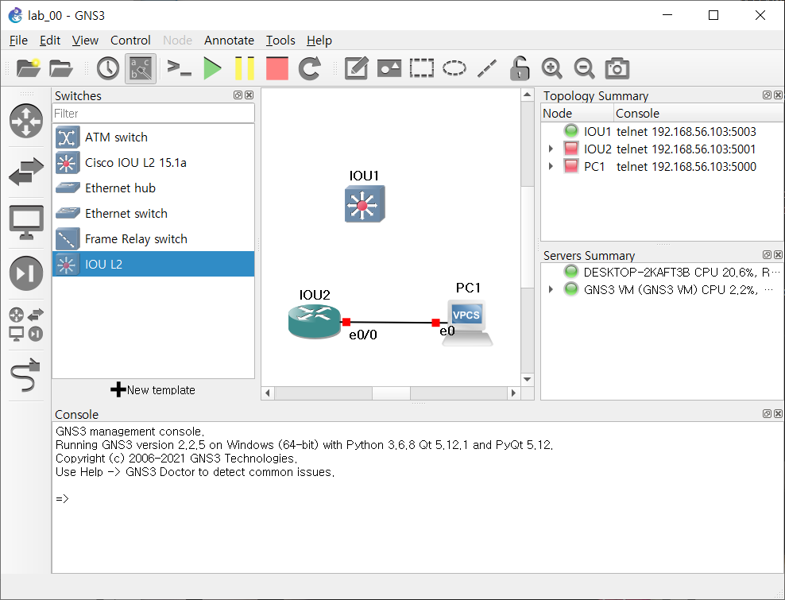

- **스위치의 각 포트들의 현재 상황 확인**
  - `switch# show interface status`
  - 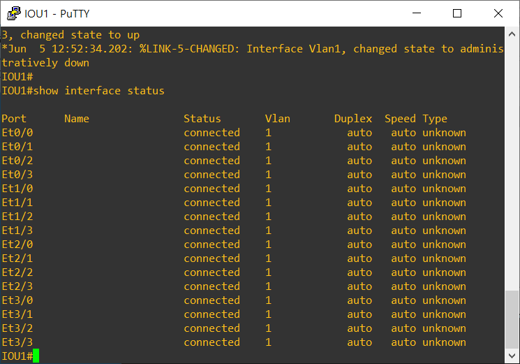

### IP 주소 세팅

- 프리빌리지드(Privileged) 모드 접속

  - `enable`
  - 처음 접속시에는 비밀번호를 묻지 않음
  - 현재 사용하는 설정에서는 이미 프리빌리지드 모드로 접속되어 있음

- 구성(configure) 모드 접속

  - `configure terminal` or `conf t`
  - 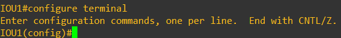

- IP 주소는 vlan1 인터페이스에서 세팅하기 때문에 vlan1 인터페이스에 접속해서 IP 세팅

  ```bash
  Switch(config)# interface vlan 1
  Switch(config-if)# ip address 192.168.100.1 255.255.255.0
  ```

  - 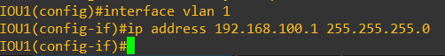

- 설정완료 종료

  ```bash
  Switch(config-if)# exit
  Switch(config)# exit
  Switch#
  ```

  - 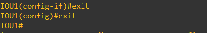

- IP 구성 확인

  - `Switch# show interface vlan 1`
  - 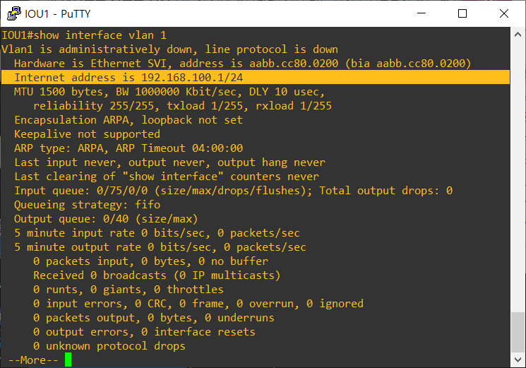

### 디폴트 게이트웨이 설정

- 디폴트 게이트웨이란 라우터의 주소

- 이 스위치가 붙어있는 라우터 인터페이스의 IP 주소가 바로 디폴트 게이트웨이

  ```sh
  Switch# configure terminal
  Switch(config)# ip default-gateway 192.168.1.1
  Switch(config)# exit
  ```

  - 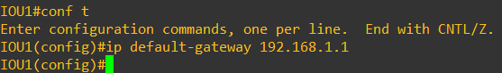

### 스위치  포트 속도와 Duplex 세팅

- 포트 속도와 Duplex 설정

  ```sh
  Switch# configure terminal
  Switch(config)# interface fastethernet 0/1
  Switch(config-if)# speed ?		// speed 옵션 확인
  Switch(config-if)# speed 10		// 10Mbps로 설정
  Switch(config-if)# duplex ?		// duplex 옵션 확인
  Switch(config-if)# duplex half	// half로 선택
  Switch(config-if)# exit
  Switch(config)# exit
  ```

  - 이유는 모르겠지만 현재 스위치에서는 speed 설정이 안되는 상태이다.
  - 추후에 다른 스위치를 설치하여 진행
  - 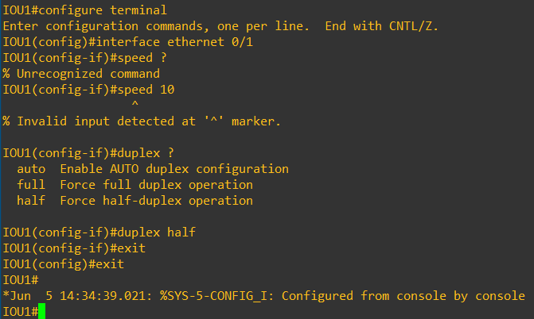

- 설정 확인
  - `Switch# show interface fastethernet 0/1`
  - 이유는 아직 모르는데 duplex 또한 설정이 안된다

### Mac Address Table

- Mac Table 확인
  - `Switch# show mac address-table`
  - 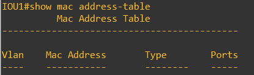

- static mac address 설정 

  ```sh
  Switch# configure terminal
  Switch(config)# mac address-table static aaaa.aaaa.aaaa vlan 1 interface ethernet 0/2
  Switch(config)# exit
  Switch# show mac address-table
  ```

  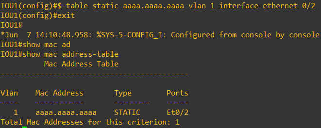


## Router와 PC ping 테스트

### 실습 구성도

​	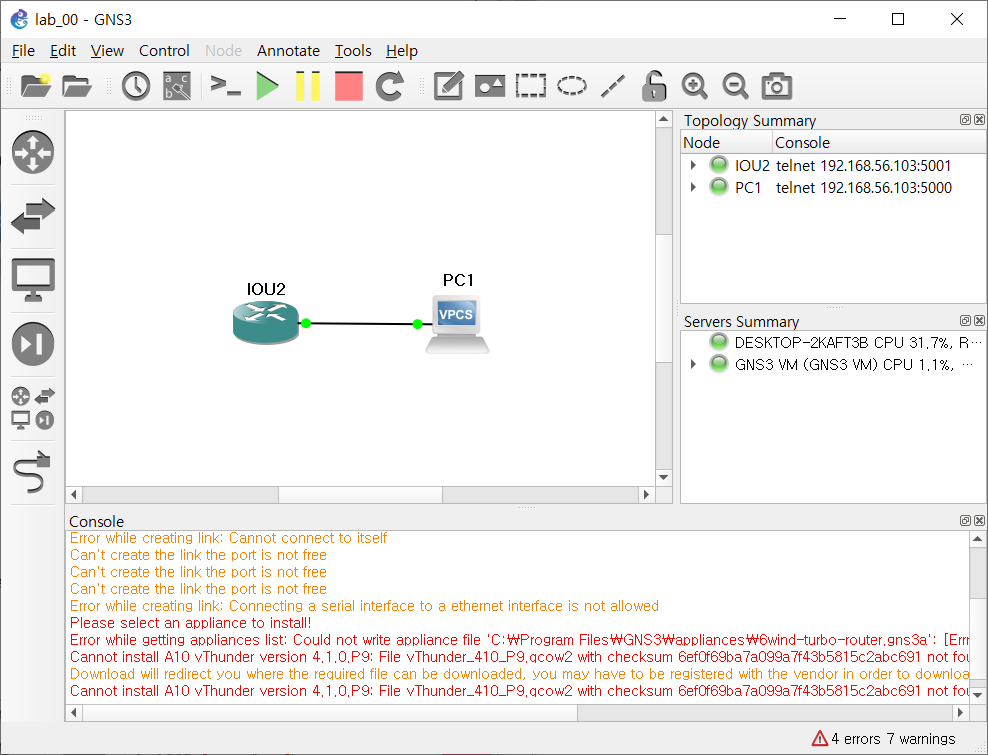
- VPCS를 생성하면 구동시킬 호스트를 로컬과 VM 둘 중 하나를 선택할 수 있는데 저는 VM으로 생성하였습니다.

  > 연결한 Interface 보이게 하기 - VIew->Show/Hide interface labels 활성화

- 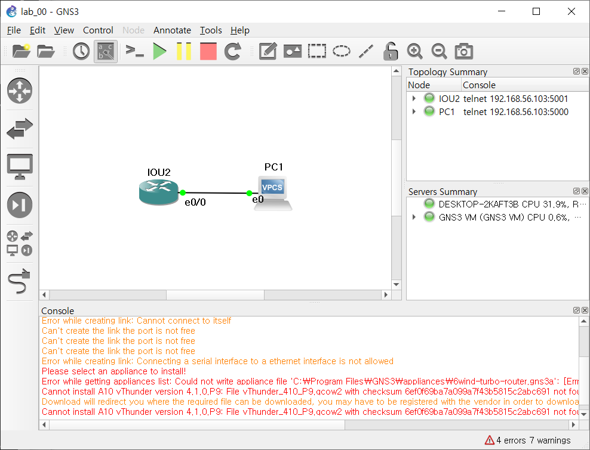

### 라우터 설정

- 라우터를 더블 클릭하거나 오른쪽 클릭 후 콘솔을 눌러 라우터 콘솔 창 진입

  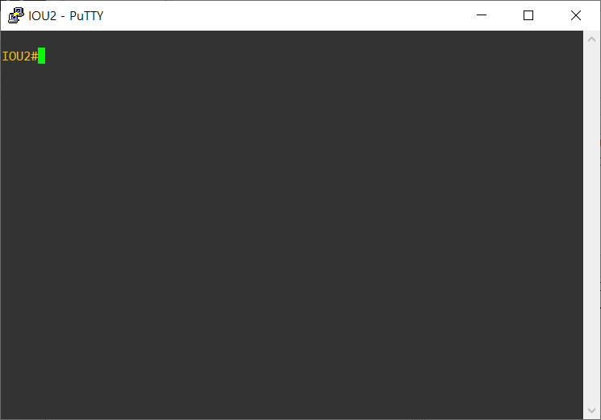

- 명령어를 이용한 라우터 설정

  ```shell
  IOU2# conf t		// configuration 진입
  IOU2(config)# int e0/0		// 장비와 연결된 인터페이스로 진입
  IOU2(config-if)# ip address 1.2.3.1 255.255.255.0		// 해당 인터페이스에 ip와 subnet mask 설정
  IOU2(config-if)# do show ip int br		// 인터페이스에 설정된 내역 확인
  ```

  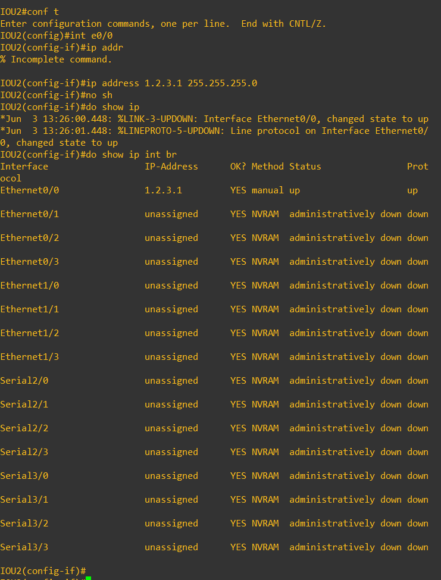

### PC 설정

- PC에 IP와 게이트웨이 설정

  ```sh
  PC1> ip 1.2.3.2/24 1.2.3.1
  PC1> show
  ```

  

  

- 라우터로 ping 전송

  `ping 1.2.3.1`

  

 
