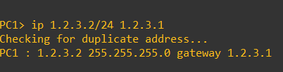
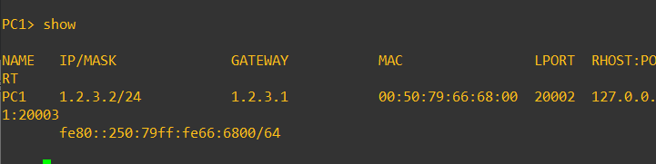

# GNS3 실습

> gns 장비를 이용하여 기본 네트워크 실습을 진행한다.

## 목차

- [Router와 PC ping 테스트](#router와-pc-ping-테스트)


## Router와 PC ping 테스트

### 실습 구성도

​	
- VPCS를 생성하면 구동시킬 호스트를 로컬과 VM 둘 중 하나를 선택할 수 있는데 저는 VM으로 생성하였습니다.

  > 연결한 Interface 보이게 하기 - VIew->Show/Hide interface labels 활성화

- 

### 라우터 설정

- 라우터를 더블 클릭하거나 오른쪽 클릭 후 콘솔을 눌러 라우터 콘솔 창 진입

  

- 명령어를 이용한 라우터 설정

  ```shell
  IOU2# conf t		// configuration 진입
  IOU2(config)# int e0/0		// 장비와 연결된 인터페이스로 진입
  IOU2(config-if)# ip address 1.2.3.1 255.255.255.0		// 해당 인터페이스에 ip와 subnet mask 설정
  IOU2(config-if)# do show ip int br		// 인터페이스에 설정된 내역 확인
  ```

  

### PC 설정

- PC에 IP와 게이트웨이 설정

  ```sh
  PC1> ip 1.2.3.2/24 1.2.3.1
  PC1> show
  ```

  

  

- 라우터로 ping 전송

  `ping 1.2.3.1`

  

