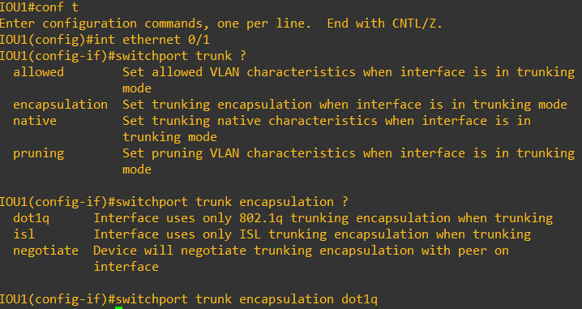
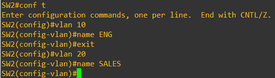

# GNS3 실습

> gns 장비를 이용하여 기본 네트워크 실습을 진행한다.

## 목차

- [스위치 기본 설정](#스위치-기본-설정)
  - [기본 설정](#기본-설정)
  - [IP 주소 세팅](#ip-주소-세팅)
  - [디폴트 게이트웨이 설정](#디폴트-게이트웨이-설정)
  - [스위치 포트 속도와 Duplex 세팅](#스위치-포트-속도와-duplex-세팅)
  - [Mac Address Table](#mac-address-table)
- [Router와 PC ping 테스트](#router와-pc-ping-테스트)
  - [실습 구성도](#실습-구성도)
  - [라우터 설정](#라우터-설정)
  - [PC 설정](#pc-설정)
- [VLAN 기본 구성](#vlan-기본-구성)
  - [VTP 설정](#vtp-설정)
  - [트렁크 포트 설정](#트렁크-포트-설정)
  - [VLAN  설정](#vlan-설정)
  - [VLAN 생성](#vlan-생성)
    - [config-vlan 모드](#config-vlan-모드)
    - [vlan configuration 모드](#vlan-configuration-모드)
  - [VLAN에 포트 배정](#vlan에-포트-배정)
- [VLAN 실습-1](#vlan-실습-1)
  - [스위치 VLAN 설정](#스위치-vlan-설정)
  - [Host IP 설정](#host-ip-설정)
  - [VLAN과 Host 연결](#vlan과-host-연결)
  - [VLAN Interface 설정](#vlan-interface-설정)
  - [연결 확인](#연결-확인)
- [VLAN 실습-2](#vlan-실습-2)
  - [스위치 설정](#스위치-설정)
  - [라우터 설정](#라우터-설정-1)
  - [Host IP 설정](#host-ip-설정-1)
  - [연결 확인](#연결-확인-1)
- [라우터 기본 명령어](#라우터-기본-명령어)
  - [라우터 설정 확인 명령어](#라우터-설정-확인-명령어)
  - [라우터 구성 명령어](#라우터-구성-명령어)
- [스태틱 라우팅 프로토콜](#스태틱-라우팅-프로토콜)
  - [스태틱 라우팅 개념 예제](#스태틱-라우팅-개념-예제)

---


## 스위치 기본 설정

### 기본 설정

- **스위치 추가**

  

- **스위치의 각 포트들의 현재 상황 확인**
  - `switch# show interface status`
  - 

### IP 주소 세팅

- 프리빌리지드(Privileged) 모드 접속

  - `enable`
  - 처음 접속시에는 비밀번호를 묻지 않음
  - 현재 사용하는 설정에서는 이미 프리빌리지드 모드로 접속되어 있음

- 구성(configure) 모드 접속

  - `configure terminal` or `conf t`
  - 

- IP 주소는 vlan1 인터페이스에서 세팅하기 때문에 vlan1 인터페이스에 접속해서 IP 세팅

  ```bash
  Switch(config)# interface vlan 1
  Switch(config-if)# ip address 192.168.100.1 255.255.255.0
  ```

  - 

- 설정완료 종료

  ```bash
  Switch(config-if)# exit
  Switch(config)# exit
  Switch#
  ```

  - 

- IP 구성 확인

  - `Switch# show interface vlan 1`
  - 

### 디폴트 게이트웨이 설정

- 디폴트 게이트웨이란 라우터의 주소

- 이 스위치가 붙어있는 라우터 인터페이스의 IP 주소가 바로 디폴트 게이트웨이

  ```sh
  Switch# configure terminal
  Switch(config)# ip default-gateway 192.168.1.1
  Switch(config)# exit
  ```

  - 

### 스위치 포트 속도와 Duplex 세팅

- 포트 속도와 Duplex 설정

  ```sh
  Switch# configure terminal
  Switch(config)# interface fastethernet 0/1
  Switch(config-if)# speed ?		// speed 옵션 확인
  Switch(config-if)# speed 10		// 10Mbps로 설정
  Switch(config-if)# duplex ?		// duplex 옵션 확인
  Switch(config-if)# duplex half	// half로 선택
  Switch(config-if)# exit
  Switch(config)# exit
  ```

  - 이유는 모르겠지만 현재 스위치에서는 speed 설정이 안되는 상태이다.
  - 추후에 다른 스위치를 설치하여 진행
  - 

- 설정 확인
  - `Switch# show interface fastethernet 0/1`
  - 이유는 아직 모르는데 duplex 또한 설정이 안된다

### Mac Address Table

- Mac Table 확인
  - `Switch# show mac address-table`
  - 

- static mac address 설정 

  ```sh
  Switch# configure terminal
  Switch(config)# mac address-table static aaaa.aaaa.aaaa vlan 1 interface ethernet 0/2
  Switch(config)# exit
  Switch# show mac address-table
  ```

  

---


## Router와 PC ping 테스트

### 실습 구성도

​	
- VPCS를 생성하면 구동시킬 호스트를 로컬과 VM 둘 중 하나를 선택할 수 있는데 저는 VM으로 생성하였습니다.

  > 연결한 Interface 보이게 하기 - VIew->Show/Hide interface labels 활성화

- 

### 라우터 설정

- 라우터를 더블 클릭하거나 오른쪽 클릭 후 콘솔을 눌러 라우터 콘솔 창 진입

  

- 명령어를 이용한 라우터 설정

  ```shell
  IOU2# conf t		// configuration 진입
  IOU2(config)# int e0/0		// 장비와 연결된 인터페이스로 진입
  IOU2(config-if)# ip address 1.2.3.1 255.255.255.0		// 해당 인터페이스에 ip와 subnet mask 설정
  IOU2(config-if)# do show ip int br		// 인터페이스에 설정된 내역 확인
  ```

  

### PC 설정

- PC에 IP와 게이트웨이 설정

  ```sh
  PC1> ip 1.2.3.2/24 1.2.3.1
  PC1> show
  ```

  

  

- 라우터로 ping 전송

  `ping 1.2.3.1`

  

---


## VLAN 기본 구성

### VTP 설정

- VTP 도메인 이름 설정

  ```sh
  Switch# configure terminal
  Switch(config)# vtp ?
  Switch(config)# vtp domain cisco
  ```
  - 

- VTP 모드 설정
  - 클라이언트는 안되고 서버 혹은 트랜스페어런트인데 서버 모드로 구성
  - `Switch(config)# vtp mode server`
  - 

- VTP 구성 확인
  - `Switch# show vtp status`
  - 

### 트렁크 포트 설정

- 트렁크 포트는 IEEEE 802.1Q 방식과 ISL 방식 존재

- 트렁크 포트 설정

  ````bash
  Switch# conf t
  Switch(config)# int ethernet 0/1
  Switch(config-if)# switchport trunk ?
  Switch(config-if)# switchport trunk encapsulation ?
  Switch(config-if)# switchport trunk encapsulation dot1q
  ````

  

- 트렁크 포트 설정 확인

  ```sh
  Switch# show interface ethernet 0/1 switchport
  Switch# show interface ethernet 0/1 trunk
  ```

  

  

### VLAN 설정

- VLAN에 대해 아무 설정을 하지 않아도 디폴트 VLAN은 이미 세팅되어 있습니다.
  - `Switch# show vlan`
  - 
- 스위치의 만들 수 있는 VLAN 개수 확인
  - `show vtp status`
  - 

### VLAN 생성

#### config-vlan 모드

- vlan 2 생성하고 이름 설정

  ```sh
  Switch# configure terminal
  Switch(config)# vlan 2		// VLAN 2생성
  Switch(config-vlan)# name CCNA	// CCNA 이름
  ```

  

- vlan 구성 확인
  - `show vlan`
  - 

- vlan 삭제
  - `no vlan 2`
  - 

#### vlan configuration 모드

- vlan 생성

  ```sh
  Switch# vlan database
  Switch(vlan)# vlan 2 name CCNA
  Switch(vlan)# exit
  ```

  

- vlan 삭제

  ```sh
  Switch# vlan database
  Switch(vlan)# no vlan 2
  Switch(vlan)# exit
  ```

  

- VTP Revision 넘버 확인
  - `show vtp status`
  - 
    - VLAN이 추가, 삭제될 때마다 하나 씩 증가하기 때문에 4
    - VTP 모드가 Transparent 모드라면 0
    - 트랜스페어런트 모드에서는 증가하지 않음

### VLAN에 포트 배정

- ethernet 0/2에 vlan 2 설정

  ```sh
  Switch# configure terminal
  Switch(config)# interface Ethernet 0/2
  Switch(config-if)# switchport access vlan 2
  ```

  

- 구성 확인

  - `show vlan`
  - 
  - vlan 2에 대한 정보 확인
    - `show vlan id 2`
    - 

- vlan 설정 취소

  ```
  Switch# configure terminal
  Switch(config)# interface Ethernet 0/2
  Switch(config-if)# no switchport access vlan 2
  ```

  

---


## VLAN 실습-1

> https://gmldbd94.tistory.com/102?category=816429의 실습 1

- 실습 구성도

  

### 스위치 VLAN 설정

- SW1

  - VLAN 10과 VLAN 20 생성

    ```sh
    SW1# conf t
    SW1(config)# vlan 10
    SW1(config-vlan)# name ENG
    SW1(config-vlan)# exit
    SW1(config)# vlan 20
    SW1(config-vlan)# name SALES
    ```

    

- SW2

  ```sh
  SW1# conf t
  SW1(config)# vlan 10
  SW1(config-vlan)# name ENG
  SW1(config-vlan)# exit
  SW1(config)# vlan 20
  SW1(config-vlan)# name SALES
  ```

  

### Host IP 설정

- PC1
  - `ip 10.10.10.1/24`
- PC2
  - `ip 10.10.10.2/24`
- PC3
  - `ip 20.20.20.1/24`
- PC4
  - `ip 20.20.20.2/24`

- PC5
  - `ip 10.10.10.3/24`
- PC6
  - `ip 20.20.20.3/24`

### VLAN Interface 설정

- SW1

  ```sh
  SW1# conf t
  SW1(config)# int e0/0
  SW1(config-if)# switchport access vlan 10
  SW1(config-if)# exit
  SW1(config)# int e0/1
  SW1(config-if)# switchport access vlan 10
  SW1(config-if)# exit
  SW1(config)# int e0/2
  SW1(config-if)# switchport access vlan 20
  SW1(config-if)# exit
  SW1(config)# int e0/3
  SW1(config-if)# switchport access vlan 20
  SW1(config-if)# exit
  SW1(config)# exit
  SW1# show vlan
  ```

  

- SW2도 동일하게 구성

  - 

- SW1과 SW2 트렁크 포트 설정

  ```sh
  SW1# conf t
  SW1(config)# vtp domain cisco
  SW1(config)# int e1/0
  SW1(config-if)# switchport trunk encapsulation dot1q
  SW2# conf t
  SW1(config)# vtp domain cisco
  SW2(config)# int e0/2
  SW2(config-if)# switchport trunk encapsulation dot1q
  ```

  

  

- 트렁크 포트 설정 확인

  - `SW1# show interface e1/0 trunk`
  - 

### 연결 확인

- 같은 스위치와 같은 VLAN을 가진 PC끼리 확인
  - PC1(VLAN 10) -> PC2(VLAN 10)
  - 

- 같은 스위치에 다른 VLAN을 가진 PC끼리 확인
  - PC1(VLAN 10) -> PC3(VLAN 20)
  - 

- 다른 스위치에 같은 VLAN을 가진 PC끼리 확인
  - PC1(VLAN 10) -> PC5(VLAN 10)
  - 

- 다른 스위치에 다른 VLAN을 가진 PC끼리 확인
  - PC1(VLAN 10) -> PC6(VLAN 20)
  - 

---


## VLAN 실습-2

> 후니의 쉽게 쓴 시스코 네트워킹 책 VLAN 실습
>
> 참고 블로그 : https://pfe2000.tistory.com/m/206?category=757141

- 실습 구성도

  

### 스위치 설정

- 스위치 관리를 위해 VLAN 1에 IP 주소를 주고 디폴트 게이트웨이 설정

  ```sh
  SW1# configure terminal
  SW1(config)# interface vlan 1
  SW1(config-if)# ip address 10.10.10.2 255.255.255.0
  SW1(config-if)# no shutdown
  SW1(config-if)# exit
  SW1(config)# ip default-gateway 10.10.10.1
  ```

- VTP 모드 트랜스페어런트로 설정

  ```sh
  SW1# configure terminal
  SW1(config)# vtp mode transparent
  SW1(config)# vtp domain cisco
  SW1(config)# exit
  SW1# show vtp status
  ```

  

- vlan 2 생성

  ```sh
  SW1# configure terminal
  SW1(config)# vlan 2
  SW1(config-vlan)# name CCNA
  ```

  

- e0/2 트렁크 포트 설정

  ```sh
  SW1# configure terminal
  SW1(config)# interface e0/2
  SW1(config-if)# switchport trunk encapsulation dot1q
  SW1(config-if)# switchport mode trunk
  ```

  

- e0/1에 VLAN 2 설정

  ```sh
  SW1# configure terminal
  SW1(config)# interface e0/1
  SW1(config-if)# switchport access vlan 2
  ```

  

### 라우터 설정

- 하나의 인터페이스에서 두 개의 인터페이스가 필요하지만 현재 1개이기 때문에 서브 인터페이스 구성

  - VLAN이 2개이기 때문

- 서브 인터페이스 설정

  ```sh
  Router# conf t
  Router(config)# interface e0/0
  Router(config-if)# no shutdown
  Router(config-if)# exit
  Router(config)# interface Ethernet 0/0.1
  Router(config-subif)# encapsulation dot1Q 1 native
  Router(config-subif)# ip address 10.10.10.1 255.255.255.0
  Router(config-subif)# exit
  Router(config)# interface Ethernet 0/0.2
  Router(config-subif)# encapsulation dot1Q 2
  Router(config-subif)# ip address 10.10.20.1 255.255.255.0
  ```

  

### Host IP 설정

- PC1
  - `ip 10.10.1.11 /24 10.10.1.1`
  - 
- PC2
  - `ip 10.10.2.11 /24 10.10.2.1`
  - 

### 연결 확인

- PC1에서 PC2
  - `ping 10.10.2.11`
  - 

- PC1에서 PC2
  - `ping 10.10.1.11`
  - 

---


## 라우터 기본 명령어

### 라우터 설정 확인 명령어

- **show version**
  - 라우터의 기본적인 내용, 소프트웨어 버전, 인터페이스 종류 등에 관한 전반적인 내용을 볼 수 있는 명령어입니다.
  - 

- **show interface**
  - 현재 라우터가 가지고 있는 모든 인터페이스를 보여주고 그 인터페이스의 현재 상황까지도 알 수 있는 명령어입니다.
  - `show interface` 인터페이스를 지정하지 않으면 모든 인터페이스 정보를 보여줍니다.
  - 
  - `show interface serial 2/0`
  - 

- **show running-configuration**
  - 라우터에서 현재 돌아가고 있는 구성 파일을 볼 수 있는 명령어입니다.
  - 짧게 `sh run`을 많이 사용합니다.
- **show processes cpu**
  - 라우터의 동작 상태를 보여주며 현재 라우터의 5분, 1분, 5초 동안의 CPU 로드가 퍼센트로 나타납니다.
  - 

### 라우터 구성 명령어

- **configuration terminal**

  - 라우터의 구성을 콘솔이나 텔넷을 이용해서 할 때 사용하는 모드입니다.
  - `conf t`로 주로 사용

- **write memory**

  - 구성 모드에서 프리빌리지드 모드로 빠져 나온 다음에 구성 파일을 저장하는 명령어입니다.

- 호스트 네임과 secret과 password 설정

  ```sh
  Router# conf t
  Router(config)# hostname Cisco-R
  Cisco-R(config)# enable secret korea
  Cisco-R(config)# enable password cisco
  ```
  

- 텔넷 라인에 대한 패스워드 세팅

  ```sh
  Cisco-R(config)# line vty 0 4	# vty는 버추얼 라인을 0번부터 4번까지 총 5개의 텔넷이 동시에 가능
  Cisco-R(config-line)# password korea	# password 설정
  Cisco-R(config-line)# login		# 로그인시 패스워드를 체크
  ```

- 인터페이스에 IP주소 설정

  ```sh
  Cisco-R(config)# interface ethernet 0/0 or int e 0/0
  Cisco-R(config-if)# no shutdown
  Cisco-R(config-if)# ip addr 172.16.92.1 255.255.0.0
  ```

  

- 인터페이스에 IPX 네트워크 번호 설정

  ```sh
  Cisco-R(config)# ipx routing
  Cisco-R(config)# int e 0/0
  Cisco-R(config-if)# ipx network 1
  ```

  

- 시리얼 인터페이스 설정

  ```sh
  Cisco-R(config)# interface serial 2/0 or int s 2/0
  Cisco-R(config-if)# no shut or no shutdown
  Cisco-R(config-if)# ip addr 152.100.10.67 255.255.0.0
  ```

  

- 라우팅 프로토콜 설정

  ```sh
  Cisco-R(config)# router eigrp 200	# IP 라우팅 프로토콜 : EIGRP, AS 번호 : 200
  Cisco-R(config-router)# network 172.16.0.0
  Cisco-R(config-router)# network 150.100.0.0
  Cisco-R(config-router)# no network 150.100.0.0		# 네트워크 설정 취소
  Cisco-R(config-router)# network 152.100.0.0
  ```

  

- 라우팅 테이블 확인
  
  - `show ip route`
  
- 구성 파일 확인
  
  - `sh run`
  
- RAM에 있는 구성 파일 NVRAM으로 전송

  ```sh
  Cisco-R# copy running-config startup-config
  or
  Cisco-R# write memory
  ```

---


## 스태틱 라우팅 프로토콜

- 스태틱 라우팅 프로토콜은 라우터 운영자가 직접 경로를 입력한 라우팅 프로토콜입니다.
- 운영자가 입력해준 경로에 문제가 생겨도 다른 길을 자동으로 찾아내지 못하고 다시 운영자가 수정해줄 때까지 기다리는 단점이 존재합니다.
  - 따라서 스태틱 라우텅 프로토콜은 갈 수 있는 경로가 하나밖에 없는 Stub 라우터용으로 많이 사용합니다.

- 스태틱 라우팅 프로토콜 명령어
  - `Router(config)# ip route network [mask] {address | interface} [distance]`
  - 지정하는 방법은 두 가지로 address를 주는 방법과 interface를 주는 방법이 있다.
    - address : 목적지 네트워크를 가기 위해서는 여기 나오는 address로 전송(1홉을 건너뛴 상대방 라우터의 주소)
    - interface : 목적지 네트워크를 가기 위해서는 여기 나오는 interface로 전송(자기 라우터의 인터페이스)

### 스태틱 라우팅 개념 예제

> 출처 : 후니의 쉽게 쓴 Cisco 네트워킹 385p 예제

- 예제 구성도

  

- 지방 사무소의 라우터에 대한 스태틱 라우팅 구성
  - 지방 사무실 라우터는 경로가 하나만 존재하는데 무조건 본사 네트워크에 접속해야 한다.
  - 따라서 라우터 A에 대한 스태틱 라우팅을 구성한다.

- 인터페이스 IP 설정

  ```sh
  Router-A# conf t
  Router-A(config)# int e 0/0
  Router-A(config-if)# no shutdwon
  Router-A(config-if)# ip addr 210.240.10.1 255.255.255.0
  Router-A(config-if)# exit
  Router-A(config)# int s 2/0
  Router-A(config-if)# ip addr 203.210.100.2 255.255.255.0
  ```

  

- 스태틱 라우팅 설정

  ```sh
  Router-A(config)# ip route 150.150.0.0 255.255.0.0 203.210.100.1
  or
  Router-A(config)# ip route 150.150.0.0 255.255.0.0 serial 2/0
  ```

  

- 설정 확인 및 저장

  - `sh run`
  - `write memory`

  > 현재 실습에서는 라우터 A만 설정했기 때문에 라우터 B에도 라우팅 프로토콜을 구성해야 두 라우터간 통신이 가능하고 해당 실습에서는 **어떻게 스태틱 라우팅을 설정하는지에 대한 간단한 실습**이다.

---


## 디폴트 라우트

- 디폴트 라우트란 경로를 찾아내지 못한 모든 네트워크들은 모두 이곳으로 가라고 미리 정해놓은 길입니다.
- 특정 목적지를 지정하지 않고 그냥 모든 목적지가 모두 디폴트로 지정한 곳으로 간다.

### 디폴트 라우트 생성 규칙

- 디폴트 라우트의 네트워크 주소는 항상 클래스를 맞추어 지정해야 한다.
  - 네트워크 주소가 C 클래스라면 203.240.10.0, B 클래스라면 150.100.10.0으로 클래스에 맞게 지정해야 한다.
- RIP에서 디폴트 네트워크를 구성하는 경우 네트워크 주소는 RIP 프로토콜이 돌고 있는 네트워크여야 한다.

### 디폴트 라우트 생성 예제

- 예제 구성도
  - 

- Router-A에 RIP 라우팅 프로토콜 설정

  ```sh
  Router-A(config)# router-ip
  Router-A(config-router)# network 150.150.0.0
  Router-A(config-router)# network 203.240.10.0
  ```

- 디폴트 라우트 생성
  - `ip default-network` 생성 방법
    - `ip default-network 203.240.10.0`
  - 스태틱 라우팅 생성 방법
    - `ip route 0.0.0.0 0.0.0.0 203.240.10.1`
  - 

- 디폴트 라우트 확인
  - `sh run`
  - 

---


## 디폴트와 스태틱 라우팅 예제

### 예제 구성도 및 구성

- 예제 구성도
  - 
- 라우터A 구성
  - 라우터 이름은 Router_A를 사용
  - Enable password는 cisco를 사용
  - 이더넷 인터페이스는 210.240.10.1 255.255.255.0 네트워크를 사용
  - 라우터 B로는 시리얼 2/0 인터페이스(203.210.100.1 255.255.255.0)을 사용하고 라우터 C로는 시리얼 2/1 인터페이스(203.210.200.1 255.255.255.0)을 사용
  - 모두 스태틱 라우팅만을 사용
  - 나머지 모든 트래픽은 디폴트로 인터넷 쪽으로 나갈 수 있도록 구성
