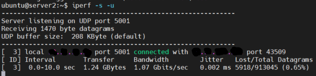
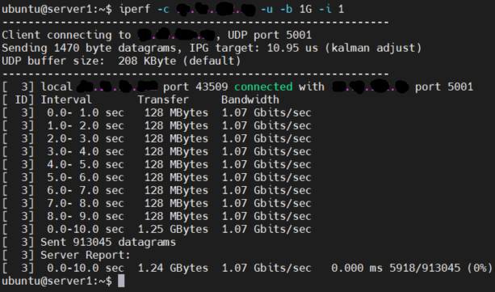
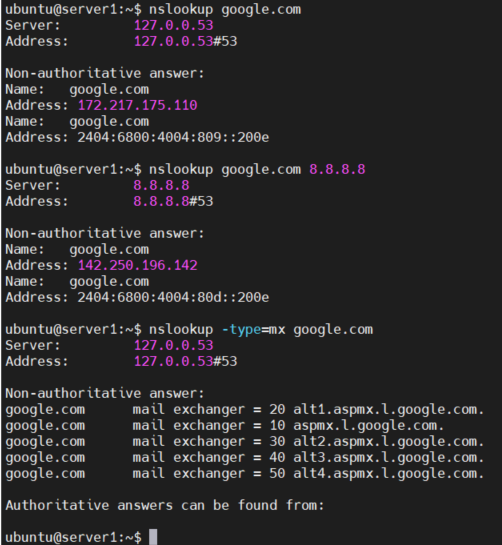

## 목차

- [ping](#ping-명령어)
- [iperf](#iperf-명령어)
- [nslookup](#nslookup-명령어)


## Ping 명령어

ping은 지정한 IP나 주소로 ICMP 프로토콜을 이용하여 패킷을 전송하고 응답을 받는 것을 이용해 네트워크의 상태를 파악하기 위해 사용하는 명령어입니다. 

가장 쉽게 네트워크의 상태를 파악할 수 있어 많이 사용되고 네트워크가 안될 시 구간 구간 별로 ping을 보내 확인이 가능합니다.

아래에서 설명하는 옵션 이외에도 다양한 옵션이 있으며 많이 사용되는 옵션을 정리한 것 입니다.


### 관련 옵션(Linux)

- c(count) 옵션
  - ping은 기본적으로 `ctrl + c`로 멈추지 않으면 계속해서 전송
  - 해당 옵션을 통해 전송할 패킷 수를 지정할 수 있음
  - `ping 8.8.8.8 -c 10` <- 8.8.8.8로 icmp 패킷을 10번 전송
- D 옵션
  - 결과 앞에 타임스탬프 출력
  - `ping 8.8.8.8 -D`
- f 옵션
  - flood mode로 빠른 속도로 패킷 전송
  - `ping 8.8.8.8 -f`
- i(interval) 옵션
  - 패킷 사이 간격 시간을 지정
  - 기본값은 1초
  - `ping 8.8.8.8 -i 0.2`
- O 옵션
  - 전송한 패킷에 대한 응답 패킷을 출력
  - 통신이 정상적이면 평소와 출력이 같지만 통신이 안될 때는 전송한 패킷 중 어디에서 오류가 발생하는지 출력
  - `ping 8.8.8.8 -O`
- R 옵션
  - 전송한 패킷의 라우터 경로를 출력
  - 최대 9개까지만 출력되고 라우터나 방화벽에서 이를 차단하면 확인 불가능
  - `ping 8.8.8.8 -R`
- s 옵션
  - 패킷 크기 설정
  - `ping 8.8.8.8 -s 58`
- h 옵션
  - ping 명령어에 대한 도움말 출력


## iperf 명령어

iperf는 클라이언트와 서버 간의 네트워크 상태를 확인할 수 있는 명령어입니다.

iperf는 ping 명령어보다 다양한 종류의 테스트 방법을 제공하기 때문에 더 다양하고 정밀한 네트워크 상태 확인이 가능합니다.

### iperf 설치(Linux)

```bash
# Ubuntu
$ sudo apt-get update
$ sudo apt-get install iperf

# CentOS
$ sudo yum update
$ sudo yum -y install iperf
```

### iperf 옵션

- h 옵션
  - iperf에 대한 도움말 출력
- u 옵션
  - UDP를 이용해 패킷을 전송
- w 옵션
  - TCP 윈도우 사이즈 변경
  - 기본값 8Kbyte
- c 옵션
  - 해당 호스트를 클라이언트 모드로 동작
- s 옵션
  - 해당 호스트를 서버 모드로 동작
- b 옵션
  - 대역폭 지정
  - 기본값은 1Mbps(ex. 1G, 1000M)
- t옵션
  - 전송 시간 지정
  - 기본값 10초
- d 옵션
  - 동시에 양방향 테스트
- P 옵션
  - 세션을 여러개 생성하여 동시에 테스트

### iperf 사용 예시

#### 서버 모드

- TCP로 서버 모드 실행
  - `iperf -s`
- 윈도우 사이즈를 100Kbyte로 설정하여 서버 모드 실행
  - `iperf -s -w 100k`
- UIDP로 서버 모드 실행
  - `iperf -s -u`
- 대역폭 1ㅎ로 설정하여 서버 모드 실행
  - `iperf -s -b 1G`



#### 클라이언트 모드

- 서버로 기본적인 테스트
  - `iperf -c <server-ip>`
- 1초 간격으로 결과값을 출력
  - `iperf -c <server-ip> -i 1`
- 윈도우 사이즈를 100Kbyte로 설정
  - `iperf -c <server-ip> -w 100k`
- 대역폭을 1G로 설정
  - `iperf -c <server-ip> -b 1G`
- 동시에 5개의 세션을 만들어 테스트
  - `iperf -c <server-ip> -P 5`
- 서버와 클라이언트 동시에 양방향 테스트
  - `iperf -c <server-ip> -d`




## nslookup 명령어

nslookup 명령어는 name server에 등록되어 있는 도메인을 조회할 수 있는 명령어입니다.

DNS 서버에 질의하여 도메인의 정보를 조회해 ip 정보나 nameserver 등을 확인할 수 있습니다.

또한 DNS 서버와의 연결이 제대로 되어 있는지 확인이 가능합니다.

### 사용 예제

- 기본적인 도메인의 ip 정보 조회

  - `nslookup naver.com`

- 특정 네임서버를 지정하여 ip 정보 조회

  - `nslookup naver.com 8.8.8.8`

- type 옵션

  ```bash
  $ nslookup -type=mx naver.com
  $ nslookup -type=txt naver.com
  $ nslookup -type=ns naver.com
  ```

- 프롬포트 질의

  - 다른 옵션없이 `nslookup`만 입력하면 프롬포트로 들어가게 됩니다.

  - 프롬포트에 진입하여 똑같이 정보를 조회할 수 있습니다.

    ```bash
    $ nslookup     # 프롬포트 진입
    google.com     # google.com ip 조회
    server ns.lgtelecom.com   # 디폴트 네임서버 ns.lgtelecom.com으로 변경 후 질의
    set type=ns     # ns 레코드 질의
    set type=txt    # txt 레코드 질의
    set type=all    # 전체 type 질의
    ```


