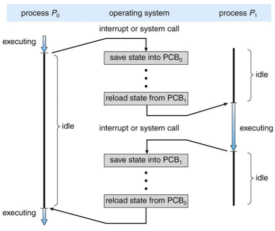
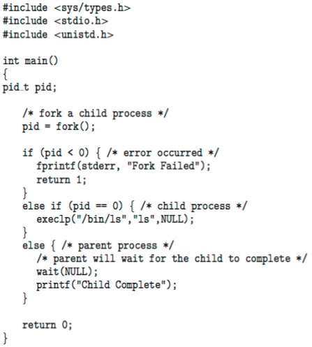
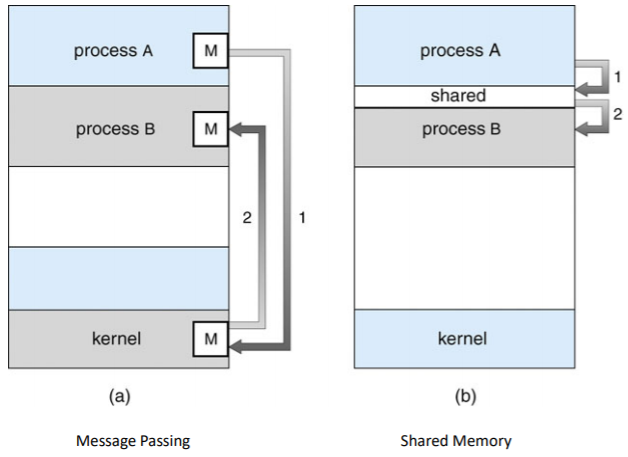
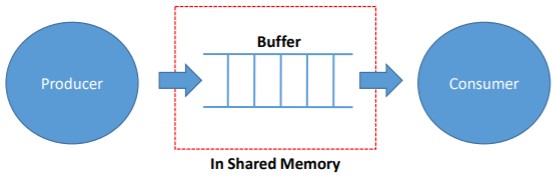
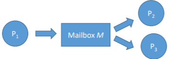
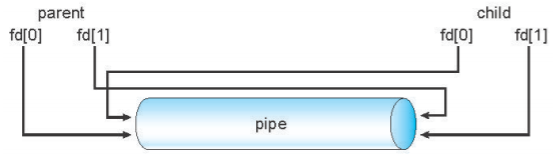

# Process Concept

- 프로세스
  - 실행중인 프로그램
    - 프로세스 실행은 순차적으로 진행
  - 프로세스에 포함되는 것
    - 텍스트 섹션
    - 프로그램 카운터
    - 스택
    - 데이터 섹션
    - 힙
  - 현대 시간 공유 시스템의 작업 단위
- 프로세스의 종류
  - I/O 바운드 프로세스
    - 계산보다 I/O에 더 많은 시간을 소비
  - CPU 바운드 프로세스
    - 계산에 더 많은 시간을 소비

## Process State

- new : 프로세스가 처음 생성
- ready : 프로세서에게 할당되기를 기다릴 때
- running - 프로세서에 할당되어 실행될 때
- waiting - 실행 중 작업이 완료되어 기다릴 때
- terminated - 프로세스가 실행을 마침

## Process Control Block(PCB)

- 각자의 프로세스는 자신의 정보 묶음인 PCB를 가짐
- PCB에 담긴 정보
  - 프로세스 상태
  - 프로그램 카운터: 다음에 실행할 명령어의 위치
  - CPU 레지스터: 모든 프로세스 중심 레지스터의 내용
  - CPU 스케줄링 정보
  - 메모리 관리 정보
  - 회계 정보(Accounting Information)
  - I/O 상태 정보
- PCB는 프로세스마다 다룰 수 있는 모든 정보의 저장소 역할

### CPU Switch

- 프로세스가 실행되다가 인터럽트가 발생해 운영체제가 개입하여 프로세서에 할당된 프로세스를 바꿈

- CPU 스위치를 할 때는 프로세스의 PCB를 백업

  

## Threads

- 프로세스를 쪼개 하나의 프로세스안에서 동시에 여러 작업을 처리

## Process Scheduling

- 어떤 프로세스를 프로세서에 할당할 것인가 결정하는 일
- CPU 사용 극대화, 시간 공유를 위해 CPU 로 신속하게 프로세스 전환
- 프로세스 스케줄러가 CPU에서 다음 실행을 위해 사용가능한 프로세스 중 선택
- 프로세스의 유지 관리 일정 대기열
  - Job Queue : 시스템 내 모든 프로세스 세트
  - Ready Queue : 메인 메모리에 상주하고, 실행 준비 및 대기 중인 모든 프로세스 세트
  - Device Queues : I/O 기기를 기다리는 프로세스 세트
- 다양한 대기열 간에 프로세스가 마이그레이션됨

## Scheduler

- Short-term Scheduler (or CPU Scheduler)
  - 다음에 실행할 프로세스를 선택하고 CPU를 할당
  - Short-term Scheduler 자주 호출(milliseconds) -> 빠르게 호출해야 함
- Long-term Scheduler (or Job Scheduler)
  - Ready queue로 가져와야 할 프로세스 선택
  - Long-term Scheduler가 간헐적으로 호출(초, 분) -> 느릴 수 있음
  - Long-term Scheduler가 멀티 프로그래밍의 정도를 제어
- 프로세스는 다음과 같이 설명
  - I/O 바인딩 프로세스 : 컴퓨팅보다 I/O를 수행하는데 더 많은 시간을 소비하며, 많은 짧은 CPU 버스트
  - CPU 바인딩 프로세스 : 컴퓨팅을 수행하는데 더 많은 시간을 소비하며 매우 긴 CPU 버스트는 거의 없음
- Long-term Scheduler가 원할한 프로세스 혼합을 위해 노력

### Addition of Medium-term Scheduling

- Multiple programming의 정도를 줄이기 위해 Medium-term Scheduler를 추가
  - 메모리에서 프로세스를 제거하고 디스크에 저장하고 디스크에서 다시 가져와 실행을 계속 : Swapping

## Context Switch

- 프로세스 실행 중에 인터럽트가 발생해 운영체제가 프로세서에 할당된 프로세스를 바꾸는 것
- 시스템은 작업중이던 프로세스의 상태를 저장하고 새로운 프로세스의 상태를 로드
- 컨텍스트는 내 시스템에서 활용가능한 모니터링된 정보들을 의미
- 프로세서 입장에서 컨텍스트는 PCB이기 때문에 PCB 정보가 바뀌는 것은 컨택스트 스위치임
- 컨텍스트 스위치는 오버헤드가 발생하는 작업이기 때문에 자주 일어나면 성능을 저하
  - OS와 PCB가 복잡할수록 컨텍스트 스위치가 길어짐
- 일부 하드웨어는 CPU당 여러 레지스터 집합을 제공 -> 한번에 여러 컨텍스트를 로드

## Process Creation

- 프로세스는 트리 구조로 되어있어 부모 프로세스가 자식 프로세스를 만듬

- PCB에 저장된 pid값으로 프로세스를 식별
  
  - pid는 운영체제가 정해준 고유번호
  
- 자원 공유 모드
  - 부모와 자녀가 모든 자원을 공유
  - 자녀는 부모 자원의 일부를 공유
  - 부모와 자녀가 자원을 공유하지 않음
  
- 실행모드
  - 부모와 자녀가 동시에 실행
  - 부모는 자녀가 종료될 때까지 대기
  
- 어드레스 스페이스 모드(Address Space Modes)
  - 자녀는 부모의 복제품
  - 자녀가 새 프로그램을 로드
  
- 프로세스 생성은 플라나리아 번식과 유사

- 관련 함수
  - fork() : 부모 프로세스는 자신과 똑같은 자식 프로세스를 생성
  - exec() - 자식 프로세스의 내용을 모두 바꿈
  
- fork()는 부모 프로세스에겐 자식 프로세스의 pid를 자식 프로세스에겐 0을 반환

- 부모 프로세스와 자식 프로세스는 동시에 작동

  

## Process Termination

- exit()를 호출하여 프로세스를 종료시킬 수 있음
- 부모 프로세스가 자식 프로세스보다 먼저 종료되면 자식프로세스는 그 상위 프로세스를 부모 프로세스로 바라봄
- 자식 프로세스가 종료되었는데, 부모 프로세스가 정보를 회수하지 않으면 자식 프로세스는 종료되었음에도 정보가 메모리에 남아 좀비 프로세스가 됨

## Inter-Process Communication(IPC)

- 프로세스는 독립적으로 동작하거나 서로 협력하며 동작할 수 있음

- 협력하는 프로세스들은 통신하며 서로에게 영향을 끼침

- 프로세스 협력 사유
  - 정보 공유
  - 연산 속도 향상
  - 모듈화
  - 편의성
  - 협력 프로세스 필요
  
- IPC 모델에는 메시지 패싱(Message Passing)과 공유 메모리(Shared Memory)가 존재

  

### Producer-Consumer Problem

- 생산자(Producer) : 정보를 생산하는 프로세스
- 소비자(Consumer) : 정보를 소비하는 프로세스
- 생산자-소비자 문제는 두 프로세스가 동시에 동작할 때 발생하는 이슈
- 보통 정보가 생산되는 속도가 소비하는 속도보다 빨리 동기화 문제가 발생
- 이를 해결하기 위해 생산된 데이터를 담아두는 버퍼를 사용
  - 유한 버퍼(Bounded buffer) : 크기에 한계가 있는 버퍼
  - 무한 버퍼(Unbounded buffer) : 버퍼의 시작과 끝을 붙여 크기가 무한한 버퍼

### Shared Memory

- 공유 메모리는 게시판

- 특정 메모리 공간을 두 프로세스가 함께 사용하며 정보를 주고 받음

- 커널을 거치지 않아 속도가 빠르지만 메모리에 동시 접근하는 것을 방지하기 위해 프로그래머가 따로 구현을 해줘야 함

- 생산자 및 소비자 프로세스가 Shared Memory 영역에서 항목의 버퍼(바운딩 또는 언바운딩)를 유지하는 방법

  

### Message Passing

- 메시지 패싱은 우편
- 송신 프로세스가 정보를 받는 수신 프로세스에게 커널을 통해 정보를 전달하고 수신 프로세스도 커널에 접근해 정보를 수신
- 메시지 패싱은 컨텍스트 스위치가 발생해 속도가 느리지만 커널이 기본적인 기능을 제공해 공유 메모리 방식보다 구현이 쉬움

### Implementaion Questions

- 링크는 어떻게 설정됩니까?
- 링크를 3개 이상의 프로세스로 연결할 수 있습니까?
- 각 통신 프로세스 쌍 사이에 몇 개의 링크가 있을 수 있는가?
- 링크의 용량은 얼마입니까?
- 링크가 수용할 수 있는 메시지의 크기가 고정 또는 가변적인가?
- 링크는 단방향인지 양방향인지

### Direct Communication

- 프로세스 상호간에 명시적으로 이름을 지정해야 함
  - Send(P, message) : 프로세스 P로 메시지 전송
  - Receive(Q, message) : 프로세스 Q로부터 메시지 수신
- 통신연결의 속성
  - 링크가 자동으로 설정됨
  - 정확히 하나의 통신 프로세스 쌍과 링크가 연결
  - 각 쌍 사이에 정확히 하나의 링크
  - 링크는 단방향 또는 양방향으로 할 수 있음

### Indirect Communication

- 우편함(mailboxes(또는 port))에서 메시지를 지시하고 수신
  - 각 메일박스마다 고유 ID가 있음
  - 메일박스를 공유해야만 프로세스가 통신할 수 있음
  
- 통신연결의 속성
  - 프로세스가 공통 메일함을 공유하는 경우에만 연계 설정
  - 여러 프로세스와 연계할 수 있음
  - 각 프로세스 쌍이 여러 통신 링크를 공유할 수 있음
  - 링크는 단방향 또는 양방향으로 할 수 있음
  
- 운영
  - 새 메일박스 생성
  - 메일박스를 통한 메시지 송수신
  - 메일박스 삭제
  
- 원형을 다음과 같이 정의
  - Send(M, message) : 메일박스 M으로 보내기
  - Receive(M, message) : 메일박스 M에서 메시지 수신
  
- Mailbox sharing

  - P1, P2 and P3 share a mailbox M

  - P1 sends : P2 and P3 receive

  - Question : Who gets the message?

    

- Solutions
  - 링크를 최대 2개의 프로세스 연결
  - 한번에 하나의 프로세스만 수신 작업을 실행할 수 있도록 함
  - 시스템이 receiver를 임의로 선택할 수 있도록 함. sender에게 receiver가 누구였는지를 통지

### Synchronization

- 메시지 패싱의 동기화 문제를 해결하기 위해 blocking 방식과 Non-blocking 방식을 사용
- Blocking은 Synchronous로 간주
  - Blocking send : 수신자가 메시지를 받을 때까지 송신자는 block
  - Blocking receive : 메시지를 수신할 때까지 수신자 block
- Non-Blocking은 asynchronous로 간주
  - Non-blocking send : 송신자가 메시지를 보내고 계속 작업
  - Non-blocking receive : 수신자가 유효한 메시지나 Null메시지를 받음

### Buffering

- 링크에 첨부된 메시지 큐
  - 용량 제로(Zero capacity): 0 메시지
    - 송신자는 수신자를 기다려야 함(rendezvous)
  - 경계 용량(Bounded capacity): 한정된 길이의 n 메시지
    - 전송자는 대기열이 가득 찬 경우 대기해야 함
  - 무한 확장가능한 용량(Unbounded Capacity): 무한 확장
    - 송신자는 기다리지 않음

## Communications in Client-Server Systems

- Sockets
- Remote Procedure Call
- Pipes

## Sockets

- 소켓은 서버와 클라이언트가 통신하는 방식

- 소켓은 통신의 끝점으로 정의

- IP 주소와 포트정보가 있으면 클라이언트는 네트워크를 통해 서버 프로세스에 접근 가능

- RPC(Remote Procedure Calls)는 프로세스와 프로세스가 네트워크로 이어져 있을 때 발생하는 호출
  - 서버와 클라이언트가 통신할 때 IP주소와 포트를 래핑해 Stub를 만들어 전송

## Remote Proceduer Call

- RPC가 네트워크 시스템의 프로세스 간 프로시저 호출을 추상화
- Stub
  - 서버의 실제 절차에 대한 클라이언트 측 프록시
  - 클라이언트측 스텁에서 서버를 찾고 파라미터를 마샬링(Marshalls)
  - 서버측 스텁은 메시지를 수신하고, 마샬링된 파라미터의 포장을 풀고, 서버에서 절차를 수행
  - 윈도우즈의 경우 MIDL(Microsoft Interface Definition Language)로 작성된 사양에서 스텁 코드 컴파일
- Marshalling parameters

## Pipes

- 파이프는 부모 프로세스와 자식 프로세스가 통신할 때 사용하는 방식
- 파이프는 단방향 통신만 가능하기 때문에 양방향으로 통신하려면 두 개의 파이프 필요
- 파이프에 이름을 붙인 named pipe를 사용하면 부모-자식 관계가 아니여도 통신 가능
- 파이프는 두 가지 프로세스가 소통할 수 있는 통로 역할
- 파이프 구현시 이슈
  - 단방향(Unidirectional) vs 양방향(Bi-directional)
  - 반이중(Half duplex) vs 전이중(Full duplex)
  - 모든 관계(Any relationship)
  - 네트워크 시스템(Among networked system) vs 같은 기계(on the same machine)
- 파이프의 두 종류
  - Ordinary Pipes
  - Named Pipes

### Ordinary Pipes

- 표준 생산자 소비자 방식(standard producerconsumer fashion)으로 두 가지 프로세스가 소통
  
  - 생산자는 파이프의 한쪽 끝에 쓰고, 소비자는 다른 한쪽 끝에서 읽음
- 단방향(Unidirectional)
- 통신과정이 종료되고 나면 일반 파이프의 존립이 중단
- 생성 프로세스 외부에서 접근할 수 없음
  
  - 전형적인 부모 프로세스가 파이프를 만들어 fork()를 통해 생성한 자식 프로세스와 통신하는데 사용
  
  

### Named Pipes

- 양방향(Bidirectional)
- 부모-자식 관계 불필요
- 하나의 Named pipe가 설치되면 여러 프로세스가 이를 사용해 소통할 수 있음
- 통신 프로세스가 완료된 후에도 Named pipes가 계속 존재

#### Pipe와 Message Passing의 차이점

- Bit stream (Pipe) vs. Structured message (Message Passing)

##### Reference

- https://parksb.github.io/article/7.html
- Provided by Operating Systems Concepts, 10th Edition

