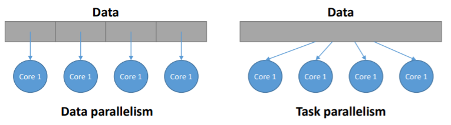
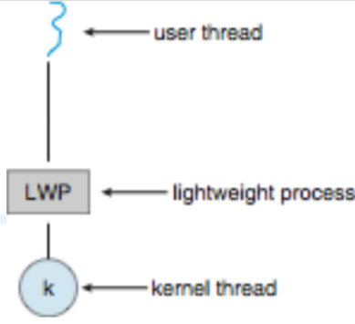

# 04. Multithreaded Programming

## Threads

- 스레드는 프로세스의 작업 흐름. CPU 사용의 기본 단위
- 스레드 ID, 프로그램 카운터, 레지스터 세트 그리고 스택으로 구성
- 같은 프로세스에 속한 다른 스레드와 리소스 공유
  - 코드 섹션, 데이터 섹션, 기타 운영체제 리소스
- 싱글스레드(Single thread) – 하나의 프로세스가 한 번에 하나의 작업만 수행
- 멀티스레드(Multi thread) – 하나의 프로세스가 동시에 여러 작업을 수행
- 멀티프로그래밍 시스템이니까 프로세스를 여러 개 돌려도 되는데 스레드를 나누는 이유
  - 두 프로세스가 하나의 데이터를 공유하려면 메시지 패싱이나 공유 메모리 또는 파이프를 사용해야 하는데, 효율도 떨어지고 구현, 관리하기 번거로움
  - 프로세스 사이 컨텍스트 스위치가 계속 일어나면 성능 저하가 발생. 스레드 전환에도 컨텍스트 스위치가 일어나지만 속도가 빠름
- Motivation
  - 대부분의 최신 응용 프로그램은 다중 스레드
  - 응용 프로그램의 여러 작업을 별도의 스레드로 구현
    - 디스플레이 업데이트, 데이터 가져오기, 맞춤법 검사, ...
  - 프로세스 생성은 무겁고 스레드 생성은 가벼움
  - 코드 단순화 및 효율성 증대
  - 커널은 일반적으로 다중 스레드


## Multithreaded Server Architecture

- 서버와 클라이언트 사이에도 멀티스레드를 구현하여 사용
- 클라이언트가 서버에 요청을 보내면 서버는 새로운 스레드를 하나 생성해 요청을 수행
- 프로세스를 생성하는 것보다 스레드를 새엇앟는 것이 더 빠르기 때문


## Multithreaded Process


### Benefit

- 대응성(Responsiveness)
  - 프로세스의 일부가 차단되도 계속 실행될 수 있음
- 자원 공유(Resource Sharing)
  - 스레드는 공유 메모리 또는 메시지 패싱보다 쉽게 프로세스 리소스를 공유
- 경제(Economy)
  - 프로세스 생성보다 저렴하고 스레드 전환은 컨텍스트 전환보다 오버헤드가 낮음
- 확장성(Scalability)
  - 프로세스는 다중 프로세서 아키텍처를 활용


## Multicore Programming

- 멀티코어 또는 멀티프로세서 시스템을 구현할 때는 동시성(Concurrency)와 병렬성(Parallelism)을 알아야함
- 동시성
  - 싱글 프로세서 시스템에서 사용되는 방식으로 프로세서가 여러 개의 스레드를 번갈아가며 수행함으로써 동시에 실행되는 것처럼 보이게 하는 방식
- 병렬성
  - 멀티코어 시스템에서 사용되는 방식으로 여러 개의 코어가 각 스레드를 동시에 수행하는 방식

### Types of parallelism

- 데이터 병렬 처리(Data paralleism)
  - 동일한 데이터의 하위 집합을 여러 코어에 분산하고 각 코어에서 동일한 작업을 수행
- 작업 병렬 처리(Task parallelism)
  - 각 스레드가 고유한 작업을 수행하는 코어에 스레드를 분산




### User Threads and Kernel Threads

- 유저 스레드는 사용자 수준의 스레드 라이브러리가 관리하는 스레드
- 스레드 라이브러리
  - POSIX, Pthreads, Win 32 threads, Java threads
- 커널 스레드는 커널이 지원하는 스레드
  - 운영체제에서 직접 관리 및 지원
  - 안정적이지만 유저 모드에서 커널 모드로 계속 바꿔줘야하기 때문에 성능이 저하
  - Windows XP/2000, Solaris, Linux, Mac OS X
- 유저 스레드를 사용하면 안정성은 떨어지지만 성능이 저하되지는 않음


## Multithreading Models

- 유저 스레드와 커널 스레드의 관계를 설계하는 여러 모델


### Many-to-One Model

- 하나의 커널 스레드에 여러 스레드를 연결하는 모델
- 한 번에 하나의 유저 스레드만 커널에 접근 가능
- 멀티코어 시스템에서 병렬적인 수행 불가. 잘 사용되지 않음
- Examples
  - Solaris Green Threads
  - GNU Portable Threads


### One-to-One Model

- 하나의 유저 스레드에 하나의 커널 스레드가 대응하는 모델
- 동시성을 높여주고, 멀티프로세서 시스템에서는 동시에 여러 스레드를 수행할 수 있음
  - 하지만 유저 스레드가 늘어난만큼 커널 스레드도 늘어나는데, 커널 스레드를 생성하는 것은 오버헤드가 큰 작업이라 성능 저하가 발생할 수 있음
- Many-to-One보다 많은 동시성
- Examples
  - Windows
  - Linux
  - Solaris 9 이상


### Many-to-Many Model

- 여러 유저 스레드에 더 적거나 같은 수의 커널 스레드가 대응하는 모델
- 운영체제는 충분한 수의 커널 스레드를 만들 수 있으며, 커널 스레드의 개수는 프로그램이나 작동기기에 따라 다름
- 멀티프로세서 시스템에서는 싱글 프로세서 시스템보다 더 많은 커널 스레드가 생성
- Examples
  - Solaris 9 이전 버전
  - ThreadFiber패키지가 있는 WIndows


### Two-level Model

- Many-to-Many 모델과 비슷한데, 특정 유저 스레드를 위한 커널 스레드를 따로 제공
- 점유율이 높아야되는 유저 스레드를 더 빠르게 처리 가능
- Examples
  - IRIX
  - HP-UX
  - Tru64 UNIX
  - Solaris 8 이하


## Thread Library

- 스레드 라이브러리는 프로그래머에게 스레드 생성 및 관리를 위한 API를 제공
- 두 가지 주요 구현 방법
  - 라이브러리 전체가 사용자 공간에 있음
  - 운영체젱에서 지원하는 커널 수준 라이브러리
- Examples
  - Pthread
    - 스레드 생성 및 동기화를 위한 POSIX 표준(IEEE 1003.1c)
    - API는 스레드 라이브러리 동작을 지정하며 구현은 라이브러리 개발에 달려 있음
    - 사용자 수준 또는 커널 수준 중 하나
  - Java Thread
    - JVM에서 관리
    - 일반적으로 기본 운영체제에서 제공하는 스레드 모델을 사용하여 구현


## Threading Issues

- fork() 및 exec() 시스템 호출의 의미
- 대상 스레드의 스레드 취소
  - 비동기 또는 지연
- 신호 처리(Signal handling)
- 스레드 풀(Thread Pools)
- 스레드 별 데이터(Thread-specific data)
- 스케줄러 활성화(Scheduler Activation)
- Many-to-Many and Two-level models


### Semantics of fork() & exec() system calls

- fork()는 호출하는 스레드만 복제합니까, 아니면 모든 스레드를 복제합니까?
  - 일부 UNIX에는 둑가지 버전의 fork가 존재
- exec()는 일반적으로 정상적으로 작동
  - 모든스레드를 포함한 실행중인 프로세스 교체


### Signal Handling

- signal은 UNIX 시스템에서 특정 이벤트가 발생했음을 프로세스에게 알리기위해 사용
- 시그널 핸들러를 사용하여 시그널 처리
  1. 특정 이벤트에 의해 신호 발생
  2. 신호가 프로세스로 전달
  3. 신호는 두 신호 핸들러 중 하나에 의해 처리
     1. 기본
     2. 사용자 정의
- 모든 신호에는 커널이 신호를 처리할 때 실행하는 기본 핸들러가 있음
  - 사용자 정의 신호 처리기는 기본값을 무시할 수 있음
  - 단일 스레드의 경우 프로세스에 전달되는 신호
- 멀티 스레드를 위한 신호는 어디로 전달되어야 하는가?
  - 신호가 적용되는 스레드로 신호 전달
  - 프로세스의 모든 스레드에 신호 전달
  - 프로세스의 특정 스레드에 신호 전달
  - 특정 스레드를 할당하여 프로세스에 대한 모든 신호를 수신


### Thread Pools

- 스레드를 요청할 때마다 매번 새로운 스레드를 생성, 수행, 삭제를 반복하면 성능 저하
- 그래서 미리 스레드 풀에 여러 개의 스레드를 만들어두고 요청이 오면 스레드 풀에서 스레드를 할당해주는 방법을 사용


### Thread Cancellation

- 스레드가 끝나기 전에 종료

- 취소할 스레드는 대상 스레드

- 두가지 일반적인 접근 방식

  - 비동기 취소는 대상 스레드를 즉시 종료
  - 지연된 취소는 대상 스레드가 취소해야하는지 주기적으로 확인

- 스레드 생성 및 취소를 위한 Pthread 코드

  ```c
  pthread.t tid;
  
  /* create the thread */
  pthread.create(&tid, 0, worker, NULL);
  ...
  /* cancel the thread */
  pthread.cancel(tid);
  ```

- 스레드 취소를 호출하면 취소를 요청하지만 실제 취소는 스레드 상태에 따라 다름

- 스레드에 취소가 비활성화된 경우 스레드가 활성화될 때까지 취소가 보류

- 기본 유형은 연기

  - 취소는 스레드가 취소 지점에 도달했을 때만 발생
    - 즉, pthread_testcancel()
    - 그런 다음 cleanup handler가 호출

- Linux 시스템에서 스레드 취소는 신호를 통해 처리


### Thread-Local Storage

- TLS를 사용하면 각 스레드가 자체 데이터 사본을 가짐
- 스레드 생성 프로세스를 제어할 수 없을 때 유용(즉, 스레드 풀을 사용할 때).
- 지역변수와 다름
  - 단일 함수 호출 중에만 보이는 지역 변수
  - 함수 호출시 TLS 표시
- 정적 데이터와 유사
- TLS는 각 스레드마다 고유


### Scheduler Activations

- 다대다 및 2레벨 모델 모두 애플리케이션에 할당된 적절한 수의 커널 스레드를 유지하기 위해 통신이 필요
- 일반적으로 사용자와 커널스레드 사이에 중간 데이터 구조 사용 - 경량 프로세스(LWP)
  - 프로세스가 사용자 스레드를 실행하도록 예약할 수 있는 가상 프로세서로 나타남
  - 커널 스레드에 연결된 각 LWP
  - 생성할 LWP는 몇개입니까?
- 스케줄러 활성화는 상향 호출(upcalls)을 제공
  - 커널에서 스레드 라이브러리의 상향 호출 핸들러로의 통신 메커니즘
- 이 통신을 위해 애플리케이션은 올바른 수의 커널 스레드를 유지할 수 있음




##### Reference

- https://parksb.github.io/article/8.html
- Provided by Operating Systems Concepts, 10th Edition