# CPU Scheduling

## Basic Concepts

- 멀티 프로그래밍은 CPU 활용도를 최대로
  - 멀티 프로그래밍은 작업(코드 & 데이터)을 구성하므로 CPU는 항상 실행 가능
- CPU-I/O Burst Cycle
  - 프로세스 실행은 CPU 실행과 I/O wait 주기로 구성
  - CPU 버스트에 이어 I/O 버스트
  - CPU 버스트 분포가 주요 관심사

## CPU Scheduler

- 메모리에서 실행할 준비가 된 프로세스 중 하나를 선택하고 CPU를 할당(a.k.a short-term scheduler)

- CPU 스케줄링 프로세스 과정

  1. 실행에서 대기 상태로 전환(예:I/O 요청)

  2. 실행에서 준비 상태로 전환(예: 인터럽트)
  3. 대기에서 준비로 전환(예: I/O 완료)
  4. 종료
     - 1과 4 의 스케줄링은 비선점적(nonpreemptive)
     - 2와 3은 선점적(preemptive)또는 협력적(cooperative)
       - 공유 데이터에 대한 엑세스 고려
       - 커널 모드에서 선점 고려
       - 중요한 OS 활동 중에 발생하는 인터럽트 고려

## Preemptive vs Nonpreemptive

- 비선점 스케줄링에서 CPU가 프로세스에 할당되면 프로세스는 종료하거나 대기 상태로 전환하여 CPU를 해제할 때까지 CPU를 유지
- 특정 H/W 플랫폼에서 사용할 수 있는 유일한 방법은 선점 스케줄링
  - 선점 스케줄링에 필요한 특수 H/W(예: 타이머) 필요
- 선점적 스케줄링은 공유 데이터에 대한 엑세스와 관련된 비용을 발생시킴
  - 세심한 조정없이는 데이터 불일치가 발생할 수 있음

## Dispatcher

- 운영체제가 프로세스를 프로세서에 할당하는 것을 디스패처(Dispatcher)라고 함
- Dispatcher 모듈은 CPU 스케줄러가 선택한 프로세스에 CPU를 제어
  - 컨텍스트 전환(Switching context)
  - 사용자 모드로 전환(Switching to user mode)
  - 프로그램을 다시 시작하기 위해 사용자 프로그램의 적절한 위치로 점프
- Dispatch latency
  - 디스패처가 한 프로세스를 중지하고 다른 프로세스를 시작하는데 걸리는 시간

## Scheduling Criteria

- 운영체제가 레디 큐에 있는 프로세스들 중에서 어떤 프로세스를 디스패치할 것인가 정하는 것이 프로세스 스케줄링
- 대표적인 스케줄링 알고리즘
  - FCFS, SJF, SRF, RR, Multilevel Queue Scheduling, Multilevel Feedback Queue Scheduling
- 알고리즘 평가
  - 수행시간(Burst Time)
  - CPU 사용량(CPU Utilization)
    - CPU를 가능한 한 바쁘게 유지
  - 단위 시간 당 끝마친 프로세스의 수(Throughput)
    - 시간 단위당 실행을 완료한 프로세스 수
  - 프로세스가 레디 큐에서 대기한 시간부터 작업을 완료할 때까지 걸린 시간(Turnaround time)
  - 레디 큐에서 대기한 시간(Waiting Time)
  - 프로세스가 처음으로 CPU를 할당받기까지 걸린시간(Response Time)
- CPU 사용률 및 처리량을 최대화하고 처리시간, 대기시간 및 응답시간을 최소화
- 평균보다 최소 및 최대값 최적화
- 응답시간의 분산 최소화(대화형 시스템)

## FCFS(First-Come, First-Served)

- 먼저 들어온 프로세스를 먼저 프로세서에 할당하는 방식
- 구현이 쉬워서 간단한 시스템에 자주 사용됨
- 수행시간이 큰 프로세스가 먼저 들어오면 그 뒤에 들어온 프로세스들이 오랜시간을 기다리게 되는 콘보이 효과(Convoy Effect)가 발생
- 비선점 스케줄링 방식
- FCFS 정책에 따른 평균 대기시간은 최소가 아니며 프로세스 CPU 버스트 시간의 순서가 달라짐에 따라 크게 달라질 수 있음
- Convoy Effect
  - 더 짧은 프로세스가 먼저 진행될 경우 가능할 수 있는 CPU 및 장치 사용률을 낮춤

## SJF(Shortest Job First) Scheduling

- 프로세스의 수행시간이 짧은 순서에 따라 프로세서에 할당
  - 프로세스의 다음 CPU 버스트가 동일하면 FCFS 스케줄링이 사용
- 콘보이 효과를 해결할 수 있음
- 최적 알고리즘이지만 수행시간을 정확히 알 수 없음
  - 주어진 프로세스 세트에 대해 최소 평균 대기 시간을 제공
  - 다음 CPU 요청의 길이를 아는게 어려움
    - 과거 히스토리를 기반으로 예측
      - 이전 CPU 버스트 측정된 길이의 지수 평균
      - 국소 선형 회귀 기법(Local linear regression technique)
    - 사용자 지정 값
- 버스트 시간이 큰 프로세스는 계속 뒤로 밀려나는 기아(Starvation)이 발생
- 비선점 스케줄링 방식

## SRF(Shortest Remaining Time First) Scheduling

- 프로세스의 남은 수행시간이 짧은 순서에 따라 프로세서에 할당
- SJF에 발생하는 기아 문제를 해결할 수 있음
- 수행 중 다른 프로세스보다 남은 수행시간이 적어지면 운영체제가 개입해 자리를 바꾸는 선점 스케줄링 방식

## Priority Scheduling

- 특정 기준으로 프로세스에게 우선순위를 부여해 우선순위에 따라 프로세서에 할당
  - 동일 우선 순위 프로세스는 FCFS 순서로 예약
  - 우선 순위는 내부 또는 외부에서 정의
- SJF는 우선순위가 다음 CPU 버스트 예측인 우선 순위 스케줄링
- 프로세스를 에이징(Aging)해서 오래 대기한 프로세스의 우선순위를 높이는 방식으로 사용
- 다른 스케줄링 알고리즘과 결합해 사용할 수 있어 선점, 비선점 모두 가능
- Problem
  - 높은 우선 순위 프로세스가 지속적으로 들어오면 낮은 우선 순위 프로세스가 CPU를 얻지 못할 수 있음
    - 무기한 차단(Indefinite Blocking) or 기아(Starvation)
  - 기아는 aging으로 해결
    - 시스템에서 오랫동안 대기하는 프로세스의 우선순위를 점차 증가

## RR(Round Robin) Scheduling

- 각 프로세스는 보통 10~100ms의 적은 수의 CPU 시간(시간 양자)을 얻음. 이 시간이 경과하면 프로세스가 선점되고 준비 대기열 끝에 추가
- 일정 시간 할당량(Time Quantum) 단위로 여러 프로세스를 번갈아가며 프로세서에 할당
- 시스템의 time-sharing과 같은 방식
- 반응성이 좋음
- 우선순위 스케줄링과 결합해 프로세스의 시간 할당량을 조절하는 방식으로 활용
- 시간 할당량에 따라 운영체제가 계속 개입하는 선점 스케줄링 방식
- 레디 큐에 n개의 프로세스가 있고 시간 퀀텀이 q이면 각 프로세스는 한번에 최대 q개의 시간단위 청크(chunk)에서 CPU 시간의 1/n을 얻음
  
  - (n-1)*q 시간 단위 이상 대기하는 프로세스 없음
- RR의 성능은 시간 퀀텀(q)의 크기에 따라 다름
  - q가 매우 크면 FCFS
  
  - q가 매우 작으면 프로세스 공유(1/n 속도로 실행하는 효과)
  
  - q는 컨텍스트 전환시간 보다 커야함
  
    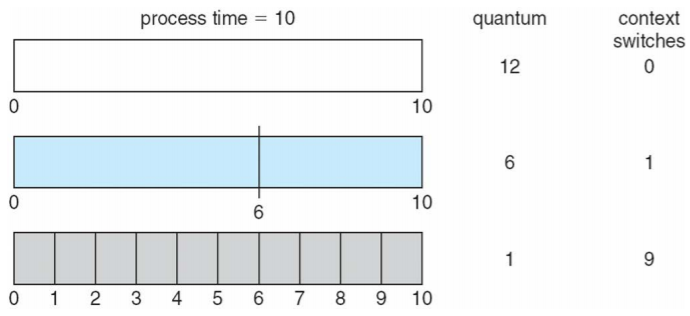
- 처리시간(Turnaround)은 타임퀀텀의 크기에 따라 달라짐
  
  - 대부분의 프로세스가 다음 CPU 버스트를 단일 시간 퀀텀으로 완료하면 평균 처리 시간이 향상될 수 있음
  
    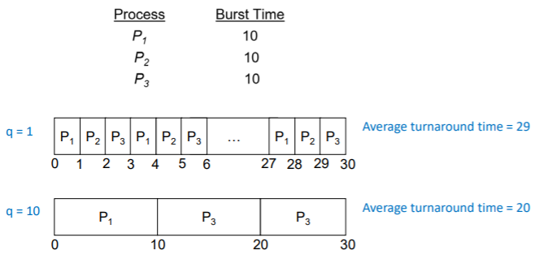
- 경험 법칙(A rule of thumb)
  
  - CPU 버스트의 80%는 시간 퀀텀보다 짧아야함

## Multilevel Queue Scheduling

- 레디 큐는 별도의 대기열로 분할
  - foreground(대화형: interactive)
  - background(batch)
- 주어진 대기열에서 영구적으로 처리
- 각 대기열에는 자체 스케줄링 알고리즘 있음
  - foreground - RR
  - background - FCFS
- 스케줄링은 대기열간에 이루어져야 함
  - 고정 우선 순위 스케줄링(Fixed Priority Scheduling)
    - 즉 foreground에서 모두 게재한 다음 background에서 게재
    - 기아(Starvation)의 가능성
  - 타임 슬라이스(Time Slice)
    - 각 큐는 프로세스간에 일정을 잡을 수 있는 일정량의 CPU시간을 얻음
      - RR의 foreground에 대해 80%
      - FCFS의 background에 20%

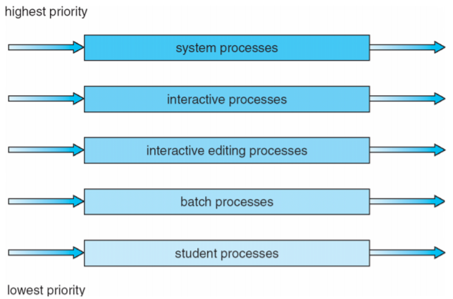

## Multilevel Feedback Queue Scheduling

- 프로세스는 다양한 대기열 사이를 이동할 수 있음
- 이러한 형태의 aging은 starvation을 에방

- Multilevel Feedback Queue Scheduling은 다음 매개변수를  정의
  - 대기열 수
  - 대기열 별 스케줄링 알고리즘
  - 프로세스 업그레이드 시기에 사용되는 방법
  - 프로세스 강등시기에 사용되는 방법
  - 서비스가 필요할 때 프로세스가 들어갈 대기열을 결정하는데 사용되는 방법
- Example
  - Tree queues
    - Q0 - RR with time quantum 8ms
    - Q1 - RR with time quantum 16ms
    - Q2 - FCFS
  - Scheduling
    - 스케줄러는 먼저 Q0의 모든 프로세스를 실행
    - Q0가 비어있을 때만 Q1의 프로세스가 실행
    - Q2의 프로세스는 Q0와 Q1이 비어있는 경우에만 실행
    - 1분기에 도착한 프로세스는 2분기에 프로세스를 선점
    - 마찬가지로 Q1의 프로세스는 Q0에 도착하는 프로세스에 의해 차례로 선점

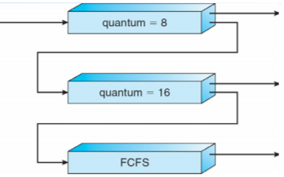

## Thread Scheduling

- 사용자 수준 스레드와 커널 수준 스레드 구분
- 스레드가 지원되면 프로세스가 아닌 스레드가 scheduled
- 다대일 및 다대다 모델, 스레드 라이브러리는 LWP에서 실행할 사용자 수준 스레드를 schedules
  - 일정 경쟁이 프로세스 내에 있기 때문에 PCS(프로세스 경쟁 범위)라고 함
  - 일반적으로 프로그래머가 설정한 우선순위를 통해 수행
- 사용가능한 CPU에 스케줄된 커널 스레드는 시스템 경합 범위(SCS:system-contention scope) - 시스템의 모든 스레드 간의 경쟁

## Multi-Processor Scheduling

- 여러 CPU를 사용할 수 있는 경우 CPU 스케줄링이 더 복잡해짐
- 멀티 프로세서 내의 동종 프로세서(Homogeneous processors)
- 비대칭 다중처리(Asymmetric Multiprocessing) 
  - 단 하나의 프로세서만 시스템 데이터 구조에 액세스하여 데이터 공유의 필요성을 완화

- SMP(Symmetric Multiprocessing)
  - 각 프로세서는 자체 스케줄링, 모든 프로세스는 공통 레디 큐에 있거나 각 프로세서에는 자체 레디 프로세스의 개인 레디 큐가 있음
    - 현재 가장 일반적
- 프로세서 선호도(Processor affinity)
  - 프로세스는 현재 실행중인 프로세서에 대한 선호도를 가짐
    - soft affinity
    - hard affinity
    - 프로세서 세트를 포함한 변형

## Multi-Processor Scheduling - Load Balancing

- SMP인 경우 효율성을 위해 모든 CPU를 로드상태로 유지해야 함
- 로드 밸런싱을 통해 작업 부하를 균등하게 분산
- Push migration
  - 주기적인 작업은 각 프로세서의 부하를 확인하고 발견되면 작업을 과부하된 CPU에서 다른 CPU로 푸시
- Pull migration
  - idle 프로세서가 바쁜 프로세서에서 대기중인 작업을 가져옴

## Multicore Processors

- 동일한 물리적 칩에 여러 개의 프로세서 코어를 배치하는 최근 추세
- 더 빠르고 적은 전력 소모
- 코어 당 여러 스레드도 증가
  - 메모리 스톨(stall)을 이용하여 메모리 검색이 발생하는 동안 다른 스레드에서 진행

## Multithreaded Multicore System

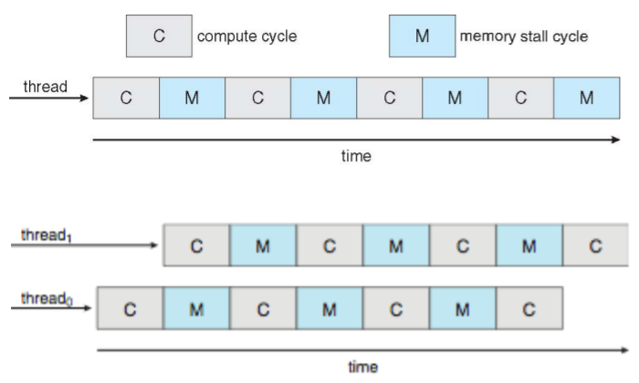

## Real-Time CPU Scheduling

- 명백한 challenges을 제시할 수 있음
- 소프트 실시간 시스템(Soft Real-Time Systems)
  - 중요한 실시간 프로세스가 언제 스케줄될지 보장하지 않음
- 하드 실시간 시스템(Hard Real-Time Systems)
  - 작업은 마감일까지 서비스를 받아야 함
- 두 가지 유형의 지연 시간이 성능에 영향을 미침
  1. Interrupt latency
     - 인터럽트 도착부터 서비스가 인터럽트하는 루틴 시작까지의 시간
  2. Dispatch latency
     - 스케줄링이 현재 프로세스를 CPU에서 제거하고 다른 프로세스로 전환하는데 걸리는 시간

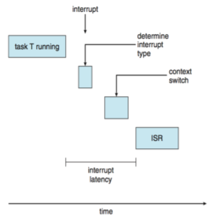

- 디스패치 지연의 충돌 단계
  1. 커널 모드에서 실행되는 모든 프로세스의 선점
  2. 우선순위가 높은 프로세스에 필요한 자원의 낮은 우선 순위 프로세스에 의해 릴리즈

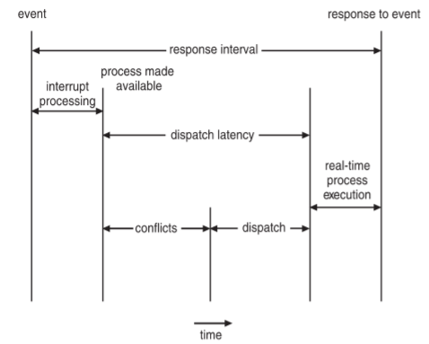

## Priority-Based Scheduling

- 실시간 스케줄링을 위해 스케줄러는 선점적 우선 순위 기반 스케줄링을 지원해야 함
  - 그러나 소프트 실시간만 보장
- 하드 리얼 타임의 경우 마감일을 맞추는 능력도 제공해야 함
- 프로세스에는 새로운 특성이 있음 : 주기적인 프로세스에는 일정한 간격으로 CPU가 필요
  - 처리 시간 t, 기한 d, 기간 p
  - 0 <= t <= d <= p
  - 주기적인 작업 비율은 1/p

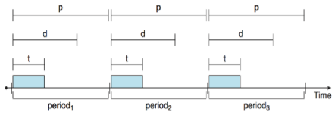

## Rate Monotonic Scheduling

- 주기의 역수를 기준으로 우선순위를 부여

- 짧은 기간(Shorter Periods) = 더 높은 우선 순위

- 더 긴 기간(Longer Periods) = 낮은 우선순위

- P1은 P2보다 우선 순위가 높음

  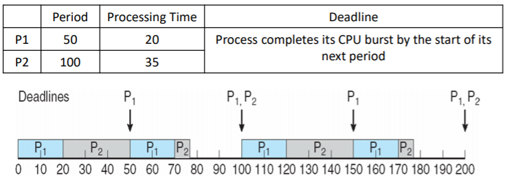

- Missed deadline with Rate Monotonic Scheduling

  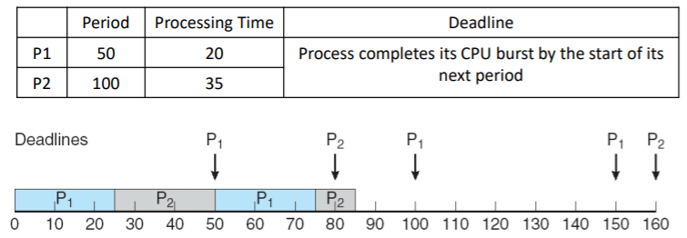

## Earliest Deadline First Scheduling(EDF)

- 마감일에 따른 우선순위 지정
  - 마감일이 빠를수록 우선순위가 높음
  - 마감일이 늦을수록 우선순위가 낮음
  
  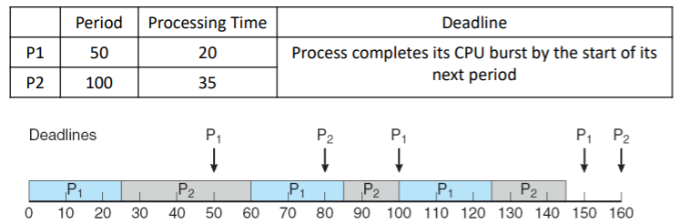

##### Reference

- https://parksb.github.io/article/9.html
- Provided by Operating Systems Concepts, 10th Edition