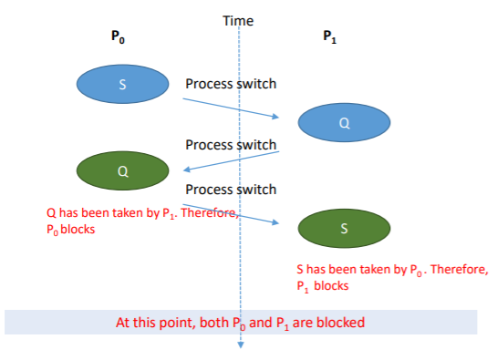
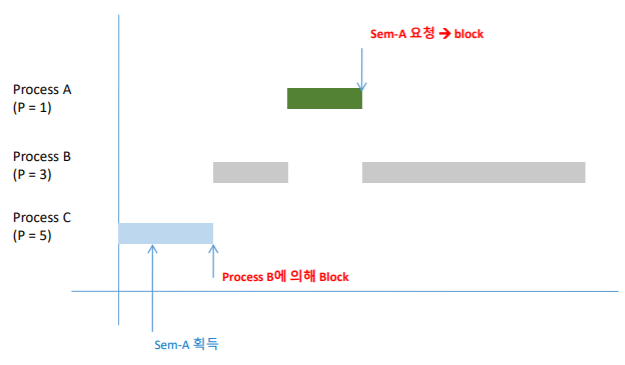
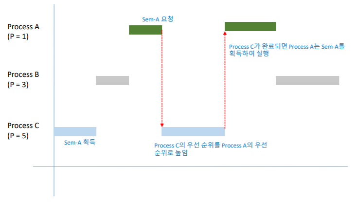
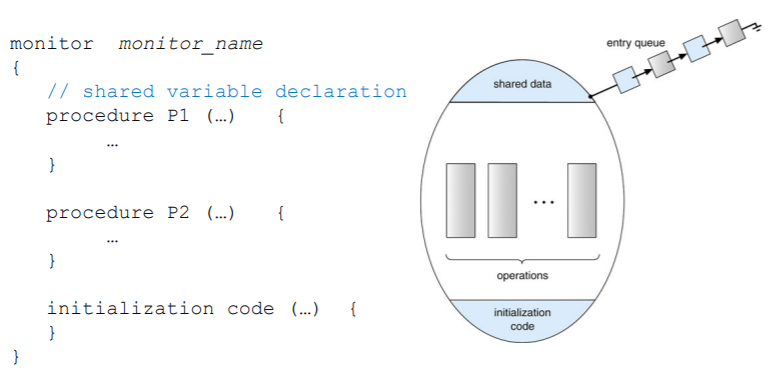
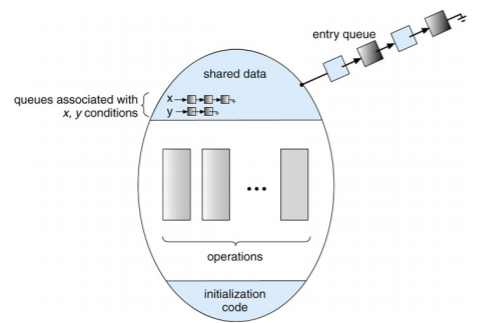

# Process Synchronization

## Background

- Machine Instruction

  - 개별 프로세서는 '0'과 '1'로 구성된 자체 기계 명령을 실행

- Assembly Language

  - 사람이 읽을 수 있는 형태의 기계 명령어
    - i.e, MOVE R3, ADD R1, R2, ...
  - 각 어셈블리 언어 명령이 하나의 기계 명령으로 바뀜

- High-Level Languages

  - C와 같은 고급 언어의 컴파일러가 대부분의 명령어는 MULTIPLE 기계 명령어가 됨

- 프로세스 동시 실행 가능

  - 언제든지 중단될 수 있으며 부분적으로 실행 완료

- 공유 데이터에 대한 동시 액세스는 데이터 불일치를 초래할 수 있음

  - 데이터 일관성을 유지하려면 협력 프로세스의 질서 정연한 실행을 보장하는 메커니즘이 필요

- Producer-Consumer 문제 재검토

  - 이전에 버퍼의(BUFFER_SIZE - 1) 항목을 활용하는 알고리즘을 봄
  - 버퍼에 있는 모든 항목(e.g., BUFFER_SIZE items)을 사용하기 위해 변수 카운터를 사용하여 버퍼의 항목을 추적

  ```c
  Producer
  while (TRUE) {
  	/* produce an item in nextProduced */
  	while (counter == BUFFER_SIZE);
  	buffer[i] = nextProduced;
  	in = (in + 1) % BUFFER_SIZE;
  	counter++;
  	/* register1 = counter
  	register1 = register1+1;
  	counter = register1 */
  }
  ```

  ```c
  Consumer
  while (TRUE) {
  	while (counter == BUFFER_SIZE) ;
  	nextCOnsumed = buffer[out];
  	out = (out + 1) % BUFFER_SIZE;
  	counter--;
  	/* register2 = counter
  	register2 = register2 - 1
  	counter = register2 */
  	/* consume the item in nextConsumed */
  }
  ```

- counter = 5로 인터리빙하는 실행 고려

  - T0 : **Producer executes** register1 = counter [r1 = 5]
  - T1 : **Producer executes** register1 = register1+1 [r1 = 6]
  - T2 : **Consumer executes** register2 = counter [r2 = 5]
  - T3 : **Consumer executes** register2 = register2-1 [r2 = 4]
  - T4 : **Producer executes** counter = register1 [counter = 6]
  - T5 : **Consumer executes** counter = register2 [counter = 4]

- 위와 같은 상황에서 여러 프로세스가 동시에 동일한 데이터에 액세스하고 조작하고 실해 결과가 액세스가 발생하는 특정 순서에 따라 달라지는 상황을 **race condition**이라고 함


## Critical-Section Problem

- 코드상에서 경쟁 조건이 발생할 수 있는 특정 부분을 **critical section**

  - 프로세스가 공통 변수 변경, 테이블 업데이트, 파일쓰기 등을 수행할 수 있는 코드 세그먼트

    ```c
    Producer
    while (TRUE) {
    	/* produce an item in nextProduced */
    	while (counter == BUFFER_SIZE);
    	buffer[i] = nextProduced;
    	in = (in + 1) % BUFFER_SIZE;
    	counter++; // Critical Section
    }
    ```

  - Critical Sections에는 동시에 두개의 프로세스가 실행되면 안됨

- Critical-Section 문제에 대한 솔루션은 다음 요구사항을 충족해야 함

  - Mutual exclusion
    - 이미 한 프로세스가 critical section에서 작업 중이면 다른 프로세스는 진입하면 안됨
  - Progress
    - critical section에서 작업중인 프로세스가 없으면 다른 프로세스가 진입할 수 있어야함
    - 또한 프로세스가 중요 섹션에 들어가고자 하면 무기한으로 기다리면 안됨
  - Bounded waiting
    - critical section에 진입하려는 프로세스가 무한하게 대기하면 안됨
    - 프로세스가 critical section에 들어가려고 요청한 후 해당 요청이 승인되기 전에 다른 프로세스가 중요 섹션에 들어갈 수 있는 횟수를 제한
    - N 프로세스의 상대 속도에 대한 가정 없ㅇ므

- Non-preemptive kernels로 구현하면 임계 영역 문제가 발생하지 않음

  - 하지만 비선점 스케줄링은 반응성이 떨어져 잘 사용하지 않음


## Peterson's Solution

- 임계 영역 문제에 대한 고전적인 소프트웨어 기반 솔루션

- LOAD / STORE 명령어가 atomic하다고 가정

  - 즉 중단할 수 없음

- Two process solution

  - 두 프로세스가 두 변수를 공유
    - `int turn` : Critical Section에 들어갈 차례를 나타냄
    - `boolean flag[2]` : `flag[i]`는 프로세스  Pi가 임계 섹션에 들어갈 준비가 되었는지 여부를 나타내는데 사용

  ```c
  do {
  	flag[i] = TRUE;
  	turn = j;
  	while (flag[j] = TRUE && turn == j);
  	/* critical section */
  	flag[i] = FALSE;
  	/* remainder section */
  } while (TRUE)
  ```

  ```c
  do {
  	flag[j] = TRUE;
  	turn = i;
  	while (flag[i] = TRUE && turn == i);
  	/* critical section */
  	flag[j] = FALSE;
  	/* remainder section */
  } while (TRUE)
  ```


## Synchronization Hardware

- 많은 시스템이 중요 섹션 코드에 대한 하드웨어 지원을 제공

- 단일 프로세서 - 인터럽트를 비활성화할 수 있음

  - 현재 실행중인 코드는 선점없이 실행
  - 일반적으로 다중 프로세서 시스템에서는 비효율적
    - 광범위하게 확장할 수 없는 운영체제

- lock을 사용해 critical section 문제 해결

  ```c
  do {
  	Acquire lock
  		critical section
  	Release lock
  		remainder section
  } while (TRUE);
  ```

- 최신 기계는 특별한 하드웨어 지침을 제공

  - Atomic - 무중단
  - TestAndSet() 명령어
  - Swap() 명령어

- TestAndSet 명령어

  ```c
  boolean TestAndSet (boolean *target) {
  	boolean rv = *target;
  	*target = true;
  	return rv;
  }
  ```

- Solution using TestAndSet

  ```c
  do {
  	while (TestAndSet(&lock));
  	// critical section
  	lock = false;
  	// reminder section
  } while (true)
  ```

- compare_and_swap  명령어

  ```c
  int compare_and_swap(int *value, int expected, int new_value) {
  	int temp = *value;
  	
  	if (*value == expected)
  		*value = new_value;
  	return temp;
  }
  ```

- Solution using Swap

  ```c
  do {
  	while (compare_and_swap(&lock, 0, 1) != 0)
  		; /* do nothing */
  	//critical section
  	lock = 0;
  	// reminder section
  } while (true);
  ```

```c
do {
	waiting[i] = true;
	key = true;
	while (waiting[i] && key)
		key = test_and_set(&lock)
	waiting[i] = false;
	/* critical section */
	j = (i + 1) % n;
	while ((j != i) && !waiting[j])
		j = (j + 1) % n;
	if  (j == i)
		lock = false;
	else
		waiting[j] = false;
	/* remainder section */
} while (true);
```


## Mutex Locks

- Mutex locks는 여러 스레드가 공통 리소스에 접근하는 것을 제어하는 기법

- lock이 하나만 존재할 수 있는 locking 매커니즘을 따름

- 이미 하나의 스레드가 critical section에서 작업중인 lock 상태면 다른 스레드들은 critical section에 진입할 수 없도록 함

- 이전 솔루션은 복잡하고 일반적으로 응용 프로그램 프로그래머가 접근할 수 없음

- OS 디자이너는 임계 영역 문제를 해결하기 위해 소프트웨어 도구를 구축

- 가장 간단한 방법은 Mutex Locks

- 먼저 lock을 acquire()한 다음 release()하여 임계 영역 보호

  - 잠금 사용 가능 여부를 나타내는 변수

- acquire() 및 release() 호출은 atomic해야 함

  - 일반적으로 하드웨어 atomic 지침을 통해 구현

- 하지만 이 솔루션은 busy waiting이 필요

  - 이러한 잠금을 spinlock이라고 함

  ```c
  acquire() {
  	while (!available)
  		; /* busy wait */
  	available = false;
  }
  
  release() {
  	available = true
  }
  
  do {
  	acquire lock
  		critical section
  	release lock
  		remainder section
  } while (true);
  ```


## Semaphore

- 세마포어는 여러 개의 프로세스나 스레드가 critical section에 진입할 수 있는 locking 매커니즘

- 세마포어는 카운터를 이용해 동시에 리소스에 접근할 수 있는 프로세스를 제한

- 한 프로세스가 값을 변경할 때 다른 프로세스가 동시에 값을 변경하지 못함

- 세마포어 S : 두가지 표준 원자 연산을 통해서만 접근하는 정수 변수

  - 프로세스가 활동을 동기화하는데 보다 정교한 방법(Mutex lock보다)을 제공하는 동기화 도구

  ```c
  wait (S) {
  	while S <= 0;
  	S--;
  }
  
  signam (S) {
  	S++;
  }
  ```

- 세마포어 유형

  - 이진 세마포어(0..1)
    - Mutex lock과 동일
  - 카운팅 세마포어(0..N)

- 세마포어 사용 예제

  - Critical-Section Problem

    ```c
    do {
    	wait(mutex)
    		critical section
    	signal(mutex)
    		remainder section
    } while(TRUE);
    ```

  - Process synchronication

    ```c
    P1:
    S1;
    signal(sync)
    
    P2:
    wait(sync)
    S2;
    ```

    - sync가 0으로 초기화되면 P1이 signal(sync)를 호출한 후에만 P2가 S2를 실행


### Semaphore Implementation

- Busy waiting

  - 프로세스가 임계 섹션에 있는 동안 임계 섹션에 진입하려는 다른 프로세스는 진입 코드에서 계속 반복되어야 함
    - 구현 코드가 짧음
    - 임계 섹션이 거의 점유되지 않을 경우 대기하느라 바쁘지 않음

- Block & Wakeup

  - 각 세마포어는 관련 대기열이 있음

  - 대기열의 각 항목에는 다음의 2가지 데이터 항목이 있음

    - value(of type integer)
    - list의 다음 레코드에 대한 포인터

  - Two Operations

    - block : 작업을 호출하는 프로세스를 적절한 대기열에 배치
    - wakeup : 대기열에 있는 프로세스 중 하나를 제거하고 대기열에 넣음

    ```c
    typedef struct{
    	int value;
    	struct process *list;
    } semaphore;
    ```

  - block & wakeup 구현

    ```c
    wait (semaphore * S) {
    	S->value--;
    	if (S->value < 0) {
    		add this process to S->list;
    		block();
    	}
    }
    
    signal (semaphore *S) {
    	S->value++;
    	if (S->value <= 0) {
    		remove a process P from S->list;
    		wakeup(P);
    	}
    }
    ```


## Semaphore Problems

- Deadlock

  - 두 개 이상의 프로세스가 대기 프로세스 중 하나에서만 발생할 수 있는 이벤트를 기다림

  - 두 프로세스가 리소스를 점유하고 놓아주지 않거나, 어떠한 프로세스도 리소스를 점유하지 못하는 상태가 되어 프로그램이 멈추는 현상

    ```c
    P0:
    wait(S);
    wait(Q);
    ...
    signal(S);
    signal(Q);
    
    P1:
    wait(Q);
    wiat(S);
    ...
    signal(Q);
    signal(S);
    ```

- Starvation

  - 무한 차단(Indefinite blocking) : 세마포어 대기열에 프로세스가 suspend되어 있는 상태에서는 절대 프로세스를 제거할 수 없음
    - LIFO 순서대로 대기열에서 프로세스를 제거하는 방법

  

- Priority Inversion

  - 우선 순위가 낮은 프로세스가 우선순위가 높은 프로세스에 필요한 lock을 보유하는 경우의 스케줄링 문제

  

- Priority Inheritance Protocol(우선 순위 계승)

  - 특정 Process가 우선 순위가 높은 Process에서 요구하는 자원을 가지고 있을때 Process의 우선 순위를 자원을 요구하는 Process의 우선 순위로 높여주는 기법
  - 규칙
    - 자원이 사용중이면 Process는 Block됨
    - 자원이 사용 가능하면 Process는 자원을 소유
    - 우선순위가 높은 Process가 같은 자원을 요청하면 기존 Process의 우선순위는 자원을 요청한 Process의 우선순위로 높아짐
    - Process가 자원을 반환하면 원래의 우선순위로 돌아옴

  

## Monitor

- 세마포어를 잘못 사용하면 감지하기 어려운 타이밍 오류가 발생할 수 있음

  - signal(mutex) ... wait(mutex)
  - wait(mutex) ... wait(mutex)
  - wait(mutex) 또는 signal(mutex)(또는 둘다) 생략

- Monitor

  - 프로세스 동기화를 위한 편리하고 효과적인 메커니즘을 제공하는 고급 추상 데이터 유형
    - 모니터 내에서 상호 배제를 제공하는 프로그래머 정의 작업 집합을 제공

  


## Condition variables

- condition variable의 두 연산자

  - x.wait()
    - 작업을 호출하는 프로세스는 x.signal()까지 일시 중단
  - x.signal()
    - x.wait()를 호출하는 프로세스 중 하나(있는 경우)를 재개
      - 변수에 x.wait()가 없으면 변수에 영향이 없음

  


### Condition variables Choices

- 프로세스 P가 x.signal()를 호출하고 프로세스 Q가 x.wait9)로 일시 중단되면 다음에 어떻게 되는가?
  - Q와 P 모두 병렬로 실행할 수 없음. Q가 재개되면 P가 대기해야 함
- 옵션은 다음과 같음
  - Signal and wait - P는 Q가 모니터를 떠날때까지 기다리거나 다른 상태를 기다림
  - Signal and continue - Q는 P가 모니터를 떠날때까지 기다리거나 다른 상태를 기다림
  - Both have pros and cons - 언어 구현자가 결정할 수 있음
  - 동시 Pascal 절충으로 구현된 모니터
    - 실행 중 신호가 즉시 모니터에서 나가고, Q가 재개
  - Mesa, C#, Java등 다른 언어로 구현


### Monitor Implementation using Semaphore

- signal and wait scheme

- Variables

  ```c
  semaphore mutex; // (initially = 1)
  semaphore next; // (initially = 0)
  int next_count = 0;
  ```

- Each procedure F will be replaced by

  ```c
  wait(mutex) ;
  	...
  	body of F;
  	...
  if (next_count > 0)
  	signal(next);
  else
  	signal(mutex);
  ```

- 모니터 내의 상호 배제가 보장


### Monitor Implementation - Condition Variables

- For each condition variable x, we have:

  ```c
  semaphore x_sem; // (initially = 0)
  int x_count = 0;
  ```

- The operation x.wait can be implemented as:

  ```c
  x_count++;
  if (next_count > 0)
  	signal(next);
  else
  	signal(mutex);
  wait(x_sem);
  x_count--;
  ```

- The operation x.signal can be implemented as:

  ```c
  if (x_count > 0) {
  	next_count++;
  	signal(x_sem);
  	wait(next);
  	next_count--;
  }
  ```


### Resuming Processes within a Monitor

- condition x와 x.signal()에서 여러 프로세스가 대기하고 있는 경우, 어떤 프로세스를 재개해야 하는가
- FCFS가 자주 적합하지 않음
- conditional : x.wait(c) 형식의 wait 생성
  - c가 우선순위 번호인 경우
  - 최소수(최우선순위) 프로세스의 다음 프로세스 예정


## Single Resource Allocation

- 프로세스에서 리소스를 사용할 최대 시간을 지정하는 우선 순위 번호를 사용하여 경쟁 프로세스 간에 단일 리소스 할당

  ```c
  R.acquire(t);
  	...
  	access the resource;
  	...
  R.release;
  ```

- 여기서 R은 ResourceAllocator 유형의 인스턴스

  ```c
  monitor ResourceAllocator
  {
  	boolean busy;
  	condition x;
  	void acquire(int time) {
  		if (busy)
  			x.wait(time);
  		busy = TRUE;
  	}
  	void release() {
  		busy = FALSE;
  		x.signal();
  	}
  	initialization code() {
  		busy = FALSE;
  	}
  }
  ```

  ```c
  Process A:
  
  ResourceAllocator aPrinter;
  int main(void) {
  	...
  	aPrinter.acquire(100);
  	// print out something
  	aPrinter.release();
  }
  ```

  ```c
  Process B:
  
  ResourceAllocator aPrinter;
  int main(void) {
  	...
  	aPrinter.acquire(200);
  	// print out something
  	aPrinter.release();
  }
  ```


##### Reference

- https://parksb.github.io/article/10.html
- Provided by Operating Systems Concepts, 10th Edition