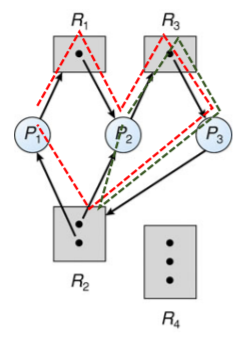
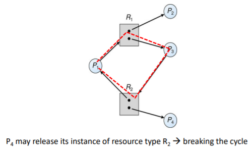
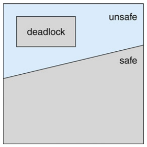
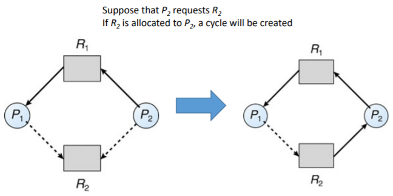
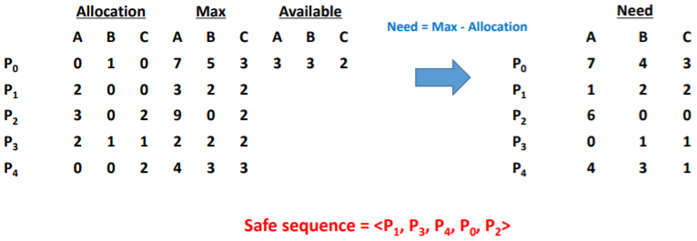
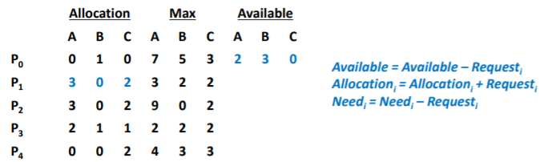
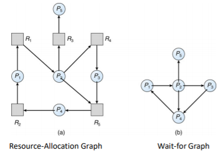
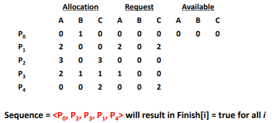
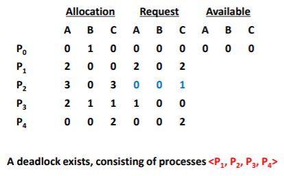

# Deadlock

- Deadlock conditions
- Deadlock prevention
- Deadlock avoidance
- Deadlock detection


## The Deadlock Problem

- 각각 자원을 보유하며 그 집합에서 다른 프로세스가 보유하는 자원을 획득하기 위해 대기하는 차단된 프로세스 세트

- Example

  - 시스템에 디스크 드라이버가 2개 있음 : P1과 P2에는 각각 하나의 디스크가 있고 각각 다른 디스크가 필요
  - Semaphores A와 B를 1로 초기화

  ```c
  P0:
  wait(A);
  wait(B);
  P1:
  wait(B);
  wait(A);
  ```


## System Model

- 자원 종류 : R1, R2, ... , Rm
  - CPU 사이클, 메모리 공간, I/O 장치 등
- 각 자원 종류 Ri에는 Wi 인스턴스가 있음
- 프로세스는 다음과 같은 흐름으로 자원을 사용
  - Request
    - 리소스를 요청. 다른 프로세스가 리소스를 사용중이면 리소스를 받을 수 없어 대기함
  - Use
    - 프로세스는 리소스 위에서 수행
  - Release
    - 프로세스가 리소스를 놓아줌


## Deadlock Conditions

- 다음 4개 조건이 동시에 유지되면 Deadlock 상태가 발생할 수 있음
  - Mutal Exclusion
    - 한 번에 하나의 프로세스만 리소스를 사용할 수 있음
  - Hold and Wait
    - 프로세스 하나가 리소스를 잡고 있고, 다른 것은 대기중일 때
    - 하나 이상의 리소스를 보유하는 프로세스가 다른 프로세스에서 보유하는 추가 리소스를 획득하기 위해 대기
  - No Preemption
    - OS가 작동중인 프로세스를 임의로 중단시킬 수 없을 때
    - 자원은 보유하는 프로세스에 의해서만 자발적으로 방출될 수 있으며, 그 프로세스는 그 작업을 완료한 후에만 방출할 수 있음
  - Circular Wait
    - 프로세스가 순환적으로 서로를 기다릴 때


## Resource Allocation Graph

- 프로세스 간의 관계를 그래프로 도식화해보면 데드락이 발생하는지 예상할 수 있음

- 그래프에 순환 고리가 있다면 데드락 위험이 있다는 의미

  - 순환 고리가 있다고 무조건 데드락이 발생하는 것은 아님
  - 순환 고리가 없으면 절대로 데드락이 발생하지 않음

- resource-allocation graph

  - 꼭지점 집합 V와 edges 집합 E
  - V는 두 가지 유형으로 분할
    - `P={P0, P1, ..., Pn}`, 시스템 내 모든 프로세스로 구성된 세트
    - `R={R0, R1, ..., Rm}`, 시스템의 모든 리소스 유형으로 구성된 세트
    - Request edge : directed edge `Pi->Rj`
    - Assignment edge : directed edge `Rj->Pi`

- Resource-allocation graph with a deadlock

  

- Resource-allocation graph with a cycle but no deadlock

  

- Resource-allocation graph에 사이클이 없는 경우 시스템은 데드락 상태가 아님
- 만약 사이클이 있으면,
  - 리소스 유형당 하나의 인스턴스 -> 데드락
  - 리소스 유형당 여러 인스턴스 -> 데드락 가능성 있음

## Methods for Handling Deadlocks

- 데드락을 제어하는 방법
  - Deadlock prevention
  - Deadlock avoidance
- 시스템이 데드락 상태가 된 후 복구
- 문제를 무시하고 시스템에서 데드락 상태가 발생하지 않는 척
  - Unix를 포함한 대부분의 OS에서 사용


### Deadlock Prevention

- 하나 이상의 조건이 유지될 수 없도록하여 데드락 상태 발생을 방지

- Mutual Exclusion

  - 공유 리소스에서는 필요하지 않음; 공유할 수 없는 자원을 유지해야 함
  - 일반적으로 일부 자원을 본질적으로 공유할 수 없기 때문에 상호 배제 조건을 거부하여 **교착 상태를 예방할 수 없음**

- Hold and Wait

  - 한 프로세스가 실행되기 전 모든 자원을 할당시키고, 이후에는 다른 프로세스가 자원을 요구하도록 함. Starvation 문제가 발생할 수 있음
  - 프로세스가 리소스를 요청할 때마다 다른 리소스를 보유하지 않도록 보장해야 함
  - 프로세스가 실행을 시작하기 전에 모든 리소스를 요청하고 할당하도록 요구하거나 프로세스에 리소스가 없는 경우에만 프로세스가 리소스를 요청하도록 허용
  - 낮은 자원 사용률 + 기아 가능

- No Preemption

  - 리소스를 점유하고 있는 프로세스가 다른 리소스를 요청했을 때 즉시 리소스를 사용할 수 없으면 있던 리소스를 release함
  - 일부 리소스를 보유하고 있는 프로세스가 즉시 할당할 수 없는 다른 리소스를 요청하면 현재 보유중인 모든 리소스가 해제
  - 기존 자원과 요청한 자원을 되찾을 수 있을 때만 프로세스가 시작

- Circular Wait

  - 리소스의 타입에 따라 프로세스마다 일대일 함수로 순서를 지정함
  - 모든 리소스 유형의 전체 순서를 적용하고 각 프로세스가 증가하는 열거 순서로 리스소를 요청하도록 요구
  - R이 현재 보유하고 있는 인스턴스의 유형이 있는 경우 프로세스는 자원 유형 Rj의 인스턴스를 요청할 수 있음. 단 F(Rj)>F(Ri)인 경우에만 가능

- Deadlock Example

  ```c
  void transaction(Account from, Account to, double amount)
  {
  	mutex lock1, lock2;
  	lock1 = get_lock(from);
  	lock2 = get_lock(to);
  	acquire(lock1);
  		acquire(lock2);
  			withdraw(from, amount);
  			deposit(to, amount);
  		release(lock2);
  	release(lock1);
  }
  ```

  - 트랜잭션 1과 2는 동시에 실행됨. 트랜잭션 1은 계정 A에서 계정 B로 $25를 이체하고 트랜잭션 2는 계정 B에서 계정 A로 $50을 이체


### Deadlock Avoidance

- Daedlock Avoidance는 데드락이 발생할 것 같을 때는 아예 리소스를 할당하지 않는 것
- 여기서는 시스템이 unsafe 상태가 되지 않도록 해야하며, unsafe 상태가 되면 최대한 빨리 safe 상태로 복구
- 데드락 가능성은 포인터로 자원 할당 그래프를 구현해 판단
- 리소스 타입이 여러개면 banker's algorithm을 사용
- 시스템에 사용 가능한 추가 사전 정보가 있어야함
  - 현재 사용 가능한 리소스
  - 현재 각 프로세스에 할당된 리소스
  - 각 프로세스의 향후 요청 및 릴리스
- 가장 간단하고 유용한 모델은 각 프로세스가 필요할 수 있는 각 유형의 최대 리소스 수를 선언하는 것
- deadlock avoidance 알고리즘은 자원 할당 상태를 동적으로 검사하여 circular-wait 조건이 없을 수 있는지 확인
  - 리소스 할당 상태는 사용가능한 리소스 및 할당된 리소스의 수와 프로세스의 최대 수요로 정의


### Safe State

- 프로세스가 사용 가능한 리소스를 요청하면 시스템은 즉시 할당이 시스템을 안전한 상태로 남겨 둘지 결정해야 함

- 시스템에 있는 모든 프로세스의 시퀀스 {P0, P1, ..., Pn}이 있으면 시스템은 안전한 상태. 따라서 각 프로세스 Pi에 대해 Pi가 여전히 요청할 수 있는 리소스는 현재 사용 가능한 리소스로 충족 + j<i인 모든 Pj가 보유한 자원

  - Pi 리소스 필요를 즉시 사용할 수 없는 경우 Pi는 모든 Pj가 완료될 때까지 기다릴 수 있음
  - Pj가 완료되면 Pi는 필요한 리소스를 얻고 할당된 리소스를 실행하고 반환하고 종료할 수 있음
  - Pi가 종료되면 Pi+1은 필요한 리소스를 얻을 수 있음

- 시스템이 안전한 상태인 경우 -> 데드락 없음

- 시스템이 안전하지 않은 상태인 경우 -> 데드락 발생 가능

- Deadlock avoidance -> 시스템이 안전하지 않은 상태가 되지 않도록 보장

  


### Deadlock Avoidance Algorithms

- 리소스 타입이 싱글 인스턴스
  - resource-allocation graph 사용
- 리소스 타입이 멀티 인스턴스
  - banker's algorithm 사용


#### Resource-Allocation Graph Scheme

- 클레임 엣지(Claim edge) Pi>Rj는 프로세스 Pimay가 점선으로 표시된 리소스 Rj를 요청함을 나타냄
- 프로세스가 리소스를 요청하면 클레임 에지가 요청 에지로 변환
- 프로세스에 자원이 할당되면 Request edge가 할당 edge로 전환
- 프로세스에 의해 리소스가 해제되면 할당 에지가 클레임 에지로 다시 변환
- 시스템에서 먼저 리소스를 할당해야 함
- 요청 에지 Pi->Rj를 할당 에지 Ri->Pj로 변환해도 리소스 할당 그래프에서 주기가 형성되지 않는 경우에만 요청을 승인할 수 있음




### Banker's Algorithm

- Banker's algorithm은 dijkstra가 고안한 데드락 회피 알고리즘

- 프로세스가 리소스를 요청할 때마다 수행되며, 리소스를 할당했을 때 데드락이 발생하는지 시뮬레이션함

- 리소스 유형이 멀티플 인스턴스인 시스템에서 사용

- 데이터 구조

  - n : 프로세스의 수,  m : 리소스 타입 수
  - Available
    - 길이가 m인 벡터. `Available[j] = k`인 경우 사용 가능한 자원 유형 Rj의 인스턴스가 k개 있음
  - Max
    - n*m 행렬, 만약 `Max[i, j] = k`이면 프로세스 Pi는 리소스 유형 Rj의 인스턴스를 최대 k개까지 요청할 수 있음
  - Allocation
    - n*m 행렬, 만약 `Allocation[i, j] = k`이면 프로세스 Pi는 현재 자원 유형 Rj의 k인 인스턴스에 할당
  - Need
    - n*m 행렬, 만약 Need[i, j] = k이면 프로세스 Pi는 작업을 완료하기 위해 리소스 유형 Rj의 인스턴스 k개가 더 필요할 수 있음
    - `Need[i, j] = Max[i, j] - Allocation[i, j]`

- Safety Algorithm

  1. Work와 Finish를 각각 길이가 m과 n인 벡터로 지정. `Work = Available` 및 i = 0, 1, ..., n-1에 대해 `Finish[i] = false`로 초기화

  2. 아래의 두개가 같은 index i를 찾음

     a. `Finish[i] == false`

     b. `Needi <= Work`

     만약 존재하지 않으면 4단계로 이동

  3. `Work = Work + Allocationi

     Finish[i] = true

     2단계로 이동

  4. 만약 모든 i에 대해 `Finish[i] == true`이면 시스템은 안전한 상태이다

- Resource-Request Algorithm for P<sub>i<sub>

  - Request<sub>i<sub> : P<sub>i<sub>에 대한 request vector

    : 만약 Request<sub>i<sub>[j] = k이면 P<sub>i<sub>는 리소스 유형 R<sub>j<sub>의 k인스턴스를 원함

  1. 만약 Request<sub>i<sub> <= Need<sub>i<sub>이면 2번으로 이동하고 아니면 오류 발생

  2. 만약 Request<sub>i<sub> <= Available이면 3번으로 이동하고 아니면 리소스를 사용할 수 없으므로 기다려야 함

  3. 다음과 같이 상태를 수정하여 요청된 리소스를 P<sub>i<sub>에 할당하는 척함

     ```c
     Available = Available - Request[i]
     Allocation[i] = Allocation[i] + Request[i]
     Need[i] = Need[i] - Request[i]
     ```

     만약 안전한 상태면 리소스는 P<sub>i<sub>에 할당됨

     안전한 상태가 아니면 P<sub>i<sub>는 기다려야하며 이전 resource-allocation 상태가 복원

- Example

  - 5 processes : P<sub>0<sub>, ..., P<sub>4<sub>
  - 3 resource types
    - A (10 instances), B(5 instances), C(7 instances)
  - At time T<sub>0<sub>:

  

- Example #2

  - P<sub>1<sub> request(1, 0, 2)

    1. Check Request<sub>i<sub> <= Need<sub>i<sub> -> (1, 0, 2) <= (1, 2, 2)

    2. Check Request<sub>i<sub> <= Available -> (1, 0, 2) <= (3, 3, 2)

    3. Modification the state of T<sub>0<sub>

       

    4. Check if the system is in a safe state

       **Safe sequence = <P<sub>1<sub>, P<sub>3<sub>, P<sub>4<sub>, P<sub>0<sub>, P<sub>2<sub>**


## Deadlock Detection

- 시스템이 데드락 상태에 들어갈 수 있도록 함
- Detection algorithm
  - 리소스 유형이 단일 인스턴스
    - wait-for graph 사용
  - 리소스 유형이 여러 인스턴스
    - banker's algorithm 변형
- Recovery scheme


### Wait-for graph

- P<sub>i<sub> -> P<sub>j<sub> if P<sub>i<sub> is waiting for P<sub>j<sub>

  


### Variant of the banker's algorithm

- Available

  - 길이가 m인 벡터는 각 유형의 사용 가능한 리소스 수

- Allocation

  - n*m 행렬은 각 프로세스에 현재 할당된 각 유형의 리소스 수를 정의

- Request

  - n*m 행렬은 각 프로세스의 현재 요청을 나타냄. Request[i, j]가 k와 같으면 프로세스 P<sub>i<sub>는 리소스 유형 R<sub>j<sub>의 인스턴스 k개를 더 요청

- Algorithm

  1. Work와 Finish를 각각 길이가 m과 n인 벡터로 지정. `i = 0, 1, ..., n-1` 인 경우 `Work=Available`로 초기화. 만약 `Allocation != 0`이면 `Finish[i] = false` 아니면 `Finish[i] = true`

  2. 아래와 같은 상황인 i를 찾음

     a. `Finish[i] == false`

     b. `Requesti <= Work`

     만약 i를 찾지 못하면 4로 이동

  3. `Work = Work + Allocationi`

     `Finish[i] = true`

     go to step 2

  4. 만약 몇몇의 i에 대해 `Finish[i] == false`이면 시스템이 데드락 상태임. 또한 `Finish[i] == false`이면 프로세스 P<sub>i는 데드락 프로세스가 됨

  알고리즘은 시스템이 데드락 상태인지 여부를 감지하기 위해 O(m*n<sup>2)의 작업 순서가 필요

- Example

  - 5 processes - P<sub>0, ..., P<sub>4<sub>

  - 3 resource types

    - A (7 instances), B (2 instances), C (6 instances)

  - At time T<sub>0:

    

- Example #2

  - P2 requests an additional instance of type C

    


### Detection-algorithm Usage

- 호출시기와 빈도는 다음에 따라 다름
  - 데드락 상태가 얼마나 자주 발생하는가
  - 몇 개의 프로세스를 롤백해야 하는가
    - 각 분리된 사이클 마다 하나씩
- 탐지 알고리즘이 임의로 호출되면 리소스 그래프에 많은 주기가 있을 수 있으므로 많은 데드락 상태 프로세스 중 데드락 상태가 발생한 프로세스를 알 수 없음


### Recovery Scheme

- 데드락이 발생했다면 데드락으로부터 복구되어야 함
- Process termination
  - 모든 데드락 상태 프로세스 중단
  - 데드락 상태가 제거될 때까지 한번에 하나의 프로세스를 중단
- 이때 어떤 프로세스를 종료시킬지 정하는 것이 중요
- 판단 기준
  - 프로세스의 중요도
  - 프로세스가 얼마나 오래 실행되었는지
  - 프로세스에서 사용한 리소스
  - 프로세스가 작업을 마치기 위해 얼마나 많은 리소스가 필요한지
  - 프로세스가 종료되기 위해 얼마나 많은 리소스가 필요한지
  - 프로세스가 batch인지 interactive 인지


### Recovery from Deadlock: Resource Preemption

- 데드락을 해결하기 위해 Resource Preemption 방식을 사용하면 다음과 같은 이슈가 있음
  - Selecting a victim
    - minimize cost
    - 어떤 프로세스를 종료시킬지 결정
  - Rollback
    - 안전한 상태로 돌아가서 해당 상태에 대한 프로세스를 다시 시작
  - Starvation
    - 비용 요소에 롤백 횟수를 포함하여 항상 동일한 프로세스를 victim으로 선택할 수 있음


##### Reference

- https://parksb.github.io/article/11.html
- Provided by Operating Systems Concepts, 10th Edition
