# Memory Management Strategy

- Continuous memory allocation
- Paging
- Segmentation

## Background

- 메모리는 현대 컴퓨터 시스템의 핵심. 프로세스는 독립적인 메모리 공간을 차지
- 시스템은 프로세스가 자신의 영역 외에는 접근할 수 없도록 막아야 함
- 프로그램을 디스크에서 메모리로 가져와서 실행하려면 프로세스 내에 배치해야 함
- 메인 메모리 및 레지스터는 스토리지 CPU만 직접 액세스할 수 있음
- 메모리 유닛은 addresses + read 요청 또는 address + data 및 write 요청의 스트림만 볼 수 있음
- 하나의 CPU 클럭에 액세스 등록
- 메인 메모리는 많은 사이클이 소요되어 스톨(stall)이 발생할 수 있음
- 캐시는 메인 메모리와 CPU 레지스터 사이에 있음
- 올바른 작동을 보장하기 위해 메모리 보호 필요

### Base and Limit Registers

- CPU는 레지스터를 참조하여 메모리 공간을 보호하며, 레지스터 정보는 PCB에 담김

- 운영체제의 중요한 역할 중 하나

  - 운영체제와 사용자 프로세스를 보호하려면
  - 레지스터는 base와 limit으로 나뉨
  - 베이스 레지스터와 리미트 레지스터
    - base register
      - 최소 합법적인 물리적 메모리 주소
      - 프로세스가 메모리에서 사용할 수 있는 가장 작은 physical address
    - limit register
      - 사용할 수 있는 주소 범위의 크기
  - 프로세스가 사용할 수 있는 가장 큰 주소는 base와 limit의 합

  

#### Hardware Address Protection

- 각 프로세스에 별도의 메모리 공간이 있음을 보장

  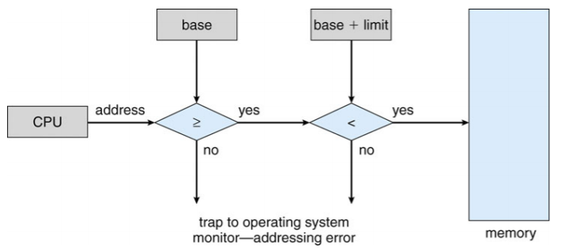

### Address Binding

- 일반적으로 프로그램은 디스크에 binary executable 파일로 저장되어 있음

- 프로그램을 실행하기 위해서는 메모리에 로드해 프로세스로 만들어야 함

  - 이때 디스크에서 메인메모리로 로드되기를 대기하는 곳이 input queue
  - 운영체제는 input queue에서 프로세스를 선택해 메모리에 로드

- 디스크의 프로그램, 메모리로 가져와서 input queue에서 실행할 준비가 됨

  - 지원하지 않으면 address 0000에 로드해야 함

- 최초 사용자가 항상 0000으로 물리적 주소를 처리하는 것은 불편

- 또한 프로그램 수명의 단계별로 주소가 다르게 표현

  - 소스 코드 주소는 일반적으로 기호로 사용
  - 컴파일된 코드 주소가 재배치 가능한 주소에 바인딩
    - 즉 이 모듈의 시작부터 14바이트까지
  - 링커 또는 로더가 재배치 가능한 주소를 절대 주소로 바인딩
    - 예: 74014
  - 각각의 바인딩은 하나의 주소 공간을 다른 주소로 매핑

- 명령과 데이터를 메모리 주소에 주소 바인딩하는 것은 세 단계에서 발생

  - Compile time
    - 만약 compile time에 프로세스가 메모리의 어느 위치에 들어갈지 미리 알고 있다면 absolute code를 생성할 수 있음. 위치가 변경되면 코드를 다시 컴파일해야됨. ex) MS-DOS.COM 형식 프로그램
    - 메모리 위치가 priori인 경우 컴파일시 절대 코드를 생성
    - 시작 위치가 변경되면 재컴파일해야 함
  - Load time
    - 프로세스가 메모리의 어느 위치에 들어갈지 미리 알 수 없다면 컴파일러는 relocatable code를 만들어야 함. 이 경우 최종 바인딩은 로드의 소요 시간만큼 지연
    - 컴파일 시 메모리 위치를 알 수 없는 경우 재배치 가능한 코드를 생성
  - Execution time
    - 프로세스가 실행 중 메모리의 한 세그먼트에서 다른 세그먼트로 이동할 수 있다면 바인딩은 runtime까지 지연
    - 바인딩이 실행 시간까지 지연
    - 어드레스 맵에 대한 하드웨어 지원 필요(예: 베이스 및 리미트 레지스터)

  

### Logical vs Physical Address Space

- CPU가 생성하는 주소는 logical address(가상주소라고도 함(Virtual Address)이고, 메모리에 의해 취급되는 주소는 physical address
- compile-time과 load-time에서 주소를 바인딩할때는 logical address와 physical address가 같게 생성되는 반면 execution-time에서는 다르게 생성
  - 이 경우 logical address를 virtual address라고 함
- virtual address를 physical address로 대응시키는 것은 하드웨어 디바이스인 MMU(Memory-Management Unit)가 함

### MMU : Memory Management Unit

- 가상 주소를 물리적 주소로 매핑하는 H/W 장치

- 우선 메모리로 전송될 때 사용자 프로세스에 의해 생성된 모든 주소에 재배치 레지스터의 값이 추가되는 간단한 방식을 고려
  
  - 기본 레지스터는 이제 **재배치 레지스터(relocation register)**라고 부름
  
- 사용자 프로그램은 논리적 주소를 처리. 실제 물리적 주소는 보지 못함

  - 메모리 내 위치를 참조할 때 execution time 바인딩 발생
  - 물리적 주소에 바인딩된 논리적 주소

  

### Dynamic Linking

- Linking은 실행 시간까지 연기
- 정적 링크(Static linking) : 로더가 바이너리 프로그램 이미지로 조합한 시스템 라이브러리 및 프로그램 코드
- 동적 링크(Dynamic Linking) : 링크 실행 시간까지 연기
- 적절한 메모리 레지던트 라이브러리 루틴을 찾기 위해 사용되는 작은 코드, stub
- Stub을 루틴의 주소로 교체하고 루틴을 발생
- 운영체제가 프로세스의 메모리 주소에 루틴이 있는지 확인
  - 주소 공간이 아닌 경우 주소 공간으로 추가
- 라이브러리에는 동적 링크가 특히 유용
- **공유 라이브러리**라고도 하는 시스템

### Swapping

-  메모리는 크기가 크지 않기 때문에 프로세스를 임시로 디스크에 보냈다가 다시 메모리에 로드해야 하는 상황이 생김

- 프로세스가 메모리 부족 상태에서 백업 저장소로 일시적으로 전환된 후 메모리에 다시 가져와 계속 실행할 수 있음

- 이때 디스크로 보내는 것을 swap out, 메모리로 들여보내는 것은 swap in이라고 함

- 우선순위에 따라 어떤 프로세스를 swap in/out할지 결정

- swap하는데 걸리는 시간의 대부분은 디스크 전송 시간

  - 총 전송 시간은 swap된 메모리 양에 비례함

  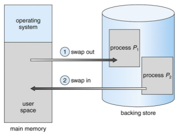

## Memory Allocation Schemes

- Continuous Memory Allocation
- Paging
- Sementation

### Continuous Memory Allocation

- 보통 메모리는 두 개의 영역으로 나뉘어 관리

- low memory에는 커널을, high memory에는 사용자 프로세스를 담음

- continuous memory allocation 시스템은 각 프로세스들이 연속적인 메모리 공간을 차지

- 프로세스가 자신의 범위를 넘지 못하도록 하는 것이 base register와 limit register의 역할

- Multiple-partition allocation

  - 파티션 개수에 따른 멀티프로그래밍 정도 제한

  - 효율성 향상을 위한 가변 파티션 크기(특정 프로세스의 필요에 따라 크기 조정)

  - Hole : 사용 가능한 메모리 블록, 다양한 크기의 hole들이 메모리 전체에 흩어져 있음

  - 프로세스가 도착하면 이를 수용할 수 있을만큼 큰 hole에서 메모리를 할당

  - 프로세스를 종료하면 파티션이 해제되고 인접한 사용 가능한 파티션과 결합

  - 운영체제는 다음의 정보를 유지

    a) allocated partitions b) free partitions(hole) 

  

#### Memory Allocation

- free holes 목록에서 크기 n 요청을 충족하는 방법
  - **First-fit**
    - 첫번째 hole 충분히 큰 hole 할당
  - **Best-fit**
    - hole 중에서 가장 작은 곳을 할당
    - 크기별 지시가 없는 경우 전체 목록 검색 필요
    - 최소의 남은 hole 생성
  - **Worst-fit**
    - 가장 큰 곳을 할당
    - 크기별 지시가 없는 경우 전체 목록 검색 필요
    - 가장 큰 남은 hole 생성
  - 속도 및 스토리지 활용도 측면에서 Worst-fit보다 Best-fit과 First-fit이 우수

#### Fragmentation

- fragmentation은 메모리 공간을 사용하지 못하게 되는 것을 말함. (garbage collection에도 같은 문제가 발생)
- External Fragmentation
  - 요청을 충족하기 위한 총 메모리 공간이 존재하지만 연속되지 않음
  - block의 크기가 30k, 60k, 20k, 40k, 60k 이면 hole은 60k 두 공간 밖에 없을 때 70k프로세스가 들어와야 한다면 실제 메모리 공간은 120k가 비어있지만 어디에도 70k가 들어갈 수  없음
- Internal Fragmentation
  - 할당된 메모리는 요청된 메모리보다 약간 클 수 있음
    - 이 크기 차이는 파티션 내부의 메모리이지만 사용되지 않음
- 일반적으로 메모리가 시스템 효율을 위해 고정 크기의 정수 배로 할당되기 때문에 생기는 현상
- External Fragmentation 줄이기
  - Compaction
    - 사용 가능한 모든 메모리를 하나의 큰 블록에 함께 배치하기 위해 메모리를 섞음
    - 할당된 block을 한쪽으로 몰아 큰 block을 생성
    - Compaction은 재배치가 동적인 경우에만 가능(예 : 실행 시간 주소 바인딩)
    - 프로세스 할당은 자주 일어나는 일이기 때문에 compaction처럼 오버헤드가 큰 작업을 매번 할 수 없음
  - 프로세스의 논리적 주소를 비 연속적으로 허용하여 해당 메모리를 사용할 수 있는 모든 곳에서 프로세스에 물리적 메모리를 할당할 수 있도록 함
    - Paging & Segmentation

### Paging

- paging은 프로세스를 여러 조각으로 나누는 것
  
- 단순히 크기를 기준으로 나누기 때문에 비슷한 요소라도 메모리 공간에 연속적으로 할당되지 않음
  
- 프로세스의 물리적 주소 공간을 연속적이지 않게 허용하려면
  - 물리 메모리를 **프레임**이라고 하는 고정 크기의 블록으로 나눔
  - 논리적 메모리를 **페이지**라는 동일한 크기의 블록으로 나눔
  - n 페이지 크기의 프로그램을 실행하려면 n개의 free frame을 찾아 프로그램을 로딩
  - 논리적 주소를 실제 주소로 변환하는 페이지 테이블 설정
  - Internal fragmentation
- paging에서는 physical memory의 각 block을 frame이라고 하고 logical memory의 각 block을 page라고 부름
- frame을 작게 나눌수록 fragment가 적게 생기고 실제로 external fragmentation이 거의 생기지 않음
- logical address를 physical address로 변환하는 page table이 필요

- Paging model of logical and physical memory

  

- 주소 변환 방법(Address Translation Scheme)

  - CPU에서 생선된 주소를 나눔

    - Page number(p)
      - 실제 메모리에 있는 각 페이지의 기본 주소를 포함하는 페이지 테이블의 인덱스로 사용
    - Page offset(d)
      - base address와 결합하여 memory unit으로 전송되는 실제 메모리 주소를 정의

  - 주어진 논리적 주소 공간 2m 과 페이지 사이즈 2n

    

  

- Example
- 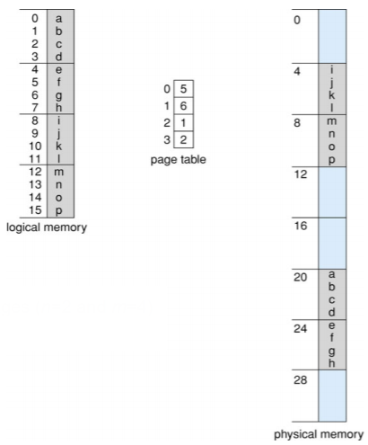
  
  - 32-byte memory and 4-byte pages (n=2 and m=4)
- Calculating internal fragmentation
  - Page size = 2,048 bytes
  - Process size = 72,766 bytes
  - 35 pages + 1,086 bytes
  - Internal fragmentation of 2,048 - 1,086 = 962 bytes
  - Worst case fragmentation = 1 frame - 1 byte
  - On average fragmentation = 1 / 2 frame size
  - 작은 프레임 크기가 바람직한가
  - 그러나 각 페이지 테이블 항목은 추적하기 위해 메모리를 사용
  - 시간이 지남에 따라 증가하는 페이지 크기
  - Solaris는 두 페이지 크기를 원함 : 8 KB and 4 MB
- 프로세스 view와 물리적 메모리의 차이가 매우 큼
- 구현 프로세스 자체 메모리만 액세스할 수 있음

#### Free Frames

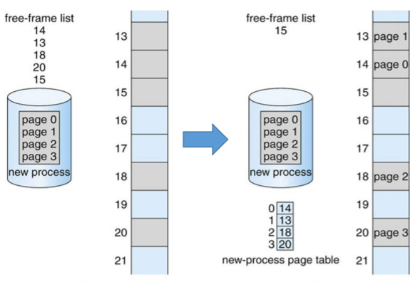

#### Implementation of page table

- 페이지 테이블은 메인 메모리에 보관

- Page table base register(PTBR)가 페이지 테이블을 가리킴

- Page table length register(PTLR)는 페이지 테이블의 크기를 나타냄

- 이 시스템에서 모든 데이터/instruction 액세스에는 페이지 테이블용과 데이터/instruction 용 두 개의 메모리 액세스가 필요

  - 즉, 매번 데이터에 접근할 때마다 한번은 데이터에 한번은 page table에 접근해야함. 비효율적

- Translation Look-side Buffer(TLB)라는 캐시된 특수 고속 조회 하드웨어를 사용하면 두 가지 메모리 액세스 문제를 해결할 수 있음

  - TLB는 key-value 쌍으로 데이터를 관리하는 associative memory
  - CPU는 page table보다 TLB를 우선적으로 참조
  - page number가 TLB에서 발견되는 비용을 hit ratio라고 함

- Use of TLB

  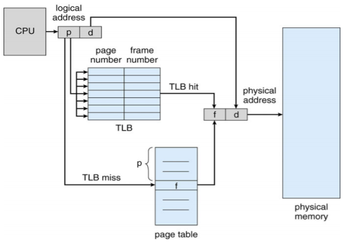

- 일부 TLB는 각 TLB 항목에 address-space identifiers(ASIDs)를 저장

  - 각 프로세스를 고유하게 식별하고 해당 프로세스를 위한 주소 공간 보호 기능 제공
  - 그렇지 않으면 모든 컨텍스트 스위치에서 flush 필요

- Effective Access Time

  - TLB Look up - ε time unit
  - Memory access time - 1 time unit
  - Hit ratio(α)
    - TLB에서 페이지 번호가 발견된 횟수 비율
  - Effective Access Time(EAT)
    - EAT = (1+ε)α + (2+ε)(1-α) = 2 + ε - α
    - Consider α = 80%, ε = 20ns for TLB search, 100ns for me mory access
      - EAT = 0.80 * 100 + 0.20 * 200 = 120ns
    - Consider more realistic hit ratio -> α = 99%, ε = 20ns for TLB search, 100ns for memory access
      - EAT = 0.99 * 100 + 0.01 * 200 = 101ns

#### Memory Protection

- Memory Protection은 각 프레임에 연결된 보호 bites에 의해 구현

- 메모리 할당이 continuous한 경우 limit만 비교해도 메모리를 보호할 수 있었음

- 하지만 paging은 continuous하지 않음

- **valid-invalid bit**

  - page table의 각 항목에는 valid-invalid bit가 붙어있음
  - valid는 관련 페이지가 프로세스의 논리적 주소 공간에 있음을 나타냄
  - invalid는 페이지가 프로세스의 논리적 주소 공간에 있지 않음을 나타냄
  - 또는 페이지 테이블 길이 레지스터(PTLR)를 사용

- 위반시 커널에 트랩이 발생

  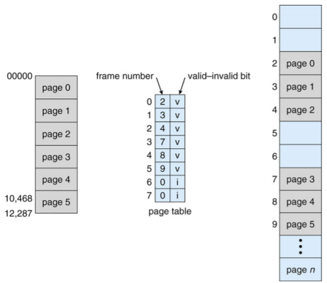

#### Shared Pages

- paging의 또 다른 장점은 코드를 쉽게 공유할 수 있다는 것

- 만약 코드가 reentrant code(또는 pure code)라면 공유 가능

  - reentrant code는 runtime 동안 절대로 변하지 않는 코드

- 여러 프로세스들이 동시에 같은 코드를 수행할 수 있음

  - 이런 식으로 공통 page를 공유하면 12개로드해야 할 것을 6개만 로드

- Shared code

  - 프로세스간에 공유되는 읽기 전용(reentrant) 코드 사본 1개(예: 텍스트 편집기, 컴파일러, 윈도우 시스템)
  - 동일한 프로세스 공간을 공유하는 여러 개의 스레드와 유사
  - 읽기-쓰기 페이지 공유 허용시 프로세스간 통신에도 유용

- Private code and data

  - 각 프로세스마다 코드와 데이터의 별도 사본 보관
  - 개인 코드 및 데이터 페이지는 논리적 주소 공간 어디에나 표시될 수 있음

  

## Structure of the Page Tables

- paging을 직접 적용하면 page table의 크기가 커짐
- 페이지 테이블을 효율적으로 구성하는 방법
- Hierarchical paging
- Hashed page tables
- Inverted page tables

### Hierarchical Page Tables

- hierarchical paging은 logical address space를 여러 단계의 page table로 분할하는 기법

- two-level paging scheme이 예시인데, page table과 메모리 사이에 page table을 하나 더 두어 모든 페이지를 로드해야하는 부담을 줄일 수 있음

- Two-level Page Table Scheme

  

#### Two-level Paging Example

- 논리적 주소(1K 페이지 크기의 32비트 시스템에서) 다음과 같이 나뉨
  - 22비트로 구성된 페이지 번호
  - 10비트로 구성된 페이지 오프셋
- 페이지 테이블이 페이징되므로, 페이지 번호는 다음과 같이 구분
  - 12비트 페이지 번호
  - 10비트 페이지 오프셋
- 그러므로 논리적 주소는 다음과 같음
  - 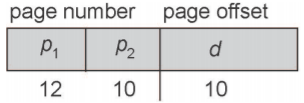
  - 여기서 p1은 외부 페이지 테이블의 인덱스이고, p2는 내부 페이지 테이블의 페이지 내의 변위(displacement)
  - **forward-mapped page table**

#### Address Translation Scheme

#### 64-bit Logical Address Space

- If page size is 4KB(212)

  - 페이지 테이블은 252개의 엔트리를 가짐

  - 만약 two level scheme라면 내부 페이지 테이블은 210 4-byte 엔트리

  - 주소는 다음과 같음

    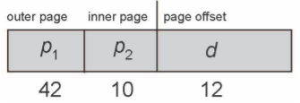

  - 외부 페이지 테이블에는 242개의 엔트리 또는 244 바이트가 있음

  - 한가지 해결책은 2nd 외부 페이지 테이블을 추가하는 것

  - 그러나 다음 예에서 2nd 외부 페이지 테이블은 여전히 234

    - 물리적 메모리 위치 하나를 얻기위해 4 메모리 액세스 가능

#### Three-level Paging Scheme

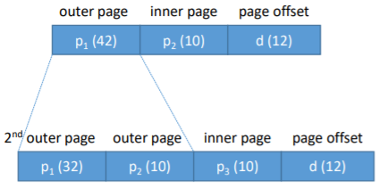

- Hierarchical 페이지 테이블은 일반적으로 64비트 아키텍처에 적합하지 않음

### Hashed Page Tables

- hash table을 이용해 page table을 관리하는기법

- 일반적인 주소 공간 > 32비트보다 큼

  - address space가 32비트보다 커지면 hierarchical paging이 비효율적이라 사용

- virtual page number를 hashing해 page table을 참조하는데 사용

  - 이 페이지 테이블에는 동일한 위치로 해싱되는 요소 채인이 포함

- hashed page table에서는 linked list를 따라가며 page number를 비교.

  - 일치하면 그에 대응하는 page frame number를 얻음.
  - hash table은 검색에 O(1) 걸려 매우 빠르지만 구현이 어려움

- 각 요소에는 (1) 가상 페이지 번호 (2) 매핑된 페이지 프레임의 값 (3) 다음 요소에 대한 포인터 포함

- 이 체인에서 가상 페이지 번호를 비교하여 일치 항목을 찾음

  - 일치하는 것이 발견됨녀 해당 물리적 프레임을 추출

- 64비트 주소의 변형은 **clustered page tables**

  - 해시와 유사하지만 각 항목은 1개가 아닌 여러 페이지(예: 16개)를 참조
  - sparse address spaces에 특히 유용(메모리 참조가 연속적이지 않고 분산되어 있는 경우)

  

### Inverted Page Tables

- 지금까지 page table은 각 page마다 하나의 엔트리를 가짐

- inverted page table은 메모리의 frame마다 한 항목씩 할당

  - 이렇게 하면 physical frame에 대응하는 항목만 저장하면 되기 때문에 메모리를 훨씬 적게 찾음
  - 다만 탐색시간이 오래 결려 대부분의 메모리는 inverted page table과 hashed page table을 결합하는 방식을 구현

- 각 프로세스가 페이지 테이블을 가지고 있고 모든 가능한 논리 페이지를 추적하는 대신 모든 물리 페이지

- **메모리의 실제 페이지 당 하나의 엔트리**

- 엔트리는 실제 메모리 위치에 저장된 페이지의 가상 주소와 해당 페이지를 소유한 프로세스에 대한 정보로 구성

- 각 페이지 테이블을 저장하는데 필요한 메모리를 줄이지만 페이지 참조 발생시 테이블 검색에 필요한 시간 증가

- hash table을 사용하여 검색을 페이지 테이블 엔트리의 하나 또는 최대 몇개로 제한

  - TLB가 액세스를 가속화할 수 있음

- 그러나 공유 메모리를 공유하는 방법은?

  - 가상 주소를 공유된 물리적 주소로 매핑

  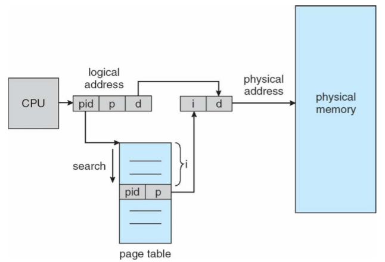

### Segmentation

- segmentation은 하나의 프로세스를 여러 개로 나누는 것을 말함

- segment는 main, function, method, object 등의 논리적 단위로 인간의 관점으로 프로세스를 나누는 것

- 각 segment의 base와 limit는 segment table에 저장

- 사용자의 메모리 뷰를 지원하는 메모리 관리 방식

- 프로그램은 세그먼트의 모음

  - 세그먼트의 논리적 unit은 다음과 같음
    - Main program
    - Procedure
    - Function
    - Method
    - Object
    - Local variables, global variables
    - Common block
    - Stack
    - Symbol table, etc.

- Logical view of segmentation

  

#### Segmentation Architecture

- logical address는 두 개의 튜플로 구성

  <segment-number, offset>

- Segment table

  - 2차원 물리적 주소 매핑
  - 각각의 테이블 엔트리에는
    - Base : 세그먼트가 메모리에 상주하는 시작 물리적 주소를 포함
    - Limit : 세그먼트의 길이를 지정
  - **Segment-table base register(STBR)** : 메모리에서 세그먼트 테이블의 위치를 가리킴
  - **Segment-table length register(STLR)** : 프로그램에서 사용하는 세그먼트 수를 나타냄
    - Segment number `s` is legal if `s < STLR`

- Segmentation Hardware

  

- Segmentation Example

  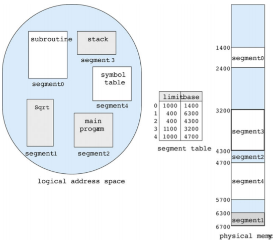

- Shared Segments

  

##### Reference

- https://parksb.github.io/article/12.html
- Provided by Operating Systems Concepts, 10th Edition