# Virtual Memory Management Strategy

- Demand paging
- Page Replacement Schemes
- Thrashing
- Kernel Memory Allocation Schemes


## Background

- 일반적으로 프로그램을 실행하기 위해서는 프로그램의 일부만 메모리에 있으면 됨
  - 비정상적인 오류 상태 취급 규정
  - Array, list, table은 실제 필요한 것보다 더 많은 메모리를 할당하는 경우가 많음
  - 프로그램의 특정 옵션 및 기능을 거의 사용하지 않을 수 있음
  - 전체 프로그램이 필요한 경우에 모든 프로그램이 동시에 필요한 것은 아님

- 메모리에 부분적으로만 올려 실행하는 프로그램의 이점

  - 프로그램은 더 이상 사용 가능한 물리적 메모리의 양에 제한되지 않음

  - 동시에 더 많은 프로그램을 실행할 수 있음

  - 사용자 프로그램을 메모리에 로드하거나 스왑하는데 필요한 I/O 감소

    -> **Virtual Memory Management!!!**


# Virtual Memory Overview

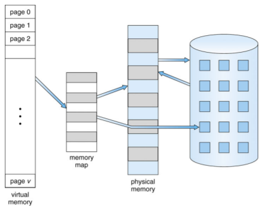

- Virtual address space

  - 프로세스가 메모리에 저장되는 방식에 대한 logical view
    - 일반적으로 주소 0에서 시작해서 공백이 끝날때까지 연속 주소
    - page frames로 구성된 물리적 메모리
    - MMU는 논리적 주소와 물리적주소 매핑해야 함

  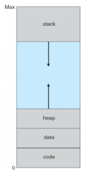


## Demand Paging

- Virtual Memory는 다음을 통해 구현
  - Demand paging
  - Demand segmentation
- Demand Paging
  - 필요할 때만 페이지를 메모리로 가져오기
    - 적은 I/O 필요
    - 적은 메모리 필요
    - 더 빠른 응답
    - 더 많은 사용자

- Basic concepts

  - 전체 프로세스를 가져오는 대신 swapper는 사용될 페이지만 메모리에 가져옴
    - Lazy swapper (or pager)
  - 메모리에 있는 페이지와 디스크에 있는 페이지를 구분하려면 하드웨어 지원이 필요
    - Valid-Invalid bit 방법 사용
      - Valid : 연결된 페이지가 legal 과 메모리에 모두 있음
      - Invalid : 페이지가 잘못되었거나 유효하지 않지만 현재 디스크에 있음
        - Invalid -> abort
        - Not in memory -> bring to memory

  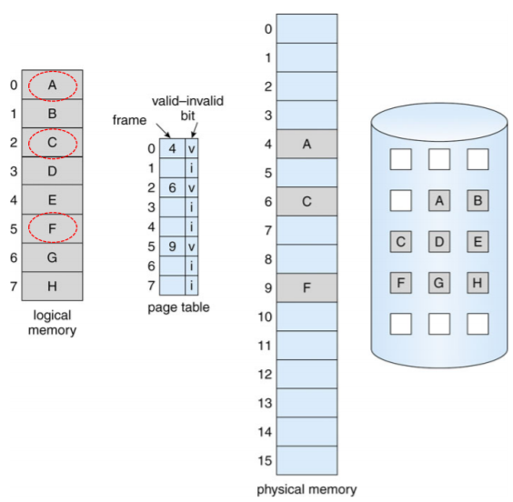


### Page Fault

- 페이지에 대한 참조가 있는 경우 해당 페이지에 대한 첫번째 참조는 운영체제에 트랩됨

  - Page fault

- 운영체제는 결정할 다른 테이블을 봄

  - Invalid reference
  - Just not in memory

- 빈 프레임 가져오기

- 페이지를 프레임으로 스왑

- 테이블 재설정

- valid bit = v로 설정

- Page Fault를 일으킨 명령을 다시 실행

- Steps in handling a page fault

  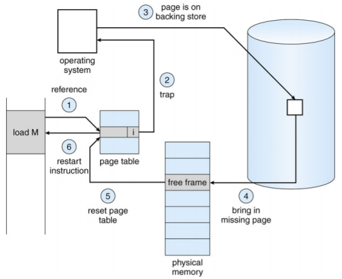


### Aspect of Demand Paging

- 극단적인 경우 : 메모리에 페이지 없이 프로세스 시작
  - OS는메모리에 상주하지 않는 프로세스의 첫 번째 명령에 대한 명령 포인터를 설정 -> Page Fault
  - 첫번째 액세스의 다른 모든 프로세스 페이지
  - **Pure demand paging**
- 실제로 주어진 명령어는 여러 페이지에서 액세스할 수 있음- > multiple page faults
  - 메모리에서 2개의 숫자를 더하고 결과를 메모리에 다시 저장하는 명령어의 fetch 및 decode 고려
  - 참조 지역성으로 인한 pain 감소
- Demand Paging에 필요한 하드웨어 지원
  - Valid / Invalid bit가 있는 페이지 테이블
  - 보조 메모리(스왑 공간이 있는 스왑 장치)
  - 명령 재시작


#### Instruction Restart

- Restart overhead
  - 페이지 오류가 발생하면 명령을 다시 가져와서 디코딩해야 함
  - A worst-case example
    - Block move
  - Solutions
    - 블록의 양쪽 끝에 접근
    - 임시 레지스터를 사용하여 덮어쓰기 위치의 값을 보유하는 방법


### Performance of Demand Paging

- Stages in Demand Paging (worse case)
  1. 운영체제 트랩
  2. 사용자 레지스터 및 프로세스 상태 저장
  3. 인터럽트가 page fault인지 확인
  4. 페이지 참조가 적합한지 확인하고 디스크에서 페이지 위치 확인
  5. 디스크에서 빈 프레임으로 읽기를 실행
     1. 읽기 요청이 처리될 때까지 이 장치의 대기열에서 대기
     2. 기기 탐색 및 지연 시간을 기다림
     3. 빈 프레임으로 페이지 전송 시작
  6. 기다리는 동안 다른 사용자에게 CPU 할당
  7. 디스크 I/O 서브 시스템에서 인터럽트 수신(I/O 완료)
  8. 다른 사용자의 레지스터 및 프로세스 상태를 저장
  9. 인터럽트가 디스크에서 발생했는지 확인
  10. 페이지 테이블 및 다른 테이블을 수정하여 페이지가 이제 메모리에 있음을 표시
  11. CPU가 이 프로세스에 다시 할당될 때까지 기다림
  12. 사용자 레지스터, 프로세스 상태 및 새 페이지 테이블을 복원한 다음 중단된 명령을 다시 시작
- Three major activities
  - 인터럽트 서비스 : careful coding은 수백개의 명령어가 필요함을 의미
  - 페이지 읽기 : 많은 시간
  - 프로세스 재시작 : 다시 약간의 시간
- Page fault rate 0 <= p <= 1
  - If p = 0, no page fault
  - If p = 1, every reference is a fault
- Effective Access Time(EAT)
  - EAT = (1-p) * Memory Access Time + p * Page Fault Time
  - Page Fault Time = page fault overhead + swap page out + swap page in + **restart overhead**


### Demand Paging Example

- Memory access time = 200 nanoseconds

- Average page-fault service time = 8 milliseconds

- EAT = (1-p) * 200 + p (8 milliseconds)

  = (1 - p) * 200 + p * 8,000,000

  = 200 + p * 7,999,800

- 만약 1,000개의 경우 중 한번의 액세스로 page fault가 발생하는 경우

  EAT = 8.2 microseconds

  This is slow down by a factor of 40!!

- 성능 저하를 10% 미만으로 원하는 경우

  - 220 > 200 + 7,999,800 * p

    20 > 7,999,800 * p

  - p < .0000025

  - < one page fault in every 400,000 memory accesses


### Demand Paging Optimizations

- 동일한 디바이스에 있더라도 파일 시스템 I/O보다 빠른 스왑 공간 I/O
  - 더 큰 chunks로 할당된 스왑, 파일 시스템보다 적은 관리 필요
- 프로세스 로드시 전체 프로세스 이미지를 스왑 공간에 복사
  - 그런 다음 스왑 공간에서 페이지 인/아웃
  - 구형 BSD Unix에서 사용
- 디스크의 프로그램 바이너리에서 페이지 인을 요구하지만 프레임을 해제할 때 페이징하지 않고 버림
  - Solaris 및 현재 BSD에서 사용
  - 여전히 스왑 공간에 쓰기 필요
    - 파일과 연관되지 않은 페이지(예: 스택 및 힙) : 익명 메모리
    - 메모리에서 수정되었지만 아직 파일 시스템에 다시 기록되지 않은 페이지
- Mobile Systems
  - 일반적으로 스와핑을 지원하지 않음
  - 대신 파일 시스템에서 페이지를 요청하고 읽기 전용 페이지(예: 코드)를 회수


### Copy-on-Write

- Copy-on-Write(COW)를 사용하면 부모 및 자식 프로세스가 처음에 메모리에서 동일한 페이지를 공유할 수 있음

  - 두 프로세스 중 하나가 공유 페이지를 수정하는 경우에만 페이지가 복사

- COW를 사용하면 수정된 페이지만 복사되므로 보다 효율적인 프로세스 생성이 가능

- 일반적으로 사용 가능한 페이지는 zero-fill-on-demand pages의 풀에서 할당

  - 빠른 수요 페이지 실행을 위해 풀에는 항상 여유 프레임이 있음
    - 페이지 폴트에 대한 다른 처리뿐만 아니라 프레임을 해제하고 싶지 않음
  - 할당하기 전에 페이지를 zero-out하는 이유는??

- `vfork()`에서 변경된 `fork()` 시스템 콜에 부모 중단이 있고 부모에 대한 copy-on-write 주소 공간을 사용하는 하위 시스템이 있음

  - 자식이 `exec()`를 호출하도록 설계
  - 매우 효율적

- Example

  - Before process 1 modifies page C

    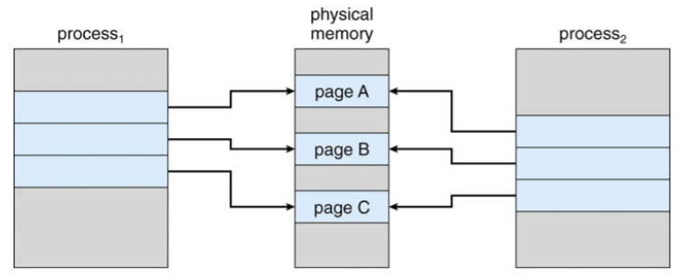

  - After process 1 modifies page C

    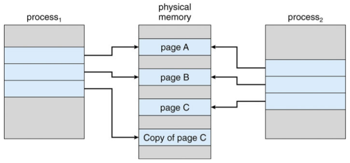


## Page Replacement

- Need for page replacement

  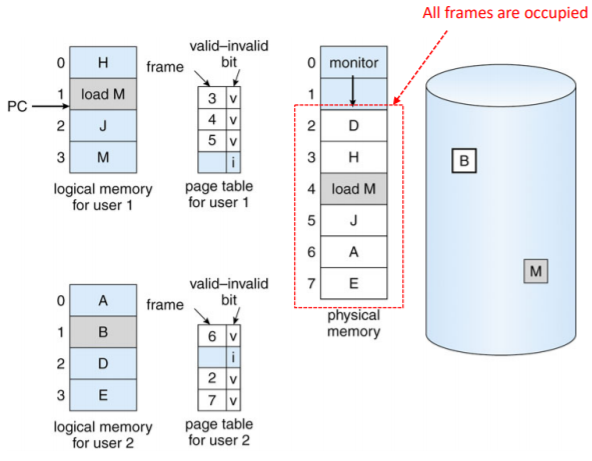

- free fame이 없는 경우

  - 메모리에서 일부 페이지를 찾았지만 실제로 사용하지 않는 페이지를 찾은 다음 교체 -> page replacement
  - 최소한의 페이지 폴트 수를 위한 페이지 교체 알고리즘 필요
  - 페이지 전송의 오버헤드를 줄이기 위해 비트 수정(dirty)
    - 수정된 페이지만 표시

- Basic page replacement

  1. 디스크에서 원하는 페이지의 위치 찾기
  2. free frame 찾기
     - 여유 프레임이 있으면 사용
     - 여유 프레임이 없는 경우 페이지 교체 알고리즘을 사용하여 victim frame을 선택
     - dirty(수정)한 경우 victim 프레임을 디스크에 기록
  3. 원하는 페이지를 (새로)free 프레임으로 가져옴. 페이지 및 프레임 테이블 업데이트
  4. 트랩을 유발한 명령을 다시 시작하여 프로세스를 계속함

- 이제 잠재적으로 페이지 폴트에 대해 2개의 페이지 전송이 발생 : EAT 증가

  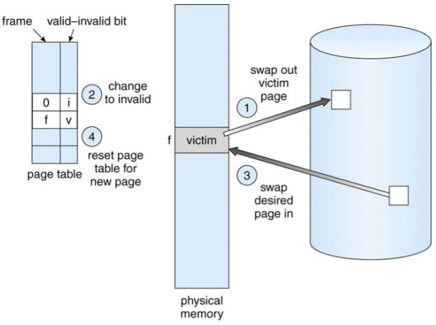


### Page and Frame Replacement Algorithm

- **Frame-allocation algorithm**
  - 각 프레세스에 제공할 프레임 수
  - 교체할 프레임
- **Page-replacement algorithm**
  - 첫번째 액세스와 재 액세스 모두에서 가장 낮은 페이지 오류율을 원함
- 특정 메모리 참조 문자열 (참조 문자열)에서 알고리즘을 실행하고 해당 문자열의 페이지 폴트 수를 계산하여 알고리즘을 평가
  - 문자열은 전체 주소가 아닌 페이지 번호일 뿐
  - 같은 페이지에 반복적으로 액세스해도 페이지 폴트가 발생하지 않음
  - 결과는 사용 가능한 프레임 수에 따라 다름
- 다음부터 나오는 모든 예에서 참조된 페이지 번호의 참조 문자열은
  - 7, 0, 1, 2, 0, 3, 0, 4, 2, 3, 0, 3, 0, 3, 2, 1, 2, 0, 1, 7, 0, 1


### Page Fault vs. The Number of Frames


### Page Replacement Algorithms

- FIFO page replacement
- Optimal page replacement
- LRU page replacement
- LRU-Approximation page replacement
  - Additional-Reference-Bits algorithm
  - Second-Chance algorithm
  - Enhanced Second-Chance algorithm
- Counting-Based page replacement
  - LFU algorithm
  - MFU algorithm


#### FIFO Algorithm

- Reference string

  - 7, 0, 1, 2, 0, 3, 0, 4, 2, 3, 0, 3, 0, 3, 2, 1, 2, 0, 1, 7, 0, 1

- 3 frames

  - 프로세스당 한번에 3페이지를 메모리에 저장할 수 있음

  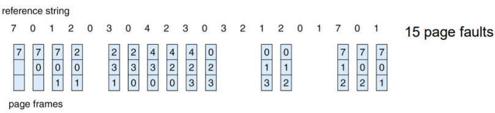

- **Belady's abnomaly**

  - More frames -> More page faults

- Reference string

  - 1, 2, 3, 4, 1, 2, 5, 1, 2, 3, 4, 5

  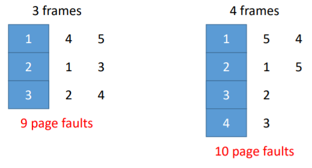


#### Optimal Algorithm

- 장기간 사용하지 않을 페이지 교체

  - 이것을 어떻게 알까
  - 알고리즘 성능 측정에 사용

  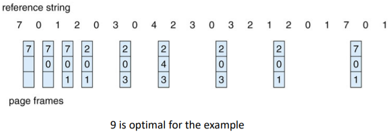


#### Least Recently Used(LRU) Algorithm

- 미래보다는 과거의 지식을 사용

- 가장 오래 사용하지 않은 페이지 교체

  - 마지막 사용 시간을 각 페이지와 연결

  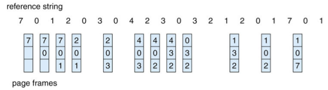

- 12 faults : FIFO보다는 좋지만 OPT보다는 나쁨
- 일반적으로 좋은 알고리즘이며 자주 사용됨
- 구현 방법은?


##### **Counter implementation**

- 모든 페이지 항목에 카운터 포함. 카운터를 통해 페이지를 참조할 때마다 시계를 카운터에 복사
- 페이지를 변경해야할 때 카운터에서 가장 작은 값을 찾음
  - 테이블 검색 필요


##### **Stack implementation**

- 페이지 번호의 스택을 더블 링크 형태로 보관
- 참조 페이지
  - move in to the top
  - 6개의 포인터를 변경해야 함
- 업데이트마다 비용이 많이 필요
- replacement를 위한 검색 없음
- LRU와 OPT는 Belady's Anomaly가 없는 스택 알고리즘의 경우

- Use of a stack to record most recent page references

  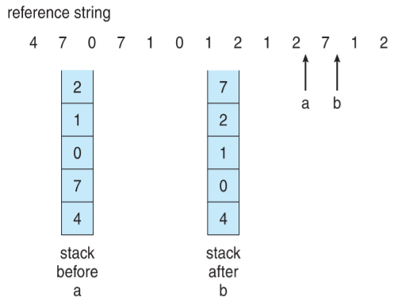


#### LRU Approximation Algorithms

- LRU는 특별한 하드웨어가 필요하고 여전히 느림
- **Reference bit**
  - 각 페이지의 비트는 0으로 초기화
  - 페이지 참조 비트가 1로 설정된 경우
  - 아무거나 기준 비트는 0으로 교체(존재하는 경우)
    - 우리는 순서를 모르지만


##### **Additional-Reference-Bits algorithm**

- 테이블의 각 페이지에 대한 8-비트 바이트
- 일정한 간격으로 OS는 각 페이지의 참조 비트를 8비트 바이트의 상위 비트로 이동하고 나머지 비트는 오른쪽으로 1비트 이동하고 하위 비트는 버림
  - 지난 8시간동안의 페이지 사용 내역
- 11000100 페이지는 01110111 페이지보다 최근에 사용됨


##### **Second-chance algorithm**

- 일반적으로 FIFO 및 하드웨어 제공 참조 비트
- Clock replacement
- 교체할 페이지가 있는 경우
  - Reference bit = 0 -> replace it
  - reference bit = 1 then:
    - reference bit를 0으로 설정하고 페이지를 메모리에 남겨둠
    - 동일한 규칙에 따라 다음 페이지 교체

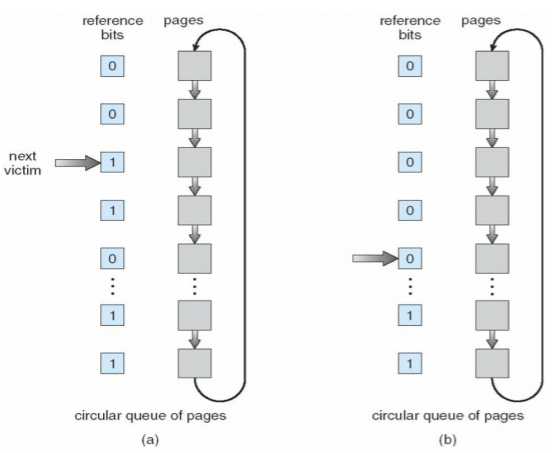


##### **Enhanced Second-Chance Algorithm**

- Reference bit + Modify bit

- Four possible cases

  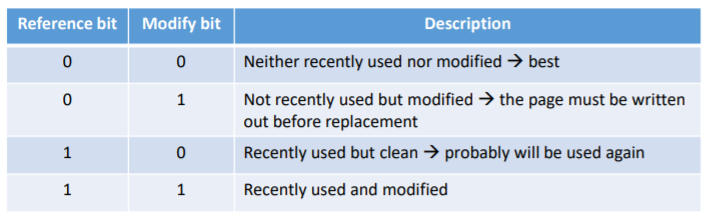

- 교체할 페이지를 찾기 전에 circular queue를 여러 번 스캔해야 할 수 있음


#### Counting -based Algorithm

- 각 페이지에 대한 참조 횟수 카운터 유지

- **LFU(Least Frequently Used) algorithm**

  - 카운터가 가장 작은 값을 가지는 페이지를 교체
  - 많이 사용된 페이지는 참조 횟수가 많다고 가정

- **MFU(Most Frequently Used) algorithm**

  - 카운터가 가장 많은 값을 가지는 페이지를 교체
    - 많이 참조된 페이지는 이제 다 사용했고 카운터가 적은 페이지가 아직 사용되지 않았고 많이 사용될 것이라 가정

- Page Replacement Examples

  - Page reference string
    - 1, 2, 3, 4, 2, 1, 5, 6, 2, 1, 2, 3, 7, 6, 3, 2, 1, 2, 3, 6

  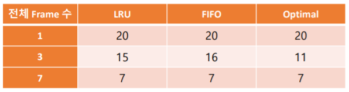


### Allocation of Frames

- 각 프로세스에는 최소 프레임 수 필요
  - 최소 프레임 수는 컴퓨터 아키텍처에 의해 정의
    - IBM 370 : MOVE 명령을 처리하는 6 페이지
      - Instruction : 6바이트(단어 이상), 2페이지 이상
      - 2 pages to handle from (in case of indirect addressing)
      - 2 pages to handle to(in case of indirect addressing)
- Frame allocation schemes
  - Fixed allocation vs. Priority allocation
  - Global allocation vs. Local allocation


#### Fixed Allocation

- **Equal allocation**

  - 예를 들어 100 프레임(OS용 프레임 할당 후)과 5개의 프로세스가 있는 경우 각 프로세스에 20프레임을 부여

- **Proportional allocation**

  - 프로세스 규모에 따라 할당

    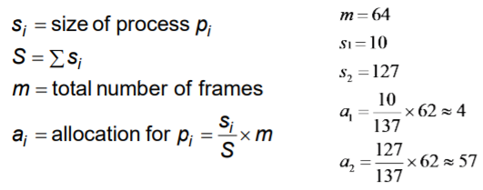


#### Priority Allocation

- 크기보다는 우선순위를 이용한 비례 할당 방식 사용
- 프로세스 P<sub>i</sub>에서 페이지 폴트가 발생하면
  - 프레임 중 하나를 교체하도록 선택
  - 우선순위가 낮은 프로세스에서 프레임 교체


#### Global vs. Local Allocation

- **Global replacement**
  - 프로세스는 모든 프레임 집합에서 교체 프레임을 선택
    - 한 프로세스가 다른 프로세스로부터 프레임을 가져올 수 있음
  - 하지만 프로세스 실행시간은 크게 다를 수 있음
  - 그러나 더 많은 처리량으로 더 일반적
- **Local replacement**
  - 각 프로세스는 자체 할당된 프레임 집합에서만 선택
  - 보다 일관된 프로세스별 성능
  - 하지만 메모리 사용률이 낮음


## Thrashing

- 프로세스에 "충분한" 페이지가 없으면 page fault 발생률이 매우 높음

  - 낮은 CPU 사용률
  - 운영체제는 다중 프로그래밍의 정도를 높여야한다고 생각
  - 시스템에 추가된 다른 프로세스

- Thrashing

  - 프로세스 내/외부로 페이지 교환이 진행 중

  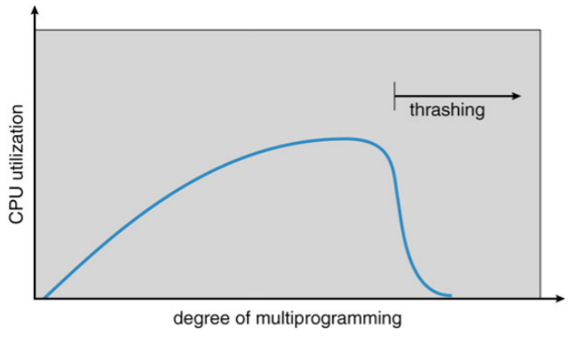

- Thrashing을 방지하려면 프로세스가 필요한 만큼 프레임을 제공해야 함

  - 필요한 프레임 수를 어떻게 알 수 있나
  - 프로세스 실행의 지역성 모델
    - Locality : 함께 적극적으로 사용되는 페이지 집합
      - Function call
    - 프로세스가 한 지역에서 다른 지역으로 마이그레이션
    - 지역이 겹칠 수 있음

- Thrashing이 발생하는 이유

  - 현재 지역의 크기 > 할당된 프레임의 크기

- Locality in a memory reference pattern

  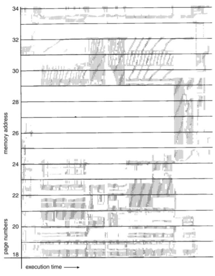


### Working-Set Model

- Based on locality

- ∆ ≡ the working-set window

  - 고정된 수의 페이지 참조(예: 1000 instructions)

- WS<sub>i</sub> ≡ the working-set of process P<sub>i</sub>

  - 가장 최근에 참조된 페이지 세트 ∆
  - 페이지가 활발하게 사용중인 경우 -> in the working-set

- WSS<sub>i</sub> ≡ the size of WS<sub>i</sub>

  - 만약 ∆가 엄청 작으면, 전체 지역을 포함하지 않음
  - 만약 ∆가 엄청 크면, 여러 지역을 포함

- D ≡ the total demand for frames = Σ WSS<sub>i</sub>

- if D > m -> Thrashing

  - m = 사용 가능한 총 프레임 수
  - 만약 D > m, 프로세스 중 하나를 일시 중지(suspend)

  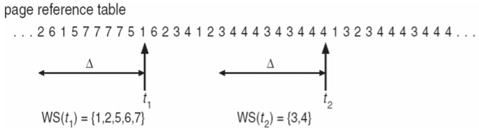

- Working set을 추적하는 방법

  - Approximate with interval timer + reference bit
  - Example : ∆ = 10,000 references
    - 각 페이지 당 2비트를 메모리에 보관
    - 매번 5,000 참조 후 타이머 인터럽트
      - 모든 참조 비트의 값을 복사하여 0으로 설정
    - 메모리의 비트중 하나는 1 -> working set의 페이지
  - 이것이 완전히 정확하지 않은 이유는 무엇인가
  - Improvement = 10 비트 그리고 1000시간 단위마다 인터럽트


### Page-Fault Frequency

- WSS 보다 더 직접적인 접근

- *"허용(acceptable)"* page-fault frequency(PFF) 비율을 설정하고 로컬 교체 정책(local replacement policy)를 사용

  - 실제 속도가 너무 낮으면 프로세스 프레임 손실
  - 실제 속도가 너무 높으면 프로세스 게인(gains) 프레임

  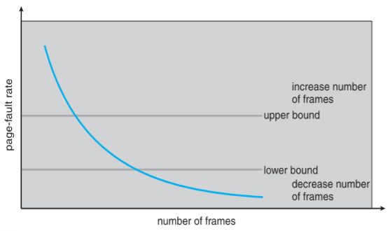


### Working-Set and page fault rate

- 프로세스의 Working Set과 페이지 오류 비율간의 직접적인 관게

- 시간에 따른 Working set 변경

- 시간에 따른 peaks와 valleys

  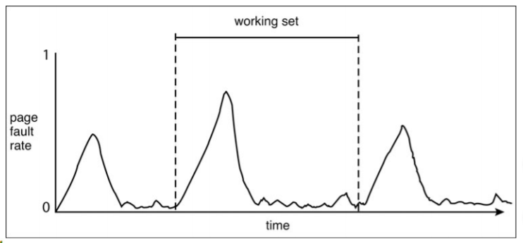


### Memory-Mapped Files

- Memory-mapped file I/O를 사용하면 디스크 블록을 메모리의 페이지에 매핑하여 파일 I/O를 일상적인 메모리 액세스로 처리 가능

- 처음에 demand paging을 이용하여 파일을 읽음

  - 파일 시스템에서 실제 페이지로 페이지 크기의 부분을 읽음
  - 파일의 후속 읽기/쓰기를 일반 메모리 액세스로 처리

- `read()` 및 `write()` 시스템 호출이 아닌 메모리를 통해 파일 I/O를 구동하여 파일 액세스를 단순화하고 속도를 높임

- 또한 여러 프로세스가 동일한 파일을 매핑하여 메모리에 있는 페이지를 공유할 수 있음

- 기록된 데이터는 언제 디스크에 저장되는가

  - 주기적으로 또는 파일 `close()` 시에
  - 예를들어 호출기(pager scans)가 더티 페이지(dirty pages)를 검색할 때

  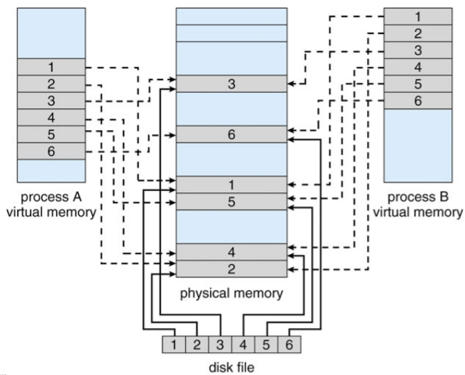


### Shared Memory via Memory-Mapped I/O

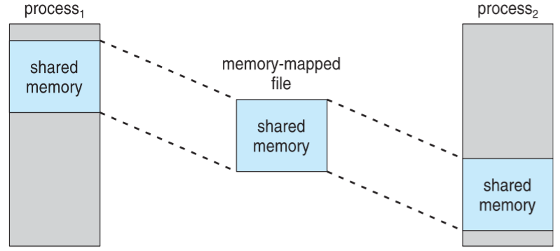


## Kernel Memory Allocation

- 사용자 메모리와 다르게 취급
- 사용 가능한 메모리 풀에서 할당되는 경우가 많음
- 다양한 크기의구조에 대한 커널 요청 메모리
  - 페이지 크기보다 작은 데이터 구조 -> 단편화(Fragmentation)
- 일부 커널 메모리 연속 필요
- 잘 알려진 두 가지 방법
  - Buddy system
  - Slab Allocation


#### Buddy System

- 물리적인 연속 페이지로 구성된 고정 크기 세그먼트에서 메모리 할당

- 2의 제곱 allocator를 사용하여 할당된 메모리

  - 2의 제곱으로 크기가 지정된 단위로 요청을 충족
  - 다음으로 높은 2의 제곱으로 반올림된 요청
  - 사용 가능한 것보다 더 작은 할당이 필요한 경우 현재 chunk는 다음으로 낮은 2의 제곱의 두 buddy로 분할
    - 적절한 크기의 chunk를 사용할 수 있을 때까지 반복

- 예를 들어 256KB chunk를 사용할 수 있다고 가정하면 커널이 21KB를 요청했을 때

  - 각각 128KB로 A<sub>L</sub> and A<sub>R</sub> 로 분할
    - 그리고 둘 중 하나는 64KB로 B<sub>L</sub> and B<sub>R</sub>로 더 분할
      - 32KB의 C<sub>L</sub> and C<sub>R</sub>에 1개 더 추가 -> 요청을 충족하기 위해

- 장점 : 사용하지 않는 chunk를 더 큰 chunk로 신속하게 통합

- 단점 : 단편화(fragmentation)

  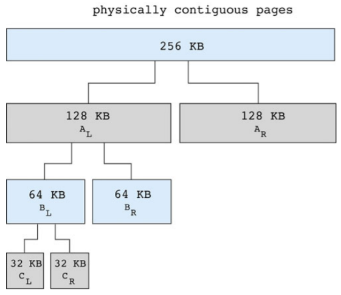


#### Slab allocation

- Slab는 물리적으로 인접한 하나 이상의 페이지

- 캐시는 하나 이상의 slab로 구성

- 각 고유 커널 데이터 구조별 단일 캐시

  - 오브젝트로 채워진 각 캐시 - 데이터 구조의 인스턴스화

- 캐시 생성시 사용 가능한 것으로 표시된 오브젝트로 채워짐

- 구조 저장시 사용된 것으로 표시된 오브젝트

- Slab가 사용된 오브젝트로 가득 찬 경우, 빈 slab에서 다음 오브젝트가 할당됨

  - 빈 slab가 없는 경우, 신규 slab 할당

- 단편화(fragmentation) 없음, 빠른 메모리 요청

  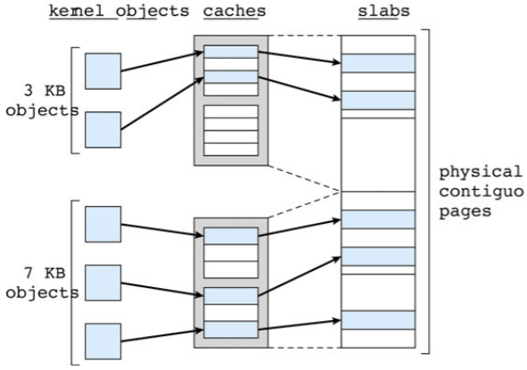


## Other Issues

- **Prepaging**

  - 프로세스 시작시 발생하는 많은 수의 페이지 폴트를 줄이려면
  - 프로세스에 필요한 페이지의 전부 또는 일부를 참조하기 전에 미리 페이지(Prepage)로 지정
  - prepage를 사용하지 않는 경우 -> I/O 및 메모리 낭비
  - s 페이지가 프리 페이징되고 페이지의 α가 사용된다고 가정
    - Cost of s*α saved page faults
    - Cost of prepaging s*(1-α) unnecessary pages
    - If α is close to 0, prepaging loses

- **Page size**

  - Fragmentation
  - Table size
  - I/O overhead
  - Lcality

- 항상 2의 제곱, 일반적으로 2<sup>12</sup>(4,096바이트) ~ 2<sup>22</sup>(4,194,304바이트) 범위

- 평균적으로 시간이 지남에 따라 커짐

- **TLB Reach**

  - TLB Reach : TLB에서 액세스 할 수 있는 메모리 양
    - TLB Reach = TLB size * page size
  - 이상적으로는 프로세스의 working-set이 TLB에 저장
  - TLB Reach를 높이기 위해
    - TLB의 항목 수를 늘리면 -> 비쌈
    - 페이지 크기를 늘리면 -> 단편화
    - 여러 페이지 크기를 지원하려면 -> OS에서 TLB를 관리해야 함

- **Program structure**

  - `int[128, 128] data;`

  - Each row is stored in one page

  - Program 1

    ```c
    for (j = 0; j < 128; j++)
    	for (i = 0; i < 128; i++)
    		data[i, j] = 0;
    ```

    128 * 128 = 16,384 page faults

  - Program 2

    ```c
    for (i = 0; i < 128; i++)
    	for (j = 0; j < 128; j++)
    		data[i, j] = 0;
    ```

    128 page faults

- **I/O Interlock**

  - I/O Interlock : 프로그램은 때때로 메모리에 잠가야함

  - Lock bit

    


##### Reference

- Provided by Operating Systems Concepts, 10th Edition