# 공룡책 정리

> [공룡책](http://www.yes24.com/Product/Goods/89496122) 내용을 정리한 내용입니다.
>
> https://parksb.github.io/article/5.html

## 목차

1. [Overview](#1-overview)
   - [What Operating Systems Do](#what-operating-systems-do)
   - [Computer-System Organization](#computer-system-organization)
   - [Storage Structure](#storage-structure)
   - [I/O Structure](#IO-structure)
   - [Direct Memory Access Structure](#direct-memory-access-structure)
   - [Computer-System Architecture](#computer-system-architecture)
   - [Operating System Structure](#operating-system-structure)
   - [Operating-System Operations](#operating-system-operations)
   - [Dual-Mode and Multimode Operation](#dual-mode-and-multimode-operation)
   - [Timer](#timer)
   - [Process Management](#process-management)
   - [Memory Management](#memory-management)
   - [Storage Management](#storage-management)
   - [Protection and Security](#protection-and-security)
   - [Kernel Data Structures](#kernel-data-structures)
   - [Computing Environments](#computing-environments)
2. [System Structures](2-system-structures)
   - [Operating-System Services](#operating-system-services)
   - [System Calls](#system-calls)
   - [Operating System Structure](#operating-system-structure)
3. [Process Concept](3-process-concept)
   - [Process State](#process-state)
   - [Process Control Block(PCB)](#process-control-block(pcb))
   - [Process Scheduling](#process-scheduling)
   - [Context Switch](#context-switch)
   - [Process Creation](#process-creation)
   - [Inter-Process Communication(IPC)](#inter-process-communication(IPC))
   - [Communications in Client-Server Systems](#communications-in-client-server-systems)
4. [Multithreaded Programming](4-multithreaded-programming)
   - [Threads](#Threads)
   - [Multithreaded Server Architecture](#multithreaded-server-architecture)
   - [Multicore Programming](#multicore-programming)
   - [Multithreading Models](#multithreading-models)
   - [Thread Library](#thread-library)
   - [Threading Issues](#threading-issues)
5. [CPU Scheduling](#5-cpu-scheduling)
   - [Basic Concepts](#basic-concepts)
   - [CPU Scheduler](#cpu-scheduler)
   - [Preemptive vs Nonpreemptive](#preemptive-vs-nonpreemptive)
   - [Dispatcher](#dispatcher)
   - [Scheduling Criteria](#scheduling-criteria)
     - [FCFS(First-Come, First-Served)](#fcfs(first-come-first-served))
     - [SJF(Shortest Job First) Scheduling](#sjf(shortest-job-first)-scheduling)
     - [SRF(Shortest Remaining Time First Scheduling)](#srf(shortest-remaing-time-first-scheduling))
     - [Priority Scheduling](#priority-scheduling)
     - [RR(Round Robin) Scheduling](#rr(round-robin)-scheduling)
     - [Multilevel Queue Scheduling](#multilevel-queue-scheduling)
     - [Multilevel Feedback Queue Scheduling](#multilevel-feedback-queue-scheduling)
   - [Thread Scheduling](#thread-scheduling)
     - [Multi-Processor Scheduling](#multi-processor-scheduling)
     - [Multi-Processor Scheduling - Load Balancing](#multi-processor-scheduling-load-balancing)
     - [Multicore Processors](#multicore-processors)
     - [Multithreaded Multicore System](#multithreaded-multicore-system)
   - [Real-Time CPU Scheduling](#real-time-cpu-scheduling)
     - [Priority-Based Scheduling](#priority-based-scheduling)
     - [Rate Monotonic Scheduling](#rate-monotonic-scheduling)
     - [Earliest Deadline First Scheduling(EDF)](#earliest-deadline-first-scheduling(EDF))
6. [Process Synchronization](#6-process-synchronization)
   - [Background](#background)
   - [Critical-Section Problem](#critical-section-problem)
   - [Peterson's Solution](#peterson's-solution)
   - [Synchronization Hardware](#synchronization-hardware)
   - [Mutex Locks](#mutex-locks)
   - [Semaphore](#semaphore)
   - [Semaphore Problems](#semaphore-problems)
   - [Monitor](#monitor)
   - [Condition variables](#condition-variables)
   - [Single Resource Allocation](#single-resource-allocation)
7. [Classic Problems of Synchronization](#7-classic-problems-of-synchronization)
   - [Round-Buffer Problem](#round-buffer-problem)
   - [Readers-Writers Problem](#readers-writers-problem)
   - [Dining-Philosophers Problems](#dining-philosophers-problems)
8. [Deadlock](8-deadlock)
   - [The Deadlock Problem](#the-deadlock-problem)
   - [System Model](#system-model)
   - [Deadlock Conditions](#deadlock-conditions)
   - [Resource Allocation Graph](#resource-allocation-graph)
   - [Methods for Handling Deadlocks](#methods-for-handling-deadlocks)
     - [Deadlock Prevention](#deadlock-prevention)
     - [Deadlock Avoidance](#deadlock-avoidance)
     - [Deadlock Avoidance Algorithms](#deadlock-avoidance-algorithms)
   - [Deadlock Detection](#deadlock-detection)
9. [Memory Management Strategy](#memory-management-strategy)
   - [Background](#background)
   - [Base and Limit Registers](#base-and-limit-registers)
   - [Address Binding](#address-binding)
   - [Logical vs Physical Address Space](#logical-vs-physical-address-space)
   - [MMU : Memory Management Unit](#mmu-:-memory-management-unit)
     - [Dynamic Linking](#dynamic-linking)
     - [Swapping](#swapping)
   - [Memory Allocation Schemes](#memory-allocation-schemes)
     - [Continuous Memory Allocation](#continuous-memory-allocation)
     - [Paging](#paging)
   - [Structure of the Page Tables](#structure-of-the-page-tables)
     - [Hierarchical Page Tables](#hierarchical-page-tables)
     - [Hashed Page Tables](#hashed-page-tables)
     - [Segmentation](#segmentation)
10. [Virtual Memory Management Strategy](10-virtual-memory-management-strategy)
    - [Background](#background)
    - [Virtual Memory Overview](#virtual-memory-overview)
    - [Demand Paging](#demand-paging)
    - [Page Replacement](#page-replacement)
      - [Page Replacement Algorithms](#page-replacement-algorithms)
    - [Thrashing](#thrashing)
    - [Kernel Memory Allocation](#kernel-memory-allocation)
    - [Other Issues](#other-issues)

---

# 1. Overview

## What Operating Systems Do

- 운영체제는 컴퓨터의 하드웨어를 관리하고, 하드웨어와 소프트웨어, 사용자를 매개하는 프로그램
- 커널은 운영체제의 핵심이며, 운영체제는 커널과 커널 모듈(Kernel module)들로 구성

### User View

- 운영체제는 사용자가 컴퓨터 자원 사용(Resource utilization)을 신경쓰지 않게 도우며, 사용자가 컴퓨터를 쉽게 이용할 수 있도록 만듬

### System View

- 시스템에게 운영체제는 자원 할당자(Resource Allocator)
- 운영체제는 많은 컴퓨터 자원들을 관리하는 제어 프로그램(Control program)으로서 동작


## Computer-System Organization

- 일반적인 컴퓨터 시스템은 여러 개의 CPU와 장치 컨트롤러(Device controllers)로 구성
- CPU와 장치 컨트롤러는 공통버스(Common bus)로 이루어져 메모리를 공유

### Computer Startup

- 컴퓨터를 부팅하면 부트스트랩 프로그램(Bootstrap program)이라는 초기화 프로그램 실행
- 프로그램은 ROM(Read-Only Memory)나 EEPROM(Electrically Erasable Programmable Read-Only Memory)에 저장
  - 주로 펌웨어(Firmware)라고 불림
- 부트스트랩 프로그램 실행 순서
  - 시스템을 초기화하고 부트로더(Boot loader)를 실행
  - 부트 로더는 운영체제를 실행
  - 커널이 로드, 실행되면 시스템과 사용자에게 서비스를 제공
- 일부 서비스는 커널 외부에서 제공
  - 이들은 부팅할 때 메모리에 로드되는 시스템 프로세스(System processes)나 시스템 데몬(System daemons)
  - 데몬은 프로세스로 백그라운드에서 돌면서 시스템 로그를 남기는 등의 여러 작업 수행

### Computer-System Operation

- 장치 컨트롤러는 CPU에게 이벤트 발생을 알리는데, 이벤트 발생을 알리는 것을 인터럽트(Interrupt)라고 부름
- 여러 작업을 동시에 처리하는데, 이때 당장 처리해야 하는 일이 생기면 인터럽트를 보내 기존의 작업을 잠시 중단하고 인터럽트를 처리한 뒤 기존 작업으로 돌아옴
- 하드웨어에서는 시스템 버스를 통해 CPU에 신호를 보냄으로써 인터럽트를 발생
- 소프트웨어는 시스템 콜(System call)이라는 특별한 명령으로 인터럽트를 발생

### Common Functions of Interrupts

- CPU가 인터럽트 신호를 받으면 일을 잠시 멈추고 메모리의 어떤 고정된 위치(Fixed location)을 찾음. 이 위치는 인터럽트 벡터(Interrupt vector)에 저장
- 인터럽트 벡터는 인터럽트를 처리할 수 있는 서비스 루틴(Service routine)들의 주소를 가지고 있는 공간, 파일 읽기/쓰기와 같은 중요한 동작들이 하드코딩되어 있음
- 인터럽트 아키텍처는 인터럽트된 명령어의 주소를 저장
  - 운영체제는 레지스터와 프로그램 카운터를 저장하여 CPU의 상태를 보존
- 인터럽트 손실을 방지하기 위해 다른 인터럽트가 처리되는 동안 들어오는 인터럽트는 비활성화
  - 트랩은 오류 또는 사용자 요청에 의해 발생하는 소프트웨어 생성 인터럽트
  - 운영체제는 interrupts driven
- 참고) 어떤 값을 0으로 나누는 것(Division by zero)도 인터럽트. 내부 인터럽트(Internal interrupt)는 예외(Exception)라고 부름


### Interrupt Handling

- 운영체제들은 대부분 인터럽트 주도적(Interrupt driven).
- 인터럽트가 발생하기 전까지 CPU는 대기 상태
- 폴링(Polling)의 경우 주기적으로 이벤트를 감시해 처리 루틴을 실행. 디바이스가 적은 것에 용이


## Storage Structure

- 커널은 실행기(Executor)를 통해 프로그램을 실행
  - 실행기는 기억장치(Storage)에서 exe 파일(Windows의 경우)을 가져옴
  - 커널이 이를 메인 메모리(보통 RAM(Random-Access Memory))에 로드되어 실행시킴
  - 하지만 RAM은 모든 프로그램을 담기에 너무 작고 비싸고 전원이 나가면 데이터가 사라지는 휘발성(Volatile) 장치
  - 보조기억장치 필요
- 비휘발성(Non-volatile) 기억장치 - 자기테이프(Magnetic tapes), 광학디스크(Optical disk), 자기디스크(Magnetic disk), SSD(Soli-State Disk)
- 휘발성 기억장치 - 메인 메모리, 캐시(Cache), 레지스터(Registers)
- 보조기억장치는 용량이 크고 저렴한 반면, 캐시나 레지스터는 용량이 작고 비쌈
- 최대절전모드는 메모리의 모든 데이터를 덤프해서 보조기억장치에 담고, 절전모드가 끝나면 덤프해둔 데이터를 불러와 그대로 작업수행(하이버네이트(Hibernate))


## I/O Structure

- 기억장치는 여러 입출력장치 중 하나. 다양한 입출력 장치가 있으며 입출력 컨트롤러는 각각 다른 장치를 담당
- 운영체제는 각 장치 컨트롤러를 제어하기 위한 장치 드라이버(Device Driver)를 가짐
- 입출력 명령 수행 과정
  - 장치 드라이버는 장치 컨트롤러의 레지스터 로드
  - 장치 컨트롤러는 레지스터에서 "키보드로부터 문자 읽어오기"와 같은 동작을 읽음
  - 읽은 동작을 장치에서 로컬 버퍼로 데이터를 전송
  - 전송이 끝나면 장치 컨트롤러는 장치 드라이버(CPU)에게 인터럽트를 통해 끝났음을 알림
  - 장치 드라이버는 통제권을 운영체제에게 돌려줌
- 사용자 프로그램은 커널과 사용자 프로그램을 매개하는 인터페이스인 시스템 콜을 통해 입출력을 요청


## Direct Memory Access Structure

- 과거에는 장치 데이터 처리를 CPU를 거쳐 메모리에 로드하는 방식 사용
- 인터럽트 기반 I/O는 높은 오버 헤드로 인해 대량 데이터 이동에 적합하지 않음
- CPU 자원을 너무 많이 소모하여 최근에는 DMA(Direct Memory Access)를 사용
- DMA는 장치와 메모리를 직접 연결하는 방식, 버스가 지원하는 기능
- 장치의 데이터는 장치 컨트롤러에 의해 직접 메모리에 전달되며, CPU에서는 데이터 이동이 완료되었다는 인터럽트만 한번 일어남
- 바이트 당 인터럽트가 아닌 블록 당 하나의 인터럽트만 생성


## Computer-System Architecture

- 현대 컴퓨터 시스템은 기본적으로 폰 노이만 구조를 따름


### Single-Processor Systems

- 실글 프로세서 컴퓨터는 하나의 메인 CPU만 탑재하여 장치에 따라 특별한 목적을 가진 프로세서가 들어감

### Multiprocessor Systems

- 멀티 프로세서 컴퓨터는 2개 이상의 프로세서를 가짐

- 멀티 프로세서 시스템의 장점

  1. 처리량(Throughput)의 증가 : 프로세서가 늘어나면서 더 빠른 시간안에 연산을 수행할 수 있음
  2. 규모의 경제: 여러 대의 싱글 프로세서 시스템을 구축하는 것보다 돈이 적게 든다. 주변장치(Peripherals)를 공유할 수 있기 때문
  3. 신뢰성의 증가: 기능이 여러 프로세서에 분산되면 하나의 프로세서가 작동을 멈춰도 전체 시스템은 느려질 뿐 멈추지 않음(우아한 성능저하(Graceful degradation)). 이렇게 성능을 저하함으로써 작업을 계속 유지하는 시스템을 장애 허용 시스템(Fault tolerant)라고 부름

- 멀티 프로세서 시스템은 비대칭 멀티 프로세싱(Asymmetric multiprocessing)과 대칭 멀티 프로세싱(Symmetric multiprocessing) 두가지로 나뉨

  - 비대칭 멀티 프로세싱
    - 관료주의적 회사
    - 보스 프로세서가 시스템을 제어, 다른 프로세서들은 보스의 지시를 받음
    - 부하 분산(Loadbalancing)을 효율적으로 할 수 있음
    - 하지만 보스 프로세서가 작동을 멈추면 다른 프로세서들도 작동을 멈춤
  - 대칭 멀티 프로세싱
    - 보스가 없는 자유로운 회사
    - 모든 프로세서들은 하나의 메모리를 공유. 동일한 작업을 병렬적으로 수행
    - 프로세서에 이상이 생기면 수행하던 작업을 다른 프로세서들에게 보내주고 재부팅

- 멀티 프로세서 시스템의 CPU들은 각자의 레지스터와 캐시를 갖고 있음

  

### A Dual-Core Design

- CPU가 늘어나면 프로세서간 통신을 하는데 많은 비용이 들어 효율이 계속 좋아지지 않음

- 최근 CPU 설계 트랜드는 하나의 칩(Chip)에 코어(Cores)를 늘리는 것(멀티코어)

- 코어는 동일한 성능의 CPU들을 1개의 칩 속에 접접한 것

- 칩 내부의 통신이(On-chip communication)이 칩 사이의 통신(Between-chip communication)보다 더 빠름

- 각 코어는 자신만의 레지스터와 로컬 캐시를 가짐(하나의 캐시를 공유하기도 함)

  

### Clustered Systems

- 클러스터 시스템은 여러 개의 CPU를 모아 놓은 구조
- 여러 개의 개별 시스템(또는 노드)들이 하나로 모여있다는 점에서 멀티프로세스 시스템과 조금 다름
  - 멀티프로세서 시스템은 여러 CPU가 하나의 시스템을 이룸
  - 클러스터 시스템은 여러 독립적인 시스템이 모여 하나의 시스템을 이룸(약결합(Loosely coupled))
- 클러스터링은 고가용성(High-availability) 서비스를 제공하기 위해 사용
- 비대칭 클러스터링(Asymmetric clustering)
  - 하나의 장비는 상시 대기 모드(Hot-standby mode)로 작동
  - 서버를 동작시키고 있는 다른 노드들은 모니터링만 수행
  - 서버에 문제가 생기면 상시 대기 노드가 서버로서 작동
- 대칭 클러스터링(Symmetric clustering)
  - 두 개 이상의 노드가 작업을 수행하는 동시에 다른 노드들을 모니터링하는 구조
  - 하드웨어의 자원을 최대로 사용할 수 있음
- 클러스터 시스템은 여러 개의 컴퓨터 시스템이 네트워크로 연결되는 구조
  - 고성능 컴퓨팅 환경(High-performance computing environments)를 제공
- 하지만 단일 시스템에 비해 유지보수가 힘듬. 성능이 네트워크 환경에 많은 영향을 받음


## Operating System Structure

- **멀티프로그래밍(Multiprogramming)** 은 여러 프로그램을 메모리에 로드해 두고 한 프로세스가 대기 상태가 되면 다른 프로세스의 작업을 수행하는 시스템
- 더 확장된 시스템이 **시분할(Time sharing) 시스템**(다른 말로는 멀티태스킹(Multitasking))
  - 프로세스마다 작업 시간을 정해두고 번갈아가면서 작업하는 방식
  - 이때 반응 시간(Response time)을 줄이는 것이 중요함(< 1초)
- 시분할과 멀티프로그래밍 시스템은 여러 작업들을 메모리에 올리는 방식
- 운영체제는 메모리에 자리가 없으면 어떤 작업을 먼저 처리할지 정해야 함
  - 이 과정을 작업 스케줄링(Job Scheduling), CPU 스케줄링(CPU Scheduling)
- 메모리를 너무 많이 사용하면 시간을 줄이기 위해 가상 메모리(Virtual memory)를 사용


## Operating-System Operations

- 운영체제는 인터럽트 기반.
  - H/W interrupt
  - S/W interrupts : trap(or exception)
    - Software error(divide by zero, stack overflows, ...)
    - Request for operating-system services -> System call
    - 기타 프로세스 문제에는 무한루프, 서로 수정하는 프로세스 또는 운영체제가 포함
- 인터럽트가 없다면 시스템은 조용히 인터럽트를 기다림
- 운영체제와 사용자는 컴퓨터의 하드웨어, 소프트웨어 자원을 공유
- 때문에 사용자 프로그램이 오류를 일으키지 않도록 방지해야 함
  - 무한 루프, 서로 또는 운영 체제를 수정하는 프로세스, ...
  - 잘못된(악성) 프로그램에 대한 적절한 보호 필요
    - Dual-Mode execution / Timer


## Dual-Mode and Multimode Operation

- 운영체제는 사용자 프로그램이 함부로 시스템에 접근하지 못하도록 유저 모드와 커널 모드로 나눔
- 하드웨어의 모드 비트가 0은 커널 모드 1은 유저 모드
- 하드웨어는 커널 모드일 때만 특권 명령(Privileged Instructions)를 실행
- 유저 모드에서 특권 명령을 실행하면 하드웨어는 막고 운영체제에게 트랩을 보냄
- System Call은 모드를 커널로 변경하고 호출에서 복귀하면 사용자에게 재설정


## Timer

- 운영체제는 사용자의 프로그램이 제어권을 운영체제에게 넘겨주지 않는 상황을 방지하기 위해 타이머를 사용

  - 무한 루프 / 프로세스 호깅 자원 방지를 위한 타이머

- 타이머는 운영체제에게 제어권을 보장하기 위해 특정 주기에 인터럽트를 발생

  


## Process Management

- 프로세스는 실행 중인 프로그램, 시스템 내의 작업 단위
- 디스크에 있으면 프로그램, 메모리에 로드되면 프로세스, 프로그램은 하나 프로세스는 여러개일 수 있음
- 프로그램은 수동적(Passive), 프로세스는 능동적(Active)
- 프로세스는 작업을 수행하기 위해 리소스가 필요
  - CPU, 메모리, I/O 파일
  - 초기화 데이터
- 프로세스는 프로그램이 어디까지 실행되었는지 체크하는 프로그램 카운터를 가지고 있음
- 단일 스레드 프로세스는 하나의 프로그램 카운터
- 다중 스레드 프로세스는 스레드당 하나의 프로그램 카운터
- 운영체제는 프로세스 관리를 위해 CPU에게 프로세스와 쓰레드를 스케줄링, 프로세스를 생성 및 제거
  - 또한 일시정지하거나 재실행, 프로세스의 동기화와 통신도 제공


## Process Management Activities

- 운영체제는 프로세스 관리에 관련하여 다음 활동을 담당
  - 사용자 및 시스템 프로세스 생성 및 삭제
  - 프로세스 일시정지 및 재개
  - 프로세스 동기화를 위한 매커니즘 제공
  - 프로세스 커뮤니케이션을 위한 매커니즘 제공
  - 교착(Deadlock) 상태 처리를 위한 매커니즘 제공


## Memory Management

- 메인 메모리는 현대 컴퓨터 시스템의 핵심, 방대한 바이트의 배열
- 프로그램이 실행될 때 프로그램은 절대 주소로 매핑되어 메모리에 로드
- 운영체제는 메모리 관리를 위해 메모리의 어떤 부분이 어디에 쓰이는지, 누가 사용하는지, 어떤 프로세스와 데이터가 메모리의 안팎으로 옮겨질지 결정
- 또한 메모리 공간을 할당하고 해제
- CPU 사용률과 사용자에 대한 컴퓨터의 응답 속도를 최적화하기 위해 메모리에 여러 프로그램이 보관 됨


## Storage Management

- OS는 정보 저장소에 대한 통일된 logical view를 제공
- 운영체제는 저장장치의 물리적 속성을 추상화해 파일이라는 논리적 저장 단위로 정의
- OS 가 파일을 물리적미디어에 매핑하고 스토리지 장치를 통해 이러한 파일을 애겟스

### File-System Management

- 운영체제는 파일을 생성, 제거, 읽기, 쓰기를 수행

### Mass-Storage Management

- 프로그램은 디스크에 담겨있으며, 메인 메모리에 로드되어 실행
- 많은 사람들이 제 3의 저장 장치(Tertiary Storage Devices)를 사용
- 저장 장치들은 WORM(Write-Once, Read-Many-Times)과 RW(Read-Write)형식에 차이가 있음
- NTFS, FAT가 파일 저장 형식, 이를 파일 시스템이라고 부름

### Caching

- 캐시는 굉장히 빠르고 작은 저장장치이며, 캐싱은 캐시 메모리를 사용해 컴퓨터의 속도를 높이는 기술
- 캐시에 자주 사용될 것 같은 데이터를 미리 담고 CPU나 디스크가 캐시의 데이터를 참조
- 파일의 중복성이 증가하지만 속도 역시 증가
- 캐싱은 지역성(Locality) 원리를 사용
- 시간 지역성(Temporal locality)
  - 한 번 접근한 데이터에 다시 접근할 확률이 높음
- 공간 지역성(Spatial Locality)
  - 특정 데이터와 가까운 메모리 주소에 있는 다른 데이터도 접근할 확률이 높음

### I/O System

- 운영체제는 모든 입출력 장치를 파일로 취급
- 오직 장치 드라이버만이 장치의 자세한 정보를 알고 있음


## Protection and Security

- 운영체제는 내외부로부터 컴퓨터를 보호하기 위해 다양한 활동을 함
  - 유저 모드와 커널 모드를 나눔
- 권한 확대(Privilege escalation)는 컴퓨터 시스템의 권한을 여러 층으로 나누고 사용자의 권한을 구분해 어떤 기준에 따라 사용자의 권한을 상승시키는 시스템
- 수직 권한 확대
  - 임의의 코드를 실행시켜 더 높은 권한을 얻는 행위
- 수평 권한 확대
  - 안드로이드 루팅, iOS 탈옥
- Protection
  - OS에 정의한 리소스에 대한 프로세스 또는 사용자의 액세스를 제어하는 매커니즘
  - 파일 액세스 제어 : 사용자 ID, 그룹 ID
- Security
  - 내부 및 외부 공격에 대한 시스템 방어
  - 사용자 인증(사용자 이름/암호)


## Kernel Data Structures

- 커널 구현에 사용되는 자료구조는 리스트, 스택, 큐, 링크드리스트, 트리

- 특히 트리는 상당히 효율적이기 때문에 자주 사용


## Computing Environments

- 모바일 컴퓨팅 환경
  - 컴퓨터의 접근성을 높이고 다양한 센서를 통해 사용자 인터페이스를 확장 시킴

- 이외의 컴퓨팅 환경
  - 분산형 컴퓨팅, 클라이언트-서버 컴퓨팅, P2P 컴퓨팅

  - 클라우드 컴퓨팅은 AWS를 통해 많이 알려짐

- 현대 컴퓨팅 환경의 특징 – 휴대성, 가상화, 멀티코어


## Open-Source Operating Systems

- 오픈소스 운영체제 개발에는 누구나 참여 가능하고 새로운 운영체제를 만들 수 있음
- ex) 리눅스


---

# 2. System Structures

## Operating-System Services

- 운영체제는 사용자와 시스템에게 다양한 서비스를 제공

  - UI(User Interface)
    - 사용자와 컴퓨터 시스템이 만나는 지점
    - 인터페이스는 크게 CLI(Command-Line Interface)와 배치 인터페이스(Batch Interface), GUI(Graphical User Interface)로 나뉨
      - CLI : 사용자가 텍스트 명령을 통해 명령을 내리는 인터페이스(셸 : shll)
      - 배치 인터페이스 : 명령을 파일에 포함시켜 파일이 실행되면 명령을 실행하는 인터페이스
      - GUI : 현재 가장 많이 쓰는 인터페이스로 사용자는 키보드, 마우스, 터치 등 다양한 방법으로 그래픽을 조작
  - 프로그램 실행(Program Execution)
    - 시스템은 프로그램을 메모리에 로드하고 이를 실행할 수 있어야함
  - 입출력 명령(I/O Operations)
    - 운영체제는 입출력 명령을 수행하는데 이때 효율과 보안을 위해 사용자가 직접입출력 장치를 조작하지 않고 자신을 거치게 함
  - 파일 시스템 조작(File-System Manipulation)
    - 파일을 쓰고, 읽고, 만들고 지움
  - 통신(Communications)
    - 프로세스끼리 정보를 교환할 때 운영체제는 공유 메모리(Shared Memory)나 메시지 패싱(Message Passing) 사용
    - 공유 메모리는 메모리의 한 부분을 공유
    - 메시지 패싱은 패킷을 주고받는 것(메시지 패싱 방식이 더 느림)
  - 에러 탐지(Error Detection)

- 시스템을 위한 서비스

  - 자원 할당(Resource Allocation)
  - 회계(Accounting)
    - 시스템은 어떤 유저가 어떤 종류의 자원을 얼마나 사용하고 있는지 계속 추적해야 함
  - 보호와 보안(Protection and Security)

  


## System Calls

- 시스템 콜은 커널과 사용자 프로그램을 연결하는 인터페이스
- OS에서 제공하는 서비스에 대한 프로그래밍 인터페이스
- 사용자 프로그램이 시스템에 접근하기 위해서는 커널 모드로 전환할 때 시스템 콜을 사용
- 일반적으로 고급 언어로 작성(C/C++)
- 시스템 호출을 직접 호출하지 않고 API를 통해 프로그램에서 주로 액세스
  - Win32 API, POSIX API, Java API
- 시스템 호출보다 API를 사용하는 이유
  - 프로그램 이식성
  - 사용하기 어려움
- 메모리의 특정 주소 범위에는 동작들이 할당됨
  - 이를 시스템 콜 테이블(System call table)이라고 부르며, 인터럽트 벡터(Interrupt vector)라고도 부름
- 시스템 콜은 메모리 주소의 모음인데 메모리 주소는 인터럽트 서비스 루틴(Interrupt Service Routine)을 가리키고 있음
  - 인터럽트 서비스 루틴은 시스템 콜 테이블이 가리키는 특정 메모리 주소가 어떤 동작을 할지 정의해 놓은 것
- 시스템 콜 함수를 직접 조작은 불편하고 위험해 표준 라이브러리 사용
- 사용자 프로그램이 운영체제에게 매개변수를 넘기는 방법
  - Call by Value
  - Call by Reference
  - 프로그램은 스택에 매개변수 추가, 운영체제를 통해 값을 뺌
- 일반적으로 각 시스템 호출과 관련된 번호
  - 시스템 호출 인터페이스는 이 숫자에 따라 색인된 테이블을 유지
- 시스템 호출 인터페이스는 OS 커널에서 의도한 시스템 호출을 호출하고 시스템 호출 상태 및 반환 값을 반환

> 시스템 콜 구현 코드
>
> https://blog.naver.com/jkjk010jkjk/222082419801


## System Call Parameter Passing

- OS에 매개변수를 전달하는데 사용되는 세 가지 일반적인 방법
  - 매개변수는 레지스터에 전달
    - 경우에 따라 레지스터보다 더 많은 매개변수가 필요
  - 메모리의 블록(또는 테이블)에 저장된 매개변수와 블록의 주소는 레지스터에 매개변수로 전달
  - 매개변수는 프로그램에 의해 스택에 푸시되고 운영체제에 의해 스택에서 팝됨
- 블록 및 스택 방법은 전달할 매개변수의 수 또는 길이를 제한하지 않음


## Types of System Calls

- 시스템 콜 구분
  - 프로세스 제어 : end, abort, load, execute
  - 파일 관리 : create, delete, open, close, read, write
  - 장치 관리 : read, write, request, release
  - 정보 유지 : get/set time or date
  - 통신 : send/receive messages, transfer status
  - 보호


## Operating System Structure

- 현대 운영체제는 계층을 나눠서 시스템을 관리
- 범용 OS는 매우 큰 프로그램
- 구조화하는 다양한 방법
  - Simple Structure : MS-DOS
  - More Complex : UNIX
  - Layered : an abstraction
  - Microkernel : Mach

### Simple Structure

- MS-DOS에서는 사용자 프로그램이 입출력 루틴에 접근해 직접 쓰기를 할 수 있었음
- 만약 사용자 프로그램에 문제가 생기면 전체 시스템에 문제가 생김
- UNIX 시스템은 이를 개선해 기능을 분리하였지만 여전히 하나의 계층이 일을 많이 함
- 하드웨어 계층 위, 사용자 계층 아래에 있는 커널이 모든 기능을 제공
- 이러한 모놀리틱(Monolithic) 구조는 구현과 유지보수가 어려움
- 최소한의 공간에서 가장 많은 기능을 제공하도록 작성됨
  - 모듈로 분리되지 않음
  - 일부 구조가 있지만 인터페이스와 기능 수준이 잘 분리되어 있지 않음

### Not Simple Structure - UNIX

- UNIX

  - 하드웨어 기능에 의해 제한됨
  - 원래 UNIX 운영체제는 구조화가 제한적

- UNIX OS는 분리 가능한 두 부분으로 구성

  - 시스템 프로그램
  - 커널
    - 시스템 호출 인터페이스 아래 및 물리적 하드웨어 위의 모든 것으로 구성
    - 파일 시스템, CPU 스케줄링, 메모리 관리 및 기타 운영체제 기능을 제공
    - 한 수준에 많은 기능이 있음

  

### Layered Approach

- 운영체제를 더 세분화해 계층을 분리한 것

- 가장 아래 계층이 하드웨어, 높은 계층은 사용자  인터페이스

- 유지보수가 편하고 하나의 계층을 수정해도 다른 계층까지 신경쓰지 않아도 됨

- **Benefits**

  - 구성 및 디버깅의 단순성

- **Detriments**

  - 다양한 레이어를 적절하게 정의하기 어려움
  - 다른 유형보다 덜 효율적
    - 시스템 호출은 모든 하위 계층을 거쳐야 하므로 각 계층에서 추가되는 오버헤드가 발생

  

### Microkernels

- 마이크로커널은 커널에서 핵심적인 요소만 남긴 가벼운 커널

- 커널에서 "사용자" 공간으로 이동

- 메시지 전달을 사용하여 사용자 모듈 간에 통신이 이루어짐

- **Benefits**

  - 코드 양이 적어 컴파일, 테스트 시간이 짧고 다른 시스템에 이식하기 쉬움
  - 마이크로 커널 확장이 쉬움
  - 안전함

- **Detriments**

  - 시스템 프로그램을 추가해 기능을 늘리면 속도가 느려짐
  - 커널 공간 통신에 대한 사용자 공간의 오버 헤드

  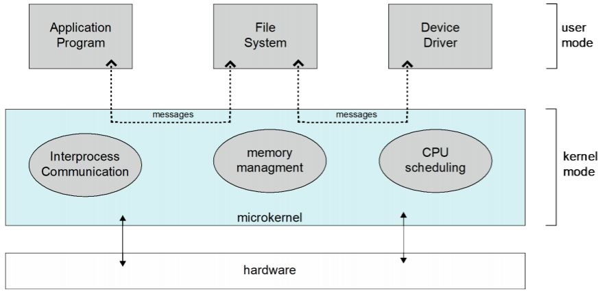

### Modules

- 많은 최신 운영체제는 로드 가능한 커널 모듈을 구현
- 객체 지향 접근 방식 사용
- 각 핵심 구성 요소는 분리되어 있음
- 모듈은 커널을 확장하기 위한 기술
  - 장치드라이버는 모두 모듈로 구현되어 있음
- 커널 전체를 컴파일할 필요없이 모듈만 컴파일하면 되고 필요할 때만 모듈을 동적으로 링크시켜 커널의 일부로 사용할 수 있어 효율적
- 모듈을 적용하면 자주 사용하지 않는 기능은 메모리에 상주시키지 않아도 됨
- 모듈의 사용은 확장성과 재사용성을 높일 수 있음
- 계층 접근 방식(Layered Approach)과 비교
  - 각 커널 섹션에 인터페이스가 정의되고 보호된다는 점에서 계층화된 접근 방식과 유사
  - 모든 모듈이 다른 모듈을 호출할 수 있어 더 유연
- 모듈을 사용하는 이유
  - 디바이스 드라이버와 같은 기능을 모듈 프로그램으로 개발하면 커널 전체를 컴파일할 필요없이 모듈만 컴파일하면 되고, 필요할 때만 모듈을 동적으로 링크시켜 커널의 일부로 사용할 수 있어 효율적
  - 모듈을 적용하여 자주 사용하지 않는 커널 기능은 메모리에 상주시키지 않아도 됨
- 마이크로 커널 방식과 비교
  - 기본 모듈이 다른 모듈을 로드하고 통신하는 방법에 대한 지식과 핵심 기능만 있다는 점에서 마이크로 커널 접근 방식과 유사
  - 모듈 간 통신에 메시지 전달이 필요하지 않다는 점에서 마이크로 커널 방식보다 우수

> 모듈 프로그래밍 예제
>
> - https://blog.naver.com/jkjk010jkjk/222082440797

### Hybrid Systems

- 커널의 핵심만 남기고 나머지는 따로 구현한 시스템
- OS X
  - BSD가 핵심이지만 나머지는 모두 애플이 구현
- 안드로이드
  - 리눅스 커널 위에 자체 구현한라이브러리를 올린 시스템


---

# 3. Process Concept

- 프로세스
  - 실행중인 프로그램
    - 프로세스 실행은 순차적으로 진행
  - 프로세스에 포함되는 것
    - 텍스트 섹션
    - 프로그램 카운터
    - 스택
    - 데이터 섹션
    - 힙
  - 현대 시간 공유 시스템의 작업 단위
- 프로세스의 종류
  - I/O 바운드 프로세스
    - 계산보다 I/O에 더 많은 시간을 소비
  - CPU 바운드 프로세스
    - 계산에 더 많은 시간을 소비


## Process State

- new : 프로세스가 처음 생성
- ready : 프로세서에게 할당되기를 기다릴 때
- running - 프로세서에 할당되어 실행될 때
- waiting - 실행 중 작업이 완료되어 기다릴 때
- terminated - 프로세스가 실행을 마침


## Process Control Block(PCB)

- 각자의 프로세스는 자신의 정보 묶음인 PCB를 가짐
- PCB에 담긴 정보
  - 프로세스 상태
  - 프로그램 카운터: 다음에 실행할 명령어의 위치
  - CPU 레지스터: 모든 프로세스 중심 레지스터의 내용
  - CPU 스케줄링 정보
  - 메모리 관리 정보
  - 회계 정보(Accounting Information)
  - I/O 상태 정보
- PCB는 프로세스마다 다룰 수 있는 모든 정보의 저장소 역할

### CPU Switch

- 프로세스가 실행되다가 인터럽트가 발생해 운영체제가 개입하여 프로세서에 할당된 프로세스를 바꿈

- CPU 스위치를 할 때는 프로세스의 PCB를 백업

  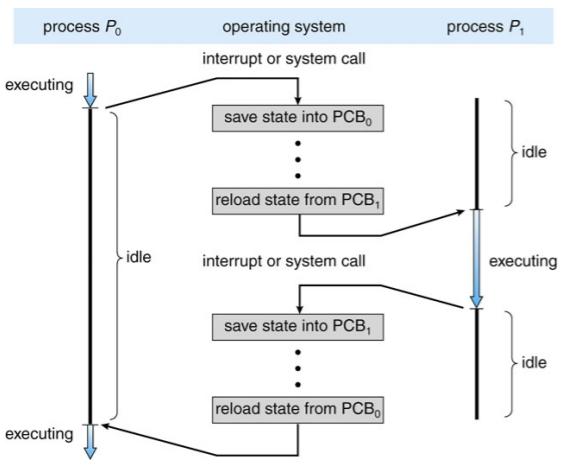

### Threads

- 프로세스를 쪼개 하나의 프로세스안에서 동시에 여러 작업을 처리


## Process Scheduling

- 어떤 프로세스를 프로세서에 할당할 것인가 결정하는 일
- CPU 사용 극대화, 시간 공유를 위해 CPU 로 신속하게 프로세스 전환
- 프로세스 스케줄러가 CPU에서 다음 실행을 위해 사용가능한 프로세스 중 선택
- 프로세스의 유지 관리 일정 대기열
  - Job Queue : 시스템 내 모든 프로세스 세트
  - Ready Queue : 메인 메모리에 상주하고, 실행 준비 및 대기 중인 모든 프로세스 세트
  - Device Queues : I/O 기기를 기다리는 프로세스 세트
- 다양한 대기열 간에 프로세스가 마이그레이션됨


## Scheduler

- Short-term Scheduler (or CPU Scheduler)
  - 다음에 실행할 프로세스를 선택하고 CPU를 할당
  - Short-term Scheduler 자주 호출(milliseconds) -> 빠르게 호출해야 함
- Long-term Scheduler (or Job Scheduler)
  - Ready queue로 가져와야 할 프로세스 선택
  - Long-term Scheduler가 간헐적으로 호출(초, 분) -> 느릴 수 있음
  - Long-term Scheduler가 멀티 프로그래밍의 정도를 제어
- 프로세스는 다음과 같이 설명
  - I/O 바인딩 프로세스 : 컴퓨팅보다 I/O를 수행하는데 더 많은 시간을 소비하며, 많은 짧은 CPU 버스트
  - CPU 바인딩 프로세스 : 컴퓨팅을 수행하는데 더 많은 시간을 소비하며 매우 긴 CPU 버스트는 거의 없음
- Long-term Scheduler가 원할한 프로세스 혼합을 위해 노력

### Addition of Medium-term Scheduling

- Multiple programming의 정도를 줄이기 위해 Medium-term Scheduler를 추가
  - 메모리에서 프로세스를 제거하고 디스크에 저장하고 디스크에서 다시 가져와 실행을 계속 : Swapping


## Context Switch

- 프로세스 실행 중에 인터럽트가 발생해 운영체제가 프로세서에 할당된 프로세스를 바꾸는 것
- 시스템은 작업중이던 프로세스의 상태를 저장하고 새로운 프로세스의 상태를 로드
- 컨텍스트는 내 시스템에서 활용가능한 모니터링된 정보들을 의미
- 프로세서 입장에서 컨텍스트는 PCB이기 때문에 PCB 정보가 바뀌는 것은 컨택스트 스위치임
- 컨텍스트 스위치는 오버헤드가 발생하는 작업이기 때문에 자주 일어나면 성능을 저하
  - OS와 PCB가 복잡할수록 컨텍스트 스위치가 길어짐
- 일부 하드웨어는 CPU당 여러 레지스터 집합을 제공 -> 한번에 여러 컨텍스트를 로드


## Process Creation

- 프로세스는 트리 구조로 되어있어 부모 프로세스가 자식 프로세스를 만듬

- PCB에 저장된 pid값으로 프로세스를 식별

  - pid는 운영체제가 정해준 고유번호

- 자원 공유 모드

  - 부모와 자녀가 모든 자원을 공유
  - 자녀는 부모 자원의 일부를 공유
  - 부모와 자녀가 자원을 공유하지 않음

- 실행모드

  - 부모와 자녀가 동시에 실행
  - 부모는 자녀가 종료될 때까지 대기

- 어드레스 스페이스 모드(Address Space Modes)

  - 자녀는 부모의 복제품
  - 자녀가 새 프로그램을 로드

- 프로세스 생성은 플라나리아 번식과 유사

- 관련 함수

  - fork() : 부모 프로세스는 자신과 똑같은 자식 프로세스를 생성
  - exec() - 자식 프로세스의 내용을 모두 바꿈

- fork()는 부모 프로세스에겐 자식 프로세스의 pid를 자식 프로세스에겐 0을 반환

- 부모 프로세스와 자식 프로세스는 동시에 작동

  

### Process Termination

- exit()를 호출하여 프로세스를 종료시킬 수 있음
- 부모 프로세스가 자식 프로세스보다 먼저 종료되면 자식프로세스는 그 상위 프로세스를 부모 프로세스로 바라봄
- 자식 프로세스가 종료되었는데, 부모 프로세스가 정보를 회수하지 않으면 자식 프로세스는 종료되었음에도 정보가 메모리에 남아 좀비 프로세스가 됨


## Inter-Process Communication(IPC)

- 프로세스는 독립적으로 동작하거나 서로 협력하며 동작할 수 있음

- 협력하는 프로세스들은 통신하며 서로에게 영향을 끼침

- 프로세스 협력 사유

  - 정보 공유
  - 연산 속도 향상
  - 모듈화
  - 편의성
  - 협력 프로세스 필요

- IPC 모델에는 메시지 패싱(Message Passing)과 공유 메모리(Shared Memory)가 존재

  

### Producer-Consumer Problem

- 생산자(Producer) : 정보를 생산하는 프로세스
- 소비자(Consumer) : 정보를 소비하는 프로세스
- 생산자-소비자 문제는 두 프로세스가 동시에 동작할 때 발생하는 이슈
- 보통 정보가 생산되는 속도가 소비하는 속도보다 빨리 동기화 문제가 발생
- 이를 해결하기 위해 생산된 데이터를 담아두는 버퍼를 사용
  - 유한 버퍼(Bounded buffer) : 크기에 한계가 있는 버퍼
  - 무한 버퍼(Unbounded buffer) : 버퍼의 시작과 끝을 붙여 크기가 무한한 버퍼

### Shared Memory

- 공유 메모리는 게시판

- 특정 메모리 공간을 두 프로세스가 함께 사용하며 정보를 주고 받음

- 커널을 거치지 않아 속도가 빠르지만 메모리에 동시 접근하는 것을 방지하기 위해 프로그래머가 따로 구현을 해줘야 함

- 생산자 및 소비자 프로세스가 Shared Memory 영역에서 항목의 버퍼(바운딩 또는 언바운딩)를 유지하는 방법

  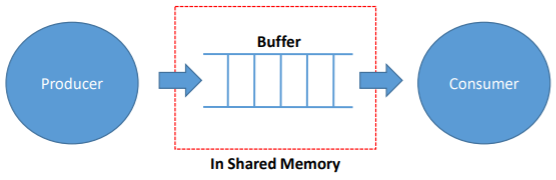

### Message Passing

- 메시지 패싱은 우편
- 송신 프로세스가 정보를 받는 수신 프로세스에게 커널을 통해 정보를 전달하고 수신 프로세스도 커널에 접근해 정보를 수신
- 메시지 패싱은 컨텍스트 스위치가 발생해 속도가 느리지만 커널이 기본적인 기능을 제공해 공유 메모리 방식보다 구현이 쉬움

### Implementaion Questions

- 링크는 어떻게 설정됩니까?
- 링크를 3개 이상의 프로세스로 연결할 수 있습니까?
- 각 통신 프로세스 쌍 사이에 몇 개의 링크가 있을 수 있는가?
- 링크의 용량은 얼마입니까?
- 링크가 수용할 수 있는 메시지의 크기가 고정 또는 가변적인가?
- 링크는 단방향인지 양방향인지

### Direct Communication

- 프로세스 상호간에 명시적으로 이름을 지정해야 함
  - Send(P, message) : 프로세스 P로 메시지 전송
  - Receive(Q, message) : 프로세스 Q로부터 메시지 수신
- 통신연결의 속성
  - 링크가 자동으로 설정됨
  - 정확히 하나의 통신 프로세스 쌍과 링크가 연결
  - 각 쌍 사이에 정확히 하나의 링크
  - 링크는 단방향 또는 양방향으로 할 수 있음

### Indirect Communication

- 우편함(mailboxes(또는 port))에서 메시지를 지시하고 수신

  - 각 메일박스마다 고유 ID가 있음
  - 메일박스를 공유해야만 프로세스가 통신할 수 있음

- 통신연결의 속성

  - 프로세스가 공통 메일함을 공유하는 경우에만 연계 설정
  - 여러 프로세스와 연계할 수 있음
  - 각 프로세스 쌍이 여러 통신 링크를 공유할 수 있음
  - 링크는 단방향 또는 양방향으로 할 수 있음

- 운영

  - 새 메일박스 생성
  - 메일박스를 통한 메시지 송수신
  - 메일박스 삭제

- 원형을 다음과 같이 정의

  - Send(M, message) : 메일박스 M으로 보내기
  - Receive(M, message) : 메일박스 M에서 메시지 수신

- Mailbox sharing

  - P<sub>1</sub>, P<sub>2</sub> and P<sub>3</sub> share a mailbox M

  - P<sub>1</sub> sends : P<sub>2</sub> and P<sub>3</sub> receive

  - Question : Who gets the message?

    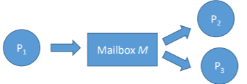

- Solutions

  - 링크를 최대 2개의 프로세스 연결
  - 한번에 하나의 프로세스만 수신 작업을 실행할 수 있도록 함
  - 시스템이 receiver를 임의로 선택할 수 있도록 함. sender에게 receiver가 누구였는지를 통지

### Synchronization

- 메시지 패싱의 동기화 문제를 해결하기 위해 blocking 방식과 Non-blocking 방식을 사용
- Blocking은 Synchronous로 간주
  - Blocking send : 수신자가 메시지를 받을 때까지 송신자는 block
  - Blocking receive : 메시지를 수신할 때까지 수신자 block
- Non-Blocking은 asynchronous로 간주
  - Non-blocking send : 송신자가 메시지를 보내고 계속 작업
  - Non-blocking receive : 수신자가 유효한 메시지나 Null메시지를 받음

### Buffering

- 링크에 첨부된 메시지 큐
  - 용량 제로(Zero capacity): 0 메시지
    - 송신자는 수신자를 기다려야 함(rendezvous)
  - 경계 용량(Bounded capacity): 한정된 길이의 n 메시지
    - 전송자는 대기열이 가득 찬 경우 대기해야 함
  - 무한 확장가능한 용량(Unbounded Capacity): 무한 확장
    - 송신자는 기다리지 않음


## Communications in Client-Server Systems

- Sockets
- Remote Procedure Call
- Pipes

### Sockets

- 소켓은 서버와 클라이언트가 통신하는 방식

- 소켓은 통신의 끝점으로 정의

- IP 주소와 포트정보가 있으면 클라이언트는 네트워크를 통해 서버 프로세스에 접근 가능

- RPC(Remote Procedure Calls)는 프로세스와 프로세스가 네트워크로 이어져 있을 때 발생하는 호출
  - 서버와 클라이언트가 통신할 때 IP주소와 포트를 래핑해 Stub를 만들어 전송

### Remote Proceduer Call

- RPC가 네트워크 시스템의 프로세스 간 프로시저 호출을 추상화
- Stub
  - 서버의 실제 절차에 대한 클라이언트 측 프록시
  - 클라이언트측 스텁에서 서버를 찾고 파라미터를 마샬링(Marshalls)
  - 서버측 스텁은 메시지를 수신하고, 마샬링된 파라미터의 포장을 풀고, 서버에서 절차를 수행
  - 윈도우즈의 경우 MIDL(Microsoft Interface Definition Language)로 작성된 사양에서 스텁 코드 컴파일
- Marshalling parameters


### Pipes

- 파이프는 부모 프로세스와 자식 프로세스가 통신할 때 사용하는 방식
- 파이프는 단방향 통신만 가능하기 때문에 양방향으로 통신하려면 두 개의 파이프 필요
- 파이프에 이름을 붙인 named pipe를 사용하면 부모-자식 관계가 아니여도 통신 가능
- 파이프는 두 가지 프로세스가 소통할 수 있는 통로 역할
- 파이프 구현시 이슈
  - 단방향(Unidirectional) vs 양방향(Bi-directional)
  - 반이중(Half duplex) vs 전이중(Full duplex)
  - 모든 관계(Any relationship)
  - 네트워크 시스템(Among networked system) vs 같은 기계(on the same machine)
- 파이프의 두 종류
  - Ordinary Pipes
  - Named Pipes

### Ordinary Pipes

- 표준 생산자 소비자 방식(standard producerconsumer fashion)으로 두 가지 프로세스가 소통

  - 생산자는 파이프의 한쪽 끝에 쓰고, 소비자는 다른 한쪽 끝에서 읽음

- 단방향(Unidirectional)

- 통신과정이 종료되고 나면 일반 파이프의 존립이 중단

- 생성 프로세스 외부에서 접근할 수 없음

  - 전형적인 부모 프로세스가 파이프를 만들어 fork()를 통해 생성한 자식 프로세스와 통신하는데 사용

  

### Named Pipes

- 양방향(Bidirectional)
- 부모-자식 관계 불필요
- 하나의 Named pipe가 설치되면 여러 프로세스가 이를 사용해 소통할 수 있음
- 통신 프로세스가 완료된 후에도 Named pipes가 계속 존재

#### Pipe와 Message Passing의 차이점

- Bit stream (Pipe) vs. Structured message (Message Passing)


---

# 4. Multithreaded Programming

## Threads

- 스레드는 프로세스의 작업 흐름. CPU 사용의 기본 단위
- 스레드 ID, 프로그램 카운터, 레지스터 세트 그리고 스택으로 구성
- 같은 프로세스에 속한 다른 스레드와 리소스 공유
  - 코드 섹션, 데이터 섹션, 기타 운영체제 리소스
- 싱글스레드(Single thread) – 하나의 프로세스가 한 번에 하나의 작업만 수행
- 멀티스레드(Multi thread) – 하나의 프로세스가 동시에 여러 작업을 수행
- 멀티프로그래밍 시스템이니까 프로세스를 여러 개 돌려도 되는데 스레드를 나누는 이유
  - 두 프로세스가 하나의 데이터를 공유하려면 메시지 패싱이나 공유 메모리 또는 파이프를 사용해야 하는데, 효율도 떨어지고 구현, 관리하기 번거로움
  - 프로세스 사이 컨텍스트 스위치가 계속 일어나면 성능 저하가 발생. 스레드 전환에도 컨텍스트 스위치가 일어나지만 속도가 빠름
- Motivation
  - 대부분의 최신 응용 프로그램은 다중 스레드
  - 응용 프로그램의 여러 작업을 별도의 스레드로 구현
    - 디스플레이 업데이트, 데이터 가져오기, 맞춤법 검사, ...
  - 프로세스 생성은 무겁고 스레드 생성은 가벼움
  - 코드 단순화 및 효율성 증대
  - 커널은 일반적으로 다중 스레드


## Multithreaded Server Architecture

- 서버와 클라이언트 사이에도 멀티스레드를 구현하여 사용
- 클라이언트가 서버에 요청을 보내면 서버는 새로운 스레드를 하나 생성해 요청을 수행
- 프로세스를 생성하는 것보다 스레드를 생성하는 것이 더 빠르기 때문


### Multithreaded Process


### Benefit

- 대응성(Responsiveness)
  - 프로세스의 일부가 차단되도 계속 실행될 수 있음
- 자원 공유(Resource Sharing)
  - 스레드는 공유 메모리 또는 메시지 패싱보다 쉽게 프로세스 리소스를 공유
- 경제(Economy)
  - 프로세스 생성보다 저렴하고 스레드 전환은 컨텍스트 전환보다 오버헤드가 낮음
- 확장성(Scalability)
  - 프로세스는 다중 프로세서 아키텍처를 활용


## Multicore Programming

- 멀티코어 또는 멀티프로세서 시스템을 구현할 때는 동시성(Concurrency)과 병렬성(Parallelism)을 알아야함

- 동시성

  - 싱글 프로세서 시스템에서 사용되는 방식으로 프로세서가 여러 개의 스레드를 번갈아가며 수행함으로써 동시에 실행되는 것처럼 보이게 하는 방식

- 병렬성

  - 멀티코어 시스템에서 사용되는 방식으로 여러 개의 코어가 각 스레드를 동시에 수행하는 방식

- Concurrent execution on single-core system

  

- Parallelism on a multi-core system

  

### Types of parallelism

- 데이터 병렬 처리(Data paralleism)
  - 동일한 데이터의 하위 집합을 여러 코어에 분산하고 각 코어에서 동일한 작업을 수행
- 작업 병렬 처리(Task parallelism)
  - 각 스레드가 고유한 작업을 수행하는 코어에 스레드를 분산


### User Threads and Kernel Threads

- 유저 스레드는 사용자 수준의 스레드 라이브러리가 관리하는 스레드
- 스레드 라이브러리
  - POSIX, Pthreads, Win 32 threads, Java threads
- 커널 스레드는 커널이 지원하는 스레드
  - 운영체제에서 직접 관리 및 지원
  - 안정적이지만 유저 모드에서 커널 모드로 계속 바꿔줘야하기 때문에 성능이 저하
  - Windows XP/2000, Solaris, Linux, Mac OS X
- 유저 스레드를 사용하면 안정성은 떨어지지만 성능이 저하되지는 않음


## Multithreading Models

- 유저 스레드와 커널 스레드의 관계를 설계하는 여러 모델

### Many-to-One Model

- 하나의 커널 스레드에 여러 스레드를 연결하는 모델
- 한 번에 하나의 유저 스레드만 커널에 접근 가능
- 멀티코어 시스템에서 병렬적인 수행 불가. 잘 사용되지 않음
- Examples
  - Solaris Green Threads
  - GNU Portable Threads

### One-to-One Model

- 하나의 유저 스레드에 하나의 커널 스레드가 대응하는 모델
- 동시성을 높여주고, 멀티프로세서 시스템에서는 동시에 여러 스레드를 수행할 수 있음
  - 하지만 유저 스레드가 늘어난만큼 커널 스레드도 늘어나는데, 커널 스레드를 생성하는 것은 오버헤드가 큰 작업이라 성능 저하가 발생할 수 있음
- Many-to-One보다 많은 동시성
- Examples
  - Windows
  - Linux
  - Solaris 9 이상

### Many-to-Many Model

- 여러 유저 스레드에 더 적거나 같은 수의 커널 스레드가 대응하는 모델
- 운영체제는 충분한 수의 커널 스레드를 만들 수 있으며, 커널 스레드의 개수는 프로그램이나 작동기기에 따라 다름
- 멀티프로세서 시스템에서는 싱글 프로세서 시스템보다 더 많은 커널 스레드가 생성
- Examples
  - Solaris 9 이전 버전
  - ThreadFiber패키지가 있는 WIndows

### Two-level Model

- Many-to-Many 모델과 비슷한데, 특정 유저 스레드를 위한 커널 스레드를 따로 제공
- 점유율이 높아야되는 유저 스레드를 더 빠르게 처리 가능
- Examples
  - IRIX
  - HP-UX
  - Tru64 UNIX
  - Solaris 8 이하


## Thread Library

- 스레드 라이브러리는 프로그래머에게 스레드 생성 및 관리를 위한 API를 제공
- 두 가지 주요 구현 방법
  - 라이브러리 전체가 사용자 공간에 있음
  - 운영체제에서 지원하는 커널 수준 라이브러리
- Examples
  - Pthread
    - 스레드 생성 및 동기화를 위한 POSIX 표준(IEEE 1003.1c)
    - API는 스레드 라이브러리 동작을 지정하며 구현은 라이브러리 개발에 달려 있음
    - 사용자 수준 또는 커널 수준 중 하나
  - Java Thread
    - JVM에서 관리
    - 일반적으로 기본 운영체제에서 제공하는 스레드 모델을 사용하여 구현


## Threading Issues

- fork() 및 exec() 시스템 호출의 의미
- 대상 스레드의 스레드 취소
  - 비동기 또는 지연
- 신호 처리(Signal handling)
- 스레드 풀(Thread Pools)
- 스레드 별 데이터(Thread-specific data)
- 스케줄러 활성화(Scheduler Activation)
- Many-to-Many and Two-level models

### Semantics of fork() & exec() system calls

- fork()는 호출하는 스레드만 복제합니까, 아니면 모든 스레드를 복제합니까?
  - 일부 UNIX에는 두 가지 버전의 fork가 존재
- exec()는 일반적으로 정상적으로 작동
  - 모든스레드를 포함한 실행중인 프로세스 교체

### Signal Handling

- signal은 UNIX 시스템에서 특정 이벤트가 발생했음을 프로세스에게 알리기위해 사용
- 시그널 핸들러를 사용하여 시그널 처리
  1. 특정 이벤트에 의해 신호 발생
  2. 신호가 프로세스로 전달
  3. 신호는 두 신호 핸들러 중 하나에 의해 처리
     1. 기본
     2. 사용자 정의
- 모든 신호에는 커널이 신호를 처리할 때 실행하는 기본 핸들러가 있음
  - 사용자 정의 신호 처리기는 기본값을 무시할 수 있음
  - 단일 스레드의 경우 프로세스에 전달되는 신호
- 멀티 스레드를 위한 신호는 어디로 전달되어야 하는가?
  - 신호가 적용되는 스레드로 신호 전달
  - 프로세스의 모든 스레드에 신호 전달
  - 프로세스의 특정 스레드에 신호 전달
  - 특정 스레드를 할당하여 프로세스에 대한 모든 신호를 수신

### Thread Pools

- 스레드를 요청할 때마다 매번 새로운 스레드를 생성, 수행, 삭제를 반복하면 성능 저하
- 그래서 미리 스레드 풀에 여러 개의 스레드를 만들어두고 요청이 오면 스레드 풀에서 스레드를 할당해주는 방법을 사용

### Thread Cancellation

- 스레드가 끝나기 전에 종료

- 취소할 스레드는 대상 스레드

- 두가지 일반적인 접근 방식

  - 비동기 취소는 대상 스레드를 즉시 종료
  - 지연된 취소(Deferred cancellation)는 대상 스레드가 취소해야하는지 주기적으로 확인

- 스레드 생성 및 취소를 위한 Pthread 코드

  ```c
  pthread.t tid;
  
  /* create the thread */
  pthread.create(&tid, 0, worker, NULL);
  ...
  /* cancel the thread */
  pthread.cancel(tid);
  ```

- 스레드 취소를 호출하면 취소를 요청하지만 실제 취소는 스레드 상태에 따라 다름

  

- 스레드에 취소가 비활성화된 경우 스레드가 활성화될 때까지 취소가 보류

- 기본 유형은 연기

  - 취소는 스레드가 취소 지점에 도달했을 때만 발생
    - 즉, pthread_testcancel()
    - 그런 다음 cleanup handler가 호출

- Linux 시스템에서 스레드 취소는 신호를 통해 처리

### Thread-Local Storage

- TLS를 사용하면 각 스레드가 자체 데이터 사본을 가짐
- 스레드 생성 프로세스를 제어할 수 없을 때 유용(즉, 스레드 풀을 사용할 때).
- 지역변수와 다름
  - 단일 함수 호출 중에만 보이는 지역 변수
  - 함수 호출시 TLS 표시
- 정적 데이터와 유사
- TLS는 각 스레드마다 고유

### Scheduler Activations

- 다대다 및 2레벨 모델 모두 애플리케이션에 할당된 적절한 수의 커널 스레드를 유지하기 위해 통신이 필요
- 일반적으로 사용자와 커널스레드 사이에 중간 데이터 구조 사용 - 경량 프로세스(lightweight process, LWP)
  - 프로세스가 사용자 스레드를 실행하도록 예약할 수 있는 가상 프로세서로 나타남
  - 커널 스레드에 연결된 각 LWP
  - 생성할 LWP는 몇개입니까?
- 스케줄러 활성화는 상향 호출(upcalls)을 제공
  - 커널에서 스레드 라이브러리의 상향 호출 핸들러로의 통신 메커니즘
- 이 통신을 위해 애플리케이션은 올바른 수의 커널 스레드를 유지할 수 있음

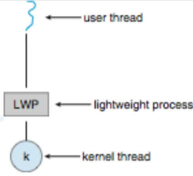


---

# 5. CPU Scheduling

## Basic Concepts

- 멀티 프로그래밍은 CPU 활용도를 최대로
  - 멀티 프로그래밍은 작업(코드 & 데이터)을 구성하므로 CPU는 항상 실행 가능
- CPU-I/O Burst Cycle
  - 프로세스 실행은 CPU 실행과 I/O wait 주기로 구성
  - CPU 버스트에 이어 I/O 버스트
  - CPU 버스트 분포가 주요 관심사


## CPU Scheduler

- 메모리에서 실행할 준비가 된 프로세스 중 하나를 선택하고 CPU를 할당(a.k.a short-term scheduler)

- CPU 스케줄링 프로세스 과정

  1. 실행에서 대기 상태로 전환(예:I/O 요청)

  2. 실행에서 준비 상태로 전환(예: 인터럽트)
  3. 대기에서 준비로 전환(예: I/O 완료)
  4. 종료
     - 1과 4 의 스케줄링은 비선점적(nonpreemptive)
     - 2와 3은 선점적(preemptive)또는 협력적(cooperative)
       - 공유 데이터에 대한 엑세스 고려
       - 커널 모드에서 선점 고려
       - 중요한 OS 활동 중에 발생하는 인터럽트 고려


## Preemptive vs Nonpreemptive

- 비선점 스케줄링에서 CPU가 프로세스에 할당되면 프로세스는 종료하거나 대기 상태로 전환하여 CPU를 해제할 때까지 CPU를 유지
- 특정 H/W 플랫폼에서 사용할 수 있는 유일한 방법은 선점 스케줄링
  - 선점 스케줄링에 필요한 특수 H/W(예: 타이머) 필요
- 선점적 스케줄링은 공유 데이터에 대한 엑세스와 관련된 비용을 발생시킴
  - 세심한 조정없이는 데이터 불일치가 발생할 수 있음


## Dispatcher

- 운영체제가 프로세스를 프로세서에 할당하는 것을 디스패처(Dispatcher)라고 함
- Dispatcher 모듈은 CPU 스케줄러가 선택한 프로세스에 CPU를 제어
  - 컨텍스트 전환(Switching context)
  - 사용자 모드로 전환(Switching to user mode)
  - 프로그램을 다시 시작하기 위해 사용자 프로그램의 적절한 위치로 점프
- Dispatch latency
  - 디스패처가 한 프로세스를 중지하고 다른 프로세스를 시작하는데 걸리는 시간


## Scheduling Criteria

- 운영체제가 레디 큐에 있는 프로세스들 중에서 어떤 프로세스를 디스패치할 것인가 정하는 것이 프로세스 스케줄링
- 대표적인 스케줄링 알고리즘
  - FCFS, SJF, SRF, RR, Multilevel Queue Scheduling, Multilevel Feedback Queue Scheduling
- 알고리즘 평가
  - 수행시간(Burst Time)
  - CPU 사용량(CPU Utilization)
    - CPU를 가능한 한 바쁘게 유지
  - 단위 시간 당 끝마친 프로세스의 수(Throughput)
    - 시간 단위당 실행을 완료한 프로세스 수
  - 프로세스가 레디 큐에서 대기한 시간부터 작업을 완료할 때까지 걸린 시간(Turnaround time)
  - 레디 큐에서 대기한 시간(Waiting Time)
  - 프로세스가 처음으로 CPU를 할당받기까지 걸린시간(Response Time)
- CPU 사용률 및 처리량을 최대화하고 처리시간, 대기시간 및 응답시간을 최소화
- 평균보다 최소 및 최대값 최적화
- 응답시간의 분산 최소화(대화형 시스템)


## FCFS(First-Come, First-Served)

- 먼저 들어온 프로세스를 먼저 프로세서에 할당하는 방식
- 구현이 쉬워서 간단한 시스템에 자주 사용됨
- 수행시간이 큰 프로세스가 먼저 들어오면 그 뒤에 들어온 프로세스들이 오랜시간을 기다리게 되는 콘보이 효과(Convoy Effect)가 발생
- 비선점 스케줄링 방식
- FCFS 정책에 따른 평균 대기시간은 최소가 아니며 프로세스 CPU 버스트 시간의 순서가 달라짐에 따라 크게 달라질 수 있음
- Convoy Effect
  - 더 짧은 프로세스가 먼저 진행될 경우 가능할 수 있는 CPU 및 장치 사용률을 낮춤


## SJF(Shortest Job First) Scheduling

- 프로세스의 수행시간이 짧은 순서에 따라 프로세서에 할당
  - 프로세스의 다음 CPU 버스트가 동일하면 FCFS 스케줄링이 사용
- 콘보이 효과를 해결할 수 있음
- 최적 알고리즘이지만 수행시간을 정확히 알 수 없음
  - 주어진 프로세스 세트에 대해 최소 평균 대기 시간을 제공
  - 다음 CPU 요청의 길이를 아는게 어려움
    - 과거 히스토리를 기반으로 예측
      - 이전 CPU 버스트 측정된 길이의 지수 평균
      - 국소 선형 회귀 기법(Local linear regression technique)
    - 사용자 지정 값
- 버스트 시간이 큰 프로세스는 계속 뒤로 밀려나는 기아(Starvation)이 발생
- 비선점 스케줄링 방식


## SRF(Shortest Remaining Time First) Scheduling

- 프로세스의 남은 수행시간이 짧은 순서에 따라 프로세서에 할당
- SJF에 발생하는 기아 문제를 해결할 수 있음
- 수행 중 다른 프로세스보다 남은 수행시간이 적어지면 운영체제가 개입해 자리를 바꾸는 선점 스케줄링 방식


## Priority Scheduling

- 특정 기준으로 프로세스에게 우선순위를 부여해 우선순위에 따라 프로세서에 할당
  - 동일 우선 순위 프로세스는 FCFS 순서로 예약
  - 우선 순위는 내부 또는 외부에서 정의
- SJF는 우선순위가 다음 CPU 버스트 예측인 우선 순위 스케줄링
- 프로세스를 에이징(Aging)해서 오래 대기한 프로세스의 우선순위를 높이는 방식으로 사용
- 다른 스케줄링 알고리즘과 결합해 사용할 수 있어 선점, 비선점 모두 가능
- Problem
  - 높은 우선 순위 프로세스가 지속적으로 들어오면 낮은 우선 순위 프로세스가 CPU를 얻지 못할 수 있음
    - 무기한 차단(Indefinite Blocking) or 기아(Starvation)
  - 기아는 aging으로 해결
    - 시스템에서 오랫동안 대기하는 프로세스의 우선순위를 점차 증가


## RR(Round Robin) Scheduling

- 각 프로세스는 보통 10~100ms의 적은 수의 CPU 시간(시간 양자)을 얻음. 이 시간이 경과하면 프로세스가 선점되고 준비 대기열 끝에 추가

- 일정 시간 할당량(Time Quantum) 단위로 여러 프로세스를 번갈아가며 프로세서에 할당

- 시스템의 time-sharing과 같은 방식

- 반응성이 좋음

- 우선순위 스케줄링과 결합해 프로세스의 시간 할당량을 조절하는 방식으로 활용

- 시간 할당량에 따라 운영체제가 계속 개입하는 선점 스케줄링 방식

- 레디 큐에 n개의 프로세스가 있고 시간 퀀텀이 q이면 각 프로세스는 한번에 최대 q개의 시간단위 청크(chunk)에서 CPU 시간의 1/n을 얻음

  - (n-1)*q 시간 단위 이상 대기하는 프로세스 없음

- RR의 성능은 시간 퀀텀(q)의 크기에 따라 다름

  - q가 매우 크면 FCFS

  - q가 매우 작으면 프로세스 공유(1/n 속도로 실행하는 효과)

  - q는 컨텍스트 전환시간 보다 커야함

    

- 처리시간(Turnaround)은 타임퀀텀의 크기에 따라 달라짐

  - 대부분의 프로세스가 다음 CPU 버스트를 단일 시간 퀀텀으로 완료하면 평균 처리 시간이 향상될 수 있음

    

- 경험 법칙(A rule of thumb)

  - CPU 버스트의 80%는 시간 퀀텀보다 짧아야함


## Multilevel Queue Scheduling

- 레디 큐는 별도의 대기열로 분할
  - foreground(대화형: interactive)
  - background(batch)
- 주어진 대기열에서 영구적으로 처리
- 각 대기열에는 자체 스케줄링 알고리즘 있음
  - foreground - RR
  - background - FCFS
- 스케줄링은 대기열간에 이루어져야 함
  - 고정 우선 순위 스케줄링(Fixed Priority Scheduling)
    - 즉 foreground에서 모두 게재한 다음 background에서 게재
    - 기아(Starvation)의 가능성
  - 타임 슬라이스(Time Slice)
    - 각 큐는 프로세스간에 일정을 잡을 수 있는 일정량의 CPU시간을 얻음
      - RR의 foreground에 대해 80%
      - FCFS의 background에 20%


## Multilevel Feedback Queue Scheduling

- 프로세스는 다양한 대기열 사이를 이동할 수 있음
- 이러한 형태의 aging은 starvation을 에방

- Multilevel Feedback Queue Scheduling은 다음 매개변수를  정의
  - 대기열 수
  - 대기열 별 스케줄링 알고리즘
  - 프로세스 업그레이드 시기에 사용되는 방법
  - 프로세스 강등시기에 사용되는 방법
  - 서비스가 필요할 때 프로세스가 들어갈 대기열을 결정하는데 사용되는 방법
- Example
  - Tree queues
    - Q<sub>0</sub> - RR with time quantum 8ms
    - Q<sub>1</sub> - RR with time quantum 16ms
    - Q<sub>2</sub> - FCFS
  - Scheduling
    - 스케줄러는 먼저 Q<sub>0</sub>의 모든 프로세스를 실행
    - Q<sub>0</sub>가 비어있을 때만 Q<sub>1</sub>의 프로세스가 실행
    - Q<sub>2</sub>의 프로세스는 Q<sub>0</sub>와 Q<sub>1</sub>이 비어있는 경우에만 실행
    - 1분기에 도착한 프로세스는 2분기에 프로세스를 선점
    - 마찬가지로 Q<sub>1</sub>의 프로세스는 Q<sub>0</sub>에 도착하는 프로세스에 의해 차례로 선점

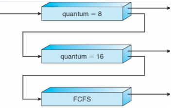


## Thread Scheduling

- 사용자 수준 스레드와 커널 수준 스레드 구분
- 스레드가 지원되면 프로세스가 아닌 스레드가 scheduled
- 다대일 및 다대다 모델, 스레드 라이브러리는 LWP에서 실행할 사용자 수준 스레드를 schedules
  - 일정 경쟁이 프로세스 내에 있기 때문에 PCS(프로세스 경쟁 범위)라고 함
  - 일반적으로 프로그래머가 설정한 우선순위를 통해 수행
- 사용가능한 CPU에 스케줄된 커널 스레드는 시스템 경합 범위(SCS:system-contention scope) - 시스템의 모든 스레드 간의 경쟁


## Multi-Processor Scheduling

- 여러 CPU를 사용할 수 있는 경우 CPU 스케줄링이 더 복잡해짐
- 멀티 프로세서 내의 동종 프로세서(Homogeneous processors)
- 비대칭 다중처리(Asymmetric Multiprocessing) 
  - 단 하나의 프로세서만 시스템 데이터 구조에 액세스하여 데이터 공유의 필요성을 완화

- SMP(Symmetric Multiprocessing)
  - 각 프로세서는 자체 스케줄링, 모든 프로세스는 공통 레디 큐에 있거나 각 프로세서에는 자체 레디 프로세스의 개인 레디 큐가 있음
    - 현재 가장 일반적
- 프로세서 선호도(Processor affinity)
  - 프로세스는 현재 실행중인 프로세서에 대한 선호도를 가짐
    - soft affinity
    - hard affinity
    - 프로세서 세트를 포함한 변형


## Multi-Processor Scheduling - Load Balancing

- SMP인 경우 효율성을 위해 모든 CPU를 로드상태로 유지해야 함
- 로드 밸런싱을 통해 작업 부하를 균등하게 분산
- Push migration
  - 주기적인 작업은 각 프로세서의 부하를 확인하고 발견되면 작업을 과부하된 CPU에서 다른 CPU로 푸시
- Pull migration
  - idle 프로세서가 바쁜 프로세서에서 대기중인 작업을 가져옴


## Multicore Processors

- 동일한 물리적 칩에 여러 개의 프로세서 코어를 배치하는 최근 추세
- 더 빠르고 적은 전력 소모
- 코어 당 여러 스레드도 증가
  - 메모리 스톨(stall)을 이용하여 메모리 검색이 발생하는 동안 다른 스레드에서 진행


## Multithreaded Multicore System


## Real-Time CPU Scheduling

- 명백한 challenges을 제시할 수 있음
- 소프트 실시간 시스템(Soft Real-Time Systems)
  - 중요한 실시간 프로세스가 언제 스케줄될지 보장하지 않음
- 하드 실시간 시스템(Hard Real-Time Systems)
  - 작업은 마감일까지 서비스를 받아야 함
- 두 가지 유형의 지연 시간이 성능에 영향을 미침
  1. Interrupt latency
     - 인터럽트 도착부터 서비스가 인터럽트하는 루틴 시작까지의 시간
  2. Dispatch latency
     - 스케줄링이 현재 프로세스를 CPU에서 제거하고 다른 프로세스로 전환하는데 걸리는 시간


- 디스패치 지연의 충돌 단계
  1. 커널 모드에서 실행되는 모든 프로세스의 선점
  2. 우선순위가 높은 프로세스에 필요한 자원의 낮은 우선 순위 프로세스에 의해 릴리즈

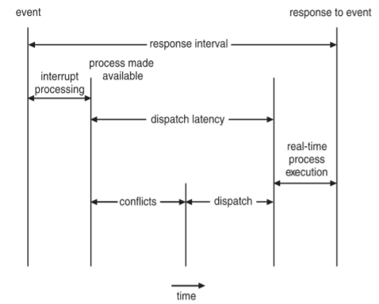


## Priority-Based Scheduling

- 실시간 스케줄링을 위해 스케줄러는 선점적 우선 순위 기반 스케줄링을 지원해야 함
  - 그러나 소프트 실시간만 보장
- 하드 리얼 타임의 경우 마감일을 맞추는 능력도 제공해야 함
- 프로세스에는 새로운 특성이 있음 : 주기적인 프로세스에는 일정한 간격으로 CPU가 필요
  - 처리 시간 t, 기한 d, 기간 p
  - 0 <= t <= d <= p
  - 주기적인 작업 비율은 1/p

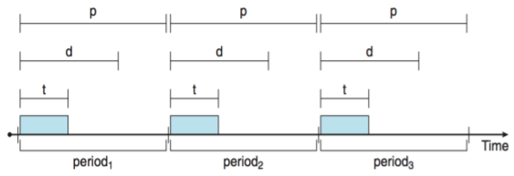


## Rate Monotonic Scheduling

- 주기의 역수를 기준으로 우선순위를 부여

- 짧은 기간(Shorter Periods) = 더 높은 우선 순위

- 더 긴 기간(Longer Periods) = 낮은 우선순위

- P1은 P2보다 우선 순위가 높음

  

- Missed deadline with Rate Monotonic Scheduling

  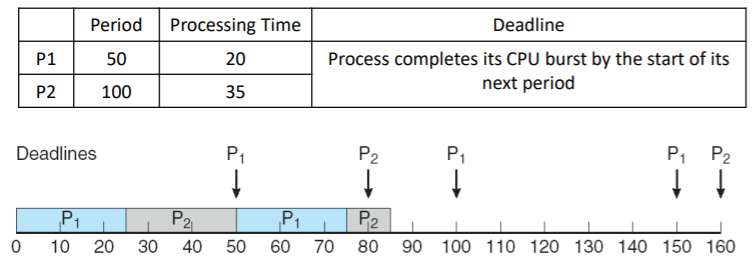


## Earliest Deadline First Scheduling(EDF)

- 마감일에 따른 우선순위 지정

  - 마감일이 빠를수록 우선순위가 높음
  - 마감일이 늦을수록 우선순위가 낮음

  


---

# 6. Process Synchronization

## Background

- Machine Instruction

  - 개별 프로세서는 '0'과 '1'로 구성된 자체 기계 명령을 실행

- Assembly Language

  - 사람이 읽을 수 있는 형태의 기계 명령어
    - i.e, MOVE R3, ADD R1, R2, ...
  - 각 어셈블리 언어 명령이 하나의 기계 명령으로 바뀜

- High-Level Languages

  - C와 같은 고급 언어의 컴파일러가 대부분의 명령어는 MULTIPLE 기계 명령어가 됨

- 프로세스 동시 실행 가능

  - 언제든지 중단될 수 있으며 부분적으로 실행 완료

- 공유 데이터에 대한 동시 액세스는 데이터 불일치를 초래할 수 있음

  - 데이터 일관성을 유지하려면 협력 프로세스의 질서 정연한 실행을 보장하는 메커니즘이 필요

- Producer-Consumer 문제 재검토

  - 이전에 버퍼의(BUFFER_SIZE - 1) 항목을 활용하는 알고리즘을 봄
  - 버퍼에 있는 모든 항목(e.g., BUFFER_SIZE items)을 사용하기 위해 변수 카운터를 사용하여 버퍼의 항목을 추적

  ```c
  Producer
  while (TRUE) {
  	/* produce an item in nextProduced */
  	while (counter == BUFFER_SIZE);
  	buffer[i] = nextProduced;
  	in = (in + 1) % BUFFER_SIZE;
  	counter++;
  	/* register1 = counter
  	register1 = register1+1;
  	counter = register1 */
  }
  ```

  ```c
  Consumer
  while (TRUE) {
  	while (counter == BUFFER_SIZE) ;
  	nextCOnsumed = buffer[out];
  	out = (out + 1) % BUFFER_SIZE;
  	counter--;
  	/* register2 = counter
  	register2 = register2 - 1
  	counter = register2 */
  	/* consume the item in nextConsumed */
  }
  ```

- counter = 5로 인터리빙하는 실행 고려

  - T<sub>0</sub> : **Producer executes** register1 = counter [r1 = 5]
  - T<sub>1</sub> : **Producer executes** register1 = register1+1 [r1 = 6]
  - T<sub>2</sub> : **Consumer executes** register2 = counter [r2 = 5]
  - T<sub>3</sub> : **Consumer executes** register2 = register2-1 [r2 = 4]
  - T<sub>4</sub> : **Producer executes** counter = register1 [counter = 6]
  - T<sub>5</sub> : **Consumer executes** counter = register2 [counter = 4]

- 위와 같은 상황에서 여러 프로세스가 동시에 동일한 데이터에 액세스하고 조작하고 실행 결과가 액세스가 발생하는 특정 순서에 따라 달라지는 상황을 **race condition**이라고 함


## Critical-Section Problem

- 코드상에서 경쟁 조건이 발생할 수 있는 특정 부분을 **critical section**

  - 프로세스가 공통 변수 변경, 테이블 업데이트, 파일쓰기 등을 수행할 수 있는 코드 세그먼트

    ```c
    Producer
    while (TRUE) {
    	/* produce an item in nextProduced */
    	while (counter == BUFFER_SIZE);
    	buffer[i] = nextProduced;
    	in = (in + 1) % BUFFER_SIZE;
    	counter++; // Critical Section
    }
    ```

  - Critical Sections에는 동시에 두개의 프로세스가 실행되면 안됨

- General structure of a typical process

  

- Critical-Section 문제에 대한 솔루션은 다음 요구사항을 충족해야 함

  - Mutual exclusion
    - 이미 한 프로세스가 critical section에서 작업 중이면 다른 프로세스는 진입하면 안됨
  - Progress
    - critical section에서 작업중인 프로세스가 없으면 다른 프로세스가 진입할 수 있어야함
    - 또한 프로세스가 중요 섹션에 들어가고자 하면 무기한으로 기다리면 안됨
  - Bounded waiting
    - critical section에 진입하려는 프로세스가 무한하게 대기하면 안됨
    - 프로세스가 critical section에 들어가려고 요청한 후 해당 요청이 승인되기 전에 다른 프로세스가 중요 섹션에 들어갈 수 있는 횟수를 제한
    - N 프로세스의 상대 속도에 대한 가정 없음

- Non-preemptive kernels로 구현하면 임계 영역 문제가 발생하지 않음

  - 하지만 비선점 스케줄링은 반응성이 떨어져 잘 사용하지 않음


## Peterson's Solution

- 임계 영역 문제에 대한 고전적인 소프트웨어 기반 솔루션

- LOAD / STORE 명령어가 atomic하다고 가정

  - 즉 중단할 수 없음(that is, cannot be interrupted)

- Two process solution

  - 두 프로세스가 두 변수를 공유
    - `int turn` : Critical Section에 들어갈 차례를 나타냄
    - `boolean flag[2]` : `flag[i]`는 프로세스  Pi가 임계 섹션에 들어갈 준비가 되었는지 여부를 나타내는데 사용

  ```c
  do {
  	flag[i] = TRUE;
  	turn = j;
  	while (flag[j] = TRUE && turn == j);
  	/* critical section */
  	flag[i] = FALSE;
  	/* remainder section */
  } while (TRUE)
  ```

  ```c
  do {
  	flag[j] = TRUE;
  	turn = i;
  	while (flag[i] = TRUE && turn == i);
  	/* critical section */
  	flag[j] = FALSE;
  	/* remainder section */
  } while (TRUE)
  ```

- Mutual exclusion

  - P<sub>i</sub>가 critical section에 들d어갈려면, `flag[j] == FALSE` or `turn == i`
  - P<sub>i</sub>와 P<sub>j</sub>가 동시에 critical section에서 실행될 경우, `flag[i] == flag[j] == TRUE`
  - P<sub>i</sub>와 P<sub>j</sub>는 동시에 성공적으로 실행하지 못함. 왜냐하면 turn의 값은 i 또는 j만 가질 수 있기 떄문에 한번에 하나만 실행
  - **Mutual exclusion 만족**

- Progress & Bounded waiting

  - 만약 P<sub>j</sub>가 critical section에 들어갈 준비가 되지 않은 경우라면 `flag[j] == FALSE` -> P<sub>i</sub>가 critical section에 들어갈 수 있음
  - 만약 P<sub>j</sub>가 `flag[i]`를 `TRUE`로 설정하고 while 루프에서 계쏙 실행중이라면, `turn == i` or `turn == j`
    - `turn == i` -> P<sub>i</sub> will enter the critical secion
    - `turn == j` -> P<sub>j</sub> will enter the critical section
  - critical section을 종료하면 `falg[j]`는 `FALSE`로 재설정 -> P<sub>i</sub> will enter the critical section
  - 만약P<sub>j</sub>가 `flag[j]`를 `TRUE`로 재설정하면 `turn`을 `i`로 설정
    - P<sub>i</sub>는 while문에서 실행하는 동안 turn의 값을 변경하지 않아 P<sub>i</sub>는 P<sub>j</sub>에 의해 최대 1개 항목만 critical section에 진입함
  - **Progress 만족**, **Bounded waiting 만족**

## Synchronization Hardware

- 많은 시스템이 중요 섹션 코드에 대한 하드웨어 지원을 제공

- 단일 프로세서 - 인터럽트를 비활성화할 수 있음

  - 현재 실행중인 코드는 선점없이 실행
  - 일반적으로 다중 프로세서 시스템에서는 비효율적
    - 광범위하게 확장할 수 없는 운영체제

- lock을 사용해 critical section 문제 해결

  ```c
  do {
  	Acquire lock
  		critical section
  	Release lock
  		remainder section
  } while (TRUE);
  ```

- 최신 기계는 특별한 하드웨어 지침을 제공

  - Atomic - 무중단
  - TestAndSet() 명령어
  - Swap() 명령어

- TestAndSet 명령어 : 들어온 값을 TRUE로 바꾸고 원래있던 값을 반환

  ```c
  boolean TestAndSet (boolean *target) {
  	boolean rv = *target;
  	*target = true;
  	return rv;
  }
  ```

- Solution using TestAndSet

  - lock은 FALSE로 초기화되어 있음
  - 맨처음 들어오면 lock은 TRUE로 바뀌고 critical section에 진입
  - context-switch가 일어나도 lock은 FALSE이기 때문에 다른 프로세스들은 while 루프를 돌게됨
  - 하지만 임의의 순서대로 Critical Section에 들어가기 때문에 어느 한 프로세스는 계속 기다리는 경우의 수가 발생할 수 있음 -> **Bounded waiting 만족하지 못함**

  ```c
  do {
  	while (TestAndSet(&lock));	// lock을 검사하고 TRUE면 루프를 FALSE면 Critical Section 진입
  	// critical section
  	lock = false;	// Critical Section을 통과하고 다른 프로세스의 진입을 허용한다는 의미로 lock을 FALSE로 바꿔줌
  	// reminder section
  } while (true)
  ```

- compare_and_swap  명령어

  - 특정 메모리 위치의 값이 주어진 값과 동일하다면 해당 메모리 주소를 새로운 값으로 대체

  ```c
  int compare_and_swap(int *value, int expected, int new_value) {
  	int temp = *value;
  	
  	if (*value == expected)
  		*value = new_value;
  	return temp;
  }
  ```

- Solution using Swap

  ```c
  do {
  	while (compare_and_swap(&lock, 0, 1) != 0)
  		; /* do nothing */
  	//critical section
  	lock = 0;
  	// reminder section
  } while (true);
  ```

  - compare_and_swap도 Bounded waiting을 만족하지 못함

- **최종적인 코드(Bounded waiting 만족)**

```c
do {
	waiting[i] = true;
	key = true;
	while (waiting[i] && key)
		key = test_and_set(&lock)
	waiting[i] = false;
	/* critical section */
	j = (i + 1) % n;
	while ((j != i) && !waiting[j])
		j = (j + 1) % n;
	if  (j == i)
		lock = false;
	else
		waiting[j] = false;
	/* remainder section */
} while (true);
```


## Mutex Locks

- Mutex locks는 여러 스레드가 공통 리소스에 접근하는 것을 제어하는 기법

- lock이 하나만 존재할 수 있는 locking 매커니즘을 따름

- 이미 하나의 스레드가 critical section에서 작업중인 lock 상태면 다른 스레드들은 critical section에 진입할 수 없도록 함

- 이전 솔루션은 복잡하고 일반적으로 응용 프로그램 프로그래머가 접근할 수 없음

- OS 디자이너는 임계 영역 문제를 해결하기 위해 소프트웨어 도구를 구축

- 가장 간단한 방법은 Mutex Locks

- 먼저 lock을 acquire()한 다음 release()하여 임계 영역 보호

  - 잠금 사용 가능 여부를 나타내는 변수

- acquire() 및 release() 호출은 atomic해야 함

  - 일반적으로 하드웨어 atomic 지침을 통해 구현

- 하지만 이 솔루션은 busy waiting이 필요

  - 이러한 잠금을 spinlock이라고 함

  ```c
  acquire() {
  	while (!available)
  		; /* busy wait */
  	available = false;
  }
  
  release() {
  	available = true
  }
  
  do {
  	acquire lock
  		critical section
  	release lock
  		remainder section
  } while (true);
  ```


## Semaphore

- 세마포어는 여러 개의 프로세스나 스레드가 critical section에 진입할 수 있는 locking 매커니즘

- 세마포어는 카운터를 이용해 동시에 리소스에 접근할 수 있는 프로세스를 제한

- 한 프로세스가 값을 변경할 때 다른 프로세스가 동시에 값을 변경하지 못함

- 세마포어 S : 두가지 표준 원자 연산을 통해서만 접근하는 정수 변수

  - 프로세스가 활동을 동기화하는데 보다 정교한 방법(Mutex lock보다)을 제공하는 동기화 도구

  ```c
  wait (S) {
  	while S <= 0;
  	S--;
  }
  
  signam (S) {
  	S++;
  }
  ```

- 세마포어 유형

  - 이진 세마포어(0..1)
    - Mutex lock과 동일
  - 카운팅 세마포어(0..N)

- 세마포어 사용 예제

  - Critical-Section Problem

    ```c
    do {
    	wait(mutex)
    		critical section
    	signal(mutex)
    		remainder section
    } while(TRUE);
    ```

  - Process synchronication

    ```c
    P1:
    S1;
    signal(sync)
    
    P2:
    wait(sync)
    S2;
    ```

    - sync가 0으로 초기화되면 P1이 signal(sync)를 호출한 후에만 P2가 S2를 실행


### Semaphore Implementation

- Busy waiting

  - 프로세스가 임계 섹션에 있는 동안 임계 섹션에 진입하려는 다른 프로세스는 진입 코드에서 계속 반복되어야 함
    - 구현 코드가 짧음
    - 임계 섹션이 거의 점유되지 않을 경우 대기하느라 바쁘지 않음

- Block & Wakeup

  - 각 세마포어는 관련 대기열이 있음

  - 대기열의 각 항목에는 다음의 2가지 데이터 항목이 있음

    - value(of type integer)
    - list의 다음 레코드에 대한 포인터

  - Two Operations

    - block : 작업을 호출하는 프로세스를 적절한 대기열에 배치
    - wakeup : 대기열에 있는 프로세스 중 하나를 제거하고 대기열에 넣음

    ```c
    typedef struct{
    	int value;
    	struct process *list;
    } semaphore;
    ```

  - block & wakeup 구현

    ```c
    wait (semaphore * S) {
    	S->value--;
    	if (S->value < 0) {
    		add this process to S->list;
    		block();
    	}
    }
    
    signal (semaphore *S) {
    	S->value++;
    	if (S->value <= 0) {
    		remove a process P from S->list;
    		wakeup(P);
    	}
    }
    ```


## Semaphore Problems

- Deadlock

  - 두 개 이상의 프로세스가 대기 프로세스 중 하나에서만 발생할 수 있는 이벤트를 기다림

  - 두 프로세스가 리소스를 점유하고 놓아주지 않거나, 어떠한 프로세스도 리소스를 점유하지 못하는 상태가 되어 프로그램이 멈추는 현상

    ```c
    P0:
    wait(S);
    wait(Q);
    ...
    signal(S);
    signal(Q);
    
    P1:
    wait(Q);
    wiat(S);
    ...
    signal(Q);
    signal(S);
    ```

- Starvation

  - 무한 차단(Indefinite blocking) : 세마포어 대기열에 프로세스가 suspend되어 있는 상태에서는 절대 프로세스를 제거할 수 없음
    - LIFO 순서대로 대기열에서 프로세스를 제거하는 방법

  

- Priority Inversion

  - 우선 순위가 낮은 프로세스가 우선순위가 높은 프로세스에 필요한 lock을 보유하는 경우의 스케줄링 문제

  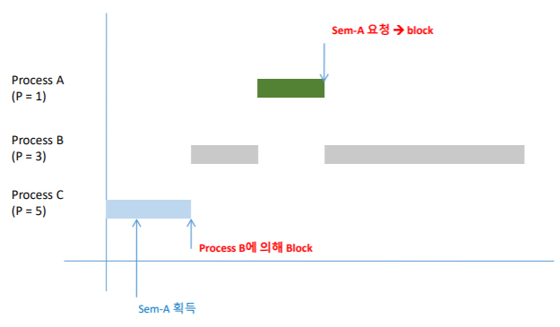

- Priority Inheritance Protocol(우선 순위 계승)

  - 특정 Process가 우선 순위가 높은 Process에서 요구하는 자원을 가지고 있을때 Process의 우선 순위를 자원을 요구하는 Process의 우선 순위로 높여주는 기법
  - 규칙
    - 자원이 사용중이면 Process는 Block됨
    - 자원이 사용 가능하면 Process는 자원을 소유
    - 우선순위가 높은 Process가 같은 자원을 요청하면 기존 Process의 우선순위는 자원을 요청한 Process의 우선순위로 높아짐
    - Process가 자원을 반환하면 원래의 우선순위로 돌아옴

  

## Monitor

- 세마포어를 잘못 사용하면 감지하기 어려운 타이밍 오류가 발생할 수 있음

  - signal(mutex) ... wait(mutex)
  - wait(mutex) ... wait(mutex)
  - wait(mutex) 또는 signal(mutex)(또는 둘다) 생략

- Monitor

  - 프로세스 동기화를 위한 편리하고 효과적인 메커니즘을 제공하는 고급 추상 데이터 유형
    - 모니터 내에서 상호 배제를 제공하는 프로그래머 정의 작업 집합을 제공

  


## Condition variables

- condition variable의 두 연산자

  - x.wait()
    - 작업을 호출하는 프로세스는 x.signal()까지 일시 중단
  - x.signal()
    - x.wait()를 호출하는 프로세스 중 하나(있는 경우)를 재개
      - 변수에 x.wait()가 없으면 변수에 영향이 없음

  

### Condition variables Choices

- 프로세스 P가 x.signal()를 호출하고 프로세스 Q가 x.wait()로 일시 중단되면 다음에 어떻게 되는가?
  - Q와 P 모두 병렬로 실행할 수 없음. Q가 재개되면 P가 대기해야 함
- 옵션은 다음과 같음
  - Signal and wait - P는 Q가 모니터를 떠날때까지 기다리거나 다른 상태를 기다림
  - Signal and continue - Q는 P가 모니터를 떠날때까지 기다리거나 다른 상태를 기다림
  - Both have pros and cons - 언어 구현자가 결정할 수 있음
  - 동시 Pascal 절충으로 구현된 모니터
    - 실행 중 신호가 즉시 모니터에서 나가고, Q가 재개
  - Mesa, C#, Java등 다른 언어로 구현

### Monitor Implementation using Semaphore

- signal and wait scheme

- Variables

  ```c
  semaphore mutex; // (initially = 1)
  semaphore next; // (initially = 0)
  int next_count = 0;
  ```

- Each procedure F will be replaced by

  ```c
  wait(mutex) ;
  	...
  	body of F;
  	...
  if (next_count > 0)
  	signal(next);
  else
  	signal(mutex);
  ```

- 모니터 내의 상호 배제가 보장

### Monitor Implementation - Condition Variables

- For each condition variable x, we have:

  ```c
  semaphore x_sem; // (initially = 0)
  int x_count = 0;
  ```

- The operation x.wait can be implemented as:

  ```c
  x_count++;
  if (next_count > 0)
  	signal(next);
  else
  	signal(mutex);
  wait(x_sem);
  x_count--;
  ```

- The operation x.signal can be implemented as:

  ```c
  if (x_count > 0) {
  	next_count++;
  	signal(x_sem);
  	wait(next);
  	next_count--;
  }
  ```

### Resuming Processes within a Monitor

- condition x와 x.signal()에서 여러 프로세스가 대기하고 있는 경우, 어떤 프로세스를 재개해야 하는가
- FCFS가 자주 적합하지 않음
- conditional : x.wait(c) 형식의 wait 생성
  - c가 우선순위 번호인 경우
  - 최소수(최우선순위) 프로세스의 다음 프로세스 예정


## Single Resource Allocation

- 프로세스에서 리소스를 사용할 최대 시간을 지정하는 우선 순위 번호를 사용하여 경쟁 프로세스 간에 단일 리소스 할당

  ```c
  R.acquire(t);
  	...
  	access the resource;
  	...
  R.release;
  ```

- 여기서 R은 ResourceAllocator 유형의 인스턴스

  ```c
  monitor ResourceAllocator
  {
  	boolean busy;
  	condition x;
  	void acquire(int time) {
  		if (busy)
  			x.wait(time);
  		busy = TRUE;
  	}
  	void release() {
  		busy = FALSE;
  		x.signal();
  	}
  	initialization code() {
  		busy = FALSE;
  	}
  }
  ```

  ```c
  Process A:
  
  ResourceAllocator aPrinter;
  int main(void) {
  	...
  	aPrinter.acquire(100);
  	// print out something
  	aPrinter.release();
  }
  ```

  ```c
  Process B:
  
  ResourceAllocator aPrinter;
  int main(void) {
  	...
  	aPrinter.acquire(200);
  	// print out something
  	aPrinter.release();
  }
  ```


---

# 7. Classic Problems of Synchronization

- Bounded-Buffer Problem
- Readers-Writes Problem
- Dining-Philosophers Problem


## Bound-Buffer Problem

- N개의 버퍼가 있을 때 각 버퍼는 하나의 아이템을 포함할 수 있음

- Semaphores

  - Mutex
    - 버퍼 풀 액세스를 위한 상호 배제
    - 1로 초기화
  - Full
    - 전체 버퍼 수를 계산
    - 0으로 초기화
  - Empty
    - 빈 버퍼 수 계산
    - N으로 초기화

  ```c
  Producer:
  do {
  	// produce an item in nextp
  	wait(empty);
  	wait(mutex);
  	// add nextp to buffer
  	signal(mutex);
  	signal(full);
  } while(TRUE)
  ```

  ```c
  Consumer:
  do {
  	wait(full);
  	wait(mutex);
  	// remove an item from the
  	// buffer to nextc nextp
  	signal(mutex)
  	signal(empty)
  } while(TRUE)
  ```


## Readers-Writers Problem

- 다수의 동시 프로세스에서 데이터 집합 공유

  - Readers : 데이터 세트 읽기만 수행, 업데이트는 수행하지 않음
  - Writers : 읽기와 쓰기 모두 가능

- Problem

  - 여러 readers가 동시에 읽을 수 있음. 한명의 writer만 공유 데이터에 액세스할 수 있음

- Semaphores & shared data

  - read_count
    - 데이터 세트를 읽고 있는 프로세스 수 추적
  - mutex
    - read_count를 업데이트할 때 상호 배제를 보장
    - 1로 초기화
  - rw_mutex
    - Writer를 위한 상호 배제 세모포어 기능
    - 1로 초기화

  ```c
  Writer:
  do {
  	wait(rw_mutex);
  	// writing is performed
  	signal(rw_mutex);
  } while (TRUE)
  ```

  ```c
  Reader:
  do {
  	wait(mutex);
  	readcount++;
  	if (readcount == 1)
  		wait(rw_mutex);
  	signal(mutex):
  	// reading is performed
  	wait(mutex);
  	readcount--;
  	if (readcount == 0)
  		signal(rw_mutex);
  	signal(mutex);
  } while(TRUE);
  ```


## Dining-Philosophers Problems

- 데드락에 관한 유명한 비유

- 철학자는 생각과 식사를 번갈아가면서 살아감

- 철학자가 5명인 경우

  - 젓가락은 총 5개, 단 음식을 먹으려면 2개의 젓가락을 사용해야 함
  - 동시에 음식을 먹을 수 있는 사람은 두명 
  - 운이 좋으면 5명의 철학자들이 돌아가면서 생각과 식사를 이어감
  - 하지만 모두가 젓가락을 들고 식사를 하려고 시도하면 누구도 식사를 할 수 없는 상태. 즉, 데드락에 빠짐
  - 공유 데이터
    - 밥 그릇(데이터 세트)
    - Semaphore chopstick[5]가 1로 초기화

- Philosopher i의 구조

  ```c
  Philosopher i:
  do {
  	wait(chopstick[i]);
  	wait(chopstick[(i+1)%5]);
  	// eat
  	signal(chopstick[i]);
  	signal(chopstick[(i+1)%5]);
  } while(TRUE)
  ```

- Monitor Solution to Dining-Philosophers problem

  ```c
  monitor DiningPhilosophers
  {
  	enum {THIKING, HUNGRY, EATING} state [5];
  	condition self [5];
  	
  	void pickup (int i) {
  		state[i] = HUNGRY;
  		test(i);
  		if (state[i] != EATING) self[i].wait;
  	}
  	
  	void putdown (int i) {
  		state[i] = THINKING;
  		// test left and right neighbors
  		test((i + 4) % 5);
  		test((i + 1) % 5);
  	}
  	
  	void test (int i) {
  		if ((state[(i + 4) % 5] != EATING) && 
  			(state[i] == HUNGRY) && 
  			(state[(i + 1) % 5] != EATING)) {
  			state[i] = EATING;
  			self[i].signal();
  		}
  	}
  	
  	initialization_code() {
  		for (int i = 0; i < 5; i++)
  			state[i] = THINKING;
  	}
  }
  ```

- 각 철학자 i는 다음 순서로 `pickup()`과 `putdown()` 작업을 호출

  ```c
  DiningPhilosophers.pickup(i);
  	EAT
  DiningPhilosophers.putdown(i);
  ```

- 데드락은 발생하지 않지만 기아(starvation)은 발생할 수 있음


---

# 8. Deadlock

- Deadlock conditions
- Deadlock prevention
- Deadlock avoidance
- Deadlock detection


## The Deadlock Problem

- 각각 자원을 보유하며 그 집합에서 다른 프로세스가 보유하는 자원을 획득하기 위해 대기하는 차단된 프로세스 세트

- Example

  - 시스템에 디스크 드라이버가 2개 있음 : P1과 P2에는 각각 하나의 디스크가 있고 각각 다른 디스크가 필요
  - Semaphores A와 B를 1로 초기화

  ```c
  P0:
  wait(A);
  wait(B);
  P1:
  wait(B);
  wait(A);
  ```


## System Model

- 자원 종류 : R<sub>1</sub>, R<sub>2</sub>, ... , R<sub>m</sub>
  - CPU 사이클, 메모리 공간, I/O 장치 등
- 각 자원 종류 R<sub>i</sub>에는 W<sub>i</sub> 인스턴스가 있음
- 프로세스는 다음과 같은 흐름으로 자원을 사용
  - Request
    - 리소스를 요청. 다른 프로세스가 리소스를 사용중이면 리소스를 받을 수 없어 대기함
  - Use
    - 프로세스는 리소스 위에서 수행
  - Release
    - 프로세스가 리소스를 놓아줌


## Deadlock Conditions

- 다음 4개 조건이 동시에 유지되면 Deadlock 상태가 발생할 수 있음
  - Mutal Exclusion
    - 한 번에 하나의 프로세스만 리소스를 사용할 수 있음
  - Hold and Wait
    - 프로세스 하나가 리소스를 잡고 있고, 다른 것은 대기중일 때
    - 하나 이상의 리소스를 보유하는 프로세스가 다른 프로세스에서 보유하는 추가 리소스를 획득하기 위해 대기
  - No Preemption
    - OS가 작동중인 프로세스를 임의로 중단시킬 수 없을 때
    - 자원은 보유하는 프로세스에 의해서만 자발적으로 방출될 수 있으며, 그 프로세스는 그 작업을 완료한 후에만 방출할 수 있음
  - Circular Wait
    - 프로세스가 순환적으로 서로를 기다릴 때


## Resource Allocation Graph

- 프로세스 간의 관계를 그래프로 도식화해보면 데드락이 발생하는지 예상할 수 있음

- 그래프에 순환 고리가 있다면 데드락 위험이 있다는 의미

  - 순환 고리가 있다고 무조건 데드락이 발생하는 것은 아님
  - 순환 고리가 없으면 절대로 데드락이 발생하지 않음

- resource-allocation graph

  - 꼭지점 집합 V와 edges 집합 E
  - V는 두 가지 유형으로 분할
    - `P={P0, P1, ..., Pn}`, 시스템 내 모든 프로세스로 구성된 세트
    - `R={R0, R1, ..., Rm}`, 시스템의 모든 리소스 유형으로 구성된 세트
    - Request edge : directed edge `Pi->Rj`
    - Assignment edge : directed edge `Rj->Pi`

- Resource-allocation graph with a deadlock

  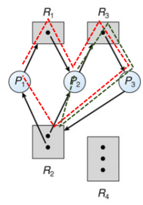

- Resource-allocation graph with a cycle but no deadlock

  

- Resource-allocation graph에 사이클이 없는 경우 시스템은 데드락 상태가 아님

- 만약 사이클이 있으면,

  - 리소스 유형당 하나의 인스턴스 -> 데드락
  - 리소스 유형당 여러 인스턴스 -> 데드락 가능성 있음


## Methods for Handling Deadlocks

- 데드락을 제어하는 방법
  - Deadlock prevention
  - Deadlock avoidance
- 시스템이 데드락 상태가 된 후 복구
- 문제를 무시하고 시스템에서 데드락 상태가 발생하지 않는 척
  - Unix를 포함한 대부분의 OS에서 사용

### Deadlock Prevention

- 하나 이상의 조건이 유지될 수 없도록하여 데드락 상태 발생을 방지

- Mutual Exclusion

  - 공유 리소스에서는 필요하지 않음; 공유할 수 없는 자원을 유지해야 함
  - 일반적으로 일부 자원을 본질적으로 공유할 수 없기 때문에 상호 배제 조건을 거부하여 **교착 상태를 예방할 수 없음**

- Hold and Wait

  - 한 프로세스가 실행되기 전 모든 자원을 할당시키고, 이후에는 다른 프로세스가 자원을 요구하도록 함. Starvation 문제가 발생할 수 있음
  - 프로세스가 리소스를 요청할 때마다 다른 리소스를 보유하지 않도록 보장해야 함
  - 프로세스가 실행을 시작하기 전에 모든 리소스를 요청하고 할당하도록 요구하거나 프로세스에 리소스가 없는 경우에만 프로세스가 리소스를 요청하도록 허용
  - 낮은 자원 사용률 + 기아 가능

- No Preemption

  - 리소스를 점유하고 있는 프로세스가 다른 리소스를 요청했을 때 즉시 리소스를 사용할 수 없으면 있던 리소스를 release함
  - 일부 리소스를 보유하고 있는 프로세스가 즉시 할당할 수 없는 다른 리소스를 요청하면 현재 보유중인 모든 리소스가 해제
  - 기존 자원과 요청한 자원을 되찾을 수 있을 때만 프로세스가 시작

- Circular Wait

  - 리소스의 타입에 따라 프로세스마다 일대일 함수로 순서를 지정함
  - 모든 리소스 유형의 전체 순서를 적용하고 각 프로세스가 증가하는 열거 순서로 리스소를 요청하도록 요구
  - R이 현재 보유하고 있는 인스턴스의 유형이 있는 경우 프로세스는 자원 유형 R<sub>j</sub>의 인스턴스를 요청할 수 있음. 단 F(R<sub>j</sub>)>F(R<sub>i</sub>)인 경우에만 가능

- Deadlock Example

  ```c
  void transaction(Account from, Account to, double amount)
  {
  	mutex lock1, lock2;
  	lock1 = get_lock(from);
  	lock2 = get_lock(to);
  	acquire(lock1);
  		acquire(lock2);
  			withdraw(from, amount);
  			deposit(to, amount);
  		release(lock2);
  	release(lock1);
  }
  ```

  - 트랜잭션 1과 2는 동시에 실행됨. 트랜잭션 1은 계정 A에서 계정 B로 $25를 이체하고 트랜잭션 2는 계정 B에서 계정 A로 $50을 이체

### Deadlock Avoidance

- Daedlock Avoidance는 데드락이 발생할 것 같을 때는 아예 리소스를 할당하지 않는 것
- 여기서는 시스템이 unsafe 상태가 되지 않도록 해야하며, unsafe 상태가 되면 최대한 빨리 safe 상태로 복구
- 데드락 가능성은 포인터로 자원 할당 그래프를 구현해 판단
- 리소스 타입이 여러개면 banker's algorithm을 사용
- 시스템에 사용 가능한 추가 사전 정보가 있어야함
  - 현재 사용 가능한 리소스
  - 현재 각 프로세스에 할당된 리소스
  - 각 프로세스의 향후 요청 및 릴리스
- 가장 간단하고 유용한 모델은 각 프로세스가 필요할 수 있는 각 유형의 최대 리소스 수를 선언하는 것
- deadlock avoidance 알고리즘은 자원 할당 상태를 동적으로 검사하여 circular-wait 조건이 없을 수 있는지 확인
  - 리소스 할당 상태는 사용가능한 리소스 및 할당된 리소스의 수와 프로세스의 최대 수요로 정의

### Safe State

- 프로세스가 사용 가능한 리소스를 요청하면 시스템은 즉시 할당이 시스템을 안전한 상태로 남겨 둘지 결정해야 함

- 시스템에 있는 모든 프로세스의 시퀀스 {P<sub>0</sub>, P<sub>1</sub>, ..., P<sub>n</sub>}이 있으면 시스템은 안전한 상태. 따라서 각 프로세스 P<sub>i</sub>에 대해 P<sub>i</sub>가 여전히 요청할 수 있는 리소스는 현재 사용 가능한 리소스로 충족 + j<i인 모든 P<sub>j</sub>가 보유한 자원

  - P<sub>i</sub> 리소스 필요를 즉시 사용할 수 없는 경우 P<sub>i</sub>는 모든 P<sub>j</sub>가 완료될 때까지 기다릴 수 있음
  - P<sub>j</sub>가 완료되면 P<sub>i</sub>는 필요한 리소스를 얻고 할당된 리소스를 실행하고 반환하고 종료할 수 있음
  - P<sub>i</sub>가 종료되면 P<sub>i+1</sub>은 필요한 리소스를 얻을 수 있음

- 시스템이 안전한 상태인 경우 -> 데드락 없음

- 시스템이 안전하지 않은 상태인 경우 -> 데드락 발생 가능

- Deadlock avoidance -> 시스템이 안전하지 않은 상태가 되지 않도록 보장

  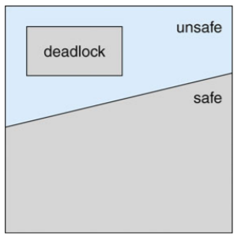


### Deadlock Avoidance Algorithms

- 리소스 타입이 싱글 인스턴스
  - resource-allocation graph 사용
- 리소스 타입이 멀티 인스턴스
  - banker's algorithm 사용

#### Resource-Allocation Graph Scheme

- 클레임 엣지(Claim edge) P<sub>i</sub> -> R<sub>j</sub>는 프로세스 P<sub>i</sub> 가 리소스 R<sub>j</sub>를 요청했다는 것을 점선으로 표시
- 프로세스가 리소스를 요청하면 클레임 에지가 Request edge로 변환
- 프로세스에 자원이 할당되면 Request edge가 assignment edge로 전환
- 프로세스에 의해 리소스가 해제되면assignment edge가 클레임 에지로 다시 변환
- 시스템에서 먼저 리소스를 할당해야 함
- request edge P<sub>i</sub>->R<sub>j</sub>를 assignment edge R<sub>i</sub>->P<sub>j</sub>로 변환해도 리소스 할당 그래프에서 주기가 형성되지 않는 경우에만 요청을 승인할 수 있음


### Banker's Algorithm

- Banker's algorithm은 dijkstra가 고안한 데드락 회피 알고리즘

- 프로세스가 리소스를 요청할 때마다 수행되며, 리소스를 할당했을 때 데드락이 발생하는지 시뮬레이션함

- 리소스 유형이 멀티플 인스턴스인 시스템에서 사용

- 데이터 구조

  - n : 프로세스의 수,  m : 리소스 타입 수
  - Available
    - 길이가 m인 벡터. `Available[j] = k`인 경우 사용 가능한 자원 유형 Rj의 인스턴스가 k개 있음
  - Max
    - n*m 행렬, 만약 `Max[i, j] = k`이면 프로세스 Pi는 리소스 유형 Rj의 인스턴스를 최대 k개까지 요청할 수 있음
  - Allocation
    - n*m 행렬, 만약 `Allocation[i, j] = k`이면 프로세스 P<sub>i</sub>는 현재 자원 유형 R<sub>j</sub>의 k인 인스턴스에 할당
  - Need
    - n*m 행렬, 만약 `Need[i, j] = k`이면 프로세스 P<sub>i</sub>는 작업을 완료하기 위해 리소스 유형 R<sub>j</sub>의 인스턴스 k개가 더 필요할 수 있음
    - `Need[i, j] = Max[i, j] - Allocation[i, j]`

- Safety Algorithm

  1. Work와 Finish를 각각 길이가 m과 n인 벡터로 지정. `Work = Available` 및 i = 0, 1, ..., n-1에 대해 `Finish[i] = false`로 초기화

  2. 아래의 두개가 같은 index i를 찾음

     a. `Finish[i] == false`

     b. `Needi <= Work`

     만약 존재하지 않으면 4단계로 이동

  3. `Work = Work + Allocation`

     `Finish[i] = true`

     2단계로 이동

  4. 만약 모든 i에 대해 `Finish[i] == true`이면 시스템은 안전한 상태이다

- Resource-Request Algorithm for P<sub>i</sub>

  - Request<sub>i</sub> : P<sub>i</sub>에 대한 request vector

    : 만약 Request<sub>i</sub>[j] = k이면 P<sub>i</sub>는 리소스 유형 R<sub>j</sub>의 k인스턴스를 원함

  1. 만약 Request<sub>i</sub> <= Need<sub>i</sub>이면 2번으로 이동하고 아니면 오류 발생

  2. 만약 Request<sub>i</sub> <= Available이면 3번으로 이동하고 아니면 리소스를 사용할 수 없으므로 기다려야 함

  3. 다음과 같이 상태를 수정하여 요청된 리소스를 P<sub>i</sub>에 할당하는 척함

     ```c
     Available = Available - Request[i]
     Allocation[i] = Allocation[i] + Request[i]
     Need[i] = Need[i] - Request[i]
     ```

     만약 안전한 상태면 리소스는 P<sub>i</sub>에 할당됨

     안전한 상태가 아니면 P<sub>i</sub>는 기다려야하며 이전 resource-allocation 상태가 복원

- Example

  - 5 processes : P<sub>0</sub>, ..., P<sub>4</sub>
  - 3 resource types
    - A (10 instances), B(5 instances), C(7 instances)
  - At time T<sub>0</sub>:

  

- Example #2

  - P<sub>1</sub> request(1, 0, 2)

    1. Check Request<sub>i</sub> <= Need<sub>i</sub> -> (1, 0, 2) <= (1, 2, 2)

    2. Check Request<sub>i</sub> <= Available -> (1, 0, 2) <= (3, 3, 2)

    3. Modification the state of T<sub>0</sub>

       

    4. Check if the system is in a safe state

       **Safe sequence = <P<sub>1</sub>, P<sub>3</sub>, P<sub>4</sub>, P<sub>0</sub>, P<sub>2</sub>>**


## Deadlock Detection

- 시스템이 데드락 상태에 들어갈 수 있도록 함
- Detection algorithm
  - 리소스 유형이 단일 인스턴스
    - wait-for graph 사용
  - 리소스 유형이 여러 인스턴스
    - banker's algorithm 변형
- Recovery scheme

### Wait-for graph

- P<sub>i</sub> -> P<sub>j</sub> if P<sub>i</sub> is waiting for P<sub>j</sub>

  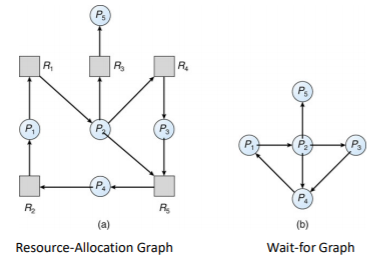

### Variant of the banker's algorithm

- Available

  - 길이가 m인 벡터는 각 유형의 사용 가능한 리소스 수

- Allocation

  - n*m 행렬은 각 프로세스에 현재 할당된 각 유형의 리소스 수를 정의

- Request

  - n*m 행렬은 각 프로세스의 현재 요청을 나타냄. Request[i, j]가 k와 같으면 프로세스 P<sub>i</sub>는 리소스 유형 R<sub>j</sub>의 인스턴스 k개를 더 요청

- Algorithm

  1. Work와 Finish를 각각 길이가 m과 n인 벡터로 지정. `i = 0, 1, ..., n-1` 인 경우 `Work=Available`로 초기화. 만약 `Allocation != 0`이면 `Finish[i] = false` 아니면 `Finish[i] = true`

  2. 아래와 같은 상황인 i를 찾음

     a. `Finish[i] == false`

     b. `Requesti <= Work`

     만약 i를 찾지 못하면 4로 이동

  3. `Work = Work + Allocationi`

     `Finish[i] = true`

     go to step 2

  4. 만약 몇몇의 i에 대해 `Finish[i] == false`이면 시스템이 데드락 상태임. 또한 `Finish[i] == false`이면 프로세스 P<sub>i</sub>는 데드락 프로세스가 됨

  알고리즘은 시스템이 데드락 상태인지 여부를 감지하기 위해 O(m*n<sup>2</sup>)의 작업 순서가 필요

- Example

  - 5 processes - P<sub>0</sub>, ..., P<sub>4</sub>

  - 3 resource types

    - A (7 instances), B (2 instances), C (6 instances)

  - At time T<sub>0</sub>:

    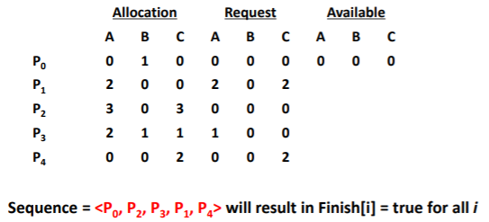

- Example #2

  - P2 requests an additional instance of type C

    

### Detection-algorithm Usage

- 호출시기와 빈도는 다음에 따라 다름
  - 데드락 상태가 얼마나 자주 발생하는가
  - 몇 개의 프로세스를 롤백해야 하는가
    - 각 분리된 사이클 마다 하나씩
- 탐지 알고리즘이 임의로 호출되면 리소스 그래프에 많은 주기가 있을 수 있으므로 많은 데드락 상태 프로세스 중 데드락 상태가 발생한 프로세스를 알 수 없음

### Recovery Scheme

- 데드락이 발생했다면 데드락으로부터 복구되어야 함
- Process termination
  - 모든 데드락 상태 프로세스 중단
  - 데드락 상태가 제거될 때까지 한번에 하나의 프로세스를 중단
- 이때 어떤 프로세스        를 종료시킬지 정하는 것이 중요
- 판단 기준
  - 프로세스의 중요도
  - 프로세스가 얼마나 오래 실행되었는지
  - 프로세스에서 사용한 리소스
  - 프로세스가 작업을 마치기 위해 얼마나 많은 리소스가 필요한지
  - 프로세스가 종료되기 위해 얼마나 많은 리소스가 필요한지
  - 프로세스가 batch인지 interactive 인지

### Recovery from Deadlock: Resource Preemption

- 데드락을 해결하기 위해 Resource Preemption 방식을 사용하면 다음과 같은 이슈가 있음
  - Selecting a victim
    - minimize cost
    - 어떤 프로세스를 종료시킬지 결정
  - Rollback
    - 안전한 상태로 돌아가서 해당 상태에 대한 프로세스를 다시 시작
  - Starvation
    - 비용 요소에 롤백 횟수를 포함하여 항상 동일한 프로세스를 victim으로 선택할 수 있음


---

# 9. Memory Management Strategy

- Continuous memory allocation
- Paging
- Segmentation


## Background

- 메모리는 현대 컴퓨터 시스템의 핵심. 프로세스는 독립적인 메모리 공간을 차지
- 시스템은 프로세스가 자신의 영역 외에는 접근할 수 없도록 막아야 함
- 프로그램을 디스크에서 메모리로 가져와서 실행하려면 프로세스 내에 배치해야 함
- 메인 메모리 및 레지스터는 스토리지 CPU만 직접 액세스할 수 있음
- 메모리 유닛은 addresses + read 요청 또는 address + data 및 write 요청의 스트림만 볼 수 있음
- 하나의 CPU 클럭에 액세스 등록
- 메인 메모리는 많은 사이클이 소요되어 스톨(stall)이 발생할 수 있음
- 캐시는 메인 메모리와 CPU 레지스터 사이에 있음
- 올바른 작동을 보장하기 위해 메모리 보호 필요

### Base and Limit Registers

- CPU는 레지스터를 참조하여 메모리 공간을 보호하며, 레지스터 정보는 PCB에 담김

- 운영체제의 중요한 역할 중 하나

  - 운영체제와 사용자 프로세스를 보호하려면
  - 레지스터는 base와 limit으로 나뉨
  - 베이스 레지스터와 리미트 레지스터
    - base register
      - 최소 합법적인 물리적 메모리 주소
      - 프로세스가 메모리에서 사용할 수 있는 가장 작은 physical address
    - limit register
      - 사용할 수 있는 주소 범위의 크기
  - 프로세스가 사용할 수 있는 가장 큰 주소는 base와 limit의 합

  


#### Hardware Address Protection

- 각 프로세스에 별도의 메모리 공간이 있음을 보장

  


### Address Binding

- 일반적으로 프로그램은 디스크에 binary executable 파일로 저장되어 있음

- 프로그램을 실행하기 위해서는 메모리에 로드해 프로세스로 만들어야 함

  - 이때 디스크에서 메인메모리로 로드되기를 대기하는 곳이 input queue
  - 운영체제는 input queue에서 프로세스를 선택해 메모리에 로드

- 디스크의 프로그램, 메모리로 가져와서 input queue에서 실행할 준비가 됨

  - 지원하지 않으면 address 0000에 로드해야 함

- 최초 사용자가 항상 0000으로 물리적 주소를 처리하는 것은 불편

- 또한 프로그램 수명의 단계별로 주소가 다르게 표현

  - 소스 코드 주소는 일반적으로 기호로 사용
  - 컴파일된 코드 주소가 재배치 가능한 주소에 바인딩
    - 즉 이 모듈의 시작부터 14바이트까지
  - 링커 또는 로더가 재배치 가능한 주소를 절대 주소로 바인딩
    - 예: 74014
  - 각각의 바인딩은 하나의 주소 공간을 다른 주소로 매핑

- 명령과 데이터를 메모리 주소에 주소 바인딩하는 것은 세 단계에서 발생

  - Compile time
    - 만약 compile time에 프로세스가 메모리의 어느 위치에 들어갈지 미리 알고 있다면 absolute code를 생성할 수 있음. 위치가 변경되면 코드를 다시 컴파일해야됨. ex) MS-DOS.COM 형식 프로그램
    - 메모리 위치가 priori인 경우 컴파일시 절대 코드를 생성
    - 시작 위치가 변경되면 재컴파일해야 함
  - Load time
    - 프로세스가 메모리의 어느 위치에 들어갈지 미리 알 수 없다면 컴파일러는 relocatable code를 만들어야 함. 이 경우 최종 바인딩은 로드의 소요 시간만큼 지연
    - 컴파일 시 메모리 위치를 알 수 없는 경우 재배치 가능한 코드를 생성
  - Execution time
    - 프로세스가 실행 중 메모리의 한 세그먼트에서 다른 세그먼트로 이동할 수 있다면 바인딩은 runtime까지 지연
    - 바인딩이 실행 시간까지 지연
    - 어드레스 맵에 대한 하드웨어 지원 필요(예: 베이스 및 리미트 레지스터)

  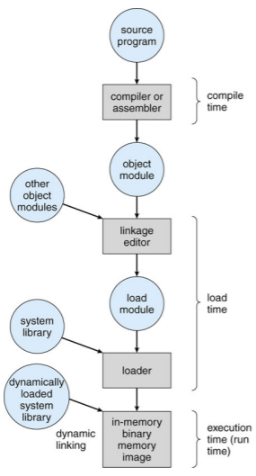


### Logical vs Physical Address Space

- CPU가 생성하는 주소는 logical address(가상주소라고도 함(Virtual Address)이고, 메모리에 의해 취급되는 주소는 physical address
- compile-time과 load-time에서 주소를 바인딩할때는 logical address와 physical address가 같게 생성되는 반면 execution-time에서는 다르게 생성
  - 이 경우 logical address를 virtual address라고 함
- virtual address를 physical address로 대응시키는 것은 하드웨어 디바이스인 MMU(Memory-Management Unit)가 함


### MMU : Memory Management Unit

- 가상 주소를 물리적 주소로 매핑하는 H/W 장치

- 우선 메모리로 전송될 때 사용자 프로세스에 의해 생성된 모든 주소에 재배치 레지스터의 값이 추가되는 간단한 방식을 고려

  - 기본 레지스터는 이제 **재배치 레지스터(relocation register)**라고 부름

- 사용자 프로그램은 논리적 주소를 처리. 실제 물리적 주소는 보지 못함

  - 메모리 내 위치를 참조할 때 execution time 바인딩 발생
  - 물리적 주소에 바인딩된 논리적 주소

  


### Dynamic Linking

- Linking은 실행 시간까지 연기
- 정적 링크(Static linking) : 로더가 바이너리 프로그램 이미지로 조합한 시스템 라이브러리 및 프로그램 코드
- 동적 링크(Dynamic Linking) : 링크 실행 시간까지 연기
- 적절한 메모리 레지던트 라이브러리 루틴을 찾기 위해 사용되는 작은 코드, stub
- Stub을 루틴의 주소로 교체하고 루틴을 발생
- 운영체제가 프로세스의 메모리 주소에 루틴이 있는지 확인
  - 주소 공간이 아닌 경우 주소 공간으로 추가
- 라이브러리에는 동적 링크가 특히 유용
- **공유 라이브러리**라고도 하는 시스템


### Swapping

- 메모리는 크기가 크지 않기 때문에 프로세스를 임시로 디스크에 보냈다가 다시 메모리에 로드해야 하는 상황이 생김

- 프로세스가 메모리 부족 상태에서 백업 저장소로 일시적으로 전환된 후 메모리에 다시 가져와 계속 실행할 수 있음

- 이때 디스크로 보내는 것을 swap out, 메모리로 들여보내는 것은 swap in이라고 함

- 우선순위에 따라 어떤 프로세스를 swap in/out할지 결정

- swap하는데 걸리는 시간의 대부분은 디스크 전송 시간

  - 총 전송 시간은 swap된 메모리 양에 비례함

  


## Memory Allocation Schemes

- Continuous Memory Allocation
- Paging
- Sementation


### Continuous Memory Allocation

- 보통 메모리는 두 개의 영역으로 나뉘어 관리

- low memory에는 커널을, high memory에는 사용자 프로세스를 담음

- continuous memory allocation 시스템은 각 프로세스들이 연속적인 메모리 공간을 차지

- 프로세스가 자신의 범위를 넘지 못하도록 하는 것이 base register와 limit register의 역할

- Multiple-partition allocation

  - 파티션 개수에 따른 멀티프로그래밍 정도 제한

  - 효율성 향상을 위한 가변 파티션 크기(특정 프로세스의 필요에 따라 크기 조정)

  - Hole : 사용 가능한 메모리 블록, 다양한 크기의 hole들이 메모리 전체에 흩어져 있음

  - 프로세스가 도착하면 이를 수용할 수 있을만큼 큰 hole에서 메모리를 할당

  - 프로세스를 종료하면 파티션이 해제되고 인접한 사용 가능한 파티션과 결합

  - 운영체제는 다음의 정보를 유지

    a) allocated partitions b) free partitions(hole) 

  

#### Memory Allocation

- free holes 목록에서 크기 n 요청을 충족하는 방법
  - **First-fit**
    - 첫번째 hole 충분히 큰 hole 할당
  - **Best-fit**
    - hole 중에서 가장 작은 곳을 할당
    - 크기별 지시가 없는 경우 전체 목록 검색 필요
    - 최소의 남은 hole 생성
  - **Worst-fit**
    - 가장 큰 곳을 할당
    - 크기별 지시가 없는 경우 전체 목록 검색 필요
    - 가장 큰 남은 hole 생성
  - 속도 및 스토리지 활용도 측면에서 Worst-fit보다 Best-fit과 First-fit이 우수

#### Fragmentation

- fragmentation은 메모리 공간을 사용하지 못하게 되는 것을 말함. (garbage collection에도 같은 문제가 발생)
- External Fragmentation
  - 요청을 충족하기 위한 총 메모리 공간이 존재하지만 연속되지 않음
  - block의 크기가 30k, 60k, 20k, 40k, 60k 이면 hole은 60k 두 공간 밖에 없을 때 70k프로세스가 들어와야 한다면 실제 메모리 공간은 120k가 비어있지만 어디에도 70k가 들어갈 수  없음
- Internal Fragmentation
  - 할당된 메모리는 요청된 메모리보다 약간 클 수 있음
    - 이 크기 차이는 파티션 내부의 메모리이지만 사용되지 않음
- 일반적으로 메모리가 시스템 효율을 위해 고정 크기의 정수 배로 할당되기 때문에 생기는 현상
- External Fragmentation 줄이기
  - Compaction
    - 사용 가능한 모든 메모리를 하나의 큰 블록에 함께 배치하기 위해 메모리를 섞음
    - 할당된 block을 한쪽으로 몰아 큰 block을 생성
    - Compaction은 재배치가 동적인 경우에만 가능(예 : 실행 시간 주소 바인딩)
    - 프로세스 할당은 자주 일어나는 일이기 때문에 compaction처럼 오버헤드가 큰 작업을 매번 할 수 없음
  - 프로세스의 논리적 주소를 비 연속적으로 허용하여 해당 메모리를 사용할 수 있는 모든 곳에서 프로세스에 물리적 메모리를 할당할 수 있도록 함
    - Paging & Segmentation


### Paging

- paging은 프로세스를 여러 조각으로 나누는 것

- 단순히 크기를 기준으로 나누기 때문에 비슷한 요소라도 메모리 공간에 연속적으로 할당되지 않음

- 프로세스의 물리적 주소 공간을 연속적이지 않게 허용하려면

  - 물리 메모리를 **프레임**이라고 하는 고정 크기의 블록으로 나눔
  - 논리적 메모리를 **페이지**라는 동일한 크기의 블록으로 나눔
  - n 페이지 크기의 프로그램을 실행하려면 n개의 free frame을 찾아 프로그램을 로딩
  - 논리적 주소를 실제 주소로 변환하는 페이지 테이블 설정
  - Internal fragmentation

- paging에서는 physical memory의 각 block을 frame이라고 하고 logical memory의 각 block을 page라고 부름

- frame을 작게 나눌수록 fragment가 적게 생기고 실제로 external fragmentation이 거의 생기지 않음

- logical address를 physical address로 변환하는 page table이 필요

- Paging model of logical and physical memory

  

- 주소 변환 방법(Address Translation Scheme)

  - CPU에서 생선된 주소를 나눔

    - Page number(p)
      - 실제 메모리에 있는 각 페이지의 기본 주소를 포함하는 페이지 테이블의 인덱스로 사용
    - Page offset(d)
      - base address와 결합하여 memory unit으로 전송되는 실제 메모리 주소를 정의

  - 주어진 논리적 주소 공간 2m 과 페이지 사이즈 2n

    

  

- Example

- 

  - 32-byte memory and 4-byte pages (n=2 and m=4)

- Calculating internal fragmentation

  - Page size = 2,048 bytes
  - Process size = 72,766 bytes
  - 35 pages + 1,086 bytes
  - Internal fragmentation of 2,048 - 1,086 = 962 bytes
  - Worst case fragmentation = 1 frame - 1 byte
  - On average fragmentation = 1 / 2 frame size
  - 작은 프레임 크기가 바람직한가
  - 그러나 각 페이지 테이블 항목은 추적하기 위해 메모리를 사용
  - 시간이 지남에 따라 증가하는 페이지 크기
  - Solaris는 두 페이지 크기를 원함 : 8 KB and 4 MB

- 프로세스 view와 물리적 메모리의 차이가 매우 큼

- 구현 프로세스 자체 메모리만 액세스할 수 있음


#### Free Frames


#### Implementation of page table

- 페이지 테이블은 메인 메모리에 보관

- Page table base register(PTBR)가 페이지 테이블을 가리킴

- Page table length register(PTLR)는 페이지 테이블의 크기를 나타냄

- 이 시스템에서 모든 데이터/instruction 액세스에는 페이지 테이블용과 데이터/instruction 용 두 개의 메모리 액세스가 필요

  - 즉, 매번 데이터에 접근할 때마다 한번은 데이터에 한번은 page table에 접근해야함. 비효율적

- Translation Look-side Buffer(TLB)라는 캐시된 특수 고속 조회 하드웨어를 사용하면 두 가지 메모리 액세스 문제를 해결할 수 있음

  - TLB는 key-value 쌍으로 데이터를 관리하는 associative memory
  - CPU는 page table보다 TLB를 우선적으로 참조
  - page number가 TLB에서 발견되는 비용을 hit ratio라고 함

- Use of TLB

  

- 일부 TLB는 각 TLB 항목에 address-space identifiers(ASIDs)를 저장

  - 각 프로세스를 고유하게 식별하고 해당 프로세스를 위한 주소 공간 보호 기능 제공
  - 그렇지 않으면 모든 컨텍스트 스위치에서 flush 필요

- Effective Access Time

  - TLB Look up - ε time unit
  - Memory access time - 1 time unit
  - Hit ratio(α)
    - TLB에서 페이지 번호가 발견된 횟수 비율
  - Effective Access Time(EAT)
    - EAT = (1+ε)α + (2+ε)(1-α) = 2 + ε - α
    - Consider α = 80%, ε = 20ns for TLB search, 100ns for me mory access
      - EAT = 0.80 * 100 + 0.20 * 200 = 120ns
    - Consider more realistic hit ratio -> α = 99%, ε = 20ns for TLB search, 100ns for memory access
      - EAT = 0.99 * 100 + 0.01 * 200 = 101ns


#### Memory Protection

- Memory Protection은 각 프레임에 연결된 보호 bites에 의해 구현

- 메모리 할당이 continuous한 경우 limit만 비교해도 메모리를 보호할 수 있었음

- 하지만 paging은 continuous하지 않음

- **valid-invalid bit**

  - page table의 각 항목에는 valid-invalid bit가 붙어있음
  - valid는 관련 페이지가 프로세스의 논리적 주소 공간에 있음을 나타냄
  - invalid는 페이지가 프로세스의 논리적 주소 공간에 있지 않음을 나타냄
  - 또는 페이지 테이블 길이 레지스터(PTLR)를 사용

- 위반시 커널에 트랩이 발생

  


#### Shared Pages

- paging의 또 다른 장점은 코드를 쉽게 공유할 수 있다는 것

- 만약 코드가 reentrant code(또는 pure code)라면 공유 가능

  - reentrant code는 runtime 동안 절대로 변하지 않는 코드

- 여러 프로세스들이 동시에 같은 코드를 수행할 수 있음

  - 이런 식으로 공통 page를 공유하면 12개로드해야 할 것을 6개만 로드

- Shared code

  - 프로세스간에 공유되는 읽기 전용(reentrant) 코드 사본 1개(예: 텍스트 편집기, 컴파일러, 윈도우 시스템)
  - 동일한 프로세스 공간을 공유하는 여러 개의 스레드와 유사
  - 읽기-쓰기 페이지 공유 허용시 프로세스간 통신에도 유용

- Private code and data

  - 각 프로세스마다 코드와 데이터의 별도 사본 보관
  - 개인 코드 및 데이터 페이지는 논리적 주소 공간 어디에나 표시될 수 있음

  


## Structure of the Page Tables

- paging을 직접 적용하면 page table의 크기가 커짐
- 페이지 테이블을 효율적으로 구성하는 방법
- Hierarchical paging
- Hashed page tables
- Inverted page tables


### Hierarchical Page Tables

- hierarchical paging은 logical address space를 여러 단계의 page table로 분할하는 기법

- two-level paging scheme이 예시인데, page table과 메모리 사이에 page table을 하나 더 두어 모든 페이지를 로드해야하는 부담을 줄일 수 있음

- Two-level Page Table Scheme

  

#### Two-level Paging Example

- 논리적 주소(1K 페이지 크기의 32비트 시스템에서) 다음과 같이 나뉨
  - 22비트로 구성된 페이지 번호
  - 10비트로 구성된 페이지 오프셋
- 페이지 테이블이 페이징되므로, 페이지 번호는 다음과 같이 구분
  - 12비트 페이지 번호
  - 10비트 페이지 오프셋
- 그러므로 논리적 주소는 다음과 같음
  - 
  - 여기서 p1은 외부 페이지 테이블의 인덱스이고, p2는 내부 페이지 테이블의 페이지 내의 변위(displacement)
  - **forward-mapped page table**


#### Address Translation Scheme


#### 64-bit Logical Address Space

- If page size is 4KB(212)

  - 페이지 테이블은 252개의 엔트리를 가짐

  - 만약 two level scheme라면 내부 페이지 테이블은 210 4-byte 엔트리

  - 주소는 다음과 같음

    

  - 외부 페이지 테이블에는 242개의 엔트리 또는 244 바이트가 있음

  - 한가지 해결책은 2nd 외부 페이지 테이블을 추가하는 것

  - 그러나 다음 예에서 2nd 외부 페이지 테이블은 여전히 234

    - 물리적 메모리 위치 하나를 얻기위해 4 메모리 액세스 가능


#### Three-level Paging Scheme


- Hierarchical 페이지 테이블은 일반적으로 64비트 아키텍처에 적합하지 않음


### Hashed Page Tables

- hash table을 이용해 page table을 관리하는기법

- 일반적인 주소 공간 > 32비트보다 큼

  - address space가 32비트보다 커지면 hierarchical paging이 비효율적이라 사용

- virtual page number를 hashing해 page table을 참조하는데 사용

  - 이 페이지 테이블에는 동일한 위치로 해싱되는 요소 채인이 포함

- hashed page table에서는 linked list를 따라가며 page number를 비교.

  - 일치하면 그에 대응하는 page frame number를 얻음.
  - hash table은 검색에 O(1) 걸려 매우 빠르지만 구현이 어려움

- 각 요소에는 (1) 가상 페이지 번호 (2) 매핑된 페이지 프레임의 값 (3) 다음 요소에 대한 포인터 포함

- 이 체인에서 가상 페이지 번호를 비교하여 일치 항목을 찾음

  - 일치하는 것이 발견됨녀 해당 물리적 프레임을 추출

- 64비트 주소의 변형은 **clustered page tables**

  - 해시와 유사하지만 각 항목은 1개가 아닌 여러 페이지(예: 16개)를 참조
  - sparse address spaces에 특히 유용(메모리 참조가 연속적이지 않고 분산되어 있는 경우)

  


### Inverted Page Tables

- 지금까지 page table은 각 page마다 하나의 엔트리를 가짐

- inverted page table은 메모리의 frame마다 한 항목씩 할당

  - 이렇게 하면 physical frame에 대응하는 항목만 저장하면 되기 때문에 메모리를 훨씬 적게 찾음
  - 다만 탐색시간이 오래 결려 대부분의 메모리는 inverted page table과 hashed page table을 결합하는 방식을 구현

- 각 프로세스가 페이지 테이블을 가지고 있고 모든 가능한 논리 페이지를 추적하는 대신 모든 물리 페이지

- **메모리의 실제 페이지 당 하나의 엔트리**

- 엔트리는 실제 메모리 위치에 저장된 페이지의 가상 주소와 해당 페이지를 소유한 프로세스에 대한 정보로 구성

- 각 페이지 테이블을 저장하는데 필요한 메모리를 줄이지만 페이지 참조 발생시 테이블 검색에 필요한 시간 증가

- hash table을 사용하여 검색을 페이지 테이블 엔트리의 하나 또는 최대 몇개로 제한

  - TLB가 액세스를 가속화할 수 있음

- 그러나 공유 메모리를 공유하는 방법은?

  - 가상 주소를 공유된 물리적 주소로 매핑

  


### Segmentation

- segmentation은 하나의 프로세스를 여러 개로 나누는 것을 말함

- segment는 main, function, method, object 등의 논리적 단위로 인간의 관점으로 프로세스를 나누는 것

- 각 segment의 base와 limit는 segment table에 저장

- 사용자의 메모리 뷰를 지원하는 메모리 관리 방식

- 프로그램은 세그먼트의 모음

  - 세그먼트의 논리적 unit은 다음과 같음
    - Main program
    - Procedure
    - Function
    - Method
    - Object
    - Local variables, global variables
    - Common block
    - Stack
    - Symbol table, etc.

- Logical view of segmentation

  


#### Segmentation Architecture

- logical address는 두 개의 튜플로 구성

  <segment-number, offset>

- Segment table

  - 2차원 물리적 주소 매핑
  - 각각의 테이블 엔트리에는
    - Base : 세그먼트가 메모리에 상주하는 시작 물리적 주소를 포함
    - Limit : 세그먼트의 길이를 지정
  - **Segment-table base register(STBR)** : 메모리에서 세그먼트 테이블의 위치를 가리킴
  - **Segment-table length register(STLR)** : 프로그램에서 사용하는 세그먼트 수를 나타냄
    - Segment number `s` is legal if `s < STLR`

- Segmentation Hardware

  

- Segmentation Example

  

- Shared Segments

  


---

# 10. Virtual Memory Management Strategy

- Demand paging
- Page Replacement Schemes
- Thrashing
- Kernel Memory Allocation Schemes


## Background

- 일반적으로 프로그램을 실행하기 위해서는 프로그램의 일부만 메모리에 있으면 됨

  - 비정상적인 오류 상태 취급 규정
  - Array, list, table은 실제 필요한 것보다 더 많은 메모리를 할당하는 경우가 많음
  - 프로그램의 특정 옵션 및 기능을 거의 사용하지 않을 수 있음
  - 전체 프로그램이 필요한 경우에 모든 프로그램이 동시에 필요한 것은 아님

- 메모리에 부분적으로만 올려 실행하는 프로그램의 이점

  - 프로그램은 더 이상 사용 가능한 물리적 메모리의 양에 제한되지 않음

  - 동시에 더 많은 프로그램을 실행할 수 있음

  - 사용자 프로그램을 메모리에 로드하거나 스왑하는데 필요한 I/O 감소

    -> **Virtual Memory Management!!!**


# Virtual Memory Overview


- Virtual address space

  - 프로세스가 메모리에 저장되는 방식에 대한 logical view
    - 일반적으로 주소 0에서 시작해서 공백이 끝날때까지 연속 주소
    - page frames로 구성된 물리적 메모리
    - MMU는 논리적 주소와 물리적주소 매핑해야 함

  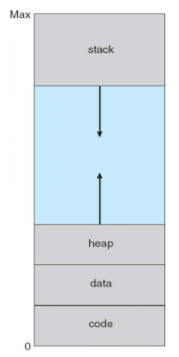


## Demand Paging

- Virtual Memory는 다음을 통해 구현

  - Demand paging
  - Demand segmentation

- Demand Paging

  - 필요할 때만 페이지를 메모리로 가져오기
    - 적은 I/O 필요
    - 적은 메모리 필요
    - 더 빠른 응답
    - 더 많은 사용자

- Basic concepts

  - 전체 프로세스를 가져오는 대신 swapper는 사용될 페이지만 메모리에 가져옴
    - Lazy swapper (or pager)
  - 메모리에 있는 페이지와 디스크에 있는 페이지를 구분하려면 하드웨어 지원이 필요
    - Valid-Invalid bit 방법 사용
      - Valid : 연결된 페이지가 legal 과 메모리에 모두 있음
      - Invalid : 페이지가 잘못되었거나 유효하지 않지만 현재 디스크에 있음
        - Invalid -> abort
        - Not in memory -> bring to memory

  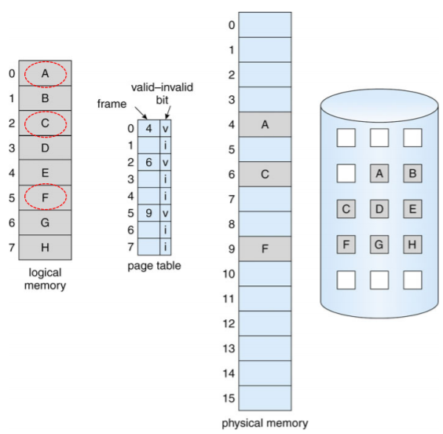

### Page Fault

- 페이지에 대한 참조가 있는 경우 해당 페이지에 대한 첫번째 참조는 운영체제에 트랩됨

  - Page fault

- 운영체제는 결정할 다른 테이블을 봄

  - Invalid reference
  - Just not in memory

- 빈 프레임 가져오기

- 페이지를 프레임으로 스왑

- 테이블 재설정

- valid bit = v로 설정

- Page Fault를 일으킨 명령을 다시 실행

- Steps in handling a page fault

  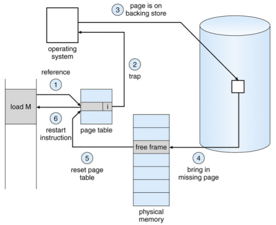

### Aspect of Demand Paging

- 극단적인 경우 : 메모리에 페이지 없이 프로세스 시작
  - OS는메모리에 상주하지 않는 프로세스의 첫 번째 명령에 대한 명령 포인터를 설정 -> Page Fault
  - 첫번째 액세스의 다른 모든 프로세스 페이지
  - **Pure demand paging**
- 실제로 주어진 명령어는 여러 페이지에서 액세스할 수 있음- > multiple page faults
  - 메모리에서 2개의 숫자를 더하고 결과를 메모리에 다시 저장하는 명령어의 fetch 및 decode 고려
  - 참조 지역성으로 인한 pain 감소
- Demand Paging에 필요한 하드웨어 지원
  - Valid / Invalid bit가 있는 페이지 테이블
  - 보조 메모리(스왑 공간이 있는 스왑 장치)
  - 명령 재시작

#### Instruction Restart

- Restart overhead
  - 페이지 오류가 발생하면 명령을 다시 가져와서 디코딩해야 함
  - A worst-case example
    - Block move
  - Solutions
    - 블록의 양쪽 끝에 접근
    - 임시 레지스터를 사용하여 덮어쓰기 위치의 값을 보유하는 방법

### Performance of Demand Paging

- Stages in Demand Paging (worse case)
  1. 운영체제 트랩
  2. 사용자 레지스터 및 프로세스 상태 저장
  3. 인터럽트가 page fault인지 확인
  4. 페이지 참조가 적합한지 확인하고 디스크에서 페이지 위치 확인
  5. 디스크에서 빈 프레임으로 읽기를 실행
     1. 읽기 요청이 처리될 때까지 이 장치의 대기열에서 대기
     2. 기기 탐색 및 지연 시간을 기다림
     3. 빈 프레임으로 페이지 전송 시작
  6. 기다리는 동안 다른 사용자에게 CPU 할당
  7. 디스크 I/O 서브 시스템에서 인터럽트 수신(I/O 완료)
  8. 다른 사용자의 레지스터 및 프로세스 상태를 저장
  9. 인터럽트가 디스크에서 발생했는지 확인
  10. 페이지 테이블 및 다른 테이블을 수정하여 페이지가 이제 메모리에 있음을 표시
  11. CPU가 이 프로세스에 다시 할당될 때까지 기다림
  12. 사용자 레지스터, 프로세스 상태 및 새 페이지 테이블을 복원한 다음 중단된 명령을 다시 시작
- Three major activities
  - 인터럽트 서비스 : careful coding은 수백개의 명령어가 필요함을 의미
  - 페이지 읽기 : 많은 시간
  - 프로세스 재시작 : 다시 약간의 시간
- Page fault rate 0 <= p <= 1
  - If p = 0, no page fault
  - If p = 1, every reference is a fault
- Effective Access Time(EAT)
  - EAT = (1-p) * Memory Access Time + p * Page Fault Time
  - Page Fault Time = page fault overhead + swap page out + swap page in + **restart overhead**

### Demand Paging Example

- Memory access time = 200 nanoseconds

- Average page-fault service time = 8 milliseconds

- EAT = (1-p) * 200 + p (8 milliseconds)

  = (1 - p) * 200 + p * 8,000,000

  = 200 + p * 7,999,800

- 만약 1,000개의 경우 중 한번의 액세스로 page fault가 발생하는 경우

  EAT = 8.2 microseconds

  This is slow down by a factor of 40!!

- 성능 저하를 10% 미만으로 원하는 경우

  - 220 > 200 + 7,999,800 * p

    20 > 7,999,800 * p

  - p < .0000025

  - < one page fault in every 400,000 memory accesses

### Demand Paging Optimizations

- 동일한 디바이스에 있더라도 파일 시스템 I/O보다 빠른 스왑 공간 I/O
  - 더 큰 chunks로 할당된 스왑, 파일 시스템보다 적은 관리 필요
- 프로세스 로드시 전체 프로세스 이미지를 스왑 공간에 복사
  - 그런 다음 스왑 공간에서 페이지 인/아웃
  - 구형 BSD Unix에서 사용
- 디스크의 프로그램 바이너리에서 페이지 인을 요구하지만 프레임을 해제할 때 페이징하지 않고 버림
  - Solaris 및 현재 BSD에서 사용
  - 여전히 스왑 공간에 쓰기 필요
    - 파일과 연관되지 않은 페이지(예: 스택 및 힙) : 익명 메모리
    - 메모리에서 수정되었지만 아직 파일 시스템에 다시 기록되지 않은 페이지
- Mobile Systems
  - 일반적으로 스와핑을 지원하지 않음
  - 대신 파일 시스템에서 페이지를 요청하고 읽기 전용 페이지(예: 코드)를 회수

### Copy-on-Write

- Copy-on-Write(COW)를 사용하면 부모 및 자식 프로세스가 처음에 메모리에서 동일한 페이지를 공유할 수 있음

  - 두 프로세스 중 하나가 공유 페이지를 수정하는 경우에만 페이지가 복사

- COW를 사용하면 수정된 페이지만 복사되므로 보다 효율적인 프로세스 생성이 가능

- 일반적으로 사용 가능한 페이지는 zero-fill-on-demand pages의 풀에서 할당

  - 빠른 수요 페이지 실행을 위해 풀에는 항상 여유 프레임이 있음
    - 페이지 폴트에 대한 다른 처리뿐만 아니라 프레임을 해제하고 싶지 않음
  - 할당하기 전에 페이지를 zero-out하는 이유는??

- `vfork()`에서 변경된 `fork()` 시스템 콜에 부모 중단이 있고 부모에 대한 copy-on-write 주소 공간을 사용하는 하위 시스템이 있음

  - 자식이 `exec()`를 호출하도록 설계
  - 매우 효율적

- Example

  - Before process 1 modifies page C

    

  - After process 1 modifies page C

    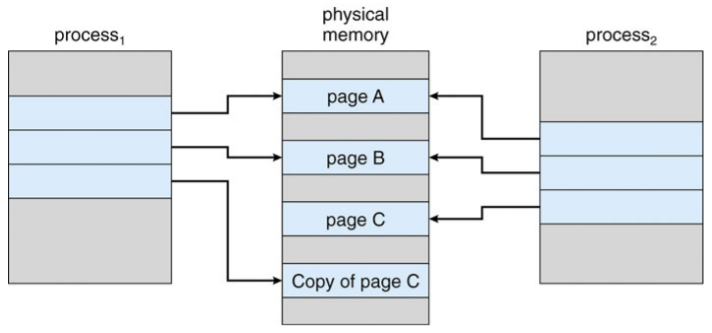


## Page Replacement

- Need for page replacement

  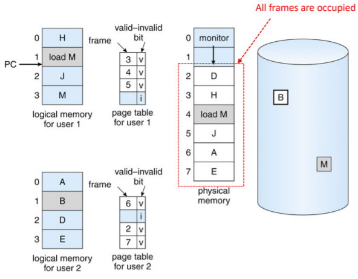

- free fame이 없는 경우

  - 메모리에서 일부 페이지를 찾았지만 실제로 사용하지 않는 페이지를 찾은 다음 교체 -> page replacement
  - 최소한의 페이지 폴트 수를 위한 페이지 교체 알고리즘 필요
  - 페이지 전송의 오버헤드를 줄이기 위해 비트 수정(dirty)
    - 수정된 페이지만 표시

- Basic page replacement

  1. 디스크에서 원하는 페이지의 위치 찾기
  2. free frame 찾기
     - 여유 프레임이 있으면 사용
     - 여유 프레임이 없는 경우 페이지 교체 알고리즘을 사용하여 victim frame을 선택
     - dirty(수정)한 경우 victim 프레임을 디스크에 기록
  3. 원하는 페이지를 (새로)free 프레임으로 가져옴. 페이지 및 프레임 테이블 업데이트
  4. 트랩을 유발한 명령을 다시 시작하여 프로세스를 계속함

- 이제 잠재적으로 페이지 폴트에 대해 2개의 페이지 전송이 발생 : EAT 증가

  

### Page and Frame Replacement Algorithm

- **Frame-allocation algorithm**
  - 각 프레세스에 제공할 프레임 수
  - 교체할 프레임
- **Page-replacement algorithm**
  - 첫번째 액세스와 재 액세스 모두에서 가장 낮은 페이지 오류율을 원함
- 특정 메모리 참조 문자열 (참조 문자열)에서 알고리즘을 실행하고 해당 문자열의 페이지 폴트 수를 계산하여 알고리즘을 평가
  - 문자열은 전체 주소가 아닌 페이지 번호일 뿐
  - 같은 페이지에 반복적으로 액세스해도 페이지 폴트가 발생하지 않음
  - 결과는 사용 가능한 프레임 수에 따라 다름
- 다음부터 나오는 모든 예에서 참조된 페이지 번호의 참조 문자열은
  - 7, 0, 1, 2, 0, 3, 0, 4, 2, 3, 0, 3, 0, 3, 2, 1, 2, 0, 1, 7, 0, 1

### Page Fault vs. The Number of Frames

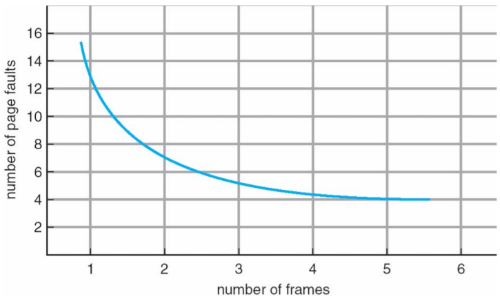


### Page Replacement Algorithms

- FIFO page replacement
- Optimal page replacement
- LRU page replacement
- LRU-Approximation page replacement
  - Additional-Reference-Bits algorithm
  - Second-Chance algorithm
  - Enhanced Second-Chance algorithm
- Counting-Based page replacement
  - LFU algorithm
  - MFU algorithm

#### FIFO Algorithm

- Reference string

  - 7, 0, 1, 2, 0, 3, 0, 4, 2, 3, 0, 3, 0, 3, 2, 1, 2, 0, 1, 7, 0, 1

- 3 frames

  - 프로세스당 한번에 3페이지를 메모리에 저장할 수 있음

  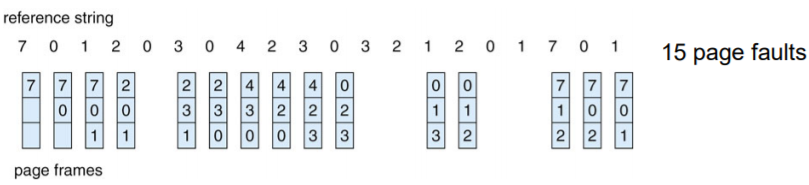

- **Belady's abnomaly**

  - More frames -> More page faults

- Reference string

  - 1, 2, 3, 4, 1, 2, 5, 1, 2, 3, 4, 5

  

#### Optimal Algorithm

- 장기간 사용하지 않을 페이지 교체

  - 이것을 어떻게 알까
  - 알고리즘 성능 측정에 사용

  

#### Least Recently Used(LRU) Algorithm

- 미래보다는 과거의 지식을 사용

- 가장 오래 사용하지 않은 페이지 교체

  - 마지막 사용 시간을 각 페이지와 연결

  

- 12 faults : FIFO보다는 좋지만 OPT보다는 나쁨

- 일반적으로 좋은 알고리즘이며 자주 사용됨

- 구현 방법은?

  - counter implementation
  - stack implementation

##### **Counter implementation**

- 모든 페이지 항목에 카운터 포함. 카운터를 통해 페이지를 참조할 때마다 시계를 카운터에 복사
- 페이지를 변경해야할 때 카운터에서 가장 작은 값을 찾음
  - 테이블 검색 필요

##### **Stack implementation**

- 페이지 번호의 스택을 더블 링크 형태로 보관

- 참조 페이지

  - move in to the top
  - 6개의 포인터를 변경해야 함

- 업데이트마다 비용이 많이 필요

- replacement를 위한 검색 없음

- LRU와 OPT는 Belady's Anomaly가 없는 스택 알고리즘의 경우

- Use of a stack to record most recent page references

  

#### LRU Approximation Algorithms

- LRU는 특별한 하드웨어가 필요하고 여전히 느림
- **Reference bit**
  - 각 페이지의 비트는 0으로 초기화
  - 페이지 참조 비트가 1로 설정된 경우
  - 아무거나 기준 비트는 0으로 교체(존재하는 경우)
    - 우리는 순서를 모르지만

##### **Additional-Reference-Bits algorithm**

- 테이블의 각 페이지에 대한 8-비트 바이트
- 일정한 간격으로 OS는 각 페이지의 참조 비트를 8비트 바이트의 상위 비트로 이동하고 나머지 비트는 오른쪽으로 1비트 이동하고 하위 비트는 버림
  - 지난 8시간동안의 페이지 사용 내역
- 11000100 페이지는 01110111 페이지보다 최근에 사용됨

##### **Second-chance algorithm**

- 일반적으로 FIFO 및 하드웨어 제공 참조 비트
- Clock replacement
- 교체할 페이지가 있는 경우
  - Reference bit = 0 -> replace it
  - reference bit = 1 then:
    - reference bit를 0으로 설정하고 페이지를 메모리에 남겨둠
    - 동일한 규칙에 따라 다음 페이지 교체


##### **Enhanced Second-Chance Algorithm**

- Reference bit + Modify bit

- Four possible cases

  

- 교체할 페이지를 찾기 전에 circular queue를 여러 번 스캔해야 할 수 있음

#### Counting -based Algorithm

- 각 페이지에 대한 참조 횟수 카운터 유지

- **LFU(Least Frequently Used) algorithm**

  - 카운터가 가장 작은 값을 가지는 페이지를 교체
  - 많이 사용된 페이지는 참조 횟수가 많다고 가정

- **MFU(Most Frequently Used) algorithm**

  - 카운터가 가장 많은 값을 가지는 페이지를 교체
    - 많이 참조된 페이지는 이제 다 사용했고 카운터가 적은 페이지가 아직 사용되지 않았고 많이 사용될 것이라 가정

- Page Replacement Examples

  - Page reference string
    - 1, 2, 3, 4, 2, 1, 5, 6, 2, 1, 2, 3, 7, 6, 3, 2, 1, 2, 3, 6

  

### Allocation of Frames

- 각 프로세스에는 최소 프레임 수 필요
  - 최소 프레임 수는 컴퓨터 아키텍처에 의해 정의
    - IBM 370 : MOVE 명령을 처리하는 6 페이지
      - Instruction : 6바이트(단어 이상), 2페이지 이상
      - 2 pages to handle from (in case of indirect addressing)
      - 2 pages to handle to(in case of indirect addressing)
- Frame allocation schemes
  - Fixed allocation vs. Priority allocation
  - Global allocation vs. Local allocation

#### Fixed Allocation

- **Equal allocation**

  - 예를 들어 100 프레임(OS용 프레임 할당 후)과 5개의 프로세스가 있는 경우 각 프로세스에 20프레임을 부여

- **Proportional allocation**

  - 프로세스 규모에 따라 할당

    

#### Priority Allocation

- 크기보다는 우선순위를 이용한 비례 할당 방식 사용
- 프로세스 P<sub>i</sub>에서 페이지 폴트가 발생하면
  - 프레임 중 하나를 교체하도록 선택
  - 우선순위가 낮은 프로세스에서 프레임 교체

#### Global vs. Local Allocation

- **Global replacement**
  - 프로세스는 모든 프레임 집합에서 교체 프레임을 선택
    - 한 프로세스가 다른 프로세스로부터 프레임을 가져올 수 있음
  - 하지만 프로세스 실행시간은 크게 다를 수 있음
  - 그러나 더 많은 처리량으로 더 일반적
- **Local replacement**
  - 각 프로세스는 자체 할당된 프레임 집합에서만 선택
  - 보다 일관된 프로세스별 성능
  - 하지만 메모리 사용률이 낮음


## Thrashing

- 프로세스에 "충분한" 페이지가 없으면 page fault 발생률이 매우 높음

  - 낮은 CPU 사용률
  - 운영체제는 다중 프로그래밍의 정도를 높여야한다고 생각
  - 시스템에 추가된 다른 프로세스

- Thrashing

  - 프로세스 내/외부로 페이지 교환이 진행 중

  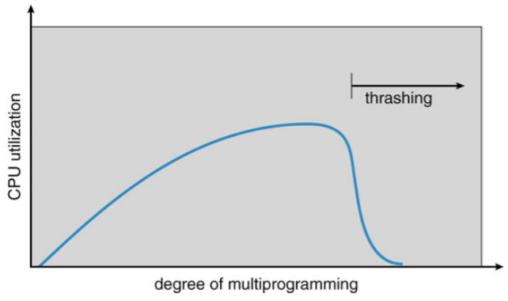

- Thrashing을 방지하려면 프로세스가 필요한 만큼 프레임을 제공해야 함

  - 필요한 프레임 수를 어떻게 알 수 있나
  - 프로세스 실행의 지역성 모델
    - Locality : 함께 적극적으로 사용되는 페이지 집합
      - Function call
    - 프로세스가 한 지역에서 다른 지역으로 마이그레이션
    - 지역이 겹칠 수 있음

- Thrashing이 발생하는 이유

  - 현재 지역의 크기 > 할당된 프레임의 크기

- Locality in a memory reference pattern

  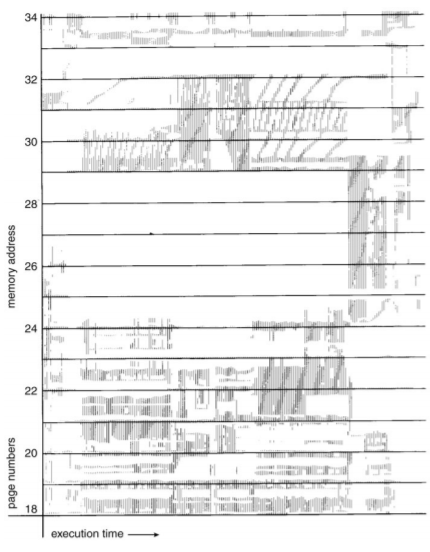

### Working-Set Model

- Based on locality

- ∆ ≡ the working-set window

  - 고정된 수의 페이지 참조(예: 1000 instructions)

- WS<sub>i</sub> ≡ the working-set of process P<sub>i</sub>

  - 가장 최근에 참조된 페이지 세트 ∆
  - 페이지가 활발하게 사용중인 경우 -> in the working-set

- WSS<sub>i</sub> ≡ the size of WS<sub>i</sub>

  - 만약 ∆가 엄청 작으면, 전체 지역을 포함하지 않음
  - 만약 ∆가 엄청 크면, 여러 지역을 포함

- D ≡ the total demand for frames = Σ WSS<sub>i</sub>

- if D > m -> Thrashing

  - m = 사용 가능한 총 프레임 수
  - 만약 D > m, 프로세스 중 하나를 일시 중지(suspend)

  

- Working set을 추적하는 방법

  - Approximate with interval timer + reference bit
  - Example : ∆ = 10,000 references
    - 각 페이지 당 2비트를 메모리에 보관
    - 매번 5,000 참조 후 타이머 인터럽트
      - 모든 참조 비트의 값을 복사하여 0으로 설정
    - 메모리의 비트중 하나는 1 -> working set의 페이지
  - 이것이 완전히 정확하지 않은 이유는 무엇인가
  - Improvement = 10 비트 그리고 1000시간 단위마다 인터럽트

### Page-Fault Frequency

- WSS 보다 더 직접적인 접근

- *"허용(acceptable)"* page-fault frequency(PFF) 비율을 설정하고 로컬 교체 정책(local replacement policy)를 사용

  - 실제 속도가 너무 낮으면 프로세스 프레임 손실
  - 실제 속도가 너무 높으면 프로세스 게인(gains) 프레임

  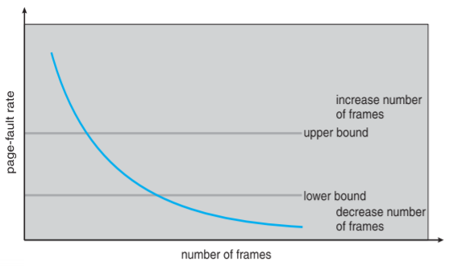


### Working-Set and page fault rate

- 프로세스의 Working Set과 페이지 오류 비율간의 직접적인 관게

- 시간에 따른 Working set 변경

- 시간에 따른 peaks와 valleys

  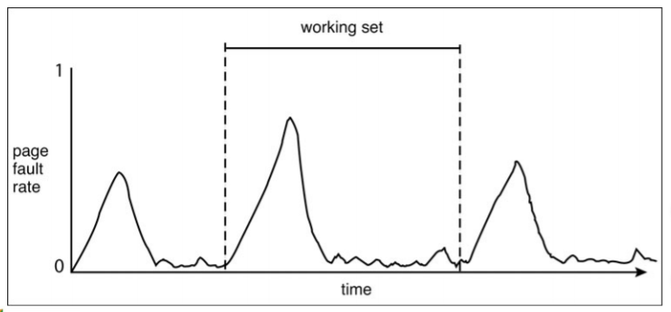

### Memory-Mapped Files

- Memory-mapped file I/O를 사용하면 디스크 블록을 메모리의 페이지에 매핑하여 파일 I/O를 일상적인 메모리 액세스로 처리 가능

- 처음에 demand paging을 이용하여 파일을 읽음

  - 파일 시스템에서 실제 페이지로 페이지 크기의 부분을 읽음
  - 파일의 후속 읽기/쓰기를 일반 메모리 액세스로 처리

- `read()` 및 `write()` 시스템 호출이 아닌 메모리를 통해 파일 I/O를 구동하여 파일 액세스를 단순화하고 속도를 높임

- 또한 여러 프로세스가 동일한 파일을 매핑하여 메모리에 있는 페이지를 공유할 수 있음

- 기록된 데이터는 언제 디스크에 저장되는가

  - 주기적으로 또는 파일 `close()` 시에
  - 예를들어 호출기(pager scans)가 더티 페이지(dirty pages)를 검색할 때

  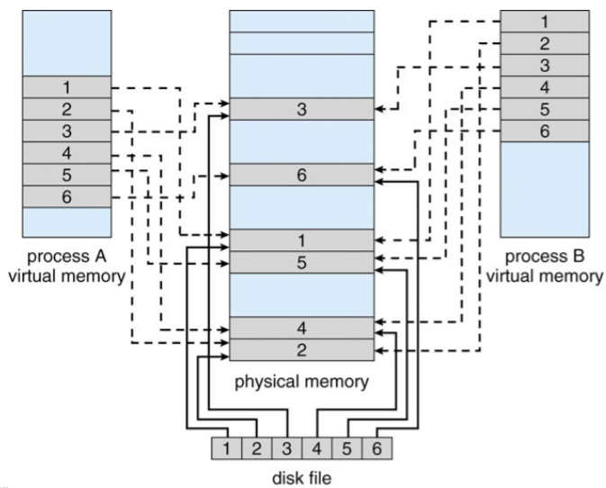

### Shared Memory via Memory-Mapped I/O

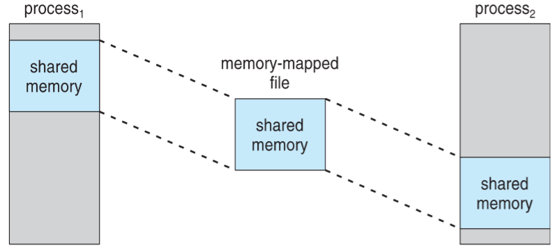


## Kernel Memory Allocation

- 사용자 메모리와 다르게 취급
- 사용 가능한 메모리 풀에서 할당되는 경우가 많음
- 다양한 크기의구조에 대한 커널 요청 메모리
  - 페이지 크기보다 작은 데이터 구조 -> 단편화(Fragmentation)
- 일부 커널 메모리 연속 필요
- 잘 알려진 두 가지 방법
  - Buddy system
  - Slab Allocation

#### Buddy System

- 물리적인 연속 페이지로 구성된 고정 크기 세그먼트에서 메모리 할당

- 2의 제곱 allocator를 사용하여 할당된 메모리

  - 2의 제곱으로 크기가 지정된 단위로 요청을 충족
  - 다음으로 높은 2의 제곱으로 반올림된 요청
  - 사용 가능한 것보다 더 작은 할당이 필요한 경우 현재 chunk는 다음으로 낮은 2의 제곱의 두 buddy로 분할
    - 적절한 크기의 chunk를 사용할 수 있을 때까지 반복

- 예를 들어 256KB chunk를 사용할 수 있다고 가정하면 커널이 21KB를 요청했을 때

  - 각각 128KB로 A<sub>L</sub> and A<sub>R</sub> 로 분할
    - 그리고 둘 중 하나는 64KB로 B<sub>L</sub> and B<sub>R</sub>로 더 분할
      - 32KB의 C<sub>L</sub> and C<sub>R</sub>에 1개 더 추가 -> 요청을 충족하기 위해

- 장점 : 사용하지 않는 chunk를 더 큰 chunk로 신속하게 통합

- 단점 : 단편화(fragmentation)

  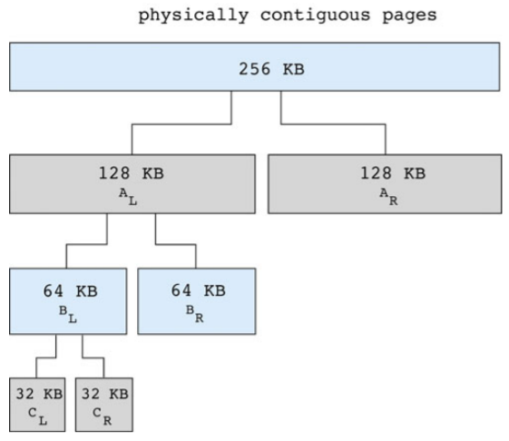

#### Slab allocation

- Slab는 물리적으로 인접한 하나 이상의 페이지

- 캐시는 하나 이상의 slab로 구성

- 각 고유 커널 데이터 구조별 단일 캐시

  - 오브젝트로 채워진 각 캐시 - 데이터 구조의 인스턴스화

- 캐시 생성시 사용 가능한 것으로 표시된 오브젝트로 채워짐

- 구조 저장시 사용된 것으로 표시된 오브젝트

- Slab가 사용된 오브젝트로 가득 찬 경우, 빈 slab에서 다음 오브젝트가 할당됨

  - 빈 slab가 없는 경우, 신규 slab 할당

- 단편화(fragmentation) 없음, 빠른 메모리 요청

  


## Other Issues

- **Prepaging**

  - 프로세스 시작시 발생하는 많은 수의 페이지 폴트를 줄이려면
  - 프로세스에 필요한 페이지의 전부 또는 일부를 참조하기 전에 미리 페이지(Prepage)로 지정
  - prepage를 사용하지 않는 경우 -> I/O 및 메모리 낭비
  - s 페이지가 프리 페이징되고 페이지의 α가 사용된다고 가정
    - Cost of s*α saved page faults
    - Cost of prepaging s*(1-α) unnecessary pages
    - If α is close to 0, prepaging loses

- **Page size**

  - Fragmentation
  - Table size
  - I/O overhead
  - Lcality

- 항상 2의 제곱, 일반적으로 2<sup>12</sup>(4,096바이트) ~ 2<sup>22</sup>(4,194,304바이트) 범위

- 평균적으로 시간이 지남에 따라 커짐

- **TLB Reach**

  - TLB Reach : TLB에서 액세스 할 수 있는 메모리 양
    - TLB Reach = TLB size * page size
  - 이상적으로는 프로세스의 working-set이 TLB에 저장
  - TLB Reach를 높이기 위해
    - TLB의 항목 수를 늘리면 -> 비쌈
    - 페이지 크기를 늘리면 -> 단편화
    - 여러 페이지 크기를 지원하려면 -> OS에서 TLB를 관리해야 함

- **Program structure**

  - `int[128, 128] data;`

  - Each row is stored in one page

  - Program 1

    ```c
    for (j = 0; j < 128; j++)
    	for (i = 0; i < 128; i++)
    		data[i, j] = 0;
    ```

    128 * 128 = 16,384 page faults

  - Program 2

    ```c
    for (i = 0; i < 128; i++)
    	for (j = 0; j < 128; j++)
    		data[i, j] = 0;
    ```

    128 page faults

- **I/O Interlock**

  - I/O Interlock : 프로그램은 때때로 메모리에 잠가야함

  - Lock bit

    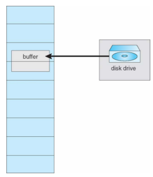
