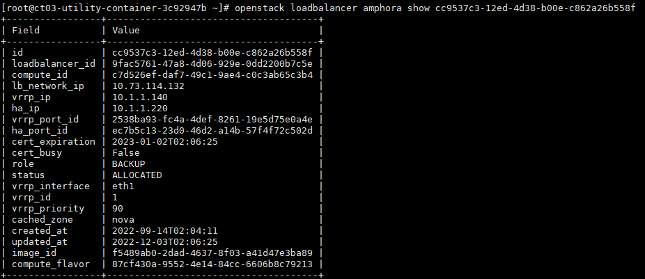

## Octavia Amphora HA 구성

OpenStack에서는 LoadBalancer를 Octavia라는 프로젝트에서 제공한다. 여기서 로드밸런서를 HA로 이중화 구성 방법에 대해 소개한다.

### Octavia 동작 방식

Octavia의 LoadBalancer의 기본 구조는 아래 그림과 같다. 기본적으로 vip를 할당받아 요청이 들어오면 listener를 통해 port를 구분하고 해당 port에 할당된 VM들로 정책에 맞게 부하분산한다.


이러한 로드밸런싱 작업들을 해주는 것이 Amphora VM이다. 하지만 Octavia 기본 설정으로 로드밸런서 생성 시에 Amphora가 하나만 생성되어 해당 노드가 죽거나 Amphora가 이상이 생기면 로드밸런싱을 하지 못한다.

Octavia에서는 해당 문제를 해결하기 위해 Amphora를 HA 모드로 구성할 수 있도록 제공한다.

참고

- https://www.slideshare.net/openstack_kr/openinfra-days-korea-2018-track-2-neutron-lbaas-octavia
- https://delightwook.tistory.com/39

### Amphora HA 구성도

Octavia의 Amphora HA는 VRRP를 이용하는데 Keepalived를 이용하여 구성한다.


위에 그림과 같이 두 개의 Amphora를 VRRP로 묶고 Master, Backup으로 구성한다. Master가 VIP를 가지고 있다가 떨어지면 Backup VM이 처리를 하는 방식이다. 

### Octavia Amphora HA 구성 방법

Amphora를 HA로 구성하는 방법은 간단하다. Octaiva의 config 값 두 가지만 수정하면 바로 적용된다.

- `/etc/octavia/octavia.conf` 수정

```shell
...
[controller_worker]
loadbalancer_ropology = ACTIVE_STANDBY
# SINGLE이 기본 하나 생성, ACTIVE_STANDBY가 두 개 생성

...
[nova]
enable_anti_affinity = True
# False면 amphora 2개 모두 같은 호스트에 생성될 수 있음, 그러면 호스트가 죽으면 HA가 안되기 때문에 해당 설정 True로 변경
```


- octavia 재시작
  - `systemctl restart octavia*`

### Octavia Amphora HA 테스트

- 설정 변경 후 로드밸런서 생성
  - role이 MASTER, BACKUP인 Amphora가 생성
  - SINGLE 모드일 경우 STANDALONE으로 하나만 생성


- 해당 Amphora 조회
  - 각각 vrrp에 대한 interface, id, priority 정보를 가짐
  - Master가 우선순위 100, BACKUP이 우선순위 90을 가짐
  - SINGLE 모드일 경우 vrrp에 대한 priority와 interface가 없음




- 이후 Master Amphora를 종료시켜도 lb가 동작되는 것을 확인
