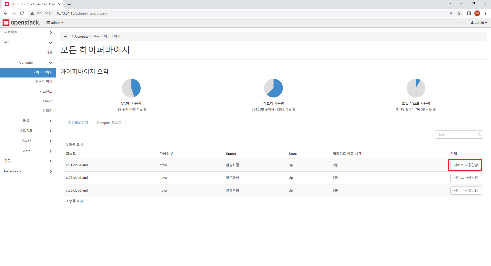
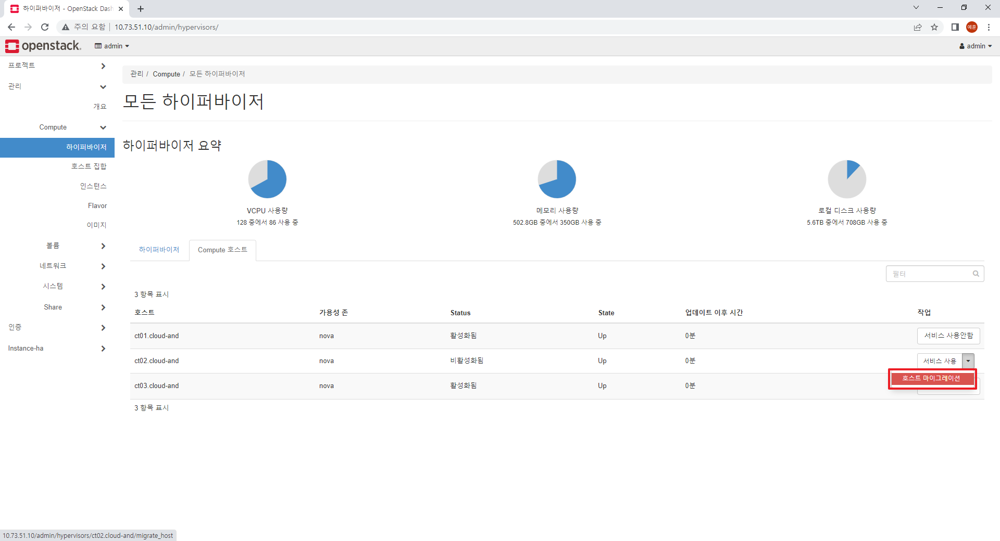
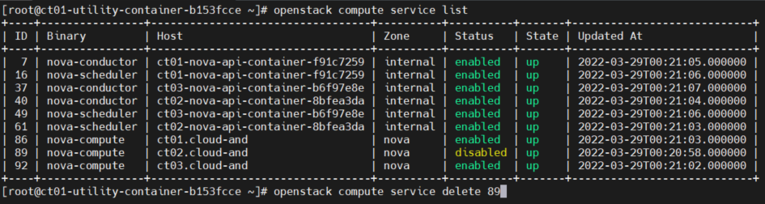

## 오픈스택에서 Compute의 호스트네임을 변경하는 방법

1. compute 호스트 비활성화

   - 호스트 네임을 변경할 compute호스트를 비활성화

     

2. VM 마이그레이션

   - 비활성화한 호스트에 있는 VM들을 마이그레이션을 통해 다른 호스트로 이동

     

3. Compute 삭제

   - OpenStack CLI를 통해 기존의 호스트네임을 가진 Compute 삭제

     ```bash
     $ openstack compute service list    # 삭제할 compute id 확인
     $ openstack compute service delete    # compute 삭제
     ```

     

4. 호스트네임 변경 후 nova-compute 재시작
   - compute 접속 후 변경
   
     ```bash
     $ hostnamectl set-hostname <host-name>
     $ systemctl restart nova-compute
     ```

