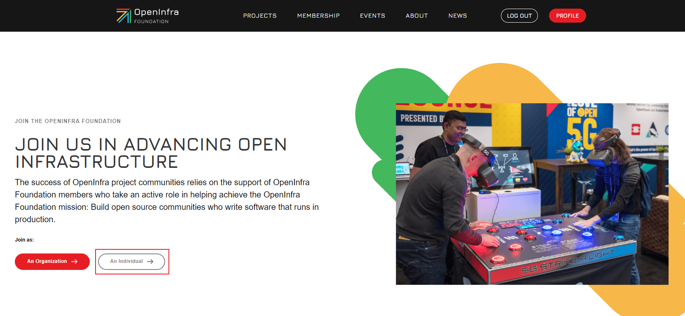
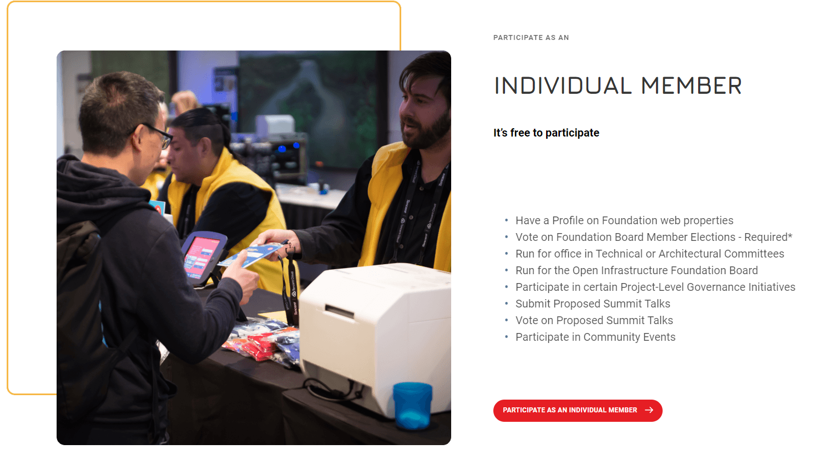
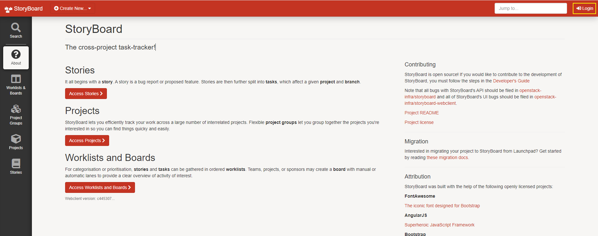
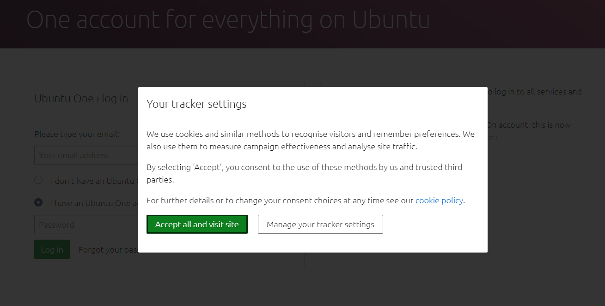
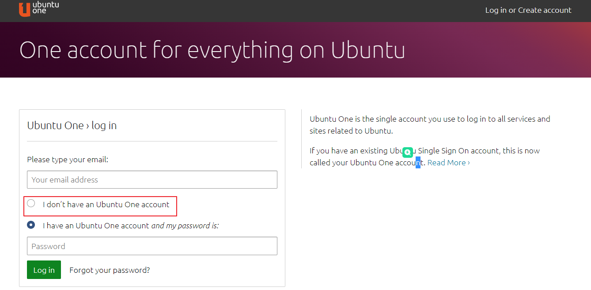
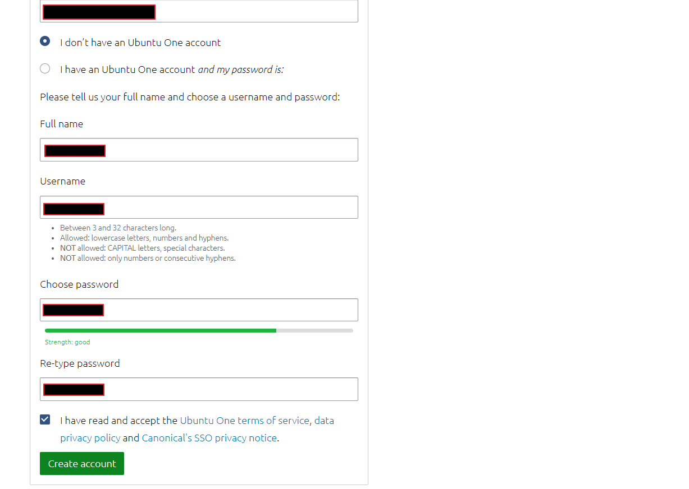
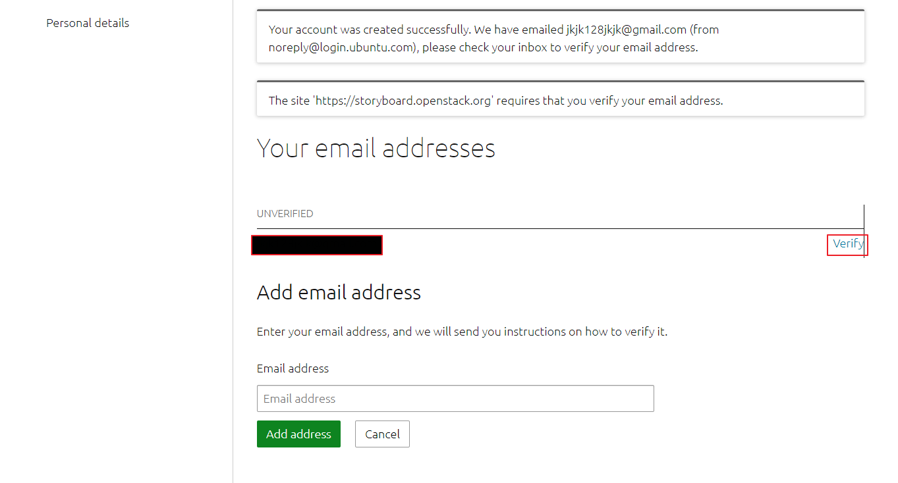
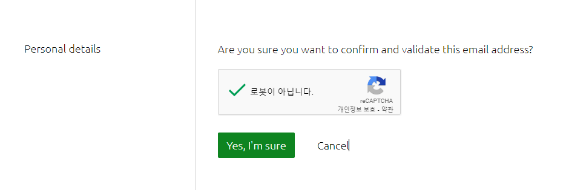
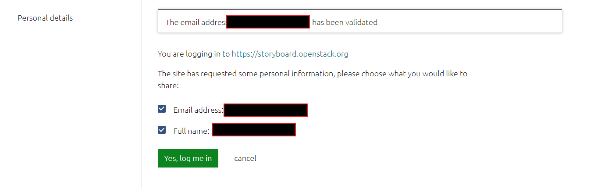

# OpenStack Contributor

1. 계정 생성
   - [Open Infrastructure Foundation Account](#open-infrastructure-foundation-account)
   - [StoryBoard](#storyboard)
   - [Launchpad](#launchpad)
2. git 설정
   - [Git Install](#git-install)
   - [Commit Message](#commit-message)

## Open Infrastructure Foundation Account

OpenStack Foundation Account

- OpenStack 프로젝트에서 특정 포지션 지원 가능
- OpenStack 컨퍼런스에서 발표 가능
- OpenStack 컨퍼런스에서 투표 가능

### 회원가입

> 코드에 기여를 할려면 코드 컨트리뷰션에 사용할 이메일과 같은 이메일로 가입해야 합니다.

- https://openinfra.dev/join/에서 회원가입
- An Individual 선택



- participate as an individual member 선택



- 정보 입력 후 회원가입 완료

## StoryBoard

- StoryBoard는 OpenStack 커뮤니티가 개발하고 있는 버그 추적 소프트웨어
- 현재 Launchpad에서 마이그레이션 작업  중이고 몇몇 프로젝트는 이미 StoryBoard를 사용 중

### 회원가입

- https://storyboard.openstack.org/ 에서 회원가입
- 오른쪽 상단의 login 버튼 클릭



- cookie 설정 팝업이 나오면 Accept all and visit site 선택



- I don't have an Ubuntu One account 선택



- 필요한 양식 입력하고 Create account 클릭



- 이메일 계정 옆의 Verify 클릭



- 가입한 계정으로 온 검증 메일에서 링크 클릭하고 Yes, I'm sure 클릭



- Yes, log me in 클릭하고 회원가입 완료



## Launchpad

- Launchpad는 OpenStack 커뮤니티가 이전에 사용하던 버그 추적 프로그램
- Launchpad는 StoryBoard와 같은 Ubuntu One 계정을 사용

관련 링크

- <https://docs.openstack.org/contributors/common/accounts.html>

---

## Git Install

- git 설치 방법에 대해서는 다른 포스팅이 많으니 따로 올리지는 않겠습니다.
- 다만 주의할 사항은 email은 StoryBoard에서 생성한 계정과 동일한 이메일을 사용하세요.
- https://xangmin.tistory.com/102

## Commit Message

- commit message는 reviewer들이 가장 먼저 보는 사항이고 git log의 설명으로 사용
- commit message는 patch가 적용되면 변경불가
- commit message 포맷은 아래와 같음

```bash
Summary Line
빈 줄
Body
빈 줄
Footers
```

#### Summary Line

- summary line은 해당 commit의 내용을 간략하게 설명
- 문자 제한은 50자이고 마침표로 끝나지 않음
- 한 번에 끝나지 않고 이후 변화가 계속 있다면 commit message를 WIP(Work In Progress)로 시작

#### Body

- Body는 다음의 내용을 포함
  - 해결하고자 하는 이슈에 대한 설명
  - 고쳐야 하는 이유
  - 솔루션에 대한 설명
  - 코드 구조를 어떻게 개선했는지에 대한 추가적인 설명
  - 연관 있는 페치에 대한 참조
- 각 라인은 72자로 제한
- Body는 review가 문제의 원인을 이해하거나 외부 사이트에 접속이 필요없이 문제와 관련하여 모든 중요한 정보를 포함하고 있어야함

#### Footers

- Footers는 변경사항들을 연결하고 정리하기 위해 명시되는 참조사항


- 필수 태그
  - Change-Id : 변경사항을 설명하는 고유 해시 태그, Git commit hook에 의해서 자동적으로 생성
- StoryBoard 명시 태그
  - `Task: <task num>` : 변경사항에 의해 생성되는 StoryBoard 내의 작업 번호, 해당 태그는 작업을 'Review' 상태로 업데이트하고 패치를 적용할 때 배정
  - `Story: <story num>` : 패치가 적용되고자 하는 StoryBoard 내의 스토리 번호, 해당 태그는 패치를 참조하는 링크와 함께 스토리에 코맨트를 줄때 참고
- Lanuchpad 명시 태그
  - `Closes-Bug: #<launchpad id>` : 커밋이 참조하는 버그를 완전하게 해결하고 이슈를 닫고자 하면 사용하는 태그, 태그 숫자로 해당 버그의 Lanuchpad의 ID 사용
  - `Partial-Bug: #<launchpad id>` : 커밋이 버그의 부분적인 해결이고 추가적인 작업이 필요하면 사용하는 태그, 태그 숫자로 해당 버그의 Lanuchpad의 ID 사용
  - `Related-Bug: : #<launchpad id>` : 커밋이 단순히 버그와 연관이 있다면 사용하는 태그, 태그 숫자로 해당 버그의 Lanuchpad의 ID 사용
  - Partial-Implements : 커밋이 Lanuchpad blueprint를 부분적으로 구현하면 사용하는 태그, blueprint의 이름을 태그 ID로 사용
  - Implements : 커밋이 Launchpad blueprint를 완전히 구현한다면 사용하는 태그, blueprint의 이름을 태그 ID로 사용
- 이외 선택사항
  - DocImpact : 문서에 영향이 있을 때 사용하는 태그
  - APIImapct : HTTP API에 영향이 있을 때 사용하는 태그
  - SecurityImpact : 보안 사항에 영향이 있을 때 사용하는 태그
  - UpgradeImpact : 변경사항이 업그레이드에 영향을 미치는 이유에 대해 설명
  - Depends-On : 