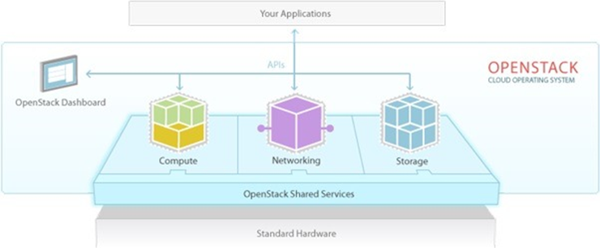
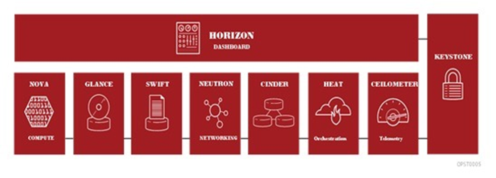
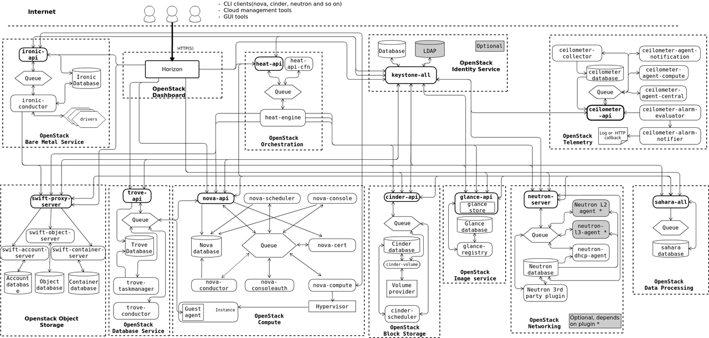
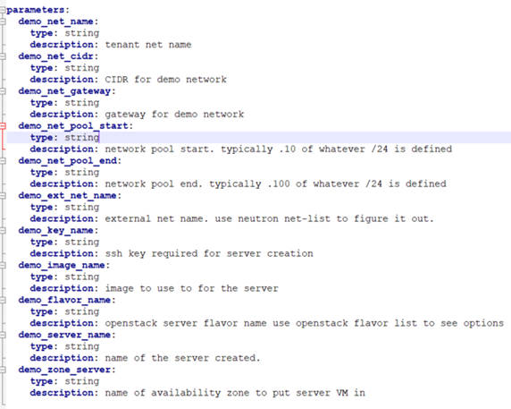
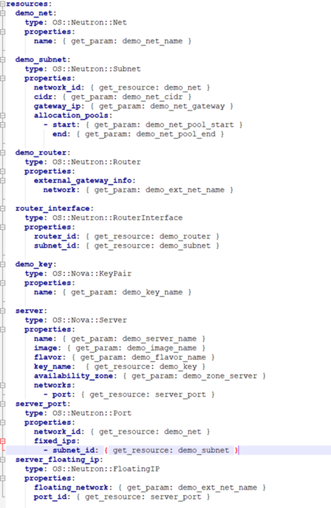
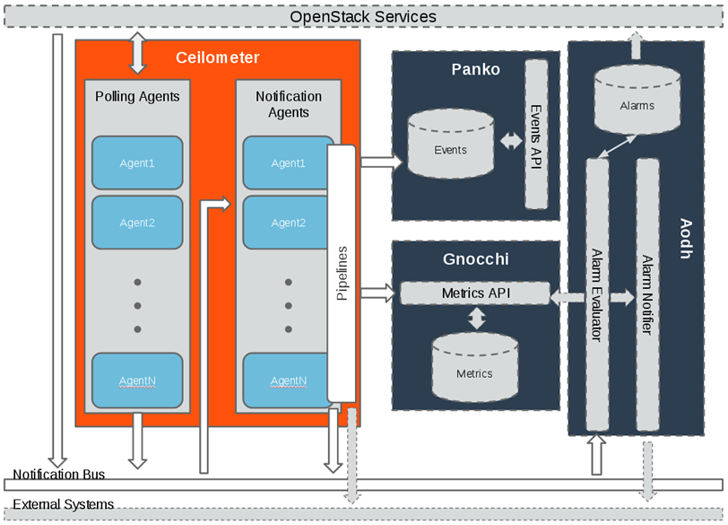
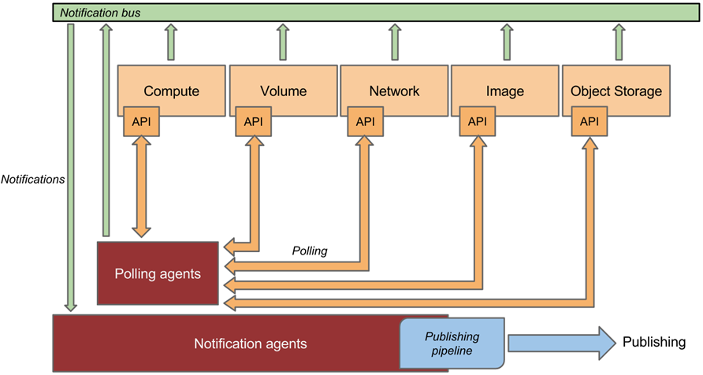

# 오픈스택 개요

> 오픈스택 간단 정리와 Logical Architecture 정리입니다.

## 목차

- [오픈스택이란?](#오픈스택이란)
- [오픈스택 프로젝트](#오픈스택-프로젝트)
- [Logical Architecture](#logical-architecture)
- [참고자료](#참고자료)

## 오픈스택이란?

- 모든 타입의 클라우드 컴퓨팅 플랫폼을 개발하고 관리할 수 있는 오픈 소스 소프트웨어 기반의 클라우드 운영체제
- IaaS(Infrastructure as a Service) 형태의 클라우드 컴퓨팅 오픈 소스 프로젝트
- API를 통하여 IaaS에 필요한 각 서비스들을 쉽게 구성하고 관리 가능
- 

- 클라우드 컴퓨팅 시스템의 컴퓨팅, 네트워킹, 스토리지, 인증 및 이미지 등을 관리할 수 있는 여러 프로젝트 형태로 제공
- IaaS의 필수 기능 외에도 편의를 위해 오케스트레이션, 서비스 관리 등의 프로젝트도 제공
- 

## 오픈스택 프로젝트

### NOVA(Compute)

- 인스턴스 생성, 삭제, 메모리 관리 등 인스턴스의 라이프사이클 관리
- CPU, Memory, Network, Storage를 이용해 가상 머신 서비스를 제공

### NEUTRON(Networking)

- 오픈스택 네트워킹 기능을 제공하는 프로젝트
- 스위치, 서브넷 및 라우터를 포함하여 가상 네트워크 생성 및 관리
- 가상 방화벽, VPN, 로드 밸런서 등의 기능 제공

### CEILOMETER(Monitoring)

- 오픈스택 내 모든 서비스들의 자원 정보를 측정하고 관리하여 제공
- 서비스로부터 전송되는 알림을 모니터링하여 이벤트 및 데이터를 수집

### SWIFT(Object Storage)

- 오픈스택에서 사용되는 데이터 객체들을 저장하는 서비스
- 클러스터 내의 여러 개의 디스크 드라이브에 데이터가 분산되어 저장
- 동영상, 이미지, 디스크 이미지 등의 대용량, 비정형 데이터용 스토리지 

### CINDER(Block Storage)

- 인스턴스의 물리적인 데이터 공간을 제공하는 서비스
- 스냅샷 관리 기능을 제공하여 블록 스토리지 백업 및 복구 가능

### MANILA

- 공유 파일 시스템

- NFS, CIFS, HDFS, CEPHFS 등 지원

### KEYSTONE(Identity)

- 사용자에 대한 서비스들의 사용 인증 및 인가 서비스를 제공
- 사용자와 시스템의 접근 정책을 중앙에서 관리하며 모든 서비스들에 대해 제공

### GLANCE(Image)

- Nova 프로젝트에서 생성한 인스턴스에 설치할 OS 이미지들을 저장하는 서비스
- 생성할 인스턴스에 설치할 운영체제 이미지를 Glance에 드옥시키고 이미지를 이용하여 인스턴스 생성

### HEAT(Orchestration)

- 인프라 배포를 자동화할 수 있게 해주는 템플릿 기반의 오케스트레이션 서비스
- Heat Orchestration Template(HOT)을 이용해 자동화하여 오픈스택 프로젝트들의 API 호출을 수행함으로써 인프라를 쉽게 배포

### HORIZON(dashboard)

- 클라우드 관리자와 사용자들이 다양한 오픈스택 자원과 서비스를 관리하고 이용할 수 있도록 해주는 웹 인터페이스
- 웹 UI를 통해 인스턴스 생성, 삭제 및 관리 등을 쉽고 빠르게 처리

### Ironic

- 베어 메탈을 프로비저닝하는 프로젝트
- Keystone, nova, neutron, glance, swift 서비스를 이용해 구성

### Sahara

- OpenStack에서 데이터 처리 프레임워크(Hadoop, Spark, Strom)을 프로비저닝하는 프로젝트
- 프레임워크 버전, 클러스터 토폴로지, 노드 하드웨어 세부 사항 등의 매개 변수를 지정하여 생성

### Trove

- 관계형 및 비 관계형 데이터베이스 엔진 모두에 대해 확장 가능하고 안정적인 Cloud Database as a Service 프로비저닝 기능을 제공하는 프로젝트
- 단일 명령어로 여러 종류의 DB 관리가 가능하고 데이터베이스를 쉽게 생성 가능

## Logical Architecture

- OpenStack 문서에서 나와있는 Logical Architecture 입니다.

### 간략한 인스턴스 생성 과정

1. 사용자가 Horizon을 통해 인스턴스 생성 요청
2. Nova는 받은 인스턴스 요청에 대해 사용자에 대한 권한 확인
3. Keystone에서 권한 확인
4. Nova는 인스턴스에 필요한 이미지와 볼륨, 네트워크를 할당받기 위해 요청
5. 요청받은 Cinder(Block), Glance(Image), Neutron(Networking)에서 모두 Keystone에 auth-token을 이용하여 사용자 확인
6. 인증되면 각각의 요청에 대해 Nova로 응답
7. 인스턴스 생성 완료

### Heat 프로젝트 과정

- Heat는 HOT를 통해 여러 프로젝트로 한 번에 요청을 보내 생성 가능
- HOT 예제
- 

- 

- 

- **빨간색 선**
  - 위의 템플릿 예제의 요청 과정
  - Horizon을 통해 위의 HOT 파일을 등록하여 생성 요청
  - Heat는 받은 요청을 처리하기 위해 heat-engine에서 필요한 프로젝트들로 API 요청
  - Nova에서는 인스턴스 생성, Neutron에서는 라우터, 스위치 등 생성
- **파란색 선**
  - 위의 예제 말고도 다른 주요 프로젝트와 연결되어 있어 한 번에 생성 가능

### Ceilometer 프로젝트 모니터링 과정

#### Ceilometer Architecture

- 

- Cilometer는 Polling Agents와 Notification Agents를 통해 다른 프로젝트들의 데이터와 이벤트를 바당 처리
- Panko
  - 주어진 시간동안 오픈스택 리소스의 상태 정보를 캡처할 수 있는 메타 데이터 인덱싱, 이벤트 저장 서비스를 제공
  - 감사 및 시스템 디버깅과 같은 사용 사례를 위해 단기 및 장기 데이터를 저장하는 확장 가능한 수단을 활성화
  - 로그 및 시스템 이벤트 작업과 같은 문서 지향 데이터를 캡처하도록 설계된 이벤트 저장소 프로젝트
- Aodh
  - Ceilometer에서 수집 한 샘플 또는 이벤트 데이터에 대해 정의 된 규칙을 기반으로 작업을 트리거
  - 사용자 정의 규칙이 위반 될 때 경고를 보낼 수 있는 경보 서비스
- Gnocchi
  - 저장 및 쿼리를 최적화하기 위해 시계열 형식으로 측정 데이터를 캡처
  - TDBaaS(Time Series Database as a Service) 프로젝트

#### Polling Agetns와 Notification Agents

- 

- **Polling Agents**는 다른 프로젝트들의 데이터를 API를 이용하여 수집
- **Notification Agents**는 프로젝트에서 발생시키는 이벤트나 알림을 Notification Bus에서 수집

#### Logical Architecture

- 

- **빨간색 선**
  - central agent로 compute를 제외한 다른 프로젝트들에 대해 데이터 Polling
- **파란색 선**
  - compute agent로 compute와 관련된 데이터 Polling
- **초록 박스**
  - Notification Agent

### Ironic 인스턴스 생성 과정

1. 사용자는 Horizon을 통해 베어 메탈 서버 생성 요청

   - Horizon은 Nova로 해당 요청 전송

   - Nova는 Nova APi와 Nova Scheduler를 통해 Nova Compute 서비스로 전달

2. Nova Compute 서비스는 이 요청을 Ironic 서비스로 넘겨주며, Ironic API에서 컨덕터, 드라이버로 전달되어 물리 서버를 프로비저닝

3. Ironic 서비스는 베어 메탈 인스턴스를 프로비저닝하는데 필요한 이미지, 네트워크 및 기타 리소스를 다른 프로젝트와 통신하여 설정

### Swift

- Sahara <-> Swift = saves data or job binary in

- Ironic -> Swift = saves data

- 구조에서는 nova와 cinder 그리고 glance와 연결되어 있지 않지만
  - Glance -> Swift = Stores images in
  - Nova -> Swift = 데이터 저장
  - Cinder -> Swift = Backups volumes in

### Sahara

- Sahara <-> Swift = saves data or job binary in

- Sahara <-> Nova = 데이터 처리 클러스터를 위한 VM을 프로비저닝

- Sahara <-> Glance = Registers Hadoop images in

- Sahara <-> Neutron = 클러스터 네트워킹 제공

- Sahara <-> Cinder = VM 인스턴스 용 블록 스토리지 프로비저닝

- Sahara <-> Ironic = 데이터 처리 클러스터를 위한 베어 메탈 노드를 프로비저닝

- Sahara <-> Heat = 데이터 처리 클러스터 배포를 프로비저닝하고 오케스트레이션하는데 사용

### Trove

## 참고자료

- Heat
  - https://www.slideshare.net/519199496/openstack-orchestration-heat
  - https://naleejang.tistory.com/203

- Ironic
  - https://docs.openstack.org/ironic/pike/user/

- Sahara
  - https://docs.openstack.org/sahara/latest/intro/architecture.html 

- Trove
  - https://www.slideshare.net/arisu1000/trove-78196971
  - https://www.admin-magazine.com/Archive/2016/35/Exploring-OpenStack-s-Trove-DBaaS 

- Services
  - [https://www.openstack.org/software/project-navigator/openstack-components#openstack-services](https://www.openstack.org/software/project-navigator/openstack-components)
  - https://delightwook.tistory.com/16

- VM Create Flow
  - https://www.linuxtechi.com/step-by-step-instance-creation-flow-in-openstack/
  - https://jayeshc1990.wordpress.com/2018/11/10/openstack-instance-creation-workflow/

- Overview
  - https://docs.openstack.org/ko_KR/install-guide/overview.html 

- OpenStack Logical Architecture
  - https://docs.openstack.org/ko_KR/install-guide/get-started-logical-architecture.html 
