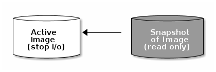

## OpenStack 스냅샷으로 볼륨 생성 후 스냅샷 삭제 안되는 문제

오픈스택에서 스냅샷을 통해 볼륨을 생성하고 난 후에 스냅샷을 삭제하려 하면 예약 삭제된다는 메세지만 표시되고 정작 삭제되지 않는다. 이는 ceph에서 스냅샷으로 볼륨을 생성하면 아래와 같이 볼륨과 스냅샷 간에 연결이 되면서 계층화 됩니다. 



따라서 해당 스냅샷이 생성한 볼륨의 parent가 되고 볼륨은 child가 된다. 이 상태에서는 볼륨의 parent가 snapshot이기 때문에 snapshot이 삭제되지 않는다. 이를 해결하기 위해서는 계층화를 깨고 flatten 작업을 해주어야 한다.

해결방법은 아래와 같다.

```sh
# 볼륨 조회하여 parent가 삭제하려는 snapshot이 맞는지 확인
[root@controller002 ~]$ rbd -p volumes info volume-047ed3a0-b97f-4f67-9b78-83dacea04484
rbd image 'volume-047ed3a0-b97f-4f67-9b78-83dacea04484':
	size 100GiB in 25600 objects
	order 22 (4MiB objects)
	block_name_prefix: rbd_data.ec276e348b72a9
	format: 2
	features: layering, exclusive-lock, object-map, fast-diff, deep-flatten
	flags: 
	create_timestamp: Tue May 30 10:38:24 2023
	parent: ssd-volumes/volume-7ea8328a-e81e-4a7f-ac54-20b2b30b7256@snapshot-43ec5f91-41ab-4348-972b-954fa6b9b7e9			# parent로 snapshot으로 설정된 것을 볼 수 있다.
	overlap: 100GiB

# 볼륨에 대해 flatten 작업
# 해당 작업은 용량이 클수록 오래 걸리고 ssd 볼륨이 아닐경우 더 오래 걸린다.
[root@controller002 ~]$ rbd -p volumes flatten volume-047ed3a0-b97f-4f67-9b78-83dacea04484
Image flatten: 100% complete...done.

# flatten 작업 완료 후 조회 시 parent가 없어진 것을 볼 수 있다.
[root@controller002 ~]$ rbd -p ssd-volumes info volume-8cafa6c6-18ea-42ea-876f-68ea793caecb
rbd image 'volume-8cafa6c6-18ea-42ea-876f-68ea793caecb':
	size 100GiB in 25600 objects
	order 22 (4MiB objects)
	block_name_prefix: rbd_data.b3600f2be0d7a1
	format: 2
	features: layering, exclusive-lock, object-map, fast-diff, deep-flatten
	flags: 
	create_timestamp: Fri May 19 19:36:16 2023
	parent: ssd-volumes/volume-798a1cbf-3b70-44ae-9e85-041e7e314866@snapshot-fd0d2928-00de-4447-89aa-500d269c751a
	overlap: 100GiB
```

