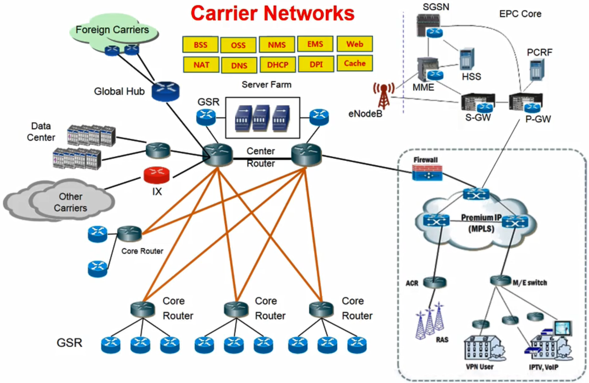

# 01. Challenges by Telcos

- Telco들이 가지고 있는 네트워크 구조

- 운영에 너무 많은 비용이 든다.
- SDN/NFV를 이용하여 비용을 줄이고 flexible한 환경 제공
- 위의 노란 박스는 NFV를 이용해 개선하고자 하는 미들웨어 박스
  - Network Function

### 트래픽의 폭발적인 증가

- 환경의 변화로 인하여 트래픽이 폭발적으로 증가하고 있음
- 이를 수용하기 위해 Telco 기업들은 많은 비용이 필요
  - 시설 확장
  - 인원 보충

### 비즈니스 패러다임 변화

- 컨텐츠를 피처폰에서는 통신 사업자가 지정한 기업이 개발하여 통신 사업자들이 검토하고 개발한 컨텐츠를 제공하여 수입을 개발자와 통신사업자가 공유
  - Closed Market
- 스마트폰이 나오면서 모든 사람, 기업이 개발을 하여 마켓에 올리고 수익은 개발자와 앱 스토어의 구글, 애플 등이 공유
  - Open Market

### TTM(Time To Market)

- 새로운 기능 추가나 변화에 너무 시간이 오래 걸림
- 페북, 구글, 아마존, 네이버 등은 Flexible하고 오픈 시스템을 이용하여 새로운 기능을 빠르게 추가하고 적용 가능
  - Shorter TTM
- 통신 사업자들은 Closed System이라 기능을 추가하려면 장비 벤더에게 요청하고 그것이 승인나고 추가하기 까지 시간이 오래걸림
  - Longer TTM

### 인터넷 플레이어의 확장

- 애플, 아마존, 구글 등의 서비스, 사업 아이템 확장
  - 클라우드 서비스, 유튜브, 앱스토어 등등
- 전세계 Telco 기업들에게 많은 영향을 끼침
- 또한 모바일 인스턴트 메시징 앱의 등장도 Telco들에게 영향
  - WhatsApp, KakaoTalk, WeChat, Line 등
  - SMS 사업에 많은 영향을 끼쳐 Telco 기업의 SMS 사업이 90%가 없어짐

### 결론

- Telco 기업이 운영하고 관리하는 인프라스트럭쳐는 지속적으로 비용이 많이 들어감

- 시설 투자에 비해 revenue와 profit이 지속적으로 감소

- 좀 더 flexible, agile, efficient한 운영 환경을 갖추어야 한다

- 많은 Telco 기업들이 SDN/NFV를 이용한 운영 환경을 갖추려 노력 중에 있음

  => **SDN/NFV = 'Open Networking'** promising solution