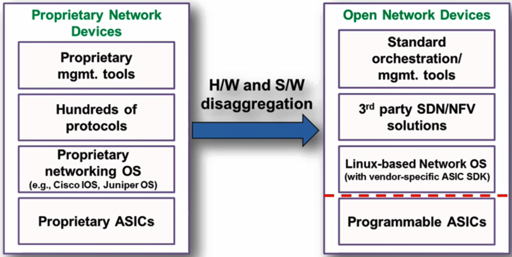
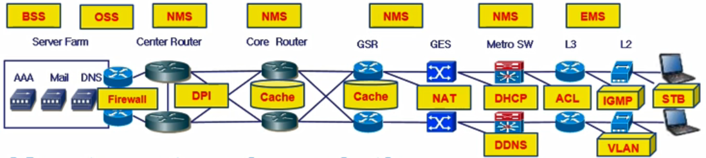
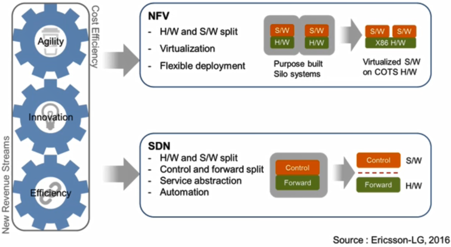
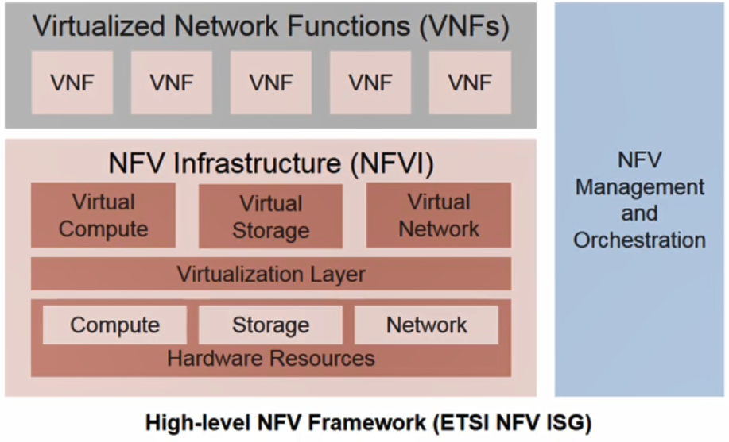
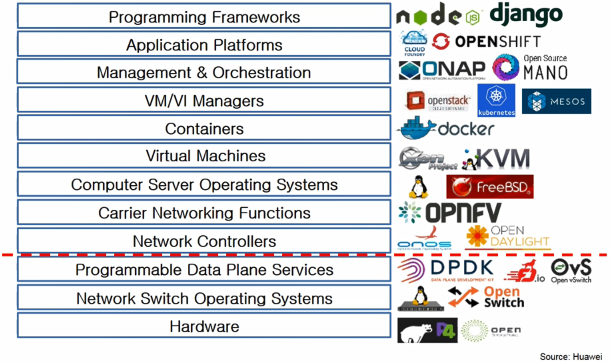

# 02. Open Networking Ecosystem 1

## Motivation for SDN/NFV

- 컴퓨팅분야

  

  - 메인프레임 모델을 20념 넘게 쓰다가 인텔과 AMD가 x86계열의 CPU를 제공하면서 다양한 시스템이 올라감
    - OS, 애플리케이션 등
  - 10년 전부터 클라우드 컴퓨팅이 제공되며 많은 비용을 지불하지 않고 환경 구축

- 네트워크분야

  

  - 최근까지 현재 대부분의 장비들이 proprietary한 변경이 쉽지 않은 시스템으로 운영

  => 하드웨어와 소프트웨어를 구분하여 제공. **SDN/NFV**

  - 오픈 네트워킁 환경으로 가는 것이 SDN/NFV의 핵심

## SDN / NFV

- Legacy Network

  

  - 노란 박스는 소프트웨어 기반
  - 하지만 라우터와 스위치 뿐만 아니라 네트워크 function들을 수행하는 시스템들이 하드웨어 기반으로 생성
  - 많은 비용이 들어감

- SDN/NFV

  

  - SDN의 핵심은 하드웨어와 소프트웨어를 분리
  - controller와 forward를 분리
    - 스위치는 패킷을 보내기만 함
    - 나머지 패킷 라우팅이나 네트워크의 전체 관리는 controller
  - NFV도 하드웨어와 소프트웨어를 분리
    - 가상화를 이용해 노란 박스에 있는 기능들을 따로 하드웨어를 구성하지 않고 하나의 하드웨어에 여러 개의 function들을 넣어서 동작
    - 하드웨어를 가상화하여 여러 개의 머신들이 있는 것 같이 Network Function을 올리는게 핵심

## SDN

- SDN
  - 컨트롤 플레인과 데이터 플레인 분리
  - 중앙에서(SDN Controller) 관리하고 authority를 제공
- OpenFlow(OF)
  - 가장 많이 사용하는 프로토콜
  - 컨트롤러와 장비를 연결해주는 커뮤니케이션 프로토콜
- SDN의 효과
  - Programmability
  - Agility
  - Flexibility
  - CAPEX/OPEX saving
  - Vendor neutrality

## NFV

- 하나의 불리서버에 VM, 컨테이너 등의 가상화 기술을 이용해 서버를 가상화를 시켜서 여러 개의 서버가 있는 것처럼 독립적인 운영 환경을 제공

- 컴퓨트, 스토리지, 네트워크 중 네트워크가 가장 늦음

- 네트워크에 구축되어 운영되는 비용이 많이 드는 네트워크 function들을 가상화시킴

  

- 오른쪽의 NFV Management and Orchestration은 네트워크 가상화 인프라스트럭쳐 운영 관리하고 VNF를 관리

## SDN/NFV 사용이유

- Deliver Agility and Flexibility : 50%
- Reduce Operational Expenditures : 23%
- Accelerate Time to Market : 14%
- Reduce Capital Expenditures : 13%

## Open Networking Ecosystem

### Hardware

- P4(Programming Protocol-independent Packet Processors)
  - 프로세서들도 하이 레벨 프로그래밍을 통해 개발하여 운영이 되게 하는 오픈 소스 프로젝트
- OCP(Open Compute Project)
  - 서버를 운영하는데 비용이 많이 들어 자기들에 맞는 필요없는 부분은 빼고 필요한 것만 넣게 디자인하여 하드웨어를 개발
  - 서버로 시작하여 네트워크의 베어메탈 스위치에서도 쓰임