# 03. Open Networking Ecosystem-2

## Network Switch Operating Systems

- Open Switch

  - 라우팅과 오픈플로우 에이전트 포함

  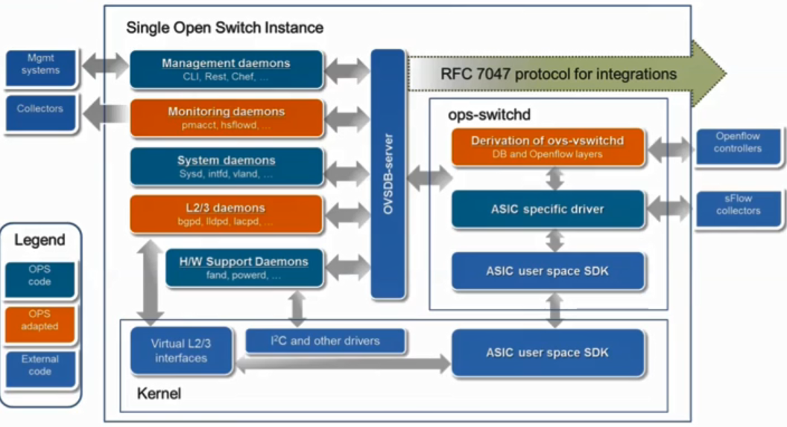

- ONL(Open Network Linux)

  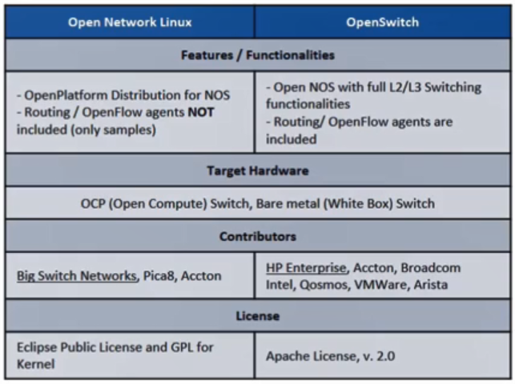

  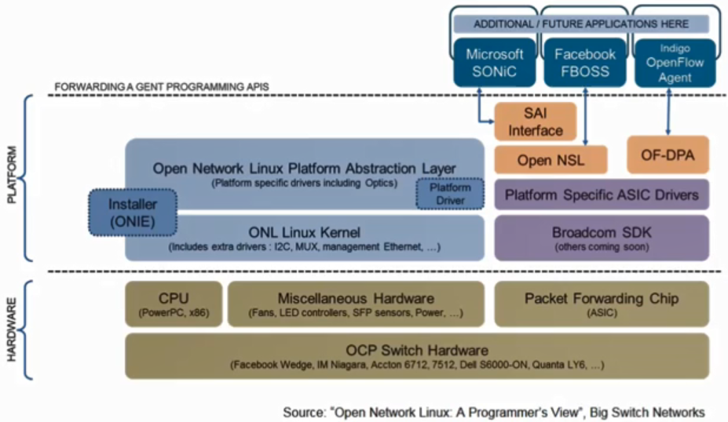

## Programmable Data Plane Services

- DPDK(Data Plane Development Kit)

  - fast packet processing 라이브러리 제공

- FD.io

  - cloud, VMs, containers, bare metal에서 사용할 수 있음

- Open vSwitch

  - 버추얼 머신들끼리 연결하기 위한 가상 스위치
  - 리눅스 베이스 가상화 플랫폼에서 실행
    - KVM, Virtual Box, Xen

  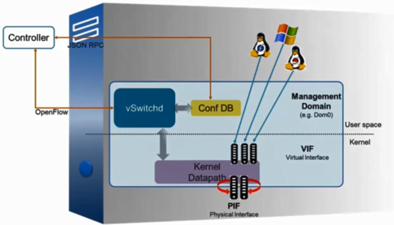

## Network Controllers

- ONOS

  - Telco들을 위해 개발
  - Distributed Network OS
  - **scalability, high availability, high performance** and abstractions 제공

  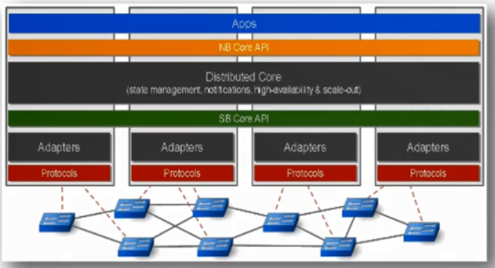

- ODL

  - 글로벌 벤더들이 주도한 오픈 소스 프로젝트
  - Southbound interface를 많이 제공

  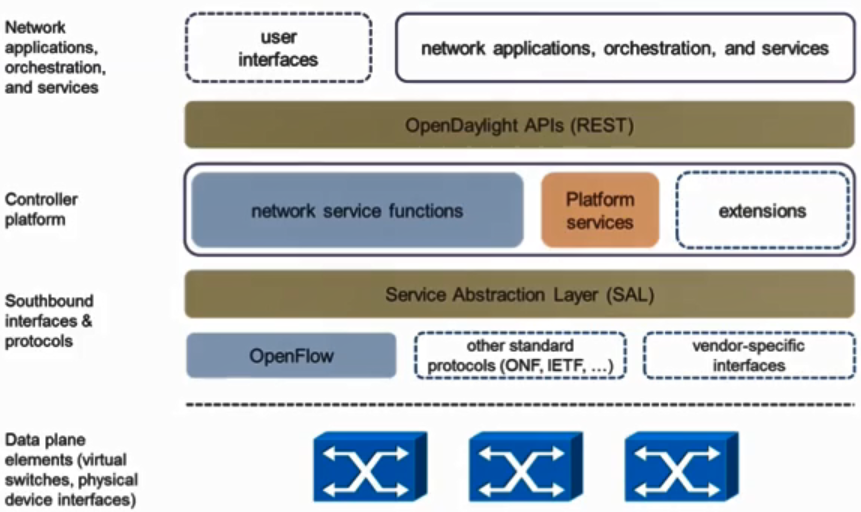

## Carrier Networking Functions

- OPNFV

  - NFV를 쉽게 하기 위한 인프라스트럭쳐를 설치하거나 function들을 개발하고 구축하는 것을 좀 더 쉽게하기 위한 오픈 소스 프로젝트
  - carrier-grade, integrated, 오픈 소스 플랫폼

  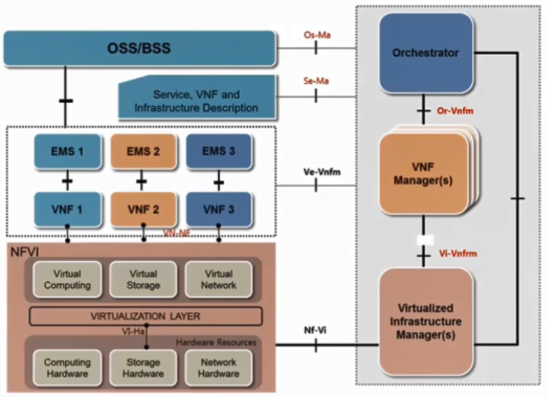

## Virtual Machines

- Xen Project

  - 컴퓨트 서버들을 가상화하는 핵심 오픈 소스 프로젝트
  - Supports multiple guest operating systems
    - Linux, Windows, NetBSD, FreeBSD
  - Supports multiple Cloud platforms
    - OpenStack, CLoudStack

  

- KVM(Kernel-based Virtual Machine)

  - 리눅스 커널 2.6.20부터 제공
    - 커널을 설치하면 KVM이 포함

  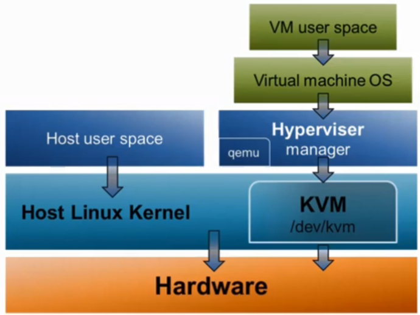

## Operating System

- Linux, FreeBSD
  - 무료로 제공

## Containers

- Docker

  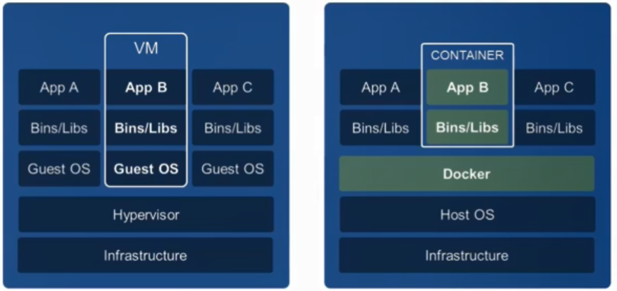

  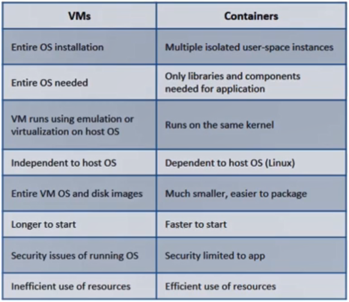

- VMs vs. Containers

  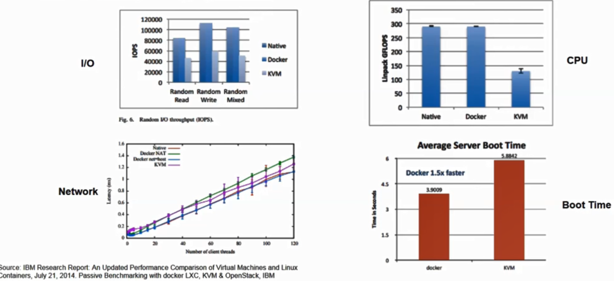

## VM/VI Managers

- Kubernetes

  - 컨테이너 관리하는데 사용하는 오픈 소스 프로젝트

- Apache Mesos

  - 가상 인프라스트럭쳐 관리
  - distributed systems kernel 오픈 소스 프로젝트
  - 컴퓨트 리소스들을 유용하게 관리하고 운영하는 툴

  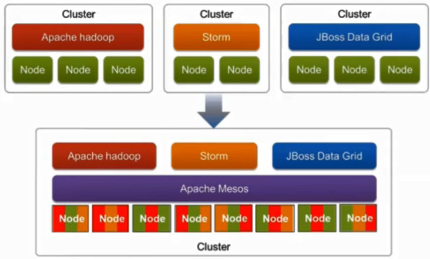

- OpenStack

  - 클라우드 컴퓨팅을 위한 소프트웨어 플랫폼 오픈 소스 프로젝트
  - compute, storage, networking 리소스들을 구축하고 운영하고 관리하는데 사용

  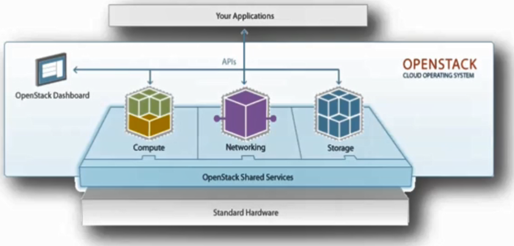

## Management & Orchestration

- Open Source MANO (OSM)

  - SDN/NFV를 구축하는데 사용
  - VIM은 오픈스택으로 구축하고 그 위는 MANO를 통해 관리

  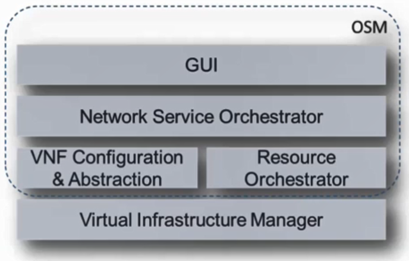

- Open Network Automation Platform(ONAP)

  - ECOMP와 Open-O를 합침

  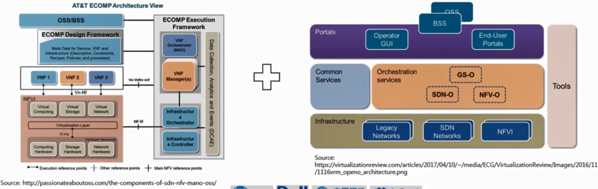

## Application Platforms

- Cloud Foundry

  - 클라우드 기반의 애플리케이션들을 쉽게 빌드하고 테스트하고 디플로이하는데 필요한 오픈 소스 프로젝트

  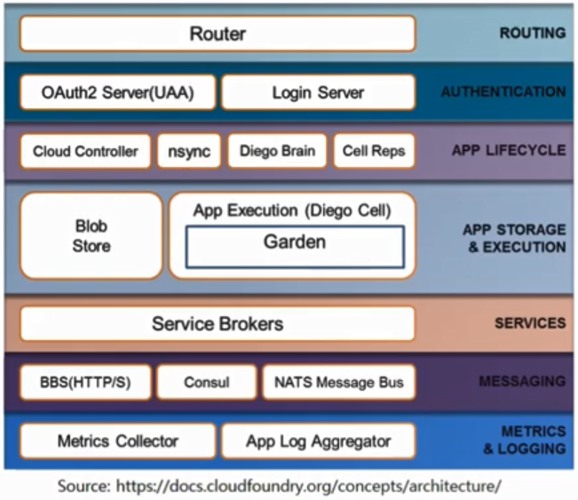

- OpenShift

  - 클라우드 PaaS 오픈 소스 프로젝트

  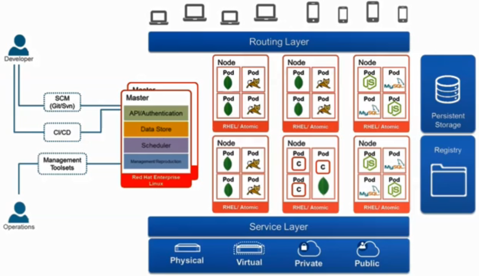

## Programming Frameworks

- Node.js, Django
  - 클라우드, 가상화 환경에서 쉽고 빠르게 개발할 수 있는 프레임워크를 제공하는 오픈 소스 프로젝트

## Open Source vs. Commercial Solutions

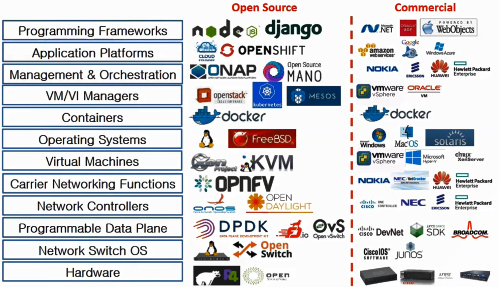

## A simple scenario for Open Networking Ecosystem

- Phase 1 - Infrastructure building & NFV Development

  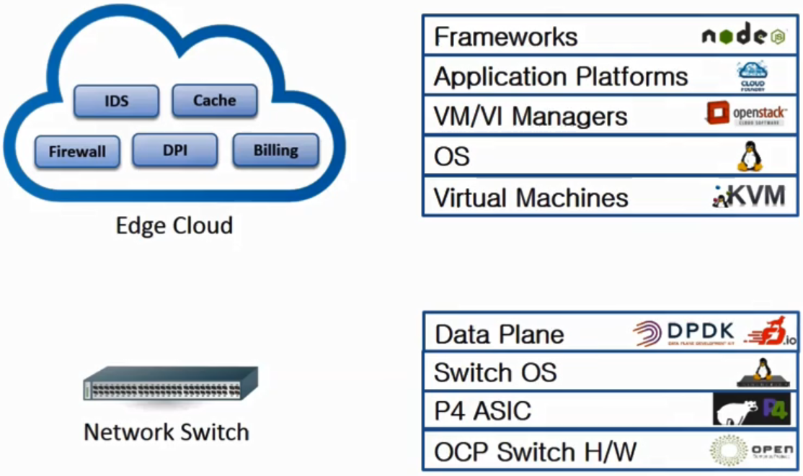

- Phase 2 - Network & Service Configuration

  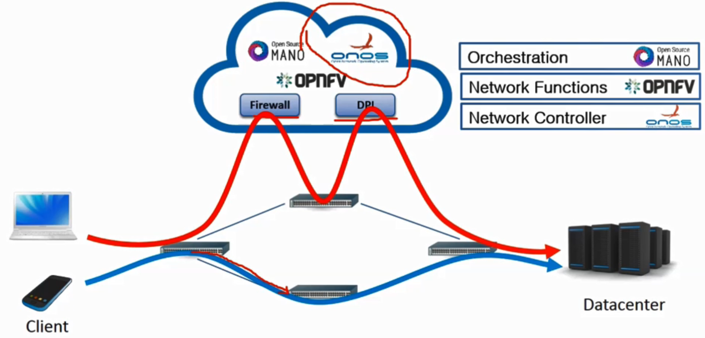

