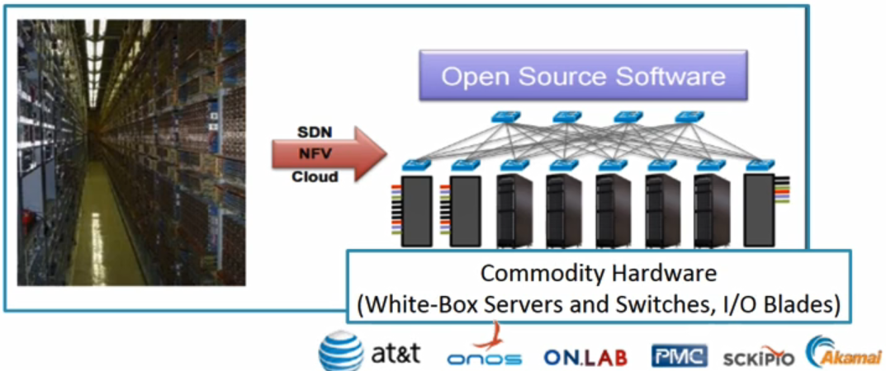
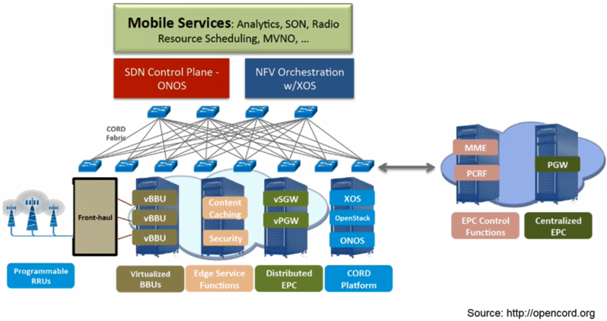
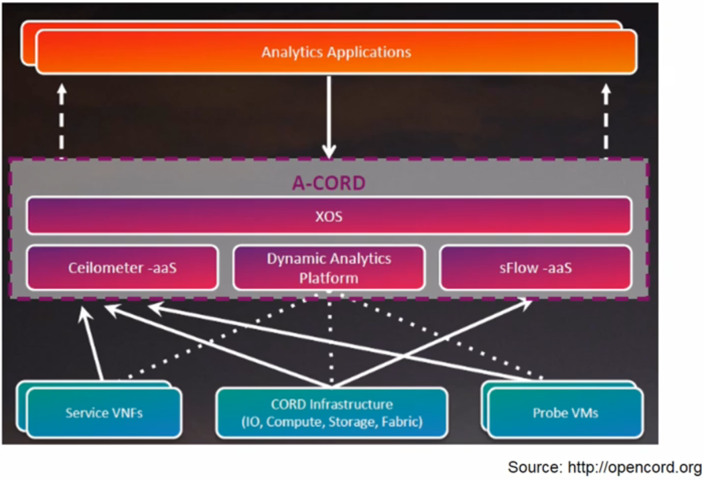
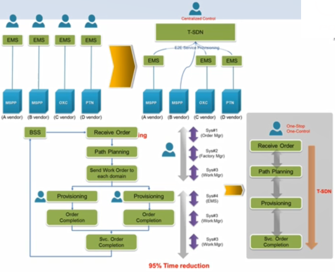

# SDN/NFV Use Cases

## ONOS CORD(Central Office Re-architected as a Datacenter)

- R-CORD(Residential CORD)

  - 가정집에 제공하는 서비스들에 필요한 인프라

  

- E-CORD(Enterprise CORD)

  - 기업, 공장에 필요한 서비스

  

- M-CORD

  

- A-CORD

  - 다양한 정보들을 분삭하는 CORD 환경 분석

  

## 실제 사례

- Transport SDN - KT

  - [Challenge 1] Complex transport network environment having multi-vendor/domain/layer devices
  - [Solution 1] Centralize device control and PCE over multi-vendor devices
  - [Challenge 2] OPEX increase by segmented operations
  - [Solution 2] Simplify and automate provisioning processes

  

- KT's T-SDN Platform

  