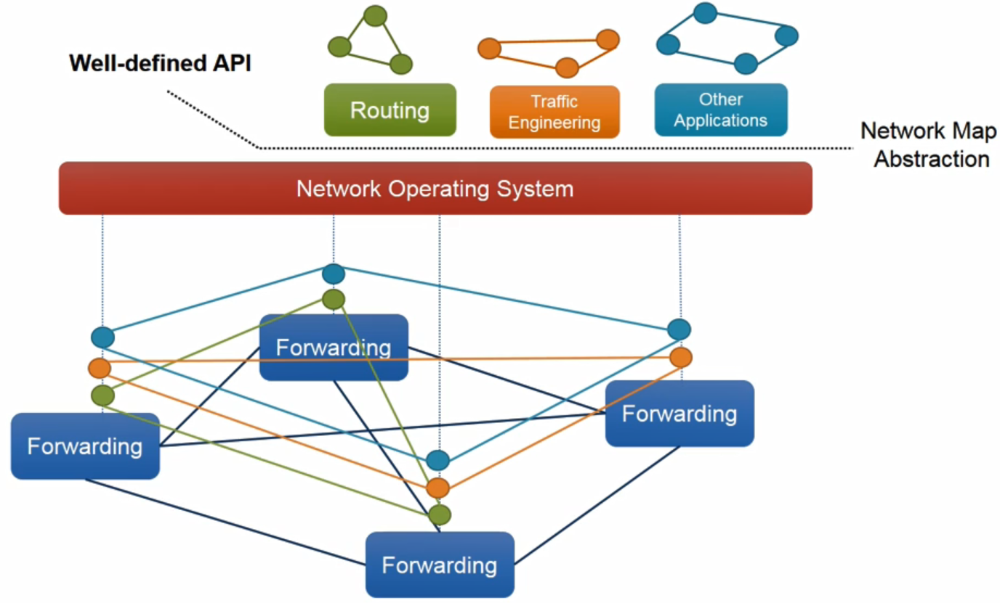

# 06. Introduction to SDN

## Background

- 클라우드 서비스가 각광을 받게 되면서 많은 데이터 센터 네트워크가 구축되었고 이런 데이터 센터에 맞는 새로운 네트워크 패러다임이 필요
- 데이터센터의 트래픽 패턴이 변화
  - North-south 95% -> East-west:40~80%
  - North-south는 데이터센터와 외부의 통신
  - East-west는 데이터센터 내부의 서버끼리 통신
- 데이터센터 네트워크
  - 데이터 센터 네트워크는 다량의 스위치와 서버로 구성된 **Hyper scale network**
  - 각 스위치는 테라바이트의 트래픽을 처리
  - 3~4  tier architecture로 구성
    - 50%가 넘는 네트워크 리소스는 스위치를 연결하는데 사용되어 비효율적
- 새로운 네트워크 패러다임이 필요한 이유
  - 벤더의 종속성
    - 기존의 벤더의 장비들은 오픈 인터페이스와 표준 API가 부재
    - 통신사가 장비를 수정할 수 없음
    - 새로운 서비스를 제공하려 프로토콜을 개발해도 적용되기 너무 오래걸림
  - Fundamental problems of IP protocols
    - 많은 RFC 프로토콜들을 장비에 넣어 개발
    - 다양한 부가기능에 대한 설계 미흡
      - Lack of IPv4 addresses
      - Security
      - Management
      - Mobile service
    - 현재 인터넷 망은 정적

## SDN Background

- 문제들을 해결하기 2012년에 구글이 자신들의 네트워크를 OpenFlow기반으로 교체하여 해결
- 오픈플로우는 SDN에서 사용되는 프로토콜 중 하나

## Traditional Network

- 분산 프로토콜 사용하여 네트워크를 운용
  - 관리하기 어려운 단점
  - 네트워크 장비에서 문제가 발생하면 어디서 발생한지 찾기 어려움

## SDN Concept

- Control and Data Plane Functions 분리

  

- SDN Switch(HW) and SDN Controller(SW)
- SDN 특징
  - control plane과 data plane의 분리
    - 네트워크 인텔리전스와 상태가 물리적으로 분리되어 있지만 논리적으로는 중앙 집중화 되어있음
    - 하위 네트워크 인프라가 어플리케이션으로 추상화되어 어플리케이션 개발자는 네트워크 장비에 대한 자세한 내용을 알 필요없이 어플리케이션 개발에만 집중
  - general purpose hardware 상에 제어 평면을 실행
    - 제어 평면에서 실행했던 기능을 특수한 네트워크 장비로부터 de-couple하여 상용 컴퓨터에서 제어 평면 기능을 실행
  - 데이터 평면에 대한 programmable을 제공
    - 중앙 엔티티에서 데이터 평면 상태를 유지, 제어, 프로그래밍 가능
    - 단일 네트워크 장비에 대한 제어 뿐만 아니라 전체 네트워크에 대한 제어를 가능

## SDN with Key Abstraction in the Control Plane

- SDN의 핵심은 제어 평면에서 데이터 평면을 제어하기 위해서 사용하는 SDN 프로토콜

  

- 네트워크 운영체제와 데이터 평면 사이에 위치한 인터페이스
  - South-bound Api
- 네트워크 운영체제와 어플리케이션 사이에 위치한 인터페이스
  - North-bound Api