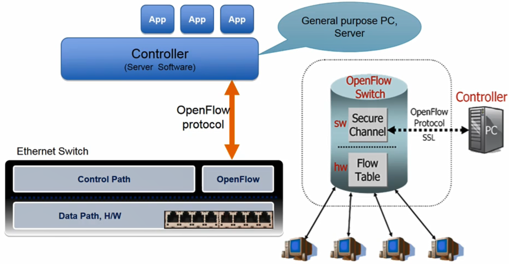
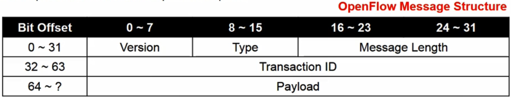
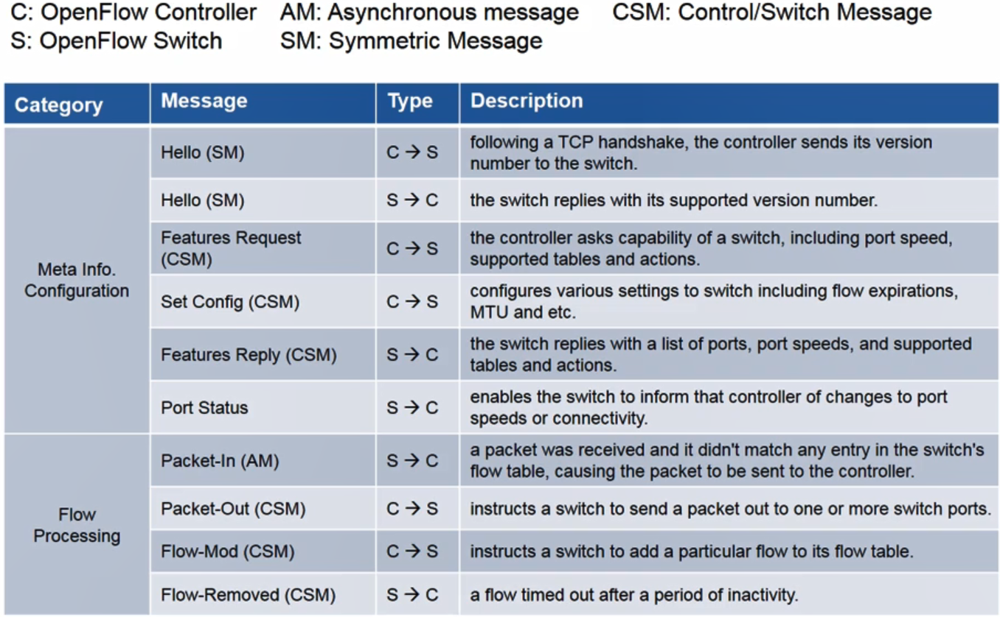

# 07. Introduction to OpenFlow

## SDN vs. OpenFlow

- ONF 정의
  - Software Defined Forwarding을 하는 네트워크 기술을 SDN이라 정의
    - open API를 통해 데이터 포워딩 제어
  - SDN은 관리 추상화 기능 제공
    - SDN의 추상화 기능을 통해 고급 어플리케이션 작성 가능
- SDN에서 OpenFlow 프로토콜을 가장 많이 사용
  - OpenFlow는 SDN 기술이지만 모든 SDN 기술이 OpenFlow를 사용하지는 않음
  - SDN에서 사용되는 수 많은 프로토콜 중 하나

## OpenFlow

- 네트워크 스위치 혹은 라우터의 데이터 평면에 접근해 제어하기 위한 통신 프로토콜
- 특징
  - 컴퓨팅관점에서 봤을 때 네트워크 제어를 위한 x86 instruction set과 흡사
  - control plane과 data plane을 분리
    - 오픈플로우 스위치의 데이터 평면은 여러개의 플로우 테이블을 포함하고 있으며 플로우 테이블은 또 여러 개의 플로우 엔트리로 구성
    - 오픈플로우 제어 평면에는 컨트롤러가 위치하며 컨트롤러를 통하여 운영자는 필요한 플로우 엔트리들을 스위치 플로우 테이블에 설치 가능
  - 오픈플로우는 내부 플로우 테이블을 보유하고 있으며, 표준화된 인터페이스로 플로우 엔트리 삭제,추가 및 변경
- Components
  - 오픈플로우 컨트롤러
    - Process packet match, instruction & action set, pipeline processing
  - 오픈플로우 스위치
    - secure channel, flow table

## 최초 오픈 플로우 스위치

- 일반 이더넷 스위치에 컨트롤러와 통신할 수 있는 에이전트를 포함한 펌웨어를 설치하여 실현

  

## 오픈플로우 지원 프로토콜

- 오픈플로우는 tcp 상에서 구현된 제어 프로토콜

- 컨트롤러는 TCP port 6633/6653을 통해 스위치와 통신

- 오픈플로우 메시지 구조

  - Type
    - 페이로드가 가변길이라 이것을 지정하기 위한 Message Length 필드 필요

  

## OpenFlow Protocol Messages

## OpenFlow Communication

