# 08. Flow Table, Group Table and Meter Table

## OpenFlow : Flow Table

- 스위치는 플로우 테이블을 가지며 플로우 테이블은 플로우 엔트리를 포함

- 플로우 엔트리는 스위치에 도달한 패킷을 어떻게 처리할지 정해진 룰

  - 매치와 인스트럭션으로 구성
    - 매치 필드는 L1 ~ L4에 이르는 패킷헤더의 내용을 포함
    - 패킷이 들어오면 플로우 테이블의 엔트리마다 패치 필드를 비교하여 매치되는 플로우 엔트리를 찾음
    - 찾은 플로우 엔트리에 정의된 인스트럭션으로 패킷을 처리

- Flow Table 예시

  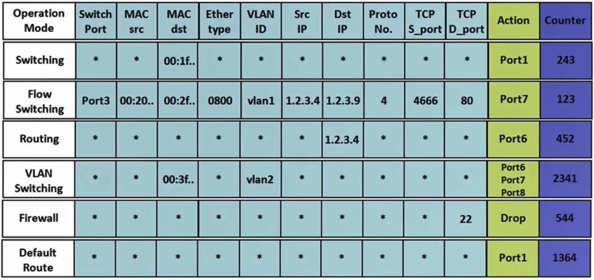

## Matching and Instruction Execution

- 플로우 엔트리에는 우선순위가 존재

  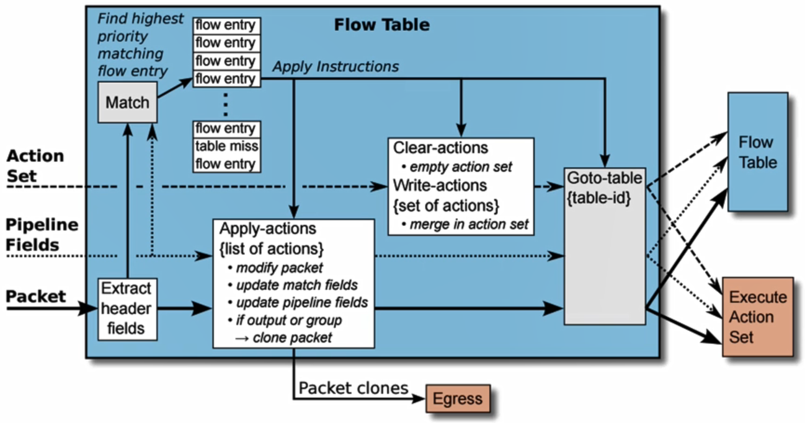

## Instructions & Actions in OpenFlow

- Instructions

  - 인스트럭션은 특정 패킷이 룰에 매칭이 되었을시 실행
  - 5가지 종류의 인스트럭션 존재
    - Meter meter_id : 매치가 된 패킷을 특정 미터 테이블로 이동
    - Apply-Actions : 액션셋에 정의된 액션들을 즉시 실행
    - Clear-Actions : 액션셋에 정의된 액션들을 모두 지움
    - Write-Actions : 액션셋에 새로운 액션을 추가하거나 업데이트하는 역할
    - Goto-Table : 매치가 된 패킷을 파이프라인을 통해 다음번 플로우 테이블이나 그룹테이블로 이동

  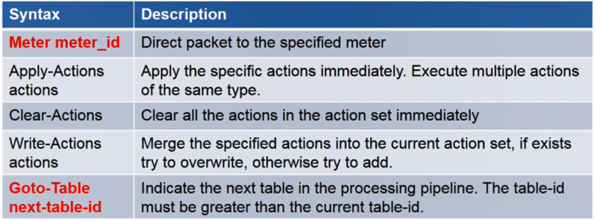

- Actions

  - 가장 대표적인 액션
    - set : 특정 필드에 새로운 값으로 세팅
    - qos : set_queue와 같은 QoS 액션을 패킷에 적용
    - group : 그룹 버킷에 정의한 액션을 순서대로 패킷에 적용
    - output : 매치된 패킷을 어떤 스위치 포트로 내보낼지 정의할 때 사용
    - push_MPLS : 스위치는 매치가 된 패킷에 MPLS 레이블을 추가하고 MPLS가 추가된 패킷은 추후에 MPLS 레이블을 제거하는 pop을 통해 레이블 제거
    - push_VLAN
    - pop

  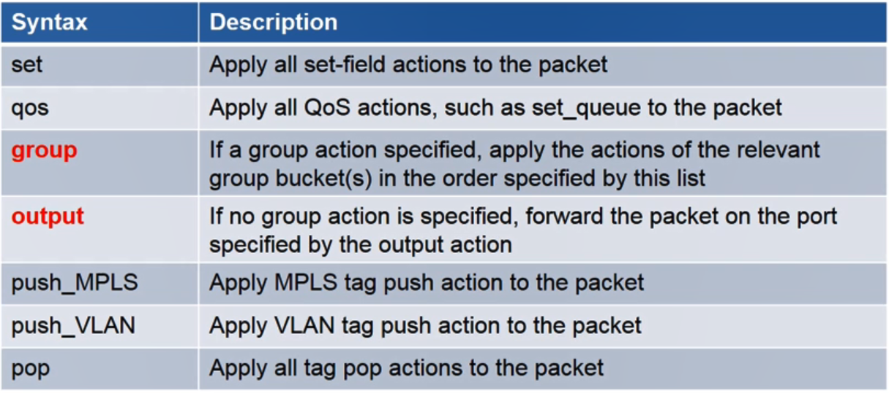

## OpenFlow Pipelining

- 오픈플로우 스위치에 위치한 플로우 테이블들은 순서를 가지고 있고 숫자 0으로부터 순번 시작
- 패킷은 플로우 테이블 숫자에 맞춰 순서대로 접근하여 플로우 엔트리와 매치 시도
- 오픈플로우 1.1부터 플로우 테이블 파이프 라인 기능 제공
  - 플로우 엔트리가 발견되면 해당 플로우 엔트리에 포함된 명령어 세트가 실행
  - goto-table로 명령어가 정의되어 있으면 다른 플로우 테이블로 보냄
  - 파이프라인은 앞으로만 패킷을 프로세싱하지 뒤로는 하지 않음
- 오픈플로우 1.5부터 Two stage pipeline processing 제공
  - Ingress processing
  - Egress processing

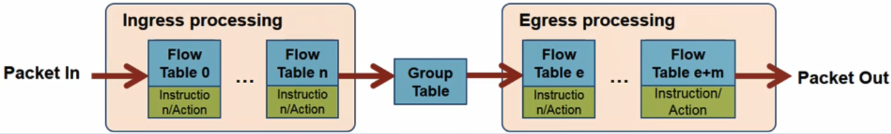

## OpenFlow Group Table

- 오픈플로우는 플로우 테이블말고도 그룹 테이블을 이용해 패킷을 효율적으로 포워딩

- Group Table & Types (version 1.1)

  - All: multicast
  - Select : load sharing
  - Indirect : simple indirection
  - Fast-failover : rerouting

  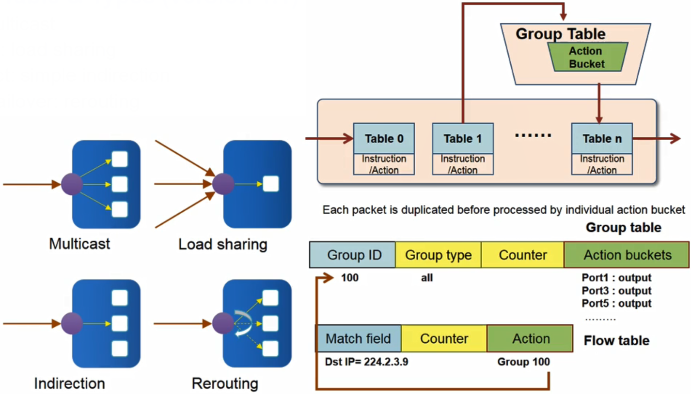

- **Multicast**

  - Type = all

  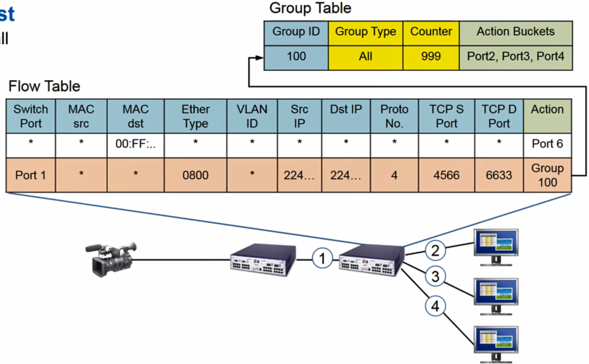

- **Load Balancing**

  - Type=select

  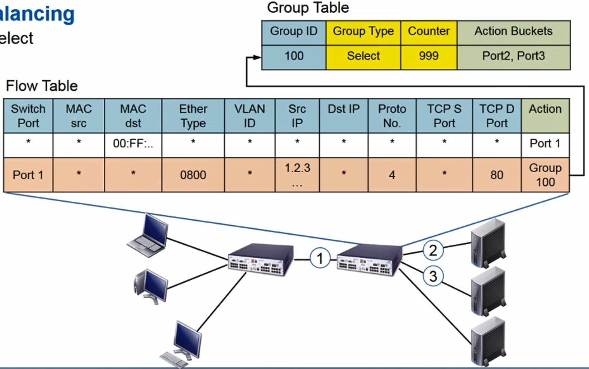

- **Indirection**

  - Type=indirect

  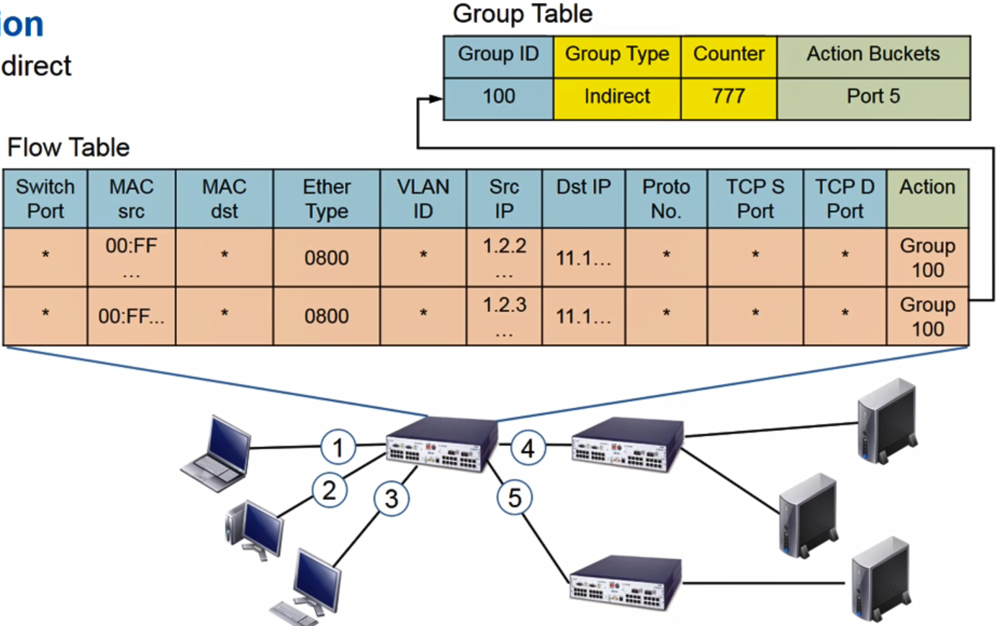

- **Fast Failover**

  - Type=fast-failover(ff)
  - 패킷 포워딩에 사용할 포트를 순차적으로 정의
    - 보통 프라이머리 포트가 항상 선택되어 패킷 포워딩에 사용
    - 프라이머리 포트가 정상적으로 수행되지 않을 시 세컨더리 포트가 사용

  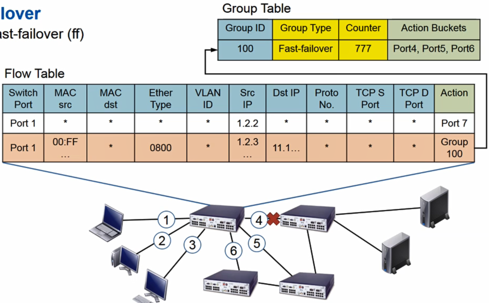

## OpenFlow Meter Table

- Meter Table(ver 1.3)

  - 미터테이블은 트래픽의 QoS를 보장하기 위해 설계

  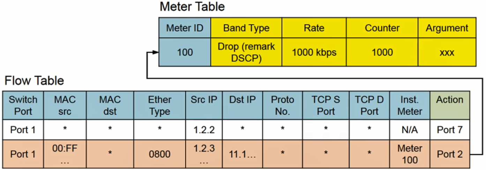