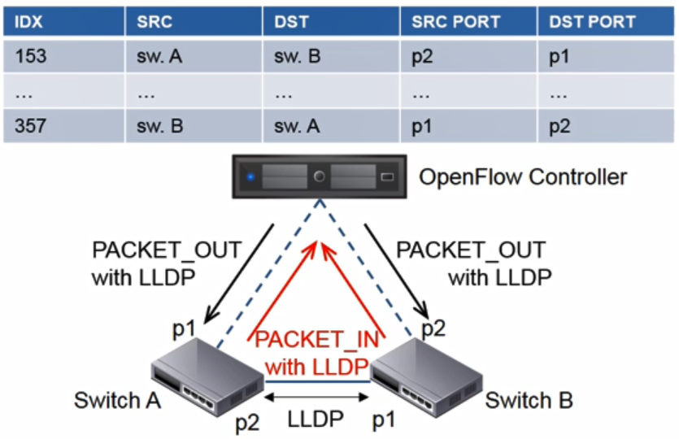
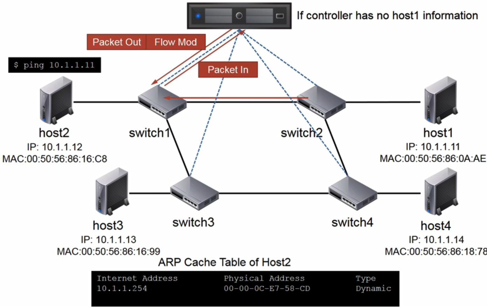
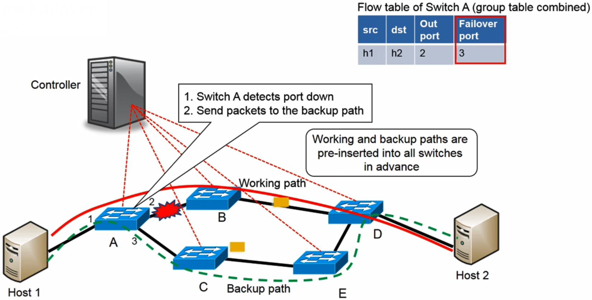
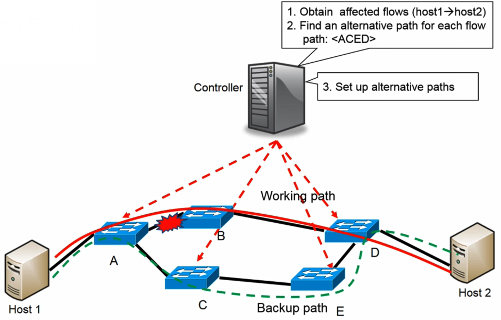

# 09. Operations in OpenFlow

## Packet Forwarding in OpenFlow

- Packet Forwarding 방법

  - Reactive flow insertion
  - Proactive flow insertion

  

## Topology Discovery in OpenFlow

- 컨트롤러가 어떻게 오프플로우 네트워크에 위치한 스위치들과 경로들을 파악하는지

- Open Flow Discovery Protocol (OFDP)

  - 링크를 디스커버리하기 위해 토폴로지 정보를 만들어줌
  - 전체 네트워크 뷰를 construct

- 방법

  - Link Layer Discovery Protocol(LLDP) 프로토콜을 Packet-Out 페이로드에 포함하여 전송

  

## Communication in Legacy Network

- Legacy 네트워크에서 어떻게 커뮤니케이션이 일어나는지

  

## Communication in OpenFlow

- OpenFlow 네트워크에서의 커뮤니케이션

  

## OpenFlow Failover

- 오픈플로우 네트워크에서 장애 복구 방법

  - Protection
  - Restoration

- **Protection**

  - 빠른 장애 복구 가능
  - 컨트롤러 개입 없이 장애 처리
  - 프라이머리 패스만 전송하는 것이 아닌 백업 패스도 함께 전송

  

- **Restoration**

  - 컨트롤러 개입 필요
  - Port down & Link down Message를 컨트롤러에게 전송해 새로운 패스 설정

  

## Packet Processing Flowchart in OF Switch

