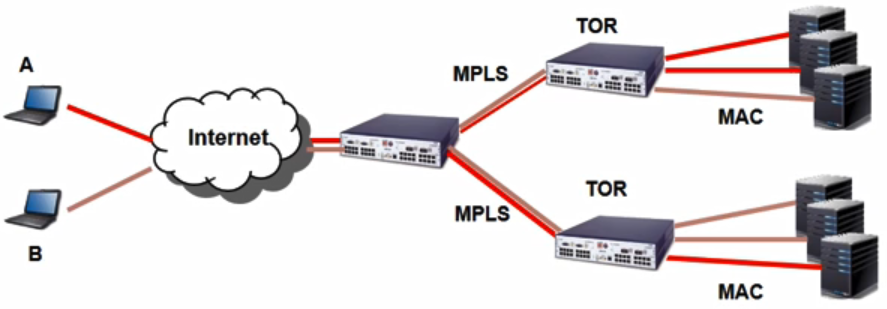

# 10. SDN Applications

## OpenFlow Example

- OpenFlow를 활용한 hop-by-hop routing

  - 서비스 체이닝(Service Chaining) : Firewall -> AAA -> Web Server

  

## Example : Kanazawa General Hospital (with NEC solution)

- Kanazawa 데몬에서 오픈플로우 스위치를 도입하기 전 네트워크 토폴로지

- 비싼 방화벽을 응급실과 수술실에 설치해야 함

  

- 오픈플로우를 도입하면 방화벽같은 네트워크 기능들을 한 곳에서 집중적으로 관리 가능

- 장애 복구 속도도 빨라짐

  

## MPLS using OpenFlow

- MPLS 기능을 이용하여 MPLS 라우팅 과정 도식화
- 

## VLAN using OpenFlow

- VLAN은 네트워크 isolation 및 가상화 목적으로 사용되는 프로토콜

  - 각 테넌트 별로 L2 브로드캐스트 도메인을 isolate하여 제공

- 오픈플로우는 VLAN 태그를 지원하여 오픈플로우 스위치에서 VLAN ID 매칭 및 설정을 할 수 있음

- VLAN의 문제점

  - VLAN ID 필드의 크기 문제로 클라우드 컴퓨팅 환경에서 다량의 테넌트를 지원할 수 없다는 한계를 가짐

- Solutions

  - VLAN ID를 확장한 VxLAN

  

### VLAN implementation with OpenFlow

- 오픈플로우는 가상 네트워크를 구분하기 위해 VLAN ID 뿐만 아니라 출발지 및 목적지 맥 주소를 사용할 수 있음

- VLAN과 같이 MPLS 레이블을 사용할 경우 보다 많은 갯수의 테넌트 네트워크를 지원

  

## Google SDN

- SDN을 도입한 계기
  - 구글 IP  트래픽
    - 해마다 40~45% 트래픽이 증가
      - 전체 인터넷 트래픽에서 10%를 차지
  - 36개 이상의 데이터 센터를 운영
    - 데이터 센터는 인터넷에 연결된 상태로 데이터 센터끼리 통신이 가능
  - 각 데이터 센터 사이의 동기화 속도를 높이기 위하여 데이터 센터는 해저 케이블을 통해 연결
    - 광케이블로 이루어진 전용선
      - 기존 네트워크 환경에서 케이블의 링크 utilization은 30~40% 정도 
- 문제점
  - 각 WAN Router는 트래픽을 동일시하여 처리
  - 링크 utilization이 너무 낮으
  - 멀티 벤더에서 생산한 라우터와 스위치를 사용하여 각각의 장비를 수동으로 관리하기 힘듬
  - 높은 가용성을 지원하는 상용 라우터는 단가가 비싸고 해마다 증가하는 트래픽을 처리하기 위해 값 비싼 장비를 제공해야 함
- SDN상에서 새로운 트래픽 엔지니어링 방법을 제안 및  도입
  - IP 기반의 WAN에서 발생하는 문제들을 깔끔히 해결
  - 상용 라우터들이 나날이 증가되는 구글의 트래픽을 처리할 수 없었지만 SDN 방법을 활용하여 네트워크 장비를 직접 제작하여 문제 해결
- B4 SDN
  - 구글에서 사용하는 어플리케이션 트래픽을 3가지 카테고리로 구분하여 관리
    - 사용자 트래픽(gmail, youtube) : QoS와 직결되는 트래픽이기 때문에 높은 우선순위로 전달
    - 빅데이터 분석에 사용되는 스토리지 접근 트래픽 : 우선순위가 사용자 트래픽보다 낮음
    - 멀티 데이터 센터 사이 동기화를 위해 사용되는 트래픽 : 우선순위가 가장 낮음
- OpenFlow Switch 제작
  - 구글은 자체적으로 B4 SDN 구축을 위해 제작
  - 스위치는 오픈플로우 에이전트가 설치되어 동작
- Design
  - 해저 케이블의 utilization을 높이기 위하여 새로운 SDN 기반으로 트래픽 엔지니어링 방법을 제안
  - 이를 통해 utilization ratio를 90%이상으로 올림
  - 트래픽 엔지니어링 알고리즘
    - 오픈플로우 컨트롤러 상에서 동작
    - Uses ECMP
    - 분산처리가 가능한 ONIX 분산 SDN 컨트롤러를 개발
      - ONIX는 대규모 SDN 네트워크 관리를 목표로 개발된 상용 컨트롤러