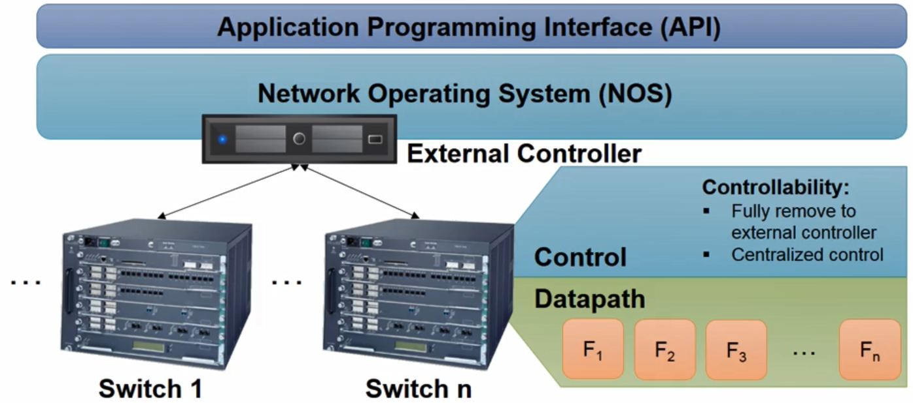
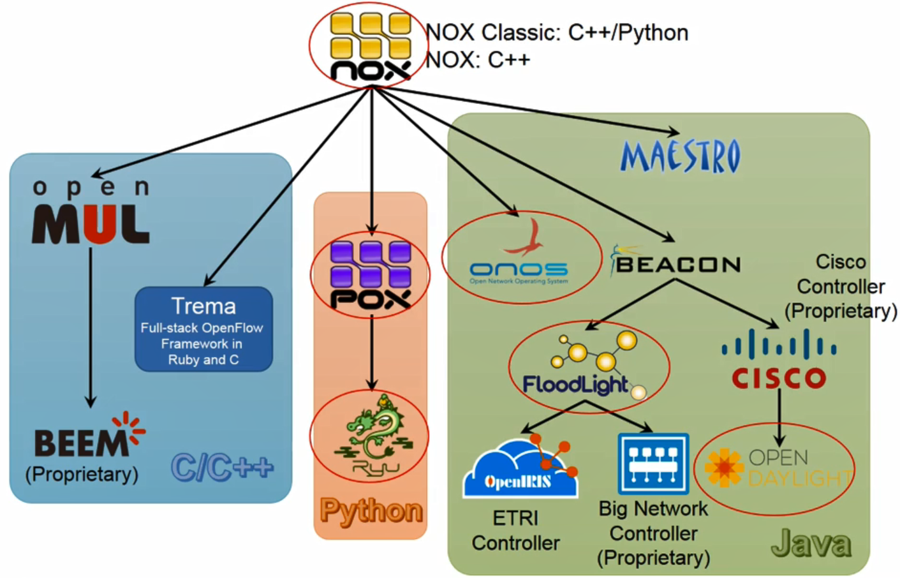
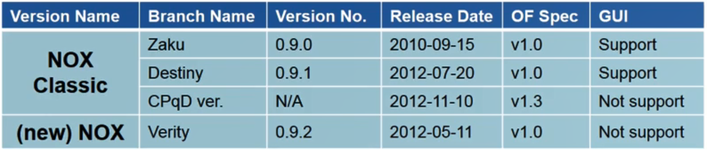
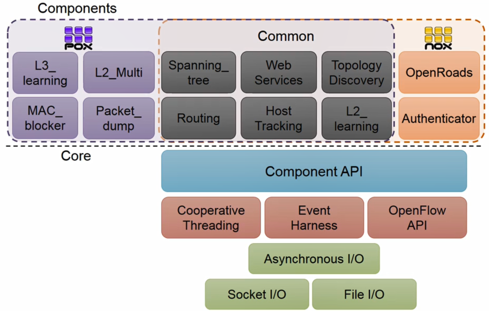

# 11. SDN Controllers 1

## Introduction to OpenFlow Controller

- Problem Statement

  - 기존 네트워크 장비에는 제어평면과 데이터평면이 같이 있기 때문에 제어평면에서 VNTag, TrustSet과 같은 새로운 기능을 추가할 경우 장비에 대한 수정이 필요한데 상용화하는데 시간이 많이 걸림
  - 네트워크 측면에서 제어 및 네트워크 주상화를 제공하는 프로그램 부재
    - 프로그래밍 방식으로 네트워크를 교체하기 어려움
  - 분산된 방식으로 네트워크를 제어하여 전체 네트워크 제어성이 많이 떨어짐
  - 이러한 문제를 해결하기 위하여 논리적 중앙 집중적 방식으로 네트워크를 제어할 수 있는 SDN Controller가 제안
    - SDN Controller와 Network Management Syste(NMS)의 차이점
      - NMS는 네트워크를 관리하기 위하여 설계가 된 시스템으로 SNMP, NetConf 등 인터페이스를 통해 네트워크 메트릭을 수집하고  네트워크 장치 설정을 바꾸는 작업만 수행
      - 실제 패킷 혹은 플로우 수준의 제어는 불가능

- Solution

  - 해결책으로 Network Operating System(NOS)가 제안되었음
    - 일관되고 중앙 집중화된 프로그래밍 인터페이스를 통하여 전체 네트워크를 제어하는 것을 목표로 하고 있음
  - NOS는 직접 네트워크를 제어하는 로직은 포함하지 않고 대신 네트워크를 제어하기 위한 다양한 프로그래밍 인터페이스를 제공

  

## Pedigree Chart of OpenFlow Controllers

- NOX는 최초로 개발된 오픈플로우 컨트롤러

  

## Nox Classic vs NOX

- NOX는 배포된 시점을 기준으로 NOX Classic과 (new) NOX로 구분

  

- NOX-Classic

  - C와 C++로 구현된 컨트롤러
  - 성능이 많이 떨어짐

- NOX

  - 기능은 NOX-Classic과 비슷하나 성능 개선을 목표로 개발
  - source에 대한 리팩토링을 거쳐 가독성을 높임
  - NOX-Classic과 다르게 GUI 제공하지 않음

## POX Overview

- POX는 NOX의 Python 버전
- 빠르게 puc 애플리케이션을 만들기 위한 목적으로 설계 및 개발
- POX 성능은 Python의 한계 때문에 C나 자바보다 떨어짐
  - PyPy를 이용하여 일부 성능 개선 가능
- 모든 운영체제에서 동작 가능

## NOX/POX Overview

- Components

  - Network Application Services
    - 네트워크를 제어하기 위한 다양한 사용자 어플리케이션들이 위치
  - Northbound API
    - 여러 네트워크 어플리케이션들을 통하여 네트워크를 제어할 수 있는 다양한 인터페이스 API 제공
    - 표준화가 이루어지지 않음
      - 각 컨트롤러마다 서로 다른 API 제공
  - NOX Controller - Network OS
    - 시스템 측면에서 네트워크 추상화 제공
    - 복잡한 네트워킹 문제를 소프트웨어로 단순화하는 역할
  - Southbound API
    - 표준 오픈플로우 프로토콜 지원
  - OpenFlow Enabled Switchs

  

## NOX/POX Architecture

